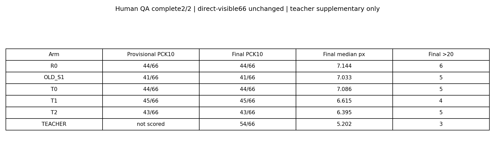
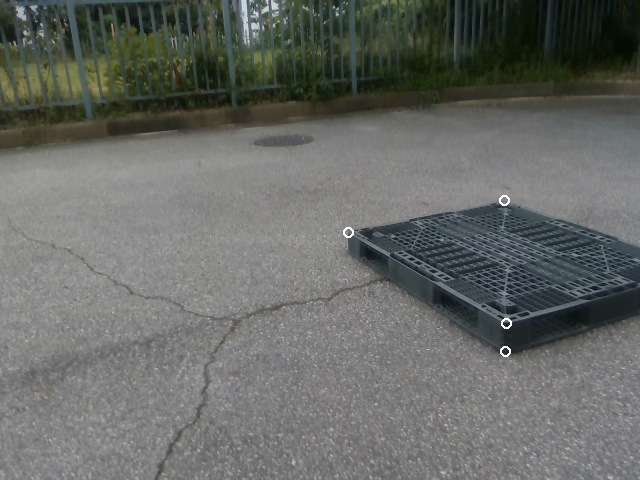
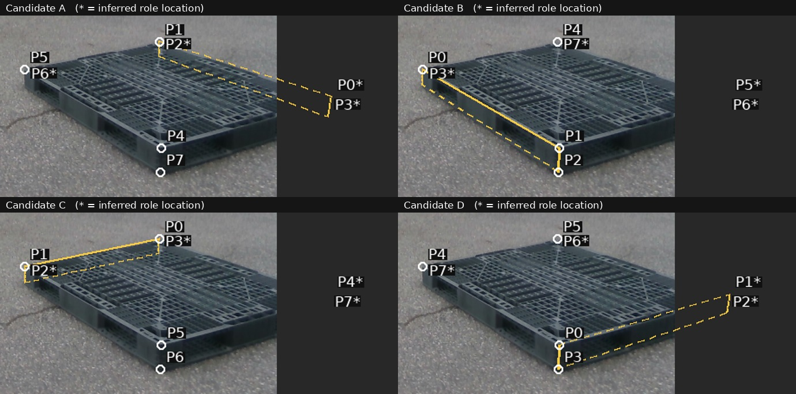
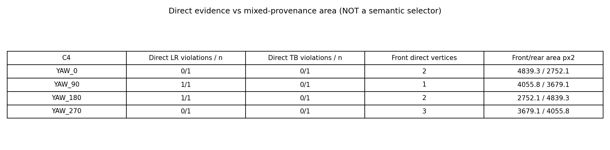
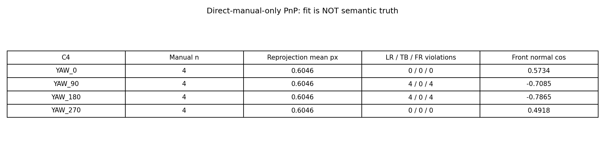
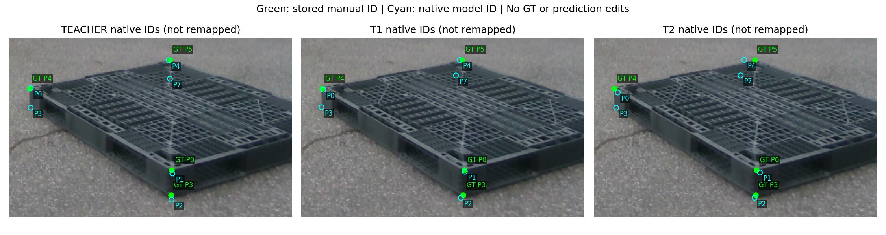
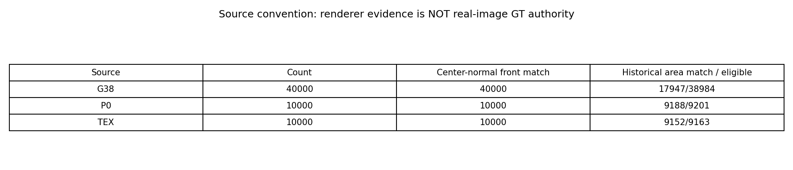
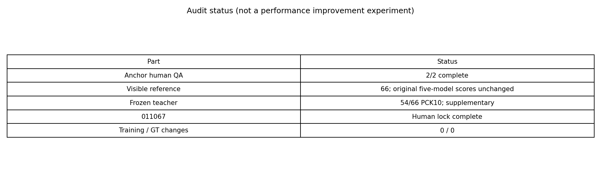

# 011067 camera-facing corner-role contract audit

STATUS: **COMPLETED_CONTRACT_DIAGNOSTIC**
HEAD_BEFORE: `b2d12428db96fef1d097557023aeecd8f3ba41dc`

## 1. 결론

Q1은 완료했습니다. 실제 사람 QA 2/2를 반영해도 직접 보임 66점과 다섯 모델의 기존 평가 수치·결론이 유지됐습니다.
Q2의 최종 판정: **MIXED_UNRESOLVED**.
NEW TRAINING=0 / OPTIMIZER STEP=0 / NEW PSEUDO LABEL=0 / THRESHOLD·SELECTOR TUNING=0 / GT AUTO-EDIT=0.

## 2. verified anchor metadata QA

첫 점은 EXTERNAL_OCCLUDED→UNCERTAIN으로 바뀌어 계속 제외, 둘째 점은 DIRECT_VISIBLE과 좌표를 유지했습니다. 옛 visibility는 trigger일 뿐 authority로 쓰지 않았습니다.
최종 DIRECT_VISIBLE=66, 잠정 대비 변화=0. 선정18장, 저장16장, 최종평가16장/6 recording. 기존 잠정 artifact는 해시 불변입니다.

| 모델 | PCK10 | median px | P90 px | >20px |
|---|---:|---:|---:|---:|
|R0|44/66 (66.67%)|7.144|18.390|6|
|OLD_S1|41/66 (62.12%)|7.033|17.453|5|
|T0|44/66 (66.67%)|7.086|17.880|5|
|T1|45/66 (68.18%)|6.615|19.329|4|
|T2|43/66 (65.15%)|6.395|19.755|5|
|TEACHER (supplement)|54/66 (81.82%)|5.202|13.409|3|

교사 coverage: {'available': 16, 'total': 16} frames; {'available': 66, 'total': 66} points. Winner 선정에는 사용하지 않았습니다.
[최종 평가 상세/난도·corner·recording·pairwise·LORO](../pallet_verified_anchor_v1/EVALUATION_REPORT_FINAL_KO.md)

## 3. 왜 011067인가

기존 H36 진단에서 T2는 33/36을10px 이내로 맞췄고 >20px3점은 이 한 프레임 P0/P3/P4입니다. 기존 same-ID 오차는176.92/183.28/147.88px, 각각128회 감독됐습니다.
좌표 전달은 약1e-5px 정밀도로 일치하며, 최종 체크포인트 probe에서 OKS항은 포화 경향이지만 RLE gradient는 살아 있습니다. 이는 학습 전체 gradient trajectory를 복원한 검사가 아닙니다.
[이전 3점 분석 근거](../pallet_existing_data_transfer_v1/THREE_CORNER_ANALYSIS_KO.md). 이번 whole-role 모델 비교는 사람 판단 잠금 후에만 실행합니다.

## 4. convention inventory

[상세 정의 표](CONVENTION_INVENTORY.md). 주석 도구의 near/front와 옛 면적 규칙, renderer source의 center-normal 최대 규칙, 논문의 physical yaw equivalence를 동일시하지 않습니다.

## 5. annotation provenance

직접 수동 클릭은 P0/P3/P4/P5 네 점입니다. 실제 T2 support는 P0/P3/P4 세 점입니다. P5가 감독에서 빠졌다는 사실을 수동 클릭 부재로 오해하지 않습니다.
P1/P2/P6/P7은 PnP 보완, P8은 자동 중심입니다. P1/P2는 이미지 밖입니다. 기존 migration/manual-review/axis 미확인 flag는 GT 오류의 증거가 아닙니다.
[점별 출처와 support](ANNOTATION_PROVENANCE.json)

## 6. valid C4 candidates

0/90/180/270 proper yaw rotation에서 3D coordinate-set matching으로 순열을 생성했습니다. bijection, P8 고정, det=+1, edge graph/top-bottom 보존 및 FRAME_CONVENTION 표 일치를 검사했습니다.
90/270은 역할 좌표계 변환에 맞춰 W/D를 바꿉니다. 직사각 물체의 물리적90도 대칭이나 성능 채점 자유도를 추가한 것이 아닙니다. Hungarian/점별 nearest 대응은 사용하지 않았습니다.
사용자 질문으로 명확히 구분한 규약: 논문의 canonical yaw180 동치에서는 후보 A/B와 C/D가 각각 쌍을 이룹니다. 한 쌍 안의 둘을 모두 인정하는 것과 네 역할 후보를 전부 같은 정답으로 채점하는 것은 다릅니다. 이 대화의 대칭 주장을 실제 6D 성능 측정으로 대체하지 않습니다. 고정-ID 2D 평가도 변경하지 않았습니다.
[C4 생성/검증 결과](C4_CANDIDATES.json)

흰 원만 직접 클릭입니다. *번호와 점선은 기존 PnP 보완 위치에 따른 역할 표시로 독립 시각 근거가 아닙니다. 모든 패널은 같은 RGB/영역이며 오른쪽 회색 영역은 원영상 밖입니다.

## 7. geometry-only evidence

YAW_0와 YAW_270은 직접 클릭에서 검사 가능한 LR/TB를 모두 통과합니다. 다른 두 후보는 LR 위반이 있습니다. 2D로 실제 앞뒤 깊이를 확정하지 않았습니다.
독립 historical area 상태: **AREA_RULE_INDEPENDENT_UNAVAILABLE**. 원래 cuboid/keypoints_3d_world가 없고 면 일부는 PnP 보완점입니다.
해석용 cuboid + 저장된 혼합 출처 좌표에 exact converter를 적용한 보조값은 YAW_0, axis area diff 2087.144px², 두 axis 차이 1710.453px²입니다. 독립 증거 또는 GT 판정에 사용하지 않습니다.

## 8. PnP diagnostic

K/치수와 직접 수동4점만 SQPNP→LM으로 풀었습니다. projected/extrapolated 점을 fitting에 넣지 않았습니다. 네 후보의 평균 재투영 오차는 모두 약0.604574px입니다.
YAW_0와 YAW_270은 LR/TB/FR 모두0 위반입니다. PnP 잔차가 의미 front를 유일하게 정하지 못함을 보여주며, 새6D 정답으로 사용하지 않습니다.

## 9. human front-role review

사용자는 대화에서 camera-facing 번호 배치로 B를 선택하고 대신 기록해 달라고 요청했습니다. 선택 출처는 `explicit user chat selection transcribed by assistant`, 확신 수준은 **NOT_REPORTED**입니다. assistant가 이미지를 보고 선택하거나 CONFIDENT/UNCERTAIN을 추측하지 않았습니다. 추가 클릭은 요구하지 않습니다. 후보의 180도 대응관계도 대화에서 설명했으므로 최종 확인이 완전한 blind review였다고 주장하지 않습니다.

[사람 결과](HUMAN_REVIEW_PUBLIC_SUMMARY.json)
이전 대화에서 모델과 GT를 이미 본 이력이 있습니다. 새 UI 표시를 가렸다고 사람/분석자가 과거 예측에 노출되지 않았다고 주장하지 않습니다.

## 10. teacher/T1/T2 role tendency

|모델|저장된 ID 평균 px|저장된 ID의 C2만 허용한 진단 평균 px|전체 C4 사후 최소 평균 px|2위와 차이 px|
|---|---:|---:|---:|---:|
|TEACHER|182.099|182.099|3.006|179.093|
|T1|171.466|167.744|2.690|165.054|
|T2|166.768|165.564|6.261|159.303|

직접 수동4점(P0/P3/P4/P5) 전체를 한 번에 비교했습니다. 세 모델 모두 prediction을 저장된 번호로 옮기는 최적 순열은 YAW_90입니다. 그 역변환인 **native model role은 저장된 번호 대비 YAW_270**이며 사용자가 고른 B 배치에 해당합니다. 따라서 순열 방향을 무시하고 “모델은 A를 골랐다”라고 읽으면 안 됩니다. B 역할로 해석한 수동 위치와 native 예측의 평균 차이도 위 C4 최소와 같습니다. **GT를 수정한 결과가 아니며, 이 표는 실제 성능 향상/PCK/6D 점수가 아닙니다.** 180도 C2만으로는 저장된 ID와의 큰 차이가 사라지지 않습니다.

[전체 C4 사후 진단](MODEL_ROLE_DIAGNOSTIC.json)

## 11. final root cause

**MIXED_UNRESOLVED**, secondary=CONVENTION_PROVENANCE_MIX_SIGNAL.
관측상으로는 **사용자가 지지한 B 역할과 모델 출력은 가깝고 저장된 역할과는 다르다**는 점이 확인됐습니다. 따라서 단순 위치 복구 실패만으로 설명하면 안 됩니다. 다만 geometry는 두 역할을 허용하고, 사람 확신은 별도 보고되지 않았으며, real annotation의 생성 규칙과 renderer writer가 완전히 입증되지 않아 label-role 오류/학습 실패 중 하나를 인과적으로 확정하지 않습니다. MIXED_UNRESOLVED는 분석 미실행이 아니라 이 한계까지 포함한 완료 판정입니다.

기존 renderer60k 감사는 물체 중심→카메라 방향 기준 측면 normal 최대가60000/60000과 일치했습니다. 옛 area 규칙과 일치율이 다른 것은 확인됐지만 renderer writer를 확보했다거나 real011067의 정답을 결정했다는 뜻은 아닙니다. 이번에는 기존 감사 파일·결과 해시를 재검증했고 원본60k를 새로 전수 재검사한 것은 아닙니다.

## 12. 다음 딱 한 실험

DESIGN ONLY: read-only whole-role audit of same annotation-provenance cohort, preserving fixed-ID scores and separating manual evidence from projected completions; no relabel or training.

## 13. 한계

한 장, camera-facing semantic ambiguity, 일부 PnP completion, 수동점은 독립6D GT가 아님, 이전 모델 노출, 재사용 TRAIN/DEV 진단. 사후 best C4를 실제 성능으로 보고하지 않습니다.

## 14. 재현

[입력 해시](INPUT_BINDINGS.json) / [검사 상태](AUDIT.json) / [실행 순서](../../../scripts/research/pallet_011067_corner_contract_v1/README.md).
private 좌표/무작위 후보 대응표/원본RGB/checkpoint/cache는 commit 대상이 아닙니다. 공개 보고서·파생 그림·집계·코드만 대상입니다.

