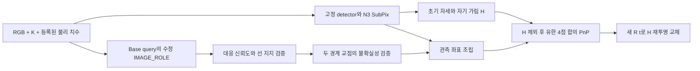

고정 RGB/N3 추정기에 경계 관측 검증과 자세 보정을 연결한 별도 연구 경로입니다. 새 모델 학습 없이 이미 수정 감독으로 학습한 마지막 IMAGE_ROLE을 사용합니다. 실제 성능과 한계는 [RESULT_KO.md](RESULT_KO.md), 재현·검산은 [REPRODUCE.md](REPRODUCE.md)에 기록합니다.

이 경로는 코너 ID마다 독립 RGB 좌표, 두 경계의 검증된 교점, 최종 자세에서 얻은 재투영을 구분합니다. 교점은 충분히 떨어진 최소 3개 대응점으로 지지되는 두 선에서 얻고 불확실성과 외삽을 검사합니다. 주경로에서 경계 관측으로 대체하지 못한 비가림 코너는 고정 N3의 독립 RGB 관측을 사용합니다. 경계 관측만 쓰는 절제도 별도로 제공합니다.



새 자세를 구하지 못하면 전체 N3 출력과 초기 자세를 반환하고 `N3_BASELINE_FALLBACK`으로 기록합니다. 초기 자세도 없으면 `POSE_FAILURE`입니다. 마스크가 바뀌었다는 사실은 프레임 실패 조건이 아닙니다. 자기 가림 좌표는 최종 fit에서 제외하며 새 자세가 나오면 반드시 재투영으로 교체합니다. 재투영을 다시 독립 관측으로 fit하지 않습니다.

사용 API는 `scripts.research.pallet_boundary_corner_refiner_20261010_v2.deployment.Pipeline`입니다. `predict(image, K, xyz, metadata=None)`에 원본 해상도의 uint8 BGR 영상, 같은 픽셀계의 3×3 K, 물리 `(width, height, depth)` 미터 치수를 전달합니다. 치수는 기존 registry의 한 객체를 식별해야 하며 필요한 경우 `metadata={"object_type": ...}`를 지정합니다. 일반 팔레트 자산에 대한 무제한 적용은 검증하지 않았습니다. [deployment](deployment/BUNDLE.json)에 기존 수정 IMAGE_ROLE의 28,068바이트 체크포인트와 완료 영수증을 바이트 그대로 제공하므로 RAM 작업 폴더가 없어져도 작은 경계 head는 사용할 수 있습니다. Base/N3 전체 가중치와 원래 실행 의존성은 별도로 필요합니다.

```python
from scripts.research.pallet_boundary_corner_refiner_20261010_v2 import common
from scripts.research.pallet_boundary_corner_refiner_20261010_v2.deployment import Pipeline

args = common.parser("deployment").parse_args([
    "--source-root", SOURCE_ROOT,
    "--baseline-root", IMMUTABLE_BASELINE_ROOT,
    "--fits", CORRECTED_FITS,
    "--calibration", CALIBRATION_JSON,
    "--output", NEW_OUTPUT_DIRECTORY,
])
with Pipeline(args) as pipeline:
    result = pipeline.predict(image_bgr, K, physical_whd_m)
```

`result`에는 최종 좌표와 R,t, 관측 출처, solver의 입력·inlier ID, 자기 가림 초기/후 집합, 교점 채택/거절 사유, 후보 score/class/box 보존 정보가 있습니다. 실제 배포 API는 평가 cohort·사람 가림 주석·proxy GT를 입력으로 요구하지 않습니다. 모델과 기존 추정기 실행 코드는 외부 의존성이며 공개 가중치 SHA를 만족해야 합니다.

한 프로세스에서는 Pipeline 한 개를 유지하고 여러 영상에 `predict`를 호출합니다. 닫은 뒤 새 인스턴스를 순서대로 생성할 수 있습니다. 배포 facade는 기존 검증 baseline 모듈 경로의 수명만 관리하며 수치 메서드를 그대로 상속합니다. 같은 프로세스에서 여러 활성 인스턴스의 글로벌 legacy 상태를 동시에 쓰는 것은 거절합니다. [DEPLOYMENT_CHECKS.json](DEPLOYMENT_CHECKS.json)의 CPU 수명 검사는 모델 연속 재생성의 GPU 실행을 대신하지 않습니다. 실제600회 예측은 고정 부모 경로에서 검증했습니다.

이번 실사 실행 범위는 사용자 지시대로 쉬움153+중간92=245장입니다. 기존319 결과와 어려움74장은 보존합니다. 평가는 기존 GEOMETRIC_PROXY DEV 참조입니다. 독립적인 물리 실측 정확도나 새 도메인 일반화를 주장하지 않습니다. 초기 N3 치수·투영 prior는 잘못된 분기 이동을 제한하지만 초기 오류도 승계할 수 있습니다.

코드·원행·사진 사례·검산은 연구 브랜치의 이 디렉터리와 동명 코드 디렉터리에서 검토합니다. 원본 RGB·전체 가중치·mesh를 새로 게시하지 않습니다. 추가 학습·새 RGB 생성·실사 결과를 보고 설정을 바꾸는 반복은 수행하지 않습니다.
