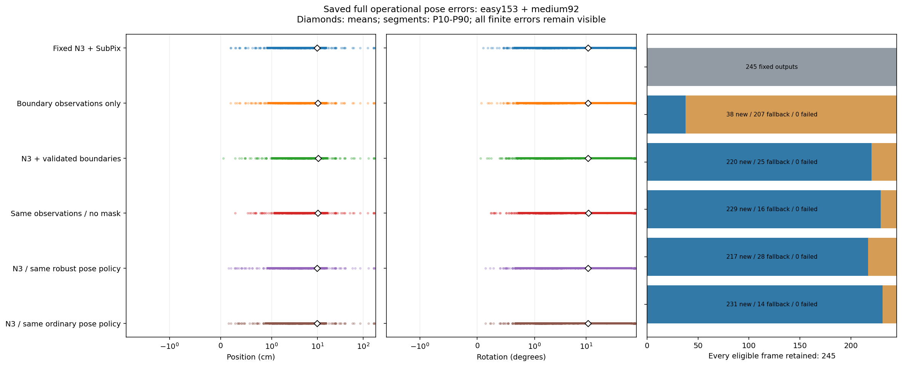
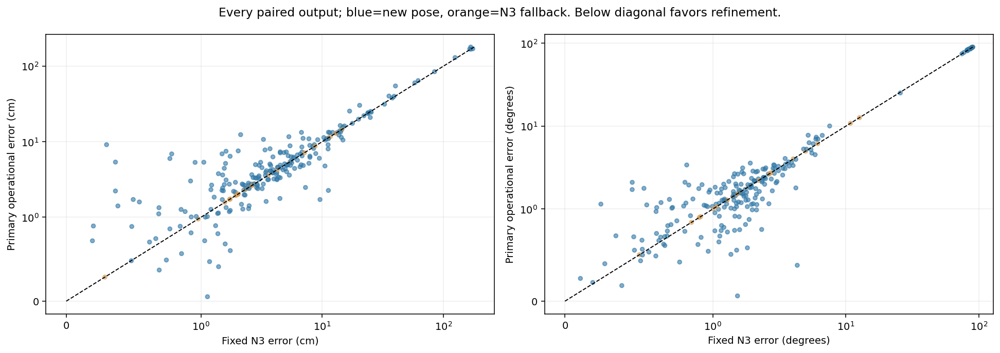
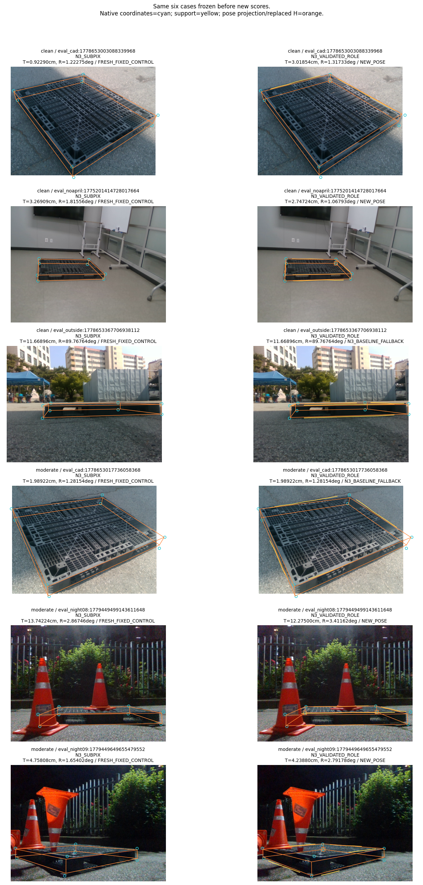
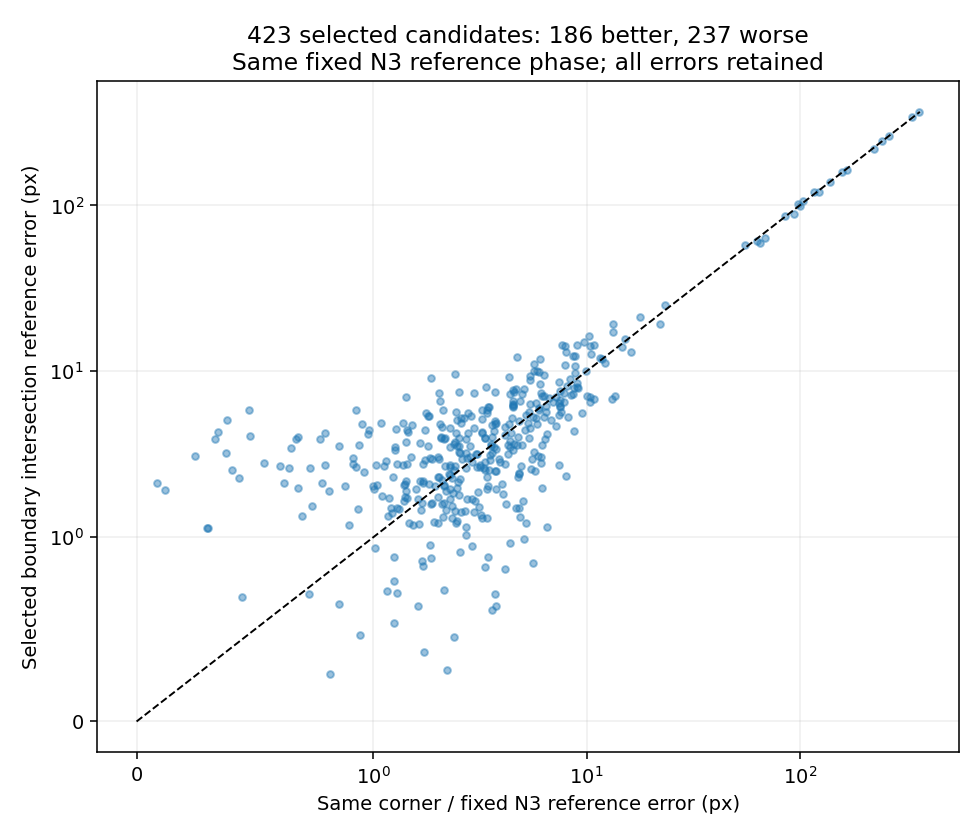

가림 판단이 일부 틀려도 다른 유효 대응점으로 자세를 구하고 자기 가림 코너를 재투영했을 때, 기존 단순 대조보다 실제 위치·회전이 좋아졌는가?

**이번 고정245장에서는 평균 위치와 회전이 모두 개선됐다는 조건을 충족하지 못했다.** 기존 GEOMETRIC_PROXY 참조의 DEV 결과이며 독립 실측 물리 GT나 일반화 증거가 아니다.

기존 감독 오류는 수정된 READY 타깃과 마지막 IMAGE_ROLE 체크포인트로 이미 수리돼 있었다. 이번에는 추가 학습 없이 경계 관측의 채택, 코너 조립, 자세 분기 처리를 고쳤다. 원래 학습과 실패 기록은 변경하지 않았다.

기존 코너 조립은 두 개 선택점으로 선을 만들고 비평행인 두 선의 교점을 사용했다. 새 경로는 source CAL에서 정한 대응 신뢰도, 최소3개 query와 지지 간격, 선 합의, 교점의 외삽·불확실성을 검사한다. 최종 TLS 지지가 각 query radius를 만족하는지 다시 확인한다. 반경8px를 넘는 교점은 점-PnP 관측으로 쓰지 않는다.

주경로는 유효한 경계 교점이 N3 관측에서8px 이내일 때만 해당 코너의 독립 관측으로 사용한다. 다른 관측은 고정 N3 RGB 좌표다. 자기 가림 H는 어느 좌표든 fit에서 제외한다. 새 자세가 나오면 H를 최종 재투영으로 교체하고, 재투영을 다시 fit하지 않는다. 기본 반환은 전체 N3 좌표와 초기 자세이며 새 자세로 세지 않는다.

유한4점 합의는 두 등록 치수 가설의 가설을 보존하지만, 새 fit 채택은 초기 N3 치수와 투영 basin을 유지한다. 이 prior는 fit 관측이 아니며 초기 오류를 승계할 수 있다. 다른 치수의 낮은 잔차와 대안 해는 진단에 남고, 식별 불가능한 수치 동점은 별도 상태다. 전역 유일성은 입증하지 않는다.

| 방법 | 전체 | 새 자세 | N3 반환 | 완전 실패 | 위치 평균(cm) | 회전 평균(°) | ADDsym 평균(cm) |
| --- | ---: | ---: | ---: | ---: | ---: | ---: | ---: |
| BASE | 245 | 0 | 0 | 0 | 12.18835 | 14.23284 | 22.43195 |
| N3_SUBPIX | 245 | 0 | 0 | 0 | 9.75455 | 10.91484 | 17.02865 |
| VALIDATED_ROLE_ONLY | 245 | 38 | 207 | 0 | 10.10058 | 10.90832 | 17.35433 |
| N3_VALIDATED_ROLE | 245 | 220 | 25 | 0 | 10.34259 | 10.95633 | 17.57320 |
| N3_VALIDATED_ROLE_NO_MASK | 245 | 229 | 16 | 0 | 10.16239 | 11.03017 | 17.42426 |
| N3_BASIN_ROBUST | 245 | 217 | 28 | 0 | 9.79480 | 10.94988 | 17.04077 |
| N3_BASIN_STANDARD | 245 | 231 | 14 | 0 | 9.79379 | 10.90011 | 17.02206 |

주경로−N3의 같은 프레임 평균 차이는 위치 0.58804cm, 회전 0.04149°다. 기본 반환을 포함한 전체 운용 결과와 새 자세 집합을 METRICS.json에서 별도로 제공한다.

| 방법·지표 | 평균 | 표본분산 | 표본SD | 중앙값 | P90 |
| --- | ---: | ---: | ---: | ---: | ---: |
| N3_SUBPIX / translation_cm | 9.75455 | 575.93602 | 23.99867 | 3.59735 | 15.08501 |
| N3_SUBPIX / rotation_deg | 10.91484 | 665.18060 | 25.79110 | 1.66599 | 76.09532 |
| N3_SUBPIX / ADDsym_cm | 17.02865 | 1298.81087 | 36.03902 | 3.93694 | 68.43149 |
| N3_VALIDATED_ROLE / translation_cm | 10.34259 | 597.88990 | 24.45179 | 4.12993 | 16.26377 |
| N3_VALIDATED_ROLE / rotation_deg | 10.95633 | 668.17751 | 25.84913 | 1.65737 | 76.18592 |
| N3_VALIDATED_ROLE / ADDsym_cm | 17.57320 | 1315.85786 | 36.27476 | 4.49849 | 68.67273 |

실사 범위는 기존 사용자 지시대로 Clean153+Moderate92=245다. Severe74는 새 실행에서 제외했으며 기존319 결과를 덮어쓰거나245 평균과 혼합하지 않았다. 동일 장면 네 합성 통제 변형은 이번에도 생성하거나 실행하지 않았다.

source CAL128의 알려진 query에서 confidence cutoff=0.96314, 채택 3708개 중2px 이내 POS 3545개였다. 이 precision은 IGNORE 제외 조건부 수치이며 실사·코너 precision 보증이 아니다. 같은 장면 query의 상관성과 threshold scan 때문에 Wilson 값도 독립 전이 보증으로 해석하지 않는다.

source 교점 참조는 실제 wire가 지지하는 가상 교점이며 물리 정점 소유권의 독립 인증은 아니다. 경계 모델의 calibration 지원 밖 변은 관측 제안을 보류한다. 이를 실사에 해당 물리 변이 없다는 판단으로 바꾸지 않았다.

원행 GEOMETRY_SEALED/FIXED_GEOMETRY_SEALED는 채점 전 봉인됐고 PREDICTIONS/FIXED_PREDICTIONS는 실제 채점 결과다. CALIBRATION_ROWS, query/geometry diagnostics, 단위검사, 검산, 실행량 및 fresh runtime 원행을 함께 제공한다. 공개 산술 검산은 비공개 가중치 GPU 실행과 실측 물리 GT의 독립 인증을 대신하지 않는다.

사용 API와 실행 명령은 README.md/REPRODUCE.md에 있다. main·원본 입력·기존 결과·사용자 수정은 보호 검산 대상이다. 성능을 보고 임계값·seed·학습량을 바꾸는 반복은 수행하지 않는다.

## 오류가 발생한 단계와 현재 남은 문제

코너의 역할을 예측하는 것, 실제 해당 변의 대응점을 고르는 것, 두 선에서 코너 좌표를 얻는 것, 그 좌표로 물리 자세를 맞추는 것은 서로 다른 검사다. 기존 role은 초기 cuboid의 투영 hull 경계/내부/계산 불가 특징이다. 실제 팔레트 경계의 소유권이나 코너 정확도를 보증하지 않는다. 아래 수치는 기존 감독 오류와 이번 실제 후단 문제를 구분한다.

| 단계 | 확인한 문제 | 현재 상태와 근거 |
| --- | --- | --- |
| 감독 | `training.py:91–94`의 ray inf/깊이 불일치가 곧 no_match가 됨 | 별도 브랜치 오류. 실제 owned wire가 있는 source-test query2164개를 POS로 복구하고 POS/NONE/IGNORE 감독 및9000update 재학습을 이미 완료한 기존 자료를 사용 |
| 역할 정의 | `model.py:49–56`의 역할은 초기 hull의 기하 분류 | 실제 경계 동일성 인증으로 해석하지 않음. P0/CAL의 unsupported를 실사 물리 부재로 바꾸지 않음 |
| 코너 조립 | `learned_infer.py:31–55`는 최소2점 TLS 후 비평행 무한선 교점 | 관측 길이/간격, 합의, 외삽과 covariance 검사를 추가. CAL 경계점P95 1.82680px와 가상 교점P95 15.16357px는 서로 다름 |
| PnP | 잘못된 대응도 서로 합의하면 낮은 잔차를 만들 수 있음 | 유한4점 합의·다중해 유지, 초기 치수/투영 prior와 분기 거절을 기록. 강건 솔버만으로 진짜 대응을 인증하지 못함 |
| 재투영 | 새 자세가 틀리면 숨은 점도 틀린 위치로 투영됨 | H 제외/최종 R,t 교체/재fit 금지를 검산. 숨은 오차 개선과 최종 T/R 개선을 분리 |

원래 수정 전 IMAGE_ROLE의0/319는 이전 잘못된 감독 모델의 결과다. 수정 감독으로 재학습한 기존245 결과는220새자세/25Base반환, T15.20239cm/R14.56122°였다. 이번 새 관측/초기N3prior/N3반환 경로와는 여러 처리가 달라 단일 수정의 인과 효과로15.20→10.34를 해석하지 않는다. 원래 N3→cornerSubPix 감독이나 main의 N3 학습 오류로 바꾸어 설명하지 않는다.

## 같은 좌표·자세 정책의 절제

아래는 같은245장의 후보−대조 차이다. 음수가 낮은 오차다. CI는 사전에 보존한10000개 세션 bootstrap draw를 재사용한95% 구간이며, 여러 절제에 대한 다중 비교 보정은 없다. DEV 반복 사용과 proxy 참조의 한계를 유지한다.

| 후보−대조 | n | 위치 차이(cm)와95% CI | 회전 차이(°)와95% CI |
| --- | ---: | --- | --- |
| N3_VALIDATED_ROLE_minus_N3_SUBPIX | 245 | 0.58804 [-0.06584, 1.17817] | 0.04149 [-0.01861, 0.10706] |
| N3_VALIDATED_ROLE_minus_N3_BASIN_ROBUST | 245 | 0.54779 [0.02956, 1.03165] | 0.00645 [-0.03614, 0.04683] |
| N3_VALIDATED_ROLE_minus_N3_VALIDATED_ROLE_NO_MASK | 245 | 0.18020 [-0.01354, 0.36202] | -0.07384 [-0.13835, 0.00660] |
| N3_BASIN_ROBUST_minus_N3_BASIN_STANDARD | 245 | 0.00101 [-0.13819, 0.14339] | 0.04977 [-0.01249, 0.13721] |

이번 주경로는 고정 N3를 이기지 못했다. 경계 관측의 추가는 같은 강건 자세 정책의 N3-only 대조보다 위치 오차를 높였다. 마스크 사용은 해당 두 경로에서 위치와 회전에 같은 방향의 효과를 내지 않았다. 강건 PnP도 일반 PnP보다 일관된 우위를 보이지 않았다. 이 결과는 더 큰 가림 판단기나 추가 학습의 필요성을 증명하지 않는다.

| 범위 | 방법 | 전체 | 새 자세 | N3 반환 | 위치(cm) | 회전(°) | ADDsym(cm) |
| --- | --- | ---: | ---: | ---: | ---: | ---: | ---: |
| easy | N3_SUBPIX | 153 | 0 | 0 | 10.10707 | 7.58458 | 12.91513 |
| easy | N3_VALIDATED_ROLE | 153 | 139 | 14 | 10.85390 | 7.60179 | 13.61597 |
| medium | N3_SUBPIX | 92 | 0 | 0 | 9.16828 | 16.45321 | 23.86960 |
| medium | N3_VALIDATED_ROLE | 92 | 81 | 11 | 9.49227 | 16.53507 | 24.15423 |

common_operational: n=245, 평균 차이 T=0.58804cm, R=0.04149°. 산출 실패와 큰 오차를 삭제하지 않았다.

candidate_new_pose: n=220, 평균 차이 T=0.65487cm, R=0.04620°. 산출 실패와 큰 오차를 삭제하지 않았다.

## 경계 교점이 기존 코너보다 정확한가

같은 native 코너 ID, 고정 N3의 참조 phase, 같은 유효 proxy 참조로 비교한다. computed, uncertainty-admitted, hybrid 입력 선택, 실제 최종 표시를 구분한다. 입력으로 선택했지만 새 자세가 없던 경우 최종 출력은 전체 N3로 반환한다.

| 교점 범위 | 개수 | 알려진 참조 | ≤8px | N3 평균(px) | 교점 평균(px) | N3보다 개선 | 악화 |
| --- | ---: | ---: | ---: | ---: | ---: | ---: | ---: |
| computed | 482 | 482 | 382 | 11.74296 | 12.46342 | 209 | 273 |
| admitted | 447 | 447 | 365 | 11.69802 | 12.36036 | 192 | 255 |
| selected_for_hybrid | 423 | 423 | 360 | 10.49148 | 10.94118 | 186 | 237 |
| displayed_as_boundary_observation | 395 | 395 | 343 | 8.96814 | 9.30952 | 177 | 218 |

교점423개 중186개는 N3보다 정확하고237개는 덜 정확했다. 최종 표시된395개에서도177개 개선·218개 악화였다. source query의 높은 조건부 precision, 두 경계의 수치 교차 가능성, 작은 추정 covariance가 실사 코너의 상대 정확도를 보증하지 못한다. 이는 현재 정의→관측 좌표→코너 보정 사이에 남은 검증 공백이다. 실제 물리 경계의 잘못된 소유권, appearance 전이, 선 오차 중 어느 원인이 차지한 비율인지 이번 자료로 인과적으로 확정하지 않는다.

## 가림 오판·남은 대응·숨은 재투영

| 알려진 마스크 | 전체 | 새 자세 | N3 반환 | T/R 모두 개선 | 둘 다 악화 | 혼합/동률(새 자세) |
| --- | ---: | ---: | ---: | ---: | ---: | ---: |
| matching_on_known | 184 | 165 | 19 | 38 | 52 | 75 |
| wrong_on_known | 61 | 55 | 6 | 9 | 20 | 26 |

초기H는 fresh N3에서 고정했다. H 재추정 집합이 바뀐8장도 실패로 삭제하지 않았다. 새 자세인데 알려진 틀린 최종 inlier가 있는 프레임은125장, 참조상8px 이내인 used 대응이4개 미만인 새 자세는49장이다. 수치 산출과 대응 정확도는 다른 상태다. POSTHOC_ROWS에는 남은 올바른/틀린/unknown 점 ID, 입력과 accepted-new-pose inlier,2D/3D SVD 배치를 기록했다. 배치 rank는 전체 PnP/Jacobian 관측 가능성을 인증하지 않는다.

| 코너 집합 | 대응 수 | N3 평균(px) | 최종 평균(px) | N3 P90 | 최종 P90 | ≤5px→>10px 손상 |
| --- | ---: | ---: | ---: | ---: | ---: | ---: |
| DIRECT_VISIBLE | 1503 | 19.85302 | 19.92842 | 21.43421 | 21.36825 | 0 |
| SELF_OCCLUDED | 335 | 19.65428 | 17.99326 | 26.52356 | 26.48445 | 2 |
| ACTUALLY_REPROJECTED_H | 262 | 17.49698 | 15.29335 | 21.96969 | 19.71353 | 2 |

자기 가림 재투영의 오차는 줄었지만 최종 위치·회전 평균은 개선되지 않았다. 새 자세 217프레임에서 예측H를 실제 교체했다. 사람 SELF 집합과 예측H 집합은 다르다. 숨은 오차만으로 자세 개선을 주장하지 않는다. 기존245장의6860개1·2점 오판 진단과 무학습 여섯 대조는 이전 결과에 보존했으며, 이번 새 정책의 실사6860경로를 추가 실행한 것으로 말하지 않는다.

## 실제 전체 처리시간과 실행량

| 경로 | 측정 n | 평균(ms) | 표본분산(ms²) | 표본SD | 중앙값 | P90 |
| --- | ---: | ---: | ---: | ---: | ---: | ---: |
| BASE | 130 | 12.47187 | 2.13729 | 1.46195 | 12.06114 | 14.26494 |
| N3_SUBPIX | 130 | 16.90258 | 4.08397 | 2.02088 | 16.85378 | 19.17781 |
| N3_BASIN_ROBUST | 130 | 45.65262 | 87.29284 | 9.34306 | 46.52667 | 50.80831 |
| N3_VALIDATED_ROLE | 130 | 53.58309 | 63.60542 | 7.97530 | 55.64360 | 60.29662 |

26장/13세션에서 각 경로20 warmup+130측정, 전체600회 모두 fresh detector와 해당 보정·초기 자세·최종 강건 PnP·재투영을 실행했다. 출력은 봉인된 정확도 실행과 전부 parity PASS다. 모델 로드,RGB decode,GT 채점,parity/영수증·자원 snapshot은 시간 밖이다. 캐시 좌표 재생이나 과거 시간의 합산은 사용하지 않았다.

초기 시간 시도는 cached baseline namespace 복구 문제로 모델 초기화 완료 전0호출/0행에서 중단했다. 실패 기록과 frozen runtime.py를 보존했고, 별도 wrapper로 한 outer legacy context를 유지해 동일600회 본문을 한 번 완료했다. 임계값·모델·solver·측정 구간은 바꾸지 않았다. transient 자원 경합은 snapshot 사이에서 놓칠 수 있다는 기존 한계를 유지한다.

이번 추가 실행은 학습0update/RGB 생성0, source CAL128의 head8batch, 실사 fresh245에서 detector245+내부 초기화1/N3245/ROLE245 및5방법1225fit경로, 시간600에서 detector600+내부 초기화1/N3450/ROLE150이다. 원시 OpenCV generic/LM 호출량은 GEOMETRY_SEAL/RUNTIME와 BUILD_LEDGER에 실제 진입 계수로 남겼다. 기존9000update를 이번 새 학습량으로 더하지 않는다.

공개 검산은 원행에서 평균·분산·SD·중앙값·P90·대응 평균 차이, 최종 R,t의 H 재투영, 입력 provenance, finite bank와 실제 시간 interval/총량을 재계산한다. 세션 bootstrap draw SHA는 확인하지만 공개 표준 라이브러리 검산기는 CI 수치 자체를 독립 재생하지 않는다. 그 범위와 실제 GPU/비공개GT를 재실행하지 않는 한계를 REVIEW_CHECKS에 명시한다.

현재 상태는 감독 오류 수리 완료, 관측/코너/PnP 입력 계약 구현·실행·검산 완료, 기존 N3 대비 최종 자세 우위 실패다. API가 실행된다는 사실을 방법론의 정확도 성공으로 바꾸지 않는다. 가장 작은 남은 질문은 실제 코너에 연결된 경계 관측이 이미 정확한 N3 좌표보다 더 정확한 위치를 주는가이다. 이번 한 번의 절제는 그렇지 않은 사례가 더 많음을 확인했다. 독립 자료에서 실제 경계 소유권과 상대 좌표 정확도를 확인하기 전 추가 모델·학습량·가림 분류기의 필요성을 주장하지 않는다.

## 코드와 검산 근거

- [잘못된 감독 분기 training.py:91](../../../scripts/research/pallet_observation_refiner_20261009_v1/training.py#L91)
- [기존 role 정의 model.py:49](../../../scripts/research/pallet_observation_refiner_20261009_v1/model.py#L49)
- [기존 두 선 교점 learned_infer.py:31](../../../scripts/research/pallet_observation_refiner_20261009_v1/learned_infer.py#L31)
- [새 관측과 교점 검증 observations.py](../../../scripts/research/pallet_boundary_corner_refiner_20261010_v2/observations.py)
- [H 제외/좌표 조립 pipeline.py](../../../scripts/research/pallet_boundary_corner_refiner_20261010_v2/pipeline.py)
- [유한 합의·자세 분기 pose.py](../../../scripts/research/pallet_boundary_corner_refiner_20261010_v2/pose.py)
- [실제 실행량 BUILD_LEDGER](BUILD_LEDGER.json), [원행 통계 METRICS](METRICS.json), [대응·손상 DIAGNOSTICS](DIAGNOSTICS.json)
- [source 검산](CALIBRATION_CHECKS.json), [공개 산술 첫 검산](REVIEW_CHECKS_ATTEMPT_A.json), [독립 posthoc 검산](POSTHOC_CHECKS.json), [변조·출력 보호 검사](REVIEW_CONTROL_CHECKS.json)
