# Pose-sensitive EASY→HARD pilot

## 1. 결론

**P8_NOT_PRIMARY:** 중심 P8을 residual에서 빼도 4모델×300회 중 선택 변화는 7회뿐이고, 축 복구와 손상이 혼재하며 ADD AUC가 일관되게 좋아지지 않았다. production은 변경하지 않았다.

**POSE_SENSITIVE_HYPOTHESIS_NOT_TESTED:** M0 gradient 계약 검사에서 중단해 M0/M1 학습은 0회다. 따라서 candidate 개선·actual pose·preservation은 아직 판단할 수 없다.

## 2. 계약

Phase A는 동결 R0/S0/S1/S2의 동일한 두 W/D 후보에서 score의 RMSE9만 RMSE8로 바꿨다. 그 외 penalty/weight/tie tolerance는 production SelectorConfig 그대로다. D8용 재풀이·P8 대체·GT ranking·threshold tuning은 없었다. 후보 pose/metric은 직전 exact-parity 진단 결과를 재사용했다.

Phase B 계획은 R0 초기화, S1 frozen input/order/mask 그대로, plastic/wood M0/M1 각320step이었다. 구현은 준비했으나 integrity gate 이후 **학습·lambda 보정·평가 모두 실행하지 않았다.** 미검증 구현을 실행 완료로 보지 않는다.

## 3. D9 vs D8

**DIAGNOSTIC_CANDIDATE_ONLY**. Axis는 W/D parity이지 전체 rotation 정확도가 아니다. ADD AUC는 0.1×object diameter까지 적분한 값이고 단순 성공률이 아니다.

| 그룹 | 모델 | D9 Axis% | D8 Axis% | D9 ADD AUC | D8 ADD AUC | 선택변경 | 오답→정답 | 정답→오답 | 변경+ADD개선 | 변경+ADD악화 |
|---|---|---|---|---|---|---|---|---|---|---|
| ALL300 | R0 | 74.33 | 74.33 | 0.3727 | 0.3725 | 2 | 1 | 1 | 1 | 1 |
| ALL300 | S0 | 77.00 | 77.00 | 0.4057 | 0.4048 | 2 | 1 | 1 | 1 | 1 |
| ALL300 | S1 | 78.00 | 78.67 | 0.4184 | 0.4184 | 2 | 2 | 0 | 2 | 0 |
| ALL300 | S2 | 77.00 | 76.67 | 0.4154 | 0.4154 | 1 | 0 | 1 | 0 | 1 |
| CLEAN | R0 | 88.64 | 89.39 | 0.5206 | 0.5244 | 1 | 1 | 0 | 1 | 0 |
| CLEAN | S0 | 91.67 | 92.42 | 0.5788 | 0.5831 | 1 | 1 | 0 | 1 | 0 |
| CLEAN | S1 | 92.42 | 92.42 | 0.5977 | 0.5977 | 0 | 0 | 0 | 0 | 0 |
| CLEAN | S2 | 93.18 | 93.18 | 0.6088 | 0.6088 | 0 | 0 | 0 | 0 | 0 |
| MODERATE_OCCLUSION | R0 | 77.01 | 77.01 | 0.3479 | 0.3479 | 0 | 0 | 0 | 0 | 0 |
| MODERATE_OCCLUSION | S0 | 77.01 | 75.86 | 0.3846 | 0.3750 | 1 | 0 | 1 | 0 | 1 |
| MODERATE_OCCLUSION | S1 | 72.41 | 74.71 | 0.3535 | 0.3535 | 2 | 2 | 0 | 2 | 0 |
| MODERATE_OCCLUSION | S2 | 74.71 | 74.71 | 0.3277 | 0.3277 | 0 | 0 | 0 | 0 | 0 |
| SEVERE_OCCLUSION | R0 | 48.15 | 46.91 | 0.1581 | 0.1515 | 1 | 0 | 1 | 0 | 1 |
| SEVERE_OCCLUSION | S0 | 53.09 | 53.09 | 0.1463 | 0.1463 | 0 | 0 | 0 | 0 | 0 |
| SEVERE_OCCLUSION | S1 | 60.49 | 60.49 | 0.1961 | 0.1961 | 0 | 0 | 0 | 0 | 0 |
| SEVERE_OCCLUSION | S2 | 53.09 | 51.85 | 0.1942 | 0.1942 | 1 | 0 | 1 | 0 | 1 |

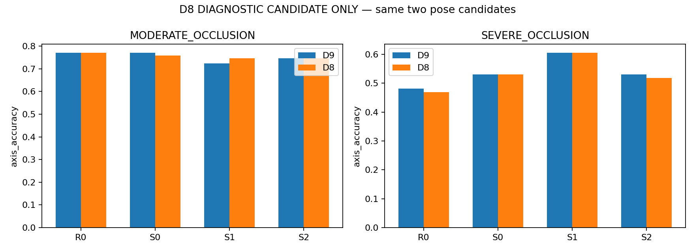

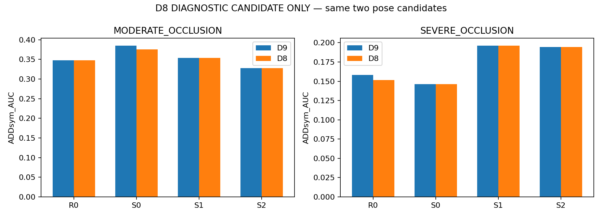

S1의 중간 가림에서는 축 오답 2건이 복구됐지만 ADD AUC는 그대로였다. 이 두 건이 이미 AUC 적분 범위 밖일 수 있으므로 AUC 불변을 pose 불변으로 해석하지 않는다. 변경 사례의 normalized ADD와 전체 회전/이동/IoU는 JSON 및 이미지에 함께 제공한다. 심한 가림에서 D9 오답→D8 정답 사례는 0건으로, 없는 성공 이미지를 만들지 않았다.

[전체 그룹·재질·세션 및 프레임별 지표](CENTER_P8_DIAGNOSTIC.json)

## 4. synthetic geometry/H validation

- exact geometry binding: **512/512**. 저장된 renderer K/R/t/perm_v4와 기존 side table을 직접 비교했다. 2D로 pose GT를 새로 만들지 않았다.
- 실제 frozen synthetic occurrence 5120개 최대 투영 오차: **0.00055742px**. 사전 기준0.05px 변경 없음.
- H_native 유효 512, 무효 0. ε=1px central difference, symmetry 및 PSD 검사 통과. GT pose 재구성은 stored renderer pose와 1e-6m 이내.
- installed loader는 dataset.rect=False여도 load_image(index)의 기본 rect_mode=True를 사용한다. 실제 long-side640 resize/ceil과 저장된 affine을 합성했다. 2D label에서 변환행렬을 적합하지 않았다.
- model H는 J 역변환 후 ignored/invisible 좌표 row/col을0으로 만들고 trace를 유효scalar수로 정규화했다. 실사 H=0. 절대 covariance가 아니라 상대 방향 가중치다.

[geometry binding](SYNTH_GEOMETRY_BINDING.json) · [투영](SYNTH_PROJECTION_PARITY.json) · [H 검사](POSE_SENSITIVITY_AUDIT.json) · [좌표변환 H](H_MODEL_AUDIT.json)

## 5. training behavior / 중단 사유

**실제 fit 0 / optimizer step 0 / lambda 산출 0.** 초기 R0와 첫 synthetic-only TRAIN microbatch에서 기존 loss와 λ=0 wrapper를 비교했다. total/component는 bit-exact였으나 gradient 검사에서 첫 실패 tensor의 최대 절대 차이2.5033950805664062e-6, 최대 상대 차이0.0005117486580274999가 나왔다.

**검사 한계:** 지시문은 tolerance 내 비교를 요구했는데 이번 검사기가 `atol=rtol=0`이라는 더 엄격한 조건을 사용했다. 따라서 이 결과만으로 실제 loss 구현 오류나 의미 있는 gradient 불일치를 확정할 수 없다. GPU 비결정성도 아직 원인 분리하지 않았다. 결과를 본 뒤 허용오차를 늘려 통과시키지 않고 중단했다.

초기 준비에서는 visibility0 sentinel을 native 투영 검사에 포함한 검사기 오류를 supervised/in-frame 조건으로 고쳤고, 배포 R0의 requires_grad=False를 Trainer와 같은 unfreeze 규칙으로 맞췄다. 이때까지 gradient 측정이나 lambda 선택은 수행되지 않았다. 최종 gradient gate 실패 이후 재시도·rescue·학습은 없었다.

준비한 추가항은 기존 keypoint loss에 `lambda_geo / hyp.pose × L_geo`를 더하는 형태다. 기존 pose gain 적용 후의 실효 가중치가 lambda이고, 기존 E2E branch weighting 및 batch multiplier를 유지하도록 설계했다. 이 수식의 M1 gradient 테스트는 gate 이후 도달하지 못했다.

[중단 기록](STOP.json) · [완료/미도달 loss 검사](LOSS_CONTRACT_TEST.json) · [lambda 미실행](LAMBDA_CALIBRATION.json)

## 6. MODERATE

M0/M1 미학습. 새로운 PCK/current/oracle 수치는 **N/A**. 위 D9/D8 표는 기존 R0/S0/S1/S2 결과이며 M0/M1으로 바꿔 표기하지 않았다.

## 7. SEVERE

M0/M1 candidate/pose 개선 여부 **N/A**. Phase A에서는 전반적인 P8 제거 이득이 확인되지 않았다.

## 8. CLEAN/source preservation

신규 모델이 없어 M0/M1 clean/source 유지율 **N/A**. source heldout256을 새로 추론하거나 학습 타깃으로 사용하지 않았다.

## 9. 성공/실패 사례

원본 RGB / 동일 모델 D9 / 동일 모델 D8 순서다. 노랑=동결 예측점 연결, 빨강=선택 pose 재투영, 청록 점선=대안 pose, 초록=evaluation reference. 모델 패널은 공통 reference bbox를 표시 목적으로만 확대했다. GT로 선택한 결과가 아니며 D8는 실험용이다. MATCH FAILURE는 벌점이므로 800px 이동선으로 표현하지 않았다.

선택이 바뀐 **7개 모델-프레임 모두**와 둘 다 오답4개·고정 무작위6개를 표시했다. 신규 M0/M1 성공/실패 사례는 학습하지 않았으므로 만들지 않았다.

### ALL_SELECTION_CHANGES · R0 · eval_pallet07:1778652128369383168

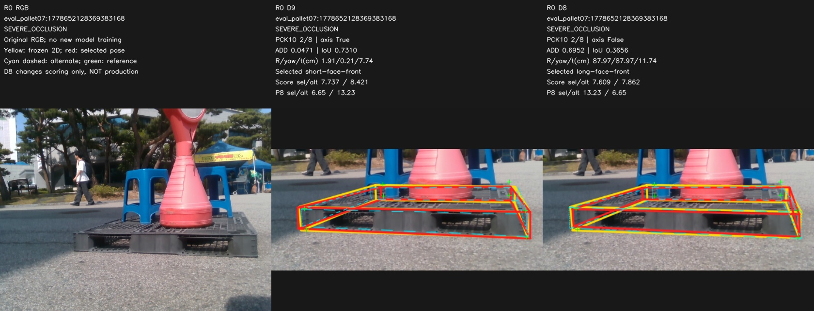

### ALL_SELECTION_CHANGES · R0 · plastic_day_01:009983

### ALL_SELECTION_CHANGES · S0 · plastic_day_01:009983

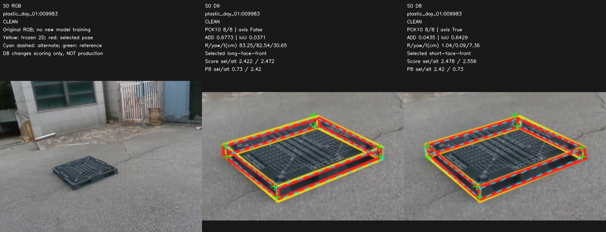

### ALL_SELECTION_CHANGES · S0 · plastic_day_01:014739

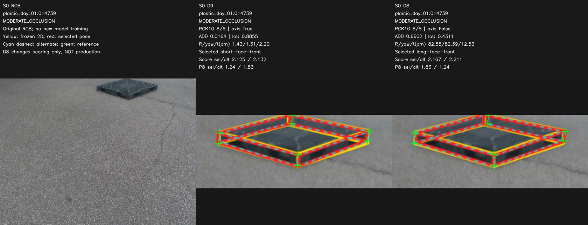

### ALL_SELECTION_CHANGES · S1 · plastic_day_01:020954

### ALL_SELECTION_CHANGES · S1 · plastic_day_01:020955

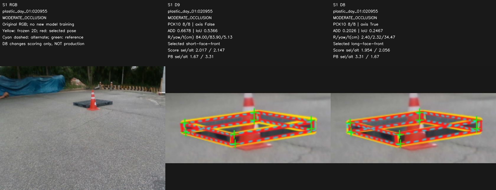

### ALL_SELECTION_CHANGES · S2 · eval_outside:1778651650570397184

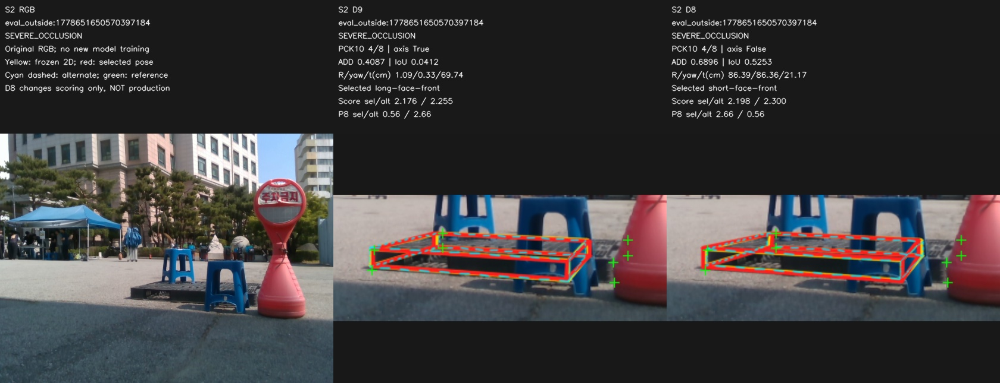

### BOTH_WRONG_CONTROL · S1 · eval_night09:1779449645419136000

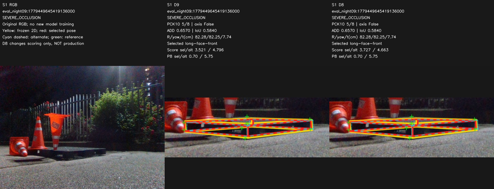

### BOTH_WRONG_CONTROL · S1 · wood_night_01:032376

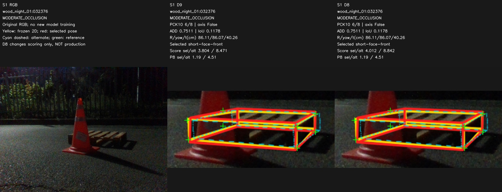

### BOTH_WRONG_CONTROL · S1 · wood_night_01:030652

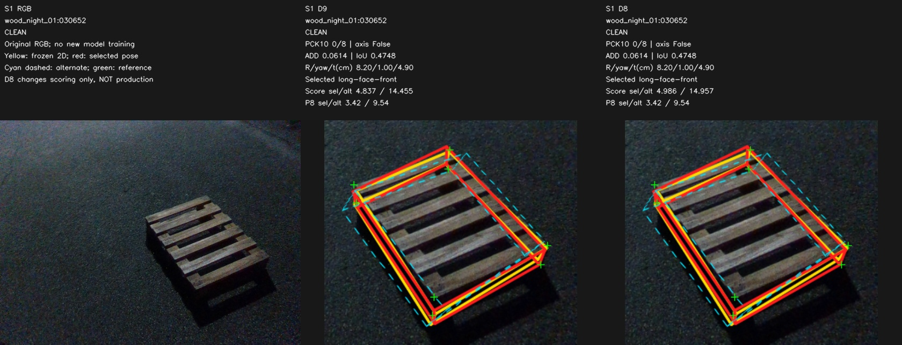

### BOTH_WRONG_CONTROL · S1 · eval_pallet09:1778653832794714368

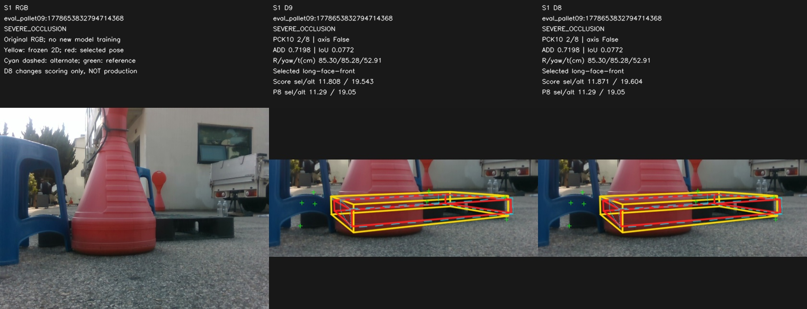

### RANDOM_CONTROL · S1 · plastic_day_01:020954

### RANDOM_CONTROL · S1 · eval_pallet07:1778652168786111744

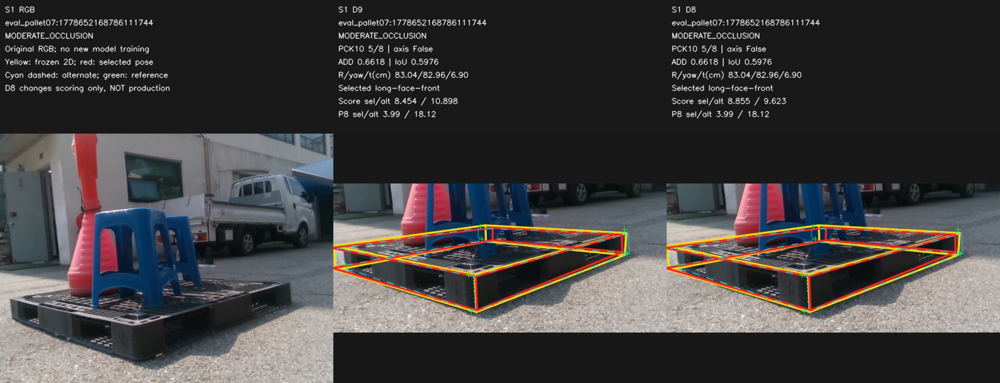

### RANDOM_CONTROL · S1 · eval_pallet09:1778653711544007680

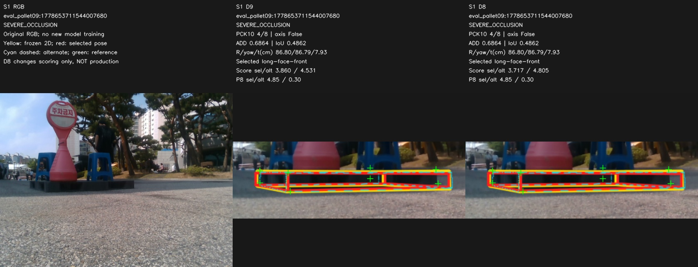

### RANDOM_CONTROL · S1 · wood_night_01:032167

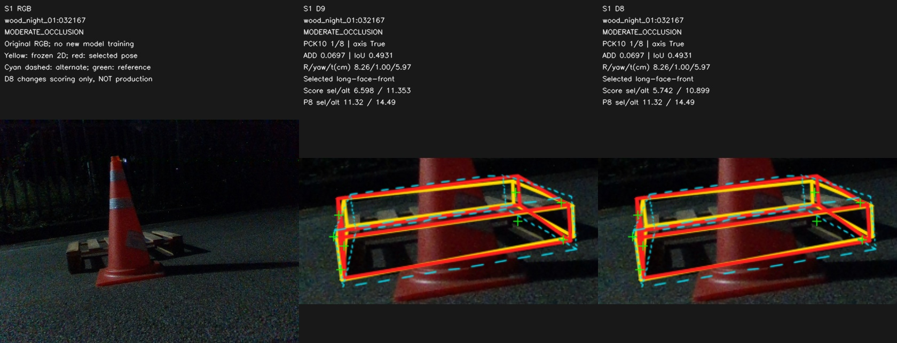

### RANDOM_CONTROL · S1 · wood_night_01:033421

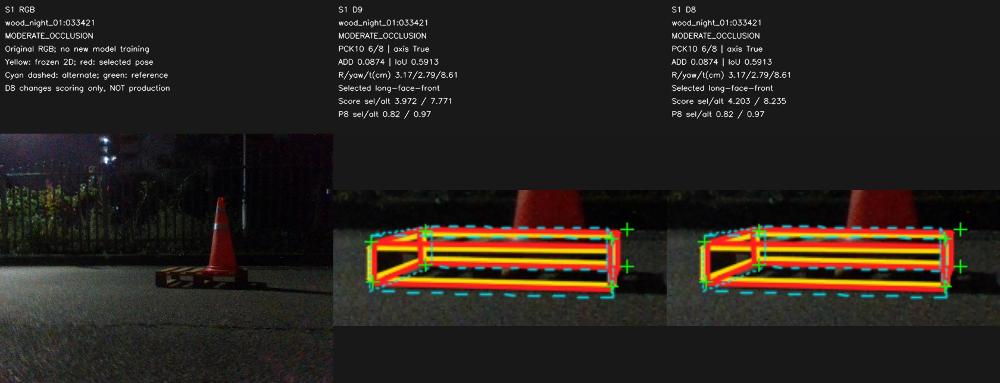

### RANDOM_CONTROL · S1 · eval_outside:1778653367706938112

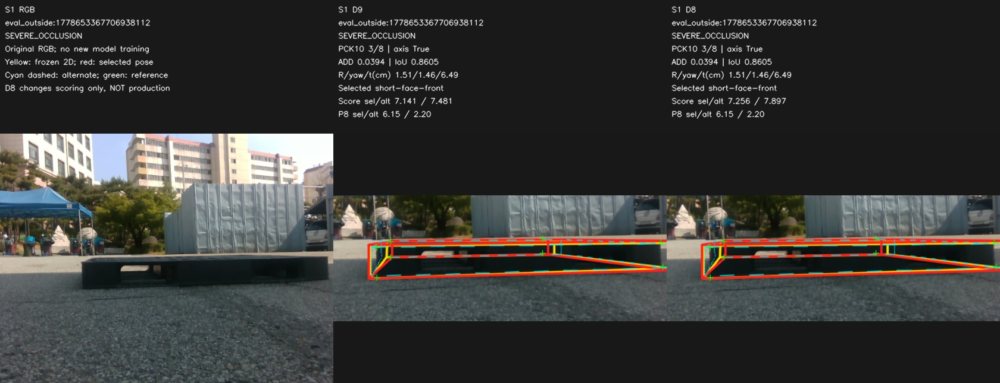

## 10. 객관적 판정

PRIMARY_BOTTLENECK_AFTER: **학습 전 gradient 검사 계약 확인 필요; 방법의 효과는 미검증.** SECONDARY: **P8_NOT_PRIMARY**. 이전 geometry/selector 진단을 이번 미학습으로 반증하거나 확증하지 않는다.

## 11. 다음 딱 한 실험

**무학습 gradient 재현성 진단 1회만 설계한다.** 같은 사전 고정 TRAIN microbatch에서 실제 Trainer의 결정론 설정을 맞추고 old→old 반복과 old→M0를 비교한다. 실행 전에 float32 허용오차를 고정하며 tolerance sweep을 하지 않는다. RNG·BN·forward 입력을 고정하고 optimizer step은0. 이 진단은 이번 STOP 이후 실행하지 않았다.

## 12. 한계

single seed / same-session reused DEV / geometry-derived pose reference (독립 실측 GT 아님). 준비한 H는 ε=1px local finite-difference 근사이며 full Linear-Covariance 재현이 아니다. 저장된 H와 구현만으로 학습의 효과를 주장하지 않는다.

## 13. 재현

HEAD_BEFORE: `7752974f39fdc2fd680c708b471bbb36b5b73db6`. commit/push SHA는 완료 stdout으로 기록한다. 기존 파일은 수정하지 않고 새 namespace만 사용했다.

[입력 hash](INPUT_BINDINGS.json) · [최종 검사](AUDIT.json) · [결정](DECISION.json) · [사례 선택](CASE_SELECTION.json)

## 보충: R/yaw/t/IoU

아래 중앙값은 pose-available 조건부. 전체 median/P90·coverage는 CENTER_P8_DIAGNOSTIC.json에 있다.

| 난도 | 모델 | 규칙 | R° med | Yaw° med | t cm med | IoU med |
|---|---|---|---|---|---|---|
| CLEAN | R0 | D9 | 1.6323 | 0.6926 | 4.0493 | 0.6783 |
| CLEAN | R0 | D8 | 1.6190 | 0.6836 | 4.0493 | 0.6783 |
| CLEAN | S0 | D9 | 1.6191 | 0.6457 | 3.9737 | 0.7075 |
| CLEAN | S0 | D8 | 1.6119 | 0.6411 | 3.9737 | 0.7075 |
| CLEAN | S1 | D9 | 1.5667 | 0.6050 | 4.0796 | 0.7036 |
| CLEAN | S1 | D8 | 1.5667 | 0.6050 | 4.0796 | 0.7036 |
| CLEAN | S2 | D9 | 1.5634 | 0.5928 | 3.2041 | 0.7155 |
| CLEAN | S2 | D8 | 1.5634 | 0.5928 | 3.2041 | 0.7155 |
| MODERATE_OCCLUSION | R0 | D9 | 2.2959 | 1.4669 | 8.1669 | 0.5943 |
| MODERATE_OCCLUSION | R0 | D8 | 2.2959 | 1.4669 | 8.1669 | 0.5943 |
| MODERATE_OCCLUSION | S0 | D9 | 2.6306 | 1.3056 | 7.3724 | 0.6115 |
| MODERATE_OCCLUSION | S0 | D8 | 2.6753 | 1.3408 | 8.1100 | 0.5999 |
| MODERATE_OCCLUSION | S1 | D9 | 2.7614 | 1.4538 | 7.0367 | 0.5777 |
| MODERATE_OCCLUSION | S1 | D8 | 2.5852 | 1.4538 | 7.1435 | 0.5777 |
| MODERATE_OCCLUSION | S2 | D9 | 2.6800 | 1.8411 | 7.8014 | 0.5589 |
| MODERATE_OCCLUSION | S2 | D8 | 2.6800 | 1.8411 | 7.8014 | 0.5589 |
| SEVERE_OCCLUSION | R0 | D9 | 61.6350 | 27.1256 | 13.4842 | 0.4895 |
| SEVERE_OCCLUSION | R0 | D8 | 64.9597 | 30.5158 | 13.4842 | 0.4846 |
| SEVERE_OCCLUSION | S0 | D9 | 8.0134 | 7.7704 | 14.9315 | 0.4827 |
| SEVERE_OCCLUSION | S0 | D8 | 8.0134 | 7.7704 | 14.9315 | 0.4827 |
| SEVERE_OCCLUSION | S1 | D9 | 5.5850 | 4.4645 | 13.2882 | 0.5108 |
| SEVERE_OCCLUSION | S1 | D8 | 5.5850 | 4.4645 | 13.2882 | 0.5108 |
| SEVERE_OCCLUSION | S2 | D9 | 7.2555 | 7.2417 | 11.5552 | 0.5211 |
| SEVERE_OCCLUSION | S2 | D8 | 18.4228 | 18.3568 | 11.5552 | 0.5253 |
