# CLEAN19 구조적 EASY→HARD 증류 결정 실험

> 공개 상태 정정: 보고서 작성 후 사용자가 명시적으로 main 커밋·push를 요청했다. 아래의 `commit/push없음` 및 기존 감사 JSON의 `no_push`는 실험 종료 당시 기록이며, 현재 공개 지시를 제한하지 않는다. 학습·평가 수치는 변경하지 않았다. 저장소에는 코드·감사 자료·표·이미지 19장을 포함하고 대용량 학습 캐시와 체크포인트는 포함하지 않는다.

[확인] 같은 촬영 세션의 Clean19(플라스틱10·목재9) 감독, 자연평가300장 고정. 실사87개 직접클릭 근거 채널의 frozen teacher 좌표 사용. S0/S1/S2 각각두종류,총6fits×320=1,920 update. seed42, last만 평가. 이하 단일seed·반복DEV이며 독립 일반화/통계적 유의성 주장이 아니다.

| method | Clean PCK10 개수/분모(%) | Moderate PCK10 | Severe PCK10 | Mod/Sev ADDsym AUC | Mod/Sev 축정확도% | R0정답 손실/획득 | 검출/매칭 |
|---|---:|---:|---:|---:|---:|---:|---:|
| R0 | 773/1050 (73.62) | 433/671 (64.53) | 263/626 (42.01) | 0.3479/0.1581 | 77.01/48.15 | 0/0 | 300/292 |
| TEACHER | 881/1050 (83.90) | 462/671 (68.85) | 312/626 (49.84) | 0.4289/0.1699 | 75.86/49.38 | 71/257 | 300/292 |
| OLD_STUDENT | 758/1050 (72.19) | 414/671 (61.70) | 263/626 (42.01) | 0.3555/0.1317 | 71.26/45.68 | 178/144 | 300/293 |
| S0 | 749/1050 (71.33) | 425/671 (63.34) | 264/626 (42.17) | 0.3846/0.1463 | 77.01/53.09 | 163/132 | 300/291 |
| S1 | 751/1050 (71.52) | 445/671 (66.32) | 280/626 (44.73) | 0.3535/0.1961 | 72.41/60.49 | 150/157 | 300/294 |
| S2 | 764/1050 (72.76) | 437/671 (65.13) | 289/626 (46.17) | 0.3277/0.1942 | 74.71/53.09 | 130/151 | 300/294 |

TEACHER=기존 종류별Replay+자기가림PnP, OLD_STUDENT=이전171점 수도레이블 학생(역사적 참고). 새S0와 old는 마스크/기본증강샘플동결이 다르므로 old 대비 변화를 가림효과라 하지 않는다. R0정답 손실=R0≤10px→해당모델>10px, 획득=반대; canonical GT identity로 비교. 검출/매칭 분모300.

## 기존 학생 TRAIN-fit: 학습 실패인가 전이 실패인가

| 종류 | 모델 | 원영상 pseudo8 PCK10 | reflect100 pseudo8 PCK10 | reflect100 manual PCK10 |
|---|---|---:|---:|---:|
| PLASTIC | R0 | 73.75% | 73.75% | 75.00% |
| PLASTIC | OLD_STUDENT | 90.00% | 92.50% | 91.67% |
| PLASTIC | TEACHER | 100.00% | 100.00% | 97.92% |
| WOOD | R0 | 73.61% | 84.72% | 82.05% |
| WOOD | OLD_STUDENT | 90.28% | 95.83% | 92.31% |
| WOOD | TEACHER | 100.00% | 100.00% | 100.00% |

[확인] 교사는 저장결과로서 원영상/native와reflect100열에서 동일하다. 비교 학생의 두 입력 추론은 별도로 실행했다. 8코너·중심·PnP대체·새마스크별PCK5/10/20,median/P90,전체물체대칭 보조값은 OLD_TRAIN_FIT.json에 있다. native channel score와 symmetry score를 혼동하지 않는다.

## 감독·가림 계약

- [확인] 원래 pseudo 171좌표 중 코너152+중심19. 직접클릭87개; 새좌표감독87개. PnP대체19개는 전부 비수동 채널로 제외. 비수동코너65개(그 중PnP19)+중심19가 제외되어84개. identity_unknown 명시필드는0개이나 비수동 출처를 수동근거로 간주하지 않았다.
- [확인] 좌표값은 교사 yT 그대로이며 수동GT로 대체하지 않음. source=manual_click은 provenance이고 실제 가시성 보장 아님. 인공가림은 masked-target 복원이라고 해석한다.
- [확인] R0 새시작,5epoch,batch=nbs16,AdamW lr1e-4/lrf0.1/cosine,seed42. 학습별 합성512unique+실사512복원추출/epoch,각2,560 exposure. 원래학생처럼 stock이 고정하는 층 외 새freeze없음; 실제 inventory와 초기값 해시6fit일치검사.
- [확인] 기본HSV/affine은 설치YOLO로 occurrence별생성해640 RGB/타깃 텐서를 동결. S0/S1/S2가 같은텐서를 읽는다. workers2여도순서·RGB·target이변하지않도록epoch/slot명시. 기존 과거학생과 기본텐서가 같다는 주장은 하지 않는다.
- [확인] 초기preflight는 stock의경계clipping을 unclipped affine와비교해실패. clipping을 반영한검사로수정했고학습전기존partial cache를bit-exact재검증했다. fit재시작/seed변경은없음. 선택적Albumentations는설치API quality_range불일치로비활성화(기존경로와같음);패키지수정없음.
- [확인] 실사5120 occurrence, scheduled 2511, 실제paired apply 1312 (25.62%). 미적용은이미지삭제가아닌RGB원본유지. 합성추가가림0.
- [확인] S1 masked target 1695, S2 2653. 크기·fill·apply빈도·bbox overlap tolerance를맞췄지만 masked-point 수와실제전경가림면적동일은주장하지않는다.
- [확인] S1은adjacency없는무작위위치, S2는native 3D graph인접쌍을포함. shape선정후최대64위치후실패시paired skip. 실제bbox-overlap차이와종류/채널빈도는보조JSON.
- [확인] supervised2 / true-ignore1 유지. 인공가림은좌표·v를바꾸지않는다. 제외좌표변화loss불변,가린감독좌표변화loss변화,allignore좌표/RLE/kobj0 및keypoint gradient0,합성stock parity검사통과.

## 주 대조: 자연 가림 전이와 정상점 손실

| 그룹 | 비교 | PCK10 Δ%p | ADDsym Δ | 축정확도 Δ%p | 기존≤10손실 | >10→≤10획득 | >20→<10복구 | <5→>10손상 |
|---|---|---:|---:|---:|---:|---:|---:|---:|
| CLEAN | S1-S0 | +0.19 | +0.0188 | +0.76 | 36 | 38 | 11 | 2 |
| CLEAN | S2-S1 | +1.24 | +0.0111 | +0.76 | 27 | 40 | 3 | 2 |
| CLEAN | S2-S0 | +1.43 | +0.0300 | +1.52 | 29 | 44 | 16 | 3 |
| MODERATE_OCCLUSION | S1-S0 | +2.98 | -0.0311 | -4.60 | 26 | 46 | 20 | 3 |
| MODERATE_OCCLUSION | S2-S1 | -1.19 | -0.0258 | +2.30 | 29 | 21 | 0 | 8 |
| MODERATE_OCCLUSION | S2-S0 | +1.79 | -0.0568 | -2.30 | 28 | 40 | 10 | 3 |
| SEVERE_OCCLUSION | S1-S0 | +2.56 | +0.0498 | +7.41 | 17 | 33 | 9 | 2 |
| SEVERE_OCCLUSION | S2-S1 | +1.44 | -0.0018 | -7.41 | 26 | 35 | 10 | 8 |
| SEVERE_OCCLUSION | S2-S0 | +3.99 | +0.0480 | +0.00 | 24 | 49 | 14 | 8 |

## 새학생 TRAIN-fit 및 고정 인공가림 probe

아래는현재새공통마스크(87채널)의입력640좌표기준PCK10이다. 원영상native/reflect100의기존pseudo8·manual·center별값은 DIAGNOSTICS 파일에별도로있다. 원영상픽셀PCK와이표를직접동일척도로비교하지않는다.

| 종류 | 모델 | 기본 입력 | 무작위 가림 | 구조적 가림 | 구조적 가린점 | 구조적 남은점 |
|---|---|---:|---:|---:|---:|---:|
| PLASTIC | R0 | 84.90 | 82.81 | 83.59 | 70.45 | 85.29 |
| PLASTIC | OLD_STUDENT | 93.49 | 89.06 | 88.80 | 72.73 | 90.88 |
| PLASTIC | S0 | 93.75 | 89.06 | 88.80 | 70.45 | 91.18 |
| PLASTIC | S1 | 93.75 | 91.67 | 92.45 | 90.91 | 92.65 |
| PLASTIC | S2 | 93.75 | 92.19 | 92.71 | 90.91 | 92.94 |
| WOOD | R0 | 83.97 | 80.45 | 82.69 | 60.00 | 85.11 |
| WOOD | OLD_STUDENT | 92.31 | 88.78 | 89.74 | 66.67 | 92.20 |
| WOOD | S0 | 99.04 | 95.51 | 97.12 | 80.00 | 98.94 |
| WOOD | S1 | 100.00 | 100.00 | 99.36 | 93.33 | 100.00 |
| WOOD | S2 | 100.00 | 99.36 | 99.36 | 93.33 | 100.00 |

## 기존 합성 heldout256

[확인] 기존Replay ORDERS의held256이미지 그대로 사용,합성train512와image교차0. 동일혼합종류source pool에각material학생을각각적용한보조검사이며실사종류routing성과와혼합하지않는다. 기존synthetic validation bookkeeping과겹칠수있으므로독립test라하지않는다. 기존보정기keypoint입력jitter stress는RGB-only학생입력에존재하지않아학생stress로전용하지않았고,새합성가림probe는추가하지않았다.

| 종류 모델 | method | PCK5 | PCK10 | PCK20 | median/P90 px | match/256 |
|---|---|---:|---:|---:|---:|---:|
| PLASTIC | R0 | 82.30 | 93.00 | 96.70 | 1.96/7.54 | 256/256 |
| PLASTIC | OLD_STUDENT | 77.17 | 90.93 | 95.66 | 2.44/9.41 | 256/256 |
| PLASTIC | S0 | 78.01 | 90.68 | 96.70 | 2.44/9.53 | 256/256 |
| PLASTIC | S1 | 76.63 | 91.47 | 96.65 | 2.46/9.07 | 256/256 |
| PLASTIC | S2 | 76.28 | 90.73 | 96.55 | 2.46/9.52 | 256/256 |
| WOOD | R0 | 82.30 | 93.00 | 96.70 | 1.96/7.54 | 256/256 |
| WOOD | OLD_STUDENT | 76.13 | 90.29 | 95.66 | 2.66/9.66 | 256/256 |
| WOOD | S0 | 78.25 | 91.57 | 95.86 | 2.37/8.76 | 256/256 |
| WOOD | S1 | 78.85 | 91.37 | 96.20 | 2.37/8.89 | 256/256 |
| WOOD | S2 | 78.75 | 91.12 | 96.20 | 2.35/9.16 | 256/256 |

## ALL300 전체 지표

| 모델 | PCK5/10/20% | matched med/P90 px | 검출/매칭 | R/Yaw med° | t med cm | IoU3D med | ADD AUC | pose성공/전체 |
|---|---:|---:|---:|---:|---:|---:|---:|---:|
| R0 | 35.07/62.59/79.68 | 6.96/43.49 | 300/292 | 2.61/1.36 | 8.15 | 0.5873 | 0.3727 | 300/300 |
| TEACHER | 48.96/70.52/80.91 | 4.99/44.66 | 300/292 | 2.25/1.12 | 6.21 | 0.6494 | 0.4454 | 300/300 |
| OLD_STUDENT | 37.03/61.14/80.32 | 7.19/36.70 | 300/293 | 2.78/1.56 | 7.43 | 0.6214 | 0.3922 | 300/300 |
| S0 | 37.71/61.27/80.53 | 6.92/36.75 | 300/291 | 2.43/1.20 | 7.19 | 0.6231 | 0.4057 | 300/300 |
| S1 | 39.37/62.89/81.30 | 6.74/32.30 | 300/294 | 2.47/1.31 | 6.64 | 0.6190 | 0.4184 | 300/300 |
| S2 | 40.05/63.49/81.89 | 6.68/32.78 | 300/294 | 2.44/1.23 | 6.65 | 0.6371 | 0.4154 | 300/300 |

## CLEAN 전체 지표

| 모델 | PCK5/10/20% | matched med/P90 px | 검출/매칭 | R/Yaw med° | t med cm | IoU3D med | ADD AUC | pose성공/전체 |
|---|---:|---:|---:|---:|---:|---:|---:|---:|
| R0 | 45.81/73.62/90.86 | 5.39/18.42 | 132/132 | 1.63/0.69 | 4.05 | 0.6783 | 0.5206 | 132/132 |
| TEACHER | 63.05/83.90/92.38 | 3.71/15.32 | 132/132 | 1.21/0.60 | 2.90 | 0.7488 | 0.6254 | 132/132 |
| OLD_STUDENT | 49.24/72.19/90.86 | 5.15/18.99 | 132/132 | 1.73/0.64 | 3.40 | 0.7039 | 0.5761 | 132/132 |
| S0 | 50.19/71.33/89.71 | 4.99/20.11 | 132/132 | 1.62/0.65 | 3.97 | 0.7075 | 0.5788 | 132/132 |
| S1 | 51.71/71.52/89.24 | 4.75/20.63 | 132/132 | 1.57/0.61 | 4.08 | 0.7036 | 0.5977 | 132/132 |
| S2 | 52.57/72.76/92.29 | 4.71/17.99 | 132/132 | 1.56/0.59 | 3.20 | 0.7155 | 0.6088 | 132/132 |

## MODERATE_OCCLUSION 전체 지표

| 모델 | PCK5/10/20% | matched med/P90 px | 검출/매칭 | R/Yaw med° | t med cm | IoU3D med | ADD AUC | pose성공/전체 |
|---|---:|---:|---:|---:|---:|---:|---:|---:|
| R0 | 35.92/64.53/78.69 | 7.08/99.88 | 87/87 | 2.30/1.47 | 8.17 | 0.5943 | 0.3479 | 87/87 |
| TEACHER | 47.39/68.85/79.14 | 5.38/97.03 | 87/87 | 2.35/1.42 | 5.51 | 0.6543 | 0.4289 | 87/87 |
| OLD_STUDENT | 35.32/61.70/77.35 | 7.14/84.86 | 87/84 | 2.81/2.02 | 7.54 | 0.5855 | 0.3555 | 87/87 |
| S0 | 38.15/63.34/79.28 | 6.68/65.22 | 87/84 | 2.63/1.31 | 7.37 | 0.6115 | 0.3846 | 87/87 |
| S1 | 39.79/66.32/81.67 | 6.42/64.41 | 87/86 | 2.76/1.45 | 7.04 | 0.5777 | 0.3535 | 87/87 |
| S2 | 39.34/65.13/78.24 | 6.52/63.49 | 87/84 | 2.68/1.84 | 7.80 | 0.5589 | 0.3277 | 87/87 |

## SEVERE_OCCLUSION 전체 지표

| 모델 | PCK5/10/20% | matched med/P90 px | 검출/매칭 | R/Yaw med° | t med cm | IoU3D med | ADD AUC | pose성공/전체 |
|---|---:|---:|---:|---:|---:|---:|---:|---:|
| R0 | 16.13/42.01/61.98 | 11.08/52.33 | 81/73 | 61.63/27.13 | 13.48 | 0.4895 | 0.1581 | 81/81 |
| TEACHER | 27.00/49.84/63.58 | 8.86/52.78 | 81/73 | 62.22/18.38 | 14.99 | 0.4917 | 0.1699 | 81/81 |
| OLD_STUDENT | 18.37/42.01/65.81 | 11.77/51.00 | 81/77 | 77.28/77.24 | 14.42 | 0.4820 | 0.1317 | 81/81 |
| S0 | 16.29/42.17/66.45 | 11.59/46.60 | 81/75 | 8.01/7.77 | 14.93 | 0.4827 | 0.1463 | 81/81 |
| S1 | 18.21/44.73/67.57 | 10.80/49.96 | 81/76 | 5.58/4.46 | 13.29 | 0.5108 | 0.1961 | 81/81 |
| S2 | 19.81/46.17/68.37 | 10.40/45.69 | 81/78 | 7.26/7.24 | 11.56 | 0.5211 | 0.1942 | 81/81 |

## PLASTIC 전체 지표

| 모델 | PCK5/10/20% | matched med/P90 px | 검출/매칭 | R/Yaw med° | t med cm | IoU3D med | ADD AUC | pose성공/전체 |
|---|---:|---:|---:|---:|---:|---:|---:|---:|
| R0 | 32.73/59.53/77.53 | 7.63/43.13 | 184/176 | 2.54/1.45 | 10.27 | 0.5716 | 0.3259 | 184/184 |
| TEACHER | 46.69/69.16/78.86 | 5.12/43.03 | 184/176 | 2.27/1.44 | 7.95 | 0.6155 | 0.4207 | 184/184 |
| OLD_STUDENT | 34.05/58.90/77.95 | 7.62/36.61 | 184/178 | 2.91/1.95 | 10.06 | 0.5778 | 0.3382 | 184/184 |
| S0 | 33.57/57.64/77.25 | 7.53/41.87 | 184/176 | 2.54/1.44 | 9.19 | 0.5965 | 0.3456 | 184/184 |
| S1 | 35.45/60.08/78.86 | 7.31/32.40 | 184/178 | 2.48/1.62 | 8.30 | 0.5927 | 0.3656 | 184/184 |
| S2 | 36.43/60.64/79.97 | 7.09/33.16 | 184/179 | 2.51/1.51 | 8.38 | 0.6155 | 0.3687 | 184/184 |

## WOOD 전체 지표

| 모델 | PCK5/10/20% | matched med/P90 px | 검출/매칭 | R/Yaw med° | t med cm | IoU3D med | ADD AUC | pose성공/전체 |
|---|---:|---:|---:|---:|---:|---:|---:|---:|
| R0 | 38.73/67.40/83.04 | 6.30/43.67 | 116/116 | 2.68/1.28 | 4.17 | 0.6334 | 0.4468 | 116/116 |
| TEACHER | 52.52/72.65/84.14 | 4.75/50.78 | 116/116 | 2.25/0.88 | 3.11 | 0.7055 | 0.4846 | 116/116 |
| OLD_STUDENT | 41.68/64.66/84.03 | 6.33/36.90 | 116/115 | 2.72/1.13 | 3.51 | 0.6947 | 0.4778 | 116/116 |
| S0 | 44.20/66.96/85.67 | 5.75/30.18 | 116/115 | 2.32/1.00 | 3.38 | 0.7158 | 0.5010 | 116/116 |
| S1 | 45.51/67.29/85.12 | 5.73/30.95 | 116/116 | 2.23/1.05 | 3.37 | 0.7039 | 0.5023 | 116/116 |
| S2 | 45.73/67.94/84.90 | 5.60/31.18 | 116/115 | 2.38/1.02 | 3.49 | 0.6832 | 0.4894 | 116/116 |

## PLASTIC_CLEAN 전체 지표

| 모델 | PCK5/10/20% | matched med/P90 px | 검출/매칭 | R/Yaw med° | t med cm | IoU3D med | ADD AUC | pose성공/전체 |
|---|---:|---:|---:|---:|---:|---:|---:|---:|
| R0 | 56.93/80.81/96.80 | 4.43/13.65 | 59/59 | 1.15/0.53 | 6.47 | 0.6396 | 0.4990 | 59/59 |
| TEACHER | 72.92/92.96/98.72 | 2.99/8.85 | 59/59 | 0.86/0.47 | 4.24 | 0.7061 | 0.6797 | 59/59 |
| OLD_STUDENT | 60.13/82.30/96.16 | 3.82/14.10 | 59/59 | 1.21/0.48 | 4.82 | 0.6727 | 0.6134 | 59/59 |
| S0 | 59.70/76.97/92.54 | 3.86/17.93 | 59/59 | 1.31/0.65 | 5.44 | 0.6635 | 0.5977 | 59/59 |
| S1 | 61.41/77.61/92.11 | 3.81/17.34 | 59/59 | 1.18/0.45 | 5.16 | 0.6421 | 0.5987 | 59/59 |
| S2 | 61.41/77.83/96.16 | 3.78/16.11 | 59/59 | 1.29/0.45 | 4.05 | 0.6707 | 0.6225 | 59/59 |

## PLASTIC_MODERATE_OCCLUSION 전체 지표

| 모델 | PCK5/10/20% | matched med/P90 px | 검출/매칭 | R/Yaw med° | t med cm | IoU3D med | ADD AUC | pose성공/전체 |
|---|---:|---:|---:|---:|---:|---:|---:|---:|
| R0 | 29.88/62.43/79.59 | 7.83/94.38 | 44/44 | 1.84/1.21 | 9.14 | 0.6620 | 0.4026 | 44/44 |
| TEACHER | 46.75/71.89/79.59 | 5.38/95.53 | 44/44 | 1.79/1.44 | 4.24 | 0.7373 | 0.5351 | 44/44 |
| OLD_STUDENT | 26.92/57.69/75.15 | 7.94/81.88 | 44/42 | 2.44/1.90 | 9.49 | 0.5906 | 0.3492 | 44/44 |
| S0 | 29.29/59.47/76.04 | 7.55/85.83 | 44/42 | 2.05/1.22 | 8.62 | 0.6176 | 0.3746 | 44/44 |
| S1 | 31.36/64.20/81.36 | 7.32/87.49 | 44/43 | 2.22/1.38 | 7.30 | 0.5891 | 0.3650 | 44/44 |
| S2 | 32.54/63.61/78.99 | 6.97/68.88 | 44/42 | 2.15/1.45 | 8.43 | 0.6029 | 0.3495 | 44/44 |

## PLASTIC_SEVERE_OCCLUSION 전체 지표

| 모델 | PCK5/10/20% | matched med/P90 px | 검출/매칭 | R/Yaw med° | t med cm | IoU3D med | ADD AUC | pose성공/전체 |
|---|---:|---:|---:|---:|---:|---:|---:|---:|
| R0 | 16.13/42.01/61.98 | 11.08/52.33 | 81/73 | 61.63/27.13 | 13.48 | 0.4895 | 0.1581 | 81/81 |
| TEACHER | 27.00/49.84/63.58 | 8.86/52.78 | 81/73 | 62.22/18.38 | 14.99 | 0.4917 | 0.1699 | 81/81 |
| OLD_STUDENT | 18.37/42.01/65.81 | 11.77/51.00 | 81/77 | 77.28/77.24 | 14.42 | 0.4820 | 0.1317 | 81/81 |
| S0 | 16.29/42.17/66.45 | 11.59/46.60 | 81/75 | 8.01/7.77 | 14.93 | 0.4827 | 0.1463 | 81/81 |
| S1 | 18.21/44.73/67.57 | 10.80/49.96 | 81/76 | 5.58/4.46 | 13.29 | 0.5108 | 0.1961 | 81/81 |
| S2 | 19.81/46.17/68.37 | 10.40/45.69 | 81/78 | 7.26/7.24 | 11.56 | 0.5211 | 0.1942 | 81/81 |

## WOOD_CLEAN 전체 지표

| 모델 | PCK5/10/20% | matched med/P90 px | 검출/매칭 | R/Yaw med° | t med cm | IoU3D med | ADD AUC | pose성공/전체 |
|---|---:|---:|---:|---:|---:|---:|---:|---:|
| R0 | 36.83/67.81/86.06 | 6.26/29.76 | 73/73 | 2.25/1.06 | 2.36 | 0.7384 | 0.5381 | 73/73 |
| TEACHER | 55.08/76.59/87.26 | 4.58/27.18 | 73/73 | 1.90/0.74 | 2.01 | 0.7944 | 0.5815 | 73/73 |
| OLD_STUDENT | 40.45/64.03/86.57 | 6.65/31.98 | 73/73 | 2.14/0.85 | 2.70 | 0.7523 | 0.5459 | 73/73 |
| S0 | 42.51/66.78/87.44 | 6.20/25.22 | 73/73 | 2.08/0.64 | 2.34 | 0.7433 | 0.5636 | 73/73 |
| S1 | 43.89/66.61/86.92 | 5.86/24.92 | 73/73 | 1.95/0.86 | 2.34 | 0.7490 | 0.5969 | 73/73 |
| S2 | 45.44/68.67/89.16 | 5.71/22.09 | 73/73 | 1.87/0.69 | 2.36 | 0.7638 | 0.5978 | 73/73 |

## WOOD_MODERATE_OCCLUSION 전체 지표

| 모델 | PCK5/10/20% | matched med/P90 px | 검출/매칭 | R/Yaw med° | t med cm | IoU3D med | ADD AUC | pose성공/전체 |
|---|---:|---:|---:|---:|---:|---:|---:|---:|
| R0 | 42.04/66.67/77.78 | 6.30/113.98 | 43/43 | 4.23/2.12 | 7.89 | 0.5325 | 0.2919 | 43/43 |
| TEACHER | 48.05/65.77/78.68 | 5.27/115.45 | 43/43 | 2.65/1.37 | 6.47 | 0.5258 | 0.3202 | 43/43 |
| OLD_STUDENT | 43.84/65.77/79.58 | 5.74/109.44 | 43/42 | 3.86/2.02 | 5.66 | 0.5723 | 0.3621 | 43/43 |
| S0 | 47.15/67.27/82.58 | 5.25/36.04 | 43/42 | 3.20/1.59 | 4.87 | 0.5927 | 0.3948 | 43/43 |
| S1 | 48.35/68.47/81.98 | 5.25/46.80 | 43/43 | 2.95/1.46 | 6.41 | 0.5250 | 0.3418 | 43/43 |
| S2 | 46.25/66.67/77.48 | 5.29/48.44 | 43/42 | 3.37/2.05 | 6.92 | 0.5225 | 0.3055 | 43/43 |

PCK는 이미지 대각선 failure penalty를 포함한 고정 전체 코너 분모; matched median/P90은 성공 조건부다. 6D는 기존 prediction-only W/D+SQPnP/LM, canonical C2/물리축 규약을 사용했다. 참조는 기하 복원이며 독립 실측이 아니다. 자세 median은 산출 가능한 사례 기준이고, AUC는 실패를0으로 전체 분모에 포함한다. 종류는 외부에서 제공해 routing하며 미지 종류 인식은 검증하지 않았다.

## セッション別 paired差分

| session | 対比 | PCK10 Δ%p | ADD Δ | 失った≤10 | 得た≤10 |
|---|---|---:|---:|---:|---:|
| SESSION_eval_cad | S1-S0 | -3.68 | -0.0421 | 17 | 12 |
| SESSION_eval_cad | S2-S1 | -2.94 | +0.0553 | 19 | 15 |
| SESSION_eval_cad | S2-S0 | -6.62 | +0.0133 | 19 | 10 |
| SESSION_eval_night08 | S1-S0 | +1.09 | +0.0161 | 3 | 4 |
| SESSION_eval_night08 | S2-S1 | +8.70 | +0.0794 | 2 | 10 |
| SESSION_eval_night08 | S2-S0 | +9.78 | +0.0955 | 3 | 12 |
| SESSION_eval_night09 | S1-S0 | +4.92 | +0.0544 | 5 | 11 |
| SESSION_eval_night09 | S2-S1 | +2.46 | +0.0251 | 12 | 15 |
| SESSION_eval_night09 | S2-S0 | +7.38 | +0.0795 | 8 | 17 |
| SESSION_eval_noapril | S1-S0 | +0.00 | +0.0130 | 0 | 0 |
| SESSION_eval_noapril | S2-S1 | +2.08 | +0.0553 | 0 | 2 |
| SESSION_eval_noapril | S2-S0 | +2.08 | +0.0683 | 0 | 2 |
| SESSION_eval_outside | S1-S0 | +8.75 | +0.0705 | 0 | 7 |
| SESSION_eval_outside | S2-S1 | -6.25 | -0.0596 | 7 | 2 |
| SESSION_eval_outside | S2-S0 | +2.50 | +0.0109 | 3 | 5 |
| SESSION_eval_pallet07 | S1-S0 | +3.05 | +0.0400 | 8 | 14 |
| SESSION_eval_pallet07 | S2-S1 | +3.05 | +0.0003 | 8 | 14 |
| SESSION_eval_pallet07 | S2-S0 | +6.09 | +0.0404 | 7 | 19 |
| SESSION_eval_pallet09 | S1-S0 | -0.76 | +0.0218 | 8 | 6 |
| SESSION_eval_pallet09 | S2-S1 | +0.00 | -0.0229 | 3 | 3 |
| SESSION_eval_pallet09 | S2-S0 | -0.76 | -0.0011 | 10 | 8 |
| SESSION_plastic_day_01 | S1-S0 | +8.65 | +0.0177 | 0 | 27 |
| SESSION_plastic_day_01 | S2-S1 | -2.56 | -0.0292 | 9 | 1 |
| SESSION_plastic_day_01 | S2-S0 | +6.09 | -0.0115 | 0 | 19 |
| SESSION_plastic_night_01 | S1-S0 | -3.68 | +0.0005 | 6 | 1 |
| SESSION_plastic_night_01 | S2-S1 | +4.41 | +0.0026 | 0 | 6 |
| SESSION_plastic_night_01 | S2-S0 | +0.74 | +0.0030 | 1 | 2 |
| SESSION_wood_183705 | S1-S0 | +1.60 | +0.0001 | 9 | 12 |
| SESSION_wood_183705 | S2-S1 | +1.60 | -0.0332 | 10 | 13 |
| SESSION_wood_183705 | S2-S0 | +3.21 | -0.0331 | 9 | 15 |
| SESSION_wood_184309 | S1-S0 | -1.89 | +0.0389 | 13 | 10 |
| SESSION_wood_184309 | S2-S1 | +5.03 | +0.0010 | 2 | 10 |
| SESSION_wood_184309 | S2-S0 | +3.14 | +0.0399 | 8 | 13 |
| SESSION_wood_day_01 | S1-S0 | -2.50 | -0.0438 | 6 | 2 |
| SESSION_wood_day_01 | S2-S1 | -1.88 | -0.0052 | 4 | 1 |
| SESSION_wood_day_01 | S2-S0 | -4.38 | -0.0490 | 8 | 1 |
| SESSION_wood_night_01 | S1-S0 | +1.72 | +0.0048 | 4 | 11 |
| SESSION_wood_night_01 | S2-S1 | -0.49 | -0.0114 | 6 | 4 |
| SESSION_wood_night_01 | S2-S0 | +1.23 | -0.0066 | 5 | 10 |

[확인] 모든 모델의 공통 매칭 집합에 대한2D 보조표와 축 정답/오답별 회전median은 RESULTS.json에 저장했다. GT 조건부 사후분석을 primary로 바꾸지 않는다. 축 정확도가50% 부근이면 median이 크게 바뀔 수 있어 각도 변화만으로 원리를 입증하지 않는다.

## 과정·재현 자료

[PROTOCOL](PROTOCOL.json) · [타깃출처](TRAIN_TARGET_AUDIT.json) · [가림계획](AUGMENTATION_PLAN.jsonl) · [증강검증](AUGMENTATION_AUDIT.json) · [loss검사](LOSS_TEST.json) · [실학습parity](TRAINING_PARITY.json) · [전체결과](RESULTS.json)

## 해석 제한과 종료

[확인] 같은감독예산의직접87점학생/raw-pseudo대조군/새세션검증은이번미실행. 신규성·최종우월성 미확정. 가림된좌표를감독하지만실제물리적으로보이던코너인지독립검증하지않았다. 인공가림난도와자연가림성과를분리한다. 합성가림학습은이번주비교밖이다.
[미검증] 다음 행동은 이번에고정한마지막모델을새촬영세션에서독립평가하는계획1개만남긴다. 새학습이나threshold/seed/가림량sweep 자동실행없음. GT·기존모델·논문표수정없음. commit/push없음. STOP.

## 비교 gallery

TRAIN가림: 고정계획의applied occurrence에서seed20260922로무작위10개. 평가: 각난도의S2−S0개선/악화최대와고정random1개. 모두채점후설명용선택이며blind검토나대표평균이아니다. [스크롤갤러리](GALLERY.html).

### 결과 이미지 읽는 법

각 그림의 윗줄은 **R0 원본 / 보정 Teacher / 이전 학생**, 아랫줄은 **S0 기본 학습 / S1 일반 가림 / S2 구조적 가림**이다. 초록 점은 GT 참조, 노란 선은 각 모델의 2D 키포인트 연결이며 PnP 재투영선이 아니다. GT는 채점·표시에만 사용했다.

아래 개선·악화는 **S0 대비 S2의 유효 코너 평균 오차(px)** 기준이다. R0 대비 개선이나 6D 자세 개선과 동일한 뜻이 아니다. 검출·매칭 실패에는 이미지 대각선 벌점이 포함된다. 극단 사례를 사후 선택했으므로 전체 성능은 위 집계표로 판단해야 한다.

### 개선이 큰 사례

#### Clean · wood_183705:000149 — S0 279.08 → S2 10.95px (변화 -268.14px)

| R0 | 보정 Teacher | 이전 학생 | S0 기본 | S1 일반 가림 | S2 구조적 가림 |
|---:|---:|---:|---:|---:|---:|
| 10.05px | 6.00px | 16.41px | 279.08px | 279.23px | 10.95px |

S2의 평균 오차는 R0 대비 +0.90px, S1 대비 -268.28px다(음수=개선). 이 수치는 해당 이미지의 2D 평균 오차이며 PCK10이나 6D 정확도가 아니다.

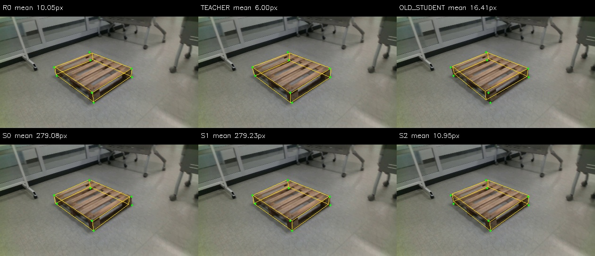

#### 중간 가림 · wood_183705:001263 — S0 112.76 → S2 26.93px (변화 -85.83px)

| R0 | 보정 Teacher | 이전 학생 | S0 기본 | S1 일반 가림 | S2 구조적 가림 |
|---:|---:|---:|---:|---:|---:|
| 18.48px | 11.51px | 400.34px | 112.76px | 24.91px | 26.93px |

S2의 평균 오차는 R0 대비 +8.44px, S1 대비 +2.02px다(음수=개선). 이 수치는 해당 이미지의 2D 평균 오차이며 PCK10이나 6D 정확도가 아니다.

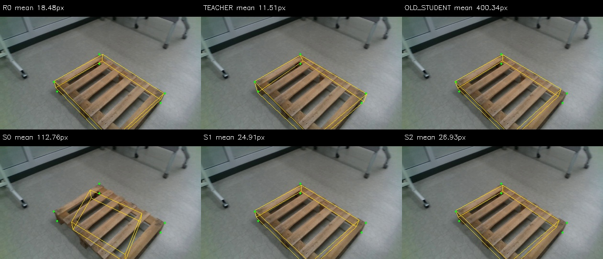

#### 심한 가림 · eval_night09:1779449596017728000 — S0 800.00 → S2 8.69px (변화 -791.31px)

| R0 | 보정 Teacher | 이전 학생 | S0 기본 | S1 일반 가림 | S2 구조적 가림 |
|---:|---:|---:|---:|---:|---:|
| 800.00px | 800.00px | 800.00px | 800.00px | 800.00px | 8.69px |

S2의 평균 오차는 R0 대비 -791.31px, S1 대비 -791.31px다(음수=개선). 이 수치는 해당 이미지의 2D 평균 오차이며 PCK10이나 6D 정확도가 아니다.

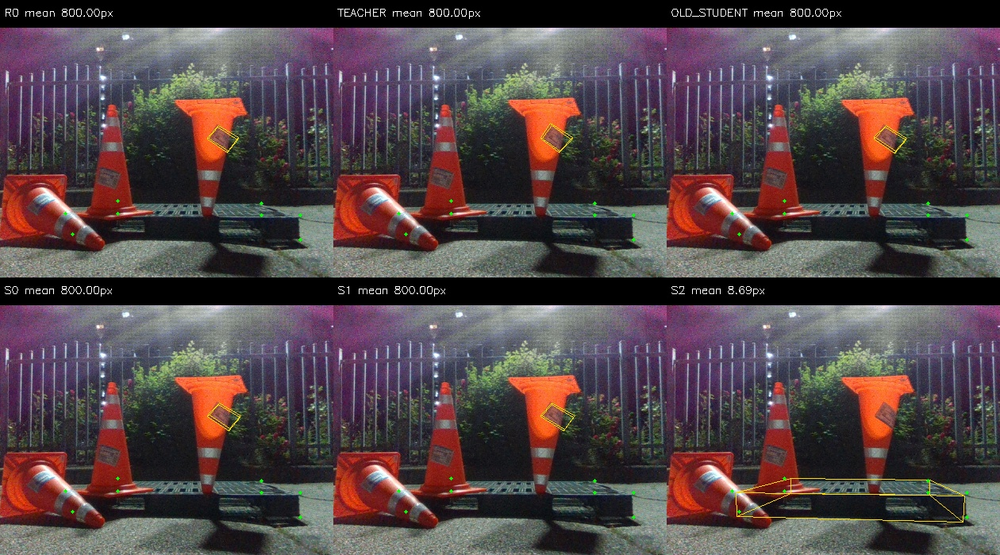

### 악화된 사례

#### Clean · wood_184309:001201 — S0 8.18 → S2 24.57px (변화 +16.39px)

| R0 | 보정 Teacher | 이전 학생 | S0 기본 | S1 일반 가림 | S2 구조적 가림 |
|---:|---:|---:|---:|---:|---:|
| 37.95px | 27.52px | 8.05px | 8.18px | 13.71px | 24.57px |

S2의 평균 오차는 R0 대비 -13.38px, S1 대비 +10.86px다(음수=개선). 이 수치는 해당 이미지의 2D 평균 오차이며 PCK10이나 6D 정확도가 아니다.

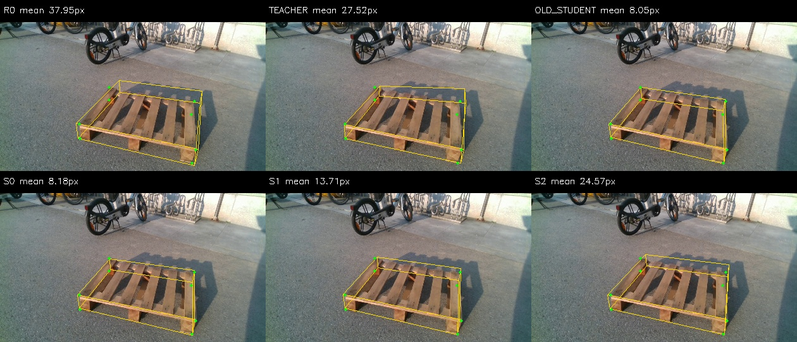

#### 중간 가림 · wood_day_01:002141 — S0 6.73 → S2 198.65px (변화 +191.93px)

| R0 | 보정 Teacher | 이전 학생 | S0 기본 | S1 일반 가림 | S2 구조적 가림 |
|---:|---:|---:|---:|---:|---:|
| 197.04px | 195.57px | 198.35px | 6.73px | 9.56px | 198.65px |

S2의 평균 오차는 R0 대비 +1.61px, S1 대비 +189.10px다(음수=개선). 이 수치는 해당 이미지의 2D 평균 오차이며 PCK10이나 6D 정확도가 아니다.

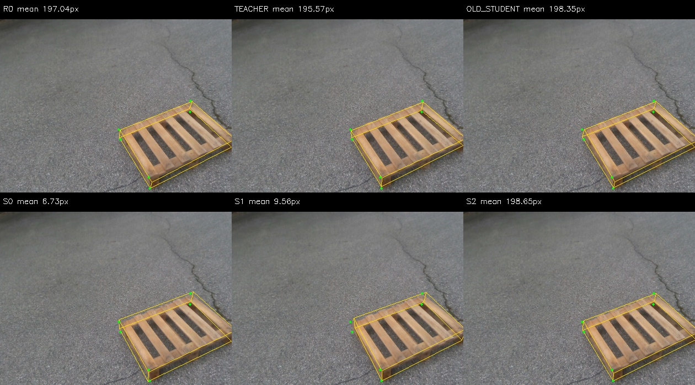

#### 심한 가림 · eval_outside:1778651650839160832 — S0 23.25 → S2 38.42px (변화 +15.16px)

| R0 | 보정 Teacher | 이전 학생 | S0 기본 | S1 일반 가림 | S2 구조적 가림 |
|---:|---:|---:|---:|---:|---:|
| 44.82px | 44.70px | 41.11px | 23.25px | 15.99px | 38.42px |

S2의 평균 오차는 R0 대비 -6.40px, S1 대비 +22.43px다(음수=개선). 이 수치는 해당 이미지의 2D 평균 오차이며 PCK10이나 6D 정확도가 아니다.

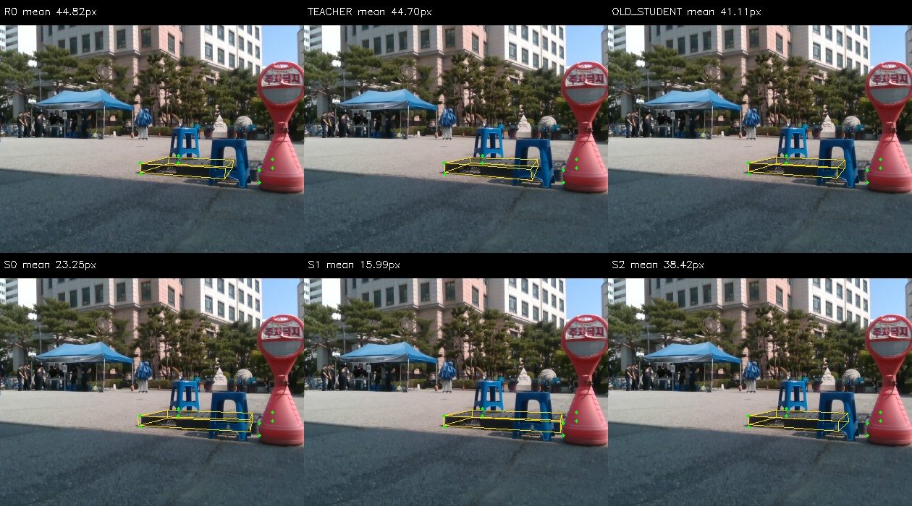

### 고정 무작위 사례

#### Clean · eval_cad:1778653030233998336 — S0 16.80 → S2 16.21px (변화 -0.58px)

| R0 | 보정 Teacher | 이전 학생 | S0 기본 | S1 일반 가림 | S2 구조적 가림 |
|---:|---:|---:|---:|---:|---:|
| 12.17px | 7.76px | 14.76px | 16.80px | 17.77px | 16.21px |

S2의 평균 오차는 R0 대비 +4.04px, S1 대비 -1.56px다(음수=개선). 이 수치는 해당 이미지의 2D 평균 오차이며 PCK10이나 6D 정확도가 아니다.

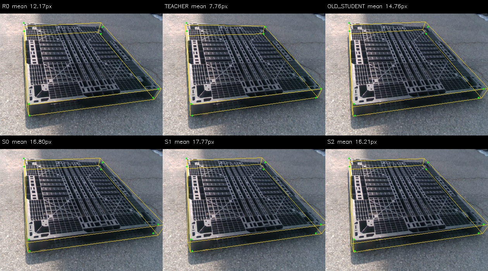

#### 중간 가림 · eval_night08:1779449488068910592 — S0 14.83 → S2 15.31px (변화 +0.47px)

| R0 | 보정 Teacher | 이전 학생 | S0 기본 | S1 일반 가림 | S2 구조적 가림 |
|---:|---:|---:|---:|---:|---:|
| 15.29px | 13.27px | 15.75px | 14.83px | 21.21px | 15.31px |

S2의 평균 오차는 R0 대비 +0.02px, S1 대비 -5.90px다(음수=개선). 이 수치는 해당 이미지의 2D 평균 오차이며 PCK10이나 6D 정확도가 아니다.

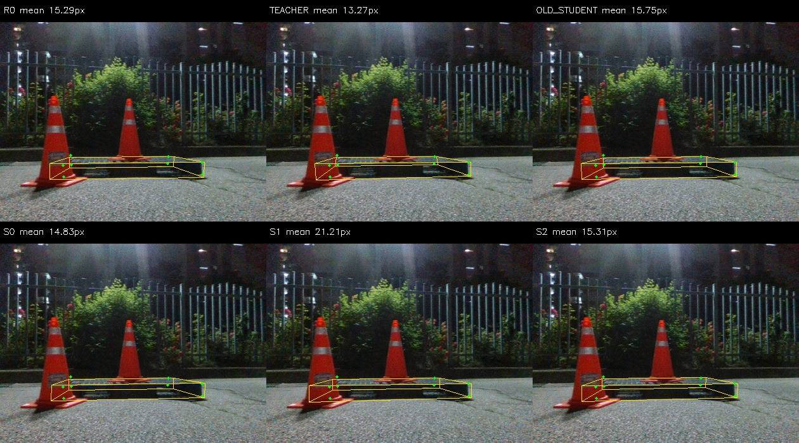

#### 심한 가림 · eval_pallet09:1778653811763352320 — S0 47.98 → S2 49.66px (변화 +1.68px)

| R0 | 보정 Teacher | 이전 학생 | S0 기본 | S1 일반 가림 | S2 구조적 가림 |
|---:|---:|---:|---:|---:|---:|
| 48.40px | 46.38px | 46.90px | 47.98px | 43.76px | 49.66px |

S2의 평균 오차는 R0 대비 +1.26px, S1 대비 +5.90px다(음수=개선). 이 수치는 해당 이미지의 2D 평균 오차이며 PCK10이나 6D 정확도가 아니다.

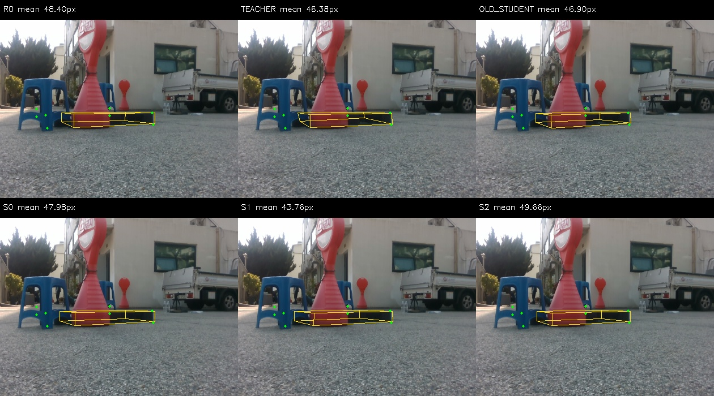

### 학습에 실제 사용한 가림 예시

왼쪽 S0 / 가운데 S1 / 오른쪽 S2. 빨간 점은 가림 영역에 포함된 감독점, 초록 점은 남아 있는 감독점이다. 결과 예측이 아니라 학습 입력·타깃 표시다.

WOOD · epoch 1 · slot 934

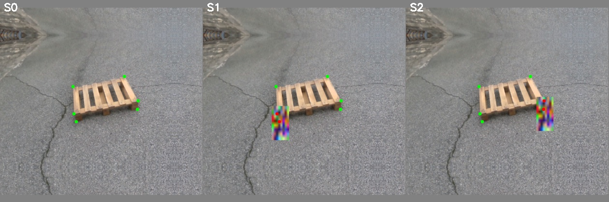

WOOD · epoch 2 · slot 795

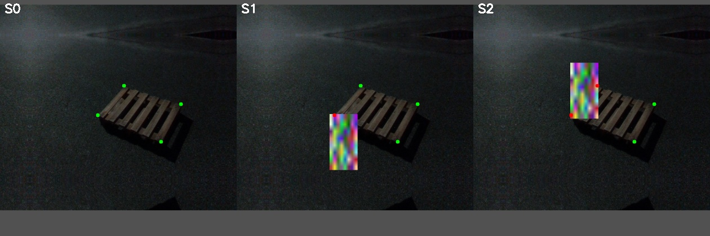

WOOD · epoch 5 · slot 885

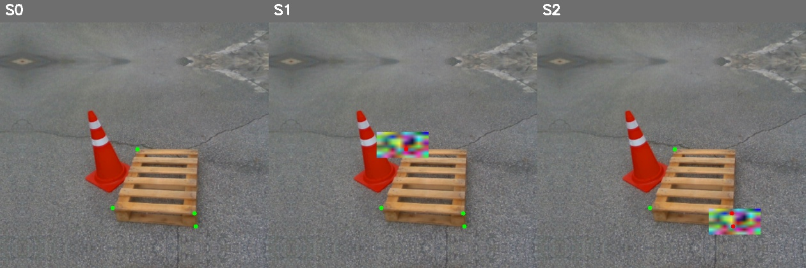

WOOD · epoch 4 · slot 534

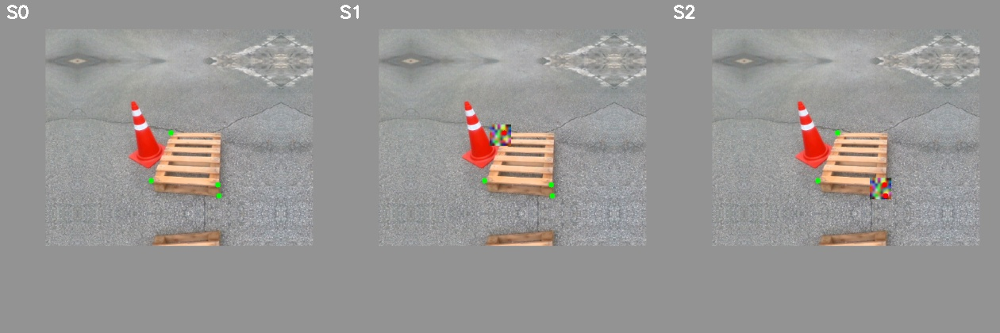

WOOD · epoch 3 · slot 897

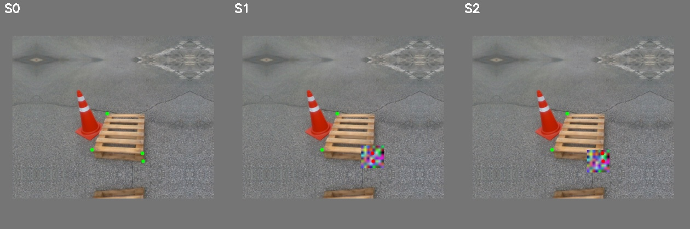

WOOD · epoch 4 · slot 731

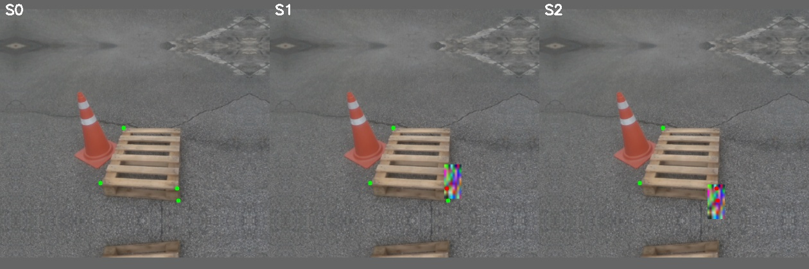

PLASTIC · epoch 4 · slot 178

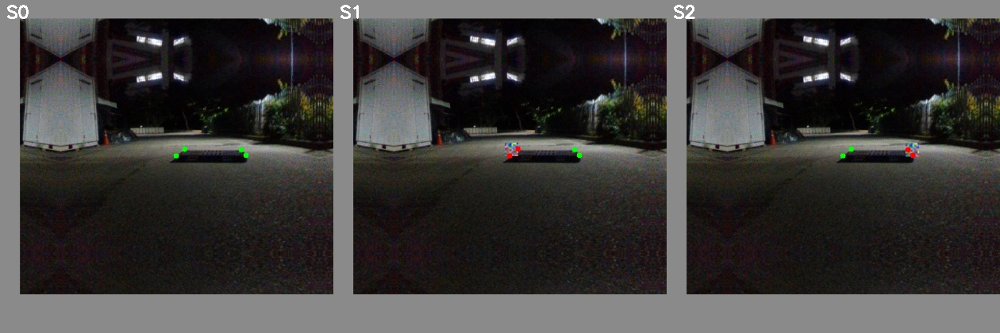

WOOD · epoch 4 · slot 776

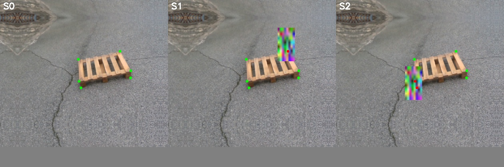

WOOD · epoch 2 · slot 210

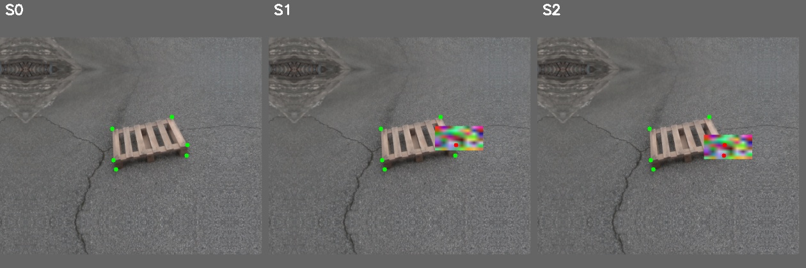

WOOD · epoch 1 · slot 200

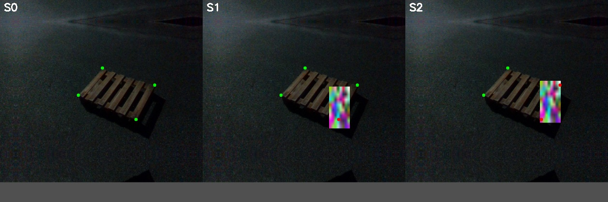
