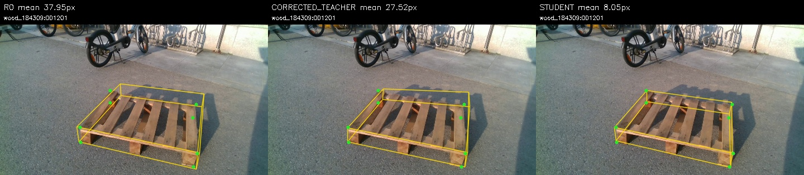
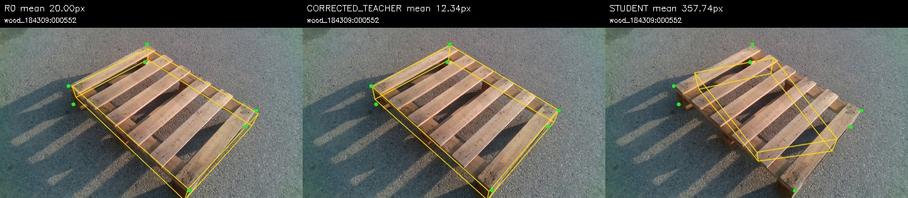
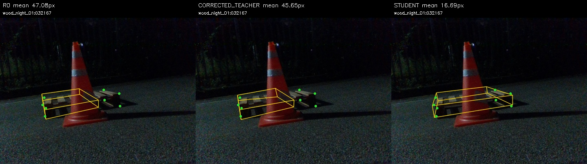
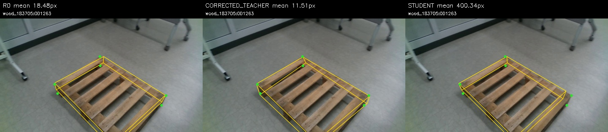
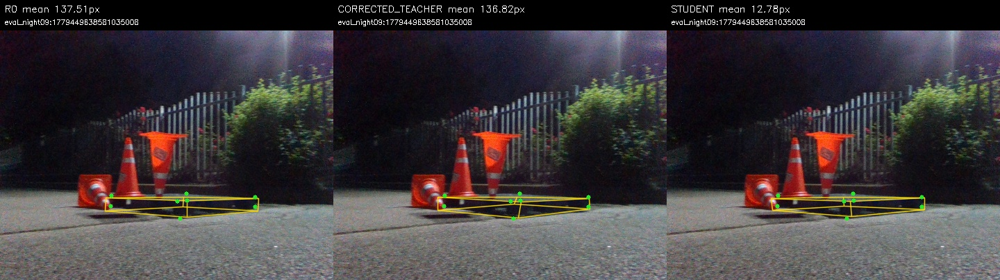
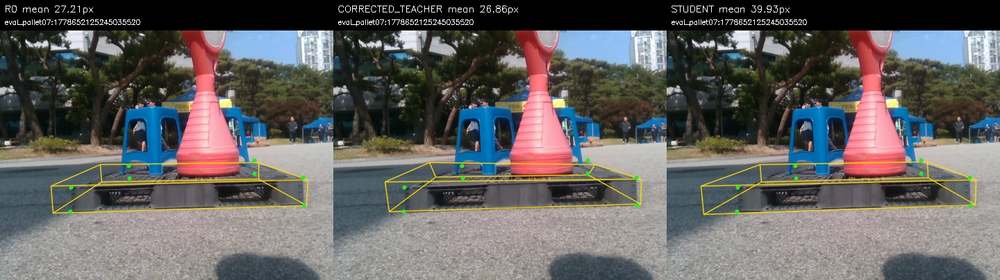
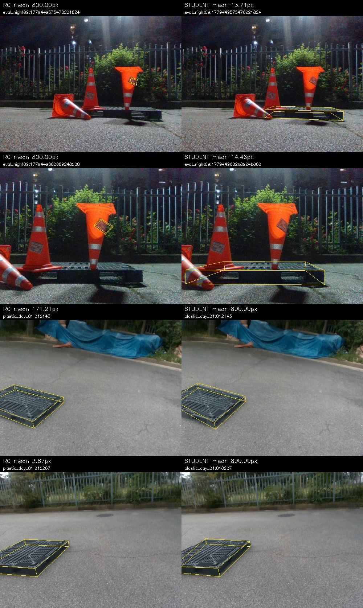
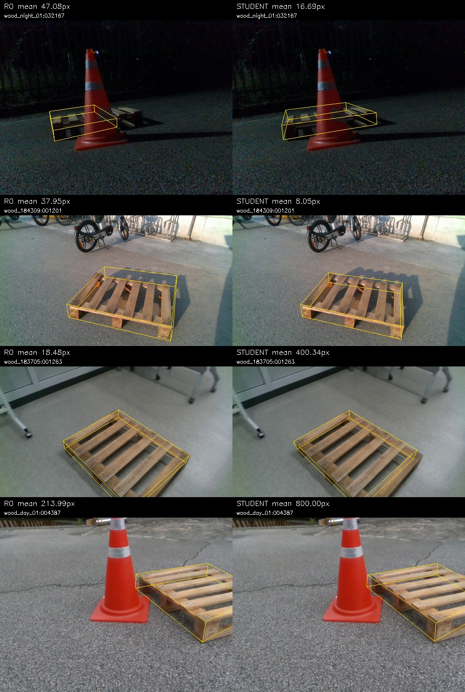

# Clean19 보정·자기 가림 PnP·종류별 Self-training 종합 보고서

작성: 2026-09-22. 추가 학습 없이 완료된 결과를 모아 작성했다. 이번 사용자 요청에 따라 코드·보고서·표·비교 이미지를 main에 공개한다. 이전 문서의 “commit/push 없음”은 당시 상태이며 이번 게시 요청으로 변경되었다.

## 결론

**평가300장에서는 보정기를 직접 적용하는 방법이 학생 단독보다 코너 정밀도와 주요6D 지표가 높았다.** 학생은 Clean의 일부6D 지표는 개선했지만 심한 가림에서는6D가 악화했다. 이번320step 실험에서 보정 지식을 학생에게 충분히 전달하지 못했으며, 최종모델 교체나 후속 튜닝은 하지 않았다.

## 데이터와 실험 순서

- 기존 어노테이션319장 중 Clean19장(플라스틱10·목재9) 학습 / 나머지300장 평가. 원본 이미지 SHA 교차0. 같은 촬영 세션 사용은 사용자 승인 사항이며 독립환경 검증은 아니다.
- 1단계: 합성전용 PRIOR1에서 혼합19장 보정기, 이어 종류별10/9장 보정기를 각각300step 학습. 직접클릭 코너 감독+합성 replay.
- 2단계: R0 PnP로 자기 가림을 판정하고 비가림점에만 종류별 보정 적용 → 비가림점만으로 PnP 재추정 → 자기 가림점만 대체. 직육면체 근사이며 외부물체 가림 검출이 아니다.
- 3단계: 19장의 위 보정 결과를 고정 수도레이블로 사용. 17장 숨은점 대체,2장 판정변화 fallback. 두 학생 모두 원래 R0에서 시작; 종류별 실사512복원추출 슬롯+동일 혼합합성512슬롯,5epoch/320update,seed42,최종last 고정.
- 학생 평가는 보정기/필터 없는 단독추론. 재학습한 것은 YOLO 학생이며 보정기를 또 학습한 것이 아니다. 학생 실사 target에 수동GT 좌표를 직접 넣지 않았지만 보정기는 이19장의 수동GT로 학습되었으므로 완전 무라벨 학습이 아닌 보정 지식 증류다.
- 2D 평가는2347코너; 이미지 제외 없음. PCK는 매칭실패 penalty 포함, median/P90은 매칭 성공 코너만. 중심점은 코너 평가에서 제외.
- 6D는 동일 prediction-only W/D selector+SQPnP/LM, canonical 물리축/C2대칭. GT로 축 선택 없음. ADD AUC는 객체별 대각선 정규화 후0~0.1적분, 성공률 아님. PoseCov=계산가능 비율이지 정답률 아님.
- 6D참조는 어노테이션에서 기하학적으로 복원한 값으로 독립 실측GT가 아니다. 이전 CF-only 표와 수치를 혼합하지 않는다. AP/negative오검출은 이번 학생에 대해 새로 측정하지 않았다.

## 검증

두 학생 각각320 optimizer update·R0 초기화일치 확인. 수도레이블171좌표 정규화 왕복검사 통과. R0 300장 재추론 좌표차이0px 및 점수 재현 확인. 평가예측은 채점 전 고정. 모델선택·GT변경 없음. 보정 없는 수도레이블 학생 대조군은 없으므로 개선 원인을 보정 단독효과로 주장하지 않는다.

## 전체300장

### 2D

| 방법 | PCK5↑ | PCK10↑ | PCK20↑ | median px↓ | P90 px↓ | >20px 코너↓ | 매칭↑ |
|---|---:|---:|---:|---:|---:|---:|---:|
| R0 | 35.07% | 62.59% | 79.68% | 6.96 | 43.49 | 477 | 292/300 |
| 보정 적용 | 48.96% | 70.52% | 80.91% | 4.99 | 44.66 | 448 | 292/300 |
| Self-training 학생 | 37.03% | 61.14% | 80.32% | 7.19 | 36.70 | 462 | 293/300 |

### 6D

| 방법 | PoseCov↑ | AxisAcc↑ | R med°↓ | Yaw med°↓ | t med cm↓ | IoU3D med↑ | ADDsym AUC↑ |
|---|---:|---:|---:|---:|---:|---:|---:|
| R0 | 100.00% | 74.33% | 2.609 | 1.360 | 8.146 | 0.5873 | 0.3727 |
| 보정 적용 | 100.00% | 75.33% | 2.247 | 1.123 | 6.209 | 0.6494 | 0.4454 |
| Self-training 학생 | 100.00% | 73.00% | 2.781 | 1.565 | 7.426 | 0.6214 | 0.3922 |

## 일반 플라스틱184장

### 2D

| 방법 | PCK5↑ | PCK10↑ | PCK20↑ | median px↓ | P90 px↓ | >20px 코너↓ | 매칭↑ |
|---|---:|---:|---:|---:|---:|---:|---:|
| R0 | 32.73% | 59.53% | 77.53% | 7.63 | 43.13 | 322 | 176/184 |
| 보정 적용 | 46.69% | 69.16% | 78.86% | 5.12 | 43.03 | 303 | 176/184 |
| Self-training 학생 | 34.05% | 58.90% | 77.95% | 7.62 | 36.61 | 316 | 178/184 |

### 6D

| 방법 | PoseCov↑ | AxisAcc↑ | R med°↓ | Yaw med°↓ | t med cm↓ | IoU3D med↑ | ADDsym AUC↑ |
|---|---:|---:|---:|---:|---:|---:|---:|
| R0 | 100.00% | 69.57% | 2.542 | 1.448 | 10.273 | 0.5716 | 0.3259 |
| 보정 적용 | 100.00% | 72.83% | 2.270 | 1.445 | 7.951 | 0.6155 | 0.4207 |
| Self-training 학생 | 100.00% | 67.39% | 2.913 | 1.951 | 10.064 | 0.5778 | 0.3382 |

## 목재116장

### 2D

| 방법 | PCK5↑ | PCK10↑ | PCK20↑ | median px↓ | P90 px↓ | >20px 코너↓ | 매칭↑ |
|---|---:|---:|---:|---:|---:|---:|---:|
| R0 | 38.73% | 67.40% | 83.04% | 6.30 | 43.67 | 155 | 116/116 |
| 보정 적용 | 52.52% | 72.65% | 84.14% | 4.75 | 50.78 | 145 | 116/116 |
| Self-training 학생 | 41.68% | 64.66% | 84.03% | 6.33 | 36.90 | 146 | 115/116 |

### 6D

| 방법 | PoseCov↑ | AxisAcc↑ | R med°↓ | Yaw med°↓ | t med cm↓ | IoU3D med↑ | ADDsym AUC↑ |
|---|---:|---:|---:|---:|---:|---:|---:|
| R0 | 100.00% | 81.90% | 2.684 | 1.276 | 4.168 | 0.6334 | 0.4468 |
| 보정 적용 | 100.00% | 79.31% | 2.247 | 0.877 | 3.108 | 0.7055 | 0.4846 |
| Self-training 학생 | 100.00% | 81.90% | 2.719 | 1.128 | 3.510 | 0.6947 | 0.4778 |

## Clean132장

### 2D

| 방법 | PCK5↑ | PCK10↑ | PCK20↑ | median px↓ | P90 px↓ | >20px 코너↓ | 매칭↑ |
|---|---:|---:|---:|---:|---:|---:|---:|
| R0 | 45.81% | 73.62% | 90.86% | 5.39 | 18.42 | 96 | 132/132 |
| 보정 적용 | 63.05% | 83.90% | 92.38% | 3.71 | 15.32 | 80 | 132/132 |
| Self-training 학생 | 49.24% | 72.19% | 90.86% | 5.15 | 18.99 | 96 | 132/132 |

### 6D

| 방법 | PoseCov↑ | AxisAcc↑ | R med°↓ | Yaw med°↓ | t med cm↓ | IoU3D med↑ | ADDsym AUC↑ |
|---|---:|---:|---:|---:|---:|---:|---:|
| R0 | 100.00% | 88.64% | 1.632 | 0.693 | 4.049 | 0.6783 | 0.5206 |
| 보정 적용 | 100.00% | 90.91% | 1.214 | 0.604 | 2.900 | 0.7488 | 0.6254 |
| Self-training 학생 | 100.00% | 90.91% | 1.733 | 0.643 | 3.399 | 0.7039 | 0.5761 |

## 중간 가림87장

### 2D

| 방법 | PCK5↑ | PCK10↑ | PCK20↑ | median px↓ | P90 px↓ | >20px 코너↓ | 매칭↑ |
|---|---:|---:|---:|---:|---:|---:|---:|
| R0 | 35.92% | 64.53% | 78.69% | 7.08 | 99.88 | 143 | 87/87 |
| 보정 적용 | 47.39% | 68.85% | 79.14% | 5.38 | 97.03 | 140 | 87/87 |
| Self-training 학생 | 35.32% | 61.70% | 77.35% | 7.14 | 84.86 | 152 | 84/87 |

### 6D

| 방법 | PoseCov↑ | AxisAcc↑ | R med°↓ | Yaw med°↓ | t med cm↓ | IoU3D med↑ | ADDsym AUC↑ |
|---|---:|---:|---:|---:|---:|---:|---:|
| R0 | 100.00% | 77.01% | 2.296 | 1.467 | 8.167 | 0.5943 | 0.3479 |
| 보정 적용 | 100.00% | 75.86% | 2.346 | 1.418 | 5.515 | 0.6543 | 0.4289 |
| Self-training 학생 | 100.00% | 71.26% | 2.808 | 2.020 | 7.535 | 0.5855 | 0.3555 |

## 심한 가림81장

### 2D

| 방법 | PCK5↑ | PCK10↑ | PCK20↑ | median px↓ | P90 px↓ | >20px 코너↓ | 매칭↑ |
|---|---:|---:|---:|---:|---:|---:|---:|
| R0 | 16.13% | 42.01% | 61.98% | 11.08 | 52.33 | 238 | 73/81 |
| 보정 적용 | 27.00% | 49.84% | 63.58% | 8.86 | 52.78 | 228 | 73/81 |
| Self-training 학생 | 18.37% | 42.01% | 65.81% | 11.77 | 51.00 | 214 | 77/81 |

### 6D

| 방법 | PoseCov↑ | AxisAcc↑ | R med°↓ | Yaw med°↓ | t med cm↓ | IoU3D med↑ | ADDsym AUC↑ |
|---|---:|---:|---:|---:|---:|---:|---:|
| R0 | 100.00% | 48.15% | 61.635 | 27.126 | 13.484 | 0.4895 | 0.1581 |
| 보정 적용 | 100.00% | 49.38% | 62.221 | 18.376 | 14.987 | 0.4917 | 0.1699 |
| Self-training 학생 | 100.00% | 45.68% | 77.281 | 77.238 | 14.423 | 0.4820 | 0.1317 |

## 난도별 실제 예측 비교

왼쪽 R0 / 가운데 보정 적용 / 오른쪽 학생. 노랑은 예측 모서리, 초록 점은 평가 reference 위치(번호 대응은 표시하지 않음). GT는 그림/채점에만 사용했다. 각 난도에서 세 모델 모두 검출매칭된 이미지 중 학생-R0 평균코너오차 차이가 가장 작은/큰 사례를 각각 표시했다. 평가 후 설명용 선택이며 대표 평균이나 학습 선택 기준이 아니다.

### Clean132장 — best 사례

### Clean132장 — worst 사례

### 중간 가림87장 — best 사례

### 중간 가림87장 — worst 사례

### 심한 가림81장 — best 사례

### 심한 가림81장 — worst 사례

## 검출매칭 변화까지 포함한 개선·악화 사례

아래는 종류별 개선 최대2장·악화 최대2장. GT점 없이 예측만 표시. 800px 표시는 실제 이동량이 아니라 box IoU<0.5일 때 이미지 대각선으로 부여한 penalty다.

## 상세 기록과 재현 코드

- [혼합19장 보정기 결과](../pallet_replay_clean19_v1/SUMMARY_KO.md)
- [종류별 보정기 결과](../pallet_replay_by_type_v1/RESULTS_KO.md)
- [비가림 보정→숨은점PnP 결과 및 적용수](../pallet_visible_refine_hidden_pnp_v1/RESULTS_KO.md)
- [학생2D 상세](RESULTS_KO.md) / [학생6D 상세](pose/RESULTS_KO.md)
- [학생 실행 코드](../../../scripts/research/pallet_clean19_student_v1.py) / [6D평가](../../../scripts/research/pallet_clean19_student_pose_v1.py) / [이 보고서 생성](../../../scripts/research/pallet_clean19_publish_report.py)

원본 데이터·체크포인트·대용량300장 로컬갤러리는 Git에 포함하지 않는다. 재현 시 기존 로컬 데이터/모델이 필요하며 프로토콜JSON에 경로·해시가 기록되어 있다. 이 게시물만으로 전체 학습을 재현할 수 있는 독립 데이터 배포는 아니다.
