# 개선·악화·큰 오류 사례 (FINAL)

전체99 선정은 아래 숫자 표와 private gallery에 보존했다. 공개 RGB 그림은 과거 공개된 ID 교집합에서 같은 규칙으로 별도 선정했으며 전체99의 최악 사례를 대신하지 않는다.

청록 실선/점은 native2D, 주황 점선은 저장된 최종 whole-pose 재투영, 초록 x는 legacy2D 참조다. T/R는 기하 재구성 참조에 대한 별도 값이며 독립 물리 GT가 아니다.

## OLD_REF_GEO-minus-R0_GEO

| Scope/category | ID | T before→after cm | R before→after ° |
|---|---|---:|---:|
| full99/both_improved | eval_night09:1779449575470221824 | 2563.837→2522.438 | 98.574→97.520 |
| full99/both_improved | eval_outside:1778651530691638016 | 50.245→10.081 | 87.435→1.075 |
| full99/both_worsened | eval_pallet09:1778653832794714368 | 34.533→53.859 | 2.963→87.652 |
| full99/both_worsened | eval_pallet09:1778653804674198784 | 128.832→136.231 | 0.814→1.697 |
| full99/largest_final_T | eval_night09:1779449575470221824 | 2563.837→2522.438 | 98.574→97.520 |
| full99/largest_final_T | eval_night09:1779449602689248000 | 1313.355→1299.379 | 65.118→64.845 |
| full99/largest_final_R | eval_night09:1779449575470221824 | 2563.837→2522.438 | 98.574→97.520 |
| full99/largest_final_R | eval_pallet09:1778653713962971904 | 11.241→9.870 | 89.216→89.859 |
| approved/both_improved | eval_night08:1779449485800670464 | 352.449→349.423 | 27.354→26.088 |
| approved/both_improved | eval_pallet07:1778652146612550912 | 8.850→6.932 | 4.456→3.486 |
| approved/both_worsened | eval_night09:1779449580573721600 | 5.332→6.510 | 8.813→9.597 |
| approved/both_worsened | eval_night08:1779449496875356416 | 291.676→291.827 | 76.198→76.588 |
| approved/largest_final_T | eval_night08:1779449483432542720 | 487.703→482.510 | 71.780→72.429 |
| approved/largest_final_T | eval_night08:1779449485800670464 | 352.449→349.423 | 27.354→26.088 |
| approved/largest_final_R | eval_pallet07:1778652144496057088 | 17.484→17.059 | 89.228→88.809 |
| approved/largest_final_R | eval_pallet09:1778653630038417664 | 7.166→7.834 | 89.349→88.130 |

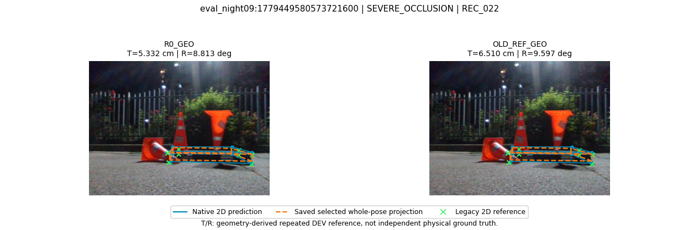

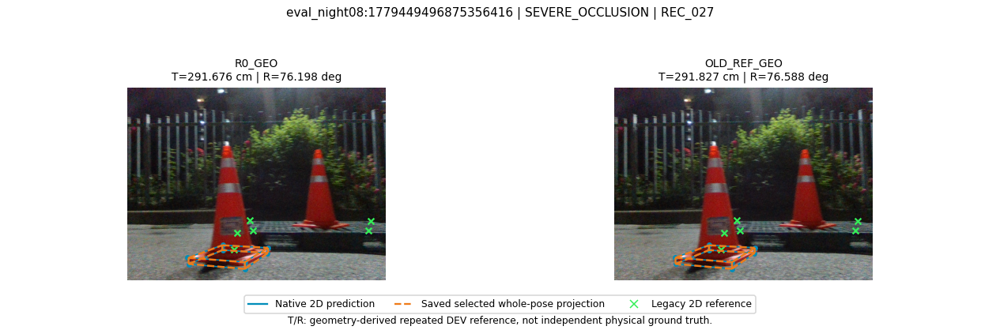

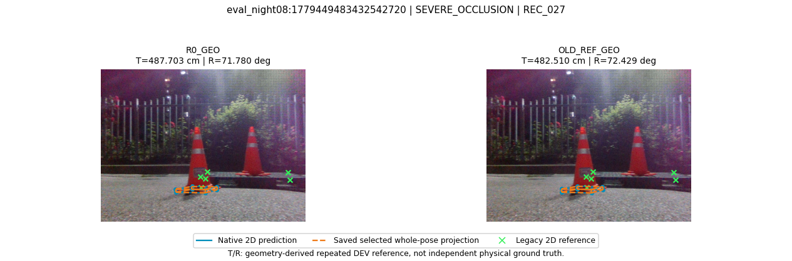

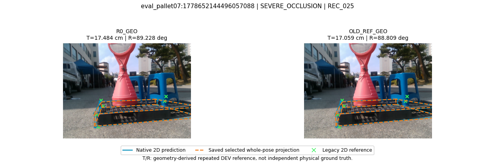

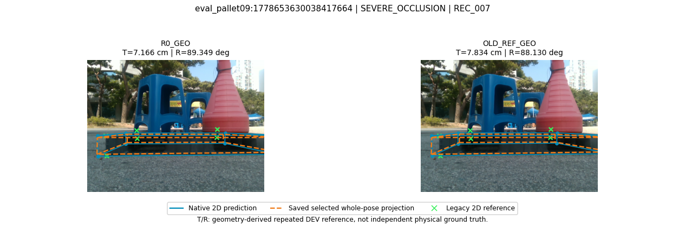

전체99의 before/after 산출 실패: 0장. 실패 목록은 JSON에 전수 보존했다.

## OLD_REF_GEO-minus-OLD_RAW_GEO

| Scope/category | ID | T before→after cm | R before→after ° |
|---|---|---:|---:|
| full99/both_improved | eval_night09:1779449593782795264 | 35.154→3.531 | 86.866→3.996 |
| full99/both_improved | eval_pallet09:1778653699314620416 | 28.419→14.721 | 89.963→5.762 |
| full99/both_worsened | eval_night09:1779449661263803392 | 534.049→634.019 | 61.496→75.239 |
| full99/both_worsened | eval_pallet09:1778653804674198784 | 127.088→136.231 | 1.310→1.697 |
| full99/largest_final_T | eval_night09:1779449575470221824 | 2539.979→2522.438 | 97.331→97.520 |
| full99/largest_final_T | eval_night09:1779449602689248000 | 1304.852→1299.379 | 65.283→64.845 |
| full99/largest_final_R | eval_night09:1779449575470221824 | 2539.979→2522.438 | 97.331→97.520 |
| full99/largest_final_R | eval_pallet09:1778653713962971904 | 12.918→9.870 | 89.706→89.859 |
| approved/both_improved | eval_pallet07:1778652146612550912 | 8.938→6.932 | 4.276→3.486 |
| approved/both_improved | eval_night08:1779449485800670464 | 351.013→349.423 | 26.999→26.088 |
| approved/both_worsened | eval_outside:1778651650839160832 | 81.329→82.705 | 80.972→80.992 |
| approved/both_worsened | eval_night09:1779449580573721600 | 5.239→6.510 | 9.074→9.597 |
| approved/largest_final_T | eval_night08:1779449483432542720 | 484.558→482.510 | 71.896→72.429 |
| approved/largest_final_T | eval_night08:1779449485800670464 | 351.013→349.423 | 26.999→26.088 |
| approved/largest_final_R | eval_pallet07:1778652144496057088 | 17.657→17.059 | 89.288→88.809 |
| approved/largest_final_R | eval_pallet09:1778653630038417664 | 6.653→7.834 | 89.126→88.130 |

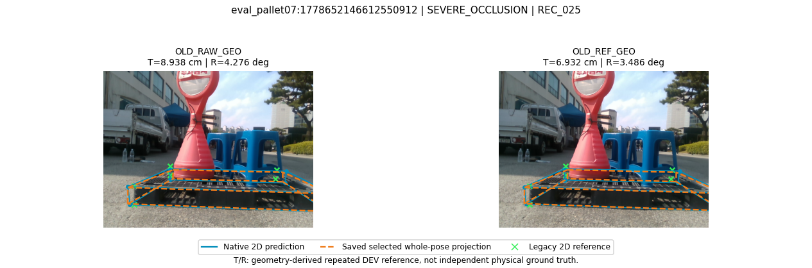

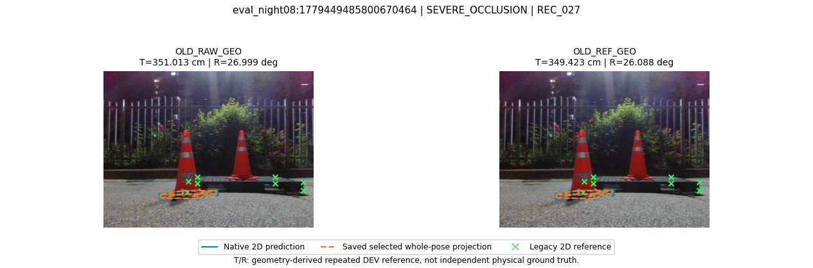

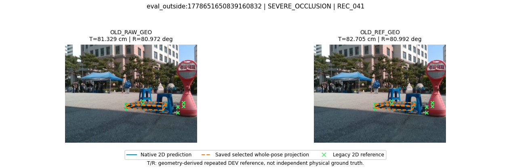

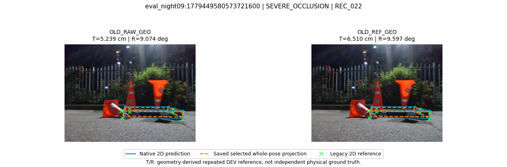

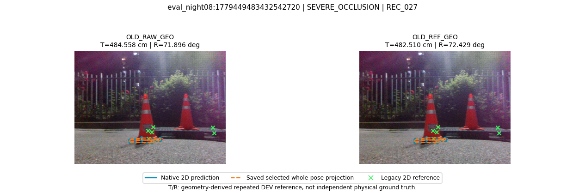

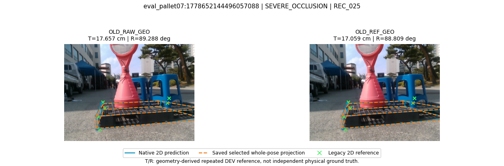

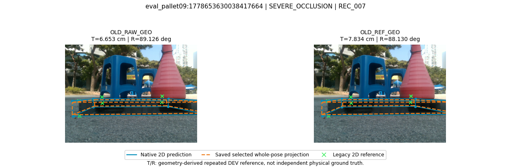

전체99의 before/after 산출 실패: 0장. 실패 목록은 JSON에 전수 보존했다.

## REF_CLEAR_S43_GEO-minus-OLD_REF_GEO

| Scope/category | ID | T before→after cm | R before→after ° |
|---|---|---:|---:|
| full99/both_improved | eval_night09:1779449661263803392 | 634.019→534.265 | 75.239→61.581 |
| full99/both_improved | eval_outside:1778653508779767808 | 14.327→10.361 | 9.143→8.369 |
| full99/both_worsened | eval_night09:1779449604823769344 | 1054.855→1059.437 | 64.652→65.240 |
| full99/both_worsened | eval_night09:1779449643284402176 | 47.062→50.402 | 5.759→5.878 |
| full99/largest_final_T | eval_night09:1779449575470221824 | 2522.438→2525.678 | 97.520→97.120 |
| full99/largest_final_T | eval_night09:1779449602689248000 | 1299.379→1297.650 | 64.845→65.129 |
| full99/largest_final_R | eval_night09:1779449575470221824 | 2522.438→2525.678 | 97.520→97.120 |
| full99/largest_final_R | eval_pallet09:1778653706706429696 | 36.491→39.444 | 89.661→89.976 |
| approved/both_improved | eval_night08:1779449483432542720 | 482.510→481.976 | 72.429→71.579 |
| approved/both_worsened | eval_outside:1778651650839160832 | 82.705→84.974 | 80.992→81.298 |
| approved/both_worsened | eval_night08:1779449485800670464 | 349.423→350.618 | 26.088→27.151 |
| approved/largest_final_T | eval_night08:1779449483432542720 | 482.510→481.976 | 72.429→71.579 |
| approved/largest_final_T | eval_night08:1779449485800670464 | 349.423→350.618 | 26.088→27.151 |
| approved/largest_final_R | eval_pallet07:1778652144496057088 | 17.059→17.089 | 88.809→88.873 |
| approved/largest_final_R | eval_pallet09:1778653630038417664 | 7.834→7.740 | 88.130→88.531 |

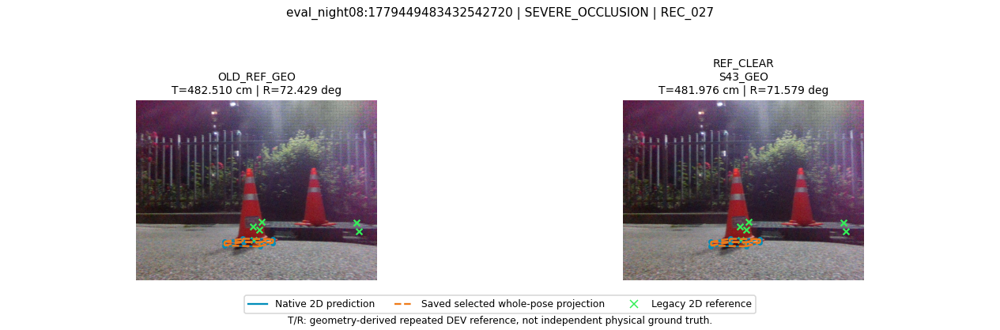

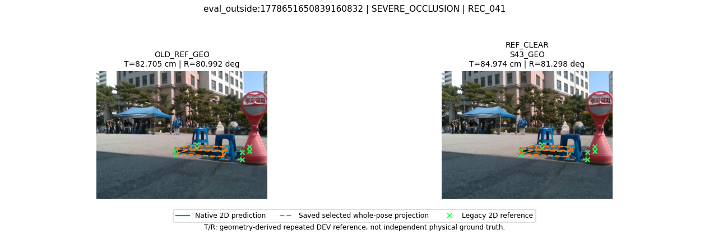

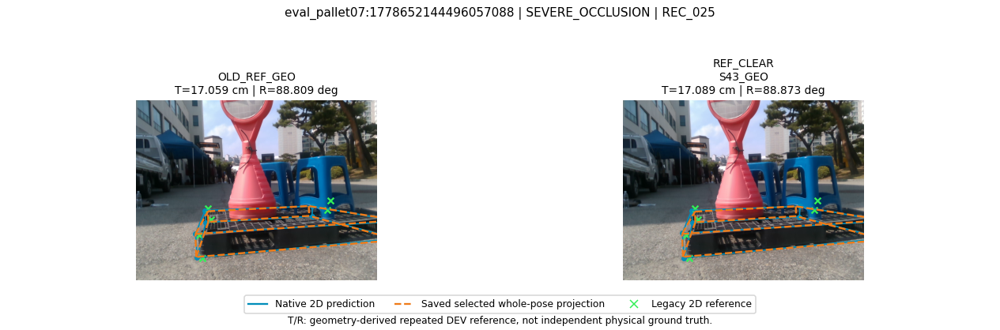

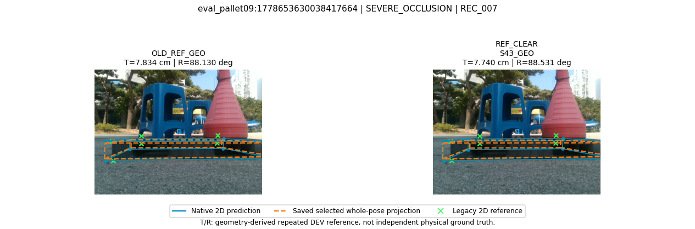

전체99의 before/after 산출 실패: 0장. 실패 목록은 JSON에 전수 보존했다.

## REF_OCC_S43_GEO-minus-REF_CLEAR_S43_GEO

| Scope/category | ID | T before→after cm | R before→after ° |
|---|---|---:|---:|
| full99/both_improved | eval_night09:1779449575470221824 | 2525.678→2524.432 | 97.120→97.024 |
| full99/both_improved | eval_night09:1779449596017728000 | 1257.400→1256.739 | 86.067→86.019 |
| full99/both_worsened | eval_pallet09:1778653721118964736 | 21.630→22.107 | 89.722→89.792 |
| full99/both_worsened | eval_outside:1778653508779767808 | 10.361→10.776 | 8.369→8.389 |
| full99/largest_final_T | eval_night09:1779449575470221824 | 2525.678→2524.432 | 97.120→97.024 |
| full99/largest_final_T | eval_night09:1779449602689248000 | 1297.650→1296.547 | 65.129→65.141 |
| full99/largest_final_R | eval_night09:1779449575470221824 | 2525.678→2524.432 | 97.120→97.024 |
| full99/largest_final_R | eval_pallet09:1778653706706429696 | 39.444→39.372 | 89.976→89.982 |
| approved/both_improved | eval_night08:1779449496875356416 | 294.048→293.528 | 76.414→76.409 |
| approved/both_improved | eval_night09:1779449580573721600 | 6.887→6.779 | 9.155→9.064 |
| approved/both_worsened | eval_night08:1779449485800670464 | 350.618→350.958 | 27.151→27.214 |
| approved/both_worsened | eval_pallet09:1778653630038417664 | 7.740→7.804 | 88.531→88.579 |
| approved/largest_final_T | eval_night08:1779449483432542720 | 481.976→482.203 | 71.579→71.536 |
| approved/largest_final_T | eval_night08:1779449485800670464 | 350.618→350.958 | 27.151→27.214 |
| approved/largest_final_R | eval_pallet07:1778652144496057088 | 17.089→16.971 | 88.873→88.885 |
| approved/largest_final_R | eval_pallet09:1778653630038417664 | 7.740→7.804 | 88.531→88.579 |

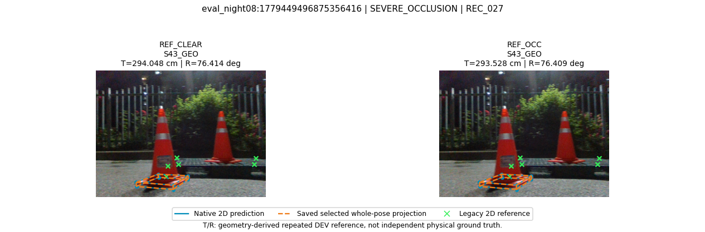

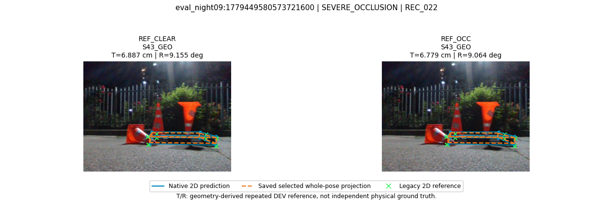

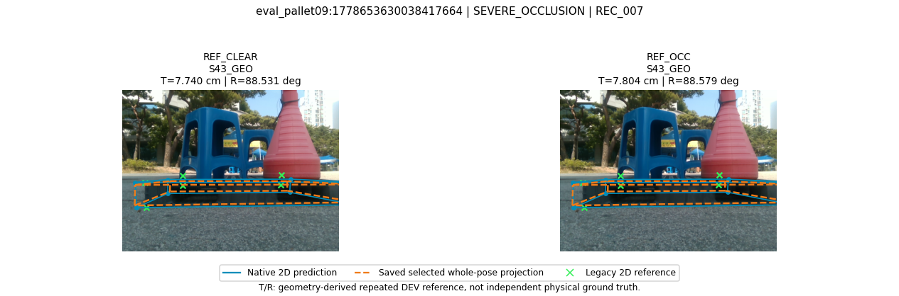

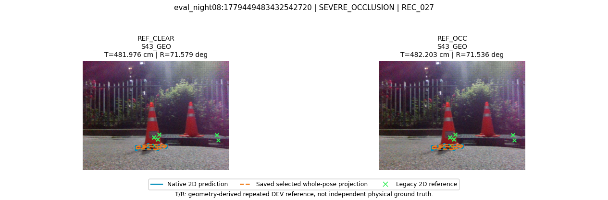

전체99의 before/after 산출 실패: 0장. 실패 목록은 JSON에 전수 보존했다.

## REF_OCC_S42_NEWGEO-minus-RAW_OCC_S42_NEWGEO

| Scope/category | ID | T before→after cm | R before→after ° |
|---|---|---:|---:|
| full99/both_improved | eval_night08:1779449492505469440 | 37.613→16.636 | 85.952→1.797 |
| full99/both_improved | eval_pallet09:1778653699314620416 | 30.513→13.310 | 89.528→5.931 |
| full99/both_worsened | eval_pallet09:1778653706706429696 | 29.524→39.054 | 89.734→89.933 |
| full99/both_worsened | eval_pallet09:1778653804674198784 | 128.279→137.793 | 1.827→1.931 |
| full99/largest_final_T | eval_night09:1779449575470221824 | 2558.328→2529.500 | 97.343→97.472 |
| full99/largest_final_T | eval_night09:1779449596017728000 | 1264.711→1257.822 | 86.275→86.182 |
| full99/largest_final_R | eval_night09:1779449575470221824 | 2558.328→2529.500 | 97.343→97.472 |
| full99/largest_final_R | eval_pallet09:1778653704118966272 | 11.168→12.670 | 89.992→89.954 |
| approved/both_improved | eval_pallet07:1778652146612550912 | 8.473→7.518 | 4.590→4.090 |
| approved/both_improved | eval_night08:1779449483432542720 | 483.848→483.084 | 71.863→71.598 |
| approved/both_worsened | eval_outside:1778651650839160832 | 81.803→85.069 | 81.258→81.366 |
| approved/both_worsened | eval_night09:1779449580573721600 | 5.437→7.005 | 8.663→9.006 |
| approved/largest_final_T | eval_night08:1779449483432542720 | 483.848→483.084 | 71.863→71.598 |
| approved/largest_final_T | eval_night08:1779449485800670464 | 352.595→350.785 | 26.941→27.240 |
| approved/largest_final_R | eval_pallet07:1778652144496057088 | 17.177→17.015 | 89.358→88.922 |
| approved/largest_final_R | eval_pallet09:1778653630038417664 | 7.203→7.822 | 89.495→88.717 |

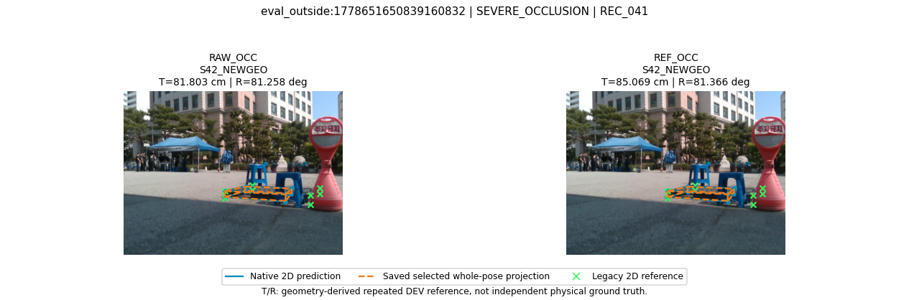

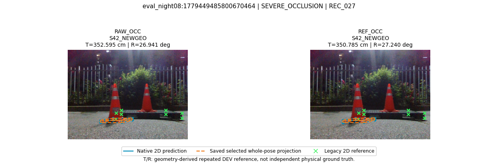

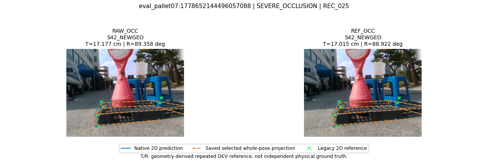

전체99의 before/after 산출 실패: 0장. 실패 목록은 JSON에 전수 보존했다.

## REF_OCC_S43_NEWGEO-minus-RAW_OCC_S43_NEWGEO

| Scope/category | ID | T before→after cm | R before→after ° |
|---|---|---:|---:|
| full99/both_improved | eval_pallet09:1778653699314620416 | 30.635→13.258 | 89.480→5.983 |
| full99/both_improved | eval_pallet09:1778653693804927232 | 21.058→12.351 | 3.593→3.575 |
| full99/both_worsened | eval_pallet09:1778653804674198784 | 127.393→137.183 | 1.899→2.031 |
| full99/both_worsened | eval_pallet09:1778653706706429696 | 29.805→39.372 | 89.801→89.982 |
| full99/largest_final_T | eval_night09:1779449575470221824 | 2554.282→2524.432 | 96.896→97.024 |
| full99/largest_final_T | eval_night09:1779449596017728000 | 1264.148→1256.739 | 86.139→86.019 |
| full99/largest_final_R | eval_night09:1779449575470221824 | 2554.282→2524.432 | 96.896→97.024 |
| full99/largest_final_R | eval_pallet09:1778653706706429696 | 29.805→39.372 | 89.801→89.982 |
| approved/both_improved | eval_night08:1779449483432542720 | 483.417→482.203 | 71.864→71.536 |
| approved/both_improved | eval_pallet07:1778652146612550912 | 8.532→7.525 | 4.342→3.942 |
| approved/both_worsened | eval_outside:1778651650839160832 | 81.342→84.695 | 81.176→81.311 |
| approved/both_worsened | eval_night09:1779449580573721600 | 5.312→6.779 | 8.791→9.064 |
| approved/largest_final_T | eval_night08:1779449483432542720 | 483.417→482.203 | 71.864→71.536 |
| approved/largest_final_T | eval_night08:1779449485800670464 | 352.913→350.958 | 26.895→27.214 |
| approved/largest_final_R | eval_pallet07:1778652144496057088 | 17.228→16.971 | 89.273→88.885 |
| approved/largest_final_R | eval_pallet09:1778653630038417664 | 7.043→7.804 | 89.261→88.579 |

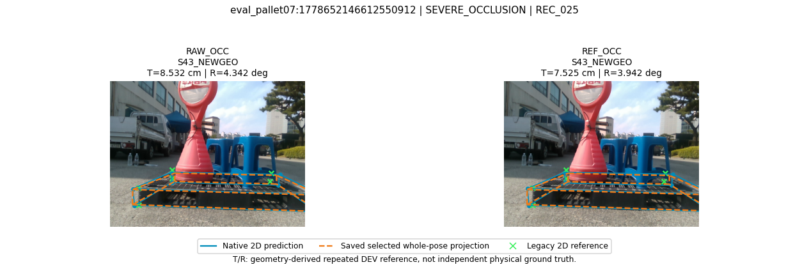

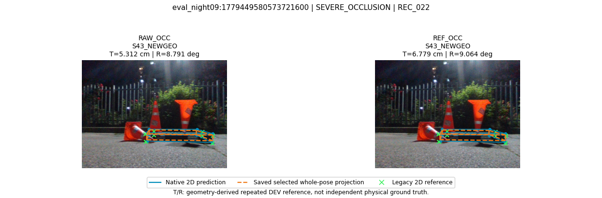

전체99의 before/after 산출 실패: 0장. 실패 목록은 JSON에 전수 보존했다.

