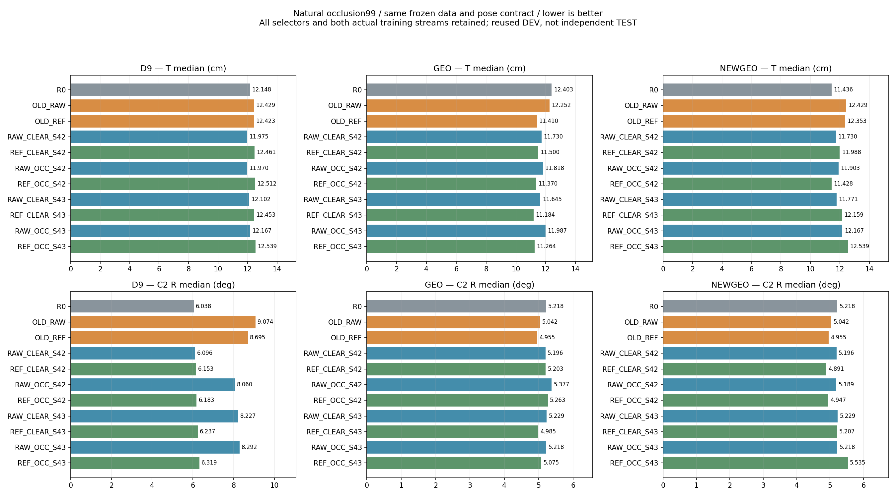

# 자연 가림 위치·회전: 최소 구성 후속 실험 최종 보고

이번 추가 실험에서 기존217장 보정학생+기존GEO보다 위치·회전 중앙값을 함께 낮춘 구성은 없었다. 기존 고정 대조를 유지하고 입력가림·새GEO·clean78로의 교체는 채택하지 않는다. 전역최적 또는 실제배포 충분성을 입증한 것은 아니다.

기준 main `6ba5604a`의 완료 결과를 보존한 후속 배치다. 누락 대조와 이번 실험은 기존 DEV 결과를 본 뒤 추가했다. 소급 사전등록 또는 독립 평가라고 부르지 않는다.

## 남기는 구성과 제외한 변경

- **유지:** 기존217장 REF_LR5 학생+기존GEO. 자연99 위치11.4101cm/회전4.9553°. 추가 실험 전 강한 대조 그대로이므로 그 대조 대비 새 개선량은0cm/0°다. 운영중인 모델파일은 자동 교체하지 않았다.
- **자기학습:** 같은GEO의R0보다 위치중앙값−0.9931cm(−9.931mm), 회전−0.2623°. 41/99장은 둘다개선,23장은 둘다악화. 선택기만 붙인 R0와 구분되는 이득 신호지만 독립반복으로 필요성을 증명한 것은 아니다.
- **좌표 보정:** 기존217장 RAW+같은GEO 대비−0.8419cm(−8.419mm)/−0.0872°. 두중앙값은 낮으나 회전효과가작고 T P90은 악화한다. clean78 CLEAR는seed42회전미세악화/seed43개선으로 일반화된 공동이득을 주장하지 않는다.
- **입력 가림 제외:** 기존GEO의 REF OCC−CLEAR는seed42 T−0.1302cm/R+0.0609°, seed43 T+0.0802cm/R+0.0895°. 두흐름에서 R악화, T일관이득없음. 이설정의 가림필요성은 지지되지 않는다.
- **기존GEO 유지, 새GEO 제외:** 기존217REF는 D9→기존GEO로T−1.0129cm/R−3.7394°. 단독효과를 보존한다. 새GEO에서OCC 보정효과는seed42두지표개선,seed43두지표악화로 반전했다. 선택기를 다시학습하지 않았다.
- **clean78 교체 보류:** CLEAR43+기존GEO는 대조보다T−0.2260cm(−2.260mm), R+0.02994°의trade-off다. paired Δ중앙값은 오히려T+0.1354cm/R+0.0945°이며16장공동개선/43장공동악화다. seed43의 낮은T만 골라 업그레이드라고 하지 않는다.

## 자연 가림 99장의 전체 비교

자연99는 Moderate21+Severe78의 실제 프레임을 합쳐 계산했다. 두 난도 중앙값을 평균하지 않았다. OLD는 기존217장 학생이며 clean78과 membership·노출·post-affine support가 달라 clean 여부만의 효과가 아니다. 42/43은 동일 R0에서 실제 다른 데이터·증강 흐름이며, 독립 초기화가 아니다.

| 집합 | 방법 | T 중앙값/P90 cm | C2 R 중앙값/P90 ° | valid/전체 | ADDsym AUC(보조) |
|---|---|---:|---:|---:|---:|
| NATURAL99 | R0_D9 | 12.1479/120.4714 | 6.0379/89.2183 | 99/99 | 0.2276 |
| NATURAL99 | R0_GEO | 12.4033/120.4714 | 5.2176/88.9219 | 99/99 | 0.2360 |
| NATURAL99 | OLD_REF_D9 | 12.4230/127.1431 | 8.6947/89.1973 | 99/99 | 0.2353 |
| NATURAL99 | OLD_REF_GEO | 11.4101/127.1431 | 4.9553/88.8204 | 99/99 | 0.2589 |
| NATURAL99 | RAW_CLEAR_S42_D9 | 11.9747/119.1188 | 6.0957/89.5405 | 99/99 | 0.2292 |
| NATURAL99 | RAW_CLEAR_S42_GEO | 11.7301/119.1188 | 5.1963/89.4748 | 99/99 | 0.2448 |
| NATURAL99 | REF_CLEAR_S42_D9 | 12.4611/128.3035 | 6.1526/89.1426 | 99/99 | 0.2348 |
| NATURAL99 | REF_CLEAR_S42_GEO | 11.4999/128.3035 | 5.2026/89.0663 | 99/99 | 0.2524 |
| NATURAL99 | RAW_OCC_S42_D9 | 11.9701/119.4455 | 8.0598/89.5464 | 99/99 | 0.2236 |
| NATURAL99 | RAW_OCC_S42_GEO | 11.8183/119.4455 | 5.3769/89.5017 | 99/99 | 0.2363 |
| NATURAL99 | REF_OCC_S42_D9 | 12.5120/128.6450 | 6.1832/89.1814 | 99/99 | 0.2347 |
| NATURAL99 | REF_OCC_S42_GEO | 11.3696/128.6450 | 5.2635/89.0150 | 99/99 | 0.2523 |
| NATURAL99 | RAW_OCC_S43_D9 | 12.1672/119.0755 | 8.2921/89.4894 | 99/99 | 0.2226 |
| NATURAL99 | RAW_OCC_S43_GEO | 11.9875/119.0755 | 5.2181/89.3148 | 99/99 | 0.2382 |
| NATURAL99 | REF_OCC_S43_D9 | 12.5385/128.3876 | 6.3192/89.1599 | 99/99 | 0.2331 |
| NATURAL99 | REF_OCC_S43_GEO | 11.2643/128.3876 | 5.0747/89.0309 | 99/99 | 0.2570 |
| NATURAL99 | R0_NEWGEO | 11.4356/120.4714 | 5.2176/88.9219 | 99/99 | 0.2385 |
| NATURAL99 | OLD_REF_NEWGEO | 12.3532/127.1431 | 4.9553/88.8204 | 99/99 | 0.2456 |
| NATURAL99 | RAW_CLEAR_S42_NEWGEO | 11.7301/119.1188 | 5.1963/89.4748 | 99/99 | 0.2403 |
| NATURAL99 | REF_CLEAR_S42_NEWGEO | 11.9879/128.3035 | 4.8911/89.0663 | 99/99 | 0.2506 |
| NATURAL99 | RAW_OCC_S42_NEWGEO | 11.9033/119.4455 | 5.1889/89.5017 | 99/99 | 0.2376 |
| NATURAL99 | REF_OCC_S42_NEWGEO | 11.4276/128.6450 | 4.9467/89.0150 | 99/99 | 0.2503 |
| NATURAL99 | RAW_OCC_S43_NEWGEO | 12.1672/119.0755 | 5.2181/89.3148 | 99/99 | 0.2292 |
| NATURAL99 | REF_OCC_S43_NEWGEO | 12.5385/128.3876 | 5.5346/89.0309 | 99/99 | 0.2350 |
| NATURAL99 | RAW_CLEAR_S43_D9 | 12.1021/119.1046 | 8.2273/89.4693 | 99/99 | 0.2232 |
| NATURAL99 | RAW_CLEAR_S43_GEO | 11.6451/119.1046 | 5.2294/89.3185 | 99/99 | 0.2385 |
| NATURAL99 | RAW_CLEAR_S43_NEWGEO | 11.7706/119.1046 | 5.2294/89.3185 | 99/99 | 0.2372 |
| NATURAL99 | REF_CLEAR_S43_D9 | 12.4525/128.5336 | 6.2375/89.1519 | 99/99 | 0.2342 |
| NATURAL99 | REF_CLEAR_S43_GEO | 11.1841/128.5336 | 4.9852/89.0336 | 99/99 | 0.2580 |
| NATURAL99 | REF_CLEAR_S43_NEWGEO | 12.1588/128.5336 | 5.2073/89.0336 | 99/99 | 0.2441 |
| NATURAL99 | OLD_RAW_D9 | 12.4290/119.3087 | 9.0744/89.3099 | 99/99 | 0.2188 |
| NATURAL99 | OLD_RAW_GEO | 12.2520/119.3087 | 5.0425/89.2429 | 99/99 | 0.2361 |
| NATURAL99 | OLD_RAW_NEWGEO | 12.4290/119.3087 | 5.0425/89.2429 | 99/99 | 0.2281 |

Clean29/Moderate21/Severe78/Full128 및 모든 촬영 기록의 T/R median·P90·valid/전체·AUC는 [전체 표](TABLE_ALL_CONDITIONS.md)에 생략 없이 보존했다. 기존16개, 재보정 선택기8개, CLEAR43 6개, 과거RAW217 3개로 총33개 고정 구성이다.

## 구성별 matched delta: 음수는 오차 감소

| 비교(after−before) | Δ T 중앙값 cm (mm) | Δ R 중앙값 ° | paired ΔT/ΔR 중앙값 | 둘다 개선/둘다 악화 |
|---|---:|---:|---:|---:|
| OLD_REF_GEO − R0_GEO | -0.9931 (-9.9314) | -0.2623 | -0.4695/-0.1414 | 41/23 |
| OLD_REF_GEO − OLD_RAW_GEO | -0.8419 (-8.4191) | -0.0872 | -0.0605/-0.0471 | 31/23 |
| OLD_REF_GEO − OLD_REF_D9 | -1.0129 (-10.1290) | -3.7394 | 0.0000/0.0000 | 9/3 |
| REF_CLEAR_S42_GEO − RAW_CLEAR_S42_GEO | -0.2303 (-2.3025) | 0.0063 | 0.1804/-0.0482 | 27/27 |
| REF_OCC_S42_GEO − RAW_OCC_S42_GEO | -0.4487 (-4.4871) | -0.1134 | 0.2125/-0.0383 | 26/24 |
| REF_OCC_S42_GEO − REF_CLEAR_S42_GEO | -0.1302 (-1.3025) | 0.0609 | 0.0306/0.0114 | 15/29 |
| REF_CLEAR_S42_GEO − OLD_REF_GEO | 0.0897 (0.8975) | 0.2473 | 0.1811/0.0895 | 15/42 |
| REF_OCC_S42_GEO − OLD_REF_GEO | -0.0405 (-0.4050) | 0.3082 | 0.1813/0.0995 | 16/41 |
| REF_OCC_S42_NEWGEO − RAW_OCC_S42_NEWGEO | -0.4757 (-4.7569) | -0.2422 | 0.2135/-0.0572 | 27/24 |
| REF_CLEAR_S43_GEO − RAW_CLEAR_S43_GEO | -0.4610 (-4.6104) | -0.2442 | 0.1483/-0.0433 | 26/24 |
| REF_OCC_S43_GEO − RAW_OCC_S43_GEO | -0.7232 (-7.2318) | -0.1435 | 0.1818/-0.0454 | 26/25 |
| REF_OCC_S43_GEO − REF_CLEAR_S43_GEO | 0.0802 (0.8023) | 0.0895 | 0.0496/0.0118 | 20/42 |
| REF_CLEAR_S43_GEO − OLD_REF_GEO | -0.2260 (-2.2602) | 0.0299 | 0.1354/0.0945 | 16/43 |
| REF_OCC_S43_GEO − OLD_REF_GEO | -0.1458 (-1.4579) | 0.1194 | 0.2246/0.1086 | 16/44 |
| REF_OCC_S43_NEWGEO − RAW_OCC_S43_NEWGEO | 0.3714 (3.7136) | 0.3165 | 0.2781/-0.0550 | 26/26 |
| R0_NEWGEO − OLD_REF_GEO | 0.0255 (0.2551) | 0.2623 | 0.4695/0.1629 | 22/41 |

중앙값의 차이와 같은 프레임 차이의 중앙값은 다른 통계다. 위 표는 둘을 따로 썼다. 성능에 유리한 seed·선택기를 섞어 하나의 반복 결과로 만들지 않았다.

## 기록 의존성과 불확실성

자연99의6개 recording(33/2/16/27/12/9장)을 cluster 단위로 복원추출한2000회 설명용95%구간이다. 99개 독립 표본 검정이 아니며 작은 불균형 DEV를 독립 검증으로 승격하지 않는다. 전수 leave-one-recording-out도 JSON에 보존했다.

| 비교 | T Δmedian 95% 구간 cm | R Δmedian 95% 구간 ° |
|---|---:|---:|
| OLD_REF_GEO-minus-R0_GEO | -5.4204 / 0.7658 | -7.3501 / 0.6895 |
| OLD_REF_GEO-minus-OLD_RAW_GEO | -3.3452 / 1.2448 | -9.2274 / 0.1798 |
| R0_NEWGEO-minus-OLD_REF_GEO | -0.9327 / 3.2250 | -0.9880 / 6.7338 |
| REF_CLEAR_S42_GEO-minus-RAW_CLEAR_S42_GEO | -3.1199 / 1.6263 | -8.5439 / 0.7822 |
| REF_OCC_S42_GEO-minus-RAW_OCC_S42_GEO | -3.0592 / 1.5096 | -11.1099 / 0.0794 |
| REF_OCC_S42_GEO-minus-REF_CLEAR_S42_GEO | -0.4029 / 0.5679 | -0.0557 / 0.0623 |
| REF_CLEAR_S42_GEO-minus-OLD_REF_GEO | -0.8793 / 2.5662 | -0.5621 / 0.4675 |
| REF_OCC_S42_GEO-minus-OLD_REF_GEO | -0.9679 / 2.4708 | -0.5902 / 0.4419 |
| REF_CLEAR_S42_NEWGEO-minus-RAW_CLEAR_S42_NEWGEO | -2.6545 / 2.0283 | -13.1346 / 0.0684 |
| REF_OCC_S42_NEWGEO-minus-RAW_OCC_S42_NEWGEO | -2.6352 / 2.0355 | -12.9933 / 0.0779 |
| REF_OCC_S42_NEWGEO-minus-REF_CLEAR_S42_NEWGEO | -0.4162 / 0.4425 | -0.0509 / 0.0623 |
| REF_CLEAR_S42_NEWGEO-minus-OLD_REF_GEO | -1.5809 / 1.4665 | -2.1745 / 0.9921 |
| REF_OCC_S42_NEWGEO-minus-OLD_REF_GEO | -1.5566 / 1.6652 | -2.1756 / 1.0457 |
| REF_CLEAR_S43_GEO-minus-RAW_CLEAR_S43_GEO | -3.1465 / 1.5205 | -11.0553 / 0.2064 |
| REF_OCC_S43_GEO-minus-RAW_OCC_S43_GEO | -3.0948 / 1.3231 | -11.0897 / 0.1381 |
| REF_OCC_S43_GEO-minus-REF_CLEAR_S43_GEO | -0.2391 / 0.3330 | -0.0134 / 0.0895 |
| REF_CLEAR_S43_GEO-minus-OLD_REF_GEO | -1.3448 / 2.0153 | -3.1555 / 0.4467 |
| REF_OCC_S43_GEO-minus-OLD_REF_GEO | -1.3064 / 2.1799 | -3.1599 / 0.4554 |
| REF_CLEAR_S43_NEWGEO-minus-RAW_CLEAR_S43_NEWGEO | -2.5393 / 1.9301 | -13.1161 / 0.5463 |
| REF_OCC_S43_NEWGEO-minus-RAW_OCC_S43_NEWGEO | -2.0595 / 1.9891 | -13.0013 / 0.6780 |
| REF_OCC_S43_NEWGEO-minus-REF_CLEAR_S43_NEWGEO | -0.1830 / 0.9732 | -0.0134 / 10.0763 |
| REF_CLEAR_S43_NEWGEO-minus-OLD_REF_GEO | -1.4609 / 1.6244 | -2.0898 / 1.5635 |
| REF_OCC_S43_NEWGEO-minus-OLD_REF_GEO | -1.4363 / 1.6760 | -1.5561 / 11.6445 |

모든33구성은현재128/128자세를산출했다. 산출성공은정확함이아니다. 유지대조의자연99 T P90은127.1431cm/R P90은88.8204°로 큰오류가남는다. 같은GEO R0의T P90 120.4714cm, RAW217의119.3087cm보다 악화하므로 중앙값이득과함께보고한다.
유지대조−R0의전체자연99 T중앙값은−0.9931cm지만 Moderate21은+0.4247cm, Severe78은+0.1850cm다. 결합분포의중앙값은 부분집합중앙값의평균이아니며 모든난도에일관된T개선으로읽으면안된다. Full128의R중앙값도+0.0145°로미세악화다.
기록별로REC007은T/R−5.4558cm/−13.6628°인반면 REC022는T−3.8778cm/R+0.2524°이고 REC021은T−0.4286cm/R+0.0198°다. pooled와recording평균은구분하며 작은기록의영향을남긴다.
[후보의 T-tail 상한 진단](CANDIDATE_TAIL_CEILING_KO.md): 명시한6구성 모두 두후보중 T만최선으로골라도P90은현재와같다. selected worst10중6~7장은이미T최선후보이며 기록구성은REC007 2/REC022 5/REC027 3이다. 더좋은선택만으로이P90을해결할수없다. T-onlyoracle는진단전용이며 R최솟값과합쳐가상자세를만들지않았다.

## 실행 경과와 다음 가설 판단

순서: frozen동일GEO대조 보완 → 한종류합성source-only선택기재보정 → 빠졌던CLEAR43 RAW/REF 320update각1회 → 동일가림TRAIN입력 교차추론(학습0) → 최종33구성과오류사례정리. 기존음성결과를오류라고부르며재학습하지않았다.
새선택기는합성TRAIN4096/VAL1024의현재RAW/REF CLEAR42 feature를사용했다. 동일Linear94→1, 기존pairwiseBCE, seed42, 기존학습규칙을유지했다. bestVAL0.9375로기존0.94043보다낮고실사반복도반전했으므로업그레이드로채택하지않았다.
[동일 입력 교차 진단](TRAIN_CROSS_INPUT_KO.md): 모든8모델에같은62 real occurrence/45unique,476감독점(covered21/unmasked455)을입력했다. 같은maskedRGB에서OCC학습은가린점own-target평균오차를0.0247~0.0777px줄였지만나머지점이0.0113~0.0207px나빠져전체평균은0.0097~0.0174px악화했다. 가림을전혀학습하지않았다는주장도, 노출을늘리면실사T/R가개선된다는주장도지지하지않는다.
mask노출은seed42 real2560회중418회이며가려진감독은632/19017점이었다. ROI기반placement확대는미검증가설로남기지만,같은maskedTRAIN의미세복원이자연pose개선을예측한다는근거가없다. 과거고빈도실패/학습량·LR·loss시도와현재tail상한까지읽고남은2fit을맹목적으로소진하지않는다. 미검증과불가능을구분한다.
[후속 가설 종료 판단](NEXT_HYPOTHESIS_DECISION_KO.md)에추가자료가있다면필요한증거를남겼다. 추가촬영/레이블/새loss/새selector/다른estimator로확대하지않고현재배치를종료한다.

선행 원문·공식 구현과 저장소의 과거 실험은 [선행 대조](PRIOR_AND_STANDARD_AUDIT_KO.md), 남은 가설과 추가학습 판단은 [다음 가설 감사](NEXT_HYPOTHESIS_AUDIT.md)에 구분했다. box/pose 분야의 방법을 이 팔레트에서 성공했다고 가정하지 않았다.

## 실제 개선·악화·큰 오류 사례

각 비교의 공동 개선/악화는 T 변화량 순, 최종 T/R 큰 오류는 해당 오차 순으로 각각 상위2개를 고른다(동률ID). 공개 이미지는 기존 공개승인ID만 재사용하며 그 승인집합 내 순위다. 전수99장의 최악 사례는 private gallery와 JSON에 별도 보존하고, 공개 사례를 전체 최악이라고 부르지 않는다. 청록은 native2D, 주황 점선은 저장된 최종PnP투영, 초록은 legacy reference다.

[사례 전체와 기준](CASES_FINAL.md)

## 감독·평가·해석의 한계

- 추가RGB·수동좌표0개. clean78은 assistant RGB-only 검토와 마커판 제외 기준이며 사람의 전코너 검수가 아니다. 제외137장을 전부 자연 심한가림이라고 부르지 않는다.
- 현재교사9장/38코너, 기존GEO의 간접 감독 포함 추적 가능 합집합19장/86코너. NEWGEO 자체는 현재 RAW/REF donor를 사용하므로 R0+NEWGEO도 연구 전체에서 self-training을 제거한 방법이 아니다.
- 평가128장/자연99장은 반복DEV. 6D참조는 annotation 기반 기하 재구성이며 독립 물리 측정이 아니다. 예측 잠금과 두 학습 흐름은 독립 확인을 만들지 않는다.
- 보정 의사 좌표 추종과 물리적 정확도는 다르다. 좋은 train fit, 안정적confidence, 합성 선택기 정확도만으로 자연가림 정확성을 보장하지 않는다.
- 세션별 상쇄, tail손상, 미검증 가설은 남겼다. 모든머신러닝방법이 불가능하다는 결론이 아니다.

## 비용·재현·검증

누적 학생 8회 / 학생 update 2560회 / 신규 선택기 1회 / GPU 학습 578.834초. 선택기416 update는 학생update와 분리한다. 추론 시간은 별도 lock에 기록했다.

[최종 구성·해시](FINAL_CONFIGURATION.json) · [재현 명령](REPRODUCE.md) · [최종 판정](FINAL_DECISION.json) · [검증](FINAL_AUDIT_KO.md)

이번 배치는 종료한다. 백그라운드 자동재개는 설정하지 않았다. 원본RGB·비공개 좌표·체크포인트는 Git에 추가하지 않는다.
