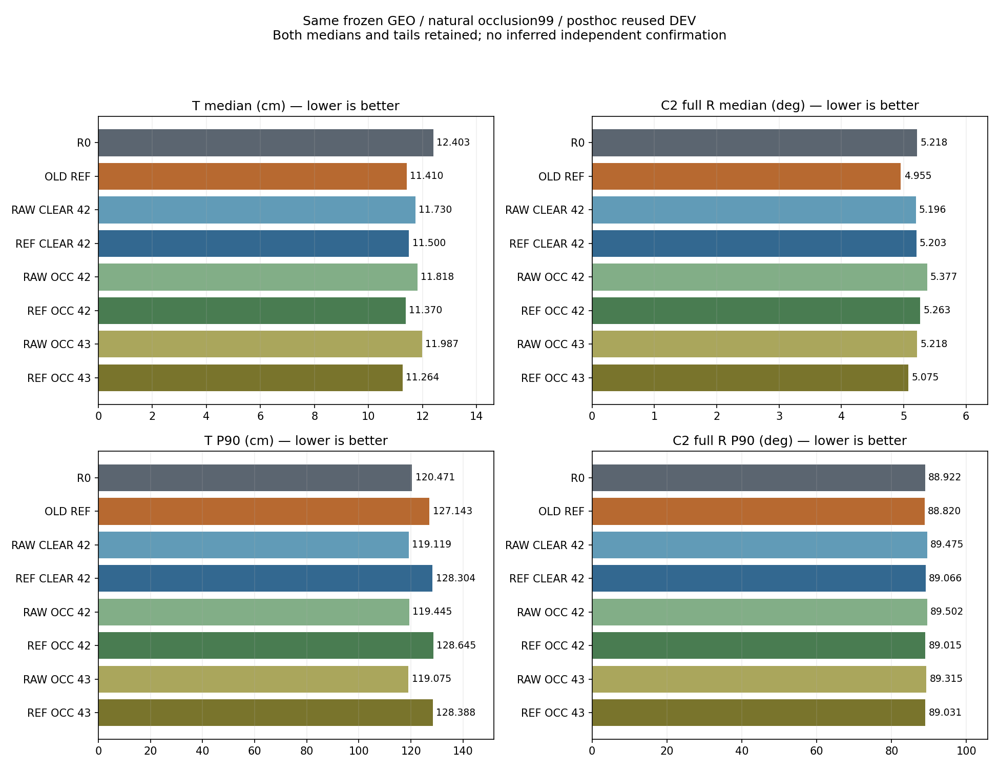

# 같은 GEO의 더 강한 단순 대조: 무학습 후속 분석

기존 clean78 결과를 본 뒤 빠진 대조를 추가했다. 새 student/selector fit은0이다. 이 문서는 다음 실험 선택 전 근거이며 배치의 최종 결론은 아니다.

**핵심:** 기존217장 REF+GEO는 11.4101cm/4.9553°로 clean78 REF CLEAR+GEO보다 위치·회전 중앙값 모두 낮다. clean78 REF OCC42/43은 기존217 REF보다 위치는 약0.405/1.458mm 낮지만 회전은 약0.308/0.119° 높다. 따라서 기존 보고서의 REF OCC+GEO vs R0+D9 이득을 가장 강한 동일선택기 대조에 대한 공동 이득으로 승격하지 않는다.

## 모든 고정 모델과 선택기

T는 팔레트 중심의 위치 오차cm, R는 기존 C2 대칭의 전체 회전 오차°다. 자연99=중간21+심함78 원프레임을 직접 합쳤다. 실패를 제외하지 않은 전체 분모 quantile과valid 수를 보고한다.

| 집합 | 방법 | T median/P90 cm | R median/P90 ° | valid/전체 |
|---|---|---:|---:|---:|
| NATURAL99 | R0_D9 | 12.1479/120.4714 | 6.0379/89.2183 | 99/99 |
| NATURAL99 | R0_GEO | 12.4033/120.4714 | 5.2176/88.9219 | 99/99 |
| NATURAL99 | OLD_REF_D9 | 12.4230/127.1431 | 8.6947/89.1973 | 99/99 |
| NATURAL99 | OLD_REF_GEO | 11.4101/127.1431 | 4.9553/88.8204 | 99/99 |
| NATURAL99 | RAW_CLEAR_S42_D9 | 11.9747/119.1188 | 6.0957/89.5405 | 99/99 |
| NATURAL99 | RAW_CLEAR_S42_GEO | 11.7301/119.1188 | 5.1963/89.4748 | 99/99 |
| NATURAL99 | REF_CLEAR_S42_D9 | 12.4611/128.3035 | 6.1526/89.1426 | 99/99 |
| NATURAL99 | REF_CLEAR_S42_GEO | 11.4999/128.3035 | 5.2026/89.0663 | 99/99 |
| NATURAL99 | RAW_OCC_S42_D9 | 11.9701/119.4455 | 8.0598/89.5464 | 99/99 |
| NATURAL99 | RAW_OCC_S42_GEO | 11.8183/119.4455 | 5.3769/89.5017 | 99/99 |
| NATURAL99 | REF_OCC_S42_D9 | 12.5120/128.6450 | 6.1832/89.1814 | 99/99 |
| NATURAL99 | REF_OCC_S42_GEO | 11.3696/128.6450 | 5.2635/89.0150 | 99/99 |
| NATURAL99 | RAW_OCC_S43_D9 | 12.1672/119.0755 | 8.2921/89.4894 | 99/99 |
| NATURAL99 | RAW_OCC_S43_GEO | 11.9875/119.0755 | 5.2181/89.3148 | 99/99 |
| NATURAL99 | REF_OCC_S43_D9 | 12.5385/128.3876 | 6.3192/89.1599 | 99/99 |
| NATURAL99 | REF_OCC_S43_GEO | 11.2643/128.3876 | 5.0747/89.0309 | 99/99 |
| CLEAN29 | R0_D9 | 2.9299/8.4004 | 1.6108/3.4605 | 29/29 |
| CLEAN29 | R0_GEO | 2.9299/9.7854 | 1.6374/3.4906 | 29/29 |
| CLEAN29 | OLD_REF_D9 | 2.2184/5.0638 | 1.5564/3.7620 | 29/29 |
| CLEAN29 | OLD_REF_GEO | 2.2184/5.0638 | 1.5564/3.7620 | 29/29 |
| CLEAN29 | RAW_CLEAR_S42_D9 | 2.5595/7.1821 | 1.5493/3.6920 | 29/29 |
| CLEAN29 | RAW_CLEAR_S42_GEO | 2.5595/8.6295 | 1.7298/3.7788 | 29/29 |
| CLEAN29 | REF_CLEAR_S42_D9 | 1.9609/4.8280 | 1.5295/3.4204 | 29/29 |
| CLEAN29 | REF_CLEAR_S42_GEO | 2.0099/6.2609 | 1.5411/3.4906 | 29/29 |
| CLEAN29 | RAW_OCC_S42_D9 | 2.6925/7.1676 | 1.5638/3.6738 | 29/29 |
| CLEAN29 | RAW_OCC_S42_GEO | 2.6925/8.5681 | 1.7058/3.7628 | 29/29 |
| CLEAN29 | REF_OCC_S42_D9 | 1.8404/4.7682 | 1.5357/3.4167 | 29/29 |
| CLEAN29 | REF_OCC_S42_GEO | 2.1563/6.2163 | 1.5391/3.4887 | 29/29 |
| CLEAN29 | RAW_OCC_S43_D9 | 2.7664/6.9095 | 1.4894/3.5419 | 29/29 |
| CLEAN29 | RAW_OCC_S43_GEO | 2.7664/8.5037 | 1.5672/3.6226 | 29/29 |
| CLEAN29 | REF_OCC_S43_D9 | 1.9272/4.6443 | 1.5129/3.3496 | 29/29 |
| CLEAN29 | REF_OCC_S43_GEO | 2.0128/6.0578 | 1.5769/3.4130 | 29/29 |
| MOD21 | R0_D9 | 5.9071/14.3798 | 1.9975/77.0196 | 21/21 |
| MOD21 | R0_GEO | 5.8178/15.1047 | 2.2496/77.0196 | 21/21 |
| MOD21 | OLD_REF_D9 | 6.2425/13.0152 | 2.1026/76.5527 | 21/21 |
| MOD21 | OLD_REF_GEO | 6.2425/13.0152 | 2.1026/76.5527 | 21/21 |
| MOD21 | RAW_CLEAR_S42_D9 | 5.8659/14.2890 | 1.9174/76.2914 | 21/21 |
| MOD21 | RAW_CLEAR_S42_GEO | 5.8004/15.4790 | 1.9775/76.2914 | 21/21 |
| MOD21 | REF_CLEAR_S42_D9 | 6.5717/12.9356 | 1.8121/76.4586 | 21/21 |
| MOD21 | REF_CLEAR_S42_GEO | 6.5717/12.9356 | 1.9948/76.4586 | 21/21 |
| MOD21 | RAW_OCC_S42_D9 | 5.9351/14.2142 | 1.9051/76.2936 | 21/21 |
| MOD21 | RAW_OCC_S42_GEO | 5.9351/15.2980 | 2.1516/86.3870 | 21/21 |
| MOD21 | REF_OCC_S42_D9 | 6.5281/12.8671 | 1.8063/76.4314 | 21/21 |
| MOD21 | REF_OCC_S42_GEO | 6.5281/12.8671 | 2.0055/76.4314 | 21/21 |
| MOD21 | RAW_OCC_S43_D9 | 5.7582/14.3657 | 1.8594/76.2713 | 21/21 |
| MOD21 | RAW_OCC_S43_GEO | 5.7582/14.3657 | 1.9948/76.2713 | 21/21 |
| MOD21 | REF_OCC_S43_D9 | 6.4752/13.0435 | 1.8198/76.3901 | 21/21 |
| MOD21 | REF_OCC_S43_GEO | 6.4752/13.0435 | 2.0348/76.3901 | 21/21 |
| SEV78 | R0_D9 | 13.6772/209.1179 | 63.2973/89.3703 | 78/78 |
| SEV78 | R0_GEO | 13.6772/209.1179 | 9.3528/89.2645 | 78/78 |
| SEV78 | OLD_REF_D9 | 14.4309/210.8677 | 64.7484/89.2891 | 78/78 |
| SEV78 | OLD_REF_GEO | 13.8623/210.8677 | 8.9209/89.1982 | 78/78 |
| SEV78 | RAW_CLEAR_S42_D9 | 14.0599/206.2001 | 63.1094/89.7533 | 78/78 |
| SEV78 | RAW_CLEAR_S42_GEO | 13.3999/206.2001 | 8.8367/89.6276 | 78/78 |
| SEV78 | REF_CLEAR_S42_D9 | 14.6379/212.5993 | 63.1718/89.5495 | 78/78 |
| SEV78 | REF_CLEAR_S42_GEO | 13.8309/212.5993 | 8.4896/89.2227 | 78/78 |
| SEV78 | RAW_OCC_S42_D9 | 14.1806/206.6756 | 65.1556/89.7804 | 78/78 |
| SEV78 | RAW_OCC_S42_GEO | 13.5393/206.6756 | 8.8388/89.6553 | 78/78 |
| SEV78 | REF_OCC_S42_D9 | 14.9186/213.1044 | 63.1506/89.6392 | 78/78 |
| SEV78 | REF_OCC_S42_GEO | 13.7947/213.1044 | 8.5237/89.2871 | 78/78 |
| SEV78 | RAW_OCC_S43_D9 | 14.1347/205.8144 | 65.3614/89.7984 | 78/78 |
| SEV78 | RAW_OCC_S43_GEO | 13.4962/205.8144 | 8.8384/89.6078 | 78/78 |
| SEV78 | REF_OCC_S43_D9 | 14.7818/212.3392 | 63.3330/89.6363 | 78/78 |
| SEV78 | REF_OCC_S43_GEO | 13.3010/212.3392 | 8.4273/89.2747 | 78/78 |
| FULL128 | R0_D9 | 9.3531/79.1224 | 3.5301/88.7334 | 128/128 |
| FULL128 | R0_GEO | 9.3531/70.6800 | 3.4109/88.7334 | 128/128 |
| FULL128 | OLD_REF_D9 | 9.1859/78.9382 | 3.7662/88.8094 | 128/128 |
| FULL128 | OLD_REF_GEO | 8.3264/69.4011 | 3.4253/88.2194 | 128/128 |
| FULL128 | RAW_CLEAR_S42_D9 | 9.1962/78.5421 | 3.8225/89.0610 | 128/128 |
| FULL128 | RAW_CLEAR_S42_GEO | 9.0047/69.3442 | 3.5910/88.9708 | 128/128 |
| FULL128 | REF_CLEAR_S42_D9 | 8.9909/81.2630 | 3.5375/88.9537 | 128/128 |
| FULL128 | REF_CLEAR_S42_GEO | 8.8380/71.7992 | 3.4085/88.7286 | 128/128 |
| FULL128 | RAW_OCC_S42_D9 | 9.3301/79.0800 | 3.8984/89.0605 | 128/128 |
| FULL128 | RAW_OCC_S42_GEO | 8.9487/69.7851 | 3.6406/88.9608 | 128/128 |
| FULL128 | REF_OCC_S42_D9 | 9.0604/81.7863 | 3.5503/88.9436 | 128/128 |
| FULL128 | REF_OCC_S42_GEO | 8.8690/72.2802 | 3.4278/88.7789 | 128/128 |
| FULL128 | RAW_OCC_S43_D9 | 9.2821/78.6520 | 3.7594/88.9726 | 128/128 |
| FULL128 | RAW_OCC_S43_GEO | 9.1031/69.4284 | 3.5345/88.9211 | 128/128 |
| FULL128 | REF_OCC_S43_D9 | 9.1923/81.4531 | 3.5536/88.9251 | 128/128 |
| FULL128 | REF_OCC_S43_GEO | 8.3716/72.0436 | 3.3656/88.6704 | 128/128 |

## 필요성 질문별 결과

- 자기학습: OLD_REF217+GEO는 R0+GEO보다 median T −0.9931cm(−9.931mm), R −0.2623°다. 선택기만 바꾸는 R0+GEO와 구분한다. 이것만으로 현재 clean78 학습이 필요하다고 할 수는 없다.
- 보정: CLEAR42에서 REF−RAW는 T −0.2303cm/R +0.0063°로 trade-off. OCC42/43에서는 두 median이 낮지만, 가장 강한 OLD_REF217 대조를 공동으로 넘지 못한다.
- 입력 가림: RAW42는 CLEAR가 OCC보다 두 median 모두 낮다. REF42의 OCC−CLEAR는 T −0.1302cm/R +0.0609°로 trade-off다. CLEAR43은 아직 없으며 효과 전체의 반복을 주장하지 않는다.
- 선택기: 같은 frozen keypoint/두 후보에서 선택만 달라진다. GEO가 모든 모델·지표에서 D9보다 좋지는 않다. R0의 위치 median은 D9보다 악화하고 회전은 개선한다.
- clean78: OLD_REF217과 이미지 구성·고유 개수·반복 노출 및 post-affine 공통support 계약도 다르므로 clean 여부만의 인과 효과라고 쓰지 않는다.

## 촬영 기록 의존성과 paired 변화

6개 자연가림 recording을 cluster 단위로 복원추출한 2000회 설명용95%구간이다. 각 recording의 표본은33/2/16/27/12/9장으로 작고 불균형하다. 독립TEST 또는 유의성 합격선이 아니다.

| 비교(after−before) | Δmedian T cm/R ° | paired차이 median T/R | T 구간 cm | R 구간 ° | 둘다 개선/악화 |
|---|---:|---:|---:|---:|---:|
| R0_GEO-minus-R0_D9 | 0.2553/-0.8204 | 0.0000/0.0000 | -0.7492 / 3.6211 | -71.6766 / 1.4500 | 9/5 |
| OLD_REF_GEO-minus-OLD_REF_D9 | -1.0129/-3.7394 | 0.0000/0.0000 | -3.5883 / 0.4095 | -73.4534 / 1.4261 | 9/3 |
| RAW_CLEAR_S42_GEO-minus-RAW_CLEAR_S42_D9 | -0.2446/-0.8995 | 0.0000/0.0000 | -1.1162 / 2.4166 | -70.9763 / 1.5666 | 8/3 |
| REF_CLEAR_S42_GEO-minus-REF_CLEAR_S42_D9 | -0.9613/-0.9500 | 0.0000/0.0000 | -1.6739 / 1.3731 | -70.7977 / 1.2858 | 9/3 |
| RAW_OCC_S42_GEO-minus-RAW_OCC_S42_D9 | -0.1517/-2.6829 | 0.0000/0.0000 | -1.2506 / 2.5363 | -73.0151 / 3.1034 | 9/4 |
| REF_OCC_S42_GEO-minus-REF_OCC_S42_D9 | -1.1424/-0.9198 | 0.0000/0.0000 | -1.6148 / 1.3629 | -70.7367 / 1.2346 | 9/3 |
| RAW_OCC_S43_GEO-minus-RAW_OCC_S43_D9 | -0.1797/-3.0739 | 0.0000/0.0000 | -1.2547 / 2.2389 | -73.3270 / 1.4459 | 9/3 |
| REF_OCC_S43_GEO-minus-REF_OCC_S43_D9 | -1.2742/-1.2445 | 0.0000/0.0000 | -1.7407 / 0.3494 | -70.8556 / 1.0822 | 9/2 |
| OLD_REF_GEO-minus-R0_GEO | -0.9931/-0.2623 | -0.4695/-0.1414 | -5.4204 / 0.7658 | -7.3501 / 0.6895 | 41/23 |
| RAW_CLEAR_S42_GEO-minus-R0_GEO | -0.6731/-0.0213 | -0.1066/-0.0115 | -1.9963 / 0.6844 | -0.9050 / 0.6682 | 33/22 |
| REF_CLEAR_S42_GEO-minus-R0_GEO | -0.9034/-0.0150 | 0.0043/-0.1205 | -4.5836 / 1.6249 | -7.8756 / 0.7684 | 34/25 |
| RAW_OCC_S42_GEO-minus-R0_GEO | -0.5849/0.1593 | -0.0341/0.0043 | -2.1244 / 0.5854 | -0.6468 / 7.9828 | 27/25 |
| REF_OCC_S42_GEO-minus-R0_GEO | -1.0336/0.0459 | 0.0268/-0.1032 | -4.3169 / 1.9824 | -7.8308 / 0.7286 | 36/25 |
| RAW_OCC_S43_GEO-minus-R0_GEO | -0.4158/0.0005 | -0.0466/-0.0082 | -3.0006 / 0.6665 | -4.2261 / 5.9144 | 33/22 |
| REF_OCC_S43_GEO-minus-R0_GEO | -1.1389/-0.1429 | 0.1374/-0.0815 | -4.6139 / 1.2590 | -10.3474 / 0.6779 | 34/28 |
| REF_CLEAR_S42_GEO-minus-RAW_CLEAR_S42_GEO | -0.2303/0.0063 | 0.1804/-0.0482 | -3.1199 / 1.6263 | -8.5439 / 0.7822 | 27/27 |
| REF_OCC_S42_GEO-minus-RAW_OCC_S42_GEO | -0.4487/-0.1134 | 0.2125/-0.0383 | -3.0592 / 1.5096 | -11.1099 / 0.0794 | 26/24 |
| REF_OCC_S43_GEO-minus-RAW_OCC_S43_GEO | -0.7232/-0.1435 | 0.1818/-0.0454 | -3.0948 / 1.3231 | -11.0897 / 0.1381 | 26/25 |
| RAW_OCC_S42_GEO-minus-RAW_CLEAR_S42_GEO | 0.0882/0.1806 | 0.0520/0.0055 | -0.4907 / 0.4961 | -0.0302 / 8.0533 | 14/28 |
| REF_OCC_S42_GEO-minus-REF_CLEAR_S42_GEO | -0.1302/0.0609 | 0.0306/0.0114 | -0.4029 / 0.5679 | -0.0557 / 0.0623 | 15/29 |
| REF_CLEAR_S42_GEO-minus-OLD_REF_GEO | 0.0897/0.2473 | 0.1811/0.0895 | -0.8793 / 2.5662 | -0.5621 / 0.4675 | 15/42 |
| REF_OCC_S42_GEO-minus-OLD_REF_GEO | -0.0405/0.3082 | 0.1813/0.0995 | -0.9679 / 2.4708 | -0.5902 / 0.4419 | 16/41 |
| REF_OCC_S43_GEO-minus-OLD_REF_GEO | -0.1458/0.1194 | 0.2246/0.1086 | -1.3064 / 2.1799 | -3.1599 / 0.4554 | 16/44 |
| RAW_OCC_S43_GEO-minus-RAW_OCC_S42_GEO | 0.1692/-0.1588 | -0.0395/-0.0048 | -1.9677 / 0.3019 | -8.1557 / 0.1473 | 31/20 |
| REF_OCC_S43_GEO-minus-REF_OCC_S42_GEO | -0.1053/-0.1888 | -0.0126/-0.0020 | -1.9234 / 0.3588 | -2.5166 / 0.0998 | 28/24 |
| REF_CLEAR_S42_D9-minus-RAW_CLEAR_S42_D9 | 0.4864/0.0569 | 0.2726/-0.0796 | -1.5828 / 2.0283 | -25.7818 / 0.6804 | 26/27 |
| REF_OCC_S42_D9-minus-RAW_OCC_S42_D9 | 0.5419/-1.8766 | 0.4264/-0.0822 | -1.5861 / 2.2420 | -33.5088 / 0.0534 | 25/25 |
| REF_OCC_S43_D9-minus-RAW_OCC_S43_D9 | 0.3714/-1.9729 | 0.3180/-0.0612 | -1.6308 / 2.0950 | -33.6889 / 0.0851 | 25/26 |

전체 recording 및 leave-one-recording-out은 [CONTROL_RESULTS.json](CONTROL_RESULTS.json)과 [CONTROL_ROBUSTNESS.json](CONTROL_ROBUSTNESS.json)에 보존했다.

## 증거 범위와 다음 검증

새GT/새RGB/새manual은0. oldGEO의 간접감독 때문에 R0+GEO도 zero-human-supervision이 아니다(과거Plastic10/48). 현재 보정학생+oldGEO 전체 합집합은19장/86코너이며, 현재교사9장/38점과 다르다. 원래 FINAL/STOP과모든과거수치를 보존했다.

이 대조만으로 안정적 실용 개선 구성을 확보했다고 선언하지 않는다. 다음 변경은 기존GEO의 합성 feature 생성모델과 현재학생의 차이에 직접 연결할 수 있는지 감사한 뒤, 같은architecture/훈련규칙의단일source-onlyselector 재보정 여부를 사전에 결정한다. 새student를 즉시학습하거나DEV로threshold를조정하지않는다.
