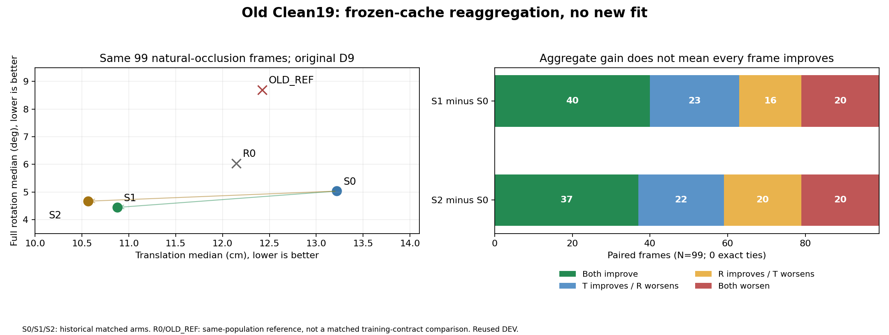

# 과거 Clean19의 동시 개선 신호: 그림 요약

같은 자연 Moderate21+Severe78에서 S0의 **13.2197cm / 5.0326°**가 S1에서 **10.8778cm / 4.4412°**, S2에서 **10.5676cm / 4.6673°**로 감소했다. 동일99장의 R0 **12.1479cm / 6.0379°**보다도 두 median이 낮다.

하지만 이 결과는 과거 학습 계약에서의 신호다. 현재 Replay9/38+217 조건에서 같은 효과가 난다는 증거는 아니다. S1은 Clean29 T/R median이4.2969cm/1.5131°에서4.7072cm/1.5727°로 악화했다. Severe78에서 S2의 T median은 낮아졌지만 R median은12.5418°에서12.8392°로 높아졌다. 과거 Severe81의 R=7.2555°와 분모를 혼동하면 안 된다.

S1의 자연99 T/R P90은105.5464cm/88.4300°에서76.1457cm/87.9433°로 낮아졌다. S2 T P90은73.6958cm로 감소하지만 R P90은88.6276°로 높아져 모든 꼬리 오류 개선은 아니다. 정확한 수치는 [집계 JSON](OLD_CLEAN19_POSE_REFERENCE.json)에 저장했다.

프레임별 둘 다 개선된 것은 S1 40/99, S2 37/99다. 둘 다 악화한20/99도 모두 유지했다. 원본결과·모델·GT는 변경하지 않았고 새 fit/추론/PnP 실행은0회다.

[전체 난도·recording·paired 표](OLD_CLEAN19_POSE_REFERENCE.md)
