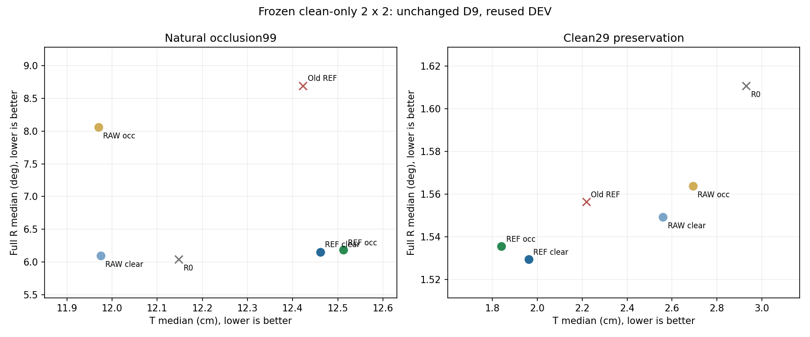

# Clean→자연 가림 자세 전이: 고정2×2 결과 원인분해

상태: `COMPLETE_WITH_ORACLE`. 이 분석기에서 새 학습/optimizer/selector fit은0회다.

## 자연 가림99: 사전 지정6개 비교

음수 ΔT/ΔR은 오차 감소다. P90 손익과valid분모를 함께 읽는다. PCK/AUC만으로성공이라고판정하지않는다.

| 비교 (후−전) | ΔT median/P90 cm | ΔR median/P90 ° | valid 전→후 | ΔPCK10 %p | ΔAUC |
|---|---:|---:|---:|---:|---:|
| CLEAN_REF_OCC-minus-CLEAN_REF_CLEAR | 0.0508/0.3415 | 0.0306/0.0388 | 99→99/99 | -0.2646 | -0.0000 |
| CLEAN_RAW_OCC-minus-CLEAN_RAW_CLEAR | -0.0047/0.3267 | 1.9641/0.0059 | 99→99/99 | -0.1323 | -0.0056 |
| CLEAN_REF_CLEAR-minus-CLEAN_RAW_CLEAR | 0.4864/9.1847 | 0.0569/-0.3979 | 99→99/99 | 2.5132 | 0.0056 |
| CLEAN_REF_OCC-minus-CLEAN_RAW_OCC | 0.5419/9.1995 | -1.8766/-0.3650 | 99→99/99 | 2.3810 | 0.0111 |
| CLEAN_REF_OCC-minus-OLD_REF | 0.0890/1.5019 | -2.5114/-0.0159 | 99→99/99 | -0.1323 | -0.0006 |
| CLEAN_REF_OCC-minus-R0 | 0.3640/8.1736 | 0.1453/-0.0369 | 99→99/99 | 1.9841 | 0.0072 |

## 난도·전체 성능과Clean손상

| 집합 | 모델 | T median/P90 cm | full R median/P90 ° | valid/분모 | PCK10 % | AUC |
|---|---|---:|---:|---:|---:|---:|
| CLEAN29 | R0 | 2.9299/8.4004 | 1.6108/3.4605 | 29/29 | 65.939 | 0.71474 |
| CLEAN29 | OLD_REF | 2.2184/5.0638 | 1.5564/3.7620 | 29/29 | 68.996 | 0.78126 |
| CLEAN29 | CLEAN_RAW_CLEAR | 2.5595/7.1821 | 1.5493/3.6920 | 29/29 | 66.812 | 0.73771 |
| CLEAN29 | CLEAN_REF_CLEAR | 1.9609/4.8280 | 1.5295/3.4204 | 29/29 | 67.249 | 0.80284 |
| CLEAN29 | CLEAN_RAW_OCC | 2.6925/7.1676 | 1.5638/3.6738 | 29/29 | 66.812 | 0.73909 |
| CLEAN29 | CLEAN_REF_OCC | 1.8404/4.7682 | 1.5357/3.4167 | 29/29 | 66.812 | 0.80174 |
| MOD21 | R0 | 5.9071/14.3798 | 1.9975/77.0196 | 21/21 | 58.442 | 0.47955 |
| MOD21 | OLD_REF | 6.2425/13.0152 | 2.1026/76.5527 | 21/21 | 56.494 | 0.51188 |
| MOD21 | CLEAN_RAW_CLEAR | 5.8659/14.2890 | 1.9174/76.2914 | 21/21 | 55.195 | 0.48307 |
| MOD21 | CLEAN_REF_CLEAR | 6.5717/12.9356 | 1.8121/76.4586 | 21/21 | 57.792 | 0.51012 |
| MOD21 | CLEAN_RAW_OCC | 5.9351/14.2142 | 1.9051/76.2936 | 21/21 | 55.195 | 0.48588 |
| MOD21 | CLEAN_REF_OCC | 6.5281/12.8671 | 1.8063/76.4314 | 21/21 | 57.792 | 0.51326 |
| SEV78 | R0 | 13.6772/209.1179 | 63.2973/89.3703 | 78/78 | 40.365 | 0.15976 |
| SEV78 | OLD_REF | 14.4309/210.8677 | 64.7484/89.2891 | 78/78 | 43.522 | 0.16087 |
| SEV78 | CLEAN_RAW_CLEAR | 14.0599/206.2001 | 63.1094/89.7533 | 78/78 | 40.864 | 0.16082 |
| SEV78 | CLEAN_REF_CLEAR | 14.6379/212.5993 | 63.1718/89.5495 | 78/78 | 43.355 | 0.16065 |
| SEV78 | CLEAN_RAW_OCC | 14.1806/206.6756 | 65.1556/89.7804 | 78/78 | 40.698 | 0.15301 |
| SEV78 | CLEAN_REF_OCC | 14.9186/213.1044 | 63.1506/89.6392 | 78/78 | 43.023 | 0.15976 |
| NATURAL99 | R0 | 12.1479/120.4714 | 6.0379/89.2183 | 99/99 | 44.048 | 0.22760 |
| NATURAL99 | OLD_REF | 12.4230/127.1431 | 8.6947/89.1973 | 99/99 | 46.164 | 0.23533 |
| NATURAL99 | CLEAN_RAW_CLEAR | 11.9747/119.1188 | 6.0957/89.5405 | 99/99 | 43.783 | 0.22918 |
| NATURAL99 | CLEAN_REF_CLEAR | 12.4611/128.3035 | 6.1526/89.1426 | 99/99 | 46.296 | 0.23478 |
| NATURAL99 | CLEAN_RAW_OCC | 11.9701/119.4455 | 8.0598/89.5464 | 99/99 | 43.651 | 0.22362 |
| NATURAL99 | CLEAN_REF_OCC | 12.5120/128.6450 | 6.1832/89.1814 | 99/99 | 46.032 | 0.23475 |
| FULL128 | R0 | 9.3531/79.1224 | 3.5301/88.7334 | 128/128 | 49.137 | 0.33796 |
| FULL128 | OLD_REF | 9.1859/78.9382 | 3.7662/88.8094 | 128/128 | 51.472 | 0.35902 |
| FULL128 | CLEAN_RAW_CLEAR | 9.1962/78.5421 | 3.8225/89.0610 | 128/128 | 49.137 | 0.34439 |
| FULL128 | CLEAN_REF_CLEAR | 8.9909/81.2630 | 3.5375/88.9537 | 128/128 | 51.168 | 0.36348 |
| FULL128 | CLEAN_RAW_OCC | 9.3301/79.0800 | 3.8984/89.0605 | 128/128 | 49.036 | 0.34040 |
| FULL128 | CLEAN_REF_OCC | 9.0604/81.7863 | 3.5503/88.9436 | 128/128 | 50.863 | 0.36321 |

## 3층 해석

1. Localization: 같은128/99의legacy PCK·tail·fixed-ID 보조값을보고한다. 이는독립verified physicalaccuracy가아니다. TRAIN residual은별도TRAIN_TARGET_FOLLOWING에서측정하며정답오차로부르지않는다.
2. Candidate quality: 같은frozen좌표가생성하는기존D9 두W/D후보만본다. T-optimal과R-optimal은각각완전한pose지만그최솟값끼리합친가상pose는배포가능하지않다.
3. Selector: 동일한한후보가현재선택보다T/R모두좋은프레임수를확인한다. 후보headroom이있어도일반화가능한selector를학습할수있다는보장은없다.

조건부신호: `NO_COMPLETE_SELECTOR_TRIGGER`. 이문서는후속fit을선택하거나실행하지않았다.

| 자연99 후보집합 | 실제 T/R med | T-optimal의 T/R med | R-optimal의 T/R med | 같은한후보 joint개선수 |
|---|---:|---:|---:|---:|
| R0 | 12.1479/6.0379 | 9.2077/3.8319 | 10.1307/3.1622 | 26/99 |
| OLD_REF | 12.4230/8.6947 | 9.2218/3.3644 | 9.4124/3.1511 | 29/99 |
| CLEAN_RAW_CLEAR | 11.9747/6.0957 | 9.2506/3.8884 | 10.0900/3.2594 | 26/99 |
| CLEAN_REF_CLEAR | 12.4611/6.1526 | 8.7895/3.6278 | 9.2980/3.3713 | 28/99 |
| CLEAN_RAW_OCC | 11.9701/8.0598 | 9.2934/3.9492 | 10.0635/3.2620 | 27/99 |
| CLEAN_REF_OCC | 12.5120/6.1832 | 8.7280/3.6906 | 9.3359/3.3379 | 28/99 |

oracle는GT기반사후진단전용이며최종D9성능을대체하지않는다.

## 근거의 범위

자연99오차를모아median/P90을계산했으며난도별median을평균하지않았다. Clean29손상을삭제하지않는다. 참조6D는기존annotation과known dimensions의기하재구성이며독립물리측정이아니다. 반복DEV결과로독립확인을완료했다고쓰지않는다.

[전체평가·recording·paired·LORO](EVAL_RESULTS_S42.json) · [분석 JSON](PRIMARY_ANALYSIS_S42.json)

## TRAIN 타깃 전달

실제clean78의고정native입력에서측정한의사타깃추종이다. 물리정답정확도나실제가림/affine입력TRAIN loss로해석하지않는다.

| 모델 | raw타깃 평균px | corrected타깃 평균px | corrected타깃 occurrence가중평균px |
|---|---:|---:|---:|
| R0 | 0.0000 | 3.3586 | 3.3382 |
| CLEAN_RAW_CLEAR | 0.6554 | 3.4813 | 3.4519 |
| CLEAN_REF_CLEAR | 1.6810 | 2.6242 | 2.6107 |
| CLEAN_RAW_OCC | 0.6590 | 3.4631 | 3.4319 |
| CLEAN_REF_OCC | 1.6959 | 2.6490 | 2.6333 |

[TRAIN 좌표계·support·recording별분석](TRAIN_TARGET_FOLLOWING_S42.md)
