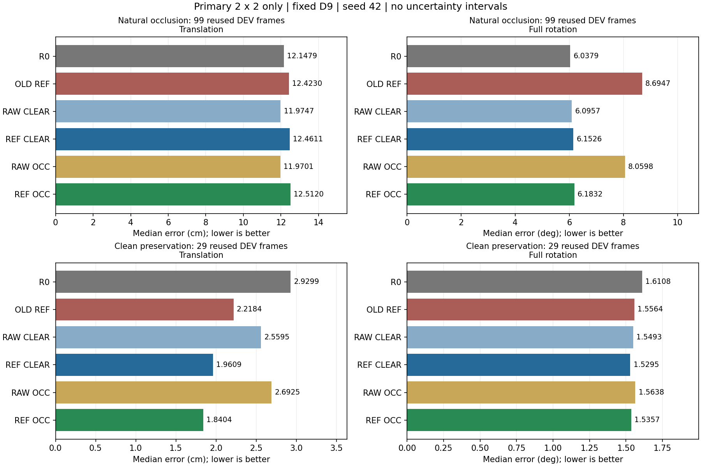

# Clean 실사 → 자연 가림 자세 전이: 최종 근거 보고

보고서 상태: `FINAL`. 최종 판정: `BEATS_R0_ON_OCCLUDED_POSE`. 원래 고정 D9의 primary 2×2는 **joint pose gain 없음**이다.

가림 추가 자체의 효과, 좌표 보정 효과, 후보 선택기 교체 효과를 구분한다. 기존 GEO를 재사용하면 별도의 회복 신호가 관찰되지만, 같은 GEO를 쓴 RAW/REF 비교 및 유효 seed 반복은 아래에서 별도로 판정한다. 새 manual 좌표는 0이며, GEO의 간접 학습 이력까지 합친 추적 가능한 감독은 **19이미지/86코너**로 current teacher의 9/38과 다르다. 최종 판정은 [FINAL_DECISION.json](FINAL_DECISION.json)의 제한을 포함하며, 문서 완료는 물리 정답 확인이나 독립 TEST 성공을 뜻하지 않는다.

핵심 수치: **REF OCC + 기존 GEO**의 자연99 T/R median은 **S42 11.3696/5.2635**, **S43 11.2643/5.0747** (cm/°)다. R0는 12.1479/6.0379다. 두 stream 모두 R0보다 두 median이 낮음: 예; 동일 GEO의 RAW보다 두 median이 낮음: 예. **이 판정은 median에 한정된다.** REF의 T P90은 두 seed 모두 R0/RAW보다 나쁘고, 같은 학생의 D9에서 GEO로 바꾸면 Clean 손상도 있다. 이를 가림 augmentation 자체의 성공이나 모든 꼬리오차 개선으로 읽으면 안 된다.

## 1. 과거 Clean19 양성과 현재 main 음성은 같은 계약이 아니다

| 계약 | 과거 Clean19 계열 | 현재 main / 이번 clean78 |
|---|---|---|
| Teacher·manual budget | Plastic10/48 + Wood9/39, 총19/87 provenance; 별도 type Replay teacher | 현재 Replay9/38: Plastic3/15 + Wood6/23; teacher 변경 없음 |
| 실사·감독 | Plastic10, 48 corner support, center ignore | main217의 기존 pseudo support; 이번78로 제한하되 새 manual 좌표0 |
| 학생 학습 범위 | 498 parameter tensors / 3,043,704 scalars | pose/flow132 / 539,514; 보호747 tensors·buffers |
| LR·업데이트 | 1e−4, 320 updates | 1e−5, 320 updates; 같은 AdamW/5 epochs/last |
| 실사 반복·합성 | 2560 real / 2560 source, Plastic10 평균256회 | 동일총노출, 217 평균11.80회 →78 평균32.82회; source512 유지 |
| 가림 | native canvas, random/structured S2 placement 동시 gate | 전체640 canvas의 random-only REF plan, S2 gate 없음 |
| 좌표·support | 기존 teacher와48점 계약 | 동일 RNG RAW/REF post-affine 공통 support 교집합; 기존 ignore 보존 |
| pose·평가 | 기존 D9 두 후보/선택, population 별 수치 구분 | primary D9 유지; 같은128/99 재사용 DEV; selector는 별도 단계 |

과거 S1−S0의 자연99 T/R median은 13.2197/5.0326 → 10.8778/4.4412 (cm/°)였다. Severe78은 15.0795/12.5418 → 13.4067/5.6304이나, Clean29은 4.2969/1.5131 → 4.7072/1.5727로 악화했다. 과거 Severe81 수치와 섞지 않는다. 이 차이는 teacher/LR/scope/recording/반복량 중 하나가 원인이라는 인과 분리가 아니다.

[계약 전수 감사](CONTRACT_DIFFERENCE_AUDIT.md) · [과거 동일128 재집계](OLD_CLEAN19_POSE_REFERENCE.md)

## 2. current217 clean 감사

`USED217_CLEAN=MIXED`, `ACCEPTED249_CLEAN=MIXED`. 후보1000→accepted249→실제TRAIN217이었다. 기존 사람 difficulty123장의 SHA overlap은0이어서 그 태그를 현재217의 근거로 대체하지 않았다. 모델/GT/error overlay 없는 accepted249 원본 RGB를 전수 검토했다. 이는 assistant의 시각 분류이며 새 사람 manual label이나 좌표 감독이 아니다. 사용자 요청대로 마커판 부착 영상도 제외했다.

accepted249는 clean89 / 마커판 등 제외158 / 사람 겹침 불확실2, used217는 clean78 / 제외137 / 불확실2다. 외부 가림 없음은 모든 코너 visible·쉬운 시점·정확한 pseudo target을 뜻하지 않는다. 개별 RGB·contact sheet·좌표는 공개하지 않는다. [clean 감사](CLEAN_POOL_AUDIT.md)

## 3. 잠근 clean 학습 모집단

기존 used217 안의 **78장**만 사용했다. accepted-but-unused clean11장은 추가하지 않았다. 야간62/주간16, recording4개이며 저앙각·self-occlusion·truncation은 자동 제외하지 않았다. 선정은 새 fit/평가 전에 잠겼고 DEV T/R/PCK·confidence·보정량을 보지 않았다. 원본 RGB·pseudo label·manual 예산은 유지했다.

| Recording | 고유 이미지 |
|---|---:|
| REC_020 | 29 |
| REC_023 | 6 |
| REC_017 | 27 |
| REC_028 | 16 |

## 4. Primary 2×2와 실제 가림 노출

RAW/REF는 좌표만, CLEAR/OCC는 추가 RGB 가림만 달랐다. 같은 R0 초기879 tensors, source512/real512 epoch slots, bbox/order/base HSV·affine, optimizer320, pose/flow-only 범위와 last checkpoint를 사용했다. post-affine RAW/REF 교집합을 공통 support로 삼고 기존 true-ignore1은 승격하지 않았다. 실제320-batch 전수 parity와 frozen747 검사를 보존했다. 초기879 exact는 실행 중 torch.equal assertion과 R0 hash로 확인했으며 별도 초기 tensor snapshot을 보존했다는 뜻은 아니다.

사각형은 bbox 면적0.1/0.2/0.3, 종횡비0.5/1/2,8×8 noise fill, 확률0.5,32회 시도, canonical REF에서 ≥1 covered·≥2 remaining으로 고정했다. 가린 타깃도 amodal 감독으로 유지하며 가림 때문에 좌표/v/support를 바꾸지 않았다. 동일 mask에서 RAW/REF covered 수는 좌표 차이 때문에 자연히 다를 수 있다.

| 계약 | scheduled/2560 real | applied/2560 | masked supervised corners (RAW/REF) | failed placement |
|---|---:|---:|---:|---:|
| 과거 S1 Plastic | 1241 | 730 (28.52%) | 998 (old support) | 508 paired +3 low-support |
| current v2 A | 1302 | 542 (21.17%) | 781/824 | 760 |
| current v2 C exposure | 2560 | 1054 (41.17%) | 1470/1559 | 1506 |
| 이번 clean78 S42 OCC | 1282 | 418 (16.33%) | 619/632 | 864 |

이번 REF의 전체 remaining corner occurrence는18385, RAW는18398다. 실사/source supervised all9 occurrence는 각각21479/22531이며 이미지50:50을 loss50:50으로 해석하지 않는다. 표의 old/current는 support·canvas·S2 gate가 달라 단일 가림량 인과 비교가 아니다. [전수 parity·recording 노출](PAIR_INTEGRITY_S42.json)

## 5. 자연 Moderate/Severe 자세: 사전6개 비교

아래 T/R는 translation cm / C2-symmetric full rotation °의 median이다. vs열은 같은 자연99에서 after−baseline이며 음수가 개선이다. 원래 primary 6팔 모두 pose128/128·주99/99 valid다. 아래 GEO 보완 행은 별도 단계다. 자연99는 Moderate21+Severe78 원오차를 합쳐 계산했으며 두 난도 median의 평균이 아니다.

| Method | Clean T/R | Moderate T/R | Severe T/R | Mod+Sev99 T/R | vs R0 ΔT/ΔR | vs current REF ΔT/ΔR |
|---|---:|---:|---:|---:|---:|---:|
| R0 (D9) | 2.9299/1.6108 | 5.9071/1.9975 | 13.6772/63.2973 | 12.1479/6.0379 | +0.0000/+0.0000 | -0.2751/-2.6568 |
| OLD REF (D9) | 2.2184/1.5564 | 6.2425/2.1026 | 14.4309/64.7484 | 12.4230/8.6947 | +0.2751/+2.6568 | +0.0000/+0.0000 |
| RAW CLEAR (S42, D9) | 2.5595/1.5493 | 5.8659/1.9174 | 14.0599/63.1094 | 11.9747/6.0957 | -0.1732/+0.0578 | -0.4483/-2.5990 |
| REF CLEAR (S42, D9) | 1.9609/1.5295 | 6.5717/1.8121 | 14.6379/63.1718 | 12.4611/6.1526 | +0.3132/+0.1147 | +0.0381/-2.5421 |
| RAW OCC (S42, D9) | 2.6925/1.5638 | 5.9351/1.9051 | 14.1806/65.1556 | 11.9701/8.0598 | -0.1779/+2.0219 | -0.4530/-0.6349 |
| REF OCC (S42, D9) | 1.8404/1.5357 | 6.5281/1.8063 | 14.9186/63.1506 | 12.5120/6.1832 | +0.3640/+0.1453 | +0.0890/-2.5114 |
| RAW_GEO OCC (S42, old GEO) | 2.6925/1.7058 | 5.9351/2.1516 | 13.5393/8.8388 | 11.8183/5.3769 | -0.3296/-0.6610 | -0.6047/-3.3178 |
| REF_GEO OCC (S42, old GEO) | 2.1563/1.5391 | 6.5281/2.0055 | 13.7947/8.5237 | 11.3696/5.2635 | -0.7783/-0.7744 | -1.0534/-3.4312 |
| RAW_GEO OCC (S43, old GEO) | 2.7664/1.5672 | 5.7582/1.9948 | 13.4962/8.8384 | 11.9875/5.2181 | -0.1604/-0.8198 | -0.4355/-3.4766 |
| REF_GEO OCC (S43, old GEO) | 2.0128/1.5769 | 6.4752/2.0348 | 13.3010/8.4273 | 11.2643/5.0747 | -0.8836/-0.9633 | -1.1587/-3.6200 |

그림은 고정 D9 primary 결과만 표시한다. 막대는 median이며 오차막대·신뢰구간·독립 반복 증거가 아니다.

| 사전 비교 (후−전) | 의미 | ΔT median/P90 cm | ΔR median/P90 ° | 둘 다 개선/악화 frames |
|---|---|---:|---:|---:|
| REF OCC−REF CLEAR | 보정 타깃에서 입력 가림 | +0.0508/+0.3415 | +0.0306/+0.0388 | 15/33 (99) |
| RAW OCC−RAW CLEAR | RAW 타깃에서 입력 가림 | -0.0047/+0.3267 | +1.9641/+0.0059 | 13/31 (99) |
| REF CLEAR−RAW CLEAR | CLEAR에서 좌표 보정 | +0.4864/+9.1847 | +0.0569/-0.3979 | 26/27 (99) |
| REF OCC−RAW OCC | OCC에서 좌표 보정 | +0.5419/+9.1995 | -1.8766/-0.3650 | 25/25 (99) |
| REF OCC−OLD REF | 기존 main REF 대비 | +0.0890/+1.5019 | -2.5114/-0.0159 | 14/42 (99) |
| REF OCC−R0 | self-training 전 대비 | +0.3640/+8.1736 | +0.1453/-0.0369 | 36/23 (99) |

REF OCC−REF CLEAR는 두 median 모두 악화했다. RAW OCC−RAW CLEAR는 T만 아주 작게 감소하고 R은 악화했다. REF OCC는 OLD REF 대비 R은 개선하지만 T는 악화하고, R0 대비 T/R 둘 다 악화했다. PCK/AUC 이득을 pose joint gain으로 바꾸어 말하지 않는다. 위 median 차이와 개별 paired차이의 median은 다르며, 전수9분류/recording/LORO는 원 JSON에 있다.

| 모델 (자연99) | T median/P90 cm | R median/P90 ° | valid/99 |
|---|---:|---:|---:|
| R0 | 12.1479/120.4714 | 6.0379/89.2183 | 99/99 |
| OLD REF | 12.4230/127.1431 | 8.6947/89.1973 | 99/99 |
| RAW CLEAR | 11.9747/119.1188 | 6.0957/89.5405 | 99/99 |
| REF CLEAR | 12.4611/128.3035 | 6.1526/89.1426 | 99/99 |
| RAW OCC | 11.9701/119.4455 | 8.0598/89.5464 | 99/99 |
| REF OCC | 12.5120/128.6450 | 6.1832/89.1814 | 99/99 |

[전체 난도·yaw·camera x/z·IoU3D·axis·paired·recording·LORO](EVAL_RESULTS_S42.json) · [상세 주분석](PRIMARY_ANALYSIS_S42.md)

## 6. Clean preservation

Clean29는 주99와 섞지 않는다. REF OCC−REF CLEAR의 Clean T/R median 변화는 -0.1205/+0.0062 (cm/°)로 T 이득/R 손상이다. OLD REF 대비는 -0.3780/-0.0207다. 다음 P90까지 공개하며 작은 median 개선으로 tail 손상을 숨기지 않는다.

| 모델 (Clean29) | T median/P90 cm | R median/P90 ° |
|---|---:|---:|
| R0 | 2.9299/8.4004 | 1.6108/3.4605 |
| OLD REF | 2.2184/5.0638 | 1.5564/3.7620 |
| RAW CLEAR | 2.5595/7.1821 | 1.5493/3.6920 |
| REF CLEAR | 1.9609/4.8280 | 1.5295/3.4204 |
| RAW OCC | 2.6925/7.1676 | 1.5638/3.6738 |
| REF OCC | 1.8404/4.7682 | 1.5357/3.4167 |

## 7. Localization / candidate / selector 3층 분해

### L1. 좌표와 TRAIN 타깃 전달

| 모델 (자연99) | PCK5/10/20 % | >20px count/756 | full-penalty median/P90 px | axis mismatch/99 |
|---|---:|---:|---:|---:|
| R0 | 16.138/44.048/66.005 | 257/756 | 11.7554/131.4116 | 45/99 |
| OLD REF | 19.577/46.164/67.857 | 243/756 | 10.6667/131.1984 | 46/99 |
| RAW CLEAR | 15.476/43.783/66.138 | 256/756 | 11.9043/130.5653 | 45/99 |
| REF CLEAR | 19.577/46.296/67.593 | 245/756 | 11.0552/131.7725 | 45/99 |
| RAW OCC | 16.138/43.651/66.270 | 255/756 | 11.8222/130.6282 | 46/99 |
| REF OCC | 19.709/46.032/67.593 | 245/756 | 11.0226/131.8112 | 45/99 |

2D full128 분모985 corners, matched120/128; 주99는756 corners, matched91/99다. box mismatch8을 삭제하지 않고 실패 penalty를 포함했다. 고정ID 값도 원 JSON에 분리 보존했다. covered/unmasked의 실제 TRAIN 노출 및 추가 진단은 아래에서 구분한다. 자연 DEV의 point를 인공 covered로 간주하지 않는다.

| TRAIN78 native 학생 | RAW 타깃 평균 px | REF 타깃 평균 px | REF occurrence가중 평균 px |
|---|---:|---:|---:|
| R0 | 0.0000 | 3.3586 | 3.3382 |
| RAW CLEAR | 0.6554 | 3.4813 | 3.4519 |
| REF CLEAR | 1.6810 | 2.6242 | 2.6107 |
| RAW OCC | 0.6590 | 3.4631 | 3.4319 |
| REF OCC | 1.6959 | 2.6490 | 2.6333 |

REF 타깃 전달은 부분적으로 있으나 입력 가림을 더한 팔의 native 잔차는 더 낮지 않았다. 이 값은 100px reflection pad를 정확히 한 번 적용한 고정 native TRAIN의 pseudo-target 잔차이며, 물리정답 오차·실제가림 배치 loss·완전수렴의 증거가 아니다. center/ignore를 분리했다. 네 팔의 혼합 pose loss는 epoch1 대비 epoch5에 감소했지만 모두 마지막 epoch에서 직전보다 상승했고, real/source 개별 loss·gradient log는 없다. 기존217에서는 LR1e−4의 더 낮은 TRAIN loss가 Severe T/R 동시 악화와 함께 나타났다. 낮은 pseudo loss만으로 LR 증가나 긴 학습을 처방하지 않는다. [TRAIN 추종](TRAIN_TARGET_FOLLOWING_S42.md) · [학습 곡선 감사](TRAIN_CURVE_AUDIT.md)

### 실제 증강 prefix의 planned-covered / unmasked 추종

사전 잠근 K8의 REAL 62 occurrence/45 unique만 사용했다. **640×640 증강 canvas pixel** 단위이며 위 native pixel과 섞지 않는다. 각 frozen 학생을 자신의 CLEAR/OCC 입력으로 평가했다. 따라서 CLEAR↔OCC 차이는 모델과 입력 난도를 함께 포함하며, 동일 입력에서의 모델 단독 비교가 아니다. canonical REF plan의 corner ID를 모든 팔에 공통 적용했다. CLEAR의 covered는 “가릴 예정이었던 점”이지 실제 가려진 점이 아니고, RAW 좌표는 동일 ID여도 사각형 밖에 있을 수 있다.

| 학생 | REF 타깃 corner 그룹 | observed/occurrence | 평균 L1 좌표 px | 평균/P90 L2 px | missing penalty 포함 L2 mean px |
|---|---|---:|---:|---:|---:|
| RAW CLEAR | 전체 | 476/476 | 2.4532 | 4.0849/8.4421 | 4.0849 |
| RAW CLEAR | REF planned-covered | 21/21 | 1.6307 | 2.5528/3.6784 | 2.5528 |
| RAW CLEAR | REF unmasked | 455/455 | 2.4912 | 4.1556/8.4861 | 4.1556 |
| REF CLEAR | 전체 | 476/476 | 2.1586 | 3.6320/7.6600 | 3.6320 |
| REF CLEAR | REF planned-covered | 21/21 | 1.2900 | 2.0629/4.0943 | 2.0629 |
| REF CLEAR | REF unmasked | 455/455 | 2.1987 | 3.7044/7.8659 | 3.7044 |
| RAW OCC | 전체 | 476/476 | 2.7935 | 4.7076/10.1088 | 4.7076 |
| RAW OCC | REF planned-covered | 21/21 | 6.6346 | 11.9099/25.2054 | 11.9099 |
| RAW OCC | REF unmasked | 455/455 | 2.6162 | 4.3752/9.1757 | 4.3752 |
| REF OCC | 전체 | 476/476 | 2.5132 | 4.2642/9.5475 | 4.2642 |
| REF OCC | REF planned-covered | 21/21 | 6.3325 | 11.2720/25.3227 | 11.2720 |
| REF OCC | REF unmasked | 455/455 | 2.3369 | 3.9407/8.4969 | 3.9407 |

최대 confidence detection만 사용하고 target-nearest box를 고르지 않았다. true-ignore·center·source는 제외했다. covered 21개는 코너 occurrence이며 독립 이미지 21장이 아니다. 작은 prefit prefix의 TRAIN pseudo-target 추종이며 물리 정확도나 자연 가림 성능·전체320-step 학습 잔차를 뜻하지 않는다. RAW 타깃 잔차와 recording별 값도 [증강 TRAIN 진단](TRAIN_AUGMENTED_FOLLOWING.json)에 보존했다.

### L2. 같은 후보 집합의 사후 상한

| 모델 (자연99) | 실제 T/R median | T-optimal 후보의 T/R | R-optimal 후보의 T/R | 동일한 한 후보 joint headroom |
|---|---:|---:|---:|---:|
| R0 | 12.1479/6.0379 | 9.2077/3.8319 | 10.1307/3.1622 | 26/99 |
| OLD REF | 12.4230/8.6947 | 9.2218/3.3644 | 9.4124/3.1511 | 29/99 |
| RAW CLEAR | 11.9747/6.0957 | 9.2506/3.8884 | 10.0900/3.2594 | 26/99 |
| REF CLEAR | 12.4611/6.1526 | 8.7895/3.6278 | 9.2980/3.3713 | 28/99 |
| RAW OCC | 11.9701/8.0598 | 9.2934/3.9492 | 10.0635/3.2620 | 27/99 |
| REF OCC | 12.5120/6.1832 | 8.7280/3.6906 | 9.3359/3.3379 | 28/99 |

T-optimal과 R-optimal은 각각 실제 한 후보의 완전한 pose 벡터다. 서로 다른 두 최소값을 합친 가상 pose는 존재/배포한다고 주장하지 않는다. GT oracle는 학생 fit·배포 선택에 들어가지 않은 사후 진단뿐이다.

### L3. 후보 선택

REF CLEAR→REF OCC에서 PCK10은 감소했지만 T-optimal T 및 R-optimal R median은 작게 감소했다. 따라서 자동 분석의 엄격한 localization+두oracle 동시 gate는 `NO_COMPLETE_SELECTOR_TRIGGER`였다. 사전 허용된 후속 결정은 후보 측 제한적 근거와 REF OCC의 동일한 한 후보 joint headroom28/99를 이유로 기존 GEO의 무학습 compatibility만 먼저 실행했다. 이는 selector가 전체 실패의 유일 원인이라는 판단이 아니다. [분기 이유](DECISION_AFTER_PRIMARY.md)

## 8. Selector recovery: 원래 primary와 분리

기존 frozen GEO를 같은 RAW/REF에 적용했다. keypoint 및 후보 pose를 다시 보정하지 않고 두 고정 후보 중 선택만 바꿨다. 새 selector 학습은0회다. 기존 D9 실패 표를 대체하지 않는다.

| 집합 | 선택기 (동일 REF OCC S42) | T median/P90 cm | R median/P90 ° | valid/전체 | axis mismatch |
|---|---|---:|---:|---:|---:|
| CLEAN29 | D9 | 1.8404/4.7682 | 1.5357/3.4167 | 29/29 | 0 |
| CLEAN29 | OLD_GEO | 2.1563/6.2163 | 1.5391/3.4887 | 29/29 | 1 |
| MOD21 | D9 | 6.5281/12.8671 | 1.8063/76.4314 | 21/21 | 4 |
| MOD21 | OLD_GEO | 6.5281/12.8671 | 2.0055/76.4314 | 21/21 | 4 |
| SEV78 | D9 | 14.9186/213.1044 | 63.1506/89.6392 | 78/78 | 41 |
| SEV78 | OLD_GEO | 13.7947/213.1044 | 8.5237/89.2871 | 78/78 | 35 |
| NATURAL99 | D9 | 12.5120/128.6450 | 6.1832/89.1814 | 99/99 | 45 |
| NATURAL99 | OLD_GEO | 11.3696/128.6450 | 5.2635/89.0150 | 99/99 | 39 |
| FULL128 | D9 | 9.0604/81.7863 | 3.5503/88.9436 | 128/128 | 45 |
| FULL128 | OLD_GEO | 8.8690/72.2802 | 3.4278/88.7789 | 128/128 | 40 |

기존 frozen GEO는 REF OCC S42의 자연99에서 12/99, 전체에서는 13/128개 선택을 바꿨다. 2D 좌표와 두 후보 pose는 그대로이며 선택을 잠근 뒤 metric을 읽었다. real GT를 선택 입력이나 fit에 넣지 않았고 새로운 selector fit은0이다. median 개선과 달리 T P90은 그대로라 R0보다 여전히 크며, Clean T/R는 같은 학생의 D9보다 악화한다. 94feature의 synthetic→real 분포 차이는 기술 통계이지 새 feature 선택 근거나 최적성 증명이 아니다. [무학습 선택기 결과](ZERO_FIT_SELECTOR_RESULTS.json)

### 동일 선택기에서 RAW/REF를 공정하게 비교

GEO의 REF−R0는 학생과 선택기 둘 다 바뀐 총효과다. 좌표 보정 비교는 각 seed에서 동일 frozen GEO를 RAW/REF 두 학생에 적용한다. S43은 OCC 두 팔만 반복했으므로 CLEAR/OCC augmentation 효과의 독립 반복이 아니다.

| Seed | 동일 OCC 학생/선택기 | 자연99 T median/P90 cm | R median/P90 ° | Clean29 T/R median | valid/99 |
|---|---|---:|---:|---:|---:|
| 42 | RAW_D9 | 11.9701/119.4455 | 8.0598/89.5464 | 2.6925/1.5638 | 99/99 |
| 42 | REF_D9 | 12.5120/128.6450 | 6.1832/89.1814 | 1.8404/1.5357 | 99/99 |
| 42 | RAW_GEO | 11.8183/119.4455 | 5.3769/89.5017 | 2.6925/1.7058 | 99/99 |
| 42 | REF_GEO | 11.3696/128.6450 | 5.2635/89.0150 | 2.1563/1.5391 | 99/99 |
| 43 | RAW_D9 | 12.1672/119.0755 | 8.2921/89.4894 | 2.7664/1.4894 | 99/99 |
| 43 | REF_D9 | 12.5385/128.3876 | 6.3192/89.1599 | 1.9272/1.5129 | 99/99 |
| 43 | RAW_GEO | 11.9875/119.0755 | 5.2181/89.3148 | 2.7664/1.5672 | 99/99 |
| 43 | REF_GEO | 11.2643/128.3876 | 5.0747/89.0309 | 2.0128/1.5769 | 99/99 |

| Seed | 공통 GEO 비교 | ΔT median/P90 cm | ΔR median/P90 ° | 둘 다 개선/악화/동률 frames |
|---|---|---:|---:|---:|
| 42 | REF_GEO−RAW_GEO | -0.4487/+9.1995 | -0.1134/-0.4866 | 26/24/0 (99) |
| 42 | REF_GEO−R0 | -0.7783/+8.1736 | -0.7744/-0.2032 | 41/25/0 (99) |
| 42 | REF_GEO−OLD_REF | -1.0534/+1.5019 | -3.4312/-0.1822 | 22/38/0 (99) |
| 42 | REF_GEO−REF_D9 | -1.1424/+0.0000 | -0.9198/-0.1663 | 9/3/87 (99) |
| 43 | REF_GEO−RAW_GEO | -0.7232/+9.3122 | -0.1435/-0.2839 | 26/25/0 (99) |
| 43 | REF_GEO−R0 | -0.8836/+7.9163 | -0.9633/-0.1874 | 38/27/0 (99) |
| 43 | REF_GEO−OLD_REF | -1.1587/+1.2446 | -3.6200/-0.1664 | 22/43/0 (99) |
| 43 | REF_GEO−REF_D9 | -1.2742/+0.0000 | -1.2445/-0.1290 | 9/2/88 (99) |

양성 median만 고르지 않고 두 seed·두 선택기를 모두 제시했다. T P90과 Clean 손익, recording 의존성은 별도 한계다. 동일 DEV의 두 seed는 완전히 독립된 데이터 검증이 아니다.

### 선택기 재사용의 감독 provenance

새 manual 좌표는 0이고 이번 학생의 teacher는 current Replay9/38 그대로다. 재사용 old GEO의 synthetic prediction feature에는 과거 Plastic10/48 학생·teacher의 간접 감독 이력이 있다. 현재9/38과 과거 Plastic10/48은 ID·RGB SHA·point 중복이 0이므로 추적 가능한 합집합은 **19이미지/86코너**다. 과거 Wood9/39는 이 selector feature의 의존 경로가 아니어서 더하지 않는다. 따라서 selector를 포함한 최종 pipeline 전체를 “manual9/38만 사용”이라고 주장하지 않는다. 합성 정답으로 selector를 학습했다는 사실과 feature를 만든 학생의 과거 real/manual 감독은 별도로 계산한다.

[선택기 감독 이력 상세](SELECTOR_SUPERVISION_PROVENANCE.md)

## 9. Bridge 실험

실행0회. 기존 GEO에서 회복 신호가 먼저 관찰되어 추가 LR·노출·학습범위 실험의 필요성이 낮아졌다. 예산이 남았어도 bridge를 실행하지 않았다.

기존 SmoothL1 보조항을 반복하거나 detector focal을 pose 실패의 직접 해결책으로 시험하지 않았다. 남은 예산은 실행 의무가 아니며 이번 감사만으로 LR/scope/teacher/가림량 중 하나를 원인으로 확정하지 않는다.

## 10. Seed validity와 재현 한계

과거 v2의 nominal seed43은 고정 loader seed 때문에 실제 stream과879 tensors가42와 동일하여 유효 반복이 아니었다. 이번 새 namespace에서만 loader construction seed를 수정했다. 실제 데이터 workers2 K8 preflight에서42↔43 order/base RGB/plan 모두8/8 달라지고43 반복8/8 exact였다. 같은 seed RAW/REF 입력/box/support/plan 및 CLEAR/OCC 가림 전 입력/타깃 일치는 실제 trace로 확인했다. CPU stream 차이만으로 모델 반복 성공을 주장하지 않는다.

기존 R0 초기 가중치는 동일하며 데이터 순서·기본 증강·가림 RNG만 실제로 달라지는 seed43을 사용했다. 독립 초기화나 독립 평가셋을 추가한 실험이라고 부르지 않는다. 반복 결과가 약해도 추가 seed로 구제하지 않는다.

S43의 첫 CPU 사전검사는 sandbox의 tensor IPC 권한 때문에 중단했고, 동일 코드·workers2·seed를 host IPC 권한으로 재실행해 통과했다. 이는 fit/optimizer/GPU 0인 환경 오류 재시도이며 성능이 나빠 다시 학습한 알고리즘 실패가 아니다. 학습 전 자원 원장은 동일 바이트 snapshot으로 보존하고, 누적 비용은 하나의 최상위 원장에 계속 합산했다. [환경 오류 및 역사적 원장 binding 설명](followups/REPEAT_PRIMARY_S43/PREFLIGHT_ENVIRONMENT_AND_LEDGER_NOTE.md)

## 11. 설명한 것 / 배제하지 못한 것

| Cause | Evidence | Experiment | Result | Ruled out? | Still possible? |
|---|---|---|---|---|---|
| current217이 모두 clean이라는 전제 | RGB249 전수, 마커판/불확실 분리 | used217 중78 lock | MIXED 확인 | 모두 clean 전제 반박 | 저앙각·self-occlusion·pseudo 오류 |
| clean만 쓰면 현재 D9에서 가림 이득 복구 | source/scope/LR 고정 clean78 2×2 | REF OCC−CLEAR 주99 | T/R 모두 소폭 악화 | 이 recipe의 충분조건은 반박 | 다른 teacher/scope/data 계약 |
| 보정이 전혀 학생에 전달되지 않음 | REF native TRAIN 잔차 감소 | same78 RAW/REF | 부분 전달 있음 | 완전 무전달은 반박 | 잔여 추종오차·target 자체 오류 |
| 현재 pose selector가 후보 이득을 숨김 | 동일 후보 joint headroom28/99 | old GEO zero-fit | 별도 결과·seed 단계 참조 | 일부 선택 병목 지지 | tail/다른 recording/선택기 domain shift |
| LR 증가만 필요 | old217 LR4 loss는 낮아도 Severe T/R 악화 | 이번 추가 LR fit 없음 | 단순 lower loss⇒better pose 반례 | 일반적인 LR 원인은 미배제 | clean78 범위의 optimization 차이 |
| 가림량 또는 diversity 부족 | 실제 applied418/2560, 야간62/4 recordings | 고정 random-only primary | 현재 recipe joint gain 없음 | 원인 미확정 | 낮은 applied율·자연가림 gap·data diversity |
| seed 이름만 다른 반복 | v2 stream/tensors identical | 새 loader+실제 K8/후속 trace | 아래 결정의 effective 반복 결과 | 기존 반복 신뢰성 반박 | 재사용 DEV 한계는 지속 |

기존217장은 전부 clean이 아니었다. 보정 타깃은 학생에게 일부 전달되며 Clean 평가에서 이득도 있었다. 그러나 D9의 자연 가림 T/R 동시 개선으로는 이어지지 않았다. 고정 후보 선택을 바꿔 회복할 수 있는 부분을 확인했다.

과거 S1 성공의 단일 원인은 확정하지 못했다. 수동감독 예산·학습 범위·학습률·RGB 분포·가림 구현이 달랐다. 현재 clean78도 저앙각·잘림이 남고 대부분 야간이다. 의사 타깃의 물리적 정확도, 큰 꼬리오차, 새로운 recording에서의 독립 검증은 미확정이다.

## 12. 다음 한 단계와 비용

추가 방법 개발을 멈추고, 원래 D9 결과와 수동감독 계보를 공개한 GEO 보완 결과를 구분해 보고한다. 일반화 주장이 필요하면 이 고정 경로의 독립 recording 평가를 별도 사전계획으로 수행하되 이번 작업에서 새 촬영·레이블링을 요구하지 않는다.

기록 시점 총 student fits=6, optimizer updates=1920, selector fits=0, GPU training=417.781s. 상한10 students/1 selector/21600s이며 남는 예산으로 sweep하지 않았다. 이 보고 생성은 CPU 숫자 집계·도표 작성만 하며 GPU/fit/optimizer/새채점0이다. camera x/z는 카메라 축이지 차량 좌표가 아니다. 원래 annotation·checkpoints·결과는 덮어쓰지 않는다.

[재현 방법](REPRODUCE.md) · [code/data 잠금](CODE_LOCK.json) · [preflight](PREFLIGHT.json) · [비용 원장](RESOURCE_LEDGER.json) · [보고 입력/출력 SHA](REPORT_BUILD.json)

### 후속 단계 고정 근거

- [SELECTOR_PAIR_RESULTS_S42.json](SELECTOR_PAIR_RESULTS_S42.json)
- [SELECTOR_PAIR_RESULTS_S43.json](SELECTOR_PAIR_RESULTS_S43.json)
- [ZERO_FIT_SELECTOR_RESULTS.json](ZERO_FIT_SELECTOR_RESULTS.json)
- [SELECTOR_SUPERVISION_PROVENANCE.json](SELECTOR_SUPERVISION_PROVENANCE.json)
- [REPEAT_AUDIT_S43.json](REPEAT_AUDIT_S43.json)
- [TRAIN_AUGMENTED_FOLLOWING.json](TRAIN_AUGMENTED_FOLLOWING.json)
