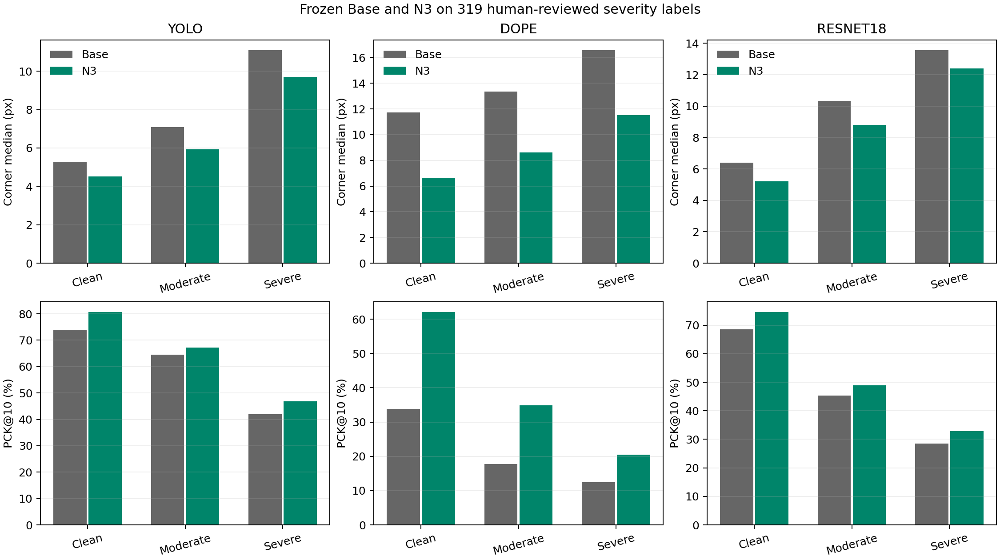
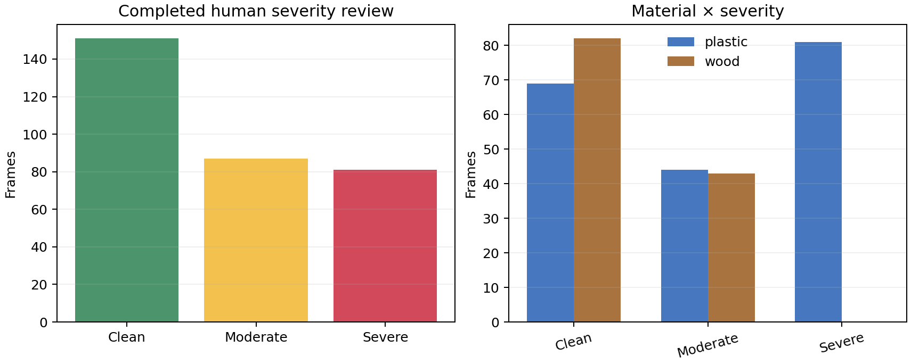
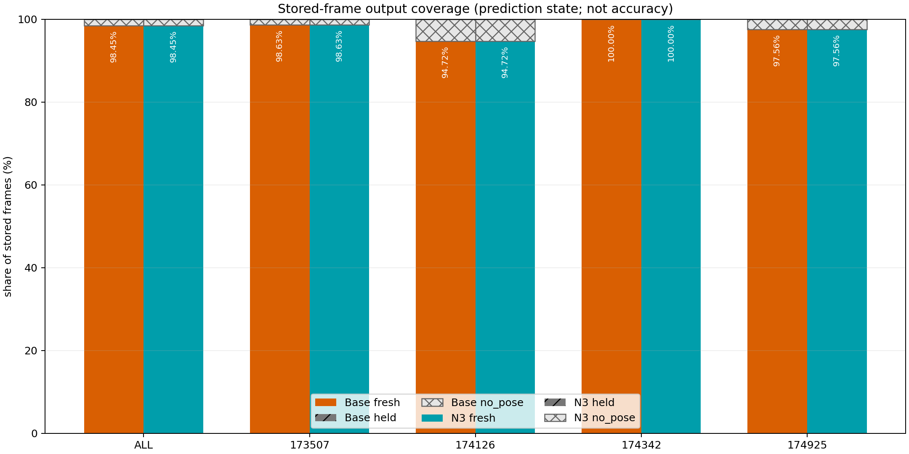

# 팔레트 정적·리프터 통합 마감 보고

## 직접 실행하고 검산한 항목

- 정확한 Base/N3 가중치의 크기와 SHA-256을 확인하고 네 리프터 영상의 저장 프레임 8,910장을 고정 한 순회로 추론했다. 새 학습 0회, optimizer update 0회다.
- Base와 N3는 각각 fresh 8,772, held 0, no-pose 138이며 산출률은 98.451%로 같다.
- 같은 인접 유효 쌍 8,737개에서 변화량을 계산했다. x·z P90은 낮아졌고 x·z 중앙값과 yaw 중앙/P90은 높아져 혼합 결과다. 정확도 또는 정지 잡음 개선으로 부르지 않는다.
- 완료 제출된 직사각형 319장 사람 가림 분류를 encoded RGB SHA-256과 frame ID로 전수 연결했다. clean 151 / moderate 87 / severe 81이며 미분류는 0이다.
- 기존 원시 예측만 새 집단으로 재집계했고 세 기반의 전체 결과는 전부 정확히 불변이었다. 정적 새 추론·PnP·학습은 0회다.
- 보존된 원고 복사본에 검산된 정적 표와 리프터 연속성만 실제 삽입했다. PDF는 생성하지 않았다.

## 정적 핵심 결과

| 집단 | n | Base 코너 중앙/P90(px) | N3 코너 중앙/P90(px) | Base→N3 T 중앙(cm) | Base→N3 R 중앙(deg) |
|---|---:|---:|---:|---:|---:|
| clean | 151 | 5.272/19.351 | 4.525/15.575 | 4.464→4.131 | 1.716→1.477 |
| moderate | 87 | 7.080/99.876 | 5.918/99.665 | 8.167→7.215 | 2.296→1.944 |
| severe | 81 | 11.084/52.325 | 9.696/51.516 | 13.484→15.706 | 61.635→11.706 |
| all | 319 | 6.721/43.890 | 5.778/42.134 | 7.897→7.068 | 2.539→2.070 |

severe에서는 코너와 회전 중앙값이 낮아졌지만 위치 중앙값은 13.484→15.706cm로 악화했다. DOPE와 ResNet도 일부 집단·P90에서 악화가 남는다. 가림 분석은 반복 개발자료의 사후 분석이다.

## 리프터 실제 출력

| 방법 | fresh/held/no-pose | 산출률 | abs Δx 중앙/P90(cm) | abs Δz 중앙/P90(cm) | abs Δyaw 중앙/P90(deg) |
|---|---:|---:|---:|---:|---:|
| Base | 8,772/0/138 | 98.451% | 0.094/0.609 | 0.298/2.150 | 0.108/0.431 |
| N3 | 8,772/0/138 | 98.451% | 0.100/0.593 | 0.320/2.059 | 0.114/0.436 |

contact sheet는 결과를 보고 고른 예가 아니라 고정 120장 전부다. 주황색은 Base, 청록색은 N3이며 사람 정답과 오차는 표시하지 않았다.

## 사람이 해야 하는 항목

- 리프터 120장 직접 가시 코너와 반복 24장 검수
- 같은 표본에서 frozen 예측 객체와 사람 대상의 대응 판정
- 실제 정지 구간 확인과 별도 독립 물리 참조 확보
- 정사각형 119장 가림 등급 및 남은 정적 코너 가시성

기존 리프터 주석은 같은 네 세션에 67개가 있었고 픽셀 해시는 모두 일치했다. 그러나 새 120장과 겹친 것은 2장이고, reviewer/time·signed axis 확인이 없으며 312점은 수동 클릭이 아니어서 자동 승인하지 않았다.

## 실행 비용과 검증

- GPU 추론 시간: 128.740s
- 추론 호출 wall 시간: 129.592s
- 고정 forward 프레임: 8,910; cache 재사용: 0
- 리프터 신규/통합 테스트 13 + 기존 metrics 16 = 29 PASS
- evaluator 수치 독립 대조 197/197 PASS
- 정적 UI localhost 저장/import/export/제출 차단 테스트 3 PASS
- 외부 업로드·push·PDF·실제 제어: 0

상세 상태는 `TASK_STATUS.csv`, 남은 행동은 `USER_ACTIONS_KO.md`, 원고 셀 출처는 `paper_patch/PAPER_CELL_MAP.json`과 `paper_patch/PAPER_GAP_MATRIX.md`에 있다.
