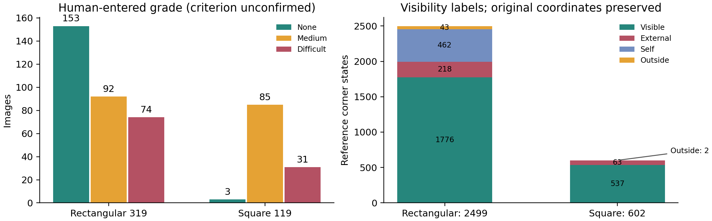
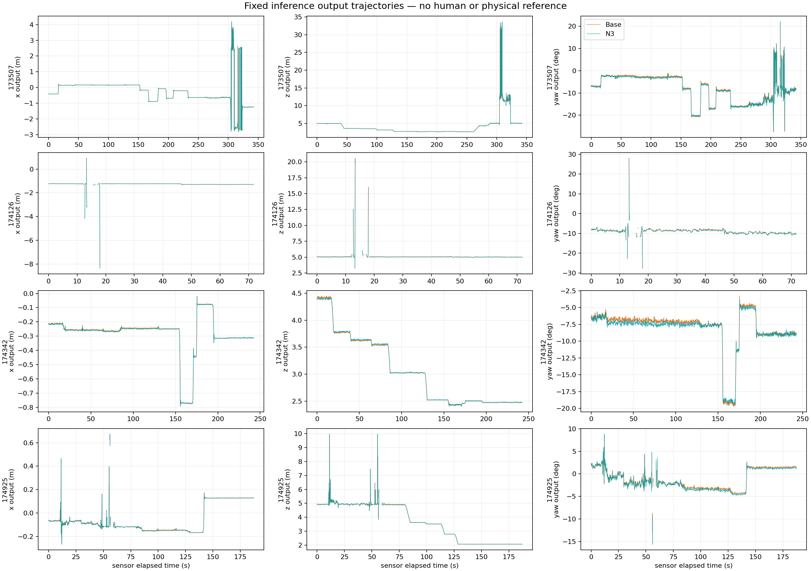

# 추가 사람 작업을 줄인 최신 원고 마감 결과

정적 입력을 재사용해 재집계·검산했고 실제 LaTeX 복사본의 표·본문·그림을 갱신했다. 리프터는 이미 완료된 고정8910장 예측을 재사용했다. 새 학습·optimizer update·추론은 모두0회다. 원고 원본과 이전 결과는 보존했다.

실제 계약은 세 Base가 RGB 추정기이고, 학습된 N3 후단이 이미지 특징·초기 코너·박스·물리 치수를 함께 받는 구조다. DOPE·ResNet N3의 기존 각3seed 학습 결과를 재사용했으며, 모든 Base에 직접 치수를 넣어 새로 학습했다고 기록하지 않았다. ResNet Base는 검증된10-epoch CONSTANT-fold RGB 모델이다.

## 실제 계산과 원고 반영

- 정적 DEV319 등급153/92/74, GREEN119 등급3/85/31을 그대로 연결했다. 새 프레임 등급435건과 기존 승인3건을 사용했다. 등급 의미는 `NOT_CONFIRMED`이며 답변 없는 기준을 CLI가 확정하지 않았다.
- 정적 참조 상태3101개=이번3030+기존71. 참조 없는 슬롯53/350은 가림으로 합치지 않았다. 기준 좌표를 바꾸지 않고 세 기반·seed·상태별 지표를 계산했다.
- 세 기반과 YOLO 절제N0/N1/P/N2/N3의2D/6D, D/L/PoseFix319, 학생128을 분리해 재집계했다. 세션 짝지은 분석과 기존 비용표는 검산 완료본을 재사용했다.
- 정사각형119는602점/600점 모드를 나란히 유지했다. 과거150장은 별도 자료·결과로 분리했다. 독립6D 참조가 없는 정확도는x다.
- 리프터12장 가시성96개는 완료이며 수동 좌표67점·좌표 없는 보임5점·자체가림24점을 구분했다. 공식 참조승인과 대상 대응은0건이므로 코너 정확도x를 유지했다.
- 실제 삽입된 셀과 별도 교체 조각만 준비된 셀은 [셀 출처표](paper_patch/PAPER_CELL_MAP.json)와 [미완료 행렬](paper_patch/PAPER_GAP_MATRIX.md)에 각각 기록했다.
- 본문 162개·보충 237개 숫자 셀을 실제 교체했고, 근거 없는 63개 x 셀은 유지했다. 상세 재질×등급 행은 별도 CSV/LaTeX 조각으로 제공하며 모두 본문에 삽입했다고 주장하지 않는다.
- 최종 독립 검토에서 발견한 결론·재질 설명의 오래된 문구를 정정했다. 본문에서 설명한 세 기반×세 등급은 보충 표9행에 실제 넣었고, 추가 세부 행은 완성된 선택적 보조 자료다. 사용자가 직접 표를 편집하거나 새로 삽입할 필요가 없다.

## 전체319장 결과

| 기반 | 코너 중앙값 px Base → N3 | T 중앙값 cm | R 중앙값 ° | 자세 산출 장수 |
|---|---:|---:|---:|---:|
| YOLO | 6.721 → 5.778 | 7.897 → 7.068 | 2.539 → 2.070 | 319 /319 → 319 /319 |
| DOPE | 12.570 → 7.469 | 10.046 → 8.356 | 3.530 → 3.051 | 210 /319 → 210 /319 |
| ResNet-18 | 8.223 → 7.085 | 9.739 → 9.134 | 4.342 → 3.832 | 319 /319 → 319 /319 |

N3는 각seed 지표의 평균이다. 서로 다른seed 예측을 합쳐 새 중앙값을 만든 값이 아니다. 코너 중앙값은 유효 예측의 조건부 값이며 PCK는 참조2499점의 전체 분모를 유지한다. DOPE의 자세 실패109장도 유지했다.

중앙값 개선과 어려운 사례의 개선은 다르다. DOPE의 코너P90은51.282→53.570px, 회전P90은80.583→82.173°로 악화된다. ResNet의 이동P90은97.545→100.304cm로 악화된다. YOLO의 사용자 입력 심함 집단에서도 이동 중앙값16.047→17.481cm로 악화된다. 이 값들을 숨기거나 좋은seed만 선택하지 않았다.





기존 원고의 실제 영상 예시는 [예시1](paper_updated/figures/example_1_frame.png), [예시2](paper_updated/figures/example_2_frame.png), [예시3](paper_updated/figures/example_3_frame.png)에 보존했다. 이번 재집계로 새로 골라낸 성능 좋은 사례라고 기록하지 않았다.


## 검산과 원본 보존

- 전체 지표 불변 검산 `100/100 PASS`; 상태 집단 재분류가 전체2D/6D 수치를 바꾸지 않았다.
- 기존 ResNet10-epoch CONSTANT-fold checkpoint·protocol·receipt와 대조군·학생 원시 결과의 해시 `36/36 PASS`.
- 원본/이전복사본 입력 `272/272개` 보존. HEAD는 `39d4219a9ecd35d2eab561a805d3eeb0add7838c`이며 기존 수정 파일도 유지했다.
- 리프터8910행의 Base/N3 결측 마스크·고정 선택 객체·8px 이동 상한 검산PASS, 새forward0.
- 실제 patch 적용·LaTeX 참조·그림·표 연결 검증은 [CLOSEOUT_VALIDATION](paper_patch/CLOSEOUT_VALIDATION.json)에 있다. PDF를 컴파일하지 않았으므로 최종 페이지 수는NA다.

## 남은 x와 사람 작업

이번 정적 결과와 연속 출력 원고 마감에는 추가 분류·코너 클릭·식별자 입력·등급 기준 답변을 요구하지 않는다. 기존3등급은 사용자 입력 등급으로 제한하여 보조 분석으로 사용했다. 마지막에는 [최종 확인 화면](final_review/FINAL_REVIEW.html)의 결과·근거 제한·원고를 한 번 확인하면 된다. 이 문서 확인을 주석 승인이나 새 정확도 결과로 바꾸지 않는다.

리프터 코너 정확도는 공식 참조·대상 대응·일부 실제 좌표가 없어x, 정지 구간 변동은 실제 정지 확인이 없어x, 독립 물리T/R은 별도 참조가 없어x다. 이를 없애는 추가 작업은 [최소 사용자 작업](USER_ACTIONS_KO.md)에 분리했다.103주프레임·23반복프레임을 완료라고 기록하지 않았다.

## 실제 실행과 비용

```bash
/home/minjae/anaconda3/envs/pallet-yolo26/bin/python -m scripts.research.pallet_static_registry_review_20261003_v1.reaggregate_native_closeout_20261006
/home/minjae/anaconda3/envs/pallet-yolo26/bin/python scripts/research/pallet_combined_closeout_20261003_v1/closeout_latest.py lifter-audit
/home/minjae/anaconda3/envs/pallet-yolo26/bin/python scripts/research/pallet_combined_closeout_20261003_v1/closeout_latest.py finalize
```

정적 재집계는 출처 연결 정정 전후2회 실행했으며 합계11.134초다. 가시성/정사각형 재집계2회는9.273초, 의미 검증의 계측된wall0.150초이며 각 실행을 [가시성 비용 ledger](visibility_square/ACTUAL_CPU_COST_LEDGER.json)에 보존했다. 리프터 재사용 감사는0.640초, 기존 결과36파일 해시 감사는0.171초다. 원고 검증 명령·실제 시간은receipt에 연결했다. 병행한 각CPU전용단계의벽시계를전체작업시간이나CPU사용초로합치지않았다. CPU사용초는NA다. 기존 GPU 측정값은 새 측정값으로 복사하지 않았다. 이번 GPU 학습·추론·재측정은0이다.

- [가시성·정사각형 계산](visibility_square/EXECUTION_VALIDATION.json)
- [원고 처리 6회 합계 4.912초 실행 기록](paper_patch/EXECUTION_RECEIPT.json)
- [직접 독립 검산](final_review/INDEPENDENT_PAPER_AUDIT_KO.md)
- [정적 결과와 seed별 CSV](static/DEV319_HEADLINE_AND_SEED.csv)
- [원고 복사본](paper_updated/main.tex), [본문 Markdown](paper_updated/manuscript_ko.md)
- [통합 patch](paper_patch/INTEGRATED.patch)
- [전체 실행 출처](INTEGRATION_MANIFEST.json)

PDF/PPT 생성, 리프터 제어, 새 학습, push와 외부 업로드는 실행하지 않았다.
