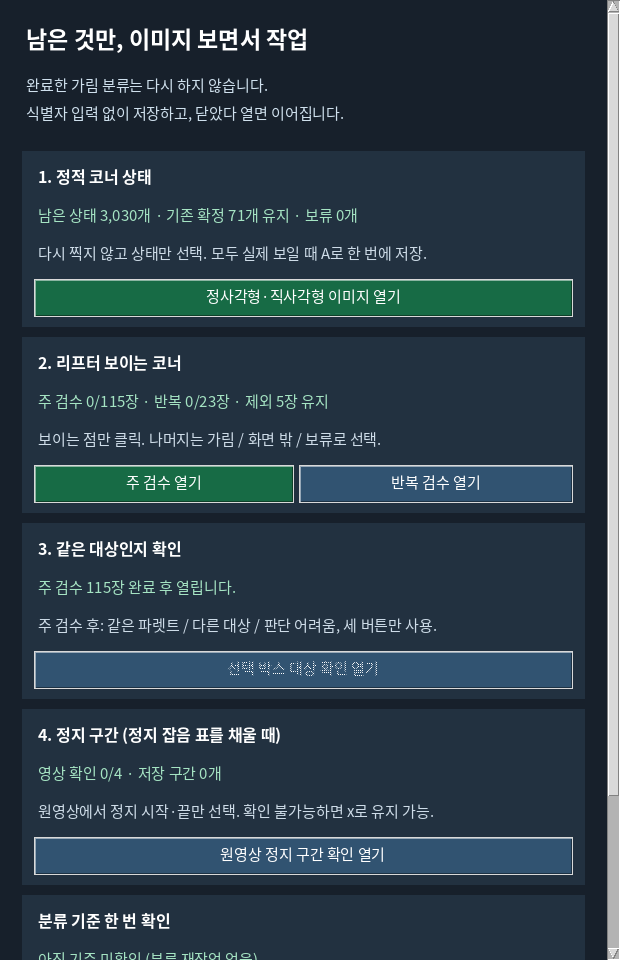
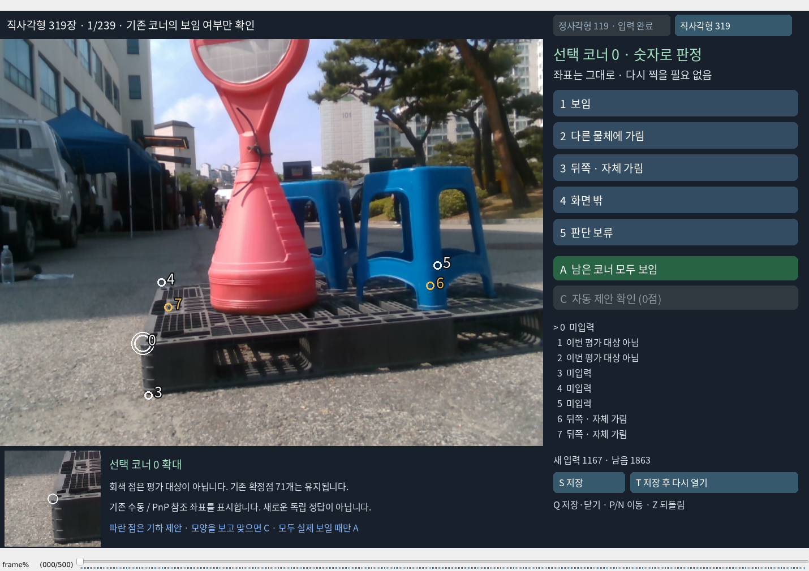
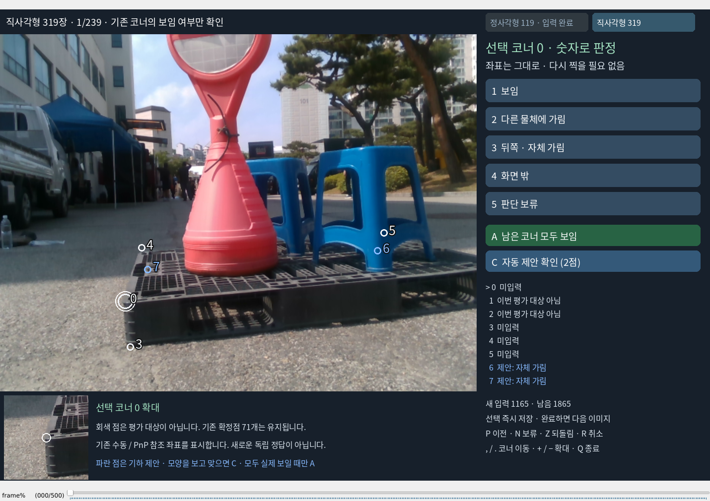
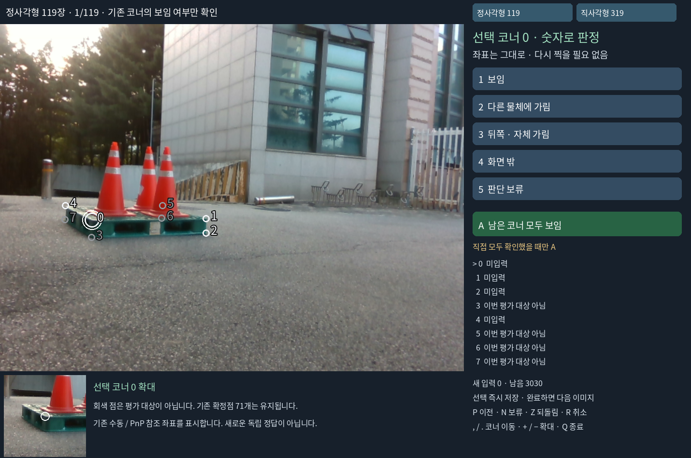
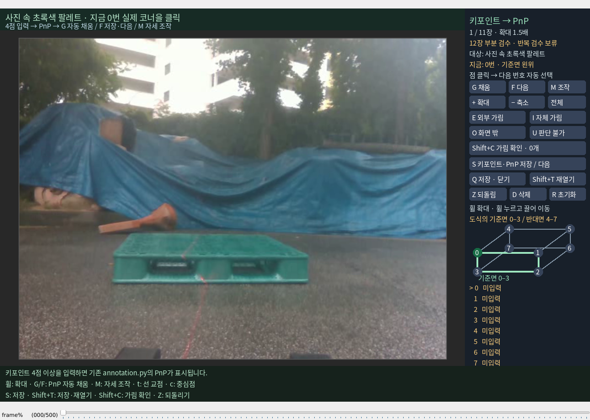
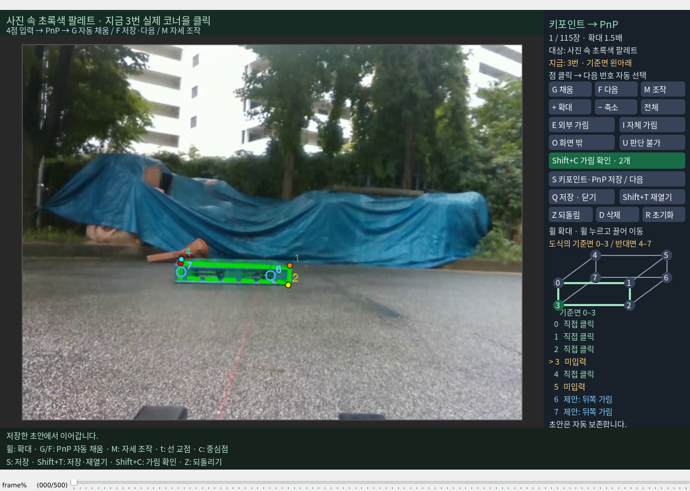
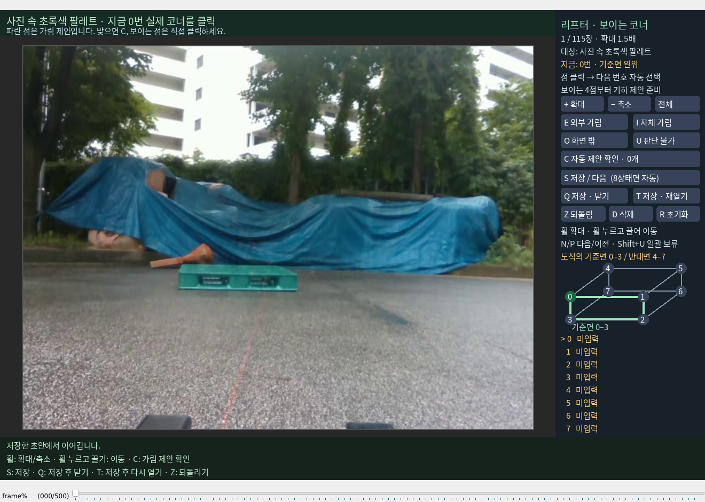
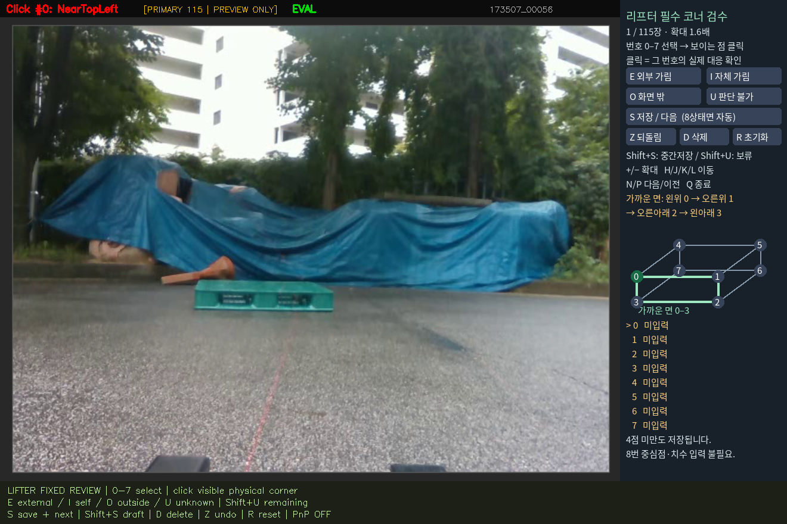
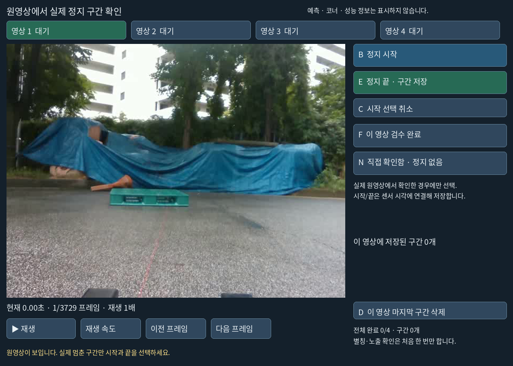

# 남은 사람 작업을 위한 쉬운 검수 도구

완료한 가림 분류를 반복하지 않습니다. 기존 `scripts/annotate/annotate.py`를 그대로 사용하며 정적 코너 상태, 리프터 코너, 대상 대응을 각각 필요한 버튼만 표시하도록 연결했습니다. 아래 이미지는 실제 원본으로 확인한 **도구 화면**이며 새 실험 결과나 사람이 완료한 주석을 뜻하지 않습니다.

**남은 5점 보임 답변 반영(최신, 2026-10-05):** 사용자의 보임(V) 답변을 기록해 부분 12장·96개 가시성 분류가 모두 완료됐습니다. 실제 수동 좌표 67점과 좌표 없는 보임 판단 5점을 구분하며, 같은 5장의 재분류·재클릭을 요구하지 않습니다. [완료 결과와 근거](visibility_classification_complete_20261005_v1/REPORT_KO.md)

**“다했어” 이후 실제 입력 확인(최신, 2026-10-05):** 부분 12장의 PnP 저장은 모두 있습니다. 코너 상태는 91/96개 입력됐으며 7장은 완성, 나머지 5장은 한 점씩 미입력입니다. 완료 초안 3장을 포함해 모든 실제 입력을 별도 보존했습니다. 완료한 입력은 다시 검수할 필요 없습니다. [확인 결과·남은 5점 이미지](completion_20261005_v1/REPORT_KO.md)

**가시성 검수 R/D 수정(최신, 2026-10-05):** R은 키포인트를 유지하며 상태 변경을 복구하고, D는 선택한 상태를 취소합니다. 삭제된 173507:3655의 실제 6점과 6·7 자체 가림을 저장 원본에서 복원해 다시 열었습니다. [복구 화면과 검증](visibility_reset_fixed_20261005_v1/REPORT_KO.md)

**S 저장 팝업 제거(최신, 2026-10-05):** 일반 S는 작성 이력 창 없이 주석을 저장합니다. 8개 상태가 완성되면 다음 이미지로 이동하고, 미입력 상태는 초안으로 보존합니다. 미확인 이력은 미확인으로 유지하며 평가용 참조 승인과 구분합니다. [저장·재개 검증](s_without_popup_20261005_v1/REPORT_KO.md)

**화면 잘림 수정(2026-10-05):** 하단 안내가 오른쪽 패널을 덮지 않도록 분리했습니다. 8개 코너 상태를 두 열로 표시하며, 작은 창에서는 패널 위 휠로 끝까지 이동합니다. 주석·확대 위치는 보존해 실제 창을 다시 열었습니다. [현재 화면과 검증](sidebar_fit_20261005_v1/REPORT_KO.md)

**리프터 상태 선택 수정(2026-10-05):** I 등 상태 버튼은 초안만 보존하며 작성 이력 창을 열지 않습니다. **V 보임** 버튼과 선택한 점의 현재 상태를 추가했습니다. S는 현재 이미지 저장, B는 기존 12장 입력 제출입니다. 기록으로 확인되는 PnP·기존 수동점 이력은 자동 기록하고, 최초 명시적 제출에서만 모델 예측을 전에 봤는지 묻습니다. [수정 화면과 사용법](visibility_flow_fixed_20261005_v1/REPORT_KO.md)

**2026-10-05 현재 작업량:** 정적 코너 상태 3,030개와 리프터 부분12장의 키포인트·PnP 저장은 완료됐습니다. 방금 직접 찍은67점과 이미 C로 확인한2개 상태는 재사용합니다. **B 기존 입력점 일괄 저장**은 좌표를 다시 찍거나 같은12장을 다시 분류하지 않고, 미확정27개 상태를 보류로 남겨 제출하는 버튼입니다. 실제 저장 확인과 최초 이력 확인은 사용자가 한 번 직접 해야 합니다. 이후 같은 대상인지 버튼으로 확인합니다. 나머지103장과 반복23장은 보류하며 전체 검수 완료로 기록하지 않습니다. [축소 목록과 검증 기록](minimal_batch_20261005_v1/REPORT_KO.md)

메뉴를 다시 여는 명령:

```bash
cd /home/minjae/Documents/github/pallet-pose
/home/minjae/anaconda3/envs/pallet-yolo26/bin/python scripts/research/pallet_combined_closeout_20261003_v1/open_human_review.py
```



## 지금 이미지에서 할 일

정사각형 119장과 직사각형 319장의 **기존 코너 좌표를 다시 찍지 않습니다.** 선택된 번호의 상태만 고릅니다.

| 버튼 또는 키 | 기록하는 상태 |
|---|---|
| 1 | 직접 보임 |
| 2 | 다른 물체에 가림 |
| 3 | 뒤쪽·자체 가림 |
| 4 | 화면 밖 |
| 5 | 판단 보류 |
| A | 직접 확인한 남은 대상점이 모두 보일 때 한 번에 기록 |
| C | 이미지에서 확인한 파란 기하 제안들을 한 번에 반영 |
| S | 저장 확인 (현재 이미지 유지) |
| T | 저장 후 즉시 다시 열기 |
| Z / R | 최근 상태 되돌림 / 현재 이미지의 새 입력 취소 |
| P / N / Q | 이전 / 보류하고 다음 / 저장 후 닫기 |

버튼 클릭과 키 입력은 같은 저장 경로를 사용합니다. 점 또는 오른쪽 번호 행을 클릭하면 해당 점을 선택하고, 아래 확대창에서 확인할 수 있습니다. 상태를 선택하면 즉시 저장하며 이미지의 대상점 입력이 끝나면 다음 이미지로 넘어갑니다. 다시 열면 미완료 이미지만 작업 목록에 넣어 완료한 이미지를 반복하지 않습니다. 전체 입력이 끝난 자료의 전환 버튼은 입력 완료로 표시합니다. 기존 입력을 수정·확인하고 싶을 때만 정적 도구를 `--show-completed` 옵션으로 엽니다. 실행 중인 기존 창의 입력은 보존하며 목록 변경은 다음 실행부터 적용됩니다.

현재 이미지·선택 코너·확대·이동 위치도 별도 `VIEWER_RESUME.json`에 기억합니다. 오른쪽 **T 저장 후 다시 열기** 버튼을 누르면 새로 열린 창에서 바로 이어집니다. `S`로 저장하고 `Q`로 닫은 뒤 작업 메뉴에서 다시 열어도 같은 방식입니다. 해당 이미지가 이미 입력 완료이면 다음 미완료 이미지로 이동합니다. 이 재개 파일은 화면 위치만 기록하며 사람 주석·검수 이력을 만들거나 바꾸지 않습니다.



기존 확정 71점은 잠그고 보존합니다. 새 상태 입력이 필요한 평가 참조점은 3,030개입니다. 평가 참조가 없는 403슬롯과 별도 구자료 150장의 추가 코너 주석을 강제로 요구하지 않습니다. 판단 보류는 확정 가시성으로 바꾸지 않습니다. 기존 수동/PnP 좌표의 상태를 보는 것이며 독립 6D 정답을 새로 만드는 작업이 아닙니다.

화면 밖은 기존 좌표와 실제 원영상 크기의 경계로 계산합니다. 자체 가림은 기존 치수·주석 자세의 세 기하 가설이 모두 후면이라고 판단하는 점만 제안합니다. 정사각형/직사각형의 코너 순서와 치수 대응을 보존합니다. 팔레트의 구멍·다리와 외부 물체는 이 직육면체 근사에 포함되지 않으므로 자체 가림을 자동 정답으로 확정하지 않습니다. 파란 점과 오른쪽 `제안` 행을 보고 맞으면 `C`; 다르면 번호 행을 선택해 `1~5`로 입력합니다. 사람 확인 전에는 제안만 있고 검수 상태는 바뀌지 않습니다. 기하 도움과 실제 확인 행동은 저장 기록에서 구분합니다.

2026-10-04 도구 갱신 직전 사용자가 입력한 **1,165점은 전부 보존**했습니다. 정사각형 602점 입력이 완료되어 남은 직사각형 239장부터 열었습니다. 당시 미입력 1,865점 중 자체 가림 제안315점·화면 밖 제안43점, 총358점을 이미지별 `C`로 확인할 수 있습니다. 이 개수는 그 시점의 진행 기록이며 최신 수는 작업 메뉴에서 확인합니다.





## 리프터에서 할 일

사용자가 제외한 5장을 다시 열지 않습니다. 원래 120장·반복24장 계획과 제외 후 115장·반복23장의 분모는 보존합니다. 현재 메뉴는 `SMALL_BATCH_12_V1.json`의 **주12장**만 열고 반복 검수는 보류합니다. 표본은 예측·오차·가림 결과를 보지 않고 각 세션의 남아 있는 고정 시간 표본 중 첫 장·중간 장·마지막 장으로 고정했습니다. 이미 저장한 키포인트·PnP는 다시 요구하지 않으며, 평가용 제출 완료와는 별도로 셉니다.

키포인트 입력을 끝낸 뒤 메뉴의 **기존 클릭 일괄 저장**으로 열어 **B**를 누르면 방금 직접 입력한 좌표와 이미 확인한 상태를 일괄 재사용합니다. 미입력 점은 실제 사람의 버튼 확인 후에만 `uncertain`으로 보류하며 자체 가림·외부 가림·화면 밖을 추정 확정하지 않습니다. 같은 사람이 즉시 다시 보는 독립 반복 실험으로 세지 않습니다. 실제 버튼 확인 전에는 초안이며 CLI가 자동 제출하지 않습니다.



**현재 기본 창은 원래 annotation.py의 키포인트→PnP 흐름입니다.** 먼저 보이는 코너 4점 이상을 입력하면 검증된 실제 카메라 K와 고정 치수로 PnP 윤곽을 표시합니다. **G**는 나머지 투영점을 채워 저장하고 현재 프레임에 머무릅니다. **F**는 PnP 보조 주석을 저장하고 다음 프레임으로 갑니다. **M**은 자세 조작과 클릭 모드를 전환합니다. 8개의 가시성 상태 입력이나 C 확인을 먼저 끝낼 필요가 없습니다. 자세 조작에서는 A/D 좌우, W/X 상하, Q/E 깊이, J/L yaw, I/K pitch, U/O roll이며 S로 자세를 저장합니다.

원래 소문자 **t=선 교점**, **x=외삽**, **c=중심점**도 복원했습니다. 추가된 가림 확인은 **Shift+C**, 저장·다시 열기는 **Shift+T**입니다. 생성 좌표는 pnp_projected/centroid_auto/extrapolated와 마스크로 구분하며 실제 직접 클릭은 별도 참조에 보존합니다. 키포인트·PnP 저장 진행과 가시성 검수 완료 진행도 서로 구분합니다.



상세 출처와 실제 PnP 검증은 [native PnP 복원 기록](native_pnp_restored_20261004_v1/REPORT_KO.md)에 있습니다. 아래 C 보조 설명은 PnP 입력 뒤 가시성 상태를 확인할 때 사용합니다. 상태 검수만 하는 창은 `open_existing_annotation.py --pass primary --visibility-only`로 열 수 있습니다.

**보이는 코너를 클릭하면 다음 번호가 자동으로 선택됩니다.** 번호를 따로 고를 때는 오른쪽 도식을 누릅니다. 도식의 0–3은 기준면, 4–7은 반대면이며 화면의 가까운 면이나 임의의 화면 순서를 정답으로 단정하지 않습니다. 대상은 원영상의 초록색 팔레트입니다. 마우스 휠 또는 `+/−` 버튼으로 확대하고, 휠을 누른 채 끌어 이동하거나 `전체` 버튼으로 전체 영상을 봅니다.

직접 확인해서 클릭한 점이 4점 이상이면 **본인의 클릭·고정 치수·기록된 카메라**만으로 기하 제안을 만듭니다. 유효한 자세 후보 모두가 동의하는 자체 가림·화면 밖 상태를 파란색으로 표시하며, 이미지에서 맞음을 확인한 뒤 **C 자동 제안 확인**을 누릅니다. 보이는 좌표를 자동 정답으로 채우지 않고, 가려진 점의 좌표는 계속 `null`입니다. 외부 가림·확인 불가능한 점은 자동으로 확정하지 않습니다. 평면 자세가 모호하면 4점을 찍어도 제안이 없을 수 있으므로 실제 보이는 다른 코너를 추가하거나 `U`로 보류합니다. 제안만 표시한 상태와 실제 C 확인, 보조 사용 이력은 따로 기록합니다. Base/N3 예측과 박스는 표시하거나 읽지 않습니다.

여덟 상태를 모두 입력하면 자동 저장 후 다음으로 넘어갑니다. **S**는 완성된 입력을 저장·다음으로 진행하며, 미완료일 때는 현재 프레임의 초안만 저장합니다. **Q**는 초안을 보존하고 닫기, **T**는 초안을 보존한 뒤 즉시 다시 열기입니다. `Z`는 실제 한 단계 되돌리기, `R`은 현재 입력 초기화입니다. 최초 이력 확인 전에도 실제 입력과 프레임·선택점·확대·이동을 `VIEWER_DRAFT_RECOVERY.json`에 자동 보존합니다. 이 로컬 초안은 `evaluation_use=false`이며, 사람 이력 확인과 승인 저장을 거치기 전에는 평가 참조나 검수 완료로 내보내지 않습니다. 주·반복 차수의 초안은 별도로 보존하고 반복에 최초 좌표를 미리 넣지 않습니다.



구현·검증 및 제한의 세부 기록은 [리프터 C 보조 갱신](lifter_assisted_20261004_v1/REPORT_KO.md)에 있습니다.

첫 저장에서 자동 별칭과 실제 검수 이력만 한 번 확인합니다. 이름·프레임 ID·치수 입력은 없습니다. 한국어가 없는 로컬 Tk 환경에서도 확인창 문구를 읽을 수 있게 Noto 글꼴 이미지로 표시합니다. 반복 검수에 첫 좌표·상태를 미리 채우지 않습니다. 본인의 이전 주석을 실제로 본 이력은 별도 기록합니다.



## 코너 작업 다음에 할 일

- **대상 대응:** 현재 선택한 주12장의 코너·가시성 작업을 끝내면 메뉴의 대상 확인 버튼이 활성화됩니다. 같은 이미지에서 최대 12번, 원본 이미지와 고정 선택 박스만 보고 `같은 파렛트 / 다른 대상 / 판단 어려움` 중 하나를 선택합니다. 새 좌표를 찍거나 식별자를 입력하지 않습니다. 예측 코너·방법명·오차는 표시하지 않습니다. 첫 참조의 잠긴 복사본에 큐를 연결하므로 목록 밖 주석이나 반복 검수가 추가되어도 이미 한 대상 확인을 무효화하지 않습니다. 전체115장 완료 게이트는 `--batch-plan` 없이 실행하는 기존 경로에만 유지됩니다.
- **정지 구간:** 정지 잡음 표를 채울 때만 네 원영상을 확인합니다. `Space 재생/정지 / B 정지 시작 / E 정지 끝·저장 / F 이 영상 검수 완료 / N 직접 확인했으나 정지 없음`입니다. 화면 버튼과 슬라이더도 사용할 수 있습니다. 예측을 이미 보았는지와 예측을 보기 전에 구간을 정했는지 실제로 답하며, 확인할 수 없는 정지 참조와 독립 물리 T/R 참조는 `x`로 유지할 수 있습니다.
- **분류 기준:** 메뉴 아래에서 앞서 완료한 없음·중간·어려움이 외부 가림 정도인지 전체 시각 난이도인지 한 번 확인합니다. 기존 분류 숫자와 원본 주석은 바꾸지 않습니다.



## 저장과 결과 연결

| 작업 | 별도 저장 위치 |
|---|---|
| 정적 점 상태 | `data/pallet/results/pallet_static_registry_review_20261003_v1/native_corner_visibility/STATIC_CORNER_VISIBILITY_INPUTS.json` |
| 리프터 코너 | `data/pallet/results/pallet_lifter_case_review_20261003_v1/review/annotations_in_progress.json` 및 `LIFTER_REFERENCE_REVIEWED.json` |
| 대상 대응 | `review/native_object_match/<잠긴 주 참조 해시>/LIFTER_OBJECT_MATCH_REVIEWED.json` |
| 정지 구간 | `review/STATIONARY_INTERVALS_REVIEWED.json` |
| 분류 기준 확인 | `data/pallet/results/pallet_combined_closeout_20261003_v1/human_review/SEVERITY_CRITERION_CONFIRMATION.json` |

대상 대응을 모두 제출하면 고정 8,910행에서 평가기용 파생 예측과 L4 receipt를 만듭니다. 기존 예측·가중치·해시로 잠긴 계약은 덮어쓰지 않습니다. 다른 대상은 실패, 판단 불가는 미확정으로 유지합니다. 정지 구간은 기존 평가기에 필요한 센서 시각으로 연결하며 전체 완료는 네 세션의 실제 제출 여부를 별도로 확인합니다. 노출 조건이 성립하지 않으면 주석은 보존하고 정지 잡음의 엄격한 비교는 보류합니다.

**도구 준비와 사람 검수 완료를 구분합니다.** 실제 사람 입력 후에만 새 상태·좌표·대응·정지 판정을 저장합니다. 새 학습·새 추론·실제 리프터 제어·PDF 생성·외부 업로드·push는 이번 작업에서 실행하지 않았습니다. 최신 검수 결과의 재집계와 원고 표 반영은 사람 입력 이후의 별도 계산 단계이며 이 문서는 논문 전체 완료를 선언하지 않습니다.

검증 명령과 실제 통과 개수는 같은 폴더의 `VALIDATION.json`에 기록합니다. 시험 주석은 임시 폴더만 사용했습니다.
