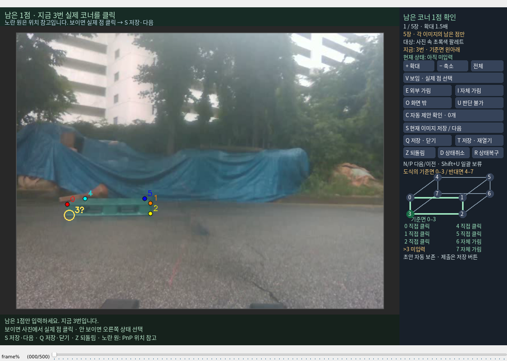

# 남은 5점만 열기

실제 `annotation.py` 창을 열고 1/5장과 미입력 3번 선택을 확인했습니다. 완료한 7장은 이 작업 목록에 넣지 않았습니다. 이후 네 이미지에서는 미입력 5번이 선택됩니다. 기존 수동점과 사람이 입력한 가림 상태는 유지합니다.

보이면 사진에서 실제 코너를 클릭한 뒤 **S 저장·다음**을 누릅니다. 안 보이면 오른쪽 상태를 고른 뒤 S를 누릅니다. 노란 빈 원은 같은 프레임의 본인 입력으로 만든 PnP 위치 참고이며 수동 좌표로 자동 저장되지 않습니다. 12장 일괄 제출 B는 이 창에 표시하지 않습니다. 일반 S는 이력 확인 창을 열지 않습니다.



```bash
DISPLAY=:0 /home/minjae/anaconda3/envs/pallet-yolo26/bin/python \
  scripts/research/pallet_lifter_case_review_20261003_v1/open_existing_annotation.py \
  --pass primary --visibility-only \
  --batch-plan data/pallet/results/pallet_lifter_case_review_20261003_v1/review/REMAINING_CORNERS_5_V1.json
```

신규 5개를 포함해 관련 52개 테스트를 통과했습니다. 시험 입력은 임시 합성 자료만 사용했습니다. 준비 CLI에서 `01_PRIMARY_5`와 고정 원래 분모 115/23을 확인했습니다. 이 문서는 창 열기와 도구 검증 기록이며, 사용자 입력 완료나 공식 참조 승인 완료를 뜻하지 않습니다. [실행 확인](REMAINING_VIEWER_OPENED.json)
