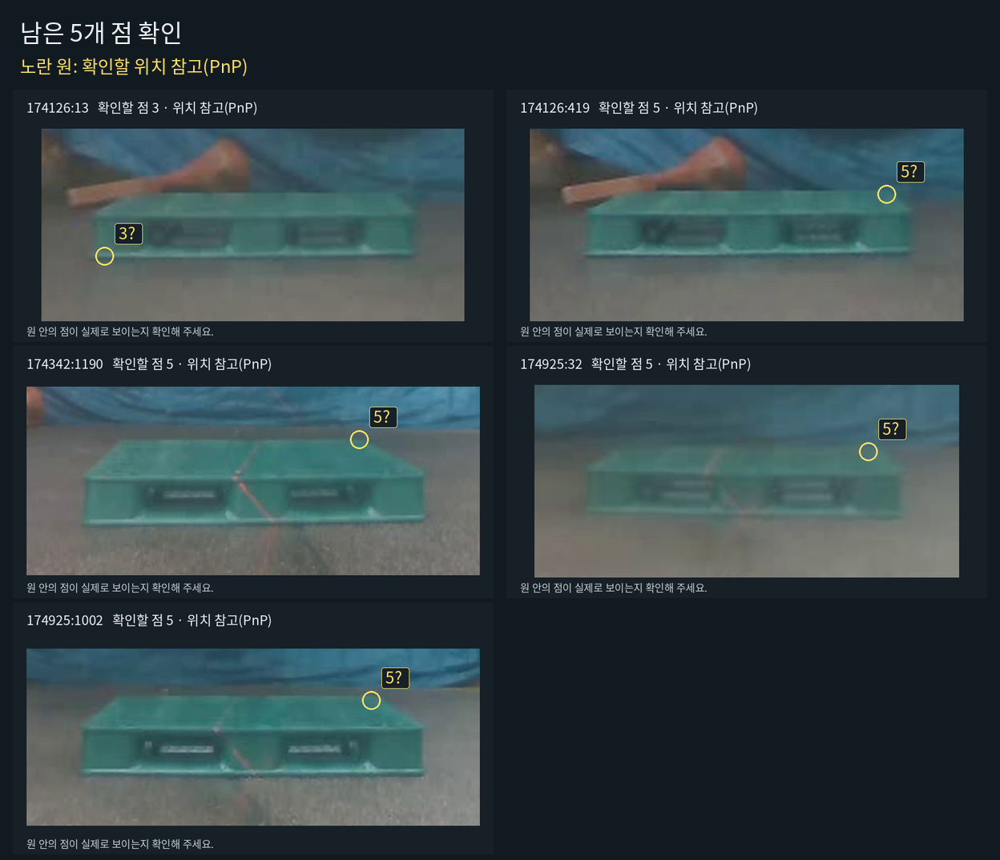

# 2026-10-05 실제 입력 완료 확인

**12장의 키포인트·PnP 저장은 모두 있습니다. 가시성 상태는 96개 중 91개가 입력됐고, 7장은 8개 상태가 모두 채워졌습니다. 나머지 5장은 각각 한 점만 미입력입니다.** 완료한 7장을 다시 검수할 필요는 없습니다.

사용자가 “다했어”라고 알린 뒤 실제 로컬 `VIEWER_DRAFT_RECOVERY.json`, S 저장 파일, PnP 원본, 원이미지, 고정 계약 해시를 대조했습니다. 원본 파일은 유지하고, 현재 12장의 실제 입력을 별도 보존했습니다. 입력 상태와 평가용 참조 승인은 별도로 기록합니다.

| 확인 항목 | 실제 값 | 근거 |
|---|---:|---|
| 선택된 고정 부분 표본 | 12장 | 기존 `SMALL_BATCH_12_V1.json` 그대로 |
| 키포인트·PnP 저장 | 12/12장 | `NATIVE_PNP_PROGRESS.json` 및 원본 PnP 파일 |
| 직접 클릭한 코너 | 67점 | PnP 원본의 실제 수동점 66점 + 이후 실제 클릭 1점 |
| 사람이 확인한 자체 가림 | 24점 | 현재 C 확인 근거 23점 + 실제 I 상태 선택 및 S 저장 1점 |
| 외부 가림 / 화면 밖 / 판단 보류 | 0 / 0 / 0점 | 실제 입력; 미입력과 구분 |
| 미입력 | 5점 | `visibility=null`, 참조 좌표 없음 |
| 8개 상태가 모두 입력된 이미지 | 7/12장 | 56점의 상태 입력 완료 |
| 실제 S 저장 완료 이미지 | 4장 | 원본 파일 SHA-256 및 현재 초안과 대조 |
| S 없이 초안 자동 보존으로 완료된 이미지 | 3장 | 현재 초안의 실제 상태·행동 기록 그대로 보존 |
| 평가용 공식 참조 제출 | 0장 | 공식 참조 파일 없음; 작성 이력 미확인 |

`174925:1892`의 5번은 PnP 저장 당시 미입력이었지만, 이후 09:34:03.386Z에 실제 클릭되어 S 저장 원본에 있습니다. 이 점은 보존했습니다. 같은 이미지의 6번은 이후 실제 자체 가림 버튼 선택으로 갱신됐으므로 현재 C 근거 24점이라고 쓰지 않습니다.

## 완료한 입력

| frame ID | 입력 상태 | 보존 근거 |
|---|---|---|
| 173507:56 | 8/8 | 실제 S 저장 |
| 173507:1652 | 8/8 | 실제 S 저장 |
| 173507:3655 | 8/8 | 실제 S 저장 및 기존 R 오류 복구 근거 |
| 174126:744 | 8/8 | 직접 클릭 + 실제 C 확인 초안 |
| 174342:41 | 8/8 | 직접 클릭 + 실제 C 확인 초안 |
| 174342:2447 | 8/8 | 직접 클릭 + 실제 C 확인 초안 |
| 174925:1892 | 8/8 | 실제 S 저장 |

S를 누르지 않은 3장도 현재 실제 초안에서 별도 파일로 보존했습니다. 기계 보존은 `machine_preserved_actual_annotation`으로 명시하고 원래의 코너·대상·행동 기록을 그대로 복사했습니다. 실제 S 버튼을 눌렀다는 행동을 추가하거나 `human_reviewed`로 바꾸지 않았습니다.

[전체 12장 감사 결과](COMPLETION_AUDIT.json), [별도 보존 폴더](../../../../../data/pallet/results/pallet_lifter_case_review_20261003_v1/review/user_completion_20261005_v1/)에서 원시 초안과 파일 해시를 확인할 수 있습니다. 원래 초안 파일의 바이트 그대로인 `VIEWER_DRAFT_RECOVERY_EXACT_COPY.json`도 함께 보존했습니다.

## 남은 5개 점

| frame ID | 남은 코너 | 해당 이미지 |
|---|---:|---|
| 174126:13 | 3 | [확인 이미지](images/174126_13_corner_3_question.png) |
| 174126:419 | 5 | [확인 이미지](images/174126_419_corner_5_question.png) |
| 174342:1190 | 5 | [확인 이미지](images/174342_1190_corner_5_question.png) |
| 174925:32 | 5 | [확인 이미지](images/174925_32_corner_5_question.png) |
| 174925:1002 | 5 | [확인 이미지](images/174925_1002_corner_5_question.png) |



노란 원은 본인이 입력한 같은 프레임의 점으로 만든 **PnP 위치 참고**입니다. Base/N3 예측이나 수동 참조 좌표가 아닙니다. 실제로 보이는 점이면 실제 코너를 클릭하고, 보이지 않으면 해당 상태만 입력하면 됩니다. 원의 중심을 그대로 수동 정답으로 복사하지 않습니다. 174126:13의 3번에는 실제 삭제 기록이 있어 이전 좌표를 자동 복구하지 않았습니다.

[미입력 5점 목록](MISSING_CORNER_TASKS.json)은 기존 12장의 남은 입력 작업만 나열합니다. 원래 평가 표본을 5장으로 바꾸는 새 통계 표본이나 검수 완료 파일이 아닙니다. [이미지 출처·PnP 도움·출력 해시](images/preview_manifest.json)에 기계 도움과 미검수 상태를 명시했습니다.

## 평가 연결 상태

이번 보존으로 새로운 사람 판단이나 작성 이력 답변을 만들지 않았습니다. 예측을 전에 봤는지는 `null/UNVERIFIED`로 유지합니다. 원래 검증기의 이력 확인 조건을 변경하지 않았고, 보존 파일의 `evaluation_use=false`도 유지합니다. 따라서 이 보고서는 입력 확인 결과이며 논문 전체 완료 또는 공식 참조 승인 완료를 선언하지 않습니다.

원래 제외 후 주 표본 115장·반복 23장 계획과 부분 12장 선택은 유지됩니다. 선택하지 않은 주 103장과 반복 23장은 보류 상태입니다. 독립 물리 T/R 정답이 없으므로 독립 이동·회전 정확도는 `x`로 남습니다.

## 실행과 검산

```bash
/home/minjae/anaconda3/envs/pallet-yolo26/bin/python \
  scripts/research/pallet_combined_closeout_20261003_v1/audit_user_completion.py

/home/minjae/anaconda3/envs/pallet-yolo26/bin/python \
  scripts/research/pallet_combined_closeout_20261003_v1/prepare_missing_preview.py
```

감사 스크립트는 원이미지 해시와 고정 계약, 실제 S 파일 해시, 현재 코너·대상, 원본 수동점 또는 이후 실제 클릭, 실제 가림 확인을 대조했습니다. 67 + 24 + 5 = 96, 완료 7장 = 실제 S 4장 + 완료 초안 3장으로 검산했습니다. 보존 전후 원본 해시가 동일합니다. 보존 원본이 달라지면 기존 아카이브를 덮어쓰지 않고 중단합니다.

신규 학습 0회, optimizer update 0회, 신규 모델 추론 0회입니다. PDF 생성·리프터 제어·외부 업로드·push는 실행하지 않았습니다. 원래 `scripts/annotate/annotate.py`와 고정 검증기도 변경하지 않았습니다. [검산 기록](VALIDATION.json)에 실제 명령과 확인 결과를 저장했습니다.
