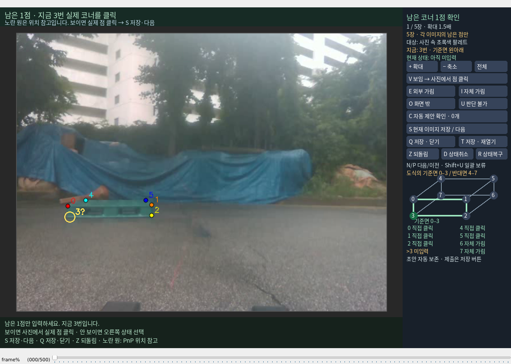

# 보임 v 키 연결 수정

사용자의 작업 완료 알림 후 현재 기록을 검산했습니다. 다섯 프레임을 표시한 기록은 있지만 코너·대상·사람 행동 기록은 이전과 동일합니다. 이는 사용자 작업 여부를 단정하는 근거가 아닙니다. 저장 파일에는 아직 5점이 미입력으로 남아 있습니다.

실제 실행 출력에 `v toggle disabled`가 네 번 있었습니다. 원래 annotation.py의 review 루프가 소문자 v를 검수 분할 변경 키로 차단하며 연구 어댑터의 보임 처리 전에 입력을 소비했습니다. 고정 분할과 원래 코드를 유지한 채, 부분5장 가시성 창의 키 입력만 v→V로 연결했습니다. 전체 보기 버튼은 차단되지 않는 F로 분리했고, 이 창에서는 Shift+S도 일반 저장으로 연결했습니다.

보임을 선택한 후 사진에서 실제 코너를 클릭하면 실제 수동 좌표가 저장됩니다. 위치 참고인 노란 PnP 원을 자동 참조로 복사하지 않습니다. S를 눌렀을 때 아직 점을 클릭하지 않았으면 미입력 안내를 표시합니다. 추가 입력이 없었던 프레임을 완료로 올리지 않습니다.

[실제 저장 검산](POST_VIEWER_SAVE_CHECK.json). 이전 감사 결과와 아카이브는 보존했습니다.

관련 58개 시험을 1.725초에 통과했습니다. 실제 클릭·S 저장·재개, 소문자 v 전달, 전체 보기와 미입력 S 안내를 합성 임시 자료로 검증했습니다. 같은 5장 창을 다시 열고 첫 이미지의 3번 선택을 실제 화면에서 확인했습니다. [검증 기록](V_SHORTCUT_FIX_VALIDATION.json)

