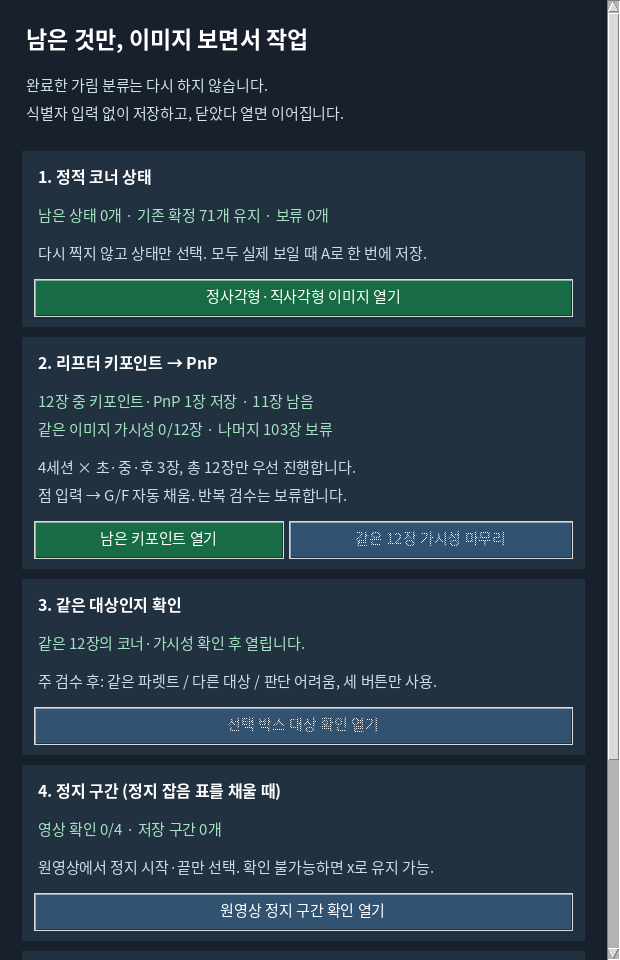

# 리프터 최소 사람 검수: 12장 부분 목록

2026-10-05 사용자의 작업량 축소 요청을 반영했다. 기존 고정 120장·반복24장 계획과 사용자 제외 후 115장·반복23장의 분모는 보존한다. 네 세션의 고정 시간 표본 중 첫 장·중간 장·마지막 장을 예측·오차·가림 결과를 보지 않고 선택한 별도 12장 목록이다. 나머지103장과 반복23장은 보류하며 완료로 기록하지 않는다.

이미 실제 사용자가 입력·저장한 `173507:56`의 6개 직접 클릭과 PnP 생성점을 그대로 보존했다. 키포인트·PnP 저장1/12, 추가 입력11장이다. 실제 가시성 승인0/12이므로 키포인트 저장을 사람 검수 완료로 세지 않는다. 목록 밖 실제 초안도 삭제하지 않는다.




## 사람이 하는 순서

1. 열린 기존 annotation.py에서 보이는 실제 코너를 입력하고 G/F로 PnP 저장·다음을 진행한다. 남은11장만 열린다.
2. 키포인트·PnP를 모두 저장한 뒤 같은12장의 가시성을 마무리한다. 자기 클릭에서 나온 기하 제안은 이미지에서 맞는지 확인해야 하며 CLI가 확정하지 않는다. 새 이미지를 추가하지 않는다.
3. 지정한12장 전부의 참조를 잠근 뒤 같은 대상인지 최대12번 버튼으로 확인한다. Base/N3 코너·방법·오차를 최초 클릭 화면에 표시하지 않는다.

## 계약과 원고 범위

통합 지시문 L7B는 고정 표본 중 실제 승인 참조·대상 대응이 확보된 범위의 부분 평가를 허용한다. L7C는 반복 완료분을 별도 평가하며 L6는 반복이 없을 경우 주평가와 반복 품질을 분리하도록 한다. 따라서 이 작업은 고정 계획을 새 표본으로 덮어쓰는 것이 아니라 원래 표본 중 명시한12장만 우선 검수하는 부분본이다.

12장 직접 가시 코너의 2D 결과는 실제 가시성·대상 확인 후 계산할 수 있다. 전체115장 완료·독립 반복 신뢰도·독립 실제 T/R 정확도·추적 정확도 개선을 주장하지 않는다. 기존8,910프레임 연속 출력 결과는 추가 사람 클릭 없이 재사용한다. 이번 변경에서는 새 결과 숫자를 계산하거나 원고에 성능 숫자를 삽입하지 않았다.

## 실행과 검증

원본 `scripts/annotate/annotate.py`의 Git 차이는 없다. 작업 복사본 adapter에 `--batch-plan`을 추가했고 기존 기본 전체 게이트는 유지한다. 저장된 PnP는 프레임·이미지·계약·실제 pose가 일치할 때만 입력 단계에서 건너뛴다. 가시성 단계에는 같은 이미지를 다시 열며 이를 새 코너 촬영 자료로 세지 않는다.

```bash
cd /home/minjae/Documents/github/pallet-pose
/home/minjae/anaconda3/envs/pallet-yolo26/bin/python scripts/research/pallet_lifter_case_review_20261003_v1/open_existing_annotation.py --pass primary --batch-plan data/pallet/results/pallet_lifter_case_review_20261003_v1/review/SMALL_BATCH_12_V1.json
```

가시성 단계에서는 위 명령에 `--visibility-only`를 추가한다. 이미 저장한 PnP도 수정하려면 `--revisit-saved`를 추가한다. 대상 확인은 `open_object_match_annotation.py --batch-plan`에 같은 파일을 전달하며 지정12장 모두의 승인 전에는 열리지 않는다. 메뉴에서도 같은 단계로 실행한다.

기존 native/PnP/대상 검증32개 통과(2.900초), 새 부분 목록 검증8개 통과(0.157초), 대상 부분 평가 합성 fixture5개 통과. 합성 검증은 임시 파일에서만 실행했으며 실제 사람 입력을 만들지 않았다. 실제 대상 확인 prepare는 아직 코너12장 대기임을 확인했다. 새 학습·optimizer update·model forward·리프터 제어·push·PDF 생성은0회다. GUI 실행 시간은 사용자 작업 시간이며 고정 추론 비용에 더하지 않는다. 해시·분모·검증 결과는 [VALIDATION.json](VALIDATION.json)에 있다.
