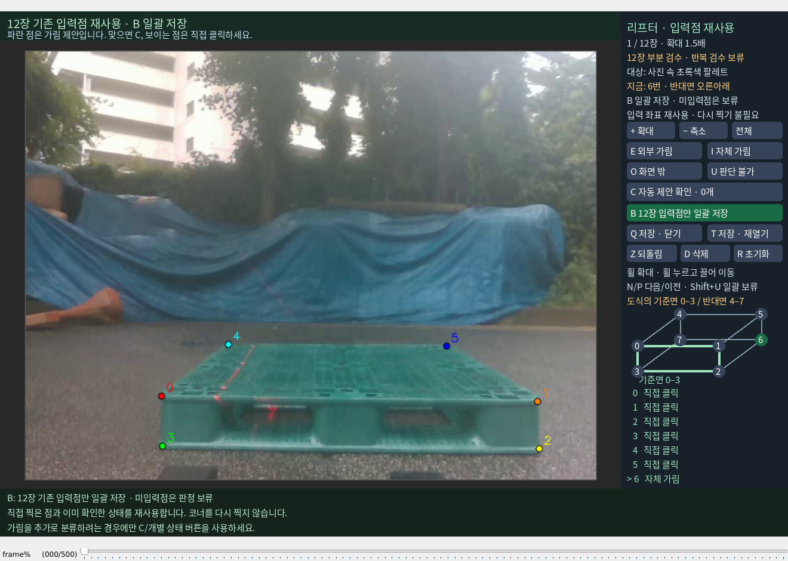

# 기존 입력 재사용: 12장 재분류 요구 제거

사용자는 같은12장을 바로 다시 보는 작업이 중복이라고 지적했다. 기존 직접 클릭67점과 실제 C 확인2상태는 그대로 재사용할 수 있어 다시 클릭하거나 분류하도록 요구하지 않는다. 최신 recovery를 사용해야 마지막1점과 C 확인2개를 잃지 않는다. 기존 PnP proof만 읽으면 직접점66개만 남으므로 원본보다 과거 상태가 된다.

현재 annotation.py adapter의 **B 12장 입력점만 일괄 저장** 버튼은 실제 사람의 저장 확인 및 최초 이력 확인 뒤에만 동작한다. 기존 직접점·확인된 가림은 그대로 유지하고 미입력27상태는 `uncertain`·좌표null·네 가림축False·실제 보류 결정 이유로 기록한다. 외부/자체/화면밖을 자동 추정해 사람 확정으로 만들지 않는다. 미입력 상태의 추가 분류는 선택이며 강제하지 않는다.

CLI가 B·저장 확인·프로필 응답을 대신 입력하지 않았다. 실제 버튼 승인 전에는 기존 초안과 PnP 저장만 있고 승인된 평가 참조는 생성하지 않는다. [입력 감사](INPUT_AUDIT.json)는 실제 버튼 확인 전의67+2/27 상태 기록이며 이후 인간 작업에 따른 최신 값은 메뉴·receipt에서 확인한다.

실제 승인 후 `LIFTER_REFERENCE_REVIEWED.json`과 `EXISTING_CLICKS_APPROVAL_RECEIPT.json`을 만든다. 원PnP12개 파일과 원클릭 이력은 보존하고 별도 evidence archive에 hash를 연결한다. same-person 기존 입력 재사용이며 새로운 독립 반복 결과로 주장하지 않는다. 원래120/24·제외 후115/23의 계획과 미완료분도 유지한다.

평가는 직접 가시 참조만 사용하고 불확정 상태 수를 공개한다. 같은 대상인지 확인하는 버튼 단계는 별도로 필요하다. 독립 물리 T/R 참조는 없으므로 x다.

임시 fixture6개 통과(0.312초), 실제native B/b키의 합성 연결 검증도 통과했다. 취소 시 store·입력 무변경, binding/revision/owner/좌표/확인 도중 자료변경 차단, 직접67·C2유지와27보류, 원PnP hash 불변을 확인했다. 제출 review_time은 확인 후저장 세션에만 해당하는 `post_confirmation_submission_only`이며 원래12장 클릭 시간으로 제시하지 않는다. 신규학습·모델실행·리프터 제어·push·PDF 생성은 없었다. [검증 및 소스 해시](VALIDATION.json)
