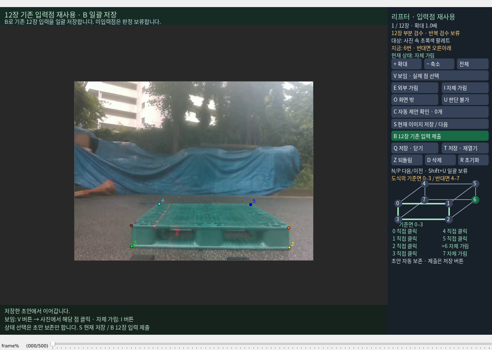

# S 주석 저장의 이력 팝업 제거

이전 변경은 I 등 상태 입력의 팝업만 제거하고 최초 S 제출의 질문은 남겨뒀다. 이번 변경은 일반 S 저장에서 작성 이력 질문을 제거한다. 8개 상태가 모두 있으면 실제 주석을 별도 `*.VISIBILITY_SAVED.json`에 저장하고 다음 이미지로 이동한다. 미입력 상태가 있으면 초안만 보존하며 상태를 만들어 채우지 않는다.

미확인 이력을 실제 사람의 답변으로 바꾸지 않는다. 프로필 없는 저장은 `reviewer=null`, `previous_prediction_exposure=null`, `provenance_status=UNVERIFIED`, `evaluation_use=false`로 저장한다. S 저장 완료와 원고 평가용 참조 승인은 구분한다. B의 평가용 일괄 제출과 기존 고정 평가기의 검증 조건은 유지한다.

저장 목록은 파일 해시·입력 계약·frame ID·pass·이미지 해시·실제 코너 상태를 확인해 재사용한다. 재실행하면 저장한 같은 pass는 건너뛰고, `--revisit-saved`로 수정할 수 있다. 저장 후 코너를 바꾸거나 삭제·되돌림하면 완료 판정을 재사용하지 않는다. recovery가 없더라도 실제 저장 파일에서 좌표와 상태를 복원한다. 원래 JSON·PnP 파일·해시로 잠긴 입력과 평가기는 덮어쓰지 않는다.

68개 임시 시험이 4.356초에 통과했다. 실제 복원 여부를 반환하도록 마지막 수정 후 저장·PnP·실제 main 경로의 집중 시험 21개도 2.531초에 통과했다. 실제 운영 주석에 S나 이력 답변을 CLI로 입력하지 않았다. 이전 대화창은 답변 없이 닫고 T로 다시 열었으며, 모든 recovery 코너·PnP 원본·승인 저장소가 보존됐다. 새 학습·제어·push·PDF 생성은 없다. [검증 및 소스 해시](VALIDATION.json)
