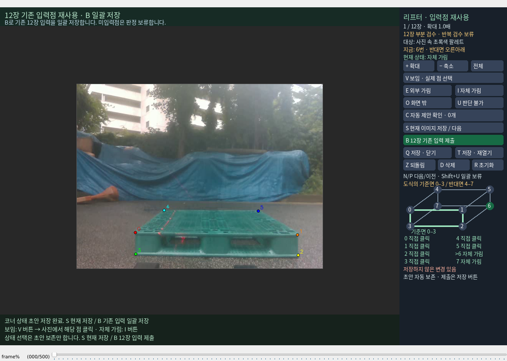

# 리프터 검수 화면 잘림 수정

하단 안내가 전체 합성 이미지 위에 그려져 오른쪽 상태 목록과 안내를 덮었다. 이제 헤더·하단 안내는 왼쪽 이미지 영역의 별도 레이어에서만 그리므로 오른쪽 패널을 덮을 수 없다. 하단 문장은 실제 글자 폭에 맞춰 줄바꿈한다.

오른쪽에는 0–3과 4–7을 두 열로 표시해 8개 상태와 저장 안내를 함께 읽을 수 있다. 패널의 전체 내용 높이를 측정하고, 작은 이미지/창의 경우 패널 위 휠로 끝까지 이동할 수 있다. 실제 화면에 온전히 보이는 버튼만 클릭 대상으로 유지한다. 패널을 스크롤해도 사진 확대·이동과 주석은 바뀌지 않는다. 사진 영역의 휠 확대·중간 버튼 이동 기능은 유지한다.

초기 창 크기는 현재 데스크톱 작업 영역을 확인해 제한한다. 마우스 좌표는 기존 annotation.py의 변환을 유지하며, 안내 바 뒤에 가려진 이미지에는 점을 입력하지 않는다. 공용 `scripts/annotate/annotate.py`는 수정하지 않았다.

현재 174925:1892의 직접 클릭 6개와 자체 가림 6·7, 확대 1.0배를 유지해 T로 다시 열었다. 재시작 전후 모든 recovery 코너, PNP_ASSISTED 원본 해시, 승인 저장소 해시가 동일하다. 사람의 판정·저장 확인·작성 이력 답변을 CLI가 대신 입력하지 않았다.

임시 fixture의 56개 시험이 4.469초에 통과했다. 실제 픽셀 기준으로 오른쪽 패널이 하단 안내에 덮이지 않는지, 720/880 높이에서 네 가지 모드의 CJK 글자와 클릭 영역이 잘리지 않는지, 410 높이에서 스크롤 후 7번 선택이 작동하는지 검증했다. 작은 데스크톱에서 초기 창 크기도 확인했다. 신규 학습·리프터 제어·push·PDF 생성은 없다. [검증 및 소스 해시](VALIDATION.json)
