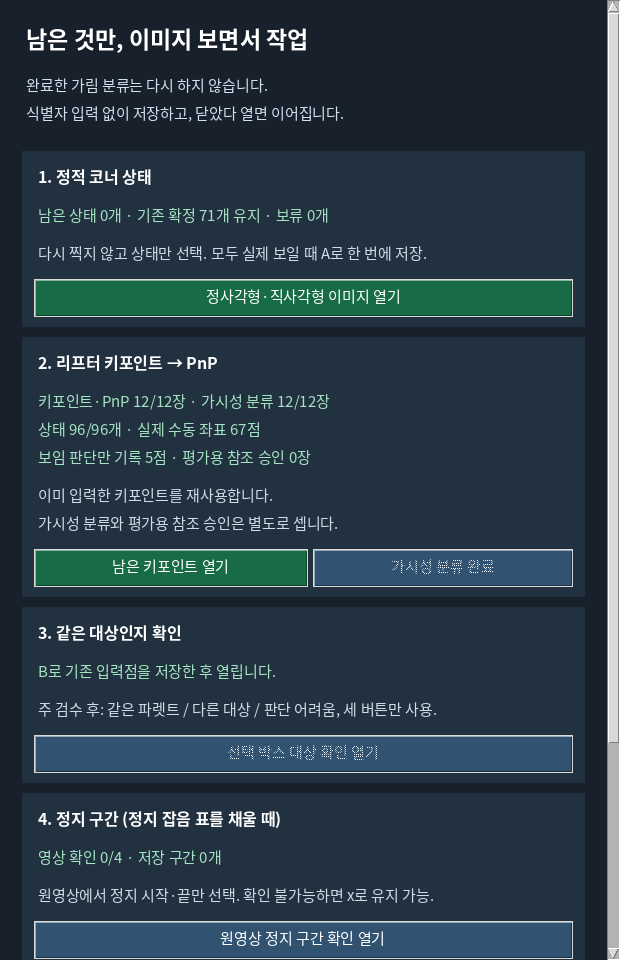

# 부분 12장 가시성 분류 완료

**사용자가 남은 5점 모두 보임(V)이라고 답한 내용을 반영해, 부분 12장·96개의 가시성 분류를 완료했습니다. 같은 5점을 다시 분류하거나 클릭하도록 요구하지 않습니다.**

이번 단계는 가시성 분류였으나 도구가 보임을 좌표 재입력과 묶어 저장을 막았습니다. 실제 수동 좌표가 없는 점은 보임 판단을 별도로 저장하고, 분류 완료와 좌표 참조 완료를 구분하도록 작업 목록·진행 화면을 수정했습니다.

| 항목 | 확인값 |
|---|---:|
| 선택된 부분 표본 | 12장 |
| 가시성 분류가 완료된 프레임 | 12/12장 |
| 분류가 완료된 코너 상태 | 96/96개 |
| 직접 보임 | 72점 |
| 자체 가림 | 24점 |
| 외부 가림 / 화면 밖 / 판단 보류 / 미분류 | 0 / 0 / 0 / 0점 |
| 실제 수동 클릭 좌표 | 67점 |
| 사용자가 보임이라고 답했으며 좌표는 없는 점 | 5점 |
| 기존 실제 S 저장 파일 | 4장 |
| 공식 평가용 참조 승인 | 0장 |

처리 대상은 기존 5점으로 고정했습니다: `174126:13`의 3번, `174126:419`, `174342:1190`, `174925:32`, `174925:1002`의 5번입니다. 기존 67개 수동 좌표와 24개 가림 입력은 유지했습니다. 마지막 사용자 답변의 원문과 적용 범위를 [별도 보임 선언](../../../../../data/pallet/results/pallet_lifter_case_review_20261003_v1/review/USER_VISIBILITY_DECLARATIONS_20261005_V1.json)에 저장했습니다.

5점은 `human_chat_visibility_declaration`으로 표시하고 `x/y=null`, `coordinate_source=none`으로 보존합니다. CLI가 이미지를 판단한 결과, 실제 GUI 클릭·S 키 입력, 수동 좌표 정답으로 기록하지 않습니다. 해당 5점의 PnP 투영 좌표를 수동 정답으로 복사하지 않았습니다.

각 점의 기존 미입력 내용 해시, 프레임·코너 번호, 고정 계약과 원래 12장 목록, 5장 작업 목록 해시를 연결했습니다. 이후 실제 클릭이나 상태 수정이 있으면 새 실제 입력을 우선하며, 오래된 선언으로 변경·삭제된 상태를 다시 완료 처리하지 않습니다.

**가시성 분류 완료와 논문 평가용 참조 승인은 구분합니다.** 작성 이력 확인은 여전히 `UNVERIFIED`, 평가용 사용은 `false`입니다. 독립 물리 T/R 참조는 없으므로 이동·회전 정확도는 `x`로 유지합니다. 원래 주 115장·반복 23장 계획도 유지합니다. 이 기록은 선택된 부분 12장의 분류 완료를 뜻합니다.

[집계와 프레임별 출처](STATUS.json), [검증 기록](VALIDATION.json)에 수치와 원시 파일 SHA-256을 연결했습니다. 새 학습·모델 추론·PDF 생성·리프터 제어·push·외부 업로드는 실행하지 않았습니다.

## 검증

관련 67개 테스트가 1.693초에 통과했습니다. 새 검증은 임시 합성 자료로만 수행했습니다. 실제 사용자 자료에는 채팅 답변을 별도 기록했으며 실제 클릭이나 버튼 행동을 만들지 않았습니다.

```bash
cd scripts/research/pallet_lifter_case_review_20261003_v1
/home/minjae/anaconda3/envs/pallet-yolo26/bin/python -m unittest \
  test_visibility_only_status test_remaining_corner_queue test_native_review_batch \
  test_native_review_layout test_save_without_profile \
  test_visibility_reset_preserves_points test_select_visible_corner
```

실제 준비 CLI에서 남은 5장 목록의 `sessions=[]`, 가시성 완료 `5/5`, 메뉴의 분류 완료 `12/12`, 상태 수 `96/96`, 수동 좌표 67점, 좌표 없는 보임 판단 5점을 확인했습니다. 고정 검증기의 승인 조건과 원래 `annotation.py`는 유지했습니다.


