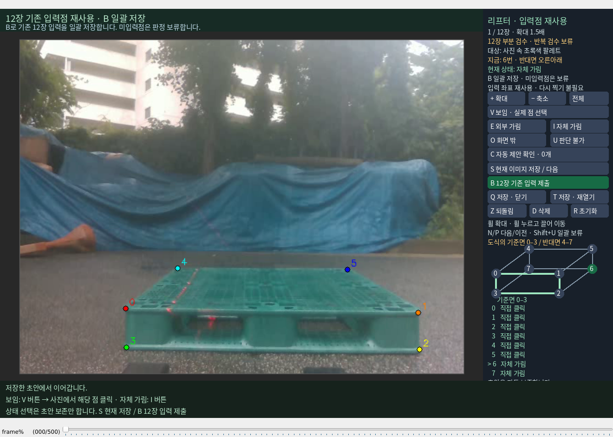

# 코너 상태 선택과 제출 분리

마지막 코너의 상태를 입력하면 S 제출 키를 자동 실행하던 연결 때문에 I 자체 가림 선택 뒤에도 작성 이력 창이 표시됐다. 이제 클릭·I/E/O/U·C는 초안을 보존하고, 제출은 사람이 S 또는 B를 직접 선택했을 때만 한다. 기존 `scripts/annotate/annotate.py`는 수정하지 않고 리프터 adapter만 고쳤다.

현재 열린 `174925:1892`는 실제 클릭 0–5와 이미 확인한 자체 가림 6·7을 그대로 불러왔다. 같은 판단이면 추가 분류나 재클릭이 필요 없다. 오른쪽에 선택한 점의 현재 상태와 0–7 전체 상태를 표시한다.

- **V 보임 · 실제 점 선택:** 기존 실제 수동점이 있으면 복원한다. 없으면 사진의 해당 실제 코너를 클릭하도록 기다린다. PnP 생성점을 직접 보이는 정답으로 승격하지 않는다.
- **I 자체 가림:** 선택한 코너를 자체 가림으로 기록한다. 작성 이력 창을 열지 않는다.
- **S 현재 이미지 저장 / 다음:** 현재 이미지의 완성된 상태를 제출한다. 미입력 상태가 있으면 초안만 보존한다.
- **B 12장 기존 입력 제출:** 기존 실제 클릭과 확정 상태를 재사용하고 미입력 상태는 실제 사용자 확인 후 보류한다. 새로운 독립 반복 검수가 아니다.

작성 이력은 가림 상태와 별개다. 평가할 Base/N3 예측을 미리 본 주석인지 구별하기 위한 기록이다. 현재 12장처럼 실제 PnP 도움과 기존 수동점 표시가 기록으로 확인되는 경우 두 이력은 출처와 함께 자동 기록한다. 처음 명시적 제출할 때 기록으로 알 수 없는 **Base/N3 예측을 전에 봤는지**만 실제 사람에게 한 번 묻는다. 본인 수동점으로 만든 PnP 선은 이 질문의 모델 예측에 포함하지 않는다. 프레임 번호나 이름 입력은 없다. 기억나지 않거나 닫으면 초안만 유지한다.

실제 창의 이전 이력 대화창은 답변 없이 닫고 T로 초안을 보존해 다시 열었다. 모든 recovery 코너와 원래 PNP_ASSISTED 파일의 SHA-256이 재시작 전후 동일하다. CLI는 코너 판정·B 제출·이력 답변을 대신 입력하지 않았다. 확인 시점의 작성 이력 파일은 없으며, 사람 승인 완료라고 기록하지 않았다.

임시 fixture에서 51개 시험이 3.412초에 통과했다. 마지막 점의 I가 제출하지 않는지, V가 실제 수동점만 사용하는지, 제출 취소와 미답변이 승인 기록을 만들지 않는지 검증했다. [검증 및 소스 해시](VALIDATION.json)
