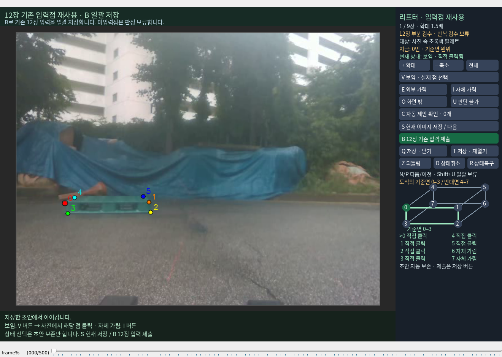

# 가시성 검수의 R/D 키포인트 보존

가시성 검수에서도 R이 원래 키포인트 입력기의 전체 초기화를 호출해 실제 클릭을 삭제했다. 이제 `--visibility-only`의 R은 좌표를 보존하며 마지막 불러오기/저장 기준으로 상태 변경을 복구한다. D도 선택한 상태를 취소하는 동작으로 분리했다. 초기 키포인트·PnP 입력 단계의 원래 R/D는 유지한다.

상태 복구에 사용하는 좌표는 같은 frame/pass의 실제 수동 코너 기록뿐이다. 마지막 저장 이후 직접 추가하거나 수정한 실제 점도 유지한다. PnP 생성 좌표는 수동 정답으로 승격하지 않는다. S 이후 기준과 이력 범위를 갱신해 저장된 가림 판정을 과거 보임 판정으로 되살리지 않는다. Z로 R을 되돌릴 수 있으며 이 동작은 프로필이나 평가 제출을 실행하지 않는다.

실제 손상된 초안은 `173507:3655|primary`였다. 삭제 직전 `173507_03655.VISIBILITY_SAVED.json`의 파일 해시·입력 계약·이미지·pass와 PNP 원본의 실제 수동 좌표를 검산했다. 이를 사용해 **0–5 실제 클릭 6개와 6·7 자체 가림 상태**만 복원하고 원래 삭제 이력과 기존 노출 기록을 보존했다. 복구는 새로운 사람 판정으로 기록하지 않았다. 원래 saved/PnP 파일과 다른 프레임 초안은 그대로다. 별도 백업과 `review/reset_bug_repair_20261005_v1/REPAIR_RECEIPT.json`에 출처를 남겼다.

복구한 프레임을 확인하도록 한 번 열고, 나머지 이미 저장한 프레임은 다시 요구하지 않는다. 현재 부분12장 중 일반 주석 저장4장, 평가용 승인0장이며 전체115장 검수 완료를 주장하지 않는다.

임시 fixture 78개 시험이 4.529초에 통과했다. 좌표 보존·저장 기준 갱신·새 수동점 유지·다른 frame/pass 배제·PnP 좌표 승격 방지·undo·저장·화면 잘림을 검증했다. 실제 GUI에는 Q로 초안을 보존해 닫고 다시 여는 조작만 했다. R/D/새 코너 판정이나 이력 답변을 CLI가 대신 입력하지 않았다. 학습·리프터 제어·push·PDF 생성은 없다. [검증 및 소스 해시](VALIDATION.json)
