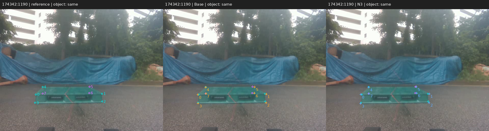
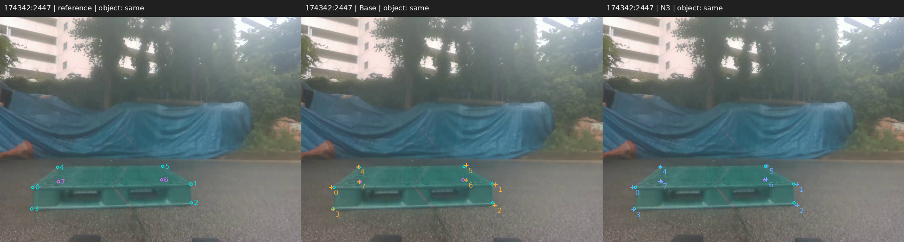
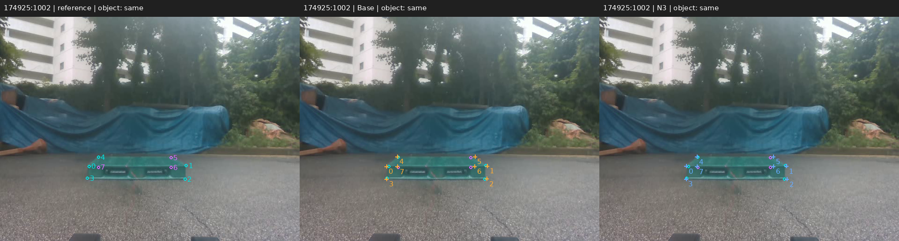

# 리프터 기존 PnP 주석 연결 결과

**이번 12장 대상 확인은 완료했습니다. 점을 더 찍거나 같은 사진을 다시 확인할 필요가 없습니다.**

기존에 직접 점을 찍고 PnP가 맞는지 확인한 뒤 G로 저장했던 8코너 전체를 참조로 사용했습니다. 네 촬영 세션에서 고정한 12장, 총 96점입니다. 사람의 실제 저장 기록은 12장 모두 같은 파렛트였으며, Base와 N3는 같은 대상과 같은 코너 결측 마스크를 유지했습니다.

| 지표 | Base | N3 | 변화 |
|---|---:|---:|---|
| 코너 오차 중앙값(px) | 3.974 | 4.184 | +0.210 px |
| 코너 오차 P90(px) | 9.643 | 8.977 | -0.666 px |
| 오차 10px 이내(전체 96점) | 88/96 (91.667%) | 91/96 (94.792%) | +3.125 %p |
| 결측·대상 불일치 점 | 0 | 0 | 전체 분모 유지 |

결과는 혼합되어 있습니다. N3는 큰 오차 쪽의 P90과 10픽셀 이내 비율을 개선했지만 중앙 오차는 조금 커졌습니다. 전반적인 리프터 정확도 향상이 입증됐다고 쓰지 않습니다.

점별로는 46점 개선, 50점 악화이며, 프레임 중앙값은 5장 개선·7장 악화입니다. 중앙값의 차이는 +0.209650px, 점별 차이의 중앙값은 +0.089809px로 서로 다른 통계입니다.

## 원고와 근거

별도 원고 복사본의 LaTeX와 Markdown에 이번 표·설명을 실제 반영했고, 이전 복사본과의 patch를 만들었습니다.

- [수치와 출처 JSON](RESULT.json)
- [96점별 실제 오차 CSV](POINT_ERRORS.csv)
- [12장별 결과 JSON](FRAME_RESULTS.json)
- [실행 상태와 실제 계산 비용](EVALUATION_STATUS.json)
- [평가기 검증 기록](TEST_VALIDATION.json)

- [수정 원고 Markdown](paper_updated/manuscript_ko.md)
- [보충 자료 Markdown](paper_updated/supplement_ko.md)
- [본문 LaTeX 수정](paper_updated/sections/06_case_study.tex)
- [원고 변경 patch](paper_patch/ASSISTED_PAPER.patch)
- [원고 반영 및 원본 보존 검산](PAPER_INTEGRATION_RECEIPT.json)

이 패널은 YOLO 고정 Base와 N3 seed 1을 비교한 소규모 기하 참조 평가입니다. 정적 319장·세 기반·세 seed 결과와 분모를 섞지 않았습니다. 저장된 원본 66개 직접 입력점과 PnP 보완 30점을 모두 그대로 사용했고, 이후 추가 수동 입력 72점 버전으로 참조를 바꾸지 않았습니다.

원래 120장/반복 24장 계획의 가시 코너 표와 이번 96점 표는 별개입니다. 독립 실측 위치·회전 및 사람이 확인한 정지 구간은 없으므로 해당 물리 정확도·정지 잡음은 x로 남습니다. 이 값을 채우기 위해 현재 입력을 다시 하라는 뜻은 아닙니다.

저장 시 실제 답변에는 이전 예측을 보지 않았다는 기록이 있습니다. 최초 G 주석 작성 시점의 독립적인 노출 기록은 없으므로 블라인드 참조라는 주장은 하지 않습니다. 이번 노란 선택 네모를 본 이력은 현재 대상 확인 기록으로 분리했습니다.

새 학습·optimizer update·새 모델 추론·실제 장비 제어는 0회입니다. 기존 8,910프레임 출력에서 해당 12장만 재집계했습니다. 원본과 이전 결과를 보존했고 PDF 생성·push는 하지 않았습니다.

## 고정 12장 전체 비교

왼쪽은 기존 G 저장 참조, 가운데는 Base, 오른쪽은 N3입니다. 원은 참조, 십자는 모델 예측입니다. 모든 12장을 표시했습니다.

### 173507:56

이 사진의 코너 중앙값: 3.577 → 2.538px.

### 173507:1652

이 사진의 코너 중앙값: 3.365 → 3.916px.

### 173507:3655

이 사진의 코너 중앙값: 8.357 → 8.222px.

### 174126:13

이 사진의 코너 중앙값: 4.562 → 5.752px.

### 174126:419

이 사진의 코너 중앙값: 5.137 → 5.301px.

### 174126:744

이 사진의 코너 중앙값: 3.685 → 4.484px.

### 174342:41

이 사진의 코너 중앙값: 3.214 → 3.352px.

### 174342:1190

이 사진의 코너 중앙값: 4.705 → 4.229px.

### 174342:2447

이 사진의 코너 중앙값: 5.503 → 3.836px.

### 174925:32

이 사진의 코너 중앙값: 3.242 → 3.850px.

### 174925:1002

이 사진의 코너 중앙값: 3.685 → 3.447px.

### 174925:1892

이 사진의 코너 중앙값: 6.088 → 6.511px.

