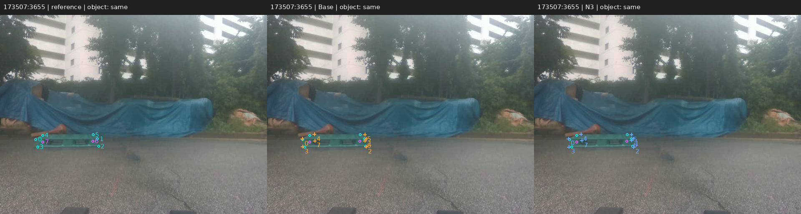
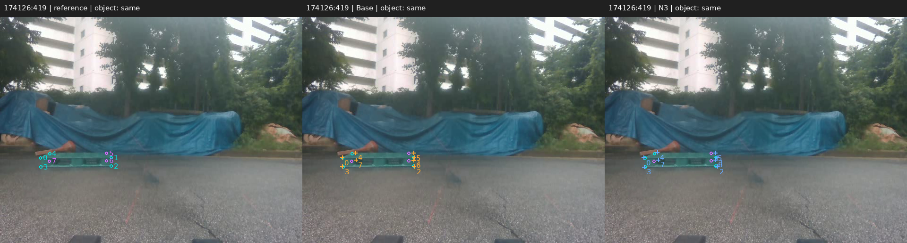
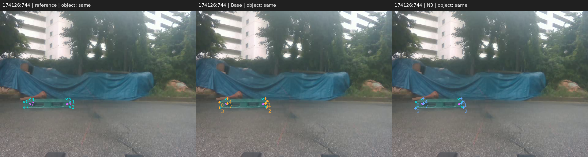
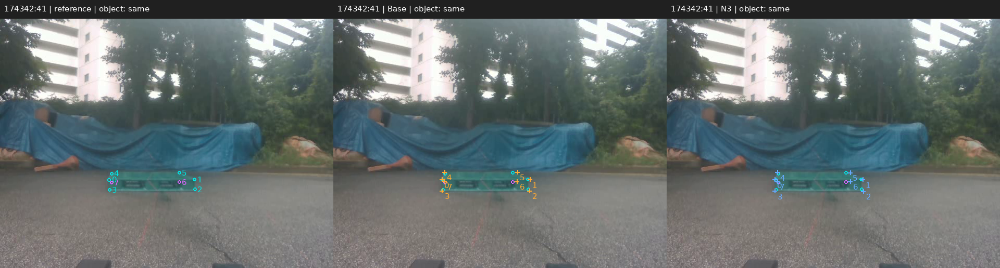
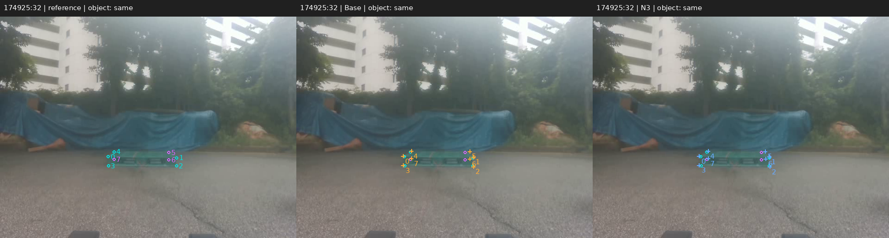
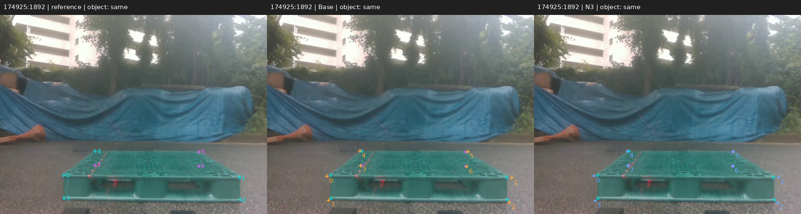

# 보충자료 읽기용 변환본

> 실제 수정 supplement.tex의 표와 설명입니다. PDF는 생성하지 않았습니다.

# 기반 추정기와 추가 보정 설정

표~`sup:backbone_contract`는 기반별 특징 채널·간격과 학습 대상을 정리한다. 모든 N3가 같은 물리적 치수 특징과 회전 대응 감독을 사용하지만 내부 특징 연결층과 보정 가중치는 별도로 학습한다. ResNet은 치수 문맥을 영벡터로 고정해 10 epoch 학습한 CONSTANT의 고정 특징 변환을 마지막 합성곱에 합친 RGB 모델이다. 별도 실제 치수 입력 FULL 모델을 본문의 Base로 사용하지 않았다.

**세 기반 추정기에 적용한 동일 N3 계약과 실행 상태. 초기 추정기와 치수를 받는 보정기를 구분한다.** (`sup:backbone_contract`)

|항목|YOLO26n|DOPE / VGG|ResNet-18 10-epoch RGB 변형|
|---|---|---|---|
|기본 신경망 입력|RGB만|RGB만|RGB만|
|연결부 특징 채널 / 간격|(64,128) / (8,16)|(256,128) / (4,8)|(128,256) / (8,16)|
|N3 시각 정보|해당 특징·초기 코너·박스|해당 특징·초기 코너·박스|해당 특징·초기 코너·박스|
|N3 물리적 치수|가로·깊이·높이 사용|가로·깊이·높이 사용|가로·깊이·높이 사용|
|N3 학습 감독|전체 순열 선택 + 분포 손실|전체 순열 선택 + 분포 손실|전체 순열 선택 + 분포 손실|
|보정 전후 PnP 정보|동일 카메라·치수|동일 카메라·치수|동일 카메라·치수|
|학습하는 대상|연결부의 학습층·N3 헤드|기반별 연결 학습층·N3 헤드|기반별 연결 학습층·N3 헤드|
|N3 학습·평가 완료|3 seed|3 seed|3 seed|

기본 신경망은 RGB만 사용한다. ResNet은 10-epoch 합성 CONSTANT 가중치의 고정 변환을 접은 RGB 모델이며  기반별 디코더·박스·점수 정의와 초기 학습 이력은 서로 다르므로 보정 전후 효과와 기본 추정기 사이의 절대 순위를 구분한다.

# 상세 자세와 정규화 영상 오차

표~`sup:pose`는 위치·전체 회전·방향각의 중앙값과 P90, 3차원 상자 겹침 및 전체 실패를 포함한 AUC를 보존한다. 방향각과 전체 회전은 다른 물리량이다. 3차원 IoU는 방향을 고려한 상자의 교집합/합집합 비율이다. $\mathrm{ADD}_{\rm sym}$은 8코너에 객체 전체 회전 동등성을 적용한 평균 3차원 거리이며, 자유로운 최근접 표면 대응인 ADD-S와 다르다. AUC는 객체 대각선으로 정규화한 오차의 0--0.1 임계 범위에서 적분·정규화한다. 자세 실패는 전체 영상 분모에 유지한다.

**동일 319장의 기하 재구성 참조에 대한 YOLO 계열 자세 평가. N0/N1의 각 구성의 동일 자세 계산 결과이다.** (`sup:pose`)

|방법|이동(cm)  중앙값 / P90|회전(도)  중앙값 / P90|방향각(도)  중앙값 / P90|$\mathrm{IoU}_{3D}$|$\mathrm{ADD}_{sym}$ AUC|자세 산출|
|---|---|---|---|---|---|---|
|Base|7.897 / 40.530|2.539 / 86.527|1.316 / 86.240|0.5943|0.3766|319/319|
|P|7.153 / 38.664|2.154 / 85.987|1.151 / 85.824|0.6367|0.4080|319/319|
|N0|7.260 / 38.391|2.176 / 85.973|1.173 / 85.801|0.6388|0.4083|319/319|
|N1|7.274 / 39.128|2.183 / 85.989|1.129 / 85.851|0.6364|0.4082|319/319|
|N2|7.011 / 38.108|2.090 / 85.819|1.142 / 85.611|0.6335|0.4126|319/319|
|N3|7.068 / 37.809|2.070 / 85.919|1.134 / 85.670|0.6309|0.4122|319/319|

학습한 방법은 세 seed별 통계의 평균이다. P는 과거 국소 보정, N0는 통제 재현 구성으로 서로 다른 가중치이다. 자세 산출은 정답 성공이 아니며, 모든 실패는 전체 AUC 분모에 남긴다. 이 참조는 독립 물리 계측이 아니다.

추가 영상 지표 $E_{\rm sym}$은 영상별 평균 코너 오차를 해당 영상 대각선으로 나눈 뒤 영상 간 평균한 값이다. 결측·매칭 실패에는 영상 대각선 길이의 벌점을 적용한다. 이 프로젝트 정의를 표준 BOP 지표와 동일시하지 않는다. 표~`sup:esym`은 원래 정의와 수치를 보존하지만 본문의 주요 결론은 코너 오차·PCK10·자세 오차·실패율에 근거한다. N2−N3에서 약 $2.8\times10^{-6}$의 차이만으로 회전 대응 감독의 유효성을 주장하지 않는다.

**동일 319장·8코너 규약의 통제 절제 결과. 정규화 영상 오차를 포함한 수치이다.** (`sup:esym`)

|구성|중앙값(px)|P90(px)|PCK10(%)|$E_{\rm sym}$|
|---|---|---|---|---|
|N0|5.944|42.872|67.534|0.048683|
|N1|5.921|42.513|67.560|0.048674|
|N2|5.778|42.459|68.587|0.048422|
|N3|5.778|42.134|68.587|0.048419|

N0: 국소 보정, N1: 대칭만, N2: 치수만, N3: 치수와 대칭. 세 seed 통계의 평균이며, 자세 결과는 표~`sup:pose`에 함께 제시한다. 추가 파라미터와 치수 내용 자체의 효과가 완전히 분리된 것은 아니다.

# 재질과 정사각형 평가의 전체 행

표~`sup:type_results`는 플라스틱 194장과 목재 125장에서 Base·P·N2·N3의 전후 결과이다. 재질에 따른 서로 다른 시점·가림 구성은 통제되지 않았으므로 재질의 인과 효과로 해석하지 않는다. 최신 사람 입력 등급은 목재를 포함하되 판정 기준은 미확인이고 집단 크기도 불균형하다. 재질별 전체 결과는 기존194/125장 분모로 유지한다.

**기존 직사각형의 재질별 보정 효과. 각 재질 안에서 같은 영상·참조의 전후를 비교한다.** (`sup:type_results`)

|집단|방법|영상|코너  참조/유효 예측|중앙값(px)|P90(px)|PCK10(%)|이동(cm)|회전(도)|
|---|---|---|---|---|---|---|---|---|
|직사각형 / 플라스틱|Base|194|1513/1459|7.509|43.637|60.079|10.472|2.450|
||P|194|1513/1459|6.397|42.254|64.596|9.703|2.099|
||N2|194|1513/1459|6.216|41.995|65.719|9.259|2.045|
||N3|194|1513/1459|6.203|41.703|65.675|9.363|2.017|
|직사각형 / 목재|Base|125|986/986|6.124|45.540|68.560|4.204|2.650|
||P|125|986/986|5.371|45.850|71.941|3.850|2.331|
||N2|125|986/986|5.243|44.473|72.989|3.805|2.194|
||N3|125|986/986|5.274|44.865|73.056|3.739|2.202|

플라스틱 194장과 목재 125장의 합은 319장이다. 중앙 코너 오차·P90은 매칭된 유효 코너, PCK10은 전체 참조 코너 분모를 사용한다. 이동·회전은 중앙값이다. 서로 다른 재질의 난도를 동일하다고 가정하지 않는다.

표~`sup:square_results`는 영상 보정 P를 포함한 정사각형 전체 행이다. 두 모드는 같은 119장의 전체 수동 참조 602점과 영상 내부 600점으로, 화면 밖 좌표 2개 포함 여부만 다르다. 전자는 가능한 952개 코너 자리 전체가 아니라 실제 수동 참조가 존재하는 부분이며, 참조가 없는 350자리를 가시·비가시로 임의 지정하지 않았다. 독립 자세 참조가 없어 위치·회전은 x이다. 한 세션으로 세션 간 일반화의 신뢰구간을 얻었다고 주장하지 않는다.

**정사각형119장의 동일 고정 예측을602/600점 참조 모드로 각각 평가.** (`sup:square_results`)

|기반|방법|중앙값(px)|P90(px)|PCK10(%)|유효|참조|위치(cm)|회전(도)|
|---|---|---|---|---|---|---|---|---|
|**(a) 전체수동 참조602점**|||||||||
|YOLO|Base|5.526|11.439|85.216|597|602|x|x|
|YOLO|P|4.991|10.088|89.037|597|602|x|x|
|YOLO|N2|4.949|9.882|89.590|597|602|x|x|
|YOLO|N3|5.004|9.932|89.258|597|602|x|x|
|DOPE|Base|11.748|30.226|36.711|549|602|x|x|
|DOPE|N3|7.037|28.244|64.618|549|602|x|x|
|ResNet-18|Base|6.584|17.073|72.425|592|602|x|x|
|ResNet-18|N3|5.891|15.872|78.350|592|602|x|x|
|**(b) 영상내 참조600점**|||||||||
|YOLO|Base|5.521|11.473|85.333|595|600|x|x|
|YOLO|P|4.975|10.096|89.056|595|600|x|x|
|YOLO|N2|4.940|9.867|89.667|595|600|x|x|
|YOLO|N3|4.980|9.919|89.333|595|600|x|x|
|DOPE|Base|11.748|30.226|36.833|549|600|x|x|
|DOPE|N3|7.037|28.244|64.833|549|600|x|x|
|ResNet-18|Base|6.595|17.078|72.333|590|600|x|x|
|ResNet-18|N3|5.898|15.891|78.278|590|600|x|x|

한 촬영세션·등록 치수[1.1,1.1,0.15]m. N3는 세seed 통계의 평균이며 앙상블이 아니다. 두 모드는 화면 밖 참조2점 포함 여부만 다르며 분모를 혼합하지 않는다. 독립6D 참조 부재로 위치·회전은x, 세션간 구간은NA다. N3대Base와 N3대N2는 별도 비교다. ResNet은10-epoch CONSTANT-fold RGB 기준 모델이다.

# 가림과 코너 가시성의 상세 결과

표~`sup:occlusion_results`는 사람 입력 등급(기준 미확인)에 따른 세 기반의 Base와N3 쌍이다. 없음153장·중간92장·어려움74장의 사후 집단만 갱신했으며 전체319장의 원래 코너·자세·실패 통계는 유지했다. 조건부 코너·자세 오차와 전체 참조·자세 산출 분모를 함께 보고한다. YOLO의 P·N2 전체 행, 각seed 및 과거 외부 가림128장의 원시 레이블과 결과는 별도CSV·분석 조각에 보존한다.

**세 기반의 사람 입력 등급(기준 미확인)별 Base $\to$ N3 보조 결과.** (`sup:occlusion_results`)

|기반|등급|영상|중앙값(px)|P90(px)|PCK10(%)|위치(cm)|회전(도)|참조/유효|자세 산출|
|---|---|---|---|---|---|---|---|---|---|
|YOLO|없음|153|5.275 $\to$ 4.547|18.965 $\to$ 15.301|74.223 $\to$ 80.742|4.668 $\to$ 4.361|1.716 $\to$ 1.503|1,222/1,222|153 $\to$ 153|
|YOLO|중간|92|7.603 $\to$ 6.256|103.611 $\to$ 102.597|61.905 $\to$ 66.527|7.851 $\to$ 6.124|1.999 $\to$ 1.841|714/714|92 $\to$ 92|
|YOLO|어려움|74|11.045 $\to$ 10.117|55.149 $\to$ 55.929|41.918 $\to$ 44.819|16.047 $\to$ 17.481|46.101 $\to$ 26.483|563/509|74 $\to$ 74|
|DOPE|없음|153|11.736 $\to$ 6.667|27.086 $\to$ 24.059|34.043 $\to$ 61.948|8.122 $\to$ 5.725|2.835 $\to$ 2.252|1,222/1,109|131 $\to$ 131|
|DOPE|중간|92|13.750 $\to$ 9.028|91.896 $\to$ 94.378|17.087 $\to$ 33.427|15.499 $\to$ 16.867|9.218 $\to$ 8.936|714/442|51 $\to$ 51|
|DOPE|어려움|74|15.980 $\to$ 11.135|87.432 $\to$ 87.861|11.723 $\to$ 19.953|14.327 $\to$ 16.818|8.759 $\to$ 7.728|563/246|28 $\to$ 28|
|ResNet-18|없음|153|6.462 $\to$ 5.280|23.787 $\to$ 22.460|68.985 $\to$ 74.932|4.951 $\to$ 4.580|2.626 $\to$ 2.164|1,222/1,214|153 $\to$ 153|
|ResNet-18|중간|92|11.086 $\to$ 9.678|134.893 $\to$ 136.823|42.577 $\to$ 46.499|12.373 $\to$ 12.246|4.908 $\to$ 4.611|714/652|92 $\to$ 92|
|ResNet-18|어려움|74|14.970 $\to$ 13.309|72.755 $\to$ 73.555|28.242 $\to$ 32.386|33.668 $\to$ 34.043|51.270 $\to$ 54.608|563/425|74 $\to$ 74|

각 쌍은 Base와N3의 통계이며 N3는 세seed 통계 평균이다. 중앙값·P90은 유효예측 또는 산출자세의 조건부 통계이다. PCK는 전체참조, 자세 산출수는 영상 분모를 유지한다. 참조/유효 코너 수는 두방법이 같다. 판정 기준 미확인인 사후집단으로 외부 가림 복원에 대한 독립확증이 아니다. DOPE와ResNet의 위치·회전 악화도 그대로 표시한다. YOLO의 P·N2 및 각seed 상세는 별도CSV·TeX 조각으로 보존한다.

표~`sup:visibility`는 잠금71점과 새3030개 상태를 중복 없이 연결한 직사각형2499점의 가시성별 결과이다. 원래 참조 좌표를 유지했고, 없는 좌표를 생성하거나 기계 제안을 사람 승인으로 승격하지 않았다. 정사각형602/600점 모드와 모든 기반의 상세 행은 동봉 CSV·JSON에 별도 보존한다. 노출 이력과 참조 생성 경로의 제한 때문에 독립 블라인드 가림 복원 정확도를 주장하지 않는다.

**최신 사람 가시성 상태에 따른 YOLO Base와 N3 보조 분석. 원래2499개 참조 좌표를 유지한다.** (`sup:visibility`)

|상태|방법|참조/유효 예측 코너|중앙값(px)|P90(px)|PCK10(%)|
|---|---|---|---|---|---|
|직접 가시|Base|1,776/1,759|5.829|25.761|70.946|
|직접 가시|N3|1,776/1,759|4.975|23.571|77.646|
|외부 가림|Base|218/195|19.485|80.896|27.523|
|외부 가림|N3|218/195|18.269|81.568|25.688|
|자체 가림|Base|462/448|8.874|41.132|53.247|
|자체 가림|N3|462/448|8.143|38.356|55.988|
|화면 밖|Base|43/43|12.159|224.325|44.186|
|화면 밖|N3|43/43|10.864|223.509|47.287|

직접 가시1776·외부 가림218·자체 가림462·화면 밖43점으로 합계2499점이다. 결측·객체 매칭 실패는 전체 참조 PCK 분모에 유지했다. 조건부 중앙값·P90와 전체 분모를 구분한다. 기존 잠금 상태71점은 덮어쓰지 않았고, 가시성 상태를 입력해도 원래 참조 생성 경로가 바뀌지는 않는다. P·N2 및 DOPE·ResNet·정사각형 두 모드의 모든 행은 별도CSV에 보존한다.

# 큰 오류·손상·복구의 모든 집계

표~`sup:tail`은 본문에서 축약한 이동 상한 안팎의 개선·무차이·악화 개수를 보존한다. seed 1·2·3 각각의 개수이며 평균 개수를 실제 정수 표본처럼 표시하지 않는다. 유효 평가 코너는 2,445개, 공동 자세 변화의 영상은 311장이다. 초기의 전체 참조 대응을 고정하고 같은 코너의 오차를 비교한다. 큰 오류를 줄이는 것과 10픽셀 미만으로 복구하는 것은 다른 관측이다.

**동일 참조 대응을 고정한 큰 오류·손상·복구 분석. 각 칸은 seed 1 / 2 / 3의 실제 개수이다.** (`sup:tail`)

|진단 항목|Base → P|Base → N3|
|---|---|---|
|초기 오차가 이동 한계 이내|1,464 / 1,464 / 1,464|1,464 / 1,464 / 1,464|
|초기 오차가 이동 한계 밖|981 / 981 / 981|981 / 981 / 981|
|한계 안: 개선|882 / 886 / 883|954 / 936 / 908|
|한계 안: 무차이|0 / 0 / 0|0 / 0 / 0|
|한계 안: 악화|582 / 578 / 581|510 / 528 / 556|
|한계 밖: 개선|686 / 668 / 690|720 / 716 / 725|
|한계 밖: 무차이|0 / 0 / 0|0 / 0 / 0|
|한계 밖: 악화|295 / 313 / 291|261 / 265 / 256|
|양호($<5$px)$\to$악화($>10$px)|0 / 1 / 0|0 / 0 / 1|
|큰 오차($>20$px)$\to$복구($<10$px)|0 / 0 / 0|0 / 2 / 0|
|2D·이동·회전 모두 개선 (영상)|114 / 113 / 112|126 / 129 / 124|
|2D 개선, 이동 또는 회전 악화 (영상)|138 / 140 / 138|147 / 129 / 141|

보정 범위는 원본 영상 대각선의 1%이다. 코너 집계는 2,445점, 공동 변화 분석은 매칭된 311장이다. 마지막 두 행만 영상 수이고 그 위는 코너 수이다. 대칭 평가의 최적 대응 변경으로 이동 한계의 기하적 하한을 바꾸지 않았다. 무차이·악화·복구 없음도 그대로 보고한다.

# 세션 구간과 seed 편차

표~`sup:pose_uncertainty`의 변화는 통계량(N3)−통계량(Base)이며 프레임별 차이의 중앙값이 아니다. 13세션을 단위로 동일한 10,000개 재표집을 만들고 각 재표집 안에서 세 seed의 통계 차이를 평균한다. 2.5·97.5백분위 구간과 seed 표준편차·최솟값·최댓값을 함께 제시한다. P90에서 악화하거나 0을 포함하는 구간도 보존한다. 이 구간은 반복 개발자료의 사후 분석으로 선택 편향·다중비교를 모두 보정한 독립 확증이 아니다.

**N3−Base 자세 통계 차이의 사후 불확실성. 음의 차이는 오차 감소를 뜻한다.** (`sup:pose_uncertainty`)

|기반|지표|평균 차이|95% 구간|seed 표준편차|seed 최솟값 / 최댓값|
|---|---|---|---|---|---|
|YOLO|이동 중앙값 (cm)|-0.829|[-1.653, -0.195]|0.293|[-1.107, -0.523]|
||이동 P90 (cm)|-2.721|[-20.493, 5.710]|0.367|[-3.118, -2.394]|
||회전 중앙값 (도)|-0.468|[-0.886, -0.092]|0.041|[-0.511, -0.429]|
||회전 P90 (도)|-0.608|[-9.538, -0.071]|0.037|[-0.650, -0.577]|
||방향각 중앙값 (도)|-0.182|[-0.607, -0.052]|0.025|[-0.210, -0.162]|
||방향각 P90 (도)|-0.571|[-18.475, 0.132]|0.056|[-0.616, -0.508]|
|DOPE|이동 중앙값 (cm)|-1.690|[-2.796, -0.786]|0.087|[-1.773, -1.599]|
||이동 P90 (cm)|-4.739|[-19.564, 4.923]|1.016|[-5.829, -3.818]|
||회전 중앙값 (도)|-0.479|[-0.893, -0.196]|0.111|[-0.605, -0.394]|
||회전 P90 (도)|1.590|[-1.659, 7.847]|0.881|[0.573, 2.118]|
||방향각 중앙값 (도)|-0.483|[-0.667, 0.007]|0.039|[-0.528, -0.455]|
||방향각 P90 (도)|1.645|[-1.664, 7.780]|0.995|[0.496, 2.233]|
|ResNet-18$^{\dagger}$|이동 중앙값 (cm)|-0.604|[-2.077, 0.202]|0.071|[-0.670, -0.529]|
||이동 P90 (cm)|2.759|[-20.988, 3.960]|0.695|[2.091, 3.479]|
||회전 중앙값 (도)|-0.510|[-0.714, -0.022]|0.064|[-0.558, -0.437]|
||회전 P90 (도)|0.061|[-0.520, 0.432]|0.069|[-0.019, 0.109]|
||방향각 중앙값 (도)|-0.156|[-0.361, 0.194]|0.060|[-0.198, -0.088]|
||방향각 P90 (도)|0.143|[-0.533, 0.346]|0.024|[0.123, 0.170]|

13개 촬영 세션을 단위로 동일한 10,000회 짝지은 재표집을 사용하고 각 재표집 안에서 세 seed의 통계 차이를 평균했다. 초기 난수 seed는 20260917이며 다중비교 보정은 없다. 통계량(after)−통계량(before)이지 프레임 차이의 중앙값이 아니다. ResNet 이동 중앙값처럼 구간이 0을 포함하는 결과를 확증적 개선으로 바꾸지 않는다.

# 처리 시간의 상세 계측

표~`sup:cost`는 전체 CUDA event 중앙값·P90, 동기화 벽시계 중앙값, 보정 단독 시간과 최대 할당 메모리이다. 전체 중앙값 차이와 보정 단독 중앙값은 다른 계측량이다. 26프레임·batch 1·seed 1·준비 20회·프레임당 5반복을 사용하며 파일 읽기는 제외한다. DOPE·ResNet과 YOLO는 같은 GPU지만 실행환경이 달라 별도 패널로 표시한다. 다른 보정기 전체를 동일 환경에서 측정한 효율 순위를 뜻하지 않는다.

**고정 26프레임·seed 1의 처리 시간과 추가 파라미터. 같은 RTX 3080에서 실행 환경을 분리하여 표시하였다.** (`sup:cost`)

|기반·경로|추가 파라미터|전체 중앙(ms)|전체 P90(ms)|벽시계 중앙(ms)|보정 중앙(ms)|최대 메모리(MiB)|
|---|---|---|---|---|---|---|
|**환경: pallet-yolo26**|||||||
|YOLO Base|0|11.195|13.712|11.237|\NA|62.24|
|YOLO N3|20,259|15.138|17.212|15.179|3.432|64.52|
|**환경: pallet-pose**|||||||
|DOPE Base|0|62.736|77.585|62.779|\NA|342.39|
|DOPE N3|23,331|65.807|80.927|65.838|2.838|342.39|
|ResNet-18$^{\dagger}$ Base|0|8.890|9.573|8.933|\NA|98.85|
|ResNet-18$^{\dagger}$ N3|23,331|11.592|12.747|11.632|2.632|98.85|

경로별 준비 20회와 프레임당 5반복, 배치 1; 파일 읽기는 계측에서 제외한다. 전체 중앙/P90 및 보정 중앙은 CUDA event 시간이며 동기화 벽시계도 함께 남겼다. YOLO는 이번 추가 측정이고 DOPE·ResNet은 같은 고정 계약의 기존 측정이다. 환경 차이를 무시한 순수 하드웨어 비교 또는 Jetson 성능으로 해석하지 않는다. 보정 없는 경로의 보정 시간은 해당 없음이다.

# 비교군의 정보와 확인되지 않은 항목

표~`sup:comparator_contract`는 결과 차이 해석에 필요한 입력·학습 범위를 정리한다. 확인되지 않은 사전학습·선택 이력을 동일하다고 가정하지 않는다. 보정 의사 레이블 학생의 교사는 별도 실사 감독과 구조를 사용하므로 N3 교사로 부르지 않는다. 원 논문의 결과와 팔레트에 적용한 변형의 결과도 구분한다.
\begin{table*}[t]\centering\footnotesize
\caption{보정 비교군의 입력·학습 범위와 남은 확인.}
\begin{tabularx}{\textwidth}{lYYY}\toprule
방법 & 입력·변화하는 부분 & 확인된 추가 학습 & 해석상 제한 \\\midrule
N3 & 내부 특징·초기 코너·박스·치수; 국소 코너 이동 & 3 seed, 6,000 updates, 96,000 노출/seed; 합성 calibration 온도 & 기반별 초기 학습·유효 표본은 다름 \\
P / D / L & 내부 특징 기반 보정; 분포/회귀/선 구조의 출력·손실 차이 & 동결된 기존 체크포인트, 3 seed 평가 & 각 방법의 전체 감독·사전학습·튜닝 명세 추가 확인; 같은 예산이라고 소급 가정하지 않음 \\
PoseFix 기반 & 영상·초기 자세; 팔레트 9점용 목표·지원 영역 변형 & 공식 네트워크 연산 대조; 3 seed, 6,000 updates, 96,000 노출/seed & 원 논문 전체 수렴 학습과 다름; 사전학습·자료·선택 경로의 완전한 동등성 미확인 \\
업데이트 학생 & 초기 추정기의 가중치 갱신 & 완료된 기존 학생을 공통 128장에 평가 & 별도 교사·감독 예산; 독립 TEST 아님 \\
\bottomrule\end{tabularx}
\end{table*}

# 기록 영상의 시계열 출력

본문의 사례는 같은 네 기록 영상 8,910프레임에 대한 고정 모델 오프라인 비교이다. 두 방법의 frame ID와 결측 마스크는 전수 일치했고, 각각 8,772개의 새 자세와 138개의 no-pose를 냈으며 held 출력은 없었다. 표~`sup:lifter_sessions`는 세션별 저장 분모와 가용성을 보인다. 이 수치는 사람 참조가 없는 출력 연속성이다. 운용 모델의 출력이나 제어 명령을 정답으로 사용하지 않는다. 별도 12장의 원래 G 기하 참조 96좌표(직접 클릭 66점·PnP 투영 30점)와 이후 직접 클릭 72점·자체 가림 24상태의 버전을 구분하고, 실제 대상 대응 12건을 확보하였다. 원래 공식 120/24장 직접 가시 참조 계약과 정지·독립 물리 참조가 필요한 값은 x로 보존하며, 별도 기하 참조 오차는 다음 절에 제시한다.
\begin{table}[t]\centering\footnotesize
\caption{기록 영상 세션별 고정 출력 가용성. Base와 N3의 분모와 상태는 같다.}
\begin{tabularx}{\columnwidth}{Yrrrr}\toprule
세션 & 저장 & fresh/no-pose & 산출률(%) & 최장 완료 결측(s) \\\midrule
173507 & 3,729 & 3,678/51 & 98.632 & 0.534 \\
174126 & 757 & 717/40 & 94.716 & 2.268 \\
174342 & 2,501 & 2,501/0 & 100.000 & NA \\
174925 & 1,923 & 1,876/47 & 97.556 & 2.535 \\
\bottomrule\end{tabularx}
\tabnote{최장 결측은 첫 no-pose 저장 프레임에서 다음 fresh 프레임까지의 센서 시간이다. 저장되지 않은 카메라 프레임은 모델 실패로 세지 않는다.}
\end{table}
\begin{figure}[t]\centering
\includegraphics[width=\columnwidth]{figures/lifter_prediction_timeseries.png}
\caption{네 기록 영상의 Base와 Base+N3 자세 출력. 유한 출력만 연결하고 no-pose는 공백으로 남겼다. 정답 또는 실제 물리 궤적은 포함하지 않으므로 곡선의 근접성은 정확도 근거가 아니다.}
\end{figure}

# PnP 보조 기하 참조의 별도 12장 탐색 패널

별도 탐색 패널은 네 세션에서 사전에 고정한 12장의 원래 G 저장본 96좌표를 사용한다. 직접 클릭 66점과 알려진 기하·클릭을 이용한 PnP 투영 30점을 동일한 0–7 코너 대응으로 평가한다. 이후 가시성 재검수의 직접 클릭 72점·자체 가림 24상태는 별도 버전으로 보존하고 혼합하지 않는다. 사람이 고정 선택 박스를 검수한 12장 모두 실제 주석 대상과 같았으며, 두 방법에 같은 frame ID·코너·선택 인덱스·결측 마스크를 적용했다. 참조 좌표를 모델 출력으로 교체하지 않고 재-PnP·점별 최근접 대응·튜닝·추가 학습 없이 원시 예측만 재집계했다. 이 패널은 공식 120장/24장 반복 가시 코너 검수나 독립 물리 T/R 측정을 완료한 결과가 아니다.

**고정 12장 탐색 패널의 세션별 결과** (`sup:lifter_assisted_sessions`)

|세션|방법|중앙(px)|P90(px)|PCK≤10px(%)|유효/전체|
|---|---|---:|---:|---:|---:|
|173507|Base|3.699|11.772|79.167|24/24|
|173507|N3|3.786|10.390|87.500|24/24|
|174126|Base|4.349|9.540|91.667|24/24|
|174126|N3|5.434|8.794|95.833|24/24|
|174342|Base|3.999|8.339|100.000|24/24|
|174342|N3|3.811|7.641|100.000|24/24|
|174925|Base|4.306|9.473|95.833|24/24|
|174925|N3|4.158|9.198|95.833|24/24|

같은 코너 96점에서 통계량 차이 median(N3)−median(Base)는 0.210px, P90(N3)−P90(Base)는 −0.666px이고, 점별 차이의 중앙값 median(N3−Base)는 0.090px다. 서로 다른 통계량을 혼동하지 않았다. 점별 개선/악화/동일은 46/50/0점이며, 프레임별 코너 중앙값의 변화는 개선 5장·악화 7장이다. PCK 적중은 88→91점으로 3.125%p 증가했다. 원래 G 참조 생성 시점의 독립 블라인드 이력은 확인되지 않았으며, 현재 선택 박스 확인 이력은 실제 사람 검수 기록에 구분해 저장했다. 직접 클릭과 투영은 참조의 출처 정보이며 그 구분만으로 투영점을 배제하거나 수동 클릭의 우월성을 가정하지 않았다.

## 고정 12장 전체 이미지

왼쪽은 원래 참조(청록 직접 클릭·보라 PnP), 가운데는 Base, 오른쪽은 N3이며 성능으로 표본을 고르지 않았습니다.

### 173507:56

### 173507:1652

### 173507:3655

### 174126:13

### 174126:419

### 174126:744

### 174342:41

### 174342:1190

### 174342:2447

### 174925:32

### 174925:1002

### 174925:1892

