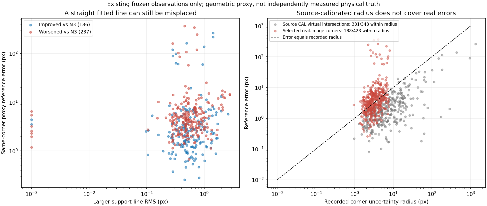

가림 판단이 일부 틀려도 다른 유효 대응점으로 자세를 구하고 자기 가림 코너를 재투영했을 때, 기존 단순 대조보다 실제 위치·회전이 좋아졌는가?

**이미 실행한245장에서는 우위를 확인하지 못했다. 이번에는 성능 실험을 반복하지 않고, 실패가 발생한 코너 조립 단계를 저장된 원행으로 분해했다.** 기존 N3는 T9.75455cm/R10.91484°, 경계 교체 주경로는 T10.34259cm/R10.95633°였다. 참조는 기존 GEOMETRIC_PROXY DEV이며 독립 실측 물리 GT가 아니다.

경계 head의 외곽/내부 역할은 Base 초기 자세로 투영한 박스의 convex hull 기하 분류다. 선택한 선의 직선성, 실제 해당 코너에 대한 선의 위치, 교점의 상대 정확도는 서로 다른 조건이다. 현재 구현의 작은 선 잔차와 source에서 보정한 반경은 마지막 두 조건을 보증하지 못했다.

| 이미 선택한 경계 교점 | N3보다 개선186개 | N3보다 악화237개 |
| --- | ---: | ---: |
| 더 큰 지지선 RMS 중앙값(px) | 0.51668 | 0.52041 |
| 참조 코너까지의 교점 오차 중앙값(px) | 2.51279 | 4.32812 |
| 참조 코너에서 두 선의 법선 오차 norm 중앙값(px) | 2.26621 | 3.39552 |
| 법선 오차→교점 오차 증폭 중앙값 | 1.02813 | 1.15246 |

두 집단의 선 내부 잔차는 비슷했다. 악화 집단의 선은 자기 선택점에 잘 맞으면서도 참조 코너에서 더 벗어났고, 교점에서 그 오차가 더 증폭됐다. 집단을 결과로 나눈 사후 기술 통계이며 인과 효과나 새 채택 규칙이 아니다. 실제 경계의 소유권 오류, appearance 전이, 선 추정 편향, 참조 불확실성이 각각 차지하는 비율은 이 자료로 확정할 수 없다.

선택된423개 중 기존 사람 상태가 DIRECT_VISIBLE인 것은415개, EXTERNAL_OCCLUDED는8개였다. 악화237개 중233개가 DIRECT_VISIBLE,4개가 EXTERNAL_OCCLUDED였다. 이 교체 후보의 상대 정확도 문제를 자기 가림 분류 오류만으로 설명할 수 없다. 사람 상태와 참조는 기존 자료를 사용했고 새 가림 주석이나 추론 입력으로 쓰지 않았다.

현재 문제의 코드 위치를 단계별로 연결하면 다음과 같다.

| 단계 | 구현과 남은 한계 |
| --- | --- |
| 역할 정의 | [model.py:47](../../../scripts/research/pallet_observation_refiner_20261009_v1/model.py#L47): Base 초기 투영의 외곽/내부 구분이며 실제 팔레트 경계의 소유권을 인증하지 않음 |
| 대응 위치 선택 | [observations.py:24](../../../scripts/research/pallet_boundary_corner_refiner_20261010_v2/observations.py#L24): 법선 후보 65개의 최고 bin과 NONE 비교; 선택 confidence는 실제 코너 위치 정확도의 보장이 아님 |
| 선과 코너 조립 | [선 추정:76](../../../scripts/research/pallet_boundary_corner_refiner_20261010_v2/observations.py#L76), [교점:116](../../../scripts/research/pallet_boundary_corner_refiner_20261010_v2/observations.py#L116): 합의/TLS와 교점 불확실성 검사; 지지점의 일관성과 목표 코너까지의 위치 정확도를 구분해야 함 |
| N3 좌표 교체 | [pipeline.py:45](../../../scripts/research/pallet_boundary_corner_refiner_20261010_v2/pipeline.py#L45): 지지점 잔차·반경·N3 거리 검사로 채택하지만 N3보다 정확하다는 것을 판별하지 못한 후보가 남음 |
| 자세와 숨은 코너 | [H 제외:101](../../../scripts/research/pallet_boundary_corner_refiner_20261010_v2/pose.py#L101), [최종 재투영:255](../../../scripts/research/pallet_boundary_corner_refiner_20261010_v2/pose.py#L255): H 초기 좌표를 fit에서 제외하고 새 자세의 재투영으로 교체; 재투영을 독립 관측으로 다시 fit하지 않음 |

과거의 확인된 버그는 별개다. [기존 targets():91](../../../scripts/research/pallet_observation_refiner_20261009_v1/training.py#L91)에서 수치적 무한대 ray hit를 close=False로 만들고 94행에서 유효 no_match로 감독했다. [교정 원증거](../pallet_kp_supervision_gate_20261010_v1/CORRECTED_TARGET_PROPOSAL_VALIDATION.json)는 실제 대응이 있던 2,164개를 POSITIVE로 복구했음을 기록한다. main의 고정 N3 학습 오류가 아니다. 과거 인수인계 문서 시점에는 수정 감독의 재학습이 아직 없었으나, 이후 별도로 승인된 [수정 감독 추가 9,000 업데이트](../pallet_kp_corrected_supervision_20261010_v1/TRAINING_COMPLETION.json)는 이미 완료됐다. 현재 v2는 그 마지막 IMAGE_ROLE을 사용한다. 이번 감사는 학습을 추가하지 않았다. [POS/NONE/IGNORE 준비](../../../scripts/research/pallet_kp_supervision_gate_20261010_v1/full_source_prepare.py#L98)와 [수정 배열 적용](../../../scripts/research/pallet_kp_supervision_repair_20261010_v1/retrain.py#L399)이 기존 버그의 수리이며, 현재 실사 상대 정확도 문제의 해결을 뜻하지 않는다.

수치적으로 단위 법선 두 개를 행으로 둔 A와 선 offset b에 대해 `교점−참조 = inverse(A) × (b−A×참조)`가 성립한다. 이미 계산된482개에서 양변 차이 최대5.38e-13px였다. 이는 기록된 교점 계산을 검산하는 것이며 PnP를 새로 푼 결과가 아니다. 분석용 제어 예에서도 지지선 잔차가0인 채5px의 코너 편향을 만들 수 있고, 같은 크기의 선 변위가 거의 평행한 교점에서200px로 증폭될 수 있음을 확인했다.

| 기록된 코너 반경 안의 참조 | 개수 | 비율 |
| --- | ---: | ---: |
| source CAL의 가상 wire 교점 | 331/348 | 95.11% |
| 실사에서 실제 교체 대상으로 선택한 교점 | 188/423 | 44.44% |

source CAL의 ref는 실제 wire query가 지지한 가상 교점이다. 물리 정점 소유권의 독립 인증이 없고 CAL로 scale을 정했으므로95.11%는 독립 보장 수치가 아니다. 실사44.44% 역시 같은 참조·같은 선택된 집합에 대한 사후 기술 수치다. 두 비율의 차이는 source 반경을 실사 정확도 보증으로 사용할 수 없다는 직접 근거이며, 실사 GT에 맞춰 반경을 키우라는 뜻이 아니다.



구체적인 좌표 계약 오류가 숨어 있는지도 별도로 확인했다. 기존 source1,024장·양성35,011개에서 ID/query/edge/bin/실제 wire face/기하 feature의 여섯 불일치는 모두0이었다. bin→UV 복원 최대1.14e-13px, 실제 mesh 점의 투영 최대2.27e-13px였다. [SOURCE_CONTRACT_CHECKS](SOURCE_CONTRACT_CHECKS.json)에는 실제 stdout 감사1회와 byte/SHA를 잠근 재현 감사1회, 총2회를 구분했다. RGB/neck19채널의 수치 일치까지 이 검사로 확대하지 않는다.

CAL의 가상 교점 참조와 원래 PnP 코너 정의도 직접 대조했다. 기존128개 source JSON의 native ID·K/R/t/치수·변 연결을 확인한348교점에서 두 참조 차이는 평균0.000031px, 최대0.000246px였고 반경 안의 개수는 두 정의 모두331/348이었다. 이번 CAL에서 참조 정의 차이가 실사 악화를 설명한다는 근거는 나오지 않았다. [CAL_CORNER_CONTRACT_CHECKS](CAL_CORNER_CONTRACT_CHECKS.json)와 [비교 원행](CAL_CORNER_CONTRACT_ROWS.jsonl.gz)은 한 번의 사전 잠금 산술 실행이며, 기존 source 어노테이션128개만 추가로 읽었다. source에서 정의가 일치한다는 사실을 실사 물리 경계 소유권의 인증으로 바꾸지 않는다.

실제 source RGB 입력도 확인했다. CAL128의 원본 BGR 영상에서 원래 밝기·법선/접선 기울기3채널을 다시 계산한 FP16 2,096,640개가 기존 cache와 비트 단위로 일치했고 최대 차이는0이었다. [완료 검산](rgb_resume/RGB_CONTRACT_CHECKS.json)은 [첫 실패](RGB_CONTRACT_CHECKS.json)와 구분한다. 첫 시도는 감사 코드의 tuple↔JSON list 직접 비교 때문에 RGB decode/stencil/비교0에서 중단됐다. 원 코드·protocol·실패를 보존하고 JSON canonical 비교 한 줄만 고친 재개 코드로 사전 잠금 후 수치 검사 한 번을 완료했다. [실행 인수인계](rgb_resume/ARTIFACT_LEDGER.json)에 각각의 SHA/횟수가 있다. 새 detector/neck/head/PnP/광선/학습/cache생성은0이다. 나머지16neck 채널의 수치 재생이나 실사 물리 경계의 인증까지 주장하지 않는다.

이번 실행은 저장된245개 observation,482개 교점, 기존 primary posthoc, source CAL348개 행을 읽은 산술 진단 한 번이다. detector0/head0/PnP0/학습0/RGB생성0, 임계값·배포 로직·마스크 변경0이다. 기존 공개 보고서·원행·가중치·실패 기록·main·사용자 checkout을 수정하지 않았다. 새 모델이나 변경된 방법이 개선됐다는 결과는 없다.

API의 사용성은 별도 실제 GPU 검사로 확인했다. 사전에 고정된 첫 영상 하나에서 public deployment.Pipeline을 같은 프로세스에 순차로 두 번 생성하고, 각각 metadata=None으로 예측 한 번 뒤 닫았다. 두 출력의 좌표·상태·R,t와 namespace/수명 복구가 모두 기존 봉인 추론과 일치했다. [DEPLOYMENT_SMOKE_CHECKS](DEPLOYMENT_SMOKE_CHECKS.json)는 실제 예측2회, 내부 초기화 포함 detector4회, N3/ROLE 각2회, 초기 자세/feature 초기 자세/최종 자세 경로 각2회를 기록한다. 실제 OpenCV 진입은 SubPix12/solvePnP6/generic70/LM14였다. 이 검사에는 새 GT 채점·성능 집계·latency 구간·학습·정책 변경이 없다. 한 영상의 수명 검사 통과를 정확도 개선이나 모든 객체의 지원으로 확대하지 않는다. 실제 API와 작은 head/의존성은 [기존 README](../pallet_boundary_corner_refiner_20261010_v2/README.md)에 있다.

실제 실행 코드·사전 잠금·새 원행은 [audit.py](../../../scripts/research/pallet_corner_mechanism_audit_20261010_v1/audit.py), [PROTOCOL](PROTOCOL.json), [ROWS](ROWS.jsonl.gz), [RESULTS](RESULTS.json)에 있다. 독립 검산은 MECHANISM_CHECKS.json과 verify_mechanism.py에 기록한다.

사용자는 성능이 나쁘다는 이유로 설정을 바꿔 반복하는 것을 금지했다. 수정 감독9000update와 과거 원래/수정 감독 관측의 점·선 절제는 이미 실행됐다. 현재v2는 부분선을 자세 fit에 사용하지 않았으며, 이번 진단도 v2 점·선 성능 절제를 새로 실행하지 않았다. 역사적 완료를 현재v2 동일 관측의 완료로 바꾸거나, 완료된 학습을 남은 새 실험처럼 제안하지 않는다. 현재 증거로 고칠 명백한 좌표/ID 뒤바뀜은 확인하지 못했다. 정확도 목표의 남은 문제는 실사에서도 유효한 경계 대응과 코너의 상대 정확도를 확보하는 것이며, 현재 고정 실행 범위 안에서 그 문제가 해결됐다고 선언할 근거는 없다.

재현 명령은 다음과 같다. 이미 존재하는 공개 결과에는 재실행하지 말고 새 output 디렉터리를 사용한다.

```bash
python -B -m scripts.research.pallet_corner_mechanism_audit_20261010_v1.audit freeze --output /tmp/pallet-corner-mechanism-audit
python -B -m scripts.research.pallet_corner_mechanism_audit_20261010_v1.audit run --output /tmp/pallet-corner-mechanism-audit
```

검산과 API 실행 가능성을 N3보다 높은 정확도라는 성공 조건으로 바꾸지 않는다. 가림 판단의 일부 오류는 계속 허용하고, 새 R,t가 있을 때 H 제외·최종 재투영·재fit 금지는 기존 경로대로 유지한다.
