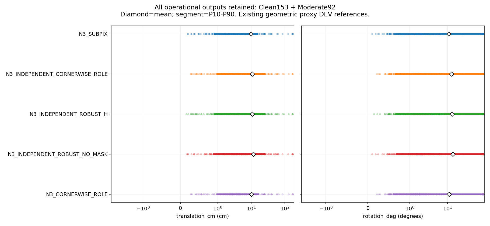
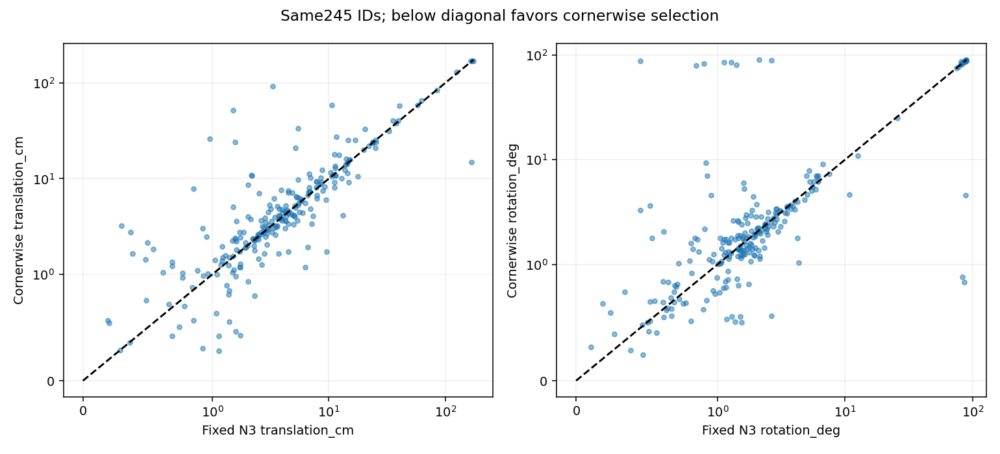
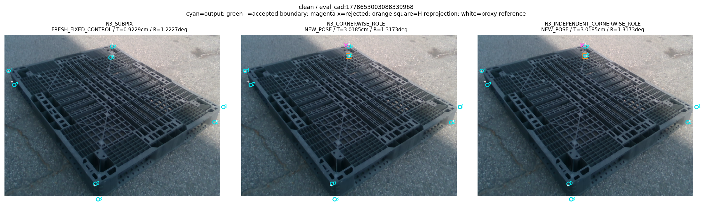
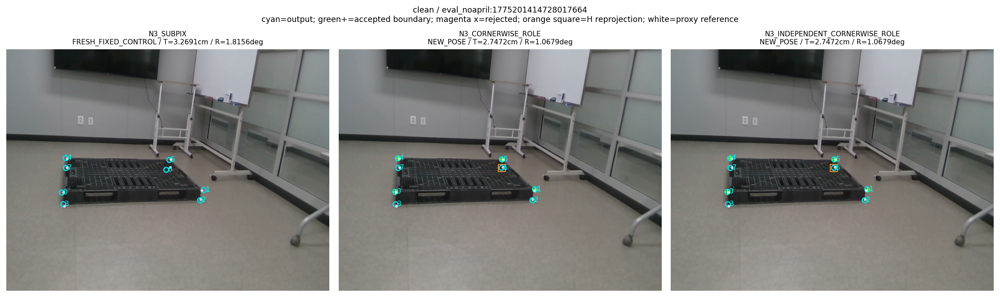
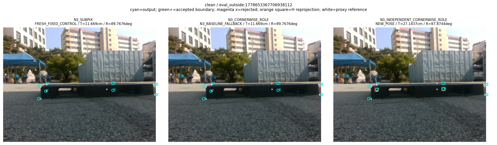
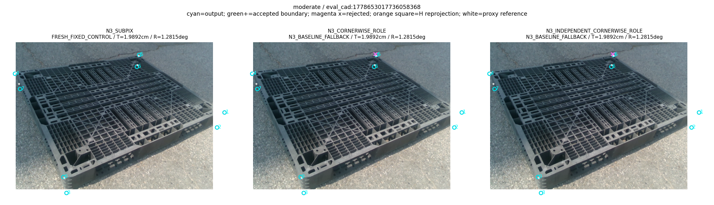
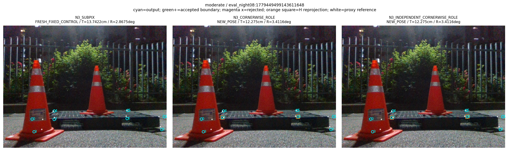
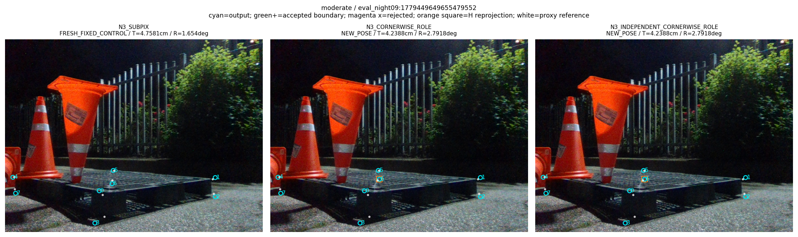

“가림 판단이 일부 틀려도 다른 유효 대응점으로 자세를 구하고 자기 가림 코너를 재투영했을 때, 기존 단순 대조보다 실제 위치·회전이 좋아졌는가?”

**고정 N3+SubPix 대조에 대해서는 아니었다.** 쉬움·중간 245장 전체 운용 결과에서 v4는 위치 평균 **10.703396 cm**, 회전 평균 **12.770245°**, ADDsym 평균 **19.460018 cm**였다. 같은 영상에서 새로 실행한 N3+SubPix는 **9.754548 cm / 10.914842° / 17.028647 cm**였다. v4는 238장에 새 자세를 구하고 7장에는 기본 N3 출력을 반환했으며, 최종 출력 없는 프레임은 0장이었다. 기본 Base보다 세 평균은 낮았지만, 더 강한 기존 N3 대조를 이기지 못했다.

이번 수정은 검사 코너와 자기 가림 좌표가 초기 전체 8점 자세 prior를 통해 LOO 검증·최종 fit에 간접 유입되던 경로를 제거했다. 이 수치 계약은 실제 합성 검사와 원행 검산을 통과했다. **그 계약 수정이 실제 정확도 개선을 보장하지는 않았다.** 이전 v3보다 새 자세는 순증 21장 늘었지만 위치·회전 평균은 더 높아졌다. 아래는 완료된 v4 결과이며, 별도 개발 중인 C2/v5 선 관측 경로의 결과를 포함하지 않는다. 원래 방법론의 성능 목표는 아직 달성되지 않았다.

## 평가 범위와 판정 기준

사용자의 후속 지시에 따라 기존 난이도 `clean` 153장과 `moderate` 92장만 포함했다. `severe` 74장은 새 실사·시간 경로에서 제외했다. 중간 라벨에는 부분 가림이 있을 수 있으며, 무가림 집합으로 해석하지 않는다. 기존 319장 실험·라벨·결과는 보존했다. 245장의 정확한 ID와 기존 라벨 근거는 [COHORT.json](../pallet_kp_corrected_supervision_20261010_v1/COHORT.json), 검사 전에 고정한 설정은 [PROTOCOL.json](PROTOCOL.json)에 있다.

이 데이터의 위치·회전 정답은 기존 기하 재구성 proxy다. 실제 영상의 기존 동일 평가 기준으로 비교했으며, 독립 계측한 물리적 자세 GT라고 인증하지 않는다. `ADDsym`은 같은 기존 대칭 처리로 계산했다. GT·사람 가림 상태는 모든 새 기하 출력이 봉인된 뒤 점수 계산과 사후 진단에만 읽었다. 새 학습·seed·RGB·수동 어노테이션·실사 점수를 이용한 설정 탐색은 0이었다.

한 번의 새 실사 실행으로 245개의 공통 관측, 4방법×245=980개 기하 출력, Base/N3 고정 대조 490개를 얻었다. 1,470개 모두 같은 원행에서 점수화했다. 이전 v3 대조는 새로 실행했고, 과거 봉인 기하와 245장 모두 비교한 수치가 정확히 같았다. 단순히 예전 점수나 좌표를 현재 평가 결과에 복사한 대조가 아니다. [INFERENCE_RECEIPT.json](INFERENCE_RECEIPT.json), [V3_CONTROL_PARITY.json](V3_CONTROL_PARITY.json), [SCORING_RECEIPT.json](SCORING_RECEIPT.json)이 실행량과 순서를 기록한다.

## 무엇을 수정했는가

모델이 정의하는 코너는 팔레트 외곽 직육면체의 8개 native ID다. head는 코너 2D 위치를 직접 출력하는 대신, 각 의미 변에 7개 query를 놓고 수직 방향 65개 위치 후보와 `NONE`을 예측한다. 여러 query로 선을 맞추고, 서로 다른 두 incident 선의 교점으로 코너 후보를 만든다. 따라서 선 대응 → 선 조립 → 교점 → native 코너 채택 → PnP가 서로 다른 단계다.

`ROLE`은 실제 물리적 경계 소유권 라벨이 아니다. 고정 Base로 계산한 초기 자세의 가상 직육면체 8점에서 convex hull을 만들고, 변을 `BOUNDARY / INTERNAL / UNAVAILABLE`로 분류한 3개 입력 채널이다. 실제 목재 판재·홈·구멍의 어느 경계가 그 native 변에 속하는지 증명하지 않는다. 이 모델은 초기 점·치수·영상으로 만든 후보 집합에 의존하며, 실제 팔레트 마스크를 hull로 대체해 감독한 것은 아니다. [model.py:47](../../../scripts/research/pallet_observation_refiner_20261009_v1/model.py#L47), [model.py:59](../../../scripts/research/pallet_observation_refiner_20261009_v1/model.py#L59).

v4는 v2의 source calibration과 선·교점·8px uncertainty/native basin 조건을 그대로 사용했다. 실제 영상 GT로 confidence·각도·외삽 조건을 바꾸지 않았다. 각 허용 코너 k를 검사할 때 H∪{k}를 제외한 나머지 N3 RGB 관측만으로 강건 PnP를 실행했다. 검사 후보와 원래 N3 좌표가 이 자세의 k 재투영에 얼마나 가까운지 비교하고, 후보 잔차≤8px이면서 N3보다 제곱 잔차가 엄격히 낮을 때만 **실제 후보 좌표**를 채택했다. 검사 자세의 재투영 k를 새 관측으로 만들지 않았다. [selection.py:135](../../../scripts/research/pallet_cornerwise_independent_20261010_v4/selection.py#L135), [selection.py:159](../../../scripts/research/pallet_cornerwise_independent_20261010_v4/selection.py#L159).

이전 v3는 fit의 관측 배열에서 k/H를 빼더라도 전체 8점으로 만든 초기 자세·치수 prior를 사용했다. v4의 세 새 방법은 초기 R,t·8점 재투영·초기 치수 분기 prior를 솔버 입력으로 받지 않는다. 독립적으로 알려진 치수 분기 증거가 없으면 두 registry 분기를 모두 검사한다. 4점 부분집합의 유한 가설을 재사용하고, 가용 U만으로 inlier 수와 잘린 잔차를 비교한다. 물리적으로 다른 수치 동점 해, 부족한 합의, 수치 rank 부족을 구분한다. 4점/5점 표준 SQPnP/IPPE와 반환 다중해 처리를 그대로 사용한다. [pose.py:134](../../../scripts/research/pallet_cornerwise_independent_20261010_v4/pose.py#L134), [pose.py:282](../../../scripts/research/pallet_cornerwise_independent_20261010_v4/pose.py#L282).

H 자체는 기존 초기 N3 자기 가림 판정이고, 경계 제안은 Base의 feature·역할에 의존한다. 따라서 여기서 말하는 독립성은 **가림 좌표와 검사 좌표가 수치 자세 prior에 다시 들어가지 않는 조건부 수치 계약**이다. 전체 시스템의 통계적 독립성, 마스크 정답, 실제 경계 소유권을 보장하지 않는다.

최종 새 자세는 H를 제외한 선택 관측으로 구했다. 새 R,t가 있으면 H의 초기 좌표를 최종 재투영으로 교체했다. 재투영점은 다시 PnP에 넣지 않았다. 임시 LOO 제외 k는 자기 가림으로 취급하지 않았다. 보류·부족·다중해가 있으면 별도 `N3_BASELINE_FALLBACK`으로 기록했다. 가림 오판이나 전후 H 변화 하나로 프레임 전체를 실패시키지 않았다. [pose.py:315](../../../scripts/research/pallet_cornerwise_independent_20261010_v4/pose.py#L315).

## 전체 운용 결과와 산출률

방법 이름의 `H`는 예측 자기 가림 제외를 뜻한다. `마스크 없음` 대조는 같은 N3 좌표와 같은 새 강건 솔버를 쓰되 H를 제외하지 않는다. 이전 v3 대조만 원래 prior를 유지한다.

| 방법 | 전체 출력 | 새 자세 | 기본 N3 반환 | 완전 실패 | 고정 대조 |
|---|---:|---:|---:|---:|---:|
| Base | 245 | 0 | 0 | 0 | 245 |
| N3+SubPix | 245 | 0 | 0 | 0 | 245 |
| v4 코너별 경계 채택 | 245 | 238 | 7 | 0 | 0 |
| v4 N3 관측·H 제외 | 245 | 238 | 7 | 0 | 0 |
| v4 N3 관측·마스크 없음 | 245 | 244 | 1 | 0 | 0 |
| 이전 v3 그대로 | 245 | 217 | 28 | 0 | 0 |

다음 표는 실패·fallback을 제거하지 않은 245장 전부의 결과다. 위치와 ADDsym은 cm, 회전은 도 단위다. 표본분산과 SD는 `ddof=1`이며, 분산의 단위는 해당 지표 단위의 제곱이다. 원행 수치는 [METRICS.json](METRICS.json), [METRICS.csv](METRICS.csv), 1,470행 요약은 [PER_FRAME.csv](PER_FRAME.csv)에 있다.

| 방법 | 지표 | n | 평균 | 표본분산 | 표본 SD | 중앙값 | P90 | 최대 |
|---|---|---:|---:|---:|---:|---:|---:|---:|
| Base | 위치 cm | 245 | 12.188351 | 538.579067 | 23.207306 | 6.010803 | 23.191872 | 183.078505 |
| Base | 회전 ° | 245 | 14.232844 | 851.384155 | 29.178488 | 1.839738 | 82.810639 | 90.009175 |
| Base | ADDsym cm | 245 | 22.431946 | 1506.002205 | 38.807244 | 6.405062 | 110.036532 | 188.991522 |
| N3+SubPix | 위치 cm | 245 | 9.754548 | 575.936024 | 23.998667 | 3.597350 | 15.085014 | 174.756827 |
| N3+SubPix | 회전 ° | 245 | 10.914842 | 665.180601 | 25.791095 | 1.665993 | 76.095325 | 89.777634 |
| N3+SubPix | ADDsym cm | 245 | 17.028647 | 1298.810870 | 36.039019 | 3.936935 | 68.431494 | 180.988442 |
| v4 코너별 경계 채택 | 위치 cm | 245 | 10.703396 | 534.421608 | 23.117561 | 3.922615 | 23.998861 | 169.893223 |
| v4 코너별 경계 채택 | 회전 ° | 245 | 12.770245 | 771.380692 | 27.773741 | 1.823836 | 82.422410 | 90.101532 |
| v4 코너별 경계 채택 | ADDsym cm | 245 | 19.460018 | 1438.098940 | 37.922275 | 4.219500 | 79.839997 | 176.470605 |
| v4 N3 관측·H 제외 | 위치 cm | 245 | 10.621961 | 536.238431 | 23.156823 | 3.922615 | 24.064985 | 169.893223 |
| v4 N3 관측·H 제외 | 회전 ° | 245 | 13.112718 | 791.161552 | 28.127594 | 1.893088 | 83.086081 | 90.101532 |
| v4 N3 관측·H 제외 | ADDsym cm | 245 | 19.681472 | 1478.199236 | 38.447357 | 4.155492 | 87.361273 | 176.470605 |
| v4 N3 관측·마스크 없음 | 위치 cm | 245 | 11.596382 | 621.465996 | 24.929220 | 3.933522 | 24.972917 | 174.756827 |
| v4 N3 관측·마스크 없음 | 회전 ° | 245 | 13.899846 | 831.978834 | 28.844043 | 2.022187 | 83.548376 | 89.812692 |
| v4 N3 관측·마스크 없음 | ADDsym cm | 245 | 20.510338 | 1513.111722 | 38.898737 | 4.337446 | 86.240358 | 180.988442 |
| 이전 v3 그대로 | 위치 cm | 245 | 10.070627 | 602.362920 | 24.543083 | 3.751204 | 16.009993 | 178.983025 |
| 이전 v3 그대로 | 회전 ° | 245 | 10.941577 | 670.561688 | 25.895206 | 1.625117 | 76.185921 | 89.791722 |
| 이전 v3 그대로 | ADDsym cm | 245 | 17.296327 | 1324.810247 | 36.397943 | 4.011170 | 68.672734 | 185.903091 |

전체 출력과 큰 오차를 포함한 분포다. 중앙값과 평균을 함께 읽어야 한다. 새 자세를 얻었다는 상태가 낮은 실제 자세 오차를 뜻하지 않으며, 큰 회전 오차가 통계에서 제외되지 않았다.

## 쉬움 153장과 중간 92장

같은 난이도 ID를 모든 방법에 적용했다. 이 표도 fallback을 포함한 전체 운용 집합이며, 난이도를 새 예측 오차로 다시 정하지 않았다.

### 쉬움

| 방법 | 지표 | n | 평균 | 표본분산 | 표본 SD | 중앙값 | P90 | 최대 |
|---|---|---:|---:|---:|---:|---:|---:|---:|
| Base | 위치 cm | 153 | 12.846348 | 790.451432 | 28.114968 | 4.668214 | 19.836603 | 183.078505 |
| Base | 회전 ° | 153 | 10.628205 | 616.624794 | 24.831931 | 1.715556 | 50.873619 | 89.479285 |
| Base | ADDsym cm | 153 | 17.938605 | 1268.885882 | 35.621424 | 5.516163 | 53.332337 | 188.991522 |
| N3+SubPix | 위치 cm | 153 | 10.107073 | 859.717470 | 29.320939 | 2.691885 | 12.762646 | 174.756827 |
| N3+SubPix | 회전 ° | 153 | 7.584578 | 435.544581 | 20.869705 | 1.541652 | 5.923153 | 89.767637 |
| N3+SubPix | ADDsym cm | 153 | 12.915132 | 1130.584507 | 33.624166 | 2.966195 | 14.831169 | 180.988442 |
| v4 코너별 경계 채택 | 위치 cm | 153 | 9.775721 | 704.946412 | 26.550827 | 3.018543 | 15.477871 | 169.893223 |
| v4 코너별 경계 채택 | 회전 ° | 153 | 7.640959 | 432.212582 | 20.789723 | 1.582494 | 7.221626 | 87.874438 |
| v4 코너별 경계 채택 | ADDsym cm | 153 | 12.649798 | 985.779039 | 31.397118 | 3.325252 | 16.160239 | 176.470605 |
| v4 N3 관측·H 제외 | 위치 cm | 153 | 9.626309 | 706.776184 | 26.585263 | 2.861502 | 15.477871 | 169.893223 |
| v4 N3 관측·H 제외 | 회전 ° | 153 | 7.640489 | 432.162151 | 20.788510 | 1.506441 | 7.221626 | 87.874438 |
| v4 N3 관측·H 제외 | ADDsym cm | 153 | 12.521833 | 987.950955 | 31.431687 | 3.111095 | 16.160239 | 176.470605 |
| v4 N3 관측·마스크 없음 | 위치 cm | 153 | 10.643086 | 862.204558 | 29.363320 | 2.964637 | 15.458323 | 174.756827 |
| v4 N3 관측·마스크 없음 | 회전 ° | 153 | 8.336070 | 476.113687 | 21.820029 | 1.705115 | 7.334818 | 89.812692 |
| v4 N3 관측·마스크 없음 | ADDsym cm | 153 | 13.643686 | 1152.879568 | 33.954080 | 3.307872 | 16.489381 | 180.988442 |
| 이전 v3 그대로 | 위치 cm | 153 | 10.430857 | 887.798966 | 29.795956 | 2.910398 | 12.599184 | 178.983025 |
| 이전 v3 그대로 | 회전 ° | 153 | 7.570617 | 438.753688 | 20.946448 | 1.448292 | 7.195780 | 89.767637 |
| 이전 v3 그대로 | ADDsym cm | 153 | 13.195340 | 1158.867197 | 34.042139 | 3.185815 | 15.725262 | 185.903091 |

### 중간

| 방법 | 지표 | n | 평균 | 표본분산 | 표본 SD | 중앙값 | P90 | 최대 |
|---|---|---:|---:|---:|---:|---:|---:|---:|
| Base | 위치 cm | 92 | 11.094074 | 121.849087 | 11.038527 | 7.851390 | 26.036089 | 60.431862 |
| Base | 회전 ° | 92 | 20.227517 | 1194.688456 | 34.564266 | 1.998780 | 86.159213 | 90.009175 |
| Base | ADDsym cm | 92 | 29.904567 | 1828.214398 | 42.757624 | 8.142242 | 116.222803 | 121.238948 |
| N3+SubPix | 위치 cm | 92 | 9.168284 | 107.699997 | 10.377861 | 5.220474 | 23.637317 | 61.923605 |
| N3+SubPix | 회전 ° | 92 | 16.453215 | 1006.400563 | 31.723817 | 1.981300 | 85.510157 | 89.777634 |
| N3+SubPix | ADDsym cm | 92 | 23.869600 | 1518.314503 | 38.965555 | 5.436086 | 112.131374 | 121.344766 |
| v4 코너별 경계 채택 | 위치 cm | 92 | 12.246160 | 251.608547 | 15.862173 | 6.417617 | 30.733489 | 92.078251 |
| v4 코너별 경계 채택 | 회전 ° | 92 | 21.300470 | 1228.580824 | 35.051117 | 2.448320 | 86.909988 | 90.101532 |
| v4 코너별 경계 채택 | ADDsym cm | 92 | 30.785711 | 2001.766625 | 44.741107 | 6.738329 | 117.257672 | 137.234322 |
| v4 N3 관측·H 제외 | 위치 cm | 92 | 12.277774 | 252.838319 | 15.900890 | 6.269494 | 31.204446 | 92.078251 |
| v4 N3 관측·H 제외 | 회전 ° | 92 | 22.213271 | 1265.425247 | 35.572816 | 2.584769 | 86.909988 | 90.101532 |
| v4 N3 관측·H 제외 | ADDsym cm | 92 | 31.588264 | 2083.804690 | 45.648710 | 6.738329 | 118.580808 | 137.234322 |
| v4 N3 관측·마스크 없음 | 위치 cm | 92 | 13.181756 | 222.113562 | 14.903475 | 6.458656 | 32.544634 | 63.602098 |
| v4 N3 관측·마스크 없음 | 회전 ° | 92 | 23.152649 | 1296.932146 | 36.012944 | 2.224381 | 87.519935 | 89.777634 |
| v4 N3 관측·마스크 없음 | ADDsym cm | 92 | 31.929879 | 1920.331117 | 43.821583 | 7.056594 | 114.728146 | 125.048200 |
| 이전 v3 그대로 | 위치 cm | 92 | 9.471549 | 131.628980 | 11.472967 | 4.842083 | 23.863087 | 65.789468 |
| 이전 v3 그대로 | 회전 ° | 92 | 16.547631 | 1014.247623 | 31.847255 | 1.963709 | 85.770551 | 89.791722 |
| 이전 v3 그대로 | ADDsym cm | 92 | 24.116447 | 1541.246452 | 39.258712 | 5.300056 | 113.360007 | 121.344766 |

## 공통 산출집합과 짝 비교

Δ는 앞 방법−뒤 방법이다. 음수가 개선이다. 13개 세션의 기존 10,000회 bootstrap draw를 그대로 재사용했으며 새 draw를 생성하지 않았다. 모든 공통 운용 비교의 245장과, 후보 방법의 새 자세만 포함한 집합, 양쪽 모두 새 자세인 집합을 별도로 표시한다. 고정 Base/N3는 `FRESH_FIXED_CONTROL`이므로 두 방법 모두 `NEW_POSE`인 비교에서 n=0은 정의상 해당 집합이 없다는 뜻이며, 대조 출력이 없다는 뜻이 아니다.

| 대비: 앞−뒤 | 산출집합 | n | Δ위치 [95% CI] cm | Δ회전 [95% CI] ° | ΔADDsym [95% CI] cm |
|---|---|---:|---|---|---|
| v4 코너별 경계 채택 − N3+SubPix | 전체 공통 출력 | 245 | 0.948848 [-0.487170, 2.375243] | 1.855403 [0.137334, 4.055155] | 2.431372 [0.119443, 5.408026] |
| v4 코너별 경계 채택 − N3+SubPix | 앞 방법 NEW만 | 238 | 0.976755 [-0.500551, 2.449280] | 1.909973 [0.142620, 4.299645] | 2.502883 [0.119443, 5.626757] |
| v4 코너별 경계 채택 − N3+SubPix | 양쪽 NEW만 | 0 | NA | NA | NA |
| v4 코너별 경계 채택 − 이전 v3 그대로 | 전체 공통 출력 | 245 | 0.632769 [-0.948851, 2.236310] | 1.828667 [0.115230, 4.027751] | 2.163691 [-0.292023, 5.384898] |
| v4 코너별 경계 채택 − 이전 v3 그대로 | 앞 방법 NEW만 | 238 | 0.654082 [-0.968196, 2.327213] | 1.876690 [0.112694, 4.252469] | 2.227718 [-0.296211, 5.592356] |
| v4 코너별 경계 채택 − 이전 v3 그대로 | 양쪽 NEW만 | 216 | 0.040974 [-1.520577, 1.642649] | 0.821648 [-0.588460, 2.621295] | 0.952756 [-1.355588, 3.793555] |
| v4 코너별 경계 채택 − v4 N3 관측·H 제외 | 전체 공통 출력 | 245 | 0.081435 [-0.552698, 0.444568] | -0.342473 [-1.170000, 0.015967] | -0.221454 [-1.507780, 0.404715] |
| v4 코너별 경계 채택 − v4 N3 관측·H 제외 | 앞 방법 NEW만 | 238 | 0.083830 [-0.568292, 0.451473] | -0.352546 [-1.211032, 0.016658] | -0.227967 [-1.545305, 0.411954] |
| v4 코너별 경계 채택 − v4 N3 관측·H 제외 | 양쪽 NEW만 | 238 | 0.083830 [-0.568292, 0.451473] | -0.352546 [-1.211032, 0.016658] | -0.227967 [-1.545305, 0.411954] |
| v4 코너별 경계 채택 − v4 N3 관측·마스크 없음 | 전체 공통 출력 | 245 | -0.892986 [-2.777892, 0.779529] | -1.129602 [-3.563619, 1.078162] | -1.050320 [-4.016978, 1.573280] |
| v4 코너별 경계 채택 − v4 N3 관측·마스크 없음 | 앞 방법 NEW만 | 238 | -0.470709 [-2.046573, 0.983143] | -0.360432 [-2.213924, 1.483225] | -0.168936 [-2.502257, 2.001359] |
| v4 코너별 경계 채택 − v4 N3 관측·마스크 없음 | 양쪽 NEW만 | 238 | -0.470709 [-2.046573, 0.983143] | -0.360432 [-2.213924, 1.483225] | -0.168936 [-2.502257, 2.001359] |
| v4 코너별 경계 채택 − Base | 전체 공통 출력 | 245 | -1.484956 [-3.555851, 1.401637] | -1.462600 [-4.446327, 3.041485] | -2.971927 [-8.038106, 3.213129] |
| v4 코너별 경계 채택 − Base | 앞 방법 NEW만 | 238 | -1.516219 [-3.588998, 1.515748] | -1.496281 [-4.492943, 3.206256] | -3.050650 [-8.161315, 3.385000] |
| v4 코너별 경계 채택 − Base | 양쪽 NEW만 | 0 | NA | NA | NA |
| v4 N3 관측·H 제외 − v4 N3 관측·마스크 없음 | 전체 공통 출력 | 245 | -0.974421 [-2.905347, 0.976808] | -0.787129 [-3.469172, 1.879035] | -0.828866 [-4.056081, 2.432616] |
| v4 N3 관측·H 제외 − v4 N3 관측·마스크 없음 | 앞 방법 NEW만 | 238 | -0.554539 [-2.256221, 1.209123] | -0.007887 [-2.115601, 2.323923] | 0.059031 [-2.640821, 3.029556] |
| v4 N3 관측·H 제외 − v4 N3 관측·마스크 없음 | 양쪽 NEW만 | 238 | -0.554539 [-2.256221, 1.209123] | -0.007887 [-2.115601, 2.323923] | 0.059031 [-2.640821, 3.029556] |
| v4 N3 관측·마스크 없음 − N3+SubPix | 전체 공통 출력 | 245 | 1.841834 [0.403284, 4.168906] | 2.985004 [0.760492, 6.544283] | 3.481691 [0.815058, 7.934522] |
| v4 N3 관측·마스크 없음 − N3+SubPix | 앞 방법 NEW만 | 244 | 1.849383 [0.403284, 4.211677] | 2.997238 [0.760492, 6.614527] | 3.495961 [0.816799, 8.008896] |
| v4 N3 관측·마스크 없음 − N3+SubPix | 양쪽 NEW만 | 0 | NA | NA | NA |

주 대조 v4−N3의 전체 운용 Δ위치는 +0.948848 cm로 CI가 0을 포함했다. Δ회전은 +1.855403° [0.137334, 4.055155], ΔADDsym은 +2.431372 cm [0.119443, 5.408026]였다. 이 고정 DEV 집합의 세션 bootstrap에서 회전·ADDsym의 악화 방향은 0을 포함하지 않았다. 다중 대비 보정이나 독립 배포 일반화의 인증으로 확대 해석하지 않는다. 세 층별 7대비×3집합×3지표=189개 CI와 정확한 paired ID는 [METRICS.json](METRICS.json)에 모두 남겼다.

새 경계 제안을 추가한 v4와 N3 관측·H 제외만 사용한 v4의 T/R/ADD CI는 모두 0을 포함했다. 이 실행으로 ROLE 모델의 필요성이나 경계 보정의 실제 추가 효용이 입증됐다고 말할 수 없다. 무마스크 강건 PnP 대조 역시 N3보다 세 평균이 높았다. 강건 PnP라는 이유만으로 올바른 자세가 된다고 처리하지 않았다.

같은 프레임의 대응 비교다. 그림의 개선·악화 위치는 사후 평가이며 관측 선택에 사용되지 않았다.

주 방법의 새 자세와 기본 반환 집합을 따로 계산한 결과는 다음과 같다. 전체 운용 평균을 이들 중 유리한 집합으로 대체하지 않았다.

| 구분 | 지표 | n | 평균 | 표본분산 | 표본 SD | 중앙값 | P90 | 최대 |
|---|---|---:|---:|---:|---:|---:|---:|---:|
| 새 자세 | 위치 cm | 238 | 10.960415 | 547.866733 | 23.406553 | 4.025256 | 24.115178 | 169.893223 |
| 새 자세 | 회전 ° | 238 | 13.080602 | 790.670067 | 28.118856 | 1.851366 | 83.073865 | 90.101532 |
| 새 자세 | ADDsym cm | 238 | 19.955168 | 1471.904459 | 38.365407 | 4.329586 | 85.009504 | 176.470605 |
| 기본 N3 반환 | 위치 cm | 7 | 1.964727 | 0.697388 | 0.835097 | 1.989218 | 2.694996 | 2.769367 |
| 기본 N3 반환 | 회전 ° | 7 | 2.218106 | 4.287480 | 2.070623 | 1.281543 | 4.869020 | 6.136693 |
| 기본 N3 반환 | ADDsym cm | 7 | 2.624949 | 2.082772 | 1.443181 | 2.347072 | 4.257206 | 5.383010 |

## 수정 뒤에도 남은 실패 단계

### 경계 좌표를 채택하는 판단은 여전히 완전하지 않다

공통 decoder가 만든 허용 후보는 447개였다. N3보다 reference 2D 오차가 낮은 후보 192개, 높은 후보 255개였다. native basin 바깥 24개를 제외하고 423개의 실제 LOO를 수행했다. 그중 133개를 채택했으며, reference 기준 80개는 좋아졌고 53개는 나빠졌다. 133개의 평균 Δ2D오차는 −0.249754 px, 중앙값 −0.305621 px, P90 +2.654596 px였다. 실제 채택하지 않은 후보까지 성공한 보정으로 세지 않았다.

이는 “작은 선 잔차와 heldout pose 일관성이 N3보다 reference 좌표 정확도가 좋은 경계 소유권을 항상 구별하지 못했다”는 관측이다. 53개의 상대 정확도 악화는 사후 proxy 비교 결과다. 특정 판재 경계를 잘못 소유했다거나 특정 역할 채널이 원인이라는 비율을 입증한 것은 아니다. 같은 변 query의 상관 오차·coherent 이상치·실사 P0 형상 차이 등이 가능한 설명이나, 현재 원행만으로 원인 점유율을 단정하지 않는다.

### prior 제거와 W/D 분기 변화는 별도 문제다

[FAULT_ISOLATION_CHECKS.json](FAULT_ISOLATION_CHECKS.json)은 기존 원행만 한 번 읽어 245장을 이전 v3↔v4 상태, 실제 반환 `cf_extents`의 N3 분기와의 관계, 채택 경계 유무로 나눴다. 자세나 모델을 다시 실행하지 않았다. 이전 v3와 v4가 모두 NEW인 216장, 추가 NEW 22장, NEW를 잃은 1장, 둘 다 기본 반환한 6장으로 합계 245장이다. 순증 21장을 추가 성공 21장으로 잘못 세지 않는다.

v4의 실제 반환 W/D 분기는 고정 N3와 11장에서 달랐다. 경계를 사용하지 않은 native-H 대조도 12장에서 달랐다. v4와 native-H의 분기는 244장에서 같고 1장에서 달랐다. 따라서 분기 변화 전체를 새 경계 모델 탓으로 돌릴 수 없다. 다음은 모든 프레임을 정확히 한 번 포함하는 분해다. Δ는 v4−N3 평균이며, 각 집합을 전체 245장 평균에 기여하도록 합산한 검산도 통과했다.

| v3→v4 상태 | N3 반환 분기와 관계 | 새 경계 채택 | n | ΔT cm | ΔR ° |
|---|---|---|---:|---:|---:|
| 추가 NEW | 동일 | 있음 | 1 | −1.385240 | +1.269925 |
| 추가 NEW | 동일 | 없음 | 18 | +2.523893 | +0.988695 |
| 추가 NEW | W/D 변경 | 없음 | 3 | +34.258770 | +83.369937 |
| 둘 다 기본 반환 | 동일 | 없음 | 6 | 0 | 0 |
| 둘 다 NEW | 동일 | 있음 | 81 | +0.470340 | −0.147994 |
| 둘 다 NEW | 동일 | 없음 | 127 | +0.391657 | +0.250277 |
| 둘 다 NEW | W/D 변경 | 있음 | 3 | −3.285387 | −29.722436 |
| 둘 다 NEW | W/D 변경 | 없음 | 5 | +1.532957 | +50.953407 |
| NEW 상실 | 동일 | 없음 | 1 | 0 | 0 |

W/D가 달라지고 경계 없이 추가 NEW가 된 3장에는 큰 회전 악화가 함께 나타났다. 반대로 분기가 달라졌지만 경계를 채택한 3장은 평균 회전이 개선됐다. 무조건 한 분기를 고정하거나 변경 분기를 사후 제거하면 이 사실을 감춘다. 분기 변화는 수치 prior 제거와 연관된 오류 양상이며, 실제 물리 분기의 정오를 독립 인증한 것은 아니다.

v4와 native-H가 둘 다 NEW이고 같은 분기인 237장에서도 경계 추가의 ΔT 평균은 +0.262698 cm, ΔR은 −0.005765°였다. 따라서 이번 위치 손해가 모두 W/D 분기 교환에서만 왔다고 말할 수도 없다. 모든 ID·점 수·layout·inlier·분기와 Δ는 [FAULT_ISOLATION_ROWS.jsonl.gz](FAULT_ISOLATION_ROWS.jsonl.gz), [FAULT_ISOLATION_TABLE.csv](FAULT_ISOLATION_TABLE.csv), [FAULT_ISOLATION_KO.md](FAULT_ISOLATION_KO.md)에 남겼다. 이 분해는 연관의 구분이며 새로운 설정을 고르는 성능 실험이 아니다.

### 남은 대응의 수·배치와 inlier

238개 승인 NEW의 최종 inlier 수는 4점 23장, 5점 38장, 6점 59장, 7점 115장, 8점 3장이었다. 최소 4점인 합의는 `weak_four_point_consensus`로 별도 표시했다. H를 제외한 실제 fit pool의 점에는 reference 기준 8px 이내 1,116점, 8px 초과 465점, reference/입력 부족 5점이 있었다. 승인 NEW 최종 inlier에는 각각 1,079 / 384 / 2점이 있었다. 강건 fit의 inlier와 reference의 올바른 대응이 같은 개념은 아니다.

전체 245장의 raw best-candidate layout 기록에는 object rank3 231장, rank2 10장, 없음 4장이 있었다. raw Jacobian rank6 241장은 **거절 후보를 포함한 raw 진단 범위**이며 241장 승인 NEW라는 뜻이 아니다. rank6은 국소 수치 관측성이고 실제 정답·전역 유일성의 증거가 아니다. 선후 원행의 승인 상태를 유지해 수치 성공, 부족·다중해·기본 반환과 실제 자세 오차를 분리했다.

## 마스크 오판과 자세 결과

마스크 비교는 사람 상태가 알려진 native ID에서 초기 H와 사람 자기 가림 집합을 비교했다. 완벽한 전체 가림 분류를 성공 조건으로 쓰지 않았다. 잘못 제외/잔류한 ID, 남은 pool, 최종 inlier와 실제 위치·회전의 개선 여부를 구분한다. 기준은 같은 고정 N3 자세다.

| 초기 H와 사람 판정의 관계 | T/R 둘 다 개선 | T/R 둘 다 악화 | 혼합·동일 |
|---|---:|---:|---:|
| 알려진 점에서 마스크 불일치 | 13 | 22 | 26 |
| 알려진 점에서 마스크 일치 | 43 | 53 | 88 |

불일치 61장 가운데 13장은 마스크가 틀렸지만 위치·회전이 모두 좋아졌다. 알려진 점에서 일치한 184장 가운데 53장은 둘 다 나빠졌다. “마스크가 맞아서 자세도 맞다”와 “마스크가 틀려서 프레임 실패다”는 둘 다 원행에 맞지 않았다. 초기↔최종 H가 달라진 8장도 기록만 했고 실패 판정으로 쓰지 않았다. 무마스크 대조의 사람 상태는 진단용으로만 기록하고 마스크 정오 그룹에 끼워 넣지 않았다. 모든 그룹의 ID와 NEW/fallback 상태는 [METRICS.json](METRICS.json), [POSTHOC_ROWS.jsonl.gz](POSTHOC_ROWS.jsonl.gz)에 있다.

이번 v4는 기존의 사람-mask oracle·오판 stress를 다시 실행한 비교가 아니다. 과거 245장 실제 stress 6,860행과 Base/N3 각 6개 무학습 대조는 [수정 감독 실험 보고서](../pallet_kp_corrected_supervision_20261010_v1/RESULT_KO.md)에 보존돼 있다. oracle은 배포 결과가 아니며, 그 prior 조건의 결과를 새로운 observation-only v4 솔버의 결과로 옮기지 않는다.

## 직접 가시점 손상과 숨은 점 재투영

다음은 fixed N3 phase의 동일 reference로 비교했다. 사람 자기 가림 전체와 실제 출력에서 H를 재투영한 점은 서로 다른 집합이다. 예측 H에 사람 직접 가시점이 잘못 들어갈 수도 있으므로 별도로 집계했다.

| 점 집합 | n | N3 평균 px | 최종 평균 px | N3 중앙값 | 최종 중앙값 | N3 P90 | 최종 P90 |
|---|---:|---:|---:|---:|---:|---:|---:|
| 사람 직접 가시점 | 1503 | 19.853024 | 19.827321 | 4.428044 | 4.400291 | 21.434211 | 21.328592 |
| 사람 자기 가림점 | 335 | 19.654282 | 19.518220 | 7.067136 | 4.580631 | 26.523562 | 28.451472 |
| 실제로 재투영한 H | 291 | 19.069889 | 18.830555 | 7.054507 | 4.442801 | 26.686552 | 34.782357 |

직접 가시점의 N3 오차≤5px가 최종>10px로 바뀐 경우는 0점이었다. 실제 H 재투영 291점의 평균 오차는 19.069889→18.830555px로 낮아졌지만 P90은 26.686552→34.782357px로 높아졌다. 자기 가림 전체 335점의 평균 소폭 개선이나 직접 가시점 평균 소폭 개선을 3D 자세 개선으로 바꾸어 보고하지 않는다. 앞의 전체 자세 T/R/ADD는 악화했다.

별도 [REPROJECTION_CHECKS.json](REPROJECTION_CHECKS.json)은 네 방법의 980행 중 937개 새 자세와 839개 실제 H 재투영을 scalar R,t/K 투영으로 검산했다. 최대 좌표 차이는 2.2737367544323206e−13px였고, 6,657개 non-H 관측 좌표와 980개 중심 유지도 확인했다. 이는 재투영 구현 계약의 통과이며, reference 오차 개선이나 실제 물리적 자세의 인증과 구분한다.

## 실행 비용과 전체 경로 시간

고정 eligible 26장·13세션에서 4경로 각각 20회 warmup과 26×5=130회 본 측정, 총 600회의 fresh 경로를 실제 실행했다. detector→고정 N3→초기 자세→필요한 ROLE/feature 자세→코너별 LOO→최종 강건 PnP→H 재투영·출력까지 포함했다. 캐시 좌표 재생이나 예전 시간 합산은 없었다. 초기와 최종 PnP를 시간 밖으로 빼지 않았다. 모델/checkpoint 로드, 원본 파일 decode, GT scoring, parity 검산, 원행 기록과 자원 snapshot은 측정 구간 밖이다. RGB decode는 26회였다.

| 전체 경로 | 측정 n | 평균 ms | 표본분산 ms² | 표본 SD ms | 중앙값 ms | P90 ms | 최대 ms |
|---|---:|---:|---:|---:|---:|---:|---:|
| Base | 130 | 12.297667 | 1.684512 | 1.297888 | 11.931960 | 13.945332 | 17.222844 |
| N3+SubPix | 130 | 16.646835 | 3.007063 | 1.734089 | 16.495570 | 18.415554 | 24.610634 |
| v4 N3 관측·마스크 없음 | 130 | 71.621611 | 3681.878441 | 60.678484 | 65.766285 | 68.998774 | 527.156466 |
| v4 코너별 경계 채택 | 130 | 95.404632 | 5658.185679 | 75.220913 | 80.355937 | 153.817106 | 646.723287 |

RTX 3080·10GiB, OpenCV 4.9.0 환경에서 측정했다. 주 경로 평균은 95.404632ms이며, 경계 관측 단계 평균 8.094470ms, 최종 자세·LOO·재투영·메타데이터 단계 평균 70.767175ms였다. 전체 경로의 646.723287ms 최대값도 제거하지 않았다. 구성 요소 표는 같은 실제 구간의 진단이며 이를 단순 합산한 값을 전체 시간으로 제시하지 않았다.

자원 snapshot은 선언된 다른 연구 CPU/GPU 작업이 없는 quiet 상태를 통과했고, Rustdesk는 명시된 desktop 예외였다. 순간적인 snapshot 사이 자원 경합까지 완전히 배제했다고 주장하지 않는다. [RUNTIME.json](RUNTIME.json), `RUNTIME_RESOURCE_000..009.json`이 경계·배열·자원 상태를 기록한다. 모델 forward는 detector 601회(초기화 1회 포함), N3 450회, ROLE 150회였고, 실제 OpenCV entry는 일반 `solvePnP` 1,800회, `solvePnPGeneric` 45,418회, LM 3,411회, cornerSubPix 3,513회였다. 논리적 최종 경로 300회·LOO 197회와 표준 솔버 내부 호출을 혼동하지 않았다.

## 이전 감독 오류와 현재 실패의 구분

과거 `training.targets()`는 exact-edge ray의 무한대 miss도 `no_match`로 처리했다. 원래 source-test128의 2,164개 잘못된 NONE 사례는 실제 mesh wire 소유권, 삼각형 포함, enclosure 깊이, 제공된 가시 마스크를 검증하는 별도 수리에서 해결했다. 불확실한 점은 IGNORE로 두고, genuine front-NONE은 실제 첫 표면 깊이 증거로 구분했다. 부족한 감독으로 학습한 척하지 않았다. [수정 감독 준비 보고서](../pallet_kp_supervision_repair_20261010_v1/RESULT_KO.md).

기존 P0 1,024 가족의 train/cal/test 768/128/128 분할에서 수정 POSITIVE 수는 26,049 / 4,465 / 4,497, NONE은 11,780 / 1,974 / 1,966, IGNORE는 26,683 / 4,313 / 4,289였다. 필요했던 동일 query 깊이 복구는 13,757 rays 중 finite-front 13,754개, 무한대 불확실 IGNORE 3개였다. P0에서 지원하지 않는 의미 변 [1,3,5,7]은 모델 감독 지원 부족으로 처리했다. 이를 실사에서 그 물리 변이 없다는 규칙으로 쓰지 않았다.

이 수정 감독으로 세 head를 같은 초기화·배치 순서·batch16에서 각각 3,000회, 총 **9,000회 추가 formal update** 학습한 실제 결과가 이미 존재한다. 현재 사용한 ROLE은 그 고정 step3000 last checkpoint다. 과거 원감독 첫 학습도 별도 이력에 있으며, 현재 v4 비용을 과거 9,000회로 중복 계산하지 않는다. 현재 v4 새 학습은 0회다. [TRAINING_COMPLETION.json](../pallet_kp_corrected_supervision_20261010_v1/TRAINING_COMPLETION.json).

수정 이전 319장 IMAGE_ROLE의 0 NEW/319 fallback이나, “수정 감독 후 학습이 아직 없다”는 과거 snapshot 상태를 현재 상태로 쓰면 틀린다. 수정 후 세 head 실사245 평가, v2, v3를 실행했다. 그러나 현재 실패는 감독 수리 여부와 별도로 **실사 선 교점이 N3보다 정확한지와 그것을 고르는 판단**에 남아 있다. v4는 그 선택 검증의 수치 prior 누설을 제거했지만, 53개 악화 후보를 여전히 채택했고 새로운 관측만으로 고르는 분기에서도 큰 오차가 있었다.

공개 source 계약 감사는 bin↔RGB 좌표↔실제 wire 연결의 명백한 swap/index 오류를 발견하지 않았다. CAL348의 wire 교점↔native annotation 차이는 평균 약0.000030674px, 최대0.000245779px였다. RGB/gradient 3채널과 neck16채널은 CAL128에서 FP16 저장값을 독립 수치 재생해 일치했고, geometry 채널도 별도 검사했다. 이 결과를 실사 물리 경계 소유권 검증으로 넓히지 않는다. 역할3채널의 의미 재생은 source feature 초기 R,t·projected8이 보존되지 않아 pure arithmetic으로 끝낼 수 없었다. source GT를 그 초기 추정 자세 대신 넣지 않았다. [기전 계약 감사](../pallet_corner_mechanism_audit_20261010_v1/RESULT_KO.md), [source neck 검산](../pallet_source_neck_contract_20261010_v1/CHECKS.json).

정확한 감독을 기존 RGB에서 만들 수 있었으므로 새 RGB를 생성하지 않았다. 기본 장면별 A/B/C/D 네 통제 변형의 완전한 감독·학습 비교는 확보되지 않았으며, 해당 original E6 범위까지 모두 완료했다고 주장하지 않는다. 현재 목표를 위해 새 대형 모델·CLIP/DINO·새 N3·6D loss·PnP 역전파·추가 seed·설정 탐색을 넣지 않았다.

## 실제 영상 여섯 사례

아래 6개 ID는 앞선 고정 [VISUAL_CASE_PROTOCOL.json](../pallet_boundary_corner_refiner_20261010_v2/VISUAL_CASE_PROTOCOL.json)에 의해 성능을 보기 전에 선택됐다. 이번 결과가 좋은 영상을 새로 고르지 않았다. 파생 주석 그림은 저장된 좌표를 기존 영상에 그렸으며 새 검출·PnP·어노테이션은 없다. source image hash, crop, 사용 방법과 원행 binding은 [FIGURE_BINDINGS.json](FIGURE_BINDINGS.json), [FIGURE_CASE_ROWS.jsonl.gz](FIGURE_CASE_ROWS.jsonl.gz)에 있다.

각 그림은 N3 / 이전 v3 / 새 v4 순서다. 표시된 reference는 기존 재구성 proxy이며 실제 계측 GT가 아니다. 가림 표시와 교점 일관성만으로 정확도 판단하지 말고 T/R 점수와 NEW/fallback 상태를 함께 읽어야 한다.

사례1 `eval_cad:1778653003088339968`, 쉬움. N3 0.922897cm/1.222749°, v4 3.018543cm/1.317331° NEW. 새 경계 채택이 없고 H6을 재투영했지만 위치·회전 모두 악화했다. “경계 head가 직접 점을 바꿨다”는 설명으로 이 사례를 설명할 수 없다.

사례2 `eval_noapril:1775201414728017664`, 쉬움. N3 3.269089cm/1.815560°, v4 2.747238cm/1.067934° NEW. 경계 ID0,1,4,5를 채택하고 H6을 재투영했으며 두 자세 지표가 개선됐다. 이 한 사례를 전체 평균의 개선 증거로 쓰지 않는다.

사례3 `eval_outside:1778653367706938112`, 쉬움. N3 11.668960cm/89.767637°, 이전 v3는 기본 반환, v4는 27.143735cm/87.874438° NEW. 새 산출이 회전 평균을 일부 낮춰도 위치가 악화하고 큰 회전 오차가 남았다. 이 영상은 출력 성공률만 보고 성공으로 처리하지 않는다.

사례4 `eval_cad:1778653017736058368`, 중간. N3 1.989218cm/1.281543°와 동일한 기본 N3 반환이다. 필요한 관측·합의 조건을 통과하지 못했다고 모든 경계 query가 NONE이라고 단정하지 않는다.

사례5 `eval_night08:1779449499143611648`, 중간. N3 13.742245cm/2.867459°, v4 12.274998cm/3.411623° NEW. 경계 채택 없이 H6,7 재투영, 위치 개선·회전 악화의 혼합 결과다.

사례6 `eval_night09:1779449649655479552`, 중간. N3 4.758075cm/1.654020°, v4 4.238799cm/2.791780° NEW. H6 재투영 후 위치는 낮아졌지만 회전은 높아졌다. 숨은 점의 좌표나 위치 하나만으로 전체 자세 개선을 주장하지 않는다.

## 검산·보호·공개 원행

[VERIFICATION.json](VERIFICATION.json)은 통계 구현을 import하지 않고 원행·posthoc·기존 bootstrap draw로 다시 계산했다. 정확 비교 201,966건, 수치 비교 33,885건, 63개 paired group/189개 CI, 실패0, 최대 수치 차이 9.094947017729282e−13이었다. [PUBLIC_REVIEW.json](PUBLIC_REVIEW.json)은 원본 가중치·GT 없이 1,470행, 972개 moment와 공개 input binding41개를 확인했다. 이 public review 자체는 bootstrap CI를 검사하지 않았으며 CI 검산은 별도 VERIFICATION이 수행했다. 둘 다 새로운 실사 평가나 물리적 정답 검증으로 포장하지 않는다.

[INDEPENDENCE_CHECKS.json](INDEPENDENCE_CHECKS.json)은 11개의 bounded synthetic 검사를 실제 실행했다. 검사/H 좌표를 크게 바꾸거나 NaN으로 두어도 해당 제외 fit과 분기 선택에 유입되지 않는지 확인했고, 일반 Generic1,881회/LM73회/projectPoints33회가 실제 수행됐다. 모델·실사 fitting·학습·RGB 생성은 0이었다. 이 합성 검사가 실사 전체 정답을 증명하지 않는다.

완료된 기존 파일 16,681개와 사용자 source checkout의 449개 상태 항목·추적 변경 hash를 보존 검사했다. 사용자 checkout은 원래 `main`/`7e92fdce...` 상태 그대로였고 보호 파일 변경은 0개였다. 원격 main의 외부 변경 여부와 사용자 local checkout 보존은 다른 사실이며, 전 세계 원격 main SHA가 전 기간 고정이었다고 주장하지 않는다. 실험 연구 브랜치 게시와 원격 SHA 확인은 별도 게시 receipt에서 확인해야 한다. 이 보고서 자체는 push 완료나 main 병합을 선언하지 않는다.

대용량 원행은 내용 생략 없이 [ARCHIVE_MANIFEST.json](ARCHIVE_MANIFEST.json)에 기록한 원래 gzip의 **40MiB 순서 바이트 조각**으로 보관한다. GitHub는 100MiB보다 큰 일반 파일을 차단하므로 이 공개 형식을 사용했다. [GitHub 공식 파일 크기 안내](https://docs.github.com/en/repositories/working-with-files/managing-large-files/about-large-files-on-github).

대상은 `GEOMETRY_SEALED.jsonl.gz`(136,443,262bytes), `PREDICTIONS.jsonl.gz`(137,573,914bytes), `RUNTIME_ROWS.jsonl.gz`(68,378,244bytes)다. 재압축하거나 수치를 바꾼 것이 아니라 원래 byte를 순서대로 이어 붙인다. 원 seal의 SHA는 그대로다. [restore_archives.py](../../../scripts/research/pallet_cornerwise_independent_20261010_v4/restore_archives.py)로 3파일을 실제 새로 복원했고 [ARCHIVE_RESTORE_CHECKS.json](ARCHIVE_RESTORE_CHECKS.json)에서 크기·SHA 일치를 확인했다. 원행 읽기 전 복원 명령은 [REPRODUCE.md](REPRODUCE.md)를 따른다.

실행 비용의 단계별 원장과 확인 범위는 [BUILD_LEDGER.json](BUILD_LEDGER.json)에 있다. 현재 확인된 것은 수치 prior 누설의 제거, 보존·재현·산술 계약의 통과, 그리고 실제 주 대조의 부정 결과다. 전체 방법론의 유효성을 선언하려면 다른 유효 관측을 고르는 과정이 N3보다 정확한 실제 자세를 만든다는 결과가 필요하다. 현재 결과만으로 ROLE 모델·예측 가림·선 교점 중 어느 하나가 필수라고 주장할 수 없다.
