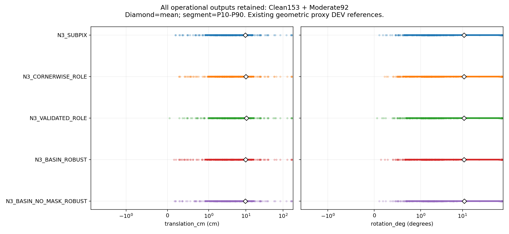
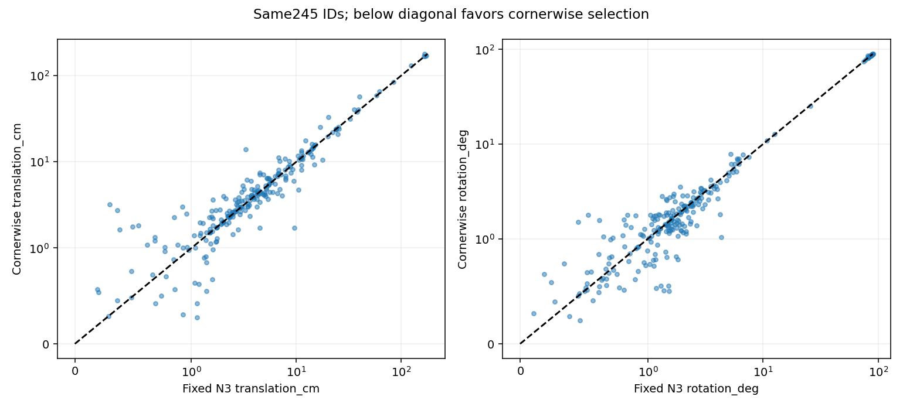
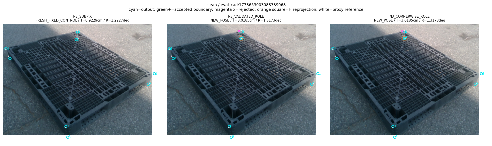
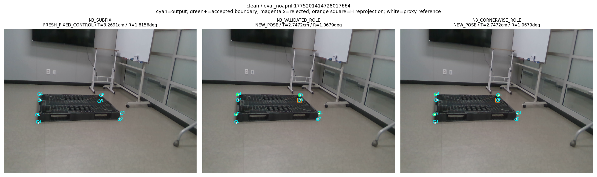
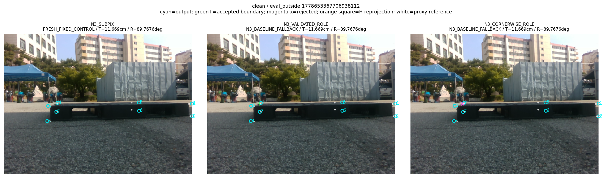
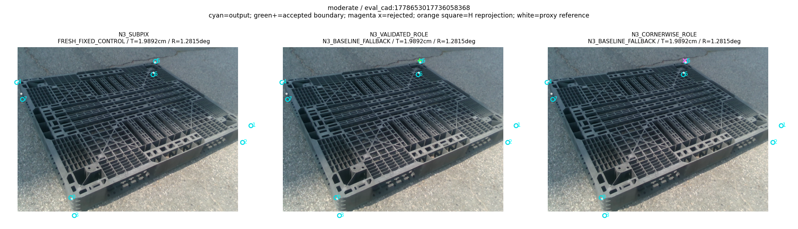
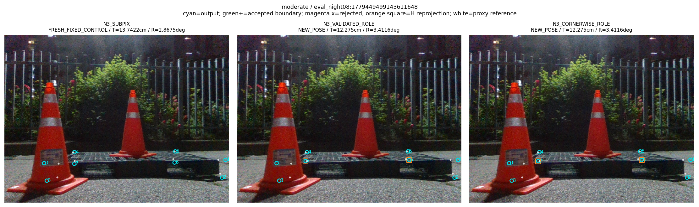
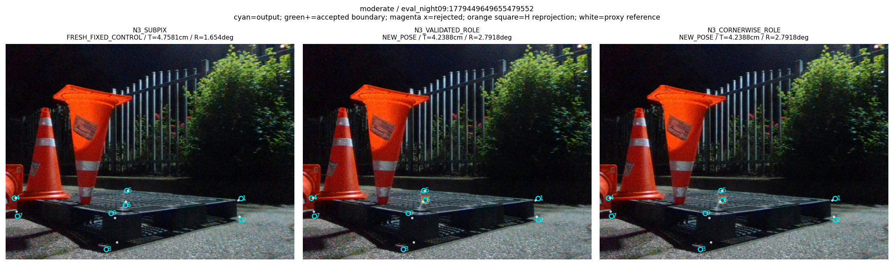

“가림 판단이 일부 틀려도 다른 유효 대응점으로 자세를 구하고 자기 가림 코너를 재투영했을 때, 기존 단순 대조보다 실제 위치·회전이 좋아졌는가?”

**이번 쉬움·중간 245장에서는 위치·회전의 동시 개선을 확인하지 못했다.** 새 코너별 선택은 이전 경계 교체 경로의 위치 평균을 10.34259cm에서 10.07063cm로 줄였지만, 고정 N3→cornerSubPix의 9.75455cm보다 크다. 회전 평균도 새 방법 10.94158°, N3 10.91484°다. N3 대비 평균 차이의 세션 bootstrap 95% 구간은 위치·회전 모두 0을 포함한다. 따라서 모집단에서 유의하게 나빠졌다고 단정하거나, 개선·동등성이 입증됐다고 주장하지 않는다.

실행은 완료됐다. 새 방법은 217장에 새 자세를 산출하고 28장에 원래 N3 출력을 반환했으며 완전 실패는 0장이다. 원래 N3 출력을 반환한 영상과 큰 오차 영상을 모두 포함해 245장 평균을 계산했다. 실제 새 detector/N3/경계 모델, 코너별 검증 PnP, 최종 강건 PnP, 숨은 점 재투영까지 실행했다. 추가 학습·새 RGB 생성·새 어노테이션·실사 GT를 이용한 설정 변경은 이번 단계에서 0이다.

이 보고서의 숫자는 [METRICS.json](METRICS.json), [최종 방법 원행](PREDICTIONS.jsonl.gz), [같은 실행의 Base/N3 대조 원행](FIXED_PREDICTIONS.jsonl.gz), [코너·가림 후단 원행](POSTHOC_ROWS.jsonl.gz)에서 읽었다. 영상별 비교는 [PER_FRAME.csv](PER_FRAME.csv), 독립 산술 검산은 [VERIFICATION.json](VERIFICATION.json)과 [PUBLIC_REVIEW_CHECKS.json](PUBLIC_REVIEW_CHECKS.json)에 있다.

## 무엇을 고쳤고 무엇이 아직 문제인가

과거의 감독 생성 오류와 현재의 관측 선택 실패를 구분해야 한다. 과거 [training.py:91–94](../../../scripts/research/pallet_observation_refiner_20261009_v1/training.py#L91)는 실제 물리 변의 수치 ray miss를 유효한 `no_match` 정답으로 만들었다. 정확한 모서리의 float32 ray가 무한대였다는 사실을 실제 관측 부재로 해석한 오류다. source-test 128장 중 2164개 해당 query의 actual-wire·삼각형·가시성 증거를 따로 검토했고, POSITIVE/NONE/IGNORE를 구분한 감독을 준비했다. 미인증·수치적으로 모호한 경우를 유효한 NONE으로 학습하지 않는 것이 수리의 핵심이다.

그 수리는 이미 끝났고, 수정 감독으로 세 모델을 각 3000업데이트, 총 9000업데이트 학습한 결과도 존재한다. [감독 수리 원행과 검산](../pallet_kp_supervision_repair_20261010_v1/README.md), [수정 감독 학습 완료](../pallet_kp_corrected_supervision_20261010_v1/TRAINING_COMPLETION.json), [수정 감독 후 245장 평가](../pallet_kp_corrected_supervision_20261010_v1/RESULT_KO.md)가 증거다. 첨부 오류 감사의 오래된 `38b1` 시점에서 “수정 후 미학습·미평가”였던 상태를 현재 상태로 옮기면 틀리다. 이번 v3는 그때 학습한 고정 IMAGE_ROLE의 step3000 가중치를 그대로 재사용했다.

현재 남은 문제는 **경계에서 계산한 교점이 원래 RGB 코너보다 정확한지 판단하는 단계**다. 역할 특징과 선 합의, 작은 교점 불확실성만으로 이 상대적 정확도를 보장하지 못했다. 이번에는 다른 N3 점으로 구한 자세에서 경계 후보와 원래 N3 좌표를 직접 비교하는 코너별 선택을 추가했다. 채택 후보의 질은 좋아졌지만, 잘못된 후보 56개가 남았고 최종 자세의 동시 개선으로 이어지지 않았다. 이 결과만으로 56개가 모두 잘못된 물리 변을 선택했다고 단정할 수는 없다. 실사 선의 물리적 소유권을 독립적으로 인증한 자료는 없다.

## 코너와 역할 특징의 실제 정의

모델은 팔레트의 모든 물리 부품·가림 종류를 분류하는 큰 분할기가 아니다. 고정 detector의 8코너에서 12개 의미 변을 만들고, 각 변의 길이 방향 1/8부터 7/8까지 7개 query를 배치한다. query마다 법선 방향 −32부터 +32px까지 65개 위치와 대응 없음 1개를 예측한다. 한 영상의 출력은 84×66개 raw logit이다. 좌표 복원은 `query_center + (bin − 32) × normal`이며 법선·접선의 부호와 bin 순서가 입력과 감독에서 같아야 한다. 정의는 [model.py:35–45](../../../scripts/research/pallet_observation_refiner_20261009_v1/model.py#L35)에 있다.

역할 3채널은 `BOUNDARY / INTERNAL / UNAVAILABLE`이다. 이는 **초기 RGB 점으로 구한 가상 cuboid 재투영의 convex hull**에 대한 기하적 역할이다. hull의 인접 꼭짓점 쌍이면 BOUNDARY, 나머지 의미 변이면 INTERNAL, 초기 자세를 구하지 못하면 UNAVAILABLE이다. [model.py:47–56](../../../scripts/research/pallet_observation_refiner_20261009_v1/model.py#L47)의 코드가 이 정의를 직접 보여준다. 실제 영상의 해당 밝기 경계가 팔레트의 어느 물리 부품에 속하는지 알려주는 정답 역할은 아니다. 초기 자세가 틀리면 역할도 달라질 수 있다. source cache에 당시 Base feature 초기 자세·재투영이 남아 있지 않아, 역할 one-hot 확인과 별개로 그 hull 의미를 저장 원행 산술만으로 독립 재현하는 것은 불가능하다. source GT 자세를 그 초기 자세로 대신하지 않았다. 이 검산 공백은 구현 오류의 증명이나 가림 완전 분류를 성공 조건으로 삼을 근거가 아니다.

입력 28채널은 RGB 밝기·법선/접선 gradient 3개, 공유 detector neck 16개, query 기하 6개, 역할 3개다. [model.py:59–88](../../../scripts/research/pallet_observation_refiner_20261009_v1/model.py#L59)는 BGR→GRAY, 원영상 후보 좌표, canvas affine, `align_corners=False`, FP16 반올림을 포함한다. 이전 독립 감사에서 source CAL128의 RGB 3채널과 neck 16채널은 보존 cache와 FP16 수치 일치를 확인했다. 기하 6채널·bin/변 ID·원천 투영도 확인했다. 역할 3채널은 공유 코드와 schema를 확인했으며, 모든 입력 28채널을 새로 재생해 수치 일치시켰다고 넓혀 주장하지 않는다. 감사의 구체적 범위와 실패·재개 기록은 [기전 감사](../pallet_corner_mechanism_audit_20261010_v1/README.md), [source neck 감사](../pallet_source_neck_contract_20261010_v1/README.md)에 있다.

source P0의 실제 mesh에서 감독 지원을 입증한 의미 변과 실사의 물리 경계는 구분한다. source calibration에서 지원하지 않은 변은 새 모델 선 제안을 보류한다. 이것은 MODEL_CALIBRATION_UNSUPPORTED이지 실사에 그 물리 변이 없다는 판정이 아니다. 그 코너의 원래 N3 RGB 관측은 계속 사용할 수 있다. source CAL에서 actual-wire 교점과 해당 native cuboid annotation의 평균 차이는 약 0.000031px, 최대 약 0.000246px였으므로 그 둘의 source 좌표 정의가 크게 어긋났다는 증거도 없다. 이러한 반증을 보존하고, 아직 확인하지 못한 실사 소유권·좌표 정확도 문제와 구분한다.

## 이번에 추가한 코너별 선택

선·코너 후보 생성과 source-only calibration은 이전 v2의 고정 규칙을 재사용했다. 선은 서로 다른 query의 합의와 지지 길이를 요구하며, 최종 TLS 선에서 모든 지지점의 잔차가 각 허용 반경 안에 남는지 검사한다. 두 선의 교점에는 각도·불확실성·영상 범위 검사를 적용한다. 실제 계산된 코너 반경은 8px 이하여야 한다. 원래 N3가 있는 경우 후보가 그 좌표에서 8px 이내인 기존 basin 조건도 유지했다. 같은 선의 점과 선을 최종 fit에 중복 넣지 않는다. 이번 네 경로는 point-only이고 별도 point+line 설정을 추가하지 않았다.

새 선택은 후보 코너 k마다 초기 자기 가림 H와 k를 뺀 **다른 N3 관측점**으로 동일한 유한 4점 부분집합 강건 PnP를 실제로 실행한다. k는 fit 제외 ID일 뿐 새 자기 가림 라벨이 아니다. 이 검증 자세에서 후보의 잔차가 8px 이내이며 원래 N3보다 엄격하게 작을 때만 실제 후보 좌표를 선택한다. 동점, 관측 부족, 수치 실패, 미해결 다중해는 N3 좌표를 유지하고 사유를 기록한다. 영상당 최대 8회이고 동일 N3/K/치수/4점 ID의 가설을 재사용한다. [selection.py:100–169](../../../scripts/research/pallet_cornerwise_refiner_20261010_v3/selection.py#L100)에 실제 제외·검증·선택이 있다.

검증 자세의 재투영 좌표를 새 관측으로 사용하지 않는다. 최종 fit에는 선택된 실제 경계 좌표와 남은 N3 RGB 좌표만 들어가며 초기 H는 제외한다. 새 최종 R,t가 생기면 H의 초기 좌표를 그 자세의 재투영으로 대체한다. 그 재투영점을 다시 독립 관측처럼 PnP에 넣지 않는다. 새 자세가 없는 경우에는 N3 기본 출력을 반환하고 H를 교체했다고 주장하지 않는다. 이 구분은 [selection.py:174–200](../../../scripts/research/pallet_cornerwise_refiner_20261010_v3/selection.py#L174), [pipeline.py](../../../scripts/research/pallet_cornerwise_refiner_20261010_v3/pipeline.py)에 기록돼 있다.

검증 fit의 입력에는 k와 H가 없지만 **초기 N3 pose prior에는 k와 H 좌표의 영향이 남아 있다**. 초기 자세에서 H를 추정하고 같은 초기 자세의 치수·재투영 근방을 해 선택에 사용하기 때문이다. 따라서 self-occ를 무시한다는 말은 LOO·최종 PnP의 관측과 fit에서 제외한다는 뜻이지, 처음부터 모든 계산에서 그 영향이 사라진다는 뜻은 아니다. k를 임시 제외한 것을 새 self-occ 판정으로 세지도 않는다. 완전히 통계적으로 독립인 검증 또는 실제 물리 경계 소유권 증명이라고 부르지 않는다. 다른 잘못된 점이 일관된 자세를 만들거나 초기 prior가 잘못된 해를 선호하면 후보 선택도 틀릴 수 있다. 이 한계는 코드의 `LOO_initial_prior_includes_heldout_influence=True`, `fully_independent_validation=False`로 숨기지 않고 출력한다.

## 평가 범위와 고정 대조

새 실사 평가는 사용자의 최신 범위 지정에 따라 쉬움153장+중간92장=245장, 13세션이다. 기존 난도 UI의 clean/moderate를 사용하고 severe74장을 제외했다. 중간 라벨에는 부분 가림이 포함될 수 있어 “가림이 전혀 없는 245장”이라고 하지 않는다. [고정 cohort](../pallet_kp_corrected_supervision_20261010_v1/COHORT.json), [평가 계약](EVALUATION_CONTRACT_KO.md), [실행 전 프로토콜](PROTOCOL.json)에 ID와 분할·비교·규칙을 묶었다. 역사적 전체319장 결과와 원행은 보존한다.

|이 보고서의 이름|실제 경로|주요 비교 목적|
|---|---|---|
|Base|고정 초기 RGB estimator의 기존 출력|원래 단순 대조|
|N3|고정 N3→cornerSubPix의 기존 출력|주 비교 대조|
|새 코너별 선택|N3_CORNERWISE_ROLE|코너마다 실제 다른 점의 자세로 후보 채택|
|이전 경계 교체|N3_VALIDATED_ROLE|같은 후보·basin 조건, 새 코너별 검증 없음|
|N3+H 강건|N3_BASIN_ROBUST|새 경계 좌표 없이 예측 H 제외+같은 강건 PnP|
|N3 무마스크 강건|N3_BASIN_NO_MASK_ROBUST|가림 판단 없이 같은 강건 PnP|

네 새 경로는 같은 새 detector/N3/ROLE 관측 실행을 공유하고 980개 자세 출력을 봉인했다. 같은 입력에서 새로 산출한 Base/N3 490개도 봉인했다. GT·사람 가림·자세 점수는 봉인 후 평가에만 사용했다. 총 1470개 평가 행이고, fixed control은 새 강건 자세가 아닌 기존 고정 경로 출력이므로 NEW_POSE 0으로 위장 분류하지 않고 FRESH_FIXED_CONTROL로 구분했다.

## 전체 운용 결과: 큰 오차와 기본 출력 반환 포함

모든 방법의 전체 운용 산출집합은 같은 245장이다. 아래 분산은 표본분산(ddof=1), SD는 그 제곱근이다. 위치·ADDsym의 분산 단위는 cm², 회전은 deg²다. 큰 오차 영상을 제외하지 않았으므로 SD·P90·최대값이 평균과 함께 중요하다.

|방법|새 자세|기본 N3 반환|완전 실패|전체 산출|
|---|---:|---:|---:|---:|
|Base|고정 경로 245|해당 없음|0|245|
|N3|고정 경로 245|해당 없음|0|245|
|새 코너별 선택|217|28|0|245|
|이전 경계 교체|220|25|0|245|
|N3+H 강건|217|28|0|245|
|N3 무마스크 강건|229|16|0|245|

|위치 오차 cm|평균|분산|SD|중앙값|P90|최대|
|---|---:|---:|---:|---:|---:|---:|
|Base|12.18835|538.57907|23.20731|6.01080|23.19187|183.07850|
|N3|9.75455|575.93602|23.99867|3.59735|15.08501|174.75683|
|새 코너별 선택|10.07063|602.36292|24.54308|3.75120|16.00999|178.98303|
|이전 경계 교체|10.34259|597.88990|24.45179|4.12993|16.26377|178.98303|
|N3+H 강건|9.79480|596.45533|24.42243|3.66025|15.88846|178.98303|
|N3 무마스크 강건|9.65211|574.35342|23.96567|3.48213|16.33792|174.75683|

|회전 오차 degree|평균|분산|SD|중앙값|P90|최대|
|---|---:|---:|---:|---:|---:|---:|
|Base|14.23284|851.38416|29.17849|1.83974|82.81064|90.00917|
|N3|10.91484|665.18060|25.79110|1.66599|76.09532|89.77763|
|새 코너별 선택|10.94158|670.56169|25.89521|1.62512|76.18592|89.79172|
|이전 경계 교체|10.95633|668.17751|25.84913|1.65737|76.18592|89.77386|
|N3+H 강건|10.94988|670.35242|25.89116|1.62039|76.18592|89.79172|
|N3 무마스크 강건|11.01512|665.27335|25.79289|1.86920|76.09532|89.77763|

|ADDsym cm|평균|분산|SD|중앙값|P90|최대|
|---|---:|---:|---:|---:|---:|---:|
|Base|22.43195|1506.00220|38.80724|6.40506|110.03653|188.99152|
|N3|17.02865|1298.81087|36.03902|3.93694|68.43149|180.98844|
|새 코너별 선택|17.29633|1324.81025|36.39794|4.01117|68.67273|185.90309|
|이전 경계 교체|17.57320|1315.85786|36.27476|4.49849|68.67273|185.90309|
|N3+H 강건|17.04077|1322.19657|36.36202|4.03061|68.67273|185.90309|
|N3 무마스크 강건|16.93721|1300.33853|36.06021|3.87052|68.67273|180.98844|

각 점은 전체 운용 원행이다. 축은 큰 오차도 보여주도록 변환했고, 숫자 통계는 변환 전 원행에서 계산했다. fallback을 제외해 큰 오차가 사라진 분포를 그리지 않았다.

### 쉬움과 중간을 따로 읽기

|범위|방법|위치 평균 cm|회전 평균 °|ADDsym 평균 cm|새 자세/기본 반환|
|---|---|---:|---:|---:|---:|
|쉬움153|Base|12.84635|10.62820|17.93860|고정153|
|쉬움153|N3|10.10707|7.58458|12.91513|고정153|
|쉬움153|새 코너별 선택|10.43086|7.57062|13.19534|139/14|
|쉬움153|이전 경계 교체|10.85390|7.60179|13.61597|139/14|
|쉬움153|N3+H 강건|10.24277|7.57523|13.03640|139/14|
|쉬움153|N3 무마스크 강건|10.12285|7.67428|12.96019|145/8|
|중간92|Base|11.09407|20.22752|29.90457|고정92|
|중간92|N3|9.16828|16.45321|23.86960|고정92|
|중간92|새 코너별 선택|9.47155|16.54763|24.11645|78/14|
|중간92|이전 경계 교체|9.49227|16.53507|24.15423|81/11|
|중간92|N3+H 강건|9.04980|16.56207|23.70021|78/14|
|중간92|N3 무마스크 강건|8.86925|16.57107|23.55118|84/8|

쉬움에서는 새 방법의 회전 평균이 아주 조금 낮지만 위치는 높다. 중간에서는 위치·회전 평균 모두 높다. 각 층의 분산·SD·중앙값·P90·최대값은 [METRICS.csv](METRICS.csv)와 JSON의 strata에 모두 있다. 두 층의 평균을 단순 평균하지 않고 실제 153/92개 원행을 합쳐 전체245 통계를 냈다.

### 새 자세만과 공통 산출집합

|새 코너별 선택의 출력 상태|n|위치 평균/중앙값/P90 cm|회전 평균/중앙값/P90 °|ADDsym 평균 cm|
|---|---:|---|---|---:|
|전체 운용|245|10.07063 / 3.75120 / 16.00999|10.94158 / 1.62512 / 76.18592|17.29633|
|새 자세만|217|10.82649 / 3.95562 / 20.27819|10.84685 / 1.67643 / 75.60693|17.91878|
|기본 출력 반환|28|4.21266 / 2.46549 / 11.34295|11.67573 / 1.59192 / 34.35913|12.47230|

새 자세만의 평균이 다른 전체245 평균과 직접 같은 모집단 비교가 되지는 않는다. 고정 N3와 같은 217개 ID로 비교하는 `candidate_new_pose`, 양쪽 모두 새 자세인 `both_new_pose`, 전체 공통 산출245인 `common_operational`을 각각 보존했다. 고정 대조는 NEW_POSE로 표시되지 않으므로 그 대조와의 `both_new_pose`는 비어 있고 CI도 NA다. 빈 집합을 성공이나 0오차로 채우지 않았다.

## 같은 영상에서의 차이와 신뢰구간

13세션을 재표집하는 이미 고정된 10000×13 draw 행렬을 재사용했다. Δ는 새 코너별 선택에서 비교 방법을 뺀 값으로, 음수가 개선이다. 아래는 전체 공통245에 대한 원행 평균 차이와 세션 bootstrap 95% 구간이다.

|비교 방법|Δ위치 cm [95% CI]|Δ회전 ° [95% CI]|ΔADDsym cm [95% CI]|
|---|---|---|---|
|고정 N3|+0.31608 [−0.13061, +0.62895]|+0.02674 [−0.03611, +0.10870]|+0.26768 [−0.09983, +0.52522]|
|이전 경계 교체|−0.27196 [−0.61513, −0.00914]|−0.01475 [−0.04780, +0.02641]|−0.27687 [−0.64359, −0.01267]|
|N3+H 강건|+0.27583 [−0.01077, +0.48599]|−0.00830 [−0.02911, +0.01501]|+0.25556 [−0.01731, +0.45602]|
|N3 무마스크 강건|+0.41851 [−0.03134, +0.78997]|−0.07354 [−0.15470, +0.00535]|+0.35911 [−0.07765, +0.73541]|

이전 경계 교체 대비 위치·ADDsym 평균은 줄었고 그 두 구간은 0보다 아래에 있다. 그러나 주 질문인 고정 N3 대비 위치·회전 동시 개선은 성립하지 않는다. 세션13개, 같은 개발 영상과 여러 비교를 사용하는 결과이므로 새로운 촬영 도메인이나 일반 모집단에 대한 보장으로 해석하지 않는다. 이 보고서는 결과를 보고 임계값·seed·학습량을 다시 선택하지 않았다.

대각선의 어느 쪽인지 영상별로 볼 수 있다. 전체 평균의 작은 차이와 개별 영상의 큰 오차를 함께 보여준다. paired ID, 각 scope의 분모, 비어 있지 않은 재표집 수는 METRICS에 기록돼 있다.

## 코너별 선택은 실제 무엇을 줄였나

|선택 단계|개수|후단 참조에서 N3보다 정확|N3보다 부정확|
|---|---:|---:|---:|
|선·교점 검사를 통과한 후보|447|192|255|
|N3 8px basin 안에서 검증 fit 요청|423|행별 기록|행별 기록|
|새 코너별 선택에서 채택|140|84|56|
|새 자세 출력에 실제 표시된 채택 좌표|140|84|56|

447개 가운데 24개는 native N3와 8px보다 멀어 실제 검증 fit을 요청하지 않았다. 남은 423개는 실제 다른 관측점 fit을 실행했다. 50개는 검증 자세를 얻지 못했고, 90개는 후보의 검증 잔차가 허용 범위를 넘었으며, 143개는 원래 N3가 검증 자세에 더 가까워 거절됐다. 140개를 채택했다. 계산된 후보·채택 후보·최종 출력 좌표를 서로 같은 것으로 세지 않았다.

전체447 후보의 참조 오차 변화 평균은 +0.66234px, 중앙값 +0.29443px였다. 채택140의 평균은 −0.22600px, 중앙값 −0.34186px, P90 +2.72296px, 최대 +6.80328px였다. 채택 집합의 N3보다 정확한 비율은 84/140=60%다. 과거 v2의 실제 교체423개는 개선186/악화237이었다. 코너별 선택이 상대적으로 나쁜 후보를 줄인 증거는 있지만 채택140개 중 56개의 악화가 남았고, 이 작은 평균 코너 개선을 최종 자세 개선이라고 대신 보고하지 않는다.

현재 공백은 “선의 일부 지지가 합의한다”와 “교점이 현재 N3보다 실제 더 정확하다” 사이에 있다. 선끼리 공통 방향·위치 편향을 가지면 내부 잔차나 작은 교점 covariance는 충분히 작을 수 있다. 다른 N3 점으로 만든 검증 자세도 잘못된 대응들의 합의를 따를 수 있다. 실제로 어느 원인이 몇 %를 차지하는지 이 자료만으로 인과 비율을 정할 수는 없다. 잘못된 실제 부품 경계의 소유권, 공통 선 편향, 초기 pose prior의 영향, 관측 배치의 약함은 남은 후보 원인이며 독립 물리 소유권 자료 없는 상태에서 단정하지 않는다.

## 가림 마스크와 자세 성능은 따로 계산했다

사람 상태가 알려진 코너에서 초기 예측 H와 사람 SELF 상태가 다른지를 마스크 오판으로 기록했다. 전체 가림 종류를 완벽히 분류했다고 주장하지 않는다. 아래 자세 비교는 같은 영상의 **고정 N3** 대비 위치·회전이다.

|초기 H의 알려진 상태와의 관계|전체|위치·회전 둘 다 개선|둘 다 악화|혼합 또는 변화 없음|
|---|---:|---:|---:|---:|
|알려진 상태에서 틀림|61|10|18|33|
|알려진 상태와 일치|184|38|41|105|

틀린 마스크61장 중 새 자세54장, 기본 반환7장이다. 둘 다 개선한10장과 둘 다 악화한18장은 모두 실제 새 자세 산출이다. 일치한184장 중 새 자세163장, 기본 반환21장이다. 즉 **마스크가 틀려도 자세가 좋아진 경우10장**과 **마스크가 맞아도 자세가 나빠진 경우41장**이 모두 있다. 마스크 차이 자체로 프레임 전체를 실패시키지 않았다. 재추정 후 hidden set이 달라진5장도 별도 기록했다.

무마스크 강건 대조는 229장에 새 자세를 내고 위치 평균9.65211cm로 N3보다 낮았지만 회전 평균11.01512°로 높았다. 따라서 이 데이터에서 마스크 없는 강건 PnP가 모든 목표에 충분하다고도, 새 ROLE/가림 판단기가 반드시 필요하다고도 결론 내릴 수 없다. 새 경계 후보를 넣지 않은 N3+H 강건 대조와 비교하면 새 선택의 위치 평균은 +0.27583cm다. 현재 실제 자세 개선을 경계 모델의 효과로 주장할 수 없다.

## 직접 보이는 코너의 손상과 숨은 점 재투영

참조는 같은 고정 N3 native phase로 정렬했다. 아래 “실제 재투영 H”는 새 자세에서 실제 교체한 예측 H의 ID이며, 사람 SELF335개와 같은 집합이 아니다. 예측 H에는 오판한 직접 가시 코너가 들어갈 수도 있다.

|코너 집합|유효 참조 수|N3 평균/중앙값/P90 px|최종 출력 평균/중앙값/P90 px|
|---|---:|---|---|
|사람 DIRECT_VISIBLE|1503|19.85302 / 4.42804 / 21.43421|19.82895 / 4.40149 / 21.32859|
|사람 SELF_OCCLUDED|335|19.65428 / 7.06714 / 26.52356|18.03207 / 4.57636 / 26.49869|
|실제로 재투영 교체한 예측 H|257|17.64366 / 6.52662 / 21.87661|15.50319 / 3.82355 / 20.55152|

DIRECT_VISIBLE에서 원래 N3 오차가 5px 이하였는데 출력이 10px를 넘은 손상은 0개다. 모든 직접 가시 점이 개선됐다는 뜻은 아니다. 같은 집합의 전체 오류 분포와 코너별 변화는 POSTHOC에 보존돼 있다. 사람 SELF와 실제 H의 오차가 줄어도 최종 위치·회전 평균이 동시에 좋아지지 않았으므로 숨은 점 그림이 좋아진 것을 자세 성공으로 보고하지 않는다. fit에 쓰인 점, 최종 inlier, 남은 정확/부정확/참조 미상 대응점, 2D/3D 배치 통계도 후단 원행에서 따로 검토할 수 있다.

## 고정된 실제 영상 여섯 사례

아래 ID는 새 점수 확인 전에 기존 고정 사례 프로토콜에서 선택했다. 쉬움3장·중간3장으로, 이번 결과가 좋거나 나쁘다는 이유로 다시 고르지 않았다. 사후 참조를 덧그린 **설명용 사례**이며 대표 성능의 근거는 전체245 원행이다. 원본 RGB에 계산 좌표와 기존 참조만 표시했으며 새 수동 어노테이션은 만들지 않았다. [FIGURE_BINDINGS](FIGURE_BINDINGS.json), [18개 사례 방법 원행](FIGURE_CASE_ROWS.jsonl.gz)이 그림·ID·선택 프로토콜을 묶는다.

각 그림은 N3 / 이전 경계 교체 / 새 코너별 선택 순서다. 청록 원은 실제 출력 좌표, 초록 +는 채택 경계 좌표, 자홍 ×는 거절 경계 후보, 주황 사각형은 실제 H 재투영, 흰 점은 기존 참조다. 기본 출력 반환에서는 후보가 계산됐어도 해당 후보를 최종 출력으로 교체하지 않는다.

|사례|고정 ID|N3 위치/회전|새 선택 위치/회전|새 출력 상태|
|---|---|---|---|---|
|1 쉬움|eval_cad:1778653003088339968|0.92290cm / 1.22275°|3.01854cm / 1.31733°|NEW_POSE|
|2 쉬움|eval_noapril:1775201414728017664|3.26909cm / 1.81556°|2.74724cm / 1.06793°|NEW_POSE|
|3 쉬움|eval_outside:1778653367706938112|11.66896cm / 89.76764°|동일|N3_BASELINE_FALLBACK|
|4 중간|eval_cad:1778653017736058368|1.98922cm / 1.28154°|동일|N3_BASELINE_FALLBACK|
|5 중간|eval_night08:1779449499143611648|13.74224cm / 2.86746°|12.27500cm / 3.41162°|NEW_POSE|
|6 중간|eval_night09:1779449649655479552|4.75808cm / 1.65402°|4.23880cm / 2.79178°|NEW_POSE|

사례1은 새 경계 좌표 채택 없이 H/강건 후단만 실행한 경우다. 위치·회전이 모두 더 나쁘므로 모든 변화가 경계 교체 때문이라고 귀속하면 틀린다.

사례2는 코너0,1,4,5의 실제 경계 좌표를 채택했고 위치·회전이 모두 낮아졌다. 이전 경로와 새 선택의 출력은 이 사례에서 같다.

사례3은 큰 회전 오차를 포함한 기본 N3 출력으로 반환했다. 실패 프레임으로 빼거나 그래프 밖으로 제거하지 않았다. 이전 경로에 경계 후보가 있어도 최종 기본 반환에는 사용되지 않았다.

사례4도 기본 출력 반환이다. 기존 후보와 새 채택의 차이가 전체 프레임 실패 또는 새 자세 성공을 의미하지 않는다.

사례5는 새 경계 좌표 채택 없이 위치는 개선되고 회전은 악화했다. H 재투영이 있는 것만으로 위치·회전 동시 성공이라고 부르지 않는다.

사례6도 위치 개선·회전 악화다. 사후 참조점은 실제 배포 입력에 들어가지 않았다.

## 처리시간: 캐시 재생이 아닌 실제 전체 경로

245장 cohort에서 사전 고정한 26장/13세션 runtime panel을 사용했다. 방법당 warmup20회+측정130회, 총 **600회 fresh 전체 경로**를 실제 실행했고 600회 출력 parity 검사가 모두 통과했다. 원영상 decode26회와 모델 적재는 측정 구간 밖이다. 측정 구간은 메모리의 원영상·K·치수에서 새 detector, 해당 경로의 N3·ROLE, 초기 자세, 코너별 실제 검증 PnP, 최종 강건 PnP, H 재투영과 출력 조립까지다. [RUNTIME.json](RUNTIME.json), [600회 시간·출력 원행](RUNTIME_ROWS.jsonl.gz)에 실제 측정과 자원 점검이 있다.

|실제 전체 경로, 측정 n=130|평균 ms|분산 ms²|SD ms|중앙값 ms|P90 ms|최대 ms|
|---|---:|---:|---:|---:|---:|---:|
|Base|12.59319|1.66294|1.28955|12.39417|14.37729|15.65937|
|N3→cornerSubPix|16.45845|1.82797|1.35203|16.39295|18.14100|19.67614|
|N3 무마스크 강건|48.87315|108.18973|10.40143|50.68900|54.16782|125.49777|
|새 코너별 선택|69.28186|545.03008|23.34588|61.80419|102.88634|164.76822|

시간은 기존 단계 시간의 합이나 봉인 좌표를 재생한 시간으로 만들지 않았다. RTX3080의 해당 실행 환경에서 batch1로 측정한 값이며 원영상 I/O 포함 응답시간이나 다른 장비의 보장은 아니다. runtime에는 actual detector root601회(초기 warmup1 포함), N3 450회, ROLE150회, 코너별 검증197회가 기록돼 있다. OpenCV 실제 호출은 solvePnP1800, Generic47787, LM3357, cornerSubPix3513회다. timing을 실행하는 동안 다른 연구 수치 작업을 멈췄고 receipt에 간섭 검사가 남아 있다.

## 실행 중단·재개와 검산의 증거

첫 정확도 실행은 160장을 완료한 뒤 자원 guard가 중단했다. 방법 수치 예외로 160장이 실패한 것이 아니다. 다만 guard가 거절한 정확한 자원 snapshot은 보존되지 않아 원인 프로세스·온도 조건을 특정하지 않는다. [첫 실행 receipt](INFERENCE_RECEIPT.json)의 `complete=false`와 [실패 기록](INFERENCE_FAILURE.txt)을 그대로 보존했다. 자원 확인 뒤 남은85장만 같은 고정 규칙으로 실행했다. 성능을 보고 설정을 바꿔 다시 실행하지 않았다.

[RESUME_PROTOCOL](RESUME_PROTOCOL.json)과 [RESUME_RECEIPT](RESUME_RECEIPT.json)는 prefix160+suffix85를 명시한다. 최종 gzip의 첫 member는 중단 때의 압축 prefix bytes 그대로이며 suffix를 두 번째 member로 덧붙였다. prefix의 원행 수치는 바뀌지 않았다. prefix Base/N3 parity는 저장된 관측으로 확인한 재생 검사이고 남은85장의 parity는 fresh 실행 검사다. 첫 실행에 남지 않은 bank/resource checklist를 재구성했다고 주장하지 않는다.

실사 정확도 경로의 합산 실제 호출은 detector prediction245(root hook247: 두 시도의 초기 warmup 포함), N3/ROLE 각각245, 초기 N3 자세245, Base 대조 자세245, ROLE feature 초기 자세245, 코너별 검증423, 네 경로의 최종 pose 요청980이다. OpenCV solvePnP1470, Generic66140, LM5373, cornerSubPix1885회다. 합산 호출량은 실행량이며 첫 실행·재개 wall time을 더해 새 latency라고 보고하지 않는다. 세부 비용·0회 항목·보호 증거는 [BUILD_LEDGER](BUILD_LEDGER.json)에 있다.

geometry980개와 fixed490개를 먼저 봉인한 다음 GT 평가를 했다. 점수 계산 중 새 fitting entry를 금지했고, 1470행을 같은 기존 scorer로 평가했다. [SCORING_RECEIPT](SCORING_RECEIPT.json), [SCORING_PARITY](SCORING_PARITY.json), [GEOMETRY_SEAL](GEOMETRY_SEAL.json)이 순서와 parity를 기록한다. mask 차이·미해결 해·관측 부족·기본 반환은 output state와 solver 진단으로 구분한다. 기본 반환을 NEW_POSE로 바꾸거나 참조 미상을 올바른 점으로 세지 않았다.

독립 [VERIFICATION](VERIFICATION.json)은 통계 구현을 import하지 않고 봉인 점수·후단 원행·고정 bootstrap draws를 읽어 63개 paired group, 189개 metric CI slot을 검산했다. 실패0, 최대 수치 차이 9.10×10⁻¹³다. 1470개 점수 행, 980개 후단 행을 확인했고 모델·새 GT 평가·PnP·ray·학습·RGB 생성은 0이다. [공개 review 검산](PUBLIC_REVIEW_CHECKS.json)은 공개 자료만으로 972개 모멘트와 35개 입력 binding을 확인했다. [독립 최종 재투영 검산](REPROJECTION_CHECKS.json)은 네 방법980행 중 실제 새 자세883행의 H776개 재투영, 비가림 관측6288개, 중심980개를 scalar 행렬 산술로 검사했고 실패0, 최종 R,t 재투영과 출력의 최대 차이 2.28×10⁻¹³px였다. 이는 기록된 참조·출력과 산술의 검산이며 독립 실측 GT의 물리적 정확성을 입증하는 것은 아니다.

원본 repository·가중치·사용자 변경·기존 게시 실험은 보호했다. 보호 receipt의 16584개 기존 tracked file hash와 원본 main/user state를 확인했으며, 이번 단계는 별도 namespace에 새 결과를 쓴다. 추가 seed, 6D loss, PnP 역전파, 대형 분할망, CLIP/DINO, 새 N3 학습은 없다. 기존 source 정확 감독이 있어 새 RGB를 만들지 않았으므로 원래 요구의 통제된 네 변형 source 실험을 수행했다고 주장하지 않는다. 그것은 여전히 별도의 coverage 제한이다.

추가 [LOO 제외 검산](LOO_EXCLUSION_CHECKS.json)은 저장 원행의 실제423회 LOO에서 H∪{k}가 `used`, `fit_input_ids`, `final_inliers`, `generator_ids`에서 모두 빠졌는지 검사했다. 최종735개 마스크 경로도 초기 H를 제외했고, 별도245개 무마스크 대조는 H를 적용하지 않았다. 채택140개 입력은 LOO 재투영이 아닌 실제 후보 좌표였다. 실패0이며 새 PnP·모델·GT 평가는 0이다. [추가 검산 실행량](SUPPLEMENTAL_CHECKS.json)은 기존 완료 BUILD_LEDGER를 덮어쓰지 않고 후속 읽기 전용 검사를 기록한다.

## 사용 가능성과 남은 목표

[README API](README.md)와 [재현 절차](REPRODUCE.md)로 원영상 BGR·K·실제 W,H,D 미터를 받아 코너 선택과 최종 자세를 실제 실행할 수 있다. 입력에 GT·사람 가림·난도·점수 cache가 필요하지 않다. 부족한 관측과 수치 실패는 기록해 기본 N3로 반환하고, 새 자세를 얻은 H는 반드시 재투영으로 대체한다. 따라서 계획이나 scaffold에 그친 상태는 아니다.

다만 “고정 N3보다 실제 위치·회전을 동시에 개선하는 보정기”라는 목표는 아직 달성하지 못했다. 가림 완전 분류는 성공의 필요조건이 아니었고 틀린 H에서도 개선10장이 존재했다. 강건 PnP만으로도 일부 위치 평균 개선을 얻었지만 회전까지 좋아지지 않았다. 코너별 선택은 이전 경계 교체의 악영향을 줄였지만 채택한56개 코너의 상대 정확도 오류와 공유 초기 prior의 한계가 남았다. 숨은 점 재투영 오차의 감소는 실제 최종 자세 개선을 대신하지 않는다. 현재 결과로 ROLE 특징·새 경계 모델의 필요성이나 물리 소유권 오류의 원인 비율을 확정할 근거는 없다.
