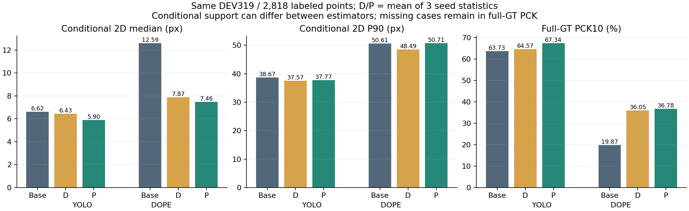
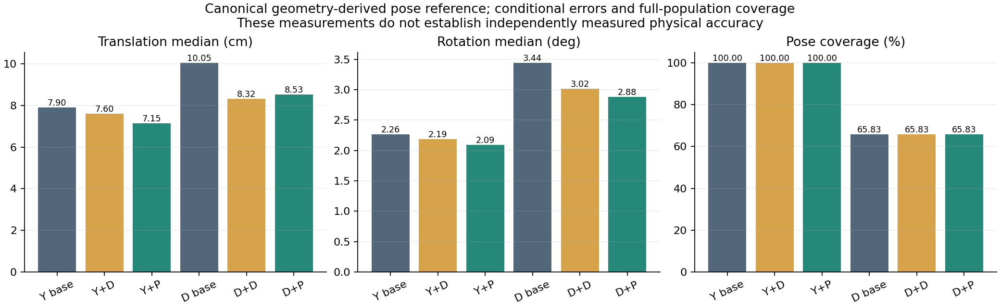
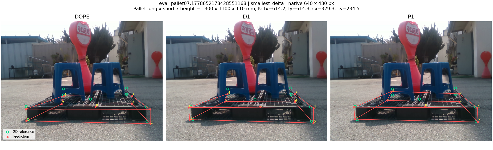
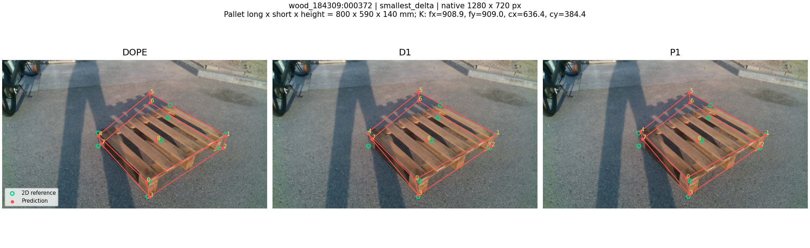
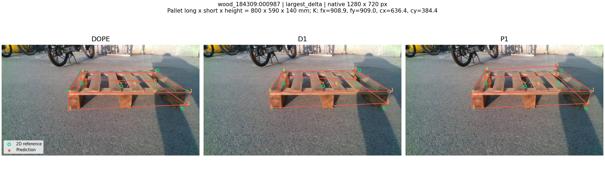
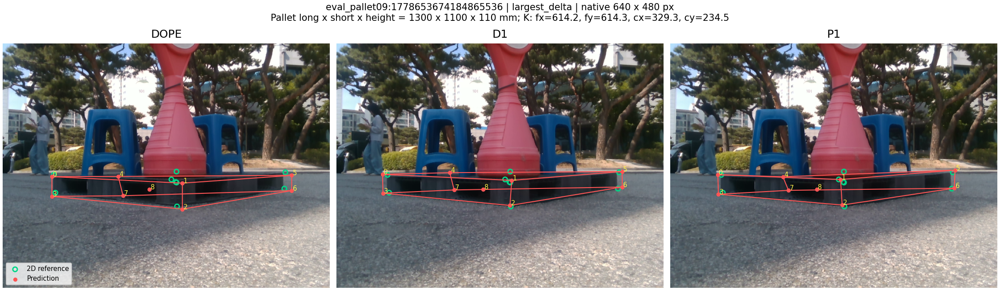
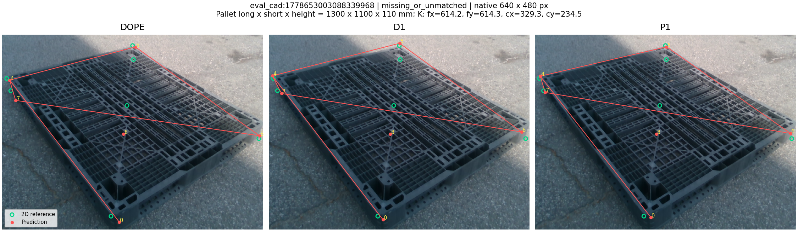
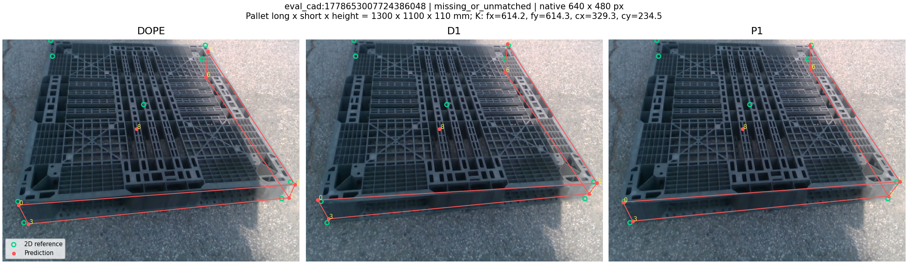
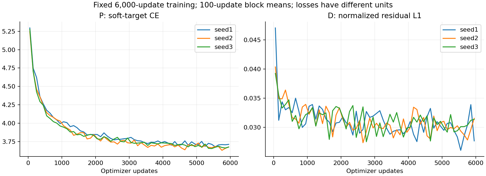

# DOPE에서의 P 보정기 검증 — IEEE Sensors 원고용

검토일: 2026-10-01. DOPE에서도 P의 조건부 2D 중앙값 감소를 관찰했고, 재사용 DEV의 세션 단위 구간도 감소 방향을 지지한다.

## 이 실험이 답하는 질문

교수님이 요구한 세 기반 추정기 검증 중 DOPE 부분이다. 기존 YOLO/P/D 결과와 새 DOPE/P/D 전후 비교를 같은 DEV319장·13세션·주석2,818점에서 정리했다. 세 번째 ResNet-18 결과는 별도 실험이며 이 두 기반 표만으로 세 모델 검증을 완료했다고 표시하지 않는다. DOPE 자체와 YOLO의 순위를 보정 효과로 해석하지 않는다. 두 기반 추정기는 고정했고, 각자의 예측 오류와 내부 특징에 대해 head를 따로 학습한다. 동일 YOLO 가중치의 무학습 전이나 모든 backbone 일반화를 뜻하지 않는다.

## 실제 실행과 통제

합성 TRAIN55,980 / calibration1,004 / selection1,031 / heldout1,985 분할을 재사용했다. 실제 DOPE 예측과 GT의 box IoU≥0.5 및 공동 유효 코너로 학습 행을 고정했고, 전체 6만 장의 실패 기록은 유지했다. 새 실사 학습은0장이다. P와 직접회귀 D는 각각3seed, seed당6,000updates×batch16이며 같은 seed의 두 head는 같은 행 순서·동결 특징을 썼다. 시험용2updates씩은 폐기한 별도 head로 기록했다.

실제 DOPE TRAIN 사용 행: **44,063장**. P/D trainable parameters는 각각 **22,034 / 22,522**. YOLO P의18,962와 채널 adapter가 달라 파라미터 수가 같지는 않다.

[사전 고정 조건](PROTOCOL.json) · [입력 완료](SOURCE_CACHE_COMPLETE.json) · [GPU 검산](GPU_SMOKE.json) · [학습 완료](TRAINING_COMPLETE.json) · [합성 선택](SELECTION.json) · [합성 heldout](SYNTHETIC_HELDOUT.json)

## 주 결과

| 기반 | 보정 | 2D 중앙값 px↓ | P90 px↓ | 전체 GT PCK10 %↑ | 조건부 성공 장수 | T cm↓ | R deg↓ | pose coverage %↑ |
|---|---|---:|---:|---:|---:|---:|---:|---:|
| YOLO | baseline | 6.616 | 38.670 | 63.733 | 311/319 | 7.897 | 2.262 | 100.000 |
| YOLO | D | 6.430 | 37.566 | 64.573 | 311/319 | 7.597 | 2.190 | 100.000 |
| YOLO | P | 5.905 | 37.766 | 67.341 | 311/319 | 7.153 | 2.089 | 100.000 |
| DOPE | baseline | 12.585 | 50.609 | 19.872 | 190/319 | 10.046 | 3.441 | 65.831 |
| DOPE | D | 7.867 | 48.487 | 36.054 | 190/319 | 8.323 | 3.018 | 65.831 |
| DOPE | P | 7.461 | 50.713 | 36.775 | 190/319 | 8.529 | 2.884 | 65.831 |

D/P는 각 seed 통계의 평균이며 앙상블이 아니다. 조건부 2D는 고정 box IoU≥0.5 및9점 모두 유한한 경우의 주석점만 집계한다. DOPE의 결측 때문에 두 기반의 조건부 분모가 다를 수 있다. 전체 GT PCK는 제외된 점도 실패로 포함한다. 일부 점만 있는 프레임의 별도 pointwise PCK는 원본 JSON에 SECONDARY로 남긴다. T/R은 독립 측정기 정답이 아니라 주석·K·치수로 생성한 기존 평가 참조에 대한 값이며, 유효 pose에 조건부인 오차와 전체319 coverage를 함께 읽어야 한다.

[집계 지표](DEV_RESULTS.json) · [paired 통계](DEV_PAIRED_RESULTS.json) · [논문 표 CSV](data/CROSS_ESTIMATOR_TABLE.csv)

GitHub review bundle은 집계 결과와 선정 사례만 공개한다. 전 프레임 좌표·오차 행은 원시 평가 산출물이라 포함하지 않는다.

## 세션 단위 paired 비교

| DOPE 비교 | 2D 중앙값 차이 px | 세션95% 구간 |
|---|---:|---|
| P_minus_DOPE | -5.123778 | [-6.303513, -3.984492] / COMPLETE |
| D_minus_DOPE | -4.718409 | [-6.035246, -3.548260] / COMPLETE |
| P_minus_D | -0.405369 | [-0.733570, -0.061395] / COMPLETE |

## 같은 DOPE 패널에서 측정한 지연시간

| 방법 | 2D 평균 ms | Pose 평균 ms | 전체 평균 ms | 전체 중앙값 ms | 전체 P90 ms |
|---|---:|---:|---:|---:|---:|
| DOPE | 62.266 | 1.175 | 63.441 | 62.205 | 73.310 |
| D1 | 65.148 | 1.167 | 66.315 | 65.038 | 76.349 |
| P1 | 65.053 | 1.169 | 66.222 | 64.924 | 76.220 |

13세션에서 순서상 첫2장씩26장, batch1, 각 방법20회 warmup 후5반복으로390회를 측정했다. 디스크 읽기·모델 초기화는 제외하고 decoded BGR 입력의 전처리부터 실제 2D 추론·보정·같은 PnP까지 포함했다. 실패 사례도 남겼으며, 모든 timed 출력이 평가 좌표 캐시와 일치함을 확인했다. 정확도는3seed 평균, 속도는 대표 seed1이므로 서로 구별한다. [속도 전체 기록](RUNTIME.json) · [고정 순서](RUNTIME_PLAN.json).

음수는 앞 방법의 오차가 작다는 뜻이다. 13세션 단위10,000 bootstrap, seed20260914의 탐색적 구간이며 다중 비교 보정은 없다. 개발 데이터의 반복 사용을 독립 확인으로 표현하지 않는다.

## 실제 이미지·치수·실패 사례

녹색 원은 기존2D 참조, 빨간 점과 선은 실제 예측이다. 참조는 표시용이며 추론에 넣지 않았다. P1 기준 프레임 중앙값 변화의 양끝과 결측/미매칭 사례를 사전 명시한 규칙으로 골랐다. 좋은 사례만 모은 대표 성능 표가 아니다. 번호0–7은 코너,8은 보존된 중심점이다. 치수는 long×short×height 순서이며 K는 원영상 좌표계다.

`eval_pallet07:1778652178428551168`: P1−DOPE 프레임 중앙값 변화 -16.460260px. [이미지·치수·K 출처](GALLERY_MANIFEST.json).

`wood_184309:000372`: P1−DOPE 프레임 중앙값 변화 -15.761896px. [이미지·치수·K 출처](GALLERY_MANIFEST.json).

`wood_184309:000987`: P1−DOPE 프레임 중앙값 변화 16.564016px. [이미지·치수·K 출처](GALLERY_MANIFEST.json).

`eval_pallet09:1778653674184865536`: P1−DOPE 프레임 중앙값 변화 13.258618px. [이미지·치수·K 출처](GALLERY_MANIFEST.json).

`eval_cad:1778653003088339968`: P1−DOPE 프레임 중앙값 변화 NApx. [이미지·치수·K 출처](GALLERY_MANIFEST.json).

`eval_cad:1778653007724386048`: P1−DOPE 프레임 중앙값 변화 NApx. [이미지·치수·K 출처](GALLERY_MANIFEST.json).

## 학습 및 원고에서의 해석

P의 후보222개, local stencil, soft-target CE와 D의 직접 residual L1 원리는 유지했다. DOPE의 실제 VGG post-ReLU17/26 특징(stride4/8,256/128채널)을 사용하도록 입력 adapter를 바꿨다. 실제 좌표의 resize 크기를 축별로 되돌리고, 원영상 단위 변위에 cap을 적용한다. box·score·center·결측은 보존하지만, 이것만으로 2D/pose 오차 악화가 금지되는 것은 아니다.

DOPE는 기존 semantic-channel peak decoder를 사용한다. affinity 기반 다중 객체 연결을 시험하지 않았고 box는 예측 코너의 hull이다. 기존 DOPE backbone 학습과 YOLO의 초기화·checkpoint 선택·전체 계산량은 동일하지 않다. 따라서 통제되는 것은 각 기반 내 보정 전후 및 동일 기반의 P/D 추가 예산이다.

기존 YOLO P와 더 큰 PoseFix-derived PRIOR의 정밀도–비용 결과는 별도 측정 근거다. [기존 전체 보고서](../pallet_sensors_submission_v1/FINAL_REPORT_KO.md). 새 DOPE latency는 같은 시점에 측정한 DOPE/D1/P1 간 비교만 직접 해석한다. 과거 YOLO 지연시간과 현재 DOPE 지연시간을 하나의 동시 측정 순위로 만들지 않는다.

DOPE와 PoseFix의 원 연구 설명은 [NVIDIA DOPE](https://research.nvidia.com/publication/2018-09_deep-object-pose-estimation-semantic-robotic-grasping-household-objects), [CVPR PoseFix](https://openaccess.thecvf.com/content_CVPR_2019/html/Moon_PoseFix_Model-Agnostic_General_Human_Pose_Refinement_Network_CVPR_2019_paper.html)를 따른다. 이번 실험의 local feature adapter가 PoseFix의 모델 내부를 쓰지 않는 입력 방식과 같다고 주장하지 않는다.

실사 T/R의 안정적 공동 개선이라는 원래 목표는 별도 고정 판정 조건이 있으며 이번 표로 소급 통과시키지 않는다. IEEE Sensors 투고·채택이나 새 세션 일반화는 완료했다고 표시하지 않는다.
