# 기존 자료 EASY→HARD 전이 결정 실험

## 결론과 데이터 계약

**COMPLETED_3_FITS** — T0/T1/T2 각320 update, 총960. 신규 촬영0, 신규 수동 어노테이션0, 신규 교사 학습0. 입력 대조: `MIXED_OR_NO_CONSISTENT_HARD_GAIN`. 좌표 대조: `MIXED_OR_NO_CONSISTENT_HARD_GAIN`.

**이번 실험에서는 추가 Clean을 쓴 T0가 가림 자세 지표에서 가장 좋았다.** 중간 CURRENT ADD AUC는 T0/T1/T2=0.45717/0.44136/0.44888, 심함은0.21826/0.18517/0.17894다. 실제 hard 원본을 넣은 T1은 T0 대비 두 난도의 실제 자세·후보 품질 모두 악화했다. T2는 T1 대비 두 난도의 후보 oracle을 개선했지만, 실제 자세는 중간만 개선되고 심함은 더 나빠졌다. 심함에서는 후보 선택이 작은 후보 이득을 전달하지 못하는 신호가 있으나, T2 후보 자체도 T0보다 나빠 최종 개선으로 볼 수 없다.

T1은 H pseudo36/36을10px 이내로 추종했고, T2는 H manual33/36을 맞췄다. T2의 나머지3점은20px도 넘으므로 “수동 hard 정답을 완전히 학습했는데 일반화만 실패했다”고 단정하지 않는다. Clean의 PCK 상승과 pose 감소가 함께 나타나는 2D→6D 불일치도 남았다.

TRAIN 기록: ['REC_001', 'REC_002']. HELDOUT 기록: ['REC_007', 'REC_021', 'REC_022', 'REC_025', 'REC_027', 'REC_041', 'REC_044']. 66장의 TRAIN 기록 pool 중 실제 학생 고유 영상은 조건별20장(C0 10 + E 또는 H 10). 과거 EVAL에서56장이 TRAIN 기록 pool로 역할 변경됐지만, 실제 추가 학습 원본은 조건별10장이다. 세 조건 합집합으로는 E/H20장이다.

새 HELDOUT128 = Clean29 / Moderate21 / Severe78. 과거 평가300과 분모·recording 계약이 다르므로 이전 표에 끼워 넣거나 직접 향상률을 주장하지 않는다. 이미 열람된 DEV이며 새로운 TEST가 아니다. 목재 개선을 주장하지 않는다.

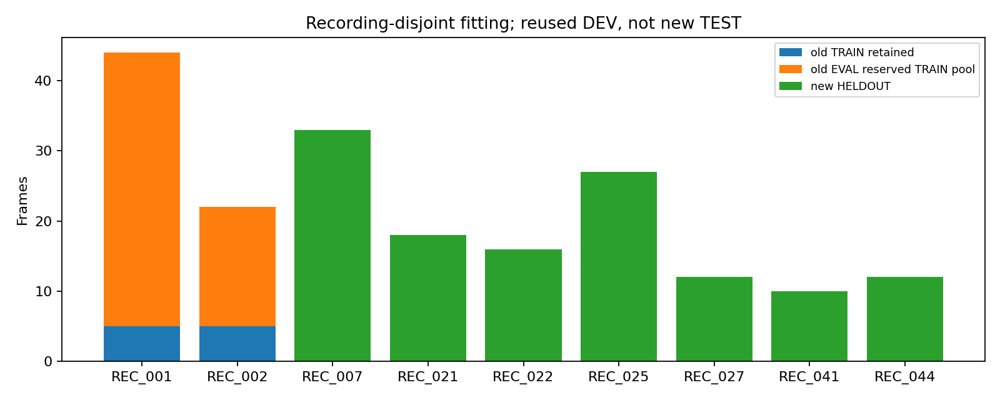

## 세 조건과 감독 예산

T0: 공통 Clean10 + 추가 Clean10, 교사 pseudo. T1: 공통 Clean10 + 실제 가림10, 같은 교사 pseudo. T2: T1과 동일 RGB/bbox/증강/support에서 추가H 좌표만 기존 manual로 교체. H는 중간8/심함2. E/H는 같은 recording의 예산 대응이며 동일 자세의 가림 전후가 아니다. T1−T0는 시점·위치·자연가림이 함께 달라지는 분포 확장 총효과다.

H는 기존 사람이 붙인 난도 태그를 그대로 사용했다. contact sheet에는 저양각·모서리 모호성도 보이며, 모든 H에 외부 가림 물체가 있다는 뜻은 아니다. 이를 보고 표본이나 난도 태그를 재선택·재분류하지 않았다.

교사 fitting manual48좌표, T2 추가 고유 manual36좌표. replacement 직접 좌표 노출은 조건별4593개(키포인트 단위; scalar x/y는2배). provenance는 채널 선택에도 사용됐으므로 완전 무라벨 학습이 아니다. T2는 EXISTING_MANUAL_SUPERVISION_CONTROL이며 정확한 hidden GT 전체나 이론적 상한이 아니다.

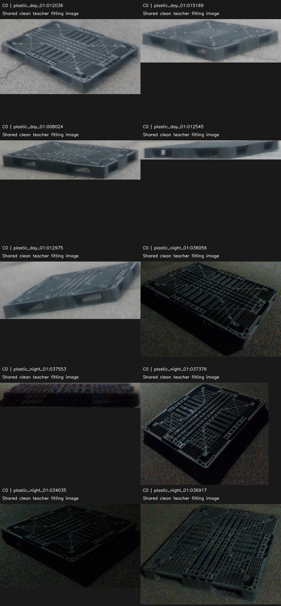

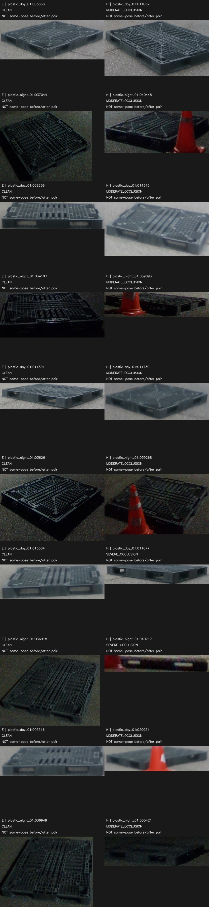

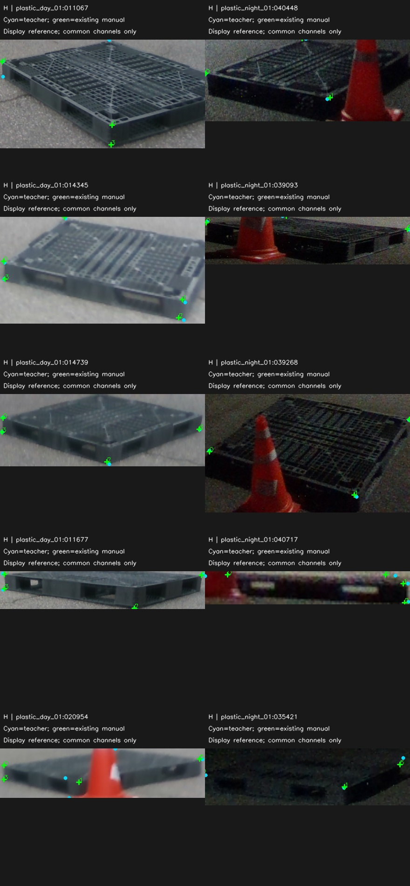

## 교사·분할 이력

교사: 합성 PRIOR1 seed1/6000 → plastic Clean10/300step checkpoint 고정. 추가 real fitting 기록 없음. R0는 팔레트 추가 학습은 합성 전용이나 상위 COCO-pose 사전학습이 존재한다. 이 자료의 HELDOUT recording fitting과 구분한다. recording alias/partial-overlap/MAD2 근접중복은 예측 전에 통합했다. 원본319·기존 split/모델/표는 수정하지 않았다.

사전 후보56개에서 교사 미검출 0개. 기존 self-visibility→visible refinement→hidden-PnP/fallback을 그대로 사용했다. 현재 Clean19 경로에는 별도 flip/LOO 탈락 필터가 없으므로 새 필터를 만들거나 통과율로 후보를 다시 고르지 않았다. 각 fallback 이유는 로컬 TRAIN_TEACHER_ONCE에 보존했다.

## 학습·증강 계약

original R0부터 seed42, AdamW lr1e-4/lrf.1/cosine,640,batch/nbs16,5epoch. 실사2560=C01280+replacement1280, 합성2560. 합성512 source 순서·RGB·target과 C0 tensors는 기존 S1 그대로 재사용. 새 E/H는 실제 loader의 동일 seed/affine를 적용했다. S1의 고정 적용flag·fill·면적비·종횡비를 재사용하고 기존 사각형 중심을 bbox 정규화해 E/H 각 bbox로 옮겼다. 새 위치 탐색·visible≥4 표본 선별·S2 구조 배치는 없다. 크기·픽셀은 영상 bbox에 따라 다르며 정규화 정책만 동일하다. T1/T2는 RGB까지 exact. 세 조건 공통 transformed support를 사용하고 제외점 v=1 sentinel을 복구했다.

고정 last만 평가; validation은 학습 중 차단. 세 학생과 R0/old S1의 새 HELDOUT 예측을 먼저 freeze한 다음 GT 채점. 교사 bbox/class/confidence를 target 대조에서 변경하지 않았다.

## 난도별 2D / 6D

| 집단 | 모델 | PCK10 | 맞은점/분모 | CURRENT AUC | ORACLE AUC 진단 | 선택손실 | W/D parity |
|---|---|---|---|---|---|---|---|
| HELDOUT_ALL_PLASTIC | R0 | 0.4914 | 484/985 | 0.3380 | 0.4160 | 0.0780 | 0.6484 |
| HELDOUT_ALL_PLASTIC | OLD_S1 | 0.4904 | 483/985 | 0.3488 | 0.4176 | 0.0687 | 0.7188 |
| HELDOUT_ALL_PLASTIC | T0 | 0.4944 | 487/985 | 0.3740 | 0.4339 | 0.0599 | 0.7109 |
| HELDOUT_ALL_PLASTIC | T1 | 0.4934 | 486/985 | 0.3495 | 0.4074 | 0.0579 | 0.7266 |
| HELDOUT_ALL_PLASTIC | T2 | 0.4772 | 470/985 | 0.3468 | 0.4141 | 0.0673 | 0.7031 |
| HELDOUT_CLEAN | R0 | 0.6594 | 151/229 | 0.7147 | 0.7147 | 0.0000 | 1.0000 |
| HELDOUT_CLEAN | OLD_S1 | 0.5895 | 135/229 | 0.6986 | 0.6986 | 0.0000 | 1.0000 |
| HELDOUT_CLEAN | T0 | 0.5764 | 132/229 | 0.7327 | 0.7327 | 0.0000 | 1.0000 |
| HELDOUT_CLEAN | T1 | 0.6245 | 143/229 | 0.7249 | 0.7249 | 0.0000 | 1.0000 |
| HELDOUT_CLEAN | T2 | 0.5677 | 130/229 | 0.7244 | 0.7244 | 0.0000 | 1.0000 |
| HELDOUT_MODERATE | R0 | 0.5844 | 90/154 | 0.4795 | 0.5631 | 0.0836 | 0.8095 |
| HELDOUT_MODERATE | OLD_S1 | 0.5584 | 86/154 | 0.4357 | 0.5406 | 0.1049 | 0.7619 |
| HELDOUT_MODERATE | T0 | 0.5649 | 87/154 | 0.4572 | 0.5353 | 0.0781 | 0.8095 |
| HELDOUT_MODERATE | T1 | 0.5584 | 86/154 | 0.4414 | 0.5044 | 0.0630 | 0.8095 |
| HELDOUT_MODERATE | T2 | 0.5455 | 84/154 | 0.4489 | 0.5324 | 0.0835 | 0.8095 |
| HELDOUT_SEVERE | R0 | 0.4037 | 243/602 | 0.1598 | 0.2653 | 0.1056 | 0.4744 |
| HELDOUT_SEVERE | OLD_S1 | 0.4352 | 262/602 | 0.1954 | 0.2799 | 0.0845 | 0.6026 |
| HELDOUT_SEVERE | T0 | 0.4452 | 268/602 | 0.2183 | 0.2955 | 0.0772 | 0.5769 |
| HELDOUT_SEVERE | T1 | 0.4269 | 257/602 | 0.1852 | 0.2633 | 0.0781 | 0.6026 |
| HELDOUT_SEVERE | T2 | 0.4252 | 256/602 | 0.1789 | 0.2670 | 0.0880 | 0.5641 |

ORACLE는 POSTHOC GT 기반 NONDEPLOYABLE. W/D parity는 전체 회전 정확도가 아니다. 자세 reference는 geometry-derived이며 독립 실측 GT가 아니다. 새 HELDOUT은 직접 클릭 provenance가 확인되는 채널이0개이므로 **manual-only 평가는 N/A**다. legacy 전체 참조와 manual 표를 JSON에서 분리했고 unknown을 manual로 승격하지 않았다.

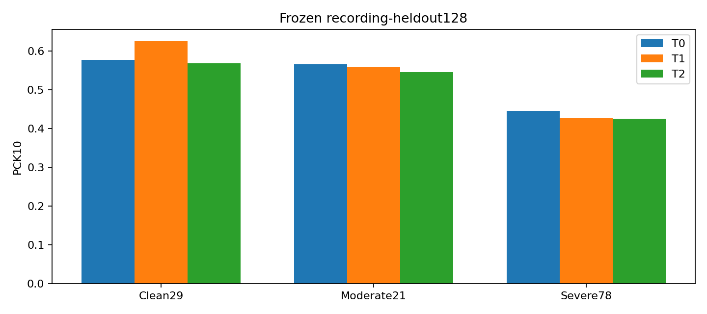

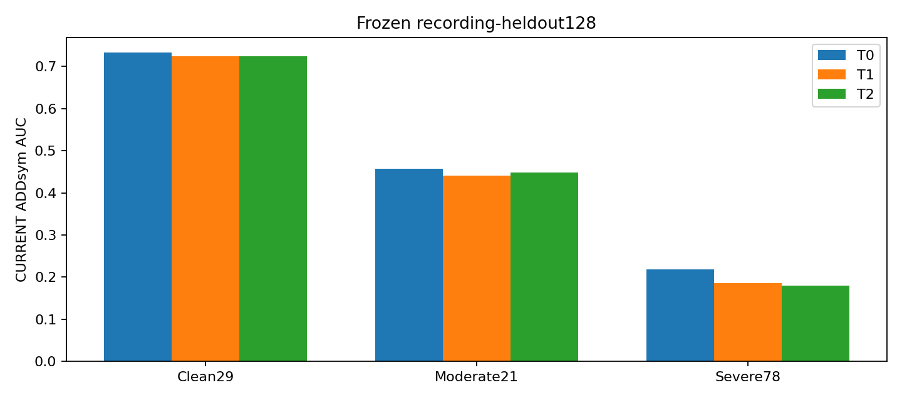

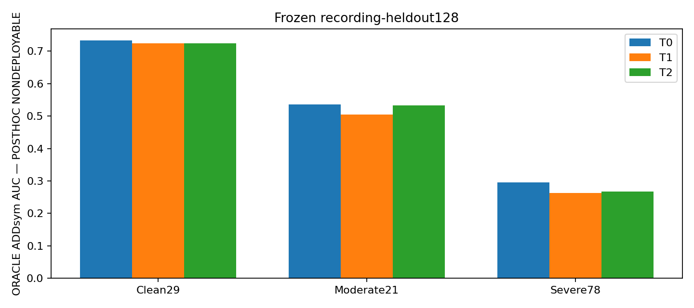

### 두 대조의 변화량

| 대조 | 난도 | PCK10 pp | CURRENT AUC Δ | ORACLE AUC Δ |
|---|---|---|---|---|
| T1-T0 | HELDOUT_CLEAN | 4.803 | -0.007862 | -0.007862 |
| T1-T0 | HELDOUT_MODERATE | -0.649 | -0.015810 | -0.030929 |
| T1-T0 | HELDOUT_SEVERE | -1.827 | -0.033090 | -0.032167 |
| T2-T1 | HELDOUT_CLEAN | -5.677 | -0.000517 | -0.000517 |
| T2-T1 | HELDOUT_MODERATE | -1.299 | 0.007524 | 0.028071 |
| T2-T1 | HELDOUT_SEVERE | -0.166 | -0.006224 | 0.003660 |

### 상세 분포

| 집단 | 모델 | PCK5 / PCK20 | 매칭 median/P90 px | 전체벌점 median/P90 | R median/P90 | yaw median/P90 | t cm median/P90 | IoU3D median/P90 |
|---|---|---|---|---|---|---|---|---|
| HELDOUT_CLEAN | T0 | 0.3974 / 0.9083 | 7.20 / 19.71 | 7.20 / 19.71 | 1.859 / 3.278 | 0.455 / 1.293 | 3.880 / 6.314 | 0.637 / 0.826 |
| HELDOUT_CLEAN | T1 | 0.3930 / 0.9127 | 6.90 / 19.64 | 6.90 / 19.64 | 1.654 / 2.527 | 0.539 / 1.259 | 4.453 / 6.246 | 0.656 / 0.820 |
| HELDOUT_CLEAN | T2 | 0.3974 / 0.9083 | 6.90 / 19.56 | 6.90 / 19.56 | 2.019 / 2.995 | 0.518 / 1.232 | 3.970 / 6.231 | 0.690 / 0.817 |
| HELDOUT_MODERATE | T0 | 0.1753 / 0.8506 | 9.08 / 25.27 | 9.08 / 25.27 | 2.166 / 79.003 | 1.444 / 79.003 | 6.548 / 15.666 | 0.718 / 0.816 |
| HELDOUT_MODERATE | T1 | 0.1688 / 0.8247 | 8.87 / 25.01 | 8.87 / 25.01 | 2.282 / 77.102 | 1.475 / 77.101 | 6.597 / 19.368 | 0.730 / 0.817 |
| HELDOUT_MODERATE | T2 | 0.1558 / 0.8442 | 8.88 / 26.19 | 8.88 / 26.19 | 2.192 / 79.166 | 1.381 / 79.165 | 6.614 / 17.042 | 0.635 / 0.815 |
| HELDOUT_SEVERE | T0 | 0.1761 / 0.6611 | 10.73 / 59.45 | 11.76 / 101.42 | 5.784 / 88.655 | 5.163 / 88.649 | 10.999 / 109.304 | 0.515 / 0.788 |
| HELDOUT_SEVERE | T1 | 0.1960 / 0.6777 | 11.33 / 57.71 | 11.95 / 103.77 | 4.618 / 88.389 | 4.329 / 88.384 | 14.749 / 102.700 | 0.517 / 0.783 |
| HELDOUT_SEVERE | T2 | 0.1628 / 0.6744 | 11.77 / 58.72 | 12.43 / 73.69 | 6.153 / 88.431 | 5.579 / 88.427 | 14.473 / 61.680 | 0.501 / 0.769 |

## source 보존·TRAIN fit

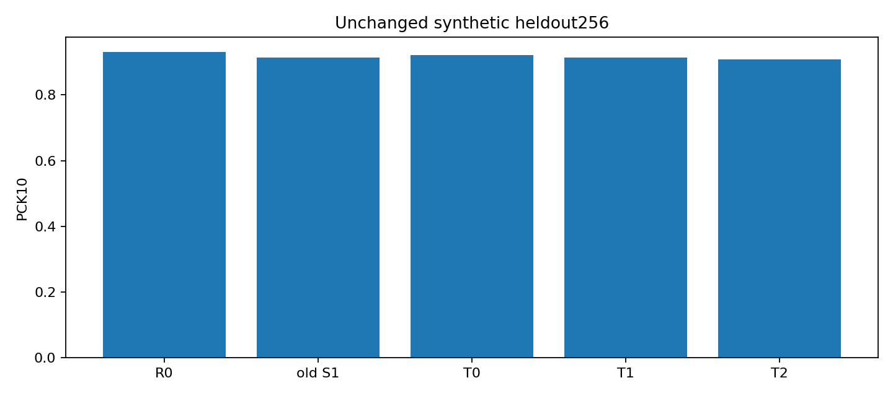

고정 H 교사−manual 원영상 오차 median=3.395px, P90=81.169px. 쌍 확정 이후 계산했으며 선택·가중치에는 사용하지 않았다.

| 학생 | 부분 | pseudo PCK10 | manual PCK10 | manual med/P90 |
|---|---|---|---|---|
| T0 | C0 | 0.9375 | 0.9167 | 1.44 / 6.42 |
| T0 | E | 1.0000 | 0.9722 | 2.63 / 5.74 |
| T1 | C0 | 0.9375 | 0.9167 | 1.40 / 6.11 |
| T1 | H | 1.0000 | 0.7778 | 3.97 / 80.26 |
| T2 | C0 | 0.9375 | 0.9167 | 1.41 / 5.69 |
| T2 | H | 0.8333 | 0.9167 | 1.75 / 3.89 |

TRAIN fit은 일반화 결과가 아니다. 숨은점의 독립검증 공백을 유지한다. source 2D 및 기존 검증 pose 평가는 [SOURCE_PRESERVATION.json](SOURCE_PRESERVATION.json)에 포함한다.

## 개선·악화 및 hash-fixed 무작위 대조

표시만 tight pallet ROI로 제한하고 얼굴 검출 부위는 픽셀화했다. 평가 입력은 원본 그대로다. 매칭실패는 숫자와 상태로 표시하며 긴 penalty 이동선은 그리지 않는다. 사례 개선/악화는 CURRENT normalized ADD 기준 사후 top3; 무작위6은 사전 hash 순서다.

### T1-T0_improved · eval_night09:1779449661263803392

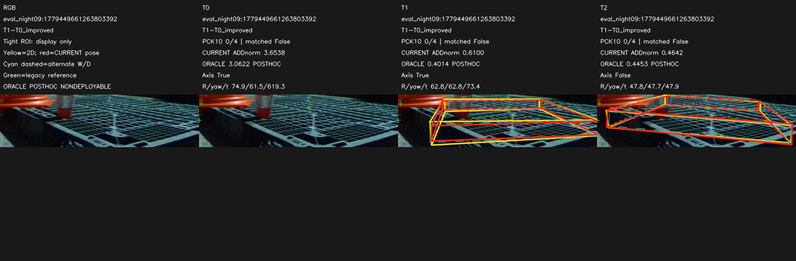

### T1-T0_improved · eval_night09:1779449575470221824

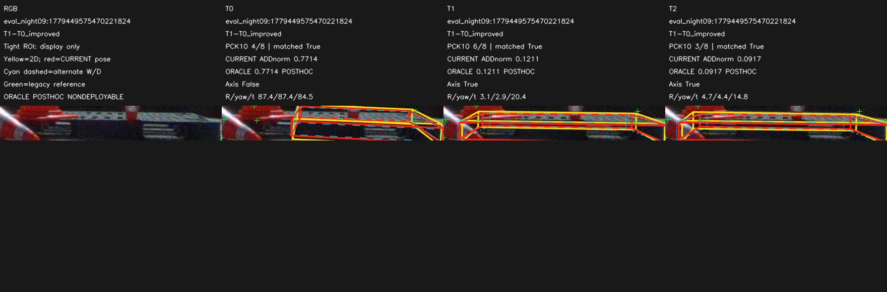

### T1-T0_improved · eval_night09:1779449645419136000

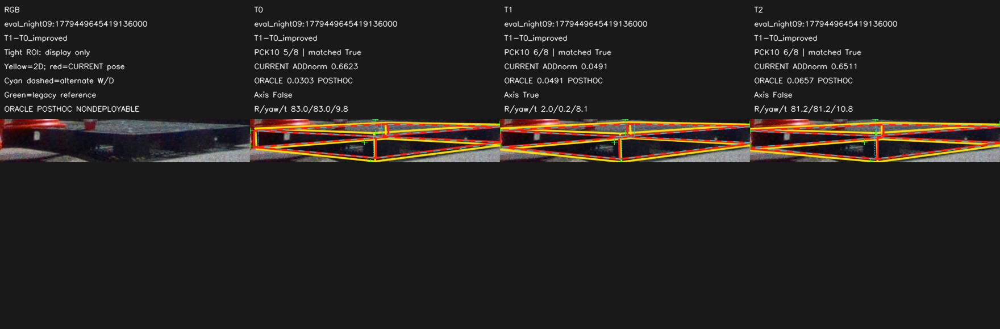

### T1-T0_harmed · eval_pallet09:1778653659065885952

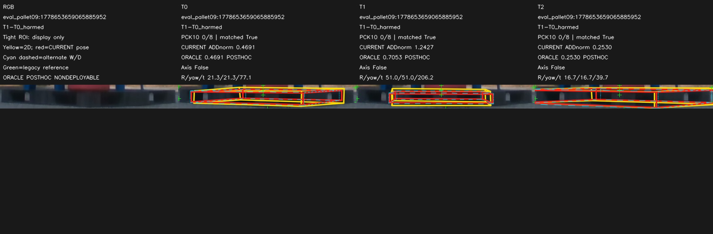

### T1-T0_harmed · eval_pallet09:1778653730458996736

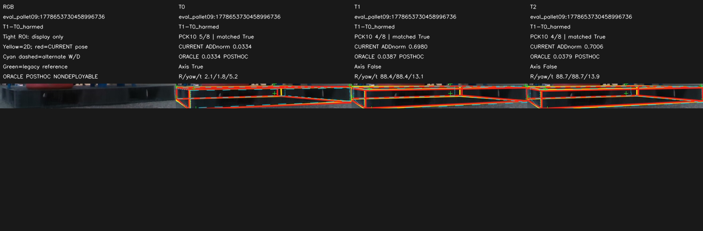

### T1-T0_harmed · eval_outside:1778653367706938112

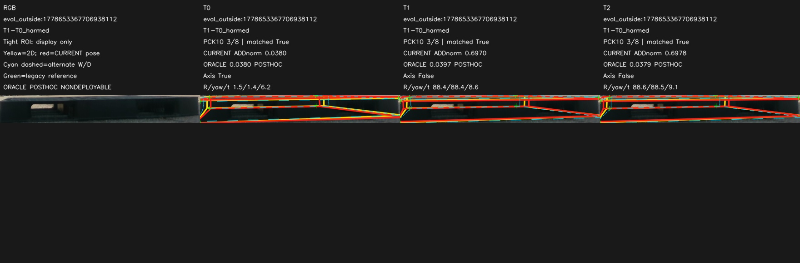

### T2-T1_improved · eval_night09:1779449596017728000

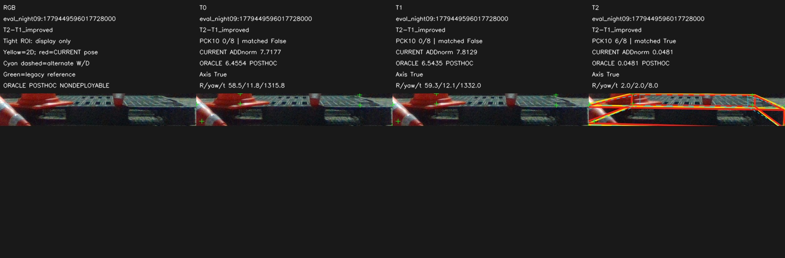

### T2-T1_improved · eval_pallet09:1778653659065885952

### T2-T1_improved · eval_night09:1779449591514485504

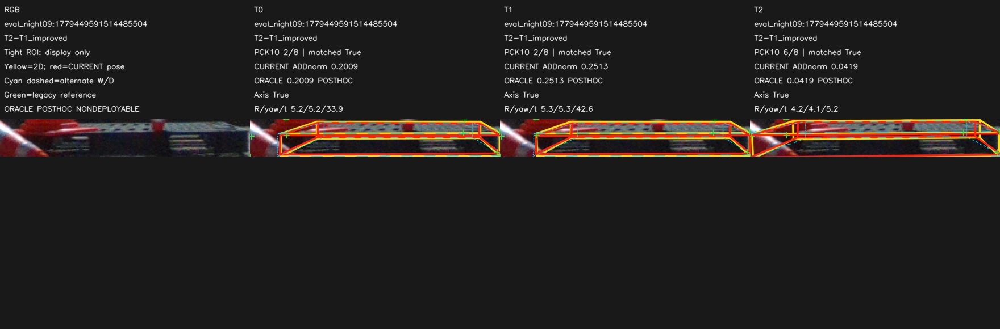

### T2-T1_harmed · eval_pallet09:1778653674184865536

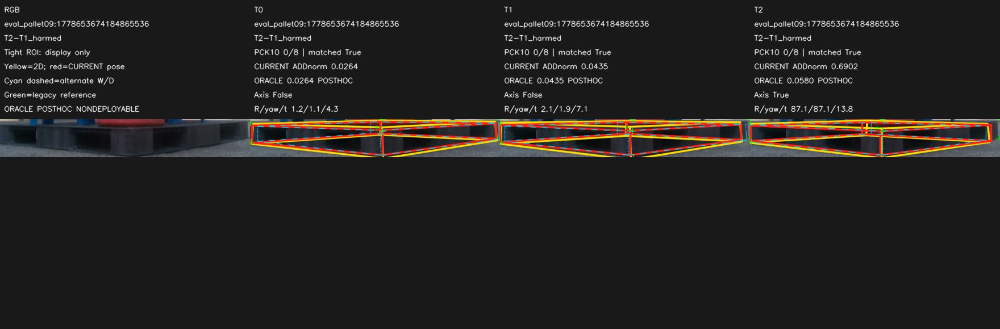

### T2-T1_harmed · eval_night09:1779449645419136000

### T2-T1_harmed · eval_pallet09:1778653699314620416

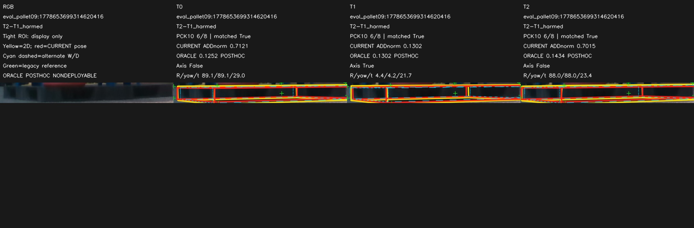

### hash_random_control · eval_night09:1779449575470221824

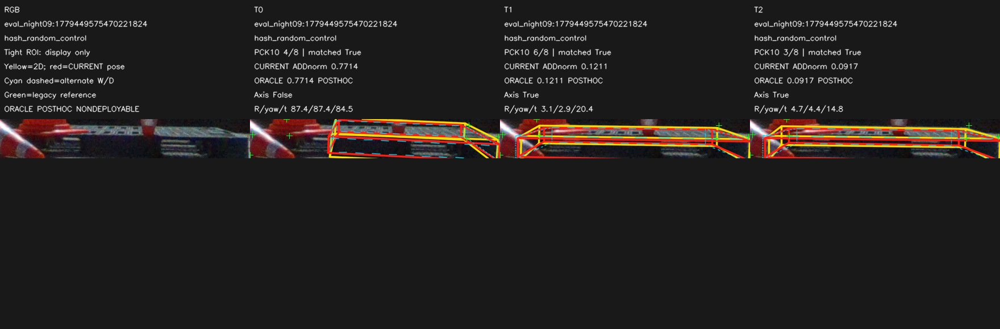

### hash_random_control · eval_night09:1779449634044385536

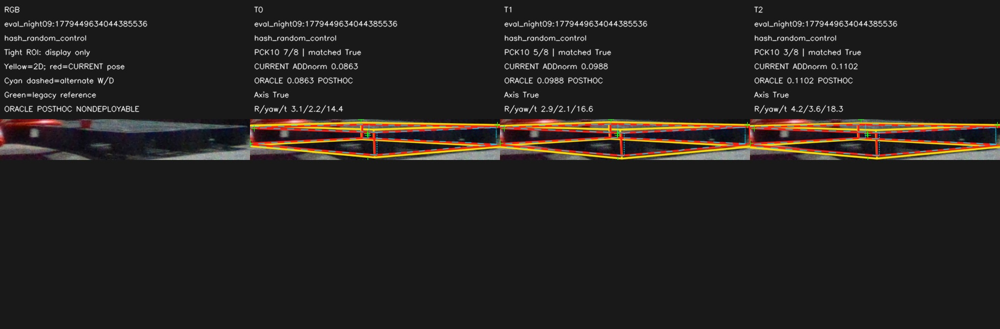

### hash_random_control · eval_outside:1778651650570397184

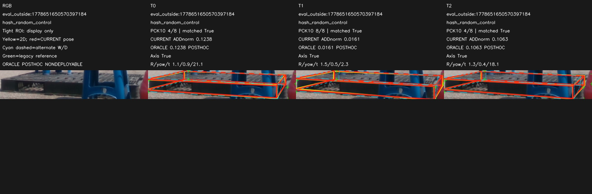

### hash_random_control · eval_pallet09:1778653806958839552

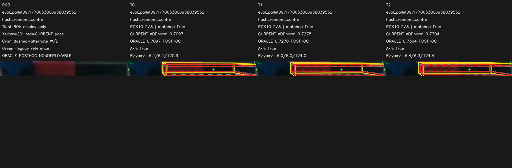

### hash_random_control · eval_pallet09:1778653832794714368

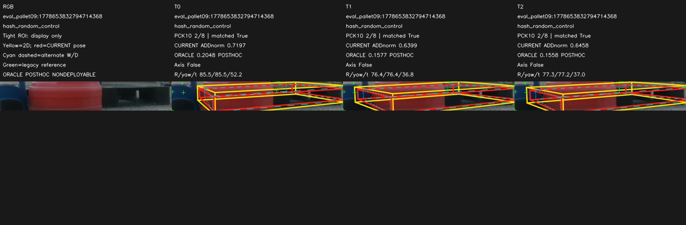

### hash_random_control · eval_night08:1779449470423201536

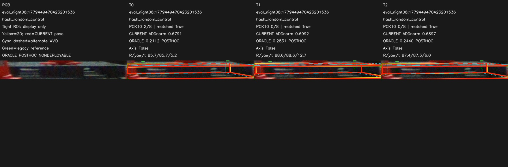

## 한계·다음 한 실험

단일 seed, 작은 E/H10쌍, 반복열람 DEV, 순수 occlusion 인과 대조 아님. 기록별 결과는 RESULTS.json에 모두 저장했다. 독립 기록은7개뿐이고 난도별 수가 더 적으므로 코너를 독립 표본으로 취급한 p-value나 정밀 CI를 만들지 않는다. T2의 일부 관측 코너만 감독한 결과로 단일RGB 불가능성 또는 완전 정답 hard 학습 실패를 주장하지 않는다.

다음 딱 한 실험은 **T2의 고정 TRAIN H36채널 잔차 감사**로 설계한다. 동일 last checkpoint와 저장된 모든 TRAIN occurrence에서 수동 코너 ID/좌표 정의, native→model support, predicted bbox와 목표 좌표 관계를 나눠 확인하고, 남은3개 >20px 오차가 좌표 계약·표현/최적화 중 어디에서 남는지 근거를 모은다. 평가 GT로 수정하지 않고, 새 클릭·촬영·재학습·threshold 변경 없이 진단한다. 이번 실행에서는 수행하지 않았다. 이것으로도 원인을 식별하지 못하면 그 불확실성을 유지한다.

## 재현·실행 기록

HEAD_BEFORE: `2ff20e3211dae33bdd55e9756f4e9867a3a7f956`. 새 namespace만 공개. checkpoint/캐시/원본 전체 영상은 로컬에 보존한다. 지시문 MD/TXT는 동일 내용 확인. 준비 중 괄호 문법 오류와 registry 타입 별칭을 수정한 뒤 진행했으며 optimizer 실행 전이었다. 학습 정책·loss·seed·예산 변경 및 재학습 없음.

[SPLIT_LOCK](SPLIT_LOCK.json) · [TARGET_AND_PAIR_AUDIT](TARGET_AND_PAIR_AUDIT.json) · [INPUT_LOCK](INPUT_LOCK.json) · [RESULTS](RESULTS.json) · [TRANSITIONS](TRANSITIONS.json) · [DECISION](DECISION.json)
