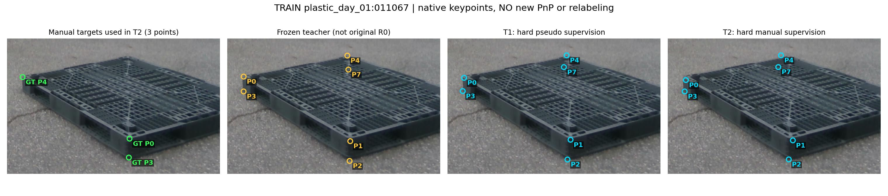
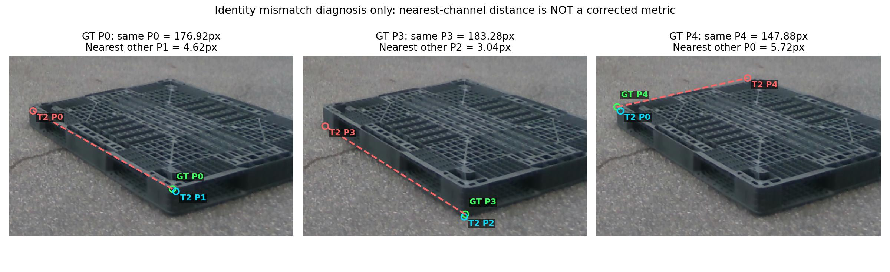
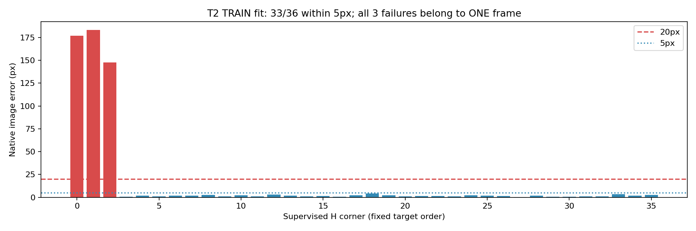

# T2 TRAIN H36 — 남은 3점 오류 분석

작성일: 2026-09-24 KST. 분석 기준 코드: `1419dcb3f266eeacaf41f68b9a9a1332e223ba4f`.

## 결론

**20px를 넘는 3점은 세 이미지의 실패가 아니라, `plastic_day_01:011067` 한 이미지의 P0·P3·P4다. 실제 꼭짓점 근처에 다른 번호의 예측점이 있는 코너 identity 불일치 패턴이 확인됐다.**

T2의 나머지 H 감독점 33개는 모두 4.27px 미만이다. 따라서 전체적으로 수동 정답을 학습하지 못한 상황은 아니다. 다만 이 3점을 맞추지 못했으므로 “TRAIN을 완전히 맞췄고 일반화만 실패했다”는 결론도 유지할 수 없다.

이번 작업은 기존 결과의 **TRAIN fit 진단**이다. 새 학습, GT 수정, 코너 재번호화, PnP 재실행, 평가 표본 제외, 새 성능 산출을 하지 않았다. 별도의 verified-anchor 2점 메타데이터 확인과도 다른 작업이며, 그 인간 확인을 완료 처리하지 않았다.

## 1. 무엇이 어떻게 달라졌나

모든 수치는 원영상 640×480 좌표의 유클리드 거리다. 교사는 기존 고정 pseudo-label 생성 경로의 결과이며 **원래 R0 자체가 아니다**. T1은 hard pseudo, T2는 같은 hard 영상의 기존 수동 좌표로 감독한 학생이다.

| 정답 코너 | 기존 교사 오차 | T1 오차 | T2 오차 | 정답 근처의 다른 T2 채널 | 그 거리 |
|---|---:|---:|---:|---|---:|
| P0 | 181.63px | 180.49px | 176.92px | P1 | 4.62px |
| P3 | 183.99px | 185.65px | 183.28px | P2 | 3.04px |
| P4 | 157.61px | 156.29px | 147.88px | P0 | 5.72px |

T2가 같은 번호의 오차를 조금 줄였지만, 정답이 요구하는 번호 배치를 회복하지는 못했다. 마지막 두 열은 **GT를 사용한 사후 원인 진단**이며 deployable 선택기나 개선된 PCK가 아니다. 특히 직사각형 팔레트에서 이를 임의의 90도 대칭으로 간주하거나 W/D를 바꿔 정답 처리하지 않는다.

### 동일 이미지: 수동 감독점 / 기존 교사 / T1 / T2

초록색은 실제 T2 감독에 사용된 수동 3점, 노란색은 교사, 청록색은 학생 예측이다. 패널은 동일 영역을 표시한다. 이미지 바깥의 점은 표시 범위 밖에 있으며, 표시를 위해 좌표를 안쪽으로 옮기지 않았다. 원래 R0 예측은 이 진단에 재추론·추가하지 않았다.



### 세 코너의 번호 불일치 확대

초록색=GT, 빨간색=같은 번호의 T2 예측, 청록색=GT에 가장 가까운 다른 T2 번호. 빨간 점선은 오차 대응선이지 팔레트 변이 아니다. **이 그림에서 번호를 실제로 교체한 것은 아니다.**



### 전체 H36 학습 적합도

33/36=91.67%가 5px 이내다. 나머지 3점은 모두 같은 프레임이며 147.88–183.28px다. 이는 학습점 적합도이지 HELDOUT 정확도가 아니다.



## 2. 학습 입력 누락·좌표 변환 오류인가

실제 T2 loader의 `M` cache 128개와 `TRACE_T2_HARD_MANUAL` 기록을 대조했다. cache 파일 SHA-256, 실제 forward에 전달된 target 및 mask 해시가 전부 일치했다.

| 확인 항목 | 결과 |
|---|---|
| P0/P3/P4 감독 노출 | 각각 128회; 모두 visibility=2 |
| epoch별 해당 프레임 노출 | 26 / 26 / 25 / 26 / 25 |
| 다른 채널이 잘못 감독됐는가 | 실제 감독 mask는 매번 P0·P3·P4, 총 3점 |
| 원영상→학습 입력 좌표 최대 절댓값 차이 | 0.0000191px |
| 학습 입력→원영상 역변환 최대 절댓값 차이 | 0.0000321px |
| S1 패치가 해당 좌표를 덮은 횟수 | P0 8회 / P3 5회 / P4 5회, 각각 128회 중 |

따라서 **라벨 누락, ignore 처리, 좌표 변환 실수, 항상 증강으로 가려진 점**이라는 설명은 이 사례에 맞지 않는다. 좌표 차이는 float64로 재계산한 각 축의 최대 절댓값이며, 앞선 대화의 보수적인 `<0.00006px`와 모순되지 않는다.

P5도 원래 수동 클릭이지만, 이번 E/H 공통 support 계약에서는 제외돼 있다. 위 표의 “3점”은 원 annotation 전체 수동점 수가 아니라 실제 T2 감독점 수다.

## 3. loss가 무시했거나 gradient가 끊겼나

최종 T2 checkpoint를 고정하고 실제 학습 cache 두 개(`occ=2`, `occ=4119`)로 GPU 진단을 재현했다. backbone/BN은 eval이며 head만 raw 학습 출력 형식으로 전환했다. 모델 파라미터는 동결하고 출력 좌표에 대한 loss gradient만 계산했다. optimizer·weight update 없이 checkpoint 해시 불변을 확인했다.

두 입력 모두 one2many=10개, one2one=1개의 positive anchor가 배정됐고 세 점이 감독됐다. one2one의 항별 **가중 전, decoded grid 좌표에 대한** gradient norm은 아래와 같다.

| 입력 occurrence | 코너 | OKS 위치항 gradient norm | RLE항 gradient norm |
|---|---|---:|---:|
| 2 | P0 | 0.001343 | 1.469154 |
| 2 | P3 | 0.000854 | 1.477887 |
| 2 | P4 | 0.007269 | 1.240638 |
| 4119 | P0 | 0.000760 | 0.991715 |
| 4119 | P3 | 0.000543 | 0.989544 |
| 4119 | P4 | 0.005153 | 0.880438 |

OKS 위치항 `1-exp(-e)`는 약 0.997 수준으로 포화돼 있고, 세 점의 one2one `exp(-e)`는 약 0.00055–0.00638이다. 큰 오차에서 이 항의 위치 신호가 약한 것은 확인되지만 **RLE gradient는 살아 있고 clamp 비율도 0**이다. 따라서 “gradient가 전부 끊겨 학습되지 않았다”는 주장은 배제한다. 실제 혼합 가중치와 공유 파라미터의 gradient 상쇄까지 인과적으로 확인한 것은 아니다.

이 검사는 **최종 checkpoint에서의 두 입력 probe**이며, 해당 epoch 당시의 모델을 복원한 학습 trajectory가 아니다. 입력 occurrence의 epoch가 0/4라고 해서 초기/마지막 epoch의 gradient 비교로 읽으면 안 된다. probe가 읽는 checkpoint metadata의 `epochs=100`은 원래 실험의 5epoch/320 update를 바꾸지 않으며, 이 probe에서는 epoch별 E2E branch mixing을 재현하지 않는다. 가중 전 항별 비교만 해석한다.

## 4. 확인된 원인과 남은 불확실성

**확인됨:** 이 한 장에서 정답과 예측의 코너 번호 배치가 다르다. 올바른 좌표·번호의 수동 target은 실제 학습에 투입됐지만, 이번 프로토콜의 T2는 이 불일치를 해소하지 못했다.

**가능성이 있으나 아직 인과적으로 입증되지 않음:** 기존 모델의 앞면 선택 경향, 잘린 영상의 기하 불확실성, 큰 오차에서 약해지는 OKS 위치항, 다른 학습 샘플·합성 replay와의 최적화 절충이 기여했을 수 있다. 현재 증거로 어느 하나를 단일 원인으로 확정하지 않는다.

해당 annotation은 `camera_dynamic_0123_v4`, `MANUAL_REVIEW_REQUIRED`, `axis_assignment_confirmed=false`다. 다만 이 metadata 상태만으로 GT 오류라고 판단하지 않는다. 기존 dynamic-front 규칙은 투영된 면적에 의존하므로, 물리적 꼭짓점 위치를 찾는 문제와 그 점에 번호를 붙이는 문제를 구분해야 한다. 3개 근접 채널의 존재만으로 전체 8점의 올바른 순열이나 올바른 6D 자세가 증명되지는 않는다.

다음 작업을 한다면 **이 이미지의 GT·교사·학생이 앞면과 코너 번호를 어떻게 정의했는지 확인하는 것이 우선**이다. 보정 이동 한도 확대나 새 모델 학습부터 시작할 근거는 아니다. 본 분석에서는 번호 수정·GT 수정·새 학습을 수행하지 않았다.

## 근거와 재현

- [전체 36점 오차·128회 cache 대조·입력 해시](THREE_CORNER_AUDIT.json)
- [GPU loss probe 원자료 및 checkpoint 해시](THREE_CORNER_LOSS_PROBE.json)
- [기존 완료 실험 보고서](REPORT_KO.md)
- [그림과 감사 결과 생성 코드](../../../scripts/research/pallet_existing_data_transfer_v1/report_three_corner_audit.py)
- [가중치 변경 없는 GPU probe 코드](../../../scripts/research/pallet_existing_data_transfer_v1/three_corner_loss_probe.py)

저장소 루트에서 기존 로컬 데이터·checkpoint가 있는 환경으로 실행한다. 전체 데이터나 모델 가중치는 이번 커밋에 추가하지 않는다.

```bash
python -m scripts.research.pallet_existing_data_transfer_v1.report_three_corner_audit
python -m scripts.research.pallet_existing_data_transfer_v1.three_corner_loss_probe
```
