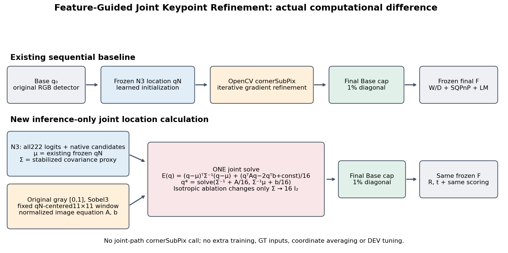

# Feature-Guided Joint Keypoint Refinement: 고정 계산과 전제

FG-JKR는 실험용 이름이다. N3와 영상 기울기를 같은 위치 목적함수에 넣는 **새 inference-only 융합 구현**이며, 학술적 최초·보편 우위를 주장하는 확정 논문명이 아니다. 기존 N3→OpenCV cornerSubPix는 직렬 후처리 기준선으로 그대로 보존했다. 이번 joint를 공동 학습된 N3 또는 새 end-to-end 모델로 부르지 않는다.



입력은 원영상 grayscale I, 원래 Base q0[9,2], 고정 N3 qN[9,2], N3 logits[8,222], 원래 network 후보 이동[222,2], gain, prediction_support[9], point_support[8], 고정 seed별 temperature다. 참조/R,t/사람 visibility는 입력이 아니다. [fusion.py](../../../scripts/research/pallet_feature_gradient_joint_20261010/fusion.py)의 `joint_refine`에는 해당 입력을 받을 인자 자체가 없다.

## 222 후보에서 prior 공분산 대리량

221개 non-null 및 마지막 zero/null 후보를 모두 보존한다. 후보 순서와 마지막(0,0)은 실제 모델 buffer로 검산했다. bbox diagonal이 이미 곱해진 `candidate_displacements_network`를 기존 canvas/letterbox의 gain으로 나눈다. 원래 네트워크 prediction의 pad/offset을 이동에 다시 더하지 않는다.

```text
p_j = softmax(logit_j / temperature_s),  j=0,...,221
d_j = candidate_displacements_network[j] / gain
m = Σ_j p_j d_j
C = Σ_j p_j (d_j−m)(d_j−m)^T
μ = qN                         # 저장된 기존 cap 후 native N3 좌표
c = 0.01 × hypot(raw_width, raw_height)
Σ = eig_reconstruct(C + 1 px² I, eigenvalues clipped to [1 px², c²])
```

공분산은 **cap 전 후보 퍼짐의 대리량**이다. prior 중심은 기존 cap 후 qN이고 q0+m이 아니다. 따라서 Σ를 capped posterior의 정확한 covariance 또는 calibration된 confidence라고 해석하지 않는다. 큰 C가 실제 오류를 뜻한다거나 entropy가 신뢰도 정답이라고 확정하지 않는다. 방향 고유벡터는 유지하고 floor/ceiling만 적용한다. 확률·공분산·정상방정식 집계는 float64다.

## 원영상의 고정 창 기울기 제약

원영상 gray는 float32 [0,1]이다. `cv2.Sobel` ksize=3의 x/y 미분을 원영상 native pixel 격자에서 계산한다. integer (x,y)는 `image[y,x]` 픽셀 중심이며 half-pixel offset을 더하지 않는다. Sobel과 `cv2.remap(..., INTER_LINEAR)`은 모두 `BORDER_REFLECT_101`로 고정했다. INTER_LINEAR는 OpenCV의 interpolation table 정밀도를 그대로 사용한다.

qN 중심의 dx,dy∈−5,...,5, 총11×11 위치 x_i를 한 번 정의한다. 새로운 위치를 찾을 때 창을 반복해서 옮기지 않는다. 시작 qN이 이미지 밖이면 반사 창을 만들어 중심 자체를 안으로 복구하지 않고 N3 fallback을 사용한다. 중심이 안이고 창 일부만 밖이면 고정 반사 정책으로 샘플한다.

```text
x_i = qN + (dx_i,dy_i)
g_i = bilinear samples of native Sobel x/y derivatives at x_i
w_i = exp(−||x_i−qN||² / (2 × 2.5²))
S = Σ_i w_i ||g_i||²
A = (Σ_i w_i g_i g_i^T) / S
b = (Σ_i w_i g_i g_i^T x_i) / S
```

S<1e−4이면 영상 정보가 부족해 q_unconstrained=qN이다. 충분하면 trace(A)≈1로 정규화한다. 이는 OpenCV cornerSubPix의 기울기 직교성 원리를 참고한 **고정 창 근사 제약**이며 그 함수 내부 구현과 동일하지 않다. [OpenCV 4.9.0 공식 설명](https://docs.opencv.org/4.9.0/dd/d1a/group__imgproc__feature.html).

## 하나의 공동 위치 결정식

```text
E_joint(q) = (q−μ)^T Σ^−1 (q−μ)
             + (q^T A q − 2 q^T b + constant) / (4 px)²
q_unconstrained = solve(Σ^−1 + A/16, Σ^−1 μ + b/16)
```

precision은 `np.linalg.solve(Σ,I₂)`, 최종 식은 `np.linalg.solve(system,rhs)`로 계산한다. `np.linalg.inv`를 호출하지 않는다. 2×2 SPD 고유값과 조건수≤1e12를 검사한다. rank1 edge의 A가 한 방향만 제약해도 prior precision이 다른 방향을 안정화한다. A=0,b=0이면 계산 반올림을 추가하지 않고 qN을 정확히 반환한다.

`JOINT_FIXED_ISOTROPIC`은 **Σ만 16I₂로 교체**한다. 동일한 p/C 진단, μ=qN, gray/Sobel/샘플창/A/b, solver와 최종 cap을 사용한다. posterior covariance를 제거하는 유일한 ablation이며 좋은 결과의 방법을 사후 primary로 바꾸지 않았다.

마지막에 q0 중심 반경 c로 한 번 투영한다. `Δ=q_unconstrained−q0`, `qFinal=q0+Δ min(1,c/||Δ||)`이며 0 이동은 그대로 유지한다. N3 주변 추가1%가 아니다. center8과 unsupported/sentinel/nonfinite 입력은 원래 q0로 보존한다. image/posterior/SPD fallback은 cap 전 qN을 유지하고 같은 최종 q0 cap을 적용한다. 과거 N3 float32 미세 상한 초과는 이 엄격 cap에서만 제거될 수 있다.

검출 후보/selected_index/box/score/confidence/K/등록치수/대칭 계약은 wrapper에서 보존한다. canonical 문맥 치수는 [W,D,H], 기존 PnP API는 [W,H,D]다. 최종 F는 기존 prediction-only W/D 가설 선택, SQPnP 및 RefineLM 그대로다. joint 출력에 cornerSubPix를 추가하지 않았고 완성된 두 좌표를 평균하지 않았다.

[FUSION_METHOD_LOCK.json](FUSION_METHOD_LOCK.json)은 새 DEV 오차를 읽기 전에 설정과 사례 선택 규칙을 봉인했다. [UNIT_TESTS.json](UNIT_TESTS.json)의 8개 테스트는 합성 숫자 배열만 사용하며, 평탄 영상, 단일 방향 edge의 SPD, 경계 반사와 픽셀 중심, null과 높은 entropy, native gain, 결측과 중심 보존, 총 이동 cap, isotropic의 Sigma 단독 교체를 검사한다. cornerSubPix와 explicit inverse를 호출하면 예외가 나는 monkeypatch에서도 joint가 통과했다.

`POSTERIOR_CAPTURE.jsonl.gz`는 실제 고정 N3 forward에서 얻은 logits/후보/gain/q0/qN이다. `NEW_COORDINATES_SEALED.jsonl.gz`는 참조를 읽기 전에 저장한 두 joint의 q0/qN/qS/qFinal 및 정상방정식이다. 새 방법의 **qS는 joint의 unconstrained 해**이며 SUBPIX 좌표가 아니다. 실제 F는 qFinal만 받는다. `PREDICTIONS.jsonl.gz`의 actual_pose는 그 F가 반환한 R/t이고 pose/corner는 평가 후 부가한 오차다.

prior/영상/solver 레코드는 `correction.diagnostics.corner_records[k]`의 `C`, `Sigma`, `A`, `b`, `S`, `posterior_entropy`, `null_probability`, `probability_sum`, `q_unconstrained`, `q_final`, `fallback_reason`, `cap_active`로 추적한다. 공분산과 영상 방향 그림은 이 실제 배열에서 생성하며 독립 물리 측정이나 인과 기전의 증거가 아니다.
