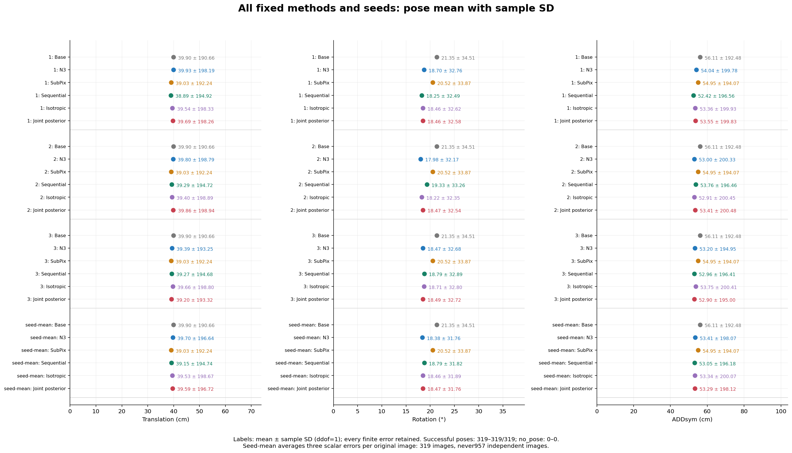
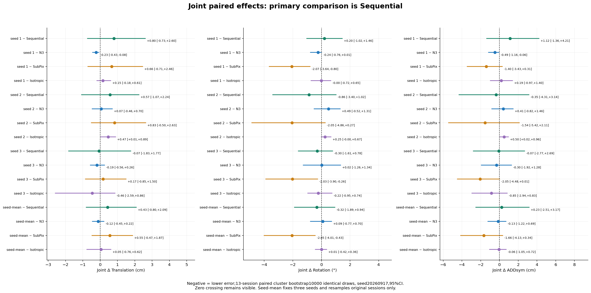
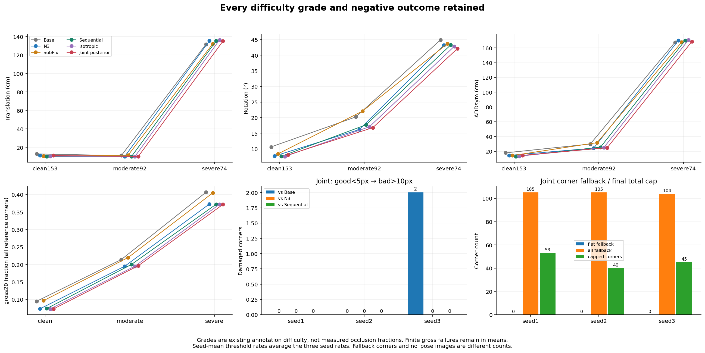
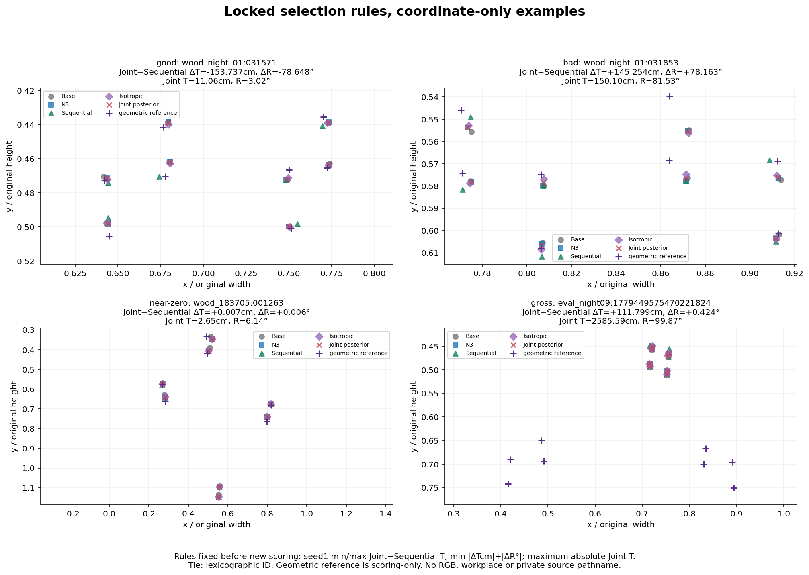
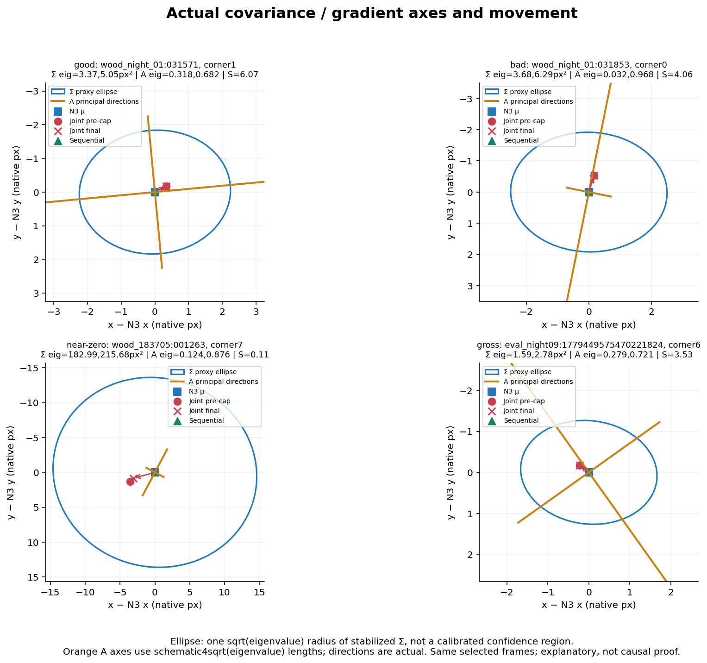

# FG-JKR: 실제 3-seed 동일 REAL_DEV 평가

[판정] JOINT vs N3→SubPix: 상충. 전체 319×3 seed 평균 ΔT=0.4332 cm, ΔR=-0.3184°, 두 95% CI=[-0.7998, 2.0860]/[-1.8888, 0.9351]; 더 나쁜 seed=1,2.
직렬 대비 위치 오차 평균이 늘고 회전 오차 평균이 줄었으며 두 세션 CI 모두 0을 포함한다. 세 seed의 개선 방향도 일치하지 않아 확정 개선으로 선언하지 않는다. 결과를 보고 융합기, 상수, 주비교를 교체하지 않고 **상충으로 종료**했다.

실행 상태 **COMPLETE**, 과학적 판정 **TRADEOFF**. 새 학습 0회, 새 합성 RGB 0장, 새 촬영 및 수동 주석 0건이다. 기존 기준선의 보고서, 수치, 그림, 원고를 보존했다.

## 실제 공동 계산

고정 N3의 222개 후보 분포로 native 이동 공분산을 계산하고, qN을 평균으로 하는 prior와 원영상의 고정 11×11 창에서 얻은 기울기 A,b를 **하나의 2×2 선형방정식**에 넣었다. μ=qN을 유지하고 Σ만 16I로 바꾸는 isotropic 비교도 실행했다. 수식, 스케일, 고정 수치, 실제 스키마는 [METHOD_KO.md](METHOD_KO.md)에 있다.

[MECHANISM_PROOF.json](MECHANISM_PROOF.json)은 실제 저장 좌표를 비교했다. 각 seed의 319장 모두에서 FG joint는 기존 직렬 및 isotropic의 최종 좌표와 1e−10 px 초과로 달랐다. source AST와 cornerSubPix 예외 monkeypatch도 통과했다. 이는 새 계산을 실제로 실행했다는 증거이며 정확도 우위나 학술적 최초성의 증거로 해석하지 않는다.

## 자료·분모·불변계약

319장, 13세션이며 matched 영상은 311장, 참조 코너는 2,499개, 관측 코너는 2,445개다. clean 153장, moderate 92장, severe 74장을 모두 유지했다. 난도 등급은 주석 범주이며 물리적 가림률이 아니다. 이 319장은 반복 개발 DEV로 독립 holdout이 아니다. 참조는 2D 주석과 등록 치수로 재구성한 geometric proxy이며 독립 물리 계측 GT가 아니다. 중심 8, 미지원과 결측, 검출 선택, score, box, confidence, K, canonical 치수, proper 대칭 계약을 보존했다.

기존 네 방법의 3,828행을 공개된 고정 원행에서 재사용하고 새 두 방법에만 3 seed×319=1,914회 실제 F를 호출했다. 최종 5,742행에서 동일한 영상 ID를 유지했다. 참조 좌표, 사람 visibility, GT 가설 선택을 추론에 사용하지 않았다. 새 좌표를 먼저 SHA로 봉인한 뒤 참조를 읽었다.

## 전체 정확도: 평균±SD와95%CI

SD는 오차의 표본 산포(ddof=1)로 CI, 표준오차, seed 간 산포와 구분한다. 코너 오차는 관측된 2,445개 코너, 자세 오차는 실제 성공한 319장에 대해 계산했다. 큰 유한 오차를 clipping/winsorization하거나 영상과 seed를 제외하지 않았으며 실패를 0 또는 1e6으로 대치하지 않았다.

| seed | 방법 | T cm 평균±SD;CI | R ° 평균±SD;CI | ADDsym cm 평균±SD;CI | 성공/실패 |
| --- | --- | --- | --- | --- | --- |
| 1 | BASE | 39.8968 ± 190.6607; [12.2361, 94.2096] | 21.3519 ± 34.5092; [12.6152, 31.1584] | 56.1092 ± 192.4846; [23.4583, 111.2848] | 319/0 |
| 1 | N3_DIM_SYM | 39.9262 ± 198.1943; [11.2822, 97.1476] | 18.6999 ± 32.7560; [11.0872, 27.3673] | 54.0371 ± 199.7755; [21.2193, 111.2139] | 319/0 |
| 1 | SUBPIX | 39.0311 ± 192.2443; [10.7307, 95.3866] | 20.5231 ± 33.8700; [12.6886, 29.6811] | 54.9500 ± 194.0732; [22.2249, 112.0449] | 319/0 |
| 1 | N3_THEN_SUBPIX | 38.8950 ± 194.9175; [9.8879, 96.4935] | 18.2523 ± 32.4933; [10.1771, 27.3344] | 52.4234 ± 196.5581; [19.2348, 110.0390] | 319/0 |
| 1 | JOINT_FIXED_ISOTROPIC | 39.5377 ± 198.3348; [10.7694, 97.0393] | 18.4589 ± 32.6219; [10.7291, 27.2904] | 53.3627 ± 199.9272; [20.4005, 111.0810] | 319/0 |
| 1 | FG_JOINT_POSTERIOR | 39.6920 ± 198.2607; [11.0256, 96.9650] | 18.4560 ± 32.5784; [11.0911, 26.6439] | 53.5481 ± 199.8318; [20.9949, 111.0485] | 319/0 |
| 2 | BASE | 39.8968 ± 190.6607; [12.2361, 94.2096] | 21.3519 ± 34.5092; [12.6152, 31.1584] | 56.1092 ± 192.4846; [23.4583, 111.2848] | 319/0 |
| 2 | N3_DIM_SYM | 39.7969 ± 198.7949; [11.0184, 97.3053] | 17.9758 ± 32.1657; [10.7570, 25.9377] | 52.9993 ± 200.3260; [20.1910, 111.7561] | 319/0 |
| 2 | SUBPIX | 39.0311 ± 192.2443; [10.7307, 95.3866] | 20.5231 ± 33.8700; [12.6886, 29.6811] | 54.9500 ± 194.0732; [22.2249, 112.0449] | 319/0 |
| 2 | N3_THEN_SUBPIX | 39.2912 ± 194.7188; [10.3061, 96.6287] | 19.3323 ± 33.2569; [11.3587, 28.5293] | 53.7639 ± 196.4647; [20.0617, 113.1684] | 319/0 |
| 2 | JOINT_FIXED_ISOTROPIC | 39.3988 ± 198.8890; [10.5292, 97.1412] | 18.2174 ± 32.3542; [11.2344, 25.7185] | 52.9108 ± 200.4534; [20.0417, 112.5100] | 319/0 |
| 2 | FG_JOINT_POSTERIOR | 39.8643 ± 198.9419; [10.8600, 97.5469] | 18.4693 ± 32.5399; [11.3454, 25.9365] | 53.4096 ± 200.4840; [20.6249, 113.0682] | 319/0 |
| 3 | BASE | 39.8968 ± 190.6607; [12.2361, 94.2096] | 21.3519 ± 34.5092; [12.6152, 31.1584] | 56.1092 ± 192.4846; [23.4583, 111.2848] | 319/0 |
| 3 | N3_DIM_SYM | 39.3877 ± 193.2513; [11.6263, 94.8935] | 18.4739 ± 32.6814; [10.6132, 27.3400] | 53.2005 ± 194.9543; [20.8980, 109.0182] | 319/0 |
| 3 | SUBPIX | 39.0311 ± 192.2443; [10.7307, 95.3866] | 20.5231 ± 33.8700; [12.6886, 29.6811] | 54.9500 ± 194.0732; [22.2249, 112.0449] | 319/0 |
| 3 | N3_THEN_SUBPIX | 39.2706 ± 194.6811; [10.5626, 96.6733] | 18.7901 ± 32.8896; [11.3063, 27.2906] | 52.9640 ± 196.4050; [20.2648, 110.8485] | 319/0 |
| 3 | JOINT_FIXED_ISOTROPIC | 39.6587 ± 198.8023; [10.9773, 97.4124] | 18.7138 ± 32.7981; [11.3156, 26.8731] | 53.7505 ± 200.4053; [20.9054, 111.6649] | 319/0 |
| 3 | FG_JOINT_POSTERIOR | 39.2002 ± 193.3181; [11.4874, 94.9561] | 18.4942 ± 32.7155; [11.1239, 26.4435] | 52.8978 ± 195.0032; [21.1948, 108.7935] | 319/0 |
| seed-mean | BASE | 39.8968 ± 190.6607; [12.2361, 94.2096] | 21.3519 ± 34.5092; [12.6152, 31.1584] | 56.1092 ± 192.4846; [23.4583, 111.2848] | 319/0 |
| seed-mean | N3_DIM_SYM | 39.7036 ± 196.6436; [11.3250, 96.4479] | 18.3832 ± 31.7577; [10.8579, 26.8914] | 53.4123 ± 198.0667; [20.7950, 110.7426] | 319/0 |
| seed-mean | SUBPIX | 39.0311 ± 192.2443; [10.7307, 95.3866] | 20.5231 ± 33.8700; [12.6886, 29.6811] | 54.9500 ± 194.0732; [22.2249, 112.0449] | 319/0 |
| seed-mean | N3_THEN_SUBPIX | 39.1523 ± 194.7440; [10.2627, 96.6131] | 18.7916 ± 31.8166; [10.9912, 27.6953] | 53.0505 ± 196.1767; [19.8839, 111.4275] | 319/0 |
| seed-mean | JOINT_FIXED_ISOTROPIC | 39.5317 ± 198.6698; [10.7759, 97.1979] | 18.4634 ± 31.8868; [11.1479, 26.6405] | 53.3413 ± 200.0708; [20.4916, 111.8312] | 319/0 |
| seed-mean | FG_JOINT_POSTERIOR | 39.5855 ± 196.7201; [11.1615, 96.4694] | 18.4732 ± 31.7586; [11.2139, 26.3106] | 53.2852 ± 198.1204; [20.9080, 110.8000] | 319/0 |

| seed | 방법 | 코너px 평균±SD;CI | PCK@10 | gross20수/비율 | ADDsym-AUC |
| --- | --- | --- | --- | --- | --- |
| 1 | BASE | 22.5522 ± 54.6454; [16.0260, 30.5194] | 0.6343 | 498.0000/0.1993 | 0.3766 |
| 1 | N3_DIM_SYM | 21.4982 ± 54.6862; [15.1831, 29.1399] | 0.6883 | 439.0000/0.1757 | 0.4096 |
| 1 | SUBPIX | 22.4216 ± 54.6691; [15.9426, 30.4219] | 0.6222 | 503.0000/0.2013 | 0.4330 |
| 1 | N3_THEN_SUBPIX | 21.4153 ± 54.7048; [15.1610, 29.0925] | 0.6779 | 443.0000/0.1773 | 0.4742 |
| 1 | JOINT_FIXED_ISOTROPIC | 21.3718 ± 54.7033; [15.0404, 29.0444] | 0.6903 | 439.0000/0.1757 | 0.4343 |
| 1 | FG_JOINT_POSTERIOR | 21.4127 ± 54.6798; [15.1028, 29.0400] | 0.6911 | 439.0000/0.1757 | 0.4216 |
| 2 | BASE | 22.5522 ± 54.6454; [16.0260, 30.5194] | 0.6343 | 498.0000/0.1993 | 0.3766 |
| 2 | N3_DIM_SYM | 21.5583 ± 54.6440; [15.2710, 29.1835] | 0.6827 | 444.0000/0.1777 | 0.4197 |
| 2 | SUBPIX | 22.4216 ± 54.6691; [15.9426, 30.4219] | 0.6222 | 503.0000/0.2013 | 0.4330 |
| 2 | N3_THEN_SUBPIX | 21.4642 ± 54.6869; [15.2085, 29.1428] | 0.6723 | 450.0000/0.1801 | 0.4672 |
| 2 | JOINT_FIXED_ISOTROPIC | 21.4377 ± 54.6745; [15.1328, 29.0815] | 0.6835 | 441.0000/0.1765 | 0.4415 |
| 2 | FG_JOINT_POSTERIOR | 21.4784 ± 54.6690; [15.1925, 29.0882] | 0.6835 | 444.0000/0.1777 | 0.4301 |
| 3 | BASE | 22.5522 ± 54.6454; [16.0260, 30.5194] | 0.6343 | 498.0000/0.1993 | 0.3766 |
| 3 | N3_DIM_SYM | 21.5492 ± 54.6073; [15.2424, 29.1881] | 0.6867 | 434.0000/0.1737 | 0.4072 |
| 3 | SUBPIX | 22.4216 ± 54.6691; [15.9426, 30.4219] | 0.6222 | 503.0000/0.2013 | 0.4330 |
| 3 | N3_THEN_SUBPIX | 21.4176 ± 54.5582; [15.1339, 29.1158] | 0.6743 | 437.0000/0.1749 | 0.4702 |
| 3 | JOINT_FIXED_ISOTROPIC | 21.4220 ± 54.6269; [15.1049, 29.0781] | 0.6831 | 435.0000/0.1741 | 0.4302 |
| 3 | FG_JOINT_POSTERIOR | 21.4632 ± 54.6063; [15.1699, 29.0763] | 0.6871 | 434.0000/0.1737 | 0.4197 |
| seed-mean | BASE | 22.5522 ± 54.6454; [16.0260, 30.5194] | 0.6343 | 498.0000/0.1993 | 0.3766 |
| seed-mean | N3_DIM_SYM | 21.5352 ± 54.6392; [15.2415, 29.1707] | 0.6859 | 439.0000/0.1757 | 0.4122 |
| seed-mean | SUBPIX | 22.4216 ± 54.6691; [15.9426, 30.4219] | 0.6222 | 503.0000/0.2013 | 0.4330 |
| seed-mean | N3_THEN_SUBPIX | 21.4324 ± 54.6354; [15.1615, 29.1215] | 0.6748 | 443.3333/0.1774 | 0.4705 |
| seed-mean | JOINT_FIXED_ISOTROPIC | 21.4105 ± 54.6616; [15.0836, 29.0721] | 0.6856 | 438.3333/0.1754 | 0.4353 |
| seed-mean | FG_JOINT_POSTERIOR | 21.4514 ± 54.6449; [15.1566, 29.0683] | 0.6872 | 439.0000/0.1757 | 0.4238 |

seed-mean 오차는 동일 ID와 동일 canonical 코너의 세 seed 오차를 먼저 평균한 319장 및 2,445개 코너의 분포다. R/t를 평균해 새 자세를 만들거나 957장의 독립 이미지로 취급하지 않았다. PCK, gross20, AUC는 세 seed별 임계 비율, 개수, AUC의 산술평균이므로 개수가 소수일 수 있다. 평균 오차에 임계값을 적용한 별도 값은 `threshold_of_seed_mean_errors`와 `AUC_of_seed_mean_errors`에 있다. AUC는 기존 ADDsym_normalized≤threshold를 0..0.1 범위의 1,001개 임계값에서 적분한다. 추가 5 cm/5° 성공률은 기존 계약과의 정합성이 확인되지 않아 **NOT_CONFIRMED**로 기록하고 숫자를 만들지 않았다.

원행 재계산: 분산·중앙값·P90·최대

**corner_px**

| seed | 방법 | n | 표본분산 | SD | median | P90 | max |
| --- | --- | --- | --- | --- | --- | --- | --- |
| 1 | BASE | 2445 | 2986.1170 | 54.6454 | 6.7207 | 43.8900 | 495.2625 |
| 1 | N3_DIM_SYM | 2445 | 2990.5751 | 54.6862 | 5.7446 | 42.3204 | 498.8323 |
| 1 | SUBPIX | 2445 | 2988.7064 | 54.6691 | 7.0196 | 43.6671 | 495.2625 |
| 1 | N3_THEN_SUBPIX | 2445 | 2992.6105 | 54.7048 | 5.8367 | 42.3506 | 498.8323 |
| 1 | JOINT_FIXED_ISOTROPIC | 2445 | 2992.4508 | 54.7033 | 5.6191 | 42.3584 | 498.8180 |
| 1 | FG_JOINT_POSTERIOR | 2445 | 2989.8777 | 54.6798 | 5.5623 | 42.4548 | 498.8180 |
| 2 | BASE | 2445 | 2986.1170 | 54.6454 | 6.7207 | 43.8900 | 495.2625 |
| 2 | N3_DIM_SYM | 2445 | 2985.9712 | 54.6440 | 5.7677 | 41.8721 | 501.4115 |
| 2 | SUBPIX | 2445 | 2988.7064 | 54.6691 | 7.0196 | 43.6671 | 495.2625 |
| 2 | N3_THEN_SUBPIX | 2445 | 2990.6580 | 54.6869 | 5.8295 | 41.8721 | 501.4115 |
| 2 | JOINT_FIXED_ISOTROPIC | 2445 | 2989.3014 | 54.6745 | 5.6070 | 42.4238 | 501.4115 |
| 2 | FG_JOINT_POSTERIOR | 2445 | 2988.6953 | 54.6690 | 5.6152 | 42.3190 | 501.4115 |
| 3 | BASE | 2445 | 2986.1170 | 54.6454 | 6.7207 | 43.8900 | 495.2625 |
| 3 | N3_DIM_SYM | 2445 | 2981.9574 | 54.6073 | 5.8222 | 42.2087 | 498.4981 |
| 3 | SUBPIX | 2445 | 2988.7064 | 54.6691 | 7.0196 | 43.6671 | 495.2625 |
| 3 | N3_THEN_SUBPIX | 2445 | 2976.5931 | 54.5582 | 5.8754 | 42.0566 | 497.8448 |
| 3 | JOINT_FIXED_ISOTROPIC | 2445 | 2984.0937 | 54.6269 | 5.5859 | 42.2955 | 498.3744 |
| 3 | FG_JOINT_POSTERIOR | 2445 | 2981.8507 | 54.6063 | 5.6263 | 42.3697 | 498.2971 |
| seed-mean | BASE | 2445 | 2986.1170 | 54.6454 | 6.7207 | 43.8900 | 495.2625 |
| seed-mean | N3_DIM_SYM | 2445 | 2985.4382 | 54.6392 | 5.7547 | 41.6795 | 498.6561 |
| seed-mean | SUBPIX | 2445 | 2988.7064 | 54.6691 | 7.0196 | 43.6671 | 495.2625 |
| seed-mean | N3_THEN_SUBPIX | 2445 | 2985.0230 | 54.6354 | 5.8394 | 41.6795 | 498.4383 |
| seed-mean | JOINT_FIXED_ISOTROPIC | 2445 | 2987.8857 | 54.6616 | 5.5908 | 42.2577 | 498.6092 |
| seed-mean | FG_JOINT_POSTERIOR | 2445 | 2986.0665 | 54.6449 | 5.6089 | 42.3291 | 498.5591 |

**translation_cm**

| seed | 방법 | n | 표본분산 | SD | median | P90 | max |
| --- | --- | --- | --- | --- | --- | --- | --- |
| 1 | BASE | 319 | 36351.5141 | 190.6607 | 7.8969 | 40.5302 | 2563.8368 |
| 1 | N3_DIM_SYM | 319 | 39280.9953 | 198.1943 | 7.0392 | 38.1358 | 2586.9494 |
| 1 | SUBPIX | 319 | 36957.8766 | 192.2443 | 5.7942 | 39.3900 | 2453.7309 |
| 1 | N3_THEN_SUBPIX | 319 | 37992.8187 | 194.9175 | 4.9533 | 35.7092 | 2473.7920 |
| 1 | JOINT_FIXED_ISOTROPIC | 319 | 39336.6998 | 198.3348 | 6.6626 | 36.6419 | 2585.8920 |
| 1 | FG_JOINT_POSTERIOR | 319 | 39307.2861 | 198.2607 | 6.5879 | 38.5480 | 2585.5911 |
| 2 | BASE | 319 | 36351.5141 | 190.6607 | 7.8969 | 40.5302 | 2563.8368 |
| 2 | N3_DIM_SYM | 319 | 39519.4167 | 198.7949 | 6.7902 | 37.4121 | 2599.5177 |
| 2 | SUBPIX | 319 | 36957.8766 | 192.2443 | 5.7942 | 39.3900 | 2453.7309 |
| 2 | N3_THEN_SUBPIX | 319 | 37915.4014 | 194.7188 | 5.3054 | 37.8291 | 2480.6553 |
| 2 | JOINT_FIXED_ISOTROPIC | 319 | 39556.8237 | 198.8890 | 6.3699 | 36.9459 | 2599.2551 |
| 2 | FG_JOINT_POSTERIOR | 319 | 39577.8723 | 198.9419 | 6.4955 | 37.6498 | 2599.1077 |
| 3 | BASE | 319 | 36351.5141 | 190.6607 | 7.8969 | 40.5302 | 2563.8368 |
| 3 | N3_DIM_SYM | 319 | 37346.0821 | 193.2513 | 7.3735 | 37.8786 | 2603.0186 |
| 3 | SUBPIX | 319 | 36957.8766 | 192.2443 | 5.7942 | 39.3900 | 2453.7309 |
| 3 | N3_THEN_SUBPIX | 319 | 37900.7374 | 194.6811 | 5.2017 | 37.5973 | 2484.8590 |
| 3 | JOINT_FIXED_ISOTROPIC | 319 | 39522.3442 | 198.8023 | 7.1368 | 37.3882 | 2599.2540 |
| 3 | FG_JOINT_POSTERIOR | 319 | 37371.8885 | 193.3181 | 7.1756 | 39.1047 | 2601.3210 |
| seed-mean | BASE | 319 | 36351.5141 | 190.6607 | 7.8969 | 40.5302 | 2563.8368 |
| seed-mean | N3_DIM_SYM | 319 | 38668.7057 | 196.6436 | 7.0719 | 37.9554 | 2596.4952 |
| seed-mean | SUBPIX | 319 | 36957.8766 | 192.2443 | 5.7942 | 39.3900 | 2453.7309 |
| seed-mean | N3_THEN_SUBPIX | 319 | 37925.2075 | 194.7440 | 5.1462 | 36.6086 | 2479.7688 |
| seed-mean | JOINT_FIXED_ISOTROPIC | 319 | 39469.6896 | 198.6698 | 6.6891 | 36.7543 | 2594.8004 |
| seed-mean | FG_JOINT_POSTERIOR | 319 | 38698.8053 | 196.7201 | 6.8077 | 38.1662 | 2595.3399 |

**rotation_deg**

| seed | 방법 | n | 표본분산 | SD | median | P90 | max |
| --- | --- | --- | --- | --- | --- | --- | --- |
| 1 | BASE | 319 | 1190.8875 | 34.5092 | 2.5389 | 86.5273 | 98.5739 |
| 1 | N3_DIM_SYM | 319 | 1072.9546 | 32.7560 | 2.1104 | 85.9305 | 99.5853 |
| 1 | SUBPIX | 319 | 1147.1736 | 33.8700 | 2.5409 | 86.9971 | 99.4653 |
| 1 | N3_THEN_SUBPIX | 319 | 1055.8135 | 32.4933 | 2.1003 | 85.8768 | 99.4413 |
| 1 | JOINT_FIXED_ISOTROPIC | 319 | 1064.1856 | 32.6219 | 2.1057 | 85.9457 | 99.7999 |
| 1 | FG_JOINT_POSTERIOR | 319 | 1061.3539 | 32.5784 | 2.1074 | 85.9332 | 99.8656 |
| 2 | BASE | 319 | 1190.8875 | 34.5092 | 2.5389 | 86.5273 | 98.5739 |
| 2 | N3_DIM_SYM | 319 | 1034.6343 | 32.1657 | 2.0727 | 85.8778 | 99.9297 |
| 2 | SUBPIX | 319 | 1147.1736 | 33.8700 | 2.5409 | 86.9971 | 99.4653 |
| 2 | N3_THEN_SUBPIX | 319 | 1106.0194 | 33.2569 | 2.1287 | 86.0744 | 99.2755 |
| 2 | JOINT_FIXED_ISOTROPIC | 319 | 1046.7971 | 32.3542 | 2.1487 | 85.9429 | 99.5013 |
| 2 | FG_JOINT_POSTERIOR | 319 | 1058.8427 | 32.5399 | 2.1339 | 85.9430 | 99.7730 |
| 3 | BASE | 319 | 1190.8875 | 34.5092 | 2.5389 | 86.5273 | 98.5739 |
| 3 | N3_DIM_SYM | 319 | 1068.0734 | 32.6814 | 2.0281 | 85.9500 | 100.3582 |
| 3 | SUBPIX | 319 | 1147.1736 | 33.8700 | 2.5409 | 86.9971 | 99.4653 |
| 3 | N3_THEN_SUBPIX | 319 | 1081.7287 | 32.8896 | 2.1240 | 86.0324 | 99.3964 |
| 3 | JOINT_FIXED_ISOTROPIC | 319 | 1075.7151 | 32.7981 | 2.0195 | 86.0634 | 100.0052 |
| 3 | FG_JOINT_POSTERIOR | 319 | 1070.3046 | 32.7155 | 1.9965 | 86.0660 | 100.2101 |
| seed-mean | BASE | 319 | 1190.8875 | 34.5092 | 2.5389 | 86.5273 | 98.5739 |
| seed-mean | N3_DIM_SYM | 319 | 1008.5538 | 31.7577 | 2.1055 | 85.5807 | 99.9577 |
| seed-mean | SUBPIX | 319 | 1147.1736 | 33.8700 | 2.5409 | 86.9971 | 99.4653 |
| seed-mean | N3_THEN_SUBPIX | 319 | 1012.2971 | 31.8166 | 2.1507 | 85.7835 | 99.3710 |
| seed-mean | JOINT_FIXED_ISOTROPIC | 319 | 1016.7649 | 31.8868 | 2.0997 | 85.7974 | 99.7688 |
| seed-mean | FG_JOINT_POSTERIOR | 319 | 1008.6066 | 31.7586 | 2.1029 | 85.6024 | 99.9496 |

**ADDsym_cm**

| seed | 방법 | n | 표본분산 | SD | median | P90 | max |
| --- | --- | --- | --- | --- | --- | --- | --- |
| 1 | BASE | 319 | 37050.3086 | 192.4846 | 8.7137 | 119.8890 | 2565.3567 |
| 1 | N3_DIM_SYM | 319 | 39910.2566 | 199.7755 | 8.0549 | 119.2205 | 2588.4741 |
| 1 | SUBPIX | 319 | 37664.3976 | 194.0732 | 6.5734 | 120.0072 | 2455.4089 |
| 1 | N3_THEN_SUBPIX | 319 | 38635.0730 | 196.5581 | 5.3503 | 119.9556 | 2475.4674 |
| 1 | JOINT_FIXED_ISOTROPIC | 319 | 39970.8761 | 199.9272 | 7.2338 | 119.2715 | 2587.4553 |
| 1 | FG_JOINT_POSTERIOR | 319 | 39932.7530 | 199.8318 | 7.8970 | 119.2918 | 2587.1251 |
| 2 | BASE | 319 | 37050.3086 | 192.4846 | 8.7137 | 119.8890 | 2565.3567 |
| 2 | N3_DIM_SYM | 319 | 40130.5088 | 200.3260 | 7.7328 | 118.8082 | 2601.0439 |
| 2 | SUBPIX | 319 | 37664.3976 | 194.0732 | 6.5734 | 120.0072 | 2455.4089 |
| 2 | N3_THEN_SUBPIX | 319 | 38598.3628 | 196.4647 | 5.7296 | 119.7757 | 2482.3291 |
| 2 | JOINT_FIXED_ISOTROPIC | 319 | 40181.5653 | 200.4534 | 6.8841 | 118.9143 | 2600.8186 |
| 2 | FG_JOINT_POSTERIOR | 319 | 40193.8234 | 200.4840 | 7.4958 | 119.2973 | 2600.6420 |
| 3 | BASE | 319 | 37050.3086 | 192.4846 | 8.7137 | 119.8890 | 2565.3567 |
| 3 | N3_DIM_SYM | 319 | 38007.1634 | 194.9543 | 8.2613 | 118.8644 | 2604.5488 |
| 3 | SUBPIX | 319 | 37664.3976 | 194.0732 | 6.5734 | 120.0072 | 2455.4089 |
| 3 | N3_THEN_SUBPIX | 319 | 38574.9247 | 196.4050 | 5.6606 | 120.0481 | 2486.5419 |
| 3 | JOINT_FIXED_ISOTROPIC | 319 | 40162.2722 | 200.4053 | 7.8187 | 119.0993 | 2600.8204 |
| 3 | FG_JOINT_POSTERIOR | 319 | 38026.2611 | 195.0032 | 8.0069 | 119.3390 | 2602.8596 |
| seed-mean | BASE | 319 | 37050.3086 | 192.4846 | 8.7137 | 119.8890 | 2565.3567 |
| seed-mean | N3_DIM_SYM | 319 | 39230.4090 | 198.0667 | 8.1281 | 118.7982 | 2598.0223 |
| seed-mean | SUBPIX | 319 | 37664.3976 | 194.0732 | 6.5734 | 120.0072 | 2455.4089 |
| seed-mean | N3_THEN_SUBPIX | 319 | 38485.3138 | 196.1767 | 5.6720 | 119.8906 | 2481.4461 |
| seed-mean | JOINT_FIXED_ISOTROPIC | 319 | 40028.3144 | 200.0708 | 7.4082 | 119.1215 | 2596.3648 |
| seed-mean | FG_JOINT_POSTERIOR | 319 | 39251.6967 | 198.1204 | 8.0922 | 118.9102 | 2596.8755 |

ADDsym의 m→cm 변환에서 평균과 SD는 ×100, 분산은 ×10,000이다. 모든 정밀값과 등급별 CI는 [METRICS.csv](METRICS.csv)와 [METRICS.json](METRICS.json)에 있다.

## 공동 효과와 유일한 ablation

주비교는 Joint−기존 직렬이며 음수는 오차 감소다. 같은 영상의 공통 성공 짝을 비교했다. 원래 13개 세션의 paired cluster bootstrap을 10,000회(seed 20260917) 수행하고 동일한 draw를 모든 비교, seed, 등급에 사용했다. CI가 0을 포함하면 방향의 불확실성이 남으며 동등성의 증거도 아니다.

| seed | Joint−기준 | 코너Δpx[CI] | TΔcm[CI] | RΔ°[CI] | ADDsymΔcm[CI] | 공통자세/전체 |
| --- | --- | --- | --- | --- | --- | --- |
| 1 | N3_THEN_SUBPIX | -0.0026 [-0.1491, 0.1784] | 0.7971 [-0.7260, 2.6044] | 0.2037 [-1.0227, 1.4584] | 1.1247 [-1.3648, 4.2118] | 319/319 |
| 1 | N3_DIM_SYM | -0.0856 [-0.1481, -0.0321] | -0.2341 [-0.4326, -0.0767] | -0.2438 [-0.7644, 0.0123] | -0.4890 [-1.1614, -0.0576] | 319/319 |
| 1 | SUBPIX | -1.0090 [-1.6417, -0.5633] | 0.6609 [-0.7057, 2.4571] | -2.0670 [-3.6399, -0.7976] | -1.4019 [-3.4259, 0.3107] | 319/319 |
| 1 | JOINT_FIXED_ISOTROPIC | 0.0409 [-0.0141, 0.0990] | 0.1544 [-0.1829, 0.6105] | -0.0028 [-0.7205, 0.6489] | 0.1854 [-0.9698, 1.3993] | 319/319 |
| 2 | N3_THEN_SUBPIX | 0.0142 [-0.1268, 0.1818] | 0.5730 [-1.0724, 2.2446] | -0.8630 [-3.4017, 1.0161] | -0.3543 [-4.3071, 3.1406] | 319/319 |
| 2 | N3_DIM_SYM | -0.0798 [-0.1270, -0.0364] | 0.0674 [-0.4626, 0.7003] | 0.4935 [-0.5153, 1.3122] | 0.4103 [-0.8163, 1.4646] | 319/319 |
| 2 | SUBPIX | -0.9432 [-1.5589, -0.5005] | 0.8332 [-0.5017, 2.6325] | -2.0538 [-4.8577, 0.2673] | -1.5404 [-5.4239, 2.1092] | 319/319 |
| 2 | JOINT_FIXED_ISOTROPIC | 0.0407 [-0.0015, 0.0863] | 0.4655 [0.0104, 0.8869] | 0.2519 [-0.0045, 0.6655] | 0.4988 [0.0176, 0.9567] | 319/319 |
| 3 | N3_THEN_SUBPIX | 0.0457 [-0.0883, 0.2247] | -0.0704 [-1.8251, 1.7732] | -0.2958 [-1.6125, 0.7760] | -0.0662 [-2.7675, 2.6914] | 319/319 |
| 3 | N3_DIM_SYM | -0.0860 [-0.1489, -0.0366] | -0.1875 [-0.5612, 0.2554] | 0.0203 [-1.2631, 1.3368] | -0.3027 [-1.9231, 1.2824] | 319/319 |
| 3 | SUBPIX | -0.9584 [-1.6016, -0.4928] | 0.1691 [-0.8495, 1.4969] | -2.0288 [-3.8956, -0.2614] | -2.0522 [-4.4770, 0.0148] | 319/319 |
| 3 | JOINT_FIXED_ISOTROPIC | 0.0412 [-0.0156, 0.0999] | -0.4585 [-2.5890, 0.8561] | -0.2196 [-0.9520, 0.7354] | -0.8526 [-2.9387, 0.8335] | 319/319 |
| seed-mean | N3_THEN_SUBPIX | 0.0191 [-0.1156, 0.1942] | 0.4332 [-0.7998, 2.0860] | -0.3184 [-1.8888, 0.9351] | 0.2347 [-2.5115, 3.1653] | 319/319 |
| seed-mean | N3_DIM_SYM | -0.0838 [-0.1391, -0.0367] | -0.1181 [-0.4498, 0.2201] | 0.0900 [-0.7657, 0.7047] | -0.1271 [-1.2157, 0.6924] | 319/319 |
| seed-mean | SUBPIX | -0.9702 [-1.5994, -0.5201] | 0.5544 [-0.4713, 1.8693] | -2.0499 [-4.0073, -0.4326] | -1.6648 [-4.1331, 0.3372] | 319/319 |
| seed-mean | JOINT_FIXED_ISOTROPIC | 0.0409 [-0.0101, 0.0948] | 0.0538 [-0.7616, 0.6218] | 0.0098 [-0.4192, 0.3647] | -0.0562 [-1.0458, 0.7165] | 319/319 |

직렬 대비 seed-mean 위치 중앙값도 5.1462 → 6.8077 cm로 악화했고 ADDsym-AUC는 0.4705 → 0.4238로 낮아졌다. 코너 PCK@10은 0.6748 → 0.6872로 높지만 이것만으로 6D 자세 개선을 선언하지 않는다.

분포 Σ 대비 고정 16I의 추가 효과는 T 0.0538 cm [-0.7616, 0.6218], R 0.0098° [-0.4192, 0.3647]다. 두 CI 모두 0을 포함하므로 후보 분포의 방향과 퍼짐이 추가 정확도 이득을 준다고 확정하지 않는다. 이것이 실제 ablation 결과이며 좋은 사례 하나로 대체하지 않는다.

bootstrap draw SHA는 `63e288a51d7b0612616beefac28fcc625e76e8c5d7b5a0ecc5e8b85c73048fa5`이다. 세 seed는 고정되어 있고 CI는 원래 세션의 변동만 재표집한다. 학습 seed 모집단의 불확실성을 세 seed로 확증하지 않았으며 다중비교 보정도 하지 않았다.

## 모든 난도·코너 손상·fallback·가설

| 등급 | 방법 | T cm 평균±SD | R ° 평균±SD | ADDsym cm 평균±SD | 코너px 평균±SD | PCK10 | gross20 |
| --- | --- | --- | --- | --- | --- | --- | --- |
| clean | BASE | 12.8463 ± 28.1150 | 10.6282 ± 24.8319 | 17.9386 ± 35.6214 | 15.7360 ± 48.3054 | 0.7422 | 0.0949 |
| clean | N3_DIM_SYM | 11.2522 ± 26.1076 | 7.6935 ± 20.0611 | 14.4753 ± 30.7329 | 14.6461 ± 48.1948 | 0.8074 | 0.0734 |
| clean | SUBPIX | 10.5442 ± 27.6414 | 8.3748 ± 21.5021 | 14.3134 ± 33.2494 | 15.5085 ± 48.3433 | 0.7324 | 0.0966 |
| clean | N3_THEN_SUBPIX | 10.1500 ± 29.1658 | 7.6015 ± 20.8325 | 12.9641 ± 33.4858 | 14.4987 ± 48.2174 | 0.7968 | 0.0742 |
| clean | JOINT_FIXED_ISOTROPIC | 10.4399 ± 26.8321 | 7.5403 ± 20.0863 | 13.5029 ± 30.8789 | 14.4648 ± 48.2213 | 0.8101 | 0.0731 |
| clean | FG_JOINT_POSTERIOR | 11.1713 ± 26.6799 | 8.0446 ± 20.7110 | 14.5506 ± 31.4371 | 14.5193 ± 48.1987 | 0.8110 | 0.0731 |
| moderate | BASE | 11.0941 ± 11.0385 | 20.2275 ± 34.5643 | 29.9046 ± 42.7576 | 32.7611 ± 71.8916 | 0.6190 | 0.2143 |
| moderate | N3_DIM_SYM | 10.1351 ± 11.1958 | 16.1726 ± 30.7961 | 24.3016 ± 37.6687 | 31.8188 ± 72.0106 | 0.6653 | 0.1951 |
| moderate | SUBPIX | 11.4839 ± 13.2696 | 22.1100 ± 35.7338 | 31.7288 ± 45.1411 | 32.7395 ± 71.8660 | 0.6050 | 0.2199 |
| moderate | N3_THEN_SUBPIX | 10.0875 ± 11.3647 | 17.6930 ± 31.2811 | 25.5973 ± 38.5591 | 31.7162 ± 71.9683 | 0.6531 | 0.2003 |
| moderate | JOINT_FIXED_ISOTROPIC | 10.0567 ± 11.2841 | 17.0720 ± 31.5358 | 25.0845 ± 38.7946 | 31.7291 ± 72.0220 | 0.6667 | 0.1951 |
| moderate | FG_JOINT_POSTERIOR | 10.1387 ± 11.3111 | 16.7833 ± 31.0550 | 24.8981 ± 38.1538 | 31.7636 ± 72.0232 | 0.6662 | 0.1965 |
| severe | BASE | 131.6341 ± 381.3728 | 44.9217 ± 40.1091 | 167.6083 ± 374.1052 | 24.5961 ± 35.2321 | 0.4192 | 0.4067 |
| severe | N3_DIM_SYM | 135.2895 ± 393.4609 | 43.2332 ± 38.7500 | 170.1089 ± 386.1456 | 23.6493 ± 35.1401 | 0.4482 | 0.3730 |
| severe | SUBPIX | 132.1775 ± 384.3591 | 43.6674 ± 39.8416 | 167.8385 ± 377.0560 | 24.5451 ± 35.2626 | 0.4050 | 0.4050 |
| severe | N3_THEN_SUBPIX | 135.2510 ± 388.6994 | 43.2936 ± 37.6000 | 170.0627 ± 381.1338 | 23.6529 ± 35.1311 | 0.4375 | 0.3724 |
| severe | JOINT_FIXED_ISOTROPIC | 136.3258 ± 397.3820 | 42.7774 ± 38.6990 | 170.8401 ± 390.1034 | 23.6113 ± 35.1409 | 0.4393 | 0.3724 |
| severe | FG_JOINT_POSTERIOR | 134.9434 ± 393.6167 | 42.1360 ± 38.7191 | 168.6636 ± 386.6001 | 23.6285 ± 35.0981 | 0.4452 | 0.3718 |

| seed | 새 방법 | 손상 vs Base/N3/직렬 | 회복 vs Base/N3/직렬 | 총 cap 코너/영상 | fallback 사유/수 | cap 전 N3부터 추가 이동 px 평균±SD |
| --- | --- | --- | --- | --- | --- | --- |
| 1 | JOINT_FIXED_ISOTROPIC | 0/0/0 | 0/0/0 | 45/35 | {"outside_initial": 105} | 0.6101 ± 0.4515 |
| 1 | FG_JOINT_POSTERIOR | 0/0/0 | 0/0/0 | 53/43 | {"outside_initial": 105} | 0.5989 ± 0.6175 |
| 2 | JOINT_FIXED_ISOTROPIC | 0/0/0 | 1/0/0 | 36/30 | {"outside_initial": 105} | 0.6123 ± 0.4587 |
| 2 | FG_JOINT_POSTERIOR | 0/0/0 | 1/0/0 | 40/32 | {"outside_initial": 105} | 0.6132 ± 0.6392 |
| 3 | JOINT_FIXED_ISOTROPIC | 1/0/0 | 0/0/0 | 42/35 | {"outside_initial": 104} | 0.6073 ± 0.4567 |
| 3 | FG_JOINT_POSTERIOR | 2/0/0 | 0/0/0 | 45/37 | {"outside_initial": 104} | 0.6008 ± 0.6320 |

손상은 before<5 px→after>10 px, 회복은 before>20 px→after≤10 px를 만족하는 동일 canonical 참조 코너로 판정했다. flat/image fallback에서는 cap 전 위치가 N3에 남는다. no_pose는 후단 자세를 산출하지 못한 영상이다. fallback을 자세 실패와 합치거나 0 오차로 계산하지 않는다. 모든 실패와 손상 ID는 [FAILURES.json](FAILURES.json)에, 상한 적용 ID는 [METRICS.json](METRICS.json)의 `diagnostics.by_seed.seed.joint.method.cap_active_ids`에 보존했다.

| seed | Joint가설vs | 전환/유지/미산출 | T/R모두감소 | T↓R↑ | T↑R↓ | 모두증가 |
| --- | --- | --- | --- | --- | --- | --- |
| 1 | N3_THEN_SUBPIX | 11/308/0 | 77 | 64 | 88 | 90 |
| 1 | N3_DIM_SYM | 1/318/0 | 99 | 106 | 44 | 70 |
| 1 | SUBPIX | 19/300/0 | 124 | 56 | 83 | 56 |
| 1 | JOINT_FIXED_ISOTROPIC | 4/315/0 | 73 | 74 | 83 | 89 |
| 2 | N3_THEN_SUBPIX | 15/304/0 | 89 | 64 | 82 | 84 |
| 2 | N3_DIM_SYM | 4/315/0 | 102 | 88 | 50 | 79 |
| 2 | SUBPIX | 21/298/0 | 122 | 60 | 79 | 58 |
| 2 | JOINT_FIXED_ISOTROPIC | 1/318/0 | 69 | 72 | 89 | 89 |
| 3 | N3_THEN_SUBPIX | 12/307/0 | 72 | 56 | 99 | 92 |
| 3 | N3_DIM_SYM | 4/315/0 | 107 | 93 | 43 | 76 |
| 3 | SUBPIX | 20/299/0 | 133 | 45 | 80 | 61 |
| 3 | JOINT_FIXED_ISOTROPIC | 6/313/0 | 77 | 77 | 87 | 78 |

W/D 가설 전환은 기존 prediction-only 선택기의 사후 결과다. 각 전환 ID의 before/after 가설과 ΔT/ΔR은 `diagnostics.by_seed.seed.hypothesis.comparator.switch_records`에 있다. 전환을 자동으로 올바른 복구나 개선으로 판정하지 않는다.

기존 사람이 작성한 코너 상태 주석도 **좌표 봉인 후 평가에서만** 읽었다. DIRECT_VISIBLE 1,776개, SELF_OCCLUDED 462개, EXTERNAL_OCCLUDED 218개, OUT_OF_FRAME 43개로 총 2,499개의 참조 코너다. 이는 앞의 영상 난도 등급과 다른 주석이며 물리 장치로 측정한 가림률이 아니다. 새 visibility classifier나 수동 주석을 추가하지 않았다.

| seed | 방법 | 기존코너상태 | 관측/참조 | 평균±SD px | PCK10 | 손상/회복vs직렬 |
| --- | --- | --- | --- | --- | --- | --- |
| 1 | N3_THEN_SUBPIX | DIRECT_VISIBLE | 1759/1776 | 19.5559 ± 56.9460 | 0.7669 | 0/0 |
| 1 | N3_THEN_SUBPIX | SELF_OCCLUDED | 448/462 | 20.5106 ± 46.3629 | 0.5498 | 0/0 |
| 1 | N3_THEN_SUBPIX | EXTERNAL_OCCLUDED | 195/218 | 32.4500 ± 34.3589 | 0.2661 | 0/0 |
| 1 | N3_THEN_SUBPIX | OUT_OF_FRAME | 43/43 | 56.8599 ± 89.8327 | 0.4651 | 0/0 |
| 1 | FG_JOINT_POSTERIOR | DIRECT_VISIBLE | 1759/1776 | 19.5684 ± 56.8951 | 0.7838 | 0/0 |
| 1 | FG_JOINT_POSTERIOR | SELF_OCCLUDED | 448/462 | 20.3841 ± 46.4426 | 0.5584 | 0/0 |
| 1 | FG_JOINT_POSTERIOR | EXTERNAL_OCCLUDED | 195/218 | 32.6000 ± 34.4268 | 0.2615 | 0/0 |
| 1 | FG_JOINT_POSTERIOR | OUT_OF_FRAME | 43/43 | 56.8409 ± 89.6576 | 0.4651 | 0/0 |
| 2 | N3_THEN_SUBPIX | DIRECT_VISIBLE | 1759/1776 | 19.4947 ± 56.9025 | 0.7624 | 0/0 |
| 2 | N3_THEN_SUBPIX | SELF_OCCLUDED | 448/462 | 20.9954 ± 46.5844 | 0.5411 | 0/0 |
| 2 | N3_THEN_SUBPIX | EXTERNAL_OCCLUDED | 195/218 | 32.4596 ± 34.0901 | 0.2569 | 0/0 |
| 2 | N3_THEN_SUBPIX | OUT_OF_FRAME | 43/43 | 57.0541 ± 89.5100 | 0.4651 | 0/0 |
| 2 | FG_JOINT_POSTERIOR | DIRECT_VISIBLE | 1759/1776 | 19.5547 ± 56.8902 | 0.7770 | 0/0 |
| 2 | FG_JOINT_POSTERIOR | SELF_OCCLUDED | 448/462 | 20.8258 ± 46.5526 | 0.5498 | 0/0 |
| 2 | FG_JOINT_POSTERIOR | EXTERNAL_OCCLUDED | 195/218 | 32.4882 ± 34.1439 | 0.2523 | 0/0 |
| 2 | FG_JOINT_POSTERIOR | OUT_OF_FRAME | 43/43 | 57.0427 ± 89.3104 | 0.4419 | 0/0 |
| 3 | N3_THEN_SUBPIX | DIRECT_VISIBLE | 1759/1776 | 19.5875 ± 56.8268 | 0.7630 | 0/0 |
| 3 | N3_THEN_SUBPIX | SELF_OCCLUDED | 448/462 | 20.6862 ± 46.3354 | 0.5411 | 0/0 |
| 3 | N3_THEN_SUBPIX | EXTERNAL_OCCLUDED | 195/218 | 31.7447 ± 33.6385 | 0.2706 | 0/0 |
| 3 | N3_THEN_SUBPIX | OUT_OF_FRAME | 43/43 | 57.0687 ± 89.5649 | 0.4884 | 0/0 |
| 3 | FG_JOINT_POSTERIOR | DIRECT_VISIBLE | 1759/1776 | 19.6051 ± 56.8011 | 0.7770 | 0/0 |
| 3 | FG_JOINT_POSTERIOR | SELF_OCCLUDED | 448/462 | 20.5871 ± 46.4936 | 0.5563 | 0/0 |
| 3 | FG_JOINT_POSTERIOR | EXTERNAL_OCCLUDED | 195/218 | 32.3689 ± 34.3068 | 0.2752 | 0/0 |
| 3 | FG_JOINT_POSTERIOR | OUT_OF_FRAME | 43/43 | 57.1445 ± 89.5432 | 0.4651 | 0/0 |

누락 관측과 그룹별 median/P90/max는 [VISIBILITY_RESULTS.json](VISIBILITY_RESULTS.json)에 있다. 원래 주석을 읽은 시점과 좌표 봉인 순서는 [VISIBILITY_LABELS.json](VISIBILITY_LABELS.json) 및 [PUBLIC_AUXILIARY_VERIFICATION.json](PUBLIC_AUXILIARY_VERIFICATION.json)에서 확인한다.

## 사례와 큰 실패를 그대로 보존

원본 RGB의 배포 권한이 확인되지 않아 작업장 사진을 공개하지 않았다. 좌표 사례에는 방법 lock에서 미리 고정한 seed 1의 Joint−직렬 T 최소/최대, |ΔT cm|+|ΔR°| 최소, Joint 절대 T 최대 규칙을 적용했다. 동률은 ID 사전순으로 정했다. 평가 오차로 ID를 뽑되 규칙은 사전에 고정했으며 사례 선택을 전체 성능의 증거로 삼지 않는다. near-zero는 정확히 같다는 뜻이 아니다.

| 사전선택범주 | ID | seed | ΔT cm | ΔR ° |
| --- | --- | --- | --- | --- |
| good | wood_night_01:031571 | 1 | -153.7368 | -78.6482 |
| bad | wood_night_01:031853 | 1 | 145.2541 | 78.1634 |
| near-zero | wood_183705:001263 | 1 | 0.0069 | 0.0063 |
| gross | eval_night09:1779449575470221824 | 1 | 111.7991 | 0.4243 |

그림 06은 같은 사례의 지원 코너 중 실제 Joint−N3 이동이 가장 큰 코너를 확대한다. Σ의 sqrt(eigenvalue) 타원은 confidence region으로 해석하지 않는다. A축은 실제 방향과 설명용 4sqrt(eigenvalue) 길이를 사용한다. 기울기 방향, prior 퍼짐, 최종 이동이 일치하더라도 참조 정답을 알고 있다는 증거가 되지 않는다.

| seed | Joint 최대T ID | 주석등급 | T cm |
| --- | --- | --- | --- |
| 1 | eval_night09:1779449575470221824 | severe | 2585.5911 |
| 1 | eval_night09:1779449596017728000 | severe | 1524.2387 |
| 1 | eval_night09:1779449602689248000 | severe | 1337.8936 |
| 2 | eval_night09:1779449575470221824 | severe | 2599.1077 |
| 2 | eval_night09:1779449596017728000 | severe | 1518.7221 |
| 2 | eval_night09:1779449602689248000 | severe | 1345.1374 |
| 3 | eval_night09:1779449575470221824 | severe | 2601.3210 |
| 3 | eval_night09:1779449602689248000 | severe | 1334.9657 |
| 3 | eval_night09:1779449596017728000 | severe | 1277.2776 |

no_pose와 큰 유한 오차를 구분한다. 모든 경로가 자세를 산출해도 수십 미터의 오차를 가진 영상이 남을 수 있으며 큰 오류 ID를 삭제하지 않았다. 전체 운영 분모 319장과 실패 ID, 공통 성공 짝의 분모 319장은 원행, FAILURES, PAIRED에서 각각 확인할 수 있다.

## 후보 분포와 영상 정보의 실제 진단

| seed | Joint C최소/최대고유값평균 px² | 안정Σ최소/최대고유값평균 px² | A최소/최대고유값평균 | S 평균/P90 | flat fallback |
| --- | --- | --- | --- | --- | --- |
| 1 | 21.3871/54.4036 | 21.1499/38.0782 | 0.2068/0.7932 | 4.1832/9.7803 | 0 |
| 2 | 19.8952/52.4735 | 20.4146/38.2199 | 0.2078/0.7922 | 4.2707/10.3645 | 0 |
| 3 | 23.0680/58.2239 | 22.4560/39.9503 | 0.2074/0.7926 | 4.2356/10.2271 | 0 |

관측된 상충의 해석 범위는 제한적이다. 새 고정 창 계산이 작은 qN 근방 이동을 만들더라도 cuboid의 의미 있는 코너가 영상 밝기 교차점과 일치한다고 보장하지 않는다. Σ는 상한에 clipping되는 대리량으로 calibration된 오류 확률이 아니다. 같은 F의 W/D 선택은 작은 코너 변화에도 큰 R 차이를 만들 수 있다. 이는 가능한 설명이며 인과 기전을 확정한 증거가 아니다. 실제 평균, median, P90, 손상, 전환, CI를 먼저 판정하고 기전 설명으로 부정 결과를 대체하지 않았다.

## 실행량·비용·검산·종료

| 실제 작업 | 횟수/시간 | 해석 |
| --- | --- | --- |
| 고정 N3 forward | 957회 / 11.0339 s | 기존 detector/neck cache 사용; checkpoint와 temperature 고정 |
| 추론 전용 smoke | 16장×3 seed×2방법=96회 | 참조 및 F 호출 0회; 정확도 평가 전 검사 |
| 새 joint 좌표 | 1914개 / 8.4091 s | RGB decode 319회 / Sobel 319회; 모든 좌표를 먼저 봉인 |
| 새 최종 F | 1914회 / 내부 F 시간 합 7.9265 s | 각 새 좌표당 1회; 기준선 F 재실행 0회 |
| 평가 전체 wall | 14.7465 s | 참조 채점과 입출력 포함; 배포 latency와 구분 |
| solvePnP / RefineLM | 5742/5742 | 기존 가설 선택과 F 유지 |
| 추가 학습 / 새 합성 RGB / detector forward | 0 / 0 / 0 | 새 모델, 새 자료, 설정 sweep 없음 |
| 새 joint cornerSubPix / end-to-end 벤치마크 | 0 / 0 | 기존 직렬 15.8 ms를 새 joint latency로 재사용하지 않음 |

배포 검출→N3→joint→F 전체의 동일 환경 latency는 측정하지 않았으므로 속도 우위를 주장하지 않는다. 실행 총시간이나 좌표 단계 시간을 전체 latency로 환산하지 않는다. 추론 횟수, 단계 경계, 해시는 [EXECUTION_LEDGER.json](EXECUTION_LEDGER.json)에 있다.

독립 수치 검산 **PASS**: 평균, 표본분산, SD, median, P90, max, m↔cm 변환, 고정 13세션 CI, seed-mean, 자세 실패 분모, 이미지와 표의 원행 일치, 그림 SHA를 [VERIFICATION.json](VERIFICATION.json)에 기록했다. 실제 N3 posterior 및 좌표 parity는 [POSTERIOR_PARITY.json](POSTERIOR_PARITY.json), 독립 posterior 재계산은 [POSTERIOR_NUMERIC_VERIFICATION.json](POSTERIOR_NUMERIC_VERIFICATION.json), 실제 R/t→pose 오차는 [POSE_NUMERIC_VERIFICATION.json](POSE_NUMERIC_VERIFICATION.json), 보조 자료와 봉인 순서 검산은 [PUBLIC_AUXILIARY_VERIFICATION.json](PUBLIC_AUXILIARY_VERIFICATION.json)에서 확인한다.

한 종류의 공동 융합과 Σ만 바꾼 ablation을 고정된 3 seed 및 319장에서 검증하고 부정 결과까지 공개했다. 성능이 상충해 TRADEOFF로 종료하며 추가 하이퍼파라미터, 새 seed, 재학습, 가림 classifier, robust PnP를 도입하지 않았다. 반복 DEV, geometric proxy, 3 seed, 13세션, 미보정 다중비교, 고정 창 영상 제약 근사, cap 전 covariance 대리량이라는 한계를 유지한다. 새 추론 구현이 있다는 사실로 학술적 최초성이나 논문 성공을 선언하지 않는다.

[수식/원리](METHOD_KO.md) · [실행명령](REPRODUCE.md) · [모든수치](METRICS.csv) · [원행](PREDICTIONS.jsonl.gz) · [짝CI](PAIRED.json) · [실패ID](FAILURES.json) · [그림/권리](FIGURE_INDEX.json)
