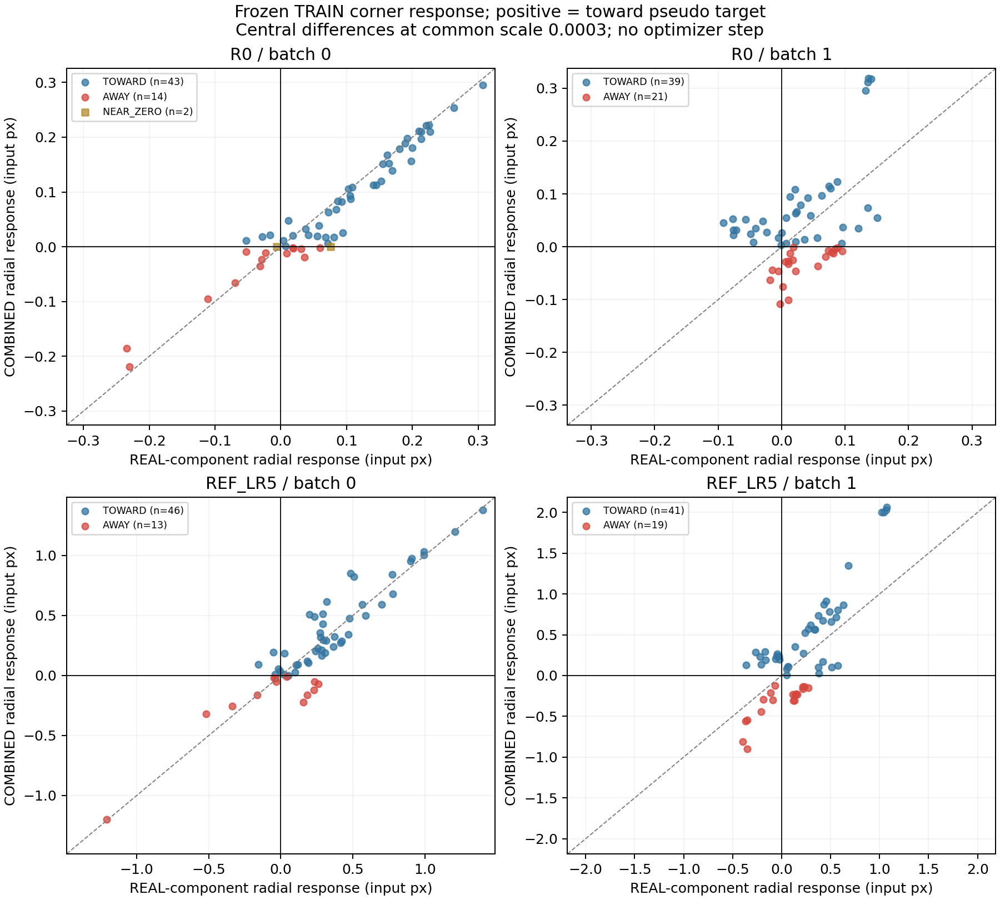
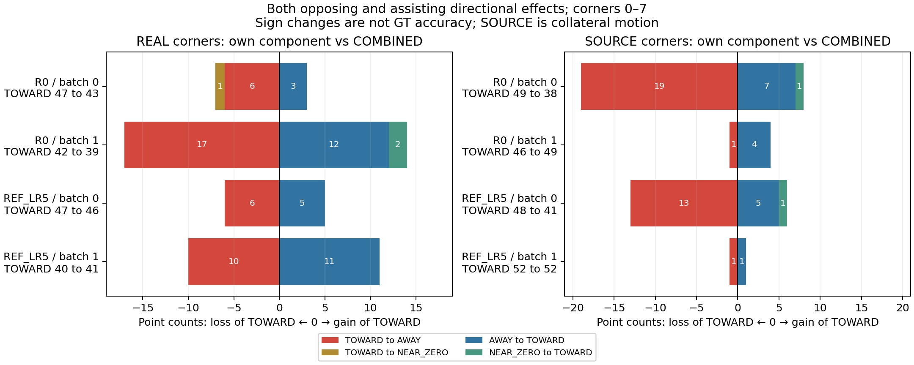

# Gradient transfer 진단 — fit 0

## 결론의 범위

동일한 고정 TRAIN 입력에서 실제 혼합 loss의 REAL·SOURCE gradient 성분이 **공유 pose/flow 파라미터를 통해 감독 좌표를 어느 방향으로 움직이는지** 측정했다. 양수는 기존 타깃을 향한 국소 반응이며 물리 GT 정확도나 6D 개선을 뜻하지 않는다. 새 학습·optimizer·checkpoint 저장·DEV 참조 읽기는 모두 0이다.

실제로 두 checkpoint·두 batch 모두 개별점 상쇄가 있었지만 반대 방향의 이득도 있었다. **REF의 코너 119점에서는 개선 방향을 잃은 16점과 얻은 16점이 같고, TOWARD는 87→87로 순개수 변화가 0이다.** 모든 batch의 전역 gradient cosine은 양수다. 따라서 국소 간섭은 관측됐지만 replay 제거 또는 source 가중치 감소가 전체 성능을 개선한다는 결론은 아니다.

아래의 `상쇄`는 REAL 성분만으로 TOWARD인 점이 COMBINED에서는 AWAY인 경우, `억제`는 NEAR_ZERO인 경우다. 두 batch에서 관측되어도 이 소표본의 국소 현상일 뿐 주된 학습 실패 원인이나 후속 학습의 성공을 확정하지 않는다.

| checkpoint / scope | REAL TOWARD | 판정 가능 분모 | 상쇄 | 억제 | 계속 TOWARD | 미해결 | 상쇄 이미지 / 전체 |
|---|---:|---:|---:|---:|---:|---:|---:|
| R0 / CORNERS_0_7 | 89 | 89 | 23 | 1 | 65 | 0 | 12/16 |
| R0 / ALL_9 | 99 | 99 | 23 | 2 | 74 | 0 | 12/16 |
| R0 / CENTER_8 | 10 | 10 | 0 | 1 | 9 | 0 | 0/16 |
| REF_LR5 / CORNERS_0_7 | 87 | 87 | 16 | 0 | 71 | 0 | 9/16 |
| REF_LR5 / ALL_9 | 99 | 99 | 17 | 0 | 82 | 0 | 10/16 |
| REF_LR5 / CENTER_8 | 12 | 12 | 1 | 0 | 11 | 0 | 1/16 |

## 반대 방향의 이득도 함께 세기

| checkpoint / scope | REAL TOWARD→COMBINED AWAY | TOWARD→NEAR_ZERO | AWAY→TOWARD | NEAR_ZERO→TOWARD | TOWARD 전체 REAL→COMBINED | 순개수 변화 |
|---|---:|---:|---:|---:|---:|---:|
| R0 / CORNERS_0_7 | 23 | 1 | 15 | 2 | 89→82 | -7 |
| R0 / ALL_9 | 23 | 2 | 15 | 2 | 99→91 | -8 |
| R0 / CENTER_8 | 0 | 1 | 0 | 0 | 10→9 | -1 |
| REF_LR5 / CORNERS_0_7 | 16 | 0 | 16 | 0 | 87→87 | +0 |
| REF_LR5 / ALL_9 | 17 | 0 | 16 | 0 | 99→98 | -1 |
| REF_LR5 / CENTER_8 | 1 | 0 | 0 | 0 | 12→11 | -1 |

이는 부호를 넘는 점의 개수일 뿐 개선·악화의 크기를 상계한 총효용이 아니다. 같은 입력·checkpoint에서 해로운 점과 이로운 점이 함께 있으므로 선택적으로 상쇄점만 보고 source의 전체 역할을 판단하지 않는다. ALL_9와 코너 전용 표의 차이는 center를 포함하는지의 차이다.

## 실제 입력과 계산 계약

- PLASTIC 기존 REF TRAIN 217장 중 정렬된 unique path의 midpoint 16장, 기존 합성 512장 중 16장이다. 점수·오차·DEV로 고르지 않았다. 두 batch는 각각 REAL 8 + SOURCE 8이며 checkpoint 간 RGB·box·target·support를 재사용한다.
- 기존 affine/HSV를 유지했고 새 occlusion은 없다. 실제 one2one TAL-assigned TRAIN anchor의 코너 0..7과 center 8을 기록한다. 배포 시 최고 confidence로 선택한 detection의 좌표를 측정한 것이 아니다. 코너 전용을 먼저 설명하고 ALL_9/support와 center를 별도 공개한다. 이는 기술적 보고 순서이며 protocol에 없는 사전 primary outcome을 만들지 않는다.
- 실제 full mixed graph의 global 분모와 RLE aggregate clamp 미분 gate를 보존한 성분 분해다. REAL 성분은 별도 real-only 학습을 재정규화한 loss가 아니다.
- R0는 E2E 시작 .8/.2, REF는 마지막 epoch .1/.9이며 저장된 frozen EMA이다. 원래 online 상태·optimizer moments·weight decay·clipping·EMA step을 복원한 것이 아니다.
- `d_role = -g_role / max(||g_real||, ||g_source||, ||g_combined||)`. 각 방향에 같은 분모를 써 상대 크기와 가산성을 보존한다. `theta ± eps·||theta||·d_role`의 중앙 유한차분 방향 반응을 eps=0.0003에 맞춰 표시한다. 단위는 input640 px이며 실제 한 optimizer step의 이동량이 아니다.
- 공통 scale은 **같은 checkpoint·batch 내부**의 세 방향에 공통이다. checkpoint 간에는 gradient norm과 E2E branch 가중치가 다르므로 response 절댓값 증가를 학습 능력 증가나 실제 학습률 효과로 해석하지 않는다.
- eps는 사전 고정한 0.0001 / 0.0003 / 0.001이다. 세 추정이 모두 +0.001px 초과일 때 TOWARD, 모두 −0.001px 미만일 때 AWAY, 모두 절댓값 0.001px 이하일 때 NEAR_ZERO, 나머지는 EPS_SENSITIVE다. 초기 잔차 ≤1e−8px는 NO_RESIDUAL이다.
- 작은 대칭 perturbation의 반올림 영향을 줄이기 위해 matmul/cuDNN TF32를 모두 끈 FP32 진단이다. 원래 학습 전체를 같은 정밀도 설정으로 재실행한 것이 아니다.
- 판정 분모는 REAL=TOWARD 중 COMBINED가 TOWARD/AWAY/NEAR_ZERO인 점이다. EPS_SENSITIVE·NO_RESIDUAL을 분모에서 제외하되 개수는 숨기지 않는다. 같은 이미지의 점은 독립 표본이 아니다.

## checkpoint / batch별 결과

| checkpoint / batch | REAL 점 | REAL TOWARD / 분모 | 상쇄 / 억제 / 미해결 | REAL 방향 반응 중앙값 | COMBINED 중앙값 | gradient cosine |
|---|---:|---:|---:|---:|---:|---:|
| R0 / 0 | 67 | 53/53 | 6 / 2 / 0 | 0.0683 | 0.0414 | 0.1158 |
| R0 / 1 | 68 | 46/46 | 17 / 0 / 0 | 0.0211 | 0.0229 | 0.0273 |
| REF_LR5 / 0 | 67 | 54/54 | 7 / 0 / 0 | 0.2585 | 0.2055 | 0.0856 |
| REF_LR5 / 1 | 68 | 45/45 | 10 / 0 / 0 | 0.1517 | 0.1866 | 0.2924 |

중앙값은 전체 해당 REAL 감독점의 중간 epsilon 반응이다. 상쇄 비율의 판정 가능 subset과 분모가 다르다. 위 미해결 열은 REAL=TOWARD 조건 이후의 COMBINED 미해결 수다. REAL 방향 자체의 EPS_SENSITIVE도 제외되는지 확인할 전체 부호 수는 아래와 같다.

| checkpoint / batch | REAL 방향 TOWARD / AWAY / NEAR_ZERO / EPS / NO_RESIDUAL | COMBINED 같은 순서 | 둘 중 EPS인 점 / 전체 |
|---|---:|---:|---:|
| R0 / 0 | 53 / 14 / 0 / 0 / 0 | 48 / 16 / 3 / 0 / 0 | 0/67 |
| R0 / 1 | 46 / 20 / 2 / 0 / 0 | 43 / 25 / 0 / 0 / 0 | 0/68 |
| REF_LR5 / 0 | 54 / 13 / 0 / 0 / 0 | 52 / 15 / 0 / 0 / 0 | 0/67 |
| REF_LR5 / 1 | 45 / 23 / 0 / 0 / 0 | 46 / 22 / 0 / 0 / 0 | 0/68 |

아래 산점도는 코너 0..7만 그리며 점 색은 COMBINED의 세 epsilon 부호 안정성 기준이다. 회색으로 표시되지 않은 점도 REAL 방향이 epsilon-sensitive일 수 있으므로 산점도 한 장만으로 상쇄 수를 세지 않는다. 세 epsilon의 일치는 이 유한차분 검사에서의 수치 안정성이지 통계적 확신도가 아니다.

## SOURCE 좌표의 부수 반응

| checkpoint | SOURCE 점 | SOURCE TOWARD / 분모 | TOWARD→AWAY | TOWARD→NEAR_ZERO | AWAY→TOWARD | NEAR_ZERO→TOWARD | 순 TOWARD 변화 |
|---|---:|---:|---:|---:|---:|---:|---:|
| R0 | 142 | 108/108 | 22 | 2 | 12 | 1 | -11 |
| REF_LR5 | 142 | 114/114 | 16 | 0 | 6 | 1 | -9 |

SOURCE 표는 해당 감독 좌표의 국소 이동이다. 합성 validation·retention 성능을 새로 측정한 것이 아니다.

아래 그림은 코너의 TOWARD 상실과 획득을 양쪽에 함께 보이고 각 행에 전체 TOWARD 점수를 표시한다. ALL_9 수치를 코너 수치와 혼합하지 않는다.

## gradient와 수치 검사

| checkpoint / batch | REAL norm | SOURCE norm | COMBINED norm | 분해 max abs error | 좌표 가산 잔차 median / max px |
|---|---:|---:|---:|---:|---:|
| R0 / 0 | 2.8687 | 1.5076 | 3.3917 | 8.2e-08 | 1.53e-05 / 8.22e-05 |
| R0 / 1 | 1.8999 | 1.2877 | 2.3241 | 4.52e-08 | 1.53e-05 / 6.29e-05 |
| REF_LR5 / 0 | 2.1564 | 1.6463 | 2.8229 | 8.94e-08 | 1.53e-05 / 0.000138 |
| REF_LR5 / 1 | 1.6151 | 1.6463 | 2.6217 | 5.96e-08 | 1.53e-05 / 6.11e-05 |

head/flow norm과 전체 부호 전이표는 [RESULTS.json](RESULTS.json)에 있다. 좌표 가산 잔차는 중간 epsilon의 벡터 중앙차분 `COMBINED − REAL − SOURCE`이며 gradient 분해 오차와 다른 검사다. 유한 perturbation·부동소수점 오차 때문에 정확히 0일 필요는 없다. 이번 최대 좌표 가산 잔차 0.000138px는 사전 부호 floor 0.001px보다 작았다.

flow gradient norm은 네 조건에서 모두 0이었다. 실제 두 branch의 RLE pre-clamp 값이 모두 음수이고 shared derivative gate가 0인 원 criterion의 동작이다. flow 경로를 누락하거나 detach해서 0으로 만든 것이 아니며, 전체 full-loss gradient와 성분 합을 flow 포함 허용 파라미터 전부에서 대조했다. 위치/visibility를 통한 head gradient는 남아 있었다.

전역 cosine이 네 조건 모두 양수라는 사실은 이 동일 normalization 아래 source 성분이 전체 REAL 성분 loss의 일차 감소 방향에 기여함을 뜻한다. 개별 좌표의 radial response는 그 전체 목적함수와 같지 않으므로 일부점 역전과 모순되지 않는다. 어느 지표도 물리 정확도를 직접 측정하지 않는다.

COMBINED 방향의 REAL 목적함수 일차 감소량을 REAL 방향의 감소량으로 나눈 값은 `1 + cosine·||g_SOURCE||/||g_REAL||`다. 이는 같은 scale에서의 미분값 비율이며 AdamW 또는 실제 유한 step의 성능 비율이 아니다: R0/batch0=1.06087, R0/batch1=1.01854, REF_LR5/batch0=1.06539, REF_LR5/batch1=1.29804.

각 ± perturbation에서 assignment·target·support 동일성과 복원 후 prediction bit-exact를 실행 코드가 단언했다. 아래 879개 state tensor exactness도 계측 당시의 runtime assertion 기록이다. 전체 ± 좌표와 state snapshot을 별도로 보존하지 않았으므로 사후 독립 두 번째 전체-state 감사라고 부르지 않는다. 저장 상태 tensor와 grad buffer 상태:

- R0: 879 state tensors exact=True; parameter `.grad` buffers all None=True.
- REF_LR5: 879 state tensors exact=True; parameter `.grad` buffers all None=True.

실제 계측 GPU 구간 5.331s. optimizer 생성 0, optimizer updates 0, fits 0, checkpoint writes 0. CPU 보고서 렌더 시간은 이 GPU 구간에 포함하지 않는다.

첫 시도는 symlink 경로 해석으로 합성 RGB의 `syn__` alias가 사라져 label 연결에 실패했고, 모델 로딩 전 assertion으로 중단했다. 실패 fixture/cache를 보존하고 같은 32개 image/label hash와 seed로 새 fixture의 alias만 복원했다. 두 번째 시도는 설치 패키지 코드의 외부 경로 hash 기록에서 중단했고 새 namespace의 binding 함수만 수정했다. 둘 다 모델·gradient 결과 관측 전 오류이며 입력 선택이나 epsilon을 사후 조정하지 않았다. [실행 정정 기록](EXECUTION_NOTES.md)을 함께 보존한다.

현재 설치된 Albumentations의 `ImageCompression quality_range` 인자 경고가 있었다. 이 진단에서 환경을 변경하지 않았고 checkpoint 간에는 같은 실제 tensor를 사용했지만, 과거 학습 당시의 증강 tensor를 bit-exact 재생했다고 주장하지 않는다.

## 과거 진단과 이번에 추가한 정보

이전 original-affine Plastic REF의 전역 cosine은 +.0108, −.0229, −.0586, −.4096으로 혼합이었다. 마지막 batch의 source projection은 −.4551이어서 전역 real-gradient 성분을 부분 상쇄했지만 역전하지는 않았다. Wood R0는 4/4 양수였고 Wood REF는 2양·2음이었다. 음의 cosine만으로 source를 실패 원인으로 확정하지 않았던 이유다.

이전 진단은 real/source 소배치를 따로 정규화하고 REF criterion을 5회 advance했다. 이번은 같은 mixed16 graph의 분모/gate를 유지하고 마지막 epoch에 맞춰 4회 advance한다. 따라서 수치의 exact replication 비교가 아니다. 이번에는 추가로 실제 공유 파라미터 방향이 개별 감독 좌표에 미치는 반응을 측정한다. 과거 coordinate-leaf descent와도 다른 질문이다.

## 판정과 남은 질문

- R0: 두 batch의 상쇄 개수 [6, 17], 억제 개수 [2, 0]. 상쇄 양 batch 관측=True, 억제 양 batch 관측=False.
- REF_LR5: 두 batch의 상쇄 개수 [7, 10], 억제 개수 [0, 0]. 상쇄 양 batch 관측=True, 억제 양 batch 관측=False.

REAL 타깃 방향이 COMBINED에서 사라지거나 역전하는 점이 양 batch에 존재하면 **그 고정 입력·checkpoint에서의 국소적인 source 성분 간섭**을 지지한다. 몇 점의 관측과 전체 타깃 개선을 막는 지배적 원인은 구분한다. 관측되지 않거나 epsilon 민감성이 크면 이 검사만으로 간섭을 채택하지 않는다. 두 방향 모두 개선해도 표현 능력·학습 궤적·일반화가 해결됐다는 뜻은 아니다.

기존 REF pseudo와 synthetic target 추종만 검사했다. 물리 signed-axis/corner 정답, 6D 정확도, 새로운 데이터에서의 일반화, 장기 AdamW 업데이트 또는 source 가중치 변경의 효과는 이 결과로 확정할 수 없다. 16 TRAIN 프레임·두 frozen checkpoint의 작은 결정론적 진단이며 DEV 기반 선택·새 학습 선택·자동 fit은 하지 않는다.

재현: [README.md](README.md). 고정 사전 명세: [PROTOCOL.json](PROTOCOL.json). 원자료의 hash binding과 공개 집계: [RESULTS.json](RESULTS.json).
