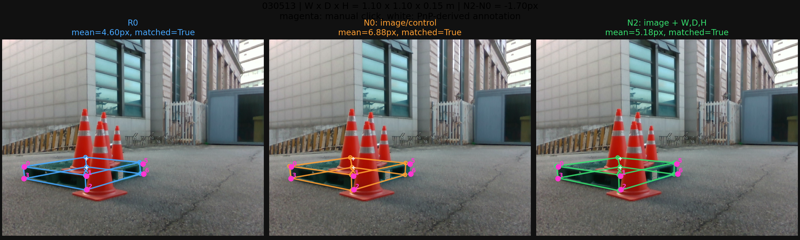
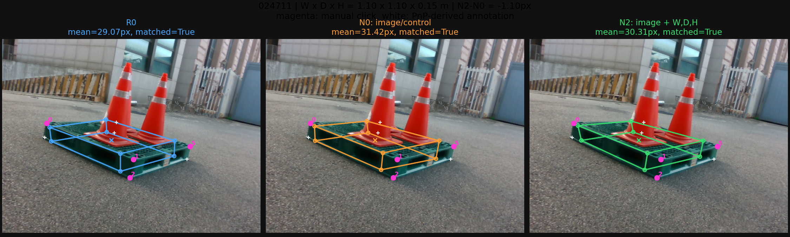
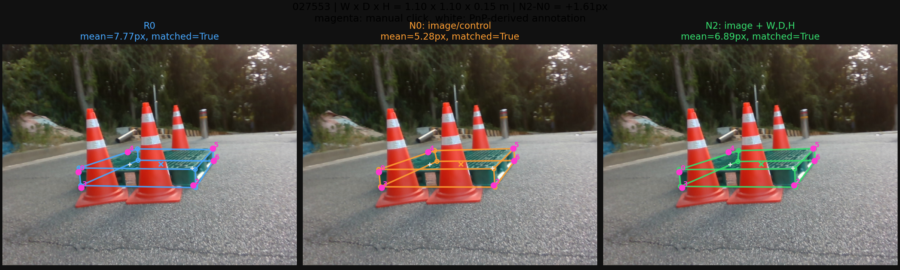
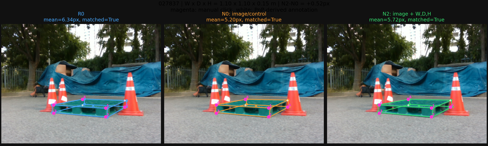

# 0918 정사각형 치수 입력 사례

고정 seed1의 N2−N0 프레임 평균 오차 차이에서 개선 2장과 악화 2장을 함께 선택했다. 결과를 보고 고른 진단용 그림이며 전체 성능 근거는 집계표다. 자홍색은 직접 클릭, 흰색은 PnP 생성 주석이다.

## 개선: 030513 (N2−N0 -1.70px)

## 개선: 024711 (N2−N0 -1.10px)

## 악화: 027553 (N2−N0 +1.61px)

## 악화: 027837 (N2−N0 +0.52px)

