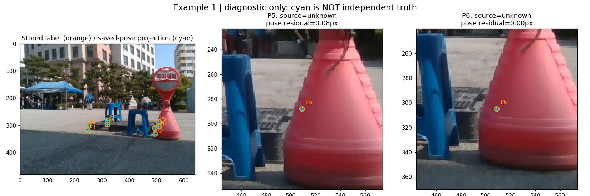
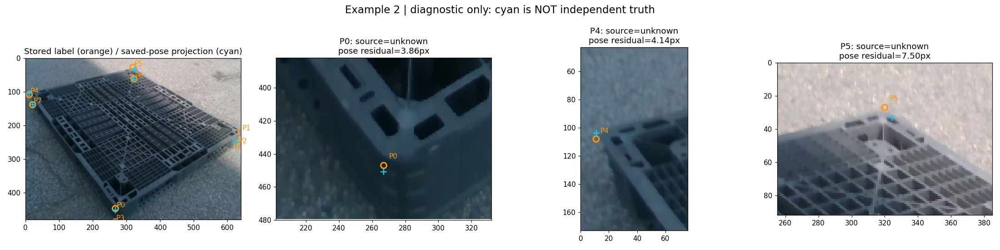
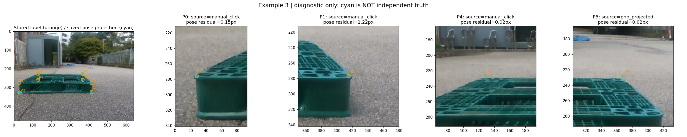

# 3D 코너 정의와 기존 GT 저장 방식 감사

**현재 GT를 전부 바꾸거나 재어노테이션할 근거는 확인되지 않았다.** 3D는 이상적 직육면체이고, 2D는 기존 클릭을 보존하는 구조다. 둥근 코너에서 두 정의가 달라질 가능성은 있지만 이 감사만으로 실제 정답 오차를 확정하지 않는다.

## 코드에서 확인한 사실

- `scripts/annotate/annotate_pnp.py:169`: P0…P7은 (±W/2, ±H/2, ±D/2), P8은 중심이다. 곡률·깎임·표면 세부 형상을 표현하지 않는다.
- `scripts/annotate/annotate_io.py:474`: `make_annotation`은 클릭한 좌표를 그대로 `projected_cuboid`에 저장한다. 이 필드 이름만 보고 모두 PnP 투영이라고 판단하면 안 된다. 미입력 점은 저장된 pose projection으로 채울 수 있다.
- `scripts/annotate/annotate.py:1207`: 기존 어노테이션 도구에 이미 T/TWO-LINE 기능이 있다. 두 선의 각 두 점, 총 네 클릭으로 교차점을 계산하고 source=extrapolated로 표시한다. 새로운 필수 어노테이션 절차가 아니다.
- source=manual_click은 입력 방법이지 실제 외형/가상 직육면체 구분이 아니다. source=unknown과 manual_kps 필드만으로 과거 사람의 의도나 입력 출처를 복원할 수 없다.
- 현재 TWO-LINE 입력 코드는 visibility=1도 함께 설정한다. 따라서 그 값만으로 실제 가려짐을 단정하지 않는다. 이번 감사에서는 수정하지 않았다.

## 동결 평가 입력의 출처 기록

아래는 최근 실험 입력 278장에 저장된 8개 코너의 출처 메타데이터 수이다. 평가 유효 마스크 적용 후의 정확도 분모가 아니며 unknown은 정답 오류를 뜻하지 않는다.

|종류|이미지|코너 출처 기록|
|---|---:|---|
|PLASTIC|128|unknown=1024|
|GREEN|150|manual_click=681, pnp_projected=519|

## 실제 사진 예시

주황 원=저장된 2D 좌표, 하늘색 +=저장된 pose와 치수로 다시 투영한 점. **하늘색은 더 정확한 새 정답이 아니다.** 같은 클릭으로 추정한 pose일 수 있으므로 둘의 차이는 적합 잔차일 뿐 GT 정확도나 둥근 모서리 오차가 아니다. 예측 모델은 표시하지 않았다. 모든 그림은 카메라 동적 P 인덱스이며 앞선 대칭 평가의 G 인덱스와 혼동하면 안 된다.

### 예시 1 — PLASTIC

|점|기록된 출처|저장 pose와 차이(px)|manual_kps 필드와 동일|
|---|---|---:|---|
|P5|unknown|0.08|True|
|P6|unknown|0.00|True|

### 예시 2 — PLASTIC

|점|기록된 출처|저장 pose와 차이(px)|manual_kps 필드와 동일|
|---|---|---:|---|
|P0|unknown|3.86|True|
|P4|unknown|4.14|True|
|P5|unknown|7.50|True|

### 예시 3 — GREEN

|점|기록된 출처|저장 pose와 차이(px)|manual_kps 필드와 동일|
|---|---|---:|---|
|P0|manual_click|0.15|True|
|P1|manual_click|1.22|True|
|P4|manual_click|0.02|True|
|P5|pnp_projected|0.02|True|

## 지금 할 일

### 확대 사진에서 관찰한 점

- 예시 1의 P5/P6 위치는 빨간 장애물로 가려져 있다. 원본 사진만으로 해당 팔레트 코너의 정확한 좌표를 독립 확인하기 어렵다. 저장 pose와 거의 같은 것은 독립 정답 검증이 아니다.
- 예시 2의 P0/P4/P5는 외형 주변에 저장돼 있지만, P5는 확대했을 때 외형과 떨어져 보이는 검토 후보다. 저장 pose와의 차이는 각각 3.86/4.14/7.50px다. 다른 위치를 정답으로 확정하거나 자동 이동하지 않았다. 표면의 끝인지 이상적 바깥 직선의 교차점인지 사진·저장 기록만으로 확정할 수 없다.
- 예시 3은 실제 클릭 출처인 P0/P1/P4와 PnP 출처인 P5가 함께 있다. 모두 manual_kps 필드에도 들어 있으므로 그 필드 이름만으로 모든 점을 직접 클릭한 정답이라고 판단하면 안 된다. GREEN 평가의 manual-only 마스크는 별도이며, 이번 출처 집계의 PnP 점 수를 그대로 평가 분모로 해석하지 않는다.

[확대 이미지 세 장만 보기](GALLERY.html). 주황은 기존 저장 좌표이고, 하늘색은 기존 pose의 투영이다. 어느 쪽도 이 감사에서 새로 정한 정답이 아니다.

사용자의 새 클릭·선 지정·GT 전체 변경은 중단한다. 명확한 코너는 기존 GT 유지, 애매한 코너는 미확인으로 남긴다. 특정 기존 점을 고치려면 그 점과 대응하는 바깥 직선/3D 정의가 독립적으로 확인돼야 한다. PnP 잔차가 작다고 정답임을 보장하거나, 잔차가 크다고 틀렸다고 판정하지 않는다.

읽은 annotation 278개 SHA256 전후 일치. 학습·pose 재추정·기존 GT/모델/평가 결과 변경 없음.
