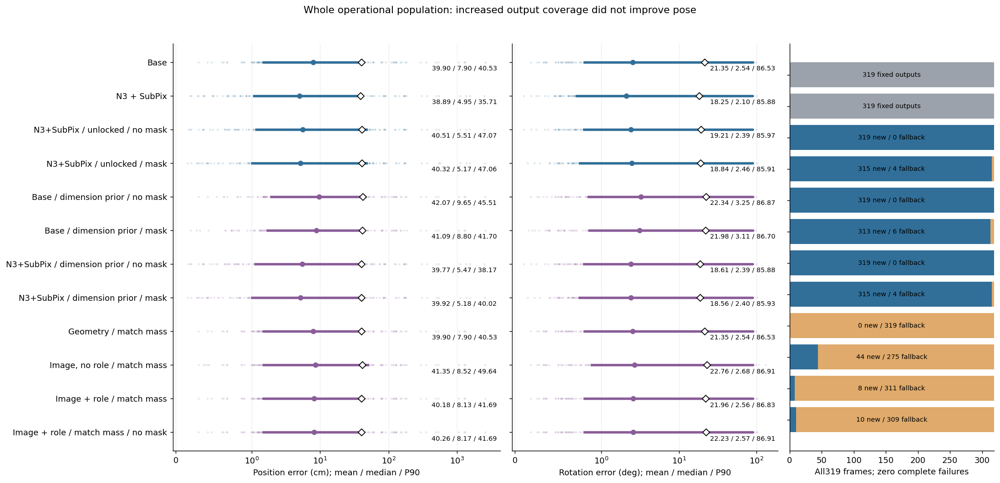
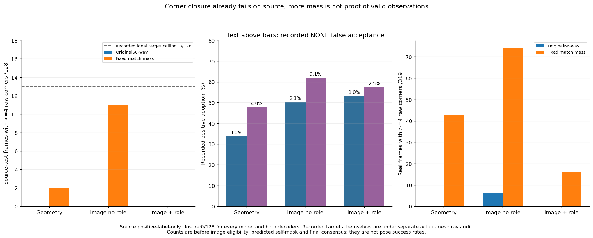

“가림 판단이 일부 틀려도 다른 유효 대응점으로 자세를 구하고 자기 가림 코너를 재투영했을 때, 기존 단순 대조보다 실제 위치·회전이 좋아졌는가?”

**아니요. 전체319장에서는 위치·회전을 함께 개선하지 못했다.** 새 자세가 나온 프레임에서는 예측 자기 가림 코너를 최종 자세의 재투영으로 대체했고, 그 초기 좌표나 재투영점을 최종 fit 관측으로 다시 넣지 않았다. 대응 존재 확률을 합산하면 새 자세가 더 나오지만 오차는 증가했다. 초기 치수 분기를 유지하는 절제는 일부 전역 분기 오류를 줄였으나 기존 N3→SubPix보다 나빴다.

이는 [원래 실험](../pallet_observation_refiner_20261009_v1/RESULT_KO.md)에 대한 후속 어려움 진단이다. 원래 게시 commit `6e3e96bd22396aca47b09ab1216a4a18fb2aa5b2`의 코드·원행·문서·그림111개는 해시로 보존했다. 새8조건과 성공 기준을 [PROTOCOL.json](PROTOCOL.json)에 고정한 뒤 실행했다. 가설을 도출할 때 기존 DEV319 결과를 보았으므로 이번319장은 독립 holdout 검증이 아니다. 실사 위치·회전·ADDsym reference는 기존 기하 재구성값이며 독립 물리 측정 GT가 아니다.

## 전체 결과와 분모

수치는 원행의 운용 출력이며 fallback도 포함한다. 17조건 각각319장이 산출됐고 완전 운용 실패는0장이다. 기존 고정 대조는 새 자세0/기본 반환0으로 표시하며 과거319출력을 뜻한다. ADDsym 원행은 m이고 표·CSV는 cm다. 극단 오차를 삭제하거나 cap하지 않았다.

| 조건 | 새 자세 | 기본 반환 | 위치 평균 cm | 회전 평균 ° | ADDsym 평균 cm |
|---|---:|---:|---:|---:|---:|
| Base | 0 | 0 | 39.8968 | 21.3519 | 56.1092 |
| N3 + SubPix | 0 | 0 | 38.8950 | 18.2523 | 52.4234 |
| Base / unlocked / no mask | 319 | 0 | 43.8494 | 25.4184 | 61.2809 |
| Base / unlocked / mask | 313 | 6 | 42.6822 | 23.4057 | 59.2792 |
| N3+SubPix / unlocked / no mask | 319 | 0 | 40.5136 | 19.2097 | 53.7631 |
| N3+SubPix / unlocked / mask | 315 | 4 | 40.3235 | 18.8390 | 53.7163 |
| 기존 Geometry head | 0 | 319 | 39.8968 | 21.3519 | 56.1092 |
| 기존 Image/no-role head | 3 | 316 | 39.8736 | 21.3575 | 56.0979 |
| 기존 Image/role head | 0 | 319 | 39.8968 | 21.3519 | 56.1092 |
| Base / dimension prior / no mask | 319 | 0 | 42.0705 | 22.3441 | 58.2882 |
| Base / dimension prior / mask | 313 | 6 | 41.0858 | 21.9843 | 57.3647 |
| N3+SubPix / dimension prior / no mask | 319 | 0 | 39.7678 | 18.6104 | 53.0460 |
| N3+SubPix / dimension prior / mask | 315 | 4 | 39.9158 | 18.5596 | 53.2461 |
| Geometry / match mass | 0 | 319 | 39.8968 | 21.3519 | 56.1092 |
| Image, no role / match mass | 44 | 275 | 41.3528 | 22.7611 | 58.1039 |
| Image + role / match mass | 8 | 311 | 40.1838 | 21.9576 | 56.7658 |
| Image + role / match mass / no mask | 10 | 309 | 40.2600 | 22.2297 | 57.1428 |

점은319개 모든 오차, 원은 중앙값, 마름모는 평균, 선은 P10–P90이다. 큰 오차 때문에 평균과 중앙값이 크게 다르다. 새 자세와 기본 반환은 오른쪽 막대에서 분리했다. [PREDICTIONS.jsonl.gz](PREDICTIONS.jsonl.gz)의 key는 `(method,id)`다.

## 평균·분산·표준편차·중앙값·P90

아래는 각319 운용 출력의 재집계다. 표본분산·SD는 ddof=1, 분위수는 선형 보간이다. 표본분산 단위는 cm²/°², SD는 cm/°다. 모든17조건의 운용/새 자세 조건부 통계102행은 [METRICS.csv](METRICS.csv), 원행 ID·비교 분모·CI는 [METRICS.json](METRICS.json)에 있다. 새 자세0이면 조건부 평균은 NA이며0으로 채우지 않았다.

### 위치 cm — 운용319장

| 조건 | 평균 | 표본분산 | SD | 중앙값 | P90 |
|---|---:|---:|---:|---:|---:|
| Base | 39.8968 | 36351.5141 | 190.6607 | 7.8969 | 40.5302 |
| N3 + SubPix | 38.8950 | 37992.8187 | 194.9175 | 4.9533 | 35.7092 |
| Base / dimension prior / no mask | 42.0705 | 36273.8484 | 190.4569 | 9.6519 | 45.5083 |
| Base / dimension prior / mask | 41.0858 | 36522.8802 | 191.1096 | 8.8034 | 41.6995 |
| N3+SubPix / dimension prior / no mask | 39.7678 | 37949.0702 | 194.8052 | 5.4740 | 38.1738 |
| N3+SubPix / dimension prior / mask | 39.9158 | 39094.6058 | 197.7236 | 5.1756 | 40.0231 |
| Geometry / match mass | 39.8968 | 36351.5141 | 190.6607 | 7.8969 | 40.5302 |
| Image, no role / match mass | 41.3528 | 36399.2753 | 190.7859 | 8.5239 | 49.6360 |
| Image + role / match mass | 40.1838 | 36349.3607 | 190.6551 | 8.1259 | 41.6903 |
| Image + role / match mass / no mask | 40.2600 | 36345.4375 | 190.6448 | 8.1669 | 41.6903 |

### 회전 ° — 운용319장

| 조건 | 평균 | 표본분산 | SD | 중앙값 | P90 |
|---|---:|---:|---:|---:|---:|
| Base | 21.3519 | 1190.8875 | 34.5092 | 2.5389 | 86.5273 |
| N3 + SubPix | 18.2523 | 1055.8135 | 32.4933 | 2.1003 | 85.8768 |
| Base / dimension prior / no mask | 22.3441 | 1174.5271 | 34.2714 | 3.2504 | 86.8735 |
| Base / dimension prior / mask | 21.9843 | 1183.2635 | 34.3986 | 3.1128 | 86.7026 |
| N3+SubPix / dimension prior / no mask | 18.6104 | 1052.5937 | 32.4437 | 2.3893 | 85.8792 |
| N3+SubPix / dimension prior / mask | 18.5596 | 1061.1101 | 32.5747 | 2.3989 | 85.9346 |
| Geometry / match mass | 21.3519 | 1190.8875 | 34.5092 | 2.5389 | 86.5273 |
| Image, no role / match mass | 22.7611 | 1269.4976 | 35.6300 | 2.6848 | 86.9081 |
| Image + role / match mass | 21.9576 | 1222.7390 | 34.9677 | 2.5600 | 86.8262 |
| Image + role / match mass / no mask | 22.2297 | 1235.9105 | 35.1555 | 2.5682 | 86.9081 |

### ADDsym cm — 운용319장

| 조건 | 평균 | 표본분산 | SD | 중앙값 | P90 |
|---|---:|---:|---:|---:|---:|
| Base | 56.1092 | 37050.3086 | 192.4846 | 8.7137 | 119.8890 |
| N3 + SubPix | 52.4234 | 38635.0730 | 196.5581 | 5.3503 | 119.9556 |
| Base / dimension prior / no mask | 58.2882 | 36911.0466 | 192.1225 | 11.6446 | 119.7567 |
| Base / dimension prior / mask | 57.3647 | 37183.6952 | 192.8307 | 10.8309 | 119.8599 |
| N3+SubPix / dimension prior / no mask | 53.0460 | 38590.3036 | 196.4441 | 5.9766 | 119.8514 |
| N3+SubPix / dimension prior / mask | 53.2461 | 39732.1447 | 199.3292 | 6.0266 | 119.8093 |
| Geometry / match mass | 56.1092 | 37050.3086 | 192.4846 | 8.7137 | 119.8890 |
| Image, no role / match mass | 58.1039 | 37063.2083 | 192.5181 | 9.3102 | 120.1376 |
| Image + role / match mass | 56.7658 | 37049.1038 | 192.4814 | 8.9195 | 120.0465 |
| Image + role / match mass / no mask | 57.1428 | 37052.5688 | 192.4904 | 9.1754 | 120.1376 |

## 같은 영상의 paired 비교

new−comparator가 음수일 때 개선이다. 기존과 동일한13세션·10,000개 세션 multiplicity 행렬을 재사용했고, [공개 행렬](BOOTSTRAP_SESSION_DRAWS.json.gz)에서95% CI를 독립 재계산할 수 있다. SD와 CI는 다른 값이다. 모든75쌍의 공통 운용/후보 새 자세/양쪽 새 자세 집합과 제외 ID를 공개했다. 과거 고정 대조에는 새 fit 개념이 없으므로 `both_new_pose`는0이며, 후보의 새 자세 집합에서 같은 대조 프레임을 비교하는 `candidate_new_pose`를 따로 쓴다.

| 비교 | 집합/장수 | 위치 Δcm [95% CI] | 회전 Δ° [95% CI] |
|---|---|---:|---:|
| Image + role / match mass − N3 + SubPix | common_operational/319 | +1.2889 [-2.1607, +3.9385] | +3.7053 [+0.9932, +5.7771] |
| Image + role / match mass − N3 + SubPix | candidate_new_pose/8 | +12.1956 [+6.4037, +14.1262] | +24.4292 [+17.7048, +44.6025] |
| N3+SubPix / dimension prior / mask − N3 + SubPix | common_operational/319 | +1.0208 [+0.4515, +1.8613] | +0.3073 [+0.1307, +0.5545] |
| N3+SubPix / dimension prior / mask − N3 + SubPix | candidate_new_pose/315 | +1.0338 [+0.4594, +1.8797] | +0.3112 [+0.1311, +0.5705] |
| Image + role / match mass − 기존 Image/role head | common_operational/319 | +0.2870 [+0.0000, +0.7070] | +0.6057 [+0.0000, +1.3301] |
| Image + role / match mass − 기존 Image/role head | candidate_new_pose/8 | +11.4459 [+5.0128, +13.5902] | +24.1538 [+17.3829, +44.4666] |
| N3+SubPix / dimension prior / mask − N3+SubPix / unlocked / mask | common_operational/319 | -0.4077 [-2.4713, +1.1529] | -0.2793 [-4.5274, +3.2622] |
| N3+SubPix / dimension prior / mask − N3+SubPix / unlocked / mask | candidate_new_pose/315 | -0.4129 [-2.5160, +1.1608] | -0.2829 [-4.6469, +3.2791] |

사전 지정 primary IMAGE_ROLE_MATCH_MASS와 secondary N3 치수 prior 모두 N3→SubPix보다 두 평균을 낮추지 못했다. primary의8개 새 자세만 보아도 같은8장의 대조보다 위치·회전이 나쁘다. 치수 prior와 이전 unlocked 솔버의 평균 차이는 음수지만 두 CI 모두0을 포함한다. 그 차이를 일반화된 성공으로 주장하지 않는다.

## KP 보정에서 무엇이 어려웠는가

| 어려움 | 관측 가능한 진단과 실제 증거 | 해석 |
|---|---|---|
| 정답 경계의 존재 | 실제 USD 메시·closest point·앞 표면 깊이·visible mask를 함께 검사 | 직육면체 모서리·hull 자체를 물리 경계 GT로 쓰면 안 된다. NONE와 IGNORE, 내부선·실제 외곽을 구분해야 한다. |
| 후보 범위와 이동량 | source-test 양성 normal offset 평균1.13px/중앙값0.69/P902.53; 영상 내915코너 초기 오차 평균2.73px | source는 좌표 이동이 비교적 작다. 채택 점의0.2px 개선과 실사 큰 오차 해결을 같은 난도로 해석하면 안 된다. |
| 대응 존재와 위치의 확률 | 경계 양성941개에서 Pmatch 중앙값은 약0.31, 내부 양성은0.82–0.97; 경계의 조건부 정답 두 bin 확률은0.59–0.64 | 위치 분포가 정답 근처에 있어도 존재 확률이 낮으면 관측을 잃는다. 66-way 최댓값과 존재 사건의 확률 합은 다르다. |
| 경계→선→코너 조립 | 이상적인 기존 감독으로도 test128중 영상 안≥4코너12; frozen3모델은 원래 decoder에서 각각0/128 | 일부 점의 정밀도보다 대응 그래프를 닫아 PnP 입력을 만드는 문제가 먼저 막혔다. 합성에서도 발생하므로 실사 전이만의 문제라고 할 수 없다. |
| 수치 경계 민감도 | 원래 라벨10,752개 재현, 정확한 경계 광선 NONE 중1,202개가 고정±0.05px에서 목표 깊이 실제 메시 교차 | 감독의 수치 민감도에 대한 구체적 증거다. 이웃 표면 hit를 자동으로 수정 GT나 RGB 경계 소유권 정답으로 승인하지 않았다. |
| 교차의 조건과 외삽 | 기존 NO_ROLE 교차는 지지선 span의최대186.9배 밖으로 외삽 | 선 두 개가 있다는 것만으로 안정된 코너가 생기지 않는다. 각도·지지 길이·외삽을 연속 값으로 기록했다. |
| 남은 대응의 정확도·배치 | 기존 N3 마스크 후 reference상 정확한 점≥4는192/319; 정확4·rank6에서도92.08cm/88.39° 사례 | 점 수와 국소 Jacobian rank는 정확한 전역 해를 보증하지 않는다. 실제 정확 점/최종inlier/배치를 함께 봐야 한다. |
| 강건 합의의 잘못된 일관성 | 고정 사례6inlier 중 reference상 정확2; 새 자세도176.85cm | 서로 일관된 오답이나 치수·위상 다중해는 잔차 합의만으로 걸러지지 않을 수 있다. |
| 숨은 점 복원과 자세 성능 | 숨은 재투영 오차와 직접 가시 손상을 별도 집계 | 재투영은 최종 R,t에서 파생되므로 자체가 fit 자세를 개선하지 않는다. 숨은 점 오차만으로 성공을 선언할 수 없다. |

이 분류의 원행은 [LEARNED_DIFFICULTY_ROWS](LEARNED_DIFFICULTY_ROWS.jsonl.gz), [GEOMETRY_DIFFICULTY_ROWS](GEOMETRY_DIFFICULTY_ROWS.jsonl.gz), [SOURCE_CEILING_ROWS](SOURCE_CEILING_ROWS.jsonl.gz), [POSTHOC_CORRESPONDENCE_ROWS](POSTHOC_CORRESPONDENCE_ROWS.jsonl.gz)에서 확인할 수 있다. reference상 정확함은 고정된8px 판정이며 독립 물리 GT 판정이 아니다.

초기 모델·N3를 새로 학습하지 않았다. 동일한 기존3×3,000업데이트 모델의 last 가중치만 사용했다. source-test에서 채택한 동일 양성 집합의 zero-offset 대비 평균 개선은0.16/0.21/0.22px지만 세 모델 모두4코너 조립은0이었다. existence합산은 NONE·IGNORE 채택도 늘린다. 기존 POSITIVE만으로 조립하면 모든 모델·양쪽decoder/cal+test에서4코너는0이다. [SOURCE_LOGIT_DIFFICULTY](SOURCE_LOGIT_DIFFICULTY.json)는65조건부 분포·엔트로피·정답 두 bin 질량을 공개한다.

## 실제 메시로 확인한 감독 문제

이미 있는 P0 RGB·실제 USD 형상·전달된 visible/amodal mask·기존 feature/target 캐시를 사용했다. 새 RGB·장면·수동 어노테이션은0이다. 고정source-test128장에서31,875개의 실제 광선과21,377개의closest-point 질의를 실행했다. 원래 POSITIVE2,333/NONE4,414/IGNORE4,005가 정확히 재현됐다.

실제 메시 위·영상 내·visible-mask 지지 NONE4,130개를 검사하면2,164개는 정확한 광선이 표면을 놓쳐 무한대였고1,966개는 목표보다 앞 표면에 맞았다. 후자는 실제 가림 증거가 있으므로 mask만으로 가시로 바꾸지 않았다. 무한대 중1,202개는 고정±0.05px에서 목표 깊이의 실제 표면 hit를 얻었다(경계 역할1,174). 원 코드의 tiny-inset 주석과 달리 실제 ray에는 이동이 없었다. 이것은 정확한 경계 광선의 민감도가 NONE 감독을 만드는 증거다. 해결되지 않은962개는 미해결로 남겼다.

원래 positive에 위 증거만 추가한 **기계적 진단**은4코너가 raw13→33/128, 영상 내12→28/128이었다. 수정된 감독·배포 출력·학습 성능은 아니다. 이 진단에서도100/128장은 영상 안4코너가 부족하다. 수치 감독만 고치면 전체 아이디어가 성공한다는 근거는 없다. [SOURCE_FINDINGS_KO.md](SOURCE_FINDINGS_KO.md)에는 정확한source/query/primitive/깊이 사례와 한계를 자세히 적었다.

## 실제 영상의 실패와 부분적 개선

아래 사례는 성능 집계 후 사전 지정한 기전 사례와 primary가 새 자세를 구한8장 중 BASE 대비 최대 위치 감소/증가 ID를 선택한 설명 그림이다. 전체319 평균은 사례 선택과 독립이다. 노랑은 관측·선 지지, 초록은 최종inlier, 빨강은 예측 자기 가림, 주황은 최종 자세 전체 모델 투영, 분홍 점선은 기하 reference다. 주황 전체 투영은 검토용이며 native 출력에서 모든 점을 재투영으로 바꿨다는 뜻이 아니다.

`plastic_night_01:038630`: 기존 N3→SubPix 3.28cm/2.64°→unlocked92.08cm/88.39°→치수 prior13.88cm/1.38°다. pool/inlier는[1,2,4,5]의4개 정확 대응이고 국소rank6이다. prior는 초기 선택한 cf_extents=[1.3,0.11,1.1] 분기를 유지한다. unlocked는[1.1,0.11,1.3]을 골랐다. prior가 큰 분기 오류를 줄였어도 위치는 원래 대조보다 나쁘다.

`eval_pallet09:1778653806958839552`:6개 합의 중 reference상 정확2개로, 초기182.01cm/16.47°가176.85cm/16.30°로 조금 좋아져도 정확한 자세라고 할 수 없다. `wood_night_01:030607`은 primary 새 자세8장 중 BASE 대비 위치 감소가 최대인 사례이며6.01→4.87cm지만 회전3.01→5.50°로 악화한다. `wood_night_01:030825`는 같은8장 중 BASE 대비 위치 증가가 최대인 사례이며1.86cm/2.90°→79.82cm/102.02°다. [VISUAL_REVIEW.json](VISUAL_REVIEW.json)에 이미지 원본SHA·crop·ID·방법·rowSHA·selection이 있다.

## 가림 오판, 최종 inlier와 실패를 분리

원 실험 N3 마스크가 알려진 사람 상태와 틀린91장 중21장은 위치·회전이 모두 개선됐다. 알려진 상태가 맞는228장 중77장은 둘 다 악화됐다. 새 N3 prior에서도91장 중16개가 둘 다 개선되고,228장 중73개가 둘 다 악화된다. 완벽한 가림 분류를 필요조건으로 쓰지 않았다. 알려지지 않은 사람 상태는 UNKNOWN으로 남긴다.

correct/wrong/unknown pool과 final inlier, 남은 정확 점의 수·3D배치·영상 배치·국소rank, 오제외/오잔류 ID는 후행 참조 annotation으로 기록했다. **GT를 관측 선택이나 최종 fit에 넣지 않았다.** 새코드와 원행에서 no-match 초기 좌표 자동 채움은false, 재투영 관측 재사용은false다. H가 재추정 후 달라져도 프레임을 실패로 바꾸지 않았다.

| 새 조건 | fit 실패 이유(그 뒤 기본 반환) | 다중 후보가 기록된 새 자세 |
|---|---|---:|
| Base / dimension prior / no mask | 없음 | 319 |
| Base / dimension prior / mask | {'insufficient_observations': 1, 'insufficient_consensus': 5} | 313 |
| N3+SubPix / dimension prior / no mask | 없음 | 319 |
| N3+SubPix / dimension prior / mask | {'insufficient_observations': 1, 'insufficient_consensus': 3} | 315 |
| Geometry / match mass | {'insufficient_observations': 319} | 0 |
| Image, no role / match mass | {'insufficient_consensus': 11, 'insufficient_observations': 264} | 44 |
| Image + role / match mass | {'insufficient_observations': 309, 'insufficient_consensus': 1, 'degenerate_or_numerical_generation_failure': 1} | 8 |
| Image + role / match mass / no mask | {'insufficient_observations': 306, 'insufficient_consensus': 2, 'degenerate_or_numerical_generation_failure': 1} | 10 |

`insufficient_observations`는 실제 유효 입력<4, `insufficient_consensus`는 지지 합의 부족이다. 원 솔버의 `degenerate_or_numerical_generation_failure`는 생성 단계의 퇴화/수치 실패 묶음이며 여기서 임의로 하나의 원인으로 바꾸지 않았다. `multiple_solutions`는 기록된 대안 존재이며 자동 실패 또는 전역 유일성 증명이 아니다. 새 fit 실패와 운용 완전 실패, 기본 출력 반환을 구별했다.

## 직접 가시점 손상과 숨은 점 오차

| 경로 | 직접 가시1759점 평균px 전→후 / 악화점수 | 사람 자기 가림448점 평균px 전→후 | 실제 재투영 ID의 평균px 전→후 / 점수 |
|---|---|---|---|
| N3+SubPix / dimension prior / mask | 19.5559→19.5524 / 12 | 20.5106→19.8427 | 21.0379→20.1822 / 383 |
| Image, no role / match mass | 20.8311→20.8209 / 69 | 21.4148→25.9130 | 10.3643→47.2428 / 54 |
| Image + role / match mass | 20.8311→20.8269 / 13 | 21.4148→22.3987 | 5.7756→60.8290 / 8 |

사람 자기 가림 집합과 알고리즘 재투영 집합은 다르므로 분모도 다르다. fallback으로 변하지 않은 점은 전/후 같은 집합으로 유지했다. ROLE의 실제8재투영점 평균은5.78→60.83px다. 다른 경로에서 숨은 오차가 내려도 위치·회전 개선을 대신하지 못한다.

## 실제 전체 경로 처리시간과 실행량

조용한 창에서26실사×5반복으로130회/경로를 측정하고20warmup/경로를 별도 실행했다. 총600회다. RAM BGR에서 fresh detector(공유neck)→좌표 보정/관측→fresh초기pose→새가설 bank→강건fit→숨은 재투영까지 포함했다. RGB 디코딩·모델 로드·참조검산·journal은 구간 밖이다. 기존 시간 합산이나 정확도 캐시 재생이 아니다.

| 경로 | N | 평균ms | 분산ms² | SDms | 중앙값ms | P90ms |
|---|---:|---:|---:|---:|---:|---:|
| Base | 130 | 11.7403 | 1.7016 | 1.3045 | 11.3570 | 13.3902 |
| N3 + SubPix | 130 | 15.9395 | 1.9448 | 1.3946 | 15.8957 | 17.8963 |
| N3+SubPix / dimension prior / mask | 130 | 40.9210 | 36.3526 | 6.0293 | 42.5263 | 44.9674 |
| Image + role / match mass | 130 | 20.8219 | 32.3445 | 5.6872 | 20.6547 | 22.4887 |

ROLE runtime panel의 운용 상태는 {'BASELINE_FALLBACK': 130}다. 이 선택된26패널의 속도·산출 분포를 전체319 학습 성공률로 일반화하지 않았다. 모든600출력·initial/final pose·hidden replacement가 봉인된 평가 경로와1e-7 tolerance로 일치했다. 자원 상태7스냅샷에서 경쟁·온도 guard를 통과했다. [RUNTIME_ROWS](RUNTIME_ROWS.jsonl.gz), [RUNTIME.json](RUNTIME.json).

새 정확도 평가:8×319=2,552경로. 기존 unlocked4×319=1,276경로를 실제 재실행해 좌표·R,t·T/R/ADDsym 최대차0을 확인했다. pilot26×4=104새경로+104기존재생은 GT 채점 전에 수행했다. 정확도 단계는 동일 입력의 초기 자세와 고정logits를 재사용했으며 detector/head forward0이다. 따라서 정확도 솔버 구간26.126초는 배포 latency로 쓰지 않았다.

source 고정head CPU 진단은24+48=72 batch16 forward,1,152 image-head exposures였다. 추가 학습0, 새RGB0, 새실사·수동annotation0이다. 실제 전체 경로에서는 detector600+내부초기화1, 기존 N3 forward300, 고정 ROLE head150, 초기historical pose600+feature-role초기pose150, 강건후단300을 실행했다. 원래9,000학습 update와 원 실험 실행량을 새 실행량으로 세지 않았다. 자세한 가설/LM/실패·검산·시도 기록은 [CAUSAL_POSE_EXECUTION](CAUSAL_POSE_EXECUTION.json), [SOURCE_DIAGNOSTIC_EXECUTION_COUNTS](SOURCE_DIAGNOSTIC_EXECUTION_COUNTS.json), [BUILD_LEDGER](BUILD_LEDGER.json)을 참고한다.

## 어떤 요소가 효과를 냈고 무엇은 필요 없었는가

| 요소 | 이번 증거로 말할 수 있는 결론 |
|---|---|
| 완벽한 가림 분류 | 성공 필요조건이 아니다. 오판이 있어도 실제 개선한 프레임이 있다. 반대로 알려진 mask가 맞아도 악화하므로 분류정확도만 성공 지표로 쓰지 않는다. |
| mask없는 강건PnP | 기존 필수 대조에 포함했고 전체 평균에서는 단순 N3보다 나빴다. 강건만으로 충분하다는 근거가 없으며, 이 대조를 생략하고 새 판단기 필요성을 주장하지 않았다. |
| 영상·역할 경계 학습 | 기존 source 양성 일부의 좌표를 조금 개선했으나 source graph와 실제 자세가 막혔다. 현재 role포함이 필요하거나 효과적이라는 후단 개선 근거는 없다. 새role classifier나 대형 backbone 필요성도 입증하지 않았다. |
| 존재 확률 합산 | joint66-way와 존재 사건의 MAP 차이를 제거해 새 자세 산출을 늘렸지만 실제 오차를 악화했다. 후보 채택 증가를 성공으로 볼 수 없다. threshold를 조정해 다시 고르지 않았다. |
| 초기 치수 분기 prior | 일부 큰 전역 branch오류를 줄일 수 있지만 잘못된 초기분기도 보존할 수 있다. 고정N3 단순대조를 이기지 못했다. 원래 prior-free 솔버 계약을 바꾸지 않고 새별도절제로 공개했다. |
| 최종 숨은 재투영 | 요구된 출력처리를 수행했다. fitR,t를 고친 독립 정보가 아니므로 재투영 그 자체를 위치·회전 개선 원인으로 주장하지 않는다. |

성공을 가능하게 하려면 먼저 물리적으로 관측 가능한 target과 경계NONE의 수치 판정을 검증하고, 남은 독립 관측이 실제 자세를 구할 만큼 충분한지 확인해야 한다. 이번 데이터에서 단순히 가림 정확도·채택률·픽셀loss를 높이는 것만으로 해결될 조건이 아니었다. 부분 선관측 경로는 원 실험의 동일 IMAGE_ROLE point+line 별도 절제를 그대로 유지했으며, 이번 point 경로에 선·그 선의 교차점을 중복 관측으로 추가하지 않았다.

수정된 감독에 의한 새학습, 새로운 성공 모델, 새로운 holdout 확인은 **미실행**이다. 기존 감독이 정확하다고 가장해 새 모델을 학습하지 않았고, 부정적인 성능 때문에 설정·seed를 바꿔 반복하지 않았다. 원 실험의 E6 통제4변형 미실행·과거 FIXED_CONTROLS의 BASE293+SUBPIX293=586행 R/t 미저장도 해결했다고 보고하지 않는다. 이586행은 저장 metric의 재집계는 가능하지만 독립 pose 재계산은 불가능하며, 새2552행의 R/t 누락을 뜻하지 않는다. 진단이 완료됐다는 사실과 성능 목표를 달성했다는 주장은 구별한다.

## 다른 사람이 확인하는 방법

표의숫자는 [METRICS.csv](METRICS.csv), 모든2552새행은 [PREDICTIONS.jsonl.gz](PREDICTIONS.jsonl.gz), 해시·직접검산은 [REVIEW_CHECKS.json](REVIEW_CHECKS.json)과 [REVIEW_MANIFEST.json](REVIEW_MANIFEST.json)에서 연결한다. [README.md](README.md)의 명령은 private 영상·가중치·GPU 없이 공개파일만 검산한다. [REPRODUCE.md](REPRODUCE.md)는 검산과 실제재실행에 필요한 원본을 구분하고, 완성된 산출물을 덮어쓰지 않는 방법을 설명한다.

전용브랜치 `research/observation-refiner-robust-pnp-20261009`에 정상commit/push하고 원격SHA를 검증한다. main 병합·push와 force push는 하지 않았다. 게시 전 source상태·가중치·원래111파일 보존 및 디스크공간 때문에 사용한 독립 tmpfs게시clone은 [PUBLICATION_PRECHECK.json](PUBLICATION_PRECHECK.json)에 기록한다. 게시SHA·원격일치 영수증은 [PUBLICATION.json](PUBLICATION.json)을 참고한다.
