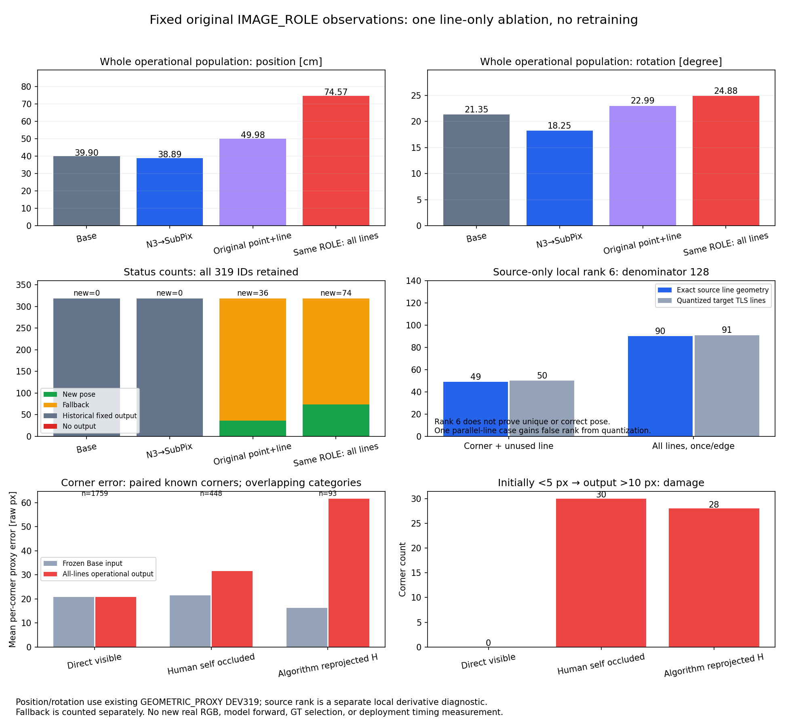
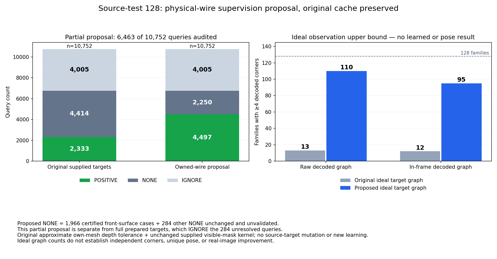

“가림 판단이 일부 틀려도 다른 유효 대응점으로 자세를 구하고 자기 가림 코너를 재투영했을 때, 기존 단순 대조보다 실제 위치·회전이 좋아졌는가?”

**아니요. 이번 고정된 추가 절제도 전체319장의 위치·회전을 함께 개선하지 못했다.** 같은 IMAGE_ROLE 관측을 선마다 한 번씩 쓰면 새 자세가36→74장으로 늘지만, 운용 평균은 위치49.98→74.57cm·회전22.99→24.88°로 악화했다. 단순 N3→SubPix의38.89cm·18.25°보다도 나쁘다. 성공한 산출물로 보고하거나 이 절제를 채택하지 않는다. 숨은 코너는 새 자세의 재투영으로 실제 교체했으며 초기 좌표 유지나 재투영점 재fit으로 변경하지 않았다.

이 보고서는 [원래 필수 무학습·학습·강건PnP 실험](../pallet_observation_refiner_20261009_v1/RESULT_KO.md), [KP 어려움 진단과8조건 실험](../pallet_kp_difficulty_20261010_v1/RESULT_KO.md)에 대한 추가 기록이다. 이전 게시189개 파일은 [PRIOR_PUBLICATION_BINDINGS.json](PRIOR_PUBLICATION_BINDINGS.json)의 SHA·크기로 보존한다. 이전 보고서의 결과나 그림을 덮어쓰지 않았다. 이번 실사319장·13세션은 반복 개발 자료이며 독립 holdout이 아니다. T/R/ADDsym reference는 기존 **GEOMETRIC_PROXY** 기하 재구성값으로, 독립 물리 측정 GT와 구분한다.

## 실제로 실행한 변경

[PROTOCOL.json](PROTOCOL.json)을 실사 fit와 채점 전에 고정했다. 기존 seed1·step3000 IMAGE_ROLE의 원래66-way MAP 관측·선 선택·logits·초기 자세·point-only 시작점·soft_l1 scale8·최대50평가·선 끝점1/√2 정규화는 그대로다. 같은 선에서 유도한 코너와 선을 중복 관측으로 세지 않고, **모든 선택된 선을 edge마다 한 번씩** 사용하는 C2 절제 하나를319장에 실행했다. 점 관측 residual은0개다. 이는 국소 line refinement이며, 독립4점으로 초기화하는 강건PnP의 성능을 대신하는 실험이 아니다.

노이즈가 있는 관측선 normal만으로 rank6이 생길 수 있어, 최종 자세의 정확한 모델선 normal과 analytic pose Jacobian을 추가로 검사했다. 기존1e-10 column-normalized SVD 기준을 사용했다. 이 rank 검사는 국소 관측 가능성일 뿐, 물리적으로 옳은 관측선·전역 유일해·정확한 자세를 보증하지 않는다. rank 조건만으로 성공을 선언하지 않는다.

초기 자기 가림 코너의2D좌표는 fit에 들어가지 않았다. 새 R,t가 있으면 해당 H 코너를 재투영으로 교체했고, 재투영 결과를 독립 관측처럼 다시 쓰지 않았다. 모델의3D 선 끝점과 숨은 초기2D좌표는 다른 개념이다. 자기 가림 마스크의 오판·재추정 후 변화는 기록하며 자동 프레임 실패 조건으로 쓰지 않았다. [GEOMETRY_SEALED.jsonl.gz](GEOMETRY_SEALED.jsonl.gz)를 GT 파일을 읽기 전에 봉인한 뒤 [PREDICTIONS.jsonl.gz](PREDICTIONS.jsonl.gz)에 채점했다.

## 전체319장 결과와 산출 상태

| 경로 | 새 자세 | 기본 출력 반환 | 완전 실패 | 위치 평균 cm | 회전 평균 ° | ADDsym 평균 cm |
|---|---:|---:|---:|---:|---:|---:|
| Base 과거 고정 출력 | — | — | 0 | 39.8968 | 21.3519 | 56.1092 |
| N3→SubPix 과거 고정 출력 | — | — | 0 | 38.8950 | 18.2523 | 52.4234 |
| 원래 IMAGE_ROLE point+line | 36 | 283 | 0 | 49.9831 | 22.9880 | 66.4039 |
| 동일 IMAGE_ROLE 모든 선 한 번 | 74 | 245 | 0 | 74.5705 | 24.8787 | 91.1890 |

과거 고정 대조의 신규 fit·fallback 횟수는 해당 없음이다. 원행의0은 과거 고정319출력을 이번에 다시 추정하지 않았다는 뜻이다. 새 조건의245 fallback은 고정 Base 반환이다. 242장은 원래 local point/line 추정 실패,2장은 독립 factor 없음,1장은 추가 모델선 rank 부족이었다. 큰 오차도 전부 포함했고 cap·삭제·성공 프레임만의 평균으로 바꾸지 않았다. 최대 위치 오차4214.12cm도 남겼다.

위 그림은 [METRICS.json](METRICS.json)과 [SOURCE_OBSERVATION_GATE.json](SOURCE_OBSERVATION_GATE.json)에 직접 연결된 과학 그림이다. 아래쪽 사람 자기 가림 집합과 알고리즘 재투영 집합은 중첩되며 분모가 다르다. [FIGURE_BINDING.json](FIGURE_BINDING.json)에 데이터·그림 SHA가 있다.

## 평균·분산·표준편차·중앙값·P90

아래 표는 운용319개의 원행 재집계다. 표본분산은ddof=1이며 SD는 프레임 간 산포다. 위치/ADDsym 평균·SD·중앙값·P90 단위는cm, 분산은cm²다. 회전은°/°²다. 모든4경로·운용/새 자세 조건부 통계는 [METRICS.csv](METRICS.csv)에 있다.

| 경로 / 지표 | 평균 | 표본분산 | SD | 중앙값 | P90 |
|---|---:|---:|---:|---:|---:|
| Base / 위치 | 39.8968 | 36351.5141 | 190.6607 | 7.8969 | 40.5302 |
| N3→SubPix / 위치 | 38.8950 | 37992.8187 | 194.9175 | 4.9533 | 35.7092 |
| 원래 point+line / 위치 | 49.9831 | 52923.1484 | 230.0503 | 9.1554 | 58.2516 |
| 모든 선 / 위치 | 74.5705 | 117104.2465 | 342.2050 | 10.9912 | 95.5877 |
| Base / 회전 | 21.3519 | 1190.8875 | 34.5092 | 2.5389 | 86.5273 |
| N3→SubPix / 회전 | 18.2523 | 1055.8135 | 32.4933 | 2.1003 | 85.8768 |
| 원래 point+line / 회전 | 22.9880 | 1182.4739 | 34.3871 | 3.1497 | 86.5273 |
| 모든 선 / 회전 | 24.8787 | 1205.8323 | 34.7251 | 4.2341 | 86.8262 |
| Base / ADDsym | 56.1092 | 37050.3086 | 192.4846 | 8.7137 | 119.8890 |
| N3→SubPix / ADDsym | 52.4234 | 38635.0730 | 196.5581 | 5.3503 | 119.9556 |
| 원래 point+line / ADDsym | 66.4039 | 53296.3226 | 230.8600 | 11.0746 | 120.5731 |
| 모든 선 / ADDsym | 91.1890 | 116708.6096 | 341.6264 | 14.2988 | 121.4149 |

새 자세74장만의 위치 평균은211.6791cm·SD623.4940cm·중앙값42.7833cm·P90277.2652cm다. 회전 평균23.3413°·SD26.2088°·중앙값12.7062°·P9055.0254°다. 산출률이 늘어난 것이 정확도 개선을 뜻하지 않는다. 나머지245장을 빠뜨리면 운용 결과를 잘못 설명한다.

## 같은 영상·세션의 비교

기존13세션·10,000개 bootstrap draw를 그대로 재사용했다. Δ는 새조건−대조이며 양수는 악화다. 모든 ID·집합·제외 ID·세 지표 CI는 [METRICS.json](METRICS.json)에 있다. SD와95% CI를 혼동하지 않는다.

| 비교 / 공통 운용319장 | 위치 Δcm [95% CI] | 회전 Δ° [95% CI] |
|---|---:|---:|
| 모든 선 − N3→SubPix | +35.6755 [11.9871, 73.6358] | +6.6264 [3.9981, 9.2977] |
| 모든 선 − 원래 point+line | +24.5874 [3.6829, 61.1579] | +1.8907 [0.9460, 3.2860] |

양쪽이 새 자세를 낸36장의 공통집합에서는 point+line 대비 위치−1.2565cm·회전−0.0162°의 작은 차이가 나지만, 이 집합은 새로 산출한38장의 큰 오류를 제외한다. 두 CI의 상한은0이며 전체319 결과를 대체하지 않는다. 공통 새 자세·후보 새 자세·전체 운용을 함께 공개했다.

## 마스크 오판과 자세 성능, 코너 손상

known 사람 상태와 마스크가 다른89장 중22장은 새 자세·67장은 fallback이다. N3→SubPix 대비22개 새 자세 중19개는 T/R 모두 악화,3개는 혼합이었다. known 상태가 같은230장 중52장은 새 자세·178장은 fallback이고,52개 중42개는 모두 악화·9개는 혼합·1개는 모두 개선이었다. UNKNOWN을 정답으로 채우지 않았다. 마스크 일치가 자세 성공을 보증하지 않으며, 오판 때문에 프레임 자체를 배제하지도 않았다. 아래 오류는 기존 기하 reference와 native 좌표계로 계산한2D 오차다.

| 코너 집합 | 점 수 | 평균 오차 px 초기→출력 | 초기<5px→출력>10px 손상 |
|---|---:|---:|---:|
| 사람 직접 가시 | 1759 | 20.8311→20.7336 | 0 |
| 사람 자기 가림 | 448 | 21.4148→31.5673 | 30 |
| 실제 재투영 H 중 reference와 짝지을 수 있는 점 | 93 | 16.3158→61.6600 | 28 |

사람 자기 가림과 알고리즘 H는 다른 집합이다. 실제 H 재투영은97점이며, reference와 짝지은93점의 오차만 위에 표시했다. 나머지4점을0px로 채우지 않았다. fallback의 좌표가 그대로인 경우도 같은 분모로 남겼다. 새 자세74장 내부에서는 직접 가시410점 평균16.1795→15.7616px, 사람 자기 가림108점14.9072→57.0211px다. 직접 가시 평균의 작은 감소만으로 자세 성공을 말할 수 없다. [POSTHOC_ROWS.jsonl.gz](POSTHOC_ROWS.jsonl.gz)는4×319=1276행의 native 입력/출력/reference·known 상태·재투영 ID·마스크 관계를 포함해 독립 검산을 지원한다. 이 후행 reference는 추론 입력으로 쓰지 않았다.

## 관측 조립의 병목은 확인했지만 해결책의 성공은 아니다

고정 source-test128장에 원래 양성 경계 관측을 이상적으로 공급하는 산술 진단을 했다. 정확한 소스 모델선 기준으로 원래 코너+미사용선 표현의 국소rank6은49/128, 모든 선을 한 번씩 쓰면90/128이었다. 코너를 만들며 선을 소모하면41장의 독립 기하 정보가 사라졌다. 이는 학습·실사 fit·정답 pose 주입 결과가 아니라 소스 자세에서 derivative를 계산한 국소 진단이다.

양자화된 target TLS선에서는50/91이 나오며, 평행선[0,2,4]만 있는 `P0__shard_01_f1126`은 TLS normal 오차로 가짜rank6이 된다. 정확한 모델선은rank5다. 따라서 노이즈 normal의 rank를 그대로 받아들이지 않았다. analytic와 finite-difference Jacobian 검산을 공개했다. **정보를 더 보존하는 표현도 실제 관측이 틀리면 나쁜 자세를 더 많이 산출한다.** 이번319장의 실패가 그 대조다. 소스 rank90을 실사90개 성공으로 해석하지 않는다.

## 실제 메시 경계에 대한 감독 검산

기존 RGB·USD 실제 메시·전달된 mask·feature/target cache를 이용했다. 새 RGB·수동 annotation·새 N3·새 seed·loss/PnP 역전파·대형 모델은0이다. box/hull은 실제 팔레트 마스크나 정답 경계를 대신하지 않았다. 메시의 모든 점이 들어가는 enclosure는 **이미 실제 메시의 경계에 놓인 점** 앞에 첫 표면이 어디까지 올 수 있는지의 깊이 상한에만 사용했다.

소스 cuboid의 수학적 경계점은 실제 USD 경계와 수nm 정도 다를 수 있다. float64에서도 기존 positive2333개와 무한대NONE2164개는 strict machine-membership를 통과하지 못했다. 따라서 이론상 box 진입점이라는 이유만으로 표면 hit·positive를 승인하지 않았다. 인접±0.05px hit1202개 역시 그 자체로 수정 GT가 아니다.

실제 float64 메시의 좌표를 정확히 weld한 wire에 대해 별도 후보를 만들었다. 후보는 실제 공유 경계의 두90° 비공면 triangle이 소유하며, 고정 normal query와 그 경계의 투영 교차점을 perspective-correct interpolation으로 구한다. 표면 내부 triangle 대각선·UV seam·물리적으로 없는 cuboid 경계는 이 증명만으로 승인하지 않는다. 실제 owned point가 광선 끝의 hit를 제공하고, enclosure 진입점부터의 최악 첫 표면 camera-Z 차이가 **기존0.001×물리 대각선** 이내인지 검사한다. 전달된 visible-mask3×3 kernel도 원래와 동일한 경우만 재사용한다. 이 검사는 외부 가림을 새로 완벽히 분류하는 증명이 아니다.

고정 test128의 검사 대상6463 query에서 원래positive2333개와 무한대NONE2164개는 실제 owned wire 대응을 만들었고, 앞 표면 hit 증거가 있던NONE1966개는 그대로NONE으로 남겼다. 원래 감독을 덮어쓰지 않았다. oldIGNORE4005개·기타NONE284개는 이 부분 후보 검사의 승인 대상이 아니다. 원래 감독을 전부 유효한 것으로 승인하지 않는다. 최대 실제점 이동은0.724µm·투영 이동0.0000495px이고, 최악 선행 표면 깊이 차이는0.152mm로 원래 약1.3–1.8mm 허용 이내였다. 실제 wire·query·표면 깊이·전달 mask를 함께 검산하는 **감독 수정 후보**이며, 재학습 성능·배포 성공 결과는 아니다.

[독립 wire 검토](READ_ONLY_WIRE_REVIEW.json)에서4497점의 실제 공유 경계 소유권·투영·교점·bin·mask kernel·깊이 상한을 검산했다. 수정 제안 감독을 완벽히 예측하는 source graph는 raw≥4코너13→110/128, 화면 내≥4코너12→95/128이다. **95는 학습모델의 산출률이나 실사 성공률이 아니다.** 기존 decoder를 그대로 사용한 감독 후보의 이상적 관측 상한이다.

위 라벨 막대는6463 query에만 수정 후보를 적용하고 나머지는 원래 라벨로 유지하는 부분 진단이다. 표시된NONE2250개 중 검산된 front-NONE는1966개이며, 나머지284개는 원래 상태를 유지한 미검증 query다. IGNORE4005개도 자동 승인하지 않았다. 분할 전체의 보수적 준비는 이284개를 IGNORE로 두므로 부분 진단의 라벨 수와 다를 수 있다. [SCHEMA_NOTES.json](SCHEMA_NOTES.json)에 원행의 `target_changed=false`가 **원래 cache 미변경**을 의미하며 제안 라벨의 동일성을 뜻하지 않는다는 점을 적었다. 제안에서NONE→POSITIVE 차이는2164개다.

같은 고정 규칙을1024 source-family 전체에 실제 적용해 [FULL_SOURCE_TARGET_ROWS.jsonl.gz](FULL_SOURCE_TARGET_ROWS.jsonl.gz)와 [PREPARED_TARGETS.npz](PREPARED_TARGETS.npz)를 만들었다. 원래FP16 특징1024×84×28×65·장면 순서·train768/cal128/test128 분할·batch order는 그대로다. 새 detector/head·RGB·ray는0이고,896 train/cal scene 구성과74406 closest-point query를175.0초에 실행했다. test의 이전6463개 선택 query와 실제점·투영·bin·제안 상태가 정확히 일치했다. [FULL_SOURCE_PREPARATION.json](FULL_SOURCE_PREPARATION.json)에 hash와 실행량이 있다.

| 분할 | 가족 수 | 실제 wire POSITIVE | 증명된 NONE | IGNORE |
|---|---:|---:|---:|---:|
| train | 768 | 26049 | 0 | 38463 |
| calibration | 128 | 4465 | 0 | 6287 |
| source test | 128 | 4497 | 1966 | 4289 |

**이 준비는 아직 학습 승인 가능한 완전한 대응/no-match 감독이 아니다.** train/cal의 과거 per-query depth/primitive metadata가 저장되지 않았으므로 test의 front-NONE를 train/cal 정답으로 복사하지 않았다. 증명되지 않는 NONE는 IGNORE로 남겼고 train/cal에는 genuine NONE 감독이0개다. 따라서 이 배열로 학습하면 대응 존재의 양성·위치만 학습하며 대응 없음은 충분히 감독하지 못한다. 필요한 깊이 증거를 복구할 train/cal 잔여 원래NONE→IGNORE는15844 query다. 감독 준비 완료와 전체 학습 가능성을 서로 다른 상태로 기록했다. 원래 target cache나 가중치를 변경하지 않았다.

## 기존 실제 이미지와 확인 위치

아래 그림은 **이전 KP 진단의12실사 패널**을 다시 연결한 것으로, 이번 all-lines의 새 overlay처럼 표시하지 않는다. 노랑 관측/선·초록 inlier·빨강 예측H·주황 fit투영·분홍 기하reference를 구분한다. ID·crop·이미지SHA·원행SHA·선택 기준은 [이전 VISUAL_REVIEW.json](../pallet_kp_difficulty_20261010_v1/VISUAL_REVIEW.json)에 있다.

실제 source 경계와 앞 표면 가림도 확인할 수 있다. 아래는 이전에 실행한 광선 진단 그림이며 이번 산술 검사에서 ray를 새로 실행했다는 뜻이 아니다.

## 실행량·시간·학습 예산과 남은 단계

이번 새 실사 정확도 경로319개, optimizer 시작78개, 실제 residual callback5502회, solver 보고nfev978회다. detector/head forward·PnP·training·mesh ray·RGB 생성은 모두0이다. solver 구간0.875초·전체 채점 포함3.106초는 **캐시를 이용한 정확도 평가 실행 시간**이며 전체 배포 latency로 쓰지 않았다. toy 무결성 검사의 optimizer 실행은 별도 [ALL_LINES_CHECKS.json](ALL_LINES_CHECKS.json)에 있으며 실사319경로에 합치지 않는다. [LINE_EXECUTION.json](LINE_EXECUTION.json)을 원행과 함께 확인할 수 있다. 이전에 실제 전체 경로600회로 측정한 [RUNTIME.json](../pallet_kp_difficulty_20261010_v1/RUNTIME.json)은 그대로 보존하며 이번 새 절제의 latency로 전용하지 않았다.

원래3모델×3000=9000 정식 update와144000 exposure가 이미 소비됐고, 속도 preflight100 update는 별도다. 이번 추가 학습은0이다. 감독이 고쳐져도 같은3모델×3000 재실행은 **추가9000 update·144000 exposure**로, 기존 잔여 예산처럼 표시할 수 없다. 첨부문서§13의 버그 수정 절차와§12의 “추가 비용이 필요하면 해당 블록만 멈추고 이미 완료한 것부터 게시한다”를 적용한다. 준비되지 않은 감독으로 학습한 척하거나 전체 목표가 완료됐다고 쓰지 않는다.

## 요소별 결론

| 요소 | 지금 확인된 효과·한계 |
|---|---|
| 가림 판단 | 일부 오판을 허용하고 충분한 남은 대응을 쓰는 원래 경로를 보존했다. perfect mask 필요성·새 classifier 필요성을 이번 실패로 주장하지 않는다. |
| 관측 선택·표현 | 선을 소비하며 source local 관측정보를 잃는 병목은 확인했다. 선을 보존하면 산출률은 늘지만 실제 오류도 늘어 채택할 수 없다. |
| 강건PnP | 원래 finite4-subset 대조·mask없는 강건 대조는 이전 보고서에 있다. 이번 local line 결과를 강건PnP 개선으로 이름 붙이지 않는다. 합의는 일관된 잘못된 대응·전역 분기를 자동 해결하지 않는다. |
| 재투영 | 최종R,t로 H를 교체하는 요구 처리를 수행했다. 재투영은 fit의 독립 정보가 아니며 실제 pose 개선의 원인으로 주장하지 않는다. 이번 H 오차는 오히려 증가했다. |
| 영상·역할 학습 | 기존 같은 작은 모델을 사용했다. 물리·수치 감독 수정 후보는 만들었지만 추가 학습·전이 성공은 아직 증명하지 않았다. |

이 단계의 보고·원행·검산 게시와 사용자가 원하는 **실제 위치·회전 개선의 달성**은 별개다. 후자는 아직 미달성이다. 새 holdout·새 실사·수동 annotation·논문/PPT/LaTeX/PDF 수정은 수행하지 않았다.
