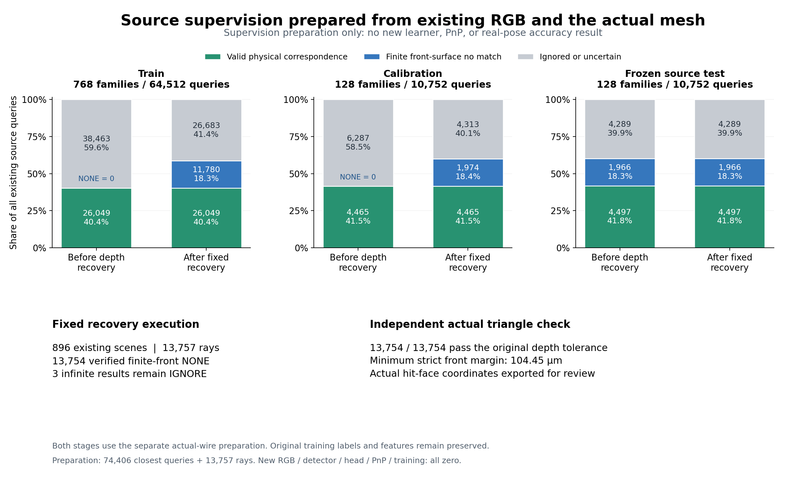
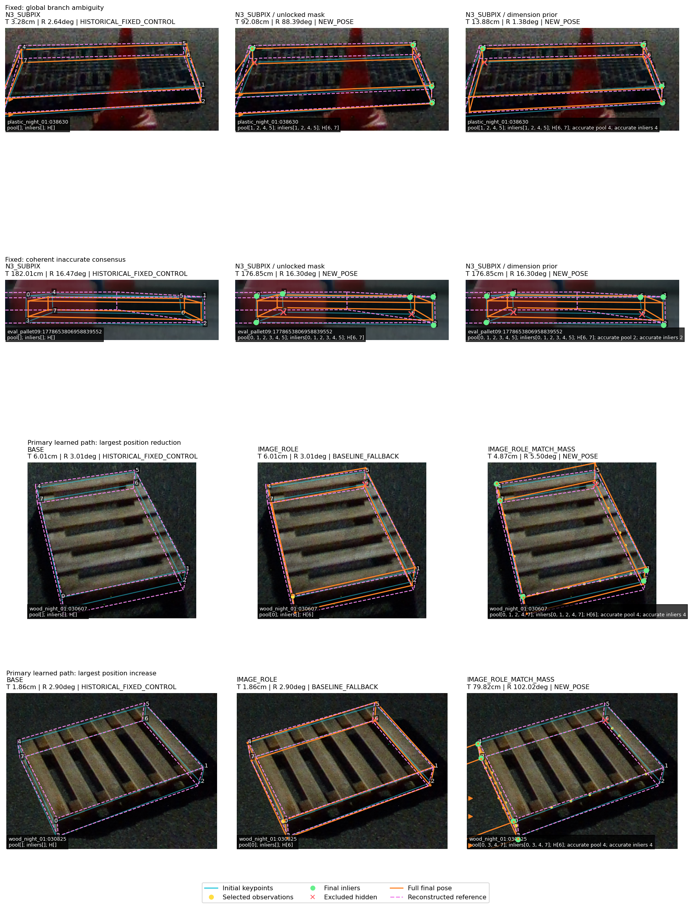
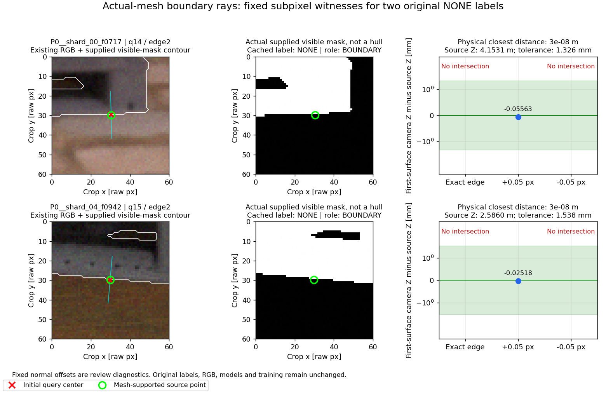
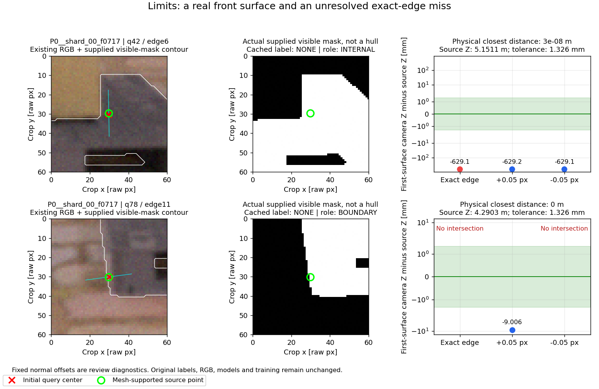

“가림 판단이 일부 틀려도 다른 유효 대응점으로 자세를 구하고 자기 가림 코너를 재투영했을 때, 기존 단순 대조보다 실제 위치·회전이 좋아졌는가?”

**아직 아니요. 실제 위치·회전 개선은 입증하지 못했다.** 마지막으로 실행한 동일 IMAGE_ROLE 선 관측 절제는 전체319장에서 위치74.5705cm·회전24.8787°로, 고정 N3→SubPix의38.8950cm·18.2523°보다 나빴다. 이번 단계는 그 실패 이후 발견한 **물리 경계 감독의 수치 오류를 수정하고, 대응 없음 감독까지 실제 복구·검산한 결과**다. 수정 감독으로 새 모델을 학습하거나 새 실사 자세를 평가한 결과는 아직 없다. 추가 정식 학습0 update를 학습 완료로 보고하지 않는다.

## 다른 사람이 검토할 때의 읽기 순서

1. [원래 필수 무학습·강건PnP·오판 스트레스·3모델 결과](../pallet_observation_refiner_20261009_v1/RESULT_KO.md): 최초 대조와 전체319장의 원행.
2. [KP 보정의 어려움·8조건·실제 이미지·실제600회 시간 측정](../pallet_kp_difficulty_20261010_v1/RESULT_KO.md): 분류 오류와 관측 부족을 분리한 후속 진단.
3. [동일 관측의 선 절제와 실제 메시 감독 진단](../pallet_kp_supervision_gate_20261010_v1/RESULT_KO.md): 74개 새 자세를 실제 산출했지만 전체 오차가 악화한 결과. 이 보고서에 있는 train/cal NONE=0 상태는 아래 깊이 복구 전 상태다.
4. **현재 보고서**: 감독 준비의 남은 막힘을 해결한 원행, 실제 triangle 증거, 학습 전 검사, 추가 비용과 미실행 범위.
5. [공개 파일만으로 검산하는 방법](REPRODUCE.md), [검산 결과](REVIEW_CHECKS.json), [검산기 음성 대조](REVIEW_VALIDATION_TESTS.json), [파일 해시 목록](REVIEW_MANIFEST.json), [게시 확인](PUBLICATION.json).

이전 게시257개 파일은 [PRIOR_PUBLICATION_BINDINGS.json](PRIOR_PUBLICATION_BINDINGS.json)의 SHA·크기로 보호했다. 이전 실패, 원행, 코드, 가중치 관련 기록, 이미지는 덮어쓰지 않았다. source-test는 감독 버그를 찾는 데 이미 사용됐으므로 독립 검증 자료라고 부르지 않는다. 실사319장·13세션도 반복 개발 자료다. 기존 T/R/ADDsym reference는 **GEOMETRIC_PROXY** 기하 재구성값이며 독립 물리 측정 GT와 구분한다.

## KP 보정에서 어려운 것의 정의와 현재 증거

| 어려움 | 확인한 사실 | 성공 여부를 판단할 후단 기준 |
|---|---|---|
| 보이는 대응 자체가 없음 | 자기 가림·앞 표면 가림·프레임 밖·검색 범위 밖을 같은 양성으로 만들 수 없다. 물리적으로 존재하지 않는 경계도 제외해야 한다. | 유효 대응 위치 또는 NONE을 예측하고, 불확실한 IGNORE를 정답처럼 학습하지 않는다. |
| 물리 경계의 수치적 hit 불안정 | 기존 test의 무한대 NONE2164개가 실제 공유 wire의 유효 대응으로 검산됐다. cuboid 계산점과 실제 메시 경계의 작은 차이 때문에 기존 ray miss를 곧바로 가림 정답으로 쓰면 안 됐다. | 실제 메시 소유권·투영·검색 범위·mask·원래 깊이 허용 범위가 함께 맞아야 한다. |
| 독립 대응 수와 배치 부족 | 원래 이상적 target에서 화면 내≥4코너12/128, 수정 제안에서95/128. 이95는 완벽한 감독 예측의 상한이며 학습모델 산출률이 아니다. 평행선은 점 수가 많아도 자유도를 충분히 구속하지 못할 수 있다. | 남은 대응 수·3D 배치·합의 inlier·다중해·수치 실패를 기록하고, 부족하면 fallback/실패를 명시한다. |
| 관측을 조립하며 정보 손실 | 코너를 만들고 사용한 선을 버리면 source 국소 rank6은49/128, 모든 선을 한 번 쓰면90/128. 그러나 실제 all-lines 오차는 악화했다. | rank·산출률 상승만으로 성공을 선언하지 않고 전체319장 자세 오차를 비교한다. |
| 모델이 실제 대응을 찾지 못함 | 이전3개 고정 head는 source에서≥4코너가0개였다. 기존 감독의 오류와 실사 전이 문제를 구분해야 한다. | 수정된 POS/NONE/IGNORE의 loss·gradient 검산 이후 같은 작은 모델을 같은 초기화·순서·학습량으로 비교한다. 낮은 가림 분류 정확도만으로 후단 평가를 생략하지 않는다. |
| 일관된 오대응과 잘못된 자세 분기 | 강건 합의는 일부 이상치를 제거할 수 있지만 서로 일관된 잘못된 경계나 다중해를 자동으로 해결하지 않는다. | 마스크 없는 강건PnP 대조를 유지하고, 공통 산출집합과 전체 운용 결과를 함께 본다. |
| 숨은 점 재투영의 오해 | 재투영은 추정 자세의 결과다. 틀린 자세의 H를 재투영하면 숨은 코너도 나빠진다. | 직접 가시점 손상·숨은 점 오차·T/R/ADDsym을 분리하고, H를 다시 독립 관측으로 PnP에 넣지 않는다. |

가림 분류를 완벽하게 만드는 것을 필요조건으로 삼지 않았다. 마스크가 한 점 틀리거나 재추정 후 달라져도 충분한 다른 대응이 있으면 자세를 계산한다. 반대로 관측 부족을 새 자세 성공으로 바꾸지 않는다. mask 일치 여부는 후행 진단이며 프레임 삭제 조건이 아니다.

## 실제 감독 준비와 깊이 복구

새 RGB를 생성하지 않았다. 기존1024개 P0 source-family의 RGB·USD 실제 메시·전달 mask·고정 FP16 feature cache와 기존 장면 분할을 사용했다. 같은 장면의4변형을 새로 생성하거나 독립 장면처럼 세지 않았다. 분할은 train768/calibration128/source-test128 그대로다. 각 장면12edge×7query=84개, 전체86,016query다. 실제 source-supported edge는[0,2,4,6,8,9,10,11]이며 이 USD에서 지원되지 않는[1,3,5,7]은 IGNORE로 둔다. 다른 미보유 자산에도 물리적으로 경계가 없다고 일반화하지 않는다.

앞 단계의 actual-wire 준비는 train/cal의 유효 POS를 만들었지만, 과거 per-query depth/primitive가 저장되지 않아 NONE를 증명하지 못했다. 그 상태에서 NONE를 임의로 만들거나 test의 결과를 train에 복사하지 않았다. 이번에는 **기존 ray 규칙과 고정13,757query 목록**만 복구했다. 대상은 train11,783/cal1,974개이며, actual-wire 양성 및 test는 재cast하지 않았다. 나머지 원래NONE→IGNORE15,844개 중 검색 범위 밖296개·mask 조건 미충족1,791개는 복구 대상에서 제외한 채 IGNORE로 남겼다.

하나의 질의에 원래 float32 광선 한 번만 사용했다. 주변 offset 탐색·threshold sweep·새 RGB·새 메시·new detector·학습·PnP는 없다. 유한한 양수 hit, 유효 triangle ID, 닫힌 triangle 내 finite barycentric 좌표, finite nonzero normal, 원래0.001×물리 대각선 허용 범위를 적용했다. 기존 ray parameter와 실제 camera-Z를 구분하여 둘 다 대상보다 충분히 앞인 경우만 NONE으로 승인했다. 원래 R의 직교 오차가 작지만0이 아니므로 ray parameter를 정확한 camera-Z라고 적지 않았다.

실제896scene 구성·896 cast API·13,757ray를97.4545초에 실행했다. **13,754개는 finite front-surface NONE, 무한대3개는 IGNORE**다. [원래 고정 질의](DEPTH_RECOVERY_PLAN_ROWS.jsonl.gz), [raw ray/primitive/barycentric 원행](RECOVERED_DEPTH_ROWS.jsonl.gz), [준비된 전체 원행](READY_SOURCE_TARGET_ROWS.jsonl.gz), [학습용 배열](READY_PREPARED_TARGETS.npz)에 전후 상태가 있다.

| 분할 | 가족 수 | query 분모 | 실제 wire POS | 증명된 NONE | IGNORE |
|---|---:|---:|---:|---:|---:|
| train | 768 | 64,512 | 26,049 | 11,780 | 26,683 |
| calibration | 128 | 10,752 | 4,465 | 1,974 | 4,313 |
| source test | 128 | 10,752 | 4,497 | 1,966 | 4,289 |

그림의 before는 **원래 학습 cache가 아니라, 직전 actual-wire 보수적 준비 배열**이다. after와의 차이는 train/cal NONE 복구뿐이며 test는 동일하다. 데이터·생성 코드·그림 SHA는 [그림 protocol](figures/READY_SUPERVISION_FIGURE_PROTOCOL.json)과 [그림 manifest](figures/MANIFEST.json)에 있다. 이것은 감독 준비 결과를 보여주는 과학 그림이며 새 학습·실사 성능 그림이 아니다.

## 실제 triangle 증거와 보존 검산

복구된13,754hit가 사용한 실제5,131triangle의 정규화 vertex를 [RECOVERED_FRONT_FACE_WITNESSES.json](RECOVERED_FRONT_FACE_WITNESSES.json)에 내보냈다. 426,540triangle 원래 실제 메시의 hash·metadata도 [ACTUAL_MESH_METADATA.json](ACTUAL_MESH_METADATA.json)에 고정했다. 전체 메시나 hull을 실제 mask로 대체하지 않았다.

각 stored barycentric 좌표에서 실제 triangle 점을 재구성하고, 실제 source camera 변환의 Z를 다시 계산했다. **13,754/13,754개가 원래 허용 범위에서 앞 표면 조건을 만족했다.** 최소 엄격한 front margin은104.45µm다. actual-triangle camera-Z와 기록된 ray-camera-Z 차이의 절댓값은 최대59.42µm·중앙값0.109µm·P900.376µm다. float32 ray와 triangle 점을 수학적으로 완전히 동일하다고 주장하지 않는다. [triangle 깊이 원행](FRONT_TRIANGLE_DEPTH_ROWS.jsonl.gz)과 [검산 요약](FRONT_TRIANGLE_DEPTH_VALIDATION.json)에 모든 값이 있다.

실제 메시에서 가져온 triangle 좌표의 산술은 공개 자료만으로 재검산할 수 있다. 다만 private 전체 메시에서 이것이 첫 hit였는지, 전달 mask가 원래 이미지와 맞는지, 모든 source 자산의 동일성까지 공개 산술만으로 독립 인증하는 것은 아니다. 첫 표면 순서는 기록된 엔진 실행 증거에 의존한다. 유효 감독이라는 결론은 **원래 근사 깊이·전달 mask 정책 안의 유효성**이며 완전한 RGB photometric visibility나 실사 전이 성공을 뜻하지 않는다.

원래 입력1,844개 파일은 실행 전후 SHA·크기가 모두 같았다. [실행 전](FIXED_INPUT_PROTECTION_BEFORE.json)·[실행 후](FIXED_INPUT_PROTECTION_AFTER.json) 기록을 남겼다. 직전 보수적 준비의 POS·복구하지 않은 query·test·source index·partition·배열 dtype/shape의 보존도 검사했다. 원래 cache의 POS 한 개(index703/query63)는 앞 actual-wire 준비에서 실제 경계 증명이 부족하여 IGNORE로 둔 상태이며, 이번 깊이 복구에서 다시 승인하거나 변경하지 않았다. 원래 학습 target/features/order와 기존3개 가중치를 수정하지 않았다. READY NPZ SHA는 `c2d34aaaa483cdebef991fbc27e4fd2322765262da8c3026cd5048ae93009a7f`다. 새 배열을 별도 파일로 게시했다.

V1/V2 계획 코드도 남겼지만 두 버전의 cast는0회다. 입력 보존·primitive/barycentric/normal 조건·ray parameter와 camera-Z 구분을 실행 전에 보완한 V3만 실행했다. 한 번의 Open3D import는 SSD 임시 공간 부족으로 **0scene/0ray에서 실패**했다. 같은 고정 V3를 tmpfs TMPDIR에서 실행했으며 설정 변경에 의한 성능 재시도가 아니다. [precast 수학 검토](PRECAST_MATH_REVIEW_RECEIPT.json), [V3 protocol](DEPTH_RECOVERY_V3_PROTOCOL.json), [환경 실패 기록](IMPORT_ENVIRONMENT_ATTEMPT.json)을 보존했다.

## 실제로 수행한 학습 전 검사

[RETRAINING_PROTOCOL.json](RETRAINING_PROTOCOL.json)에 모델·입력·batch order·학습량·원래 코드 hash·후단6경로를 고정했다. 같은5890parameter head·seed1·동일 초기 state·동일3000×16 batch order·AdamW lr0.001/weight decay0.0001·warmup100/cosine·clip10·last checkpoint만 사용하도록 구현했다. 기존 모델의 GEOMETRY_ONLY는 image channel0..18을0으로 하고 geometric role25..27을 유지한다. IMAGE_NO_ROLE은 role25..27만0, IMAGE_ROLE은 원래28channel을 사용한다. 이름만으로 role까지 제거됐다고 적지 않았다.

실제 원래 첫 batch16장의 feature와 새 READY target을 CPU에서 읽고 세 head의 forward·loss·gradient를 실행했다. 그 batch의84×16=1344query는 POS534/NONE291/IGNORE519다. 세 조건 모두 valid825query의 gradient는 존재하고 IGNORE519개는 정확히0이었다. soft66-way cross-entropy의 analytic derivative와 실제 gradient 차이는 최대2.3283×10⁻¹⁰ 이내다. uniform-logit loss는 log(66)과 일치했다. geometry의 영상 channel gradient0·no-role의 role gradient0·IMAGE_ROLE의 두 입력 gradient가 nonzero인 것도 확인했다. backward 이후 state SHA는 세 모델 모두 원래 초기화와 같았다.

실행량은 **CPU forward3회/48image exposure, autograd.grad10회, backward3회, optimizer 객체0·step0·weight 파일0**다. 이를3000update 학습이나 학습 성능으로 부르지 않는다. [ZERO_UPDATE_CPU_CHECKS.json](ZERO_UPDATE_CPU_CHECKS.json)에 batch ID·target·입력 hash·각 gradient·state hash가 있다. 별도의 [authorization/output 음성 대조](AUTHORIZATION_GUARD_CHECKS.json)는 추가9000 승인 기록이 없으면 optimizer/CUDA 초기화 전에 중단하고, 과거 결과·원본 cache·사용자 checkout을 output으로 덮어쓰지 못함을 검사했다.

## 이전 실사 실패·이미지와 현재 단계의 구분

현재 단계에서 신규 실사 pose 원행은0개다. 최신 **실제로 실행한** 자세 결과는 아래 이전 단계다. 새 감독이 유효해졌다는 이유만으로 이 실패를 성공으로 바꾸지 않는다.

| 실제 평가 경로 | 전체 분모 | 새 자세 / fallback / 완전 실패 | 위치 평균 cm | 회전 평균 ° | ADDsym 평균 cm |
|---|---:|---|---:|---:|---:|
| 고정 Base | 319 | 기존 출력 / 상태 재추정 안 함 / 0 | 39.8968 | 21.3519 | 56.1092 |
| 고정 N3→SubPix | 319 | 기존 출력 / 상태 재추정 안 함 / 0 | 38.8950 | 18.2523 | 52.4234 |
| 원래 IMAGE_ROLE point+line | 319 | 36 / 283 / 0 | 49.9831 | 22.9880 | 66.4039 |
| 동일 IMAGE_ROLE 모든 선 한 번 | 319 | 74 / 245 / 0 | 74.5705 | 24.8787 | 91.1890 |

분산ddof=1·SD·중앙값·P90·공통집합·13세션10000draw CI·큰 오류 원행은 [직전 METRICS.csv](../pallet_kp_supervision_gate_20261010_v1/METRICS.csv), [METRICS.json](../pallet_kp_supervision_gate_20261010_v1/METRICS.json), [PREDICTIONS.jsonl.gz](../pallet_kp_supervision_gate_20261010_v1/PREDICTIONS.jsonl.gz)에 있다. all-lines−N3 전체운용 Δ는 위치+35.6755cm [11.9871,73.6358]·회전+6.6264° [3.9981,9.2977]다. 큰 오차를 실패로 빼거나 평균을 cap하지 않았다. 이 절제는 채택하지 않는다.

known 사람 상태와 mask가 다른89장에서도 새 자세22개를 계산했고 마스크 오판만으로 frame을 삭제하지 않았다. 그22개는 T/R 모두 악화19·혼합3이었다. known mask가 맞은230장 중 새 자세52개는 모두 악화42·혼합9·모두 개선1이었다. 따라서 **mask가 맞는데 pose가 나쁜 경우**도 분리했다. 원래 무학습·stress의 mask가 틀려도 개선한 경우는 첫 보고서에 따로 남아 있다. 현재 단계의 학습 전 검사로 그 실사 경우의 수를 새로 만들지 않았다.

아래는 이전 KP 진단의12개 실제 영상 패널이다. **현재 새 감독으로 학습한 모델의 overlay가 아니다.** 노랑은 관측/선, 초록은 inlier, 빨강은 예측H, 주황은 fit 투영, 분홍은 기하reference다. frame ID·crop·원행·원영상SHA·선택 기준은 [기존 VISUAL_REVIEW.json](../pallet_kp_difficulty_20261010_v1/VISUAL_REVIEW.json)에 있다.

H는 새 R,t가 산출된 경우 최종 재투영으로 교체했으며 초기 H를 final fit에 넣거나 재투영을 다시 PnP에 넣지 않았다. 직전 단계 실제 H재투영97점 중 reference가 있는93점의 오차는16.3158→61.6600px로 악화했다. 사람 DIRECT1759점은20.8311→20.7336px였지만 이것만으로 자세 개선이라고 말하지 않는다. reference 미존재4점을0px로 채우지 않았다.

## 실행량·비용·추가 학습 전 남은 승인

actual-wire 전체 준비는 별도175.0002초/896scene/74,406closest query/146,307candidate arithmetic이며 ray0이다. 이번 깊이 복구는97.4545초/896scene/13,757ray다. 두 준비의 합은1792scene build이며 새로운 RGB0·detector0·PnP0·학습0이다. 별도 CPU loss 검사는 위의3forward/48exposure다. [SUPERVISION_REPAIR_EXECUTION.json](SUPERVISION_REPAIR_EXECUTION.json)과 [BUILD_LEDGER.json](BUILD_LEDGER.json)에 수학 검산·CPU 검사·게시까지 구분한다. **source 준비 시간이나 cached pose replay 시간을 전체 추론 latency로 쓰지 않는다.** 이전 실제600회 시간 측정은 보존하지만 수정 모델의 시간을 대신하지 않는다.

원래3×3000=9000정식update·144000exposure와 별도preflight100update는 이미 사용했다. 원래 잔여 정식 예산은0이다. 수정 감독으로 같은3모델을3000update씩 다시 학습하면 **추가9000update·144000exposure**, 누적정식18000update·288000exposure다. 추가seed·새N3·설정 변경·checkpoint 선택은 없고, 이전100step throwaway도 반복하지 않는다. 현재 추가학습은0이다.

첨부문서§12의 “추가 비용이 필요하면 해당 블록만 멈추고 이미 완료한 것부터 게시한다”와§13의 버그 수정 기록 요구를 적용했다. 감독 복구·실행 가능한 학습/평가 코드·실제CPU검사·상세보고·게시를 먼저 완료하고, **추가9000update는 별도 사용자 승인 이후에만** 실행하도록 했다. 사용자 요청과 첨부문서의 지침을 같은 것으로 취급하지 않았으며, 실험 성공을 보장하는 허가로 해석하지 않는다.

## 승인 후 고정 실행할 범위 — 현재 결과와 구분

실행 준비 코드는 [retrain.py](../../../scripts/research/pallet_kp_supervision_repair_20261010_v1/retrain.py)와 [downstream.py](../../../scripts/research/pallet_kp_supervision_repair_20261010_v1/downstream.py)다. 세 모델의 원래66-way argmax·TLS·코너 교차점 decoder를 유지한다. match-mass·all-lines 재시도·threshold tuning은 추가하지 않는다. POS/NONE 분류가 나쁘더라도 후단 자세 평가를 수행한다.

실사6경로×319=1914행은 GEOMETRY_ONLY/IMAGE_NO_ROLE/IMAGE_ROLE, IMAGE_ROLE 마스크 없는 강건PnP/일반PnP/원래 point+line이다. 원래 Base·N3와 필수 무학습12조건을 고정 대조로 남긴다. finite4-subset 최대70개/치수·동일 좌표/K/치수/4ID 가설 재사용·4/5점 다중해 검산·H fit 제외/재투영 원칙을 보존한다. point+line은 같은 IMAGE_ROLE 별도절제로, 코너에 소비한 선을 다시 세지 않는다.

1914개 geometry 원행을 reference 읽기 전에 봉인한 뒤 채점한다. 주 비교는 수정 IMAGE_ROLE−고정 N3→SubPix의 전체319운용 결과다. 세 모델 모두 평균·표본분산·SD·중앙값·P90·최대값, NEW_POSE/fallback/완전실패, 공통 산출집합, 남은 대응·inlier·배치, DIRECT 손상/H재투영, mask오판과pose개선을 분리한다. 기존13세션10000bootstrap draw를 재사용하며 가장 좋아진 모델/decoder를 사후 선택하지 않는다.

시간은 최대4경로×150=600회 실제 detector→관측→초기 자세→최종 강건PnP→H재투영 전체 경로를 독립된 자원 조용한 구간에서 새로 측정해야 한다. 기존 시간의 합산·feature/pose cache replay 시간은 사용하지 않는다. 새 모델을 실행하지 않았으므로 현재 보고서에는 그 latency가 없다.

## 요소별 판단과 남은 목표

| 요소 | 현재 내릴 수 있는 판단 |
|---|---|
| 가림 판단 | perfect mask는 필요조건이 아니다. 이전 필수 마스크 없는 강건PnP 대조를 보존했으며, 새 분류기의 필요성을 주장할 근거는 없다. |
| 관측 선택·감독 | 실제 경계에 존재하는 POS와 finite front NONE를 분리하는 수치 오류를 실제 수정·복구했다. 이 수정의 실사 성능 효과는 아직 평가하지 않았다. |
| 강건PnP | 유한4점 합의와 가설 재사용은 그대로다. 일부 오대응을 거르는 역할과 관측 자체가 부족하거나 잘못된 경우의 실패를 구분한다. 이번 source 검산을 PnP 개선 결과로 부르지 않는다. |
| 재투영 | 요구한 H교체를 이전 실제 자세 경로에서 수행했다. 재투영은 새로운 독립 정보가 아니며 정확한 자세를 먼저 구해야 한다. |
| 소형 영상·역할 학습 | 유효 mixed supervision과 실제 loss/gradient까지 준비됐지만 수정 모델 학습·후단 개선은 미실행이다. 추가 학습이 필요 없다고도 필요하다고도 아직 확정하지 않는다. |

**상세 보고·검산·게시와 실제 위치·회전 개선 달성은 별개다. 후자는 아직 미달성이고 goal은 계속 active다.** 새 실사·수동주석·새seed·새N3·대형망·6D loss·PnP 역전파·CLIP/DINO·논문/PPT/LaTeX/PDF 수정은0이다. research 전용 브랜치만 정상 push한다. main 자동 병합·main push·force push는 수행하지 않았다. 게시 중 별도로 관측한 remote main 변화는 [게시 기록](PUBLICATION.json)에 원격 SHA로 남기며 우리 push 결과로 표시하지 않는다.
