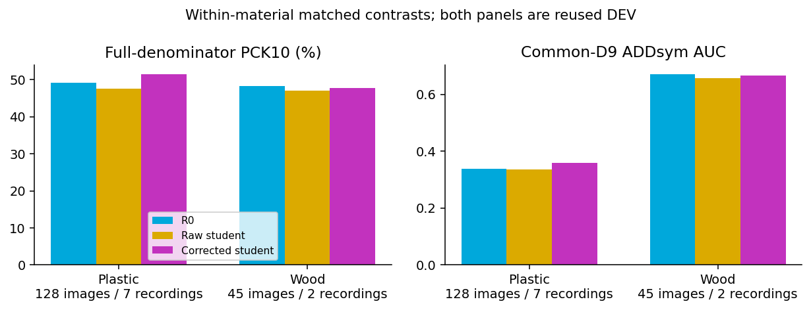
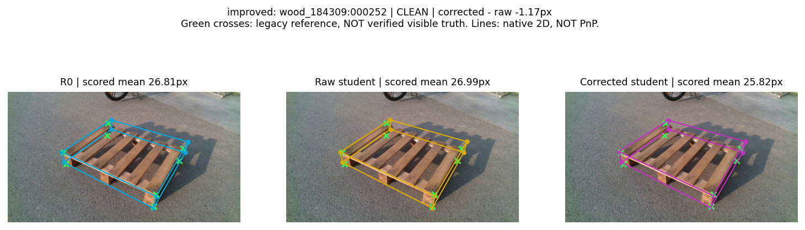
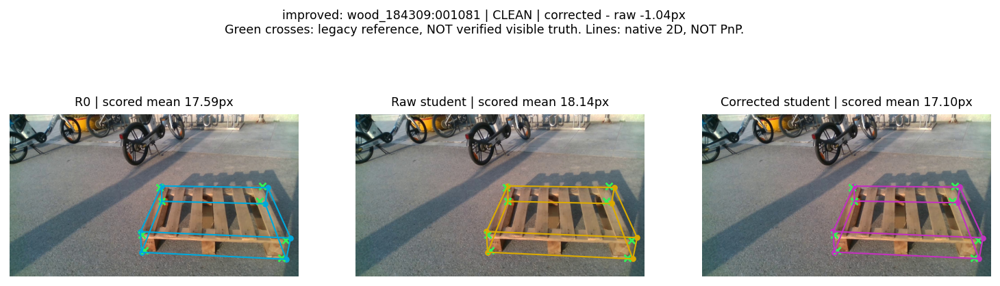
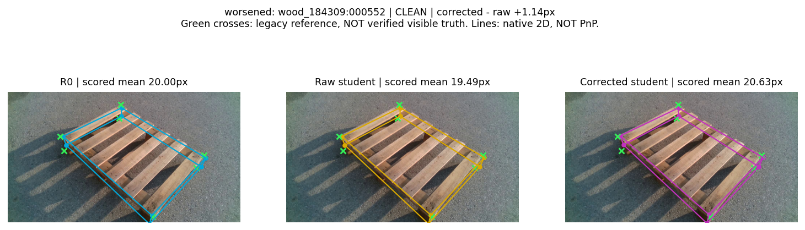
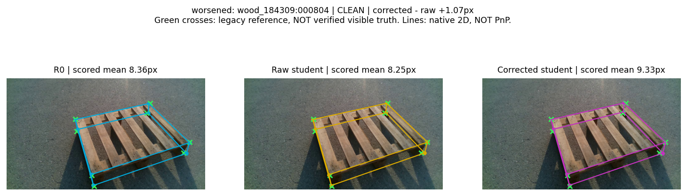
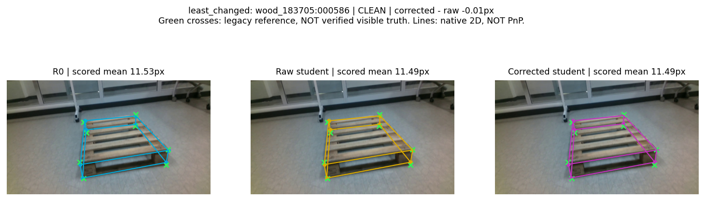
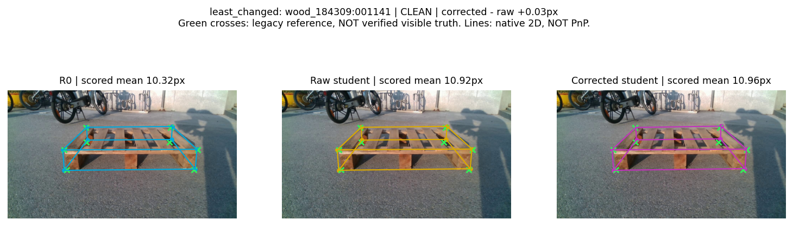

# Material-stratified corrected pseudo-label self-training 마감 보고서

**MATERIAL_GENERAL_SIGNAL**. Plastic corrected−raw: PCK10 +3.959pp / ADDsym AUC +0.02429. Wood corrected−raw: PCK10 +0.578pp / ADDsym AUC +0.00860. 이 판정은 material 내부의 같은 RAW/REF 학습 계약에 대한 기술적 비교이며, 모든 지표 동시 개선을 요구하지 않는다.

`MATERIAL_CLAIM_MATRIX.json`의 PENDING 항목은 실행 전 잠근 계획 상태를 보존한 것이다. 실제 측정 판정은 `MATERIAL_FINAL_DECISION.json`과 본 보고서이며, Git 반영 확인은 `PUSH_VERIFICATION.json`과 구분한다. 실험·원고·검증을 완료했고 사용자 승인 범위의 메타데이터와 예시 그림을 공개한다. [공개 범위 안내](PUBLICATION_NOTICE_KO.md)를 참조한다.

## 무엇을 했는가

동일 Replay9/38 교사를 고정했다. Wood 후보 1000장 중 raw confidence 탈락 266장, raw flip/LOO 탈락 30장, 보정 후 all8 LOO 탈락 28장으로 공통 승인 676장이다. 실제 real512 replacement 슬롯에 노출된 고유 영상은 361장이다. 기존 synthetic512와 매 epoch 혼합하여 R0 복제 학생2개를 각5epoch/320update 학습했다. RAW/REF의 RGB·박스·support·순서·augmentation·optimizer·학습량은 같고 유효 pseudo 좌표만 다르다. 교사는 student 평가/배포 추론에 붙이지 않았다.

Wood116의 교사 감독 exact-ID/SHA 중복은5장이고, 교사 recording에 속한 day20+night51장 전체를 평가에서 제외했다. Plastic night 교사의 REC_002도 Wood night와 같은 촬영이므로 함께 제외했다. 결과를 보기 전에 Wood main을 REC_039의25장 + REC_042의20장 =45장으로 고정했다. Clean38/Moderate7이며 Severe는 없음(0% 아님). 미주석 Wood 학습 후보는 REC_001/002에서만 고르고 기존319개 GT 영상의 exact-ID/SHA를 모두 제외했다. 교사-학생 source recording은 겹치지만 두 source recording은 Wood45 평가와 겹치지 않는다. 과거 Wood116 결과는 삭제하거나 새45장 수치로 교체하지 않았다.

고정 교사의 실사 감독 예산은 총9장/38코너: Plastic 3장/15코너, Wood 6장/23코너다. Wood 학생용 새 수동 좌표·교사 재학습은0이다. 이는 이 frozen teacher의 fitting 예산이며 평가 annotation/과거 프로젝트 수동 노동 전체가9/38뿐이라는 주장이 아니다. R0의 upstream COCO-pose pretraining도 숨기지 않는다.

## TABLE_MATERIAL_MAIN

| Material | Method | Images | Corners | PCK10 % | Med px | ADDsym AUC |
| --- | --- | --- | --- | --- | --- | --- |
| Plastic | R0 | 128 | 985 | 49.14 | 9.565 | 0.33796 |
| Plastic | Raw ST | 128 | 985 | 47.51 | 9.961 | 0.33472 |
| Plastic | Corrected ST | 128 | 985 | 51.47 | 8.954 | 0.35902 |
| Wood | R0 | 45 | 346 | 48.27 | 10.453 | 0.67050 |
| Wood | Raw ST | 45 | 346 | 47.11 | 10.639 | 0.65643 |
| Wood | Corrected ST | 45 | 346 | 47.69 | 10.623 | 0.66503 |

## TABLE_MATERIAL_DELTA

| Material | Correct10 delta | PCK10 delta pp | AUC delta | Med delta px | P90 delta px |
| --- | --- | --- | --- | --- | --- |
| Plastic | 39 | +3.959 | +0.02429 | -1.008 | +0.128 |
| Wood | 2 | +0.578 | +0.00860 | -0.017 | +1.145 |

## TABLE_MATERIAL_2D

| Material | Method | Detected | Matched | Correct10 | PCK5 % | PCK10 % | PCK20 % | Med px | P90 px | >20 |
| --- | --- | --- | --- | --- | --- | --- | --- | --- | --- | --- |
| Plastic | R0 | 128/128 | 120/128 | 484/985 | 20.81 | 49.14 | 72.69 | 9.565 | 40.902 | 269 |
| Plastic | Raw ST | 128/128 | 120/128 | 468/985 | 20.30 | 47.51 | 72.59 | 9.961 | 41.958 | 270 |
| Plastic | Corrected ST | 128/128 | 120/128 | 507/985 | 24.67 | 51.47 | 73.91 | 8.954 | 42.085 | 257 |
| Plastic | Source-only update | 128/128 | 120/128 | 479/985 | 20.61 | 48.63 | 72.79 | 9.741 | 41.776 | 268 |
| Wood | R0 | 45/45 | 45/45 | 167/346 | 17.34 | 48.27 | 76.01 | 10.453 | 66.777 | 83 |
| Wood | Raw ST | 45/45 | 45/45 | 163/346 | 16.47 | 47.11 | 75.43 | 10.639 | 67.839 | 85 |
| Wood | Corrected ST | 45/45 | 45/45 | 165/346 | 17.34 | 47.69 | 75.43 | 10.623 | 68.985 | 85 |
| Wood | Source-only update | 45/45 | 45/45 | 164/346 | 17.34 | 47.40 | 74.86 | 10.570 | 68.191 | 87 |

## TABLE_MATERIAL_6D

| Material | Method | Pose coverage | Axis correct | R med/P90 deg | Yaw med/P90 deg | t med/P90 cm | IoU3D med | ADDsym AUC |
| --- | --- | --- | --- | --- | --- | --- | --- | --- |
| Plastic | R0 | 128/128 | 83/128 | 3.530 / 88.733 | 2.756 / 88.533 | 9.353 / 79.122 | 0.5865 | 0.33796 |
| Plastic | Raw ST | 128/128 | 81/128 | 3.942 / 89.052 | 2.626 / 88.600 | 9.226 / 77.884 | 0.5808 | 0.33472 |
| Plastic | Corrected ST | 128/128 | 82/128 | 3.766 / 88.809 | 2.550 / 88.656 | 9.186 / 78.938 | 0.5928 | 0.35902 |
| Plastic | Source-only update | 128/128 | 83/128 | 3.507 / 88.681 | 2.590 / 88.341 | 9.203 / 78.605 | 0.5948 | 0.33895 |
| Wood | R0 | 45/45 | 40/45 | 1.545 / 9.190 | 0.471 / 3.583 | 2.095 / 8.011 | 0.7898 | 0.67050 |
| Wood | Raw ST | 45/45 | 40/45 | 1.598 / 9.084 | 0.536 / 3.469 | 2.349 / 8.259 | 0.7704 | 0.65643 |
| Wood | Corrected ST | 45/45 | 40/45 | 1.605 / 9.337 | 0.499 / 3.588 | 2.071 / 7.985 | 0.7740 | 0.66503 |
| Wood | Source-only update | 45/45 | 40/45 | 1.612 / 9.277 | 0.613 / 3.271 | 2.195 / 7.963 | 0.7713 | 0.65812 |

## TABLE_MATERIAL_SEVERITY

| Material | Severity | N | Method | Correct10 | PCK10 % | P90 px | ADDsym AUC |
| --- | --- | --- | --- | --- | --- | --- | --- |
| Plastic | CLEAN | 29 | R0 | 151/229 | 65.94 | 17.485 | 0.71474 |
| Plastic | CLEAN | 29 | Raw ST | 150/229 | 65.50 | 16.772 | 0.73053 |
| Plastic | CLEAN | 29 | Corrected ST | 158/229 | 69.00 | 17.150 | 0.78126 |
| Plastic | MODERATE | 21 | R0 | 90/154 | 58.44 | 24.119 | 0.47955 |
| Plastic | MODERATE | 21 | Raw ST | 85/154 | 55.19 | 24.087 | 0.47131 |
| Plastic | MODERATE | 21 | Corrected ST | 87/154 | 56.49 | 23.008 | 0.51188 |
| Plastic | SEVERE | 78 | R0 | 243/602 | 40.37 | 53.725 | 0.15976 |
| Plastic | SEVERE | 78 | Raw ST | 233/602 | 38.70 | 55.113 | 0.15079 |
| Plastic | SEVERE | 78 | Corrected ST | 262/602 | 43.52 | 55.959 | 0.16087 |
| Wood | CLEAN | 38 | R0 | 146/301 | 48.50 | 64.743 | 0.66303 |
| Wood | CLEAN | 38 | Raw ST | 143/301 | 47.51 | 65.697 | 0.64861 |
| Wood | CLEAN | 38 | Corrected ST | 143/301 | 47.51 | 67.236 | 0.65745 |
| Wood | MODERATE | 7 | R0 | 21/45 | 46.67 | 337.336 | 0.71107 |
| Wood | MODERATE | 7 | Raw ST | 20/45 | 44.44 | 336.781 | 0.69893 |
| Wood | MODERATE | 7 | Corrected ST | 22/45 | 48.89 | 334.899 | 0.70621 |

## TABLE_MATERIAL_RECORDINGS

| Material | Recording/session | N | Raw PCK10 % | Corr PCK10 % | Raw AUC | Corr AUC |
| --- | --- | --- | --- | --- | --- | --- |
| Plastic | REC_007 | 33 | 47.71 | 49.24 | 0.08383 | 0.09958 |
| Plastic | REC_021 | 18 | 39.71 | 45.59 | 0.80000 | 0.81567 |
| Plastic | REC_022 | 16 | 32.79 | 36.89 | 0.22866 | 0.24034 |
| Plastic | REC_025 | 27 | 38.07 | 44.16 | 0.36820 | 0.38743 |
| Plastic | REC_027 | 12 | 26.09 | 36.96 | 0.14642 | 0.12592 |
| Plastic | REC_041 | 10 | 71.25 | 71.25 | 0.23680 | 0.31110 |
| Plastic | REC_044 | 12 | 96.88 | 96.88 | 0.66275 | 0.75483 |
| Wood | REC_039 | 25 | 48.13 | 50.80 | 0.77990 | 0.78514 |
| Wood | REC_042 | 20 | 45.91 | 44.03 | 0.50210 | 0.51490 |
| Wood | SESSION_wood_183705 | 25 | 48.13 | 50.80 | 0.77990 | 0.78514 |
| Wood | SESSION_wood_184309 | 20 | 45.91 | 44.03 | 0.50210 | 0.51490 |

## TABLE_MATERIAL_PSEUDO_QUALITY

| Material | Output | Trusted points | PCK5 count (%) | PCK10 count (%) | PCK20 count (%) | Med px | P90 px | >20 |
| --- | --- | --- | --- | --- | --- | --- | --- | --- |
| Plastic | Raw R0 | 66 | 21/66 (31.82) | 44/66 (66.67) | 60/66 (90.91) | 7.144 | 18.390 | 6 |
| Plastic | Frozen teacher | 66 | 30/66 (45.45) | 50/66 (75.76) | 63/66 (95.45) | 5.489 | 13.759 | 3 |
| Wood | Raw R0 | 0 | NA | NA | NA | NA | NA | NA |
| Wood | Frozen teacher | 0 | NA | NA | NA | NA | NA | NA |

## TABLE_MATERIAL_CONTRACT

| Item | Plastic main | Wood extension |
| --- | --- | --- |
| Frozen teacher | Same Replay9images/38corners | Same checkpoint; no refit |
| Candidate/accepted/used unique | 1000 /249 /217 | 1000 /676 /361 |
| Initial student | Same R0 | Same R0 |
| Trainable state | Pose branches+flow | Same |
| Protected state | Backbone/detector/all buffers | Same; exact checks |
| RAW/REF parity | RGB/order/box/support/source | Same; coordinate values differ |
| Replay per epoch | 512real+512synthetic slots | Same source512 |
| Optimizer/LR/updates | AdamW /1e-5 /320 | Identical |
| Epoch/batch/nbs/seed | 5 /16 /16 /42 | Identical |
| Selection | Fixed final last.pt | Identical |
| Final pose | Common D9; no teacher at deployment | Same method; Wood registered dimensions |
| Material routing | Externally supplied material | Externally supplied material |
| Evidence | Reused DEV128,7recordings | Reused DEV45,2recordings |

## 짝지은 변화와 손상

Wood corrected−raw 정답 진입 8 / 이탈 6점; 순변화 +2 / 분모 346. 프레임 평균오차 개선/악화/동일: 22/23/0. 큰 오류 >20→≤10 복구 0점, <5→>10 손상 0점이다. paired 변화는 같은 canonical GT point identity로 대응한다. 개별 후보/체크포인트/threshold를 결과로 다시 고르지 않았다.

P90 delta는 corrected−raw에서 양수이면 악화, 음수이면 개선이다. 주 지표의 개선이 모든 tail·회전·이동·축 선택 또는 모든 난도 개선을 뜻하지 않는다.

## 실제 실행 기록

| Arm | Epochs | Updates | Seconds | Checkpoint SHA256 |
| --- | --- | --- | --- | --- |
| WOOD_RAW_LR5 | 5 | 320 | 46.7 | 7999e78fb6ff162e60645adc1f05f525a68d658ee1c73d624822b5e274219963 |
| WOOD_REF_LR5 | 5 | 320 | 46.4 | 56934125bbbfcfce393fb7560ad5ff186a7ccf96fb74f066c9e827479906451e |

RGB/order/box/support/source hash와 epoch별 update·protected 검사는 로컬 WOOD_PAIR_PREFLIGHT/FIT/CSV binding에 보존했다. 공개 집계는 [학습 완료 보고](TRAINING_COMPLETION_KO.md)를 참조한다. 입력/export parity는 검증했지만 전체 augmented 학습 텐서를 전수 캐시해 비교했다고 주장하지 않는다.

## 보존한 사전 오류와 정정

학습 전 공통 support가6개 이상이어야 한다는 추가 gate가 잘못 들어가 전체 Wood pool을 거절한 기록이 있었다. Plastic 원래 export는 공통 support4/5개도 허용하므로 이 gate를 제거해 원래 계약을 복원했다. 당시 새 fit0·평가 scoring 전이었고, 필터 threshold나 승인영상676개는 바꾸지 않았다. 원래 결정·정정 이유·정정 결정 JSON은 모두 로컬에 보존했다. 이는 성능 결과 기반 재시도가 아니다. [공개 범위 안내](PUBLICATION_NOTICE_KO.md)를 참조한다.

## 해석 범위·미해결

Wood45에는 출처가 확인되는 직접 클릭 가시점이0개이므로 **Q1_WOOD=UNRESOLVED**다. legacy teacher 정합 점수가 좋아도 verified pseudo-quality로 승격하지 않는다. Plastic66 가시점 teacher44→50/66과 학생43/66 동률은 그대로 유지하며, 후속640-update 학생의44/66 결과로 원래320-update main을 대체하지 않는다. 두 재료 모두 반복 DEV이며 새로운 독립 TEST가 아니다. Wood는 단2recording이고 프레임/코너를 독립 반복으로 세지 않는다. 6D는 geometry-derived annotation reference 정합도이며 독립 측정된 물리 pose 정확도가 아니다. 재료별 별도 학생은 외부 material metadata로 선택한다(material type is externally provided for routed evaluation). 자동 material 분류·unknown-material 대응·DOPE 등 estimator-generalization은 검증하지 않았다. 재료별 절대 수치 차이는 난도·카메라·세션·학습 pool 차이도 포함하므로 material 자체의 인과효과로 단정하지 않는다.

과거 material-routed Replay 및 S0/S1/S2는 다른 감독/개입의 보조 역사이며 이번 matched causal control에 섞지 않았다. [재사용 역할표](WOOD_HISTORICAL_ROLE_MAP.md)를 참조한다. 결과를 이유로 teacher·threshold·loss·selector·epoch를 바꾸지 않고 방법 개발은 STOP한다.

## 최종 한 문장

반복 DEV의 ordinary plastic과 Wood에서 corrected-vs-raw 자기학습의 두 주 지표가 같은 개선 방향을 보였지만, 이는 평가한 두 재료 범주에 한정된 신호다.

원고 및 PDF 갱신·build·audit·push의 최종 확인은 저장소 마감 단계에서 별도로 기록한다. 이 보고서 생성 자체가 완료되지 않은 Git push/build를 완료했다고 선언하지 않는다.

## 실제 예측 이미지: 개선·악화·변화 적음

같은 사후 순위 규칙으로 고른 사례이며 학습이나 평가 집합 선택에는 사용하지 않았다. 모든 선은 native2D 예측이고 PnP 투영이 아니다. 초록X는 출처가 혼합된 기존 reference이며 검수 가시점으로 해석하지 않는다.

### improved: wood_184309:000252

### improved: wood_184309:001081

### worsened: wood_184309:000552

### worsened: wood_184309:000804

### least_changed: wood_183705:000586

### least_changed: wood_184309:001141

