# Minimal hard supervision A/B — 완료 결과

## 1. 결론

**HARD_SUPERVISION_LOCALIZATION_SIGNAL_SELECTOR_LIMIT**. 기존 `S1 + GEO_LINEAR`와 hard8장 추가 학습을 비교했다. 두 새 모델 각 5epoch·320update 완료. 평가를 보고 학습량·seed·selector를 바꾸지 않았다. 기존 최종 모델은 자동 교체하지 않았다.

직접 클릭 감독은 효과가 있었다: 학습8장의 클릭36점은 10px 이내24→36점, 별도 hard 검증36점은19→24점이다. 그러나 배포 성능 개선으로 결론내릴 수는 없다. 중간/심한 난도의 PCK10·oracle 후보는 개선됐지만 최종 선택 pose는 악화됐다. **기존 S1을 유지하고, 추가 라벨링 대신 후보 선택 실패를 분석하는 것이 다음 한 단계다.**

## 2. 무엇을 비교했나

| 모델 | 초기화 | 실사/epoch | 합성/epoch | hard 좌표 |
|---|---|---|---:|---|
| BASE | 기존 S1 재사용 | 기존 Clean10 반복512 | 512 | 없음 |
| H_PSEUDO | 원래 R0 | clean448 + hard64 | 512 | 동결 TYPE_REPLAY_PIPELINE |
| H_MANUAL | 원래 R0 | clean448 + hard64 | 512 | 직접 클릭한 36점 |

수동군과 수도레이블군은 같은 RGB·PnP 박스·augmentation·감독 마스크·occurrence 순서다. hard 슬롯에서 좌표값만 다르다. 기존 clean/합성 슬롯은 원본 S1 캐시 및 occlusion을 그대로 사용했다. hard에는 인공 가림을 추가하지 않았다. 각 hard 이미지는 총40회 노출했다. 마지막 checkpoint만 평가했다.

## 3. 난도 태깅과 주석

8031 RGB → 중복·노출 제외6821 → 모델 없이 태깅123장(Clean10/Moderate13/Severe9/Invalid91) → initial8장(4M/4S, 3recordings). reserve2는 사용하지 않았다. 추가 태깅·20/50장 확대는 하지 않는다.

직접 클릭36개만 감독. 자동 보완 코너28개와 중심점8개 제외. 사용자는 직접 찍은 점에 대해 “꽤 확실해”라고 확인했다. 사용자 요청으로 PnP 보조를 켰고, 추가 수동 bbox 대신 저장된 PnP 코너 외접 박스를 공통 association으로 사용하는 변경을 승인받았다. **HUMAN_PNP_ASSISTED_NOT_BLIND**이며 PnP 없는 독립 수동 GT라고 주장하지 않는다.

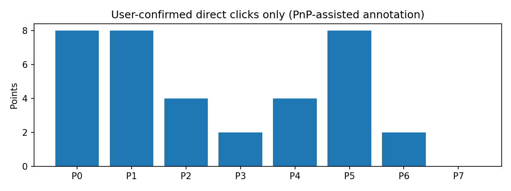

교사 좌표 유효 coverage36/36. hard 학습 recording과 평가 recording 교집합0. hard 손실은 직접 클릭 support의 xy 및 기존 RLE 좌표 항만 사용하고 box/class/DFL/keypoint-objectness 직접 손실은0. 숨은 점에 직접 gradient가 없는지, hard가 없는 입력은 기존 손실과 bit-exact인지 실제 기울기 검사했다. shared backbone 업데이트로 다른 출력이 간접적으로 변하는 것은 가능하다.

## 4. 2D 평가 (고정 HELDOUT128)

| 난도(n) | 모델 | PCK5% | PCK10% | PCK20% | median px | P90 px | 검출/매칭 |
|---|---|---:|---:|---:|---:|---:|---|
|CLEAN(29)|BASE|37.5546|58.9520|85.5895|7.6996|21.8991|29/29|
|CLEAN(29)|H_PSEUDO|37.9913|61.1354|88.6463|7.2213|20.6224|29/29|
|CLEAN(29)|H_MANUAL|36.6812|59.3886|88.2096|7.4503|20.6013|29/29|
|MODERATE(21)|BASE|17.5325|55.8442|85.0649|9.3484|22.4756|21/21|
|MODERATE(21)|H_PSEUDO|20.1299|55.8442|80.5195|9.2697|61.4096|21/21|
|MODERATE(21)|H_MANUAL|20.7792|57.7922|78.5714|8.6562|57.3436|21/21|
|SEVERE(78)|BASE|16.7774|43.5216|66.6113|11.2536|54.3060|78/73|
|SEVERE(78)|H_PSEUDO|16.6113|43.5216|68.2724|11.7683|60.7985|78/76|
|SEVERE(78)|H_MANUAL|19.4352|46.8439|67.7741|10.8135|58.2654|77/76|
|ALL(128)|BASE|21.7259|49.0355|73.9086|9.8293|34.4593|128/123|
|ALL(128)|H_PSEUDO|22.1320|49.5431|74.9239|9.9850|43.7527|128/126|
|ALL(128)|H_MANUAL|23.6548|51.4721|74.2132|9.5200|46.0533|127/126|

PCK는 검출/매칭 실패 penalty 포함, median/P90은 기존 matched pooled corner8 지표다. 전체 물체 허용 대칭 정렬을 유지한다. verified visible 표는 대칭 최소화 없는 fixed-ID다.

## 5. 6D 및 후보/선택 분해

|난도|모델|CURRENT ADDsym AUC|ORACLE AUC|선택 손실|R med°|yaw med°|t med cm|IoU3D med|pose 수|
|---|---|---:|---:|---:|---:|---:|---:|---:|---:|
|CLEAN|BASE|0.6986|0.6986|0.0000|1.5727|0.4082|4.7072|0.6194|29/29|
|CLEAN|H_PSEUDO|0.7260|0.7260|0.0000|1.7244|0.4473|3.9073|0.6769|29/29|
|CLEAN|H_MANUAL|0.7140|0.7140|0.0000|1.7804|0.4638|3.9721|0.6372|29/29|
|MODERATE|BASE|0.4753|0.5406|0.0653|1.7509|1.3131|6.8418|0.7462|21/21|
|MODERATE|H_PSEUDO|0.3723|0.5420|0.1698|1.7942|1.7892|9.1921|0.6240|21/21|
|MODERATE|H_MANUAL|0.4294|0.5545|0.1252|1.9885|1.4357|8.5776|0.6636|21/21|
|SEVERE|BASE|0.2113|0.2799|0.0686|4.4758|3.6254|13.4067|0.5144|78/78|
|SEVERE|H_PSEUDO|0.1794|0.2704|0.0910|5.3845|5.1000|14.9258|0.5115|78/78|
|SEVERE|H_MANUAL|0.2074|0.2918|0.0845|5.1352|4.7449|16.1000|0.5311|77/78|
|ALL|BASE|0.3650|0.4176|0.0525|2.8875|1.8821|8.4733|0.5809|128/128|
|ALL|H_PSEUDO|0.3349|0.4182|0.0833|3.3873|2.3210|8.7272|0.5801|128/128|
|ALL|H_MANUAL|0.3586|0.4306|0.0720|3.0953|2.0557|8.6111|0.5996|127/128|

CURRENT=동일 frozen GEO_LINEAR, ORACLE=GT 사후 W/D 후보 최소오차 진단(배포 불가). D9 보조와 각 지표P90은 [전체 결과](RESULTS.json)에 포함. baseline2D/6D는 기존 공개 결과와 재현 일치 검사를 통과했다.

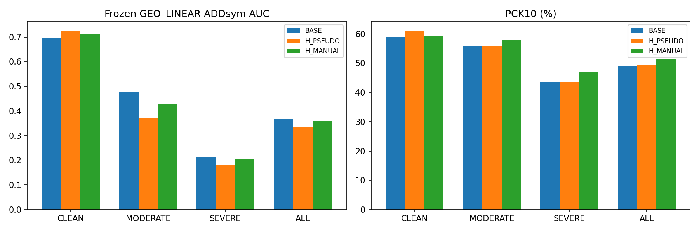

## 6. Verified visible / source / 학습 적합도

|그룹|모델|PCK10 correct/total|median px|P90 px|
|---|---|---:|---:|---:|
|ANCHOR ALL|BASE|41/66|7.0331|17.4525|
|ANCHOR ALL|H_PSEUDO|43/66|6.6708|17.4059|
|ANCHOR ALL|H_MANUAL|45/66|6.1613|18.5078|
|ANCHOR HARD|BASE|19/36|7.9307|19.4449|
|ANCHOR HARD|H_PSEUDO|21/36|8.0866|21.2697|
|ANCHOR HARD|H_MANUAL|24/36|6.2258|19.6160|
|ANCHOR CLEAN|BASE|22/30|5.6447|13.9487|
|ANCHOR CLEAN|H_PSEUDO|22/30|6.2120|13.3710|
|ANCHOR CLEAN|H_MANUAL|21/30|5.8821|16.6029|
|ANCHOR MODERATE|BASE|11/22|9.1139|16.5112|
|ANCHOR MODERATE|H_PSEUDO|13/22|8.0993|15.1256|
|ANCHOR MODERATE|H_MANUAL|15/22|6.2258|16.7788|
|ANCHOR SEVERE|BASE|8/14|7.5333|23.3736|
|ANCHOR SEVERE|H_PSEUDO|8/14|7.2273|24.1000|
|ANCHOR SEVERE|H_MANUAL|9/14|6.4277|21.9689|
|SOURCE256|BASE|1855/2028|2.4571|9.0706|
|SOURCE256|H_PSEUDO|1849/2028|2.4096|9.1371|
|SOURCE256|H_MANUAL|1835/2028|2.4828|9.5223|
|TRAIN8 (일반화 아님)|BASE|24/36|6.1231|147.8288|
|TRAIN8 (일반화 아님)|H_PSEUDO|28/36|5.6744|13.0094|
|TRAIN8 (일반화 아님)|H_MANUAL|36/36|2.9210|4.6717|

SOURCE256 exact ADDsym AUC: BASE=0.6260, H_PSEUDO=0.6331, H_MANUAL=0.6361

## 7. 촬영별 변화 및 손상/복구

|recording|모델|ΔPCK10 pp|ΔCURRENT AUC|ΔORACLE AUC|
|---|---|---:|---:|---:|
|REC_007|H_PSEUDO|-1.9084|-0.0117|-0.0024|
|REC_007|H_MANUAL|1.5267|0.0310|0.0292|
|REC_021|H_PSEUDO|2.2059|-0.0053|0.0358|
|REC_021|H_MANUAL|-0.7353|0.0167|0.0151|
|REC_022|H_PSEUDO|-6.5574|-0.1372|-0.0947|
|REC_022|H_MANUAL|-4.0984|-0.0879|-0.0963|
|REC_025|H_PSEUDO|3.0457|-0.0579|0.0240|
|REC_025|H_MANUAL|6.0914|-0.0499|0.0508|
|REC_027|H_PSEUDO|8.6957|0.0375|0.0375|
|REC_027|H_MANUAL|8.6957|0.0367|0.0367|
|REC_041|H_PSEUDO|-1.2500|-0.0395|-0.0395|
|REC_041|H_MANUAL|5.0000|-0.0117|-0.0117|
|REC_044|H_PSEUDO|2.0833|0.0273|0.0273|
|REC_044|H_MANUAL|2.0833|0.0230|0.0230|

[lost/gained correct10·20→10 복구·5→10 손상](TRANSITIONS.json) · [학습 적합도](TRAIN_FIT.json) · [verified visible](VERIFIED_VISIBLE.json)

## 8. 개선 및 악화 이미지

난도별 H_MANUAL−BASE의 정답10px 이내 코너 수 차이 상위2/하위2를 고정 규칙으로 선택했다. 동일 이미지는 중복하지 않는다. 초록=평가 reference, 노랑=각 모델 raw keypoints. **PnP 투영선이 아니다.** 사후 사례 선택이며 대표적인 빈도나 독립 일반화 증거가 아니다.

**CLEAN · eval_cad:1778653006783606016 · correct10 변화 -2점**
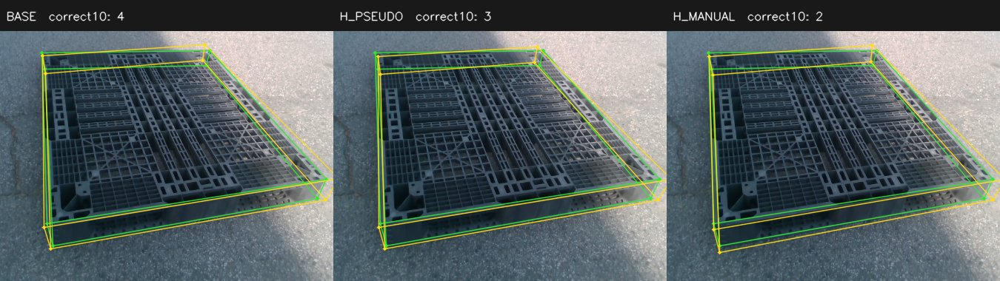

**CLEAN · eval_cad:1778653055734035712 · correct10 변화 -2점**
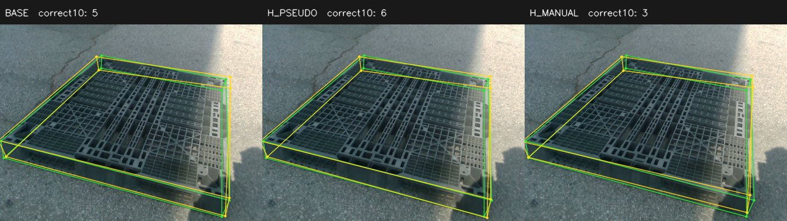

**CLEAN · eval_noapril:1775201443822140928 · correct10 변화 +1점**
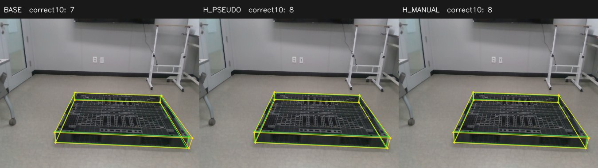

**CLEAN · eval_cad:1778653055868669952 · correct10 변화 +2점**
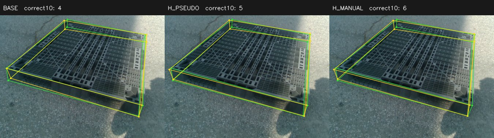

**MODERATE · eval_pallet07:1778652138515809024 · correct10 변화 -6점**
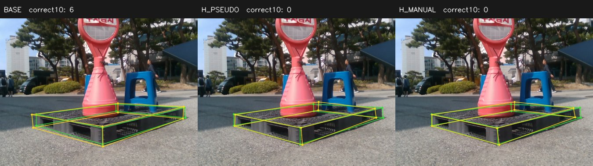

**MODERATE · eval_pallet07:1778652168786111744 · correct10 변화 -2점**
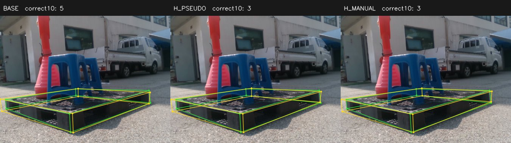

**MODERATE · eval_pallet07:1778652130452698368 · correct10 변화 +2점**
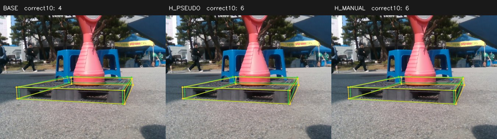

**MODERATE · eval_pallet07:1778652150610404864 · correct10 변화 +3점**
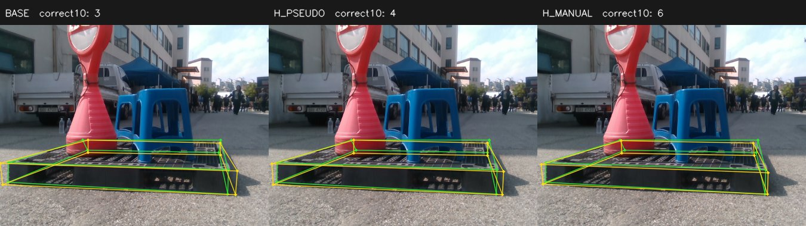

**SEVERE · eval_night09:1779449631842893312 · correct10 변화 -7점**
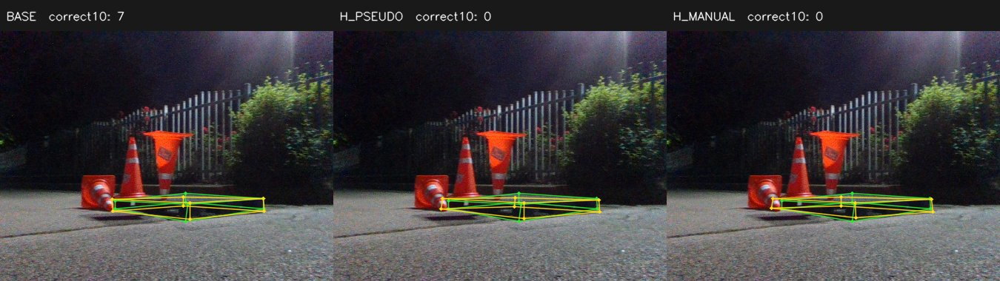

**SEVERE · eval_night09:1779449638581035008 · correct10 변화 -4점**
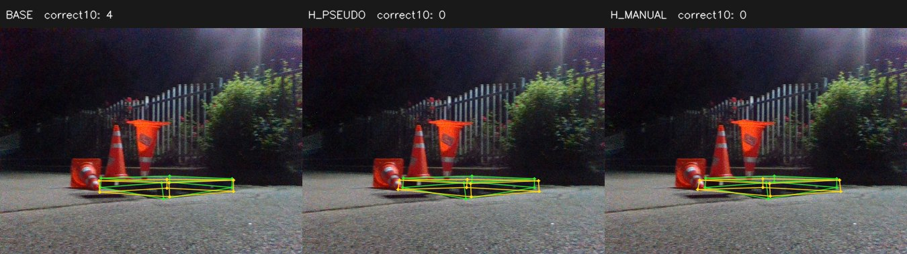

**SEVERE · eval_pallet09:1778653889069260032 · correct10 변화 +4점**
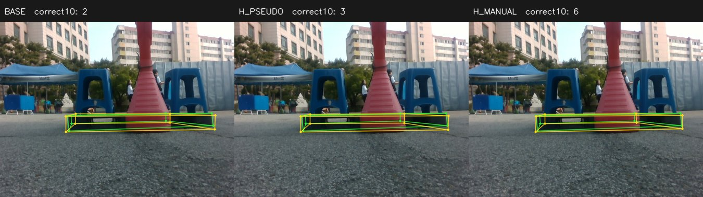

**SEVERE · eval_night09:1779449596017728000 · correct10 변화 +5점**
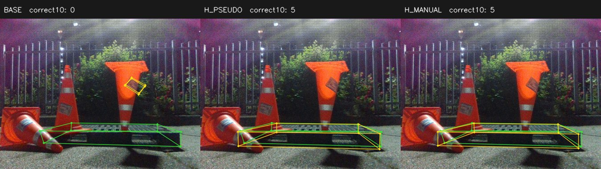

## 9. 해석과 한계

수동군은 수도레이블군보다 hard PCK10과 최종 AUC가 모두 높지만, 기존 S1의 hard 최종 AUC를 넘지 못했다. 중간난도 선택 손실은0.0653→0.1252, 심한난도는0.0686→0.0845로 커졌다. 좋은 W/D 후보를 최종 출력으로 선택하는 단계에서 이득이 손실되는 신호다. 다만 **오류 꼬리도 악화**됐다: 전체 matched P90은34.46→46.05px, 중간난도 P90은22.48→57.34px다. 그러므로 모든 실패를 selector 하나의 문제로 단정하지 않는다.

BASE→H_PSEUDO는 hard 노출·teacher 감독 패키지의 효과이고, H_PSEUDO→H_MANUAL은 같은 이미지·박스·support에서 좌표 source 변화의 효과다. 실제 delta를 비교해야 하며 비슷함의 임의 허용오차나 유의성 주장을 추가하지 않는다.

이미 반복 확인한 HELDOUT128 개발평가이며 독립 TEST가 아니다. 사람 태깅 sample은 전체 hard 빈도 추정이 아니다. 8장·single seed·일반 플라스틱만의 파일럿이다. PnP 보조 partial 수동 좌표는 독립 full6D GT가 아니다. Camera-facing ID와 물리 C2 동치는 다르다. Frozen GEO_LINEAR가 새 모델에 최적인지는 별개다. 추가 대량 annotation 대신 이번 고정 판정에 맞춰 다음 병목을 정한다.

실행 기록: H_PSEUDO 완료 저장 후 동일 프로세스에서 다음 학습으로 넘어가는 과정이 종료됐다. 완료된 fit은 반복하지 않았고 H_MANUAL은 별도 프로세스에서 최초 실행했다. 반복 thread-pool 초기화를 피하도록 실행부를 수정했다. 재부팅·드라이버 변경·타 GPU 프로세스 종료 없음.

[입력 lock](HARD_LABEL_LOCK.json) · [사용자 승인 프로토콜 변경](ANNOTATION_PROTOCOL_AMENDMENT.json) · [사전 검사](PRETRAIN_TESTS.json) · [실제 학습 짝 감사](PAIR_INTEGRITY_MANUAL_VS_PSEUDO.json) · [최종 감사](COMPLETION_AUDIT.json) · [판정](DECISION.json)
