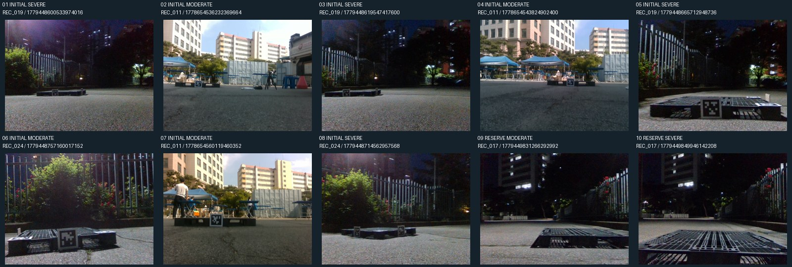
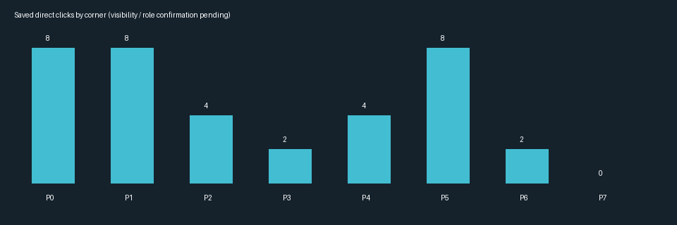
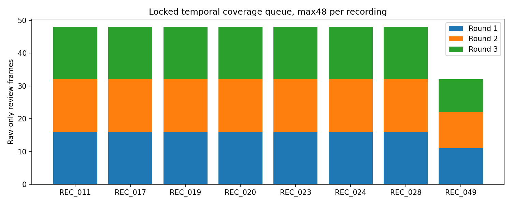
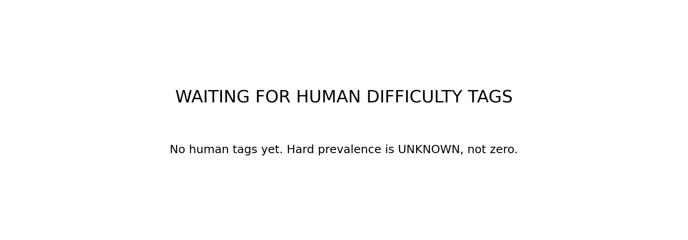

# Minimal hard supervision A/B — 준비 및 사람 입력 대기

## 현재 진행: 8장 클릭 저장 완료 → 메타데이터 확인 대기

난도 태깅 **123/123 완료**. CLEAN 10, MODERATE 13, SEVERE 9, UNCERTAIN 0, INVALID 91. Hard **22장 /4 recordings**로 고정 종료 조건을 만족하여 Round2/3은 열지 않는다. INVALID91은 사용자의 판정을 그대로 보존했으며 모델로 재분류하지 않았다.

Initial **8장 = Moderate4 + Severe4 /3 recordings**. Reserve2는 별도로 고정했고 아직 입력 대상이 아니다. 전체10장에서도 recording당 최대3이다. 모델 출력/GT/teacher를 보지 않고 인간 태그·recording·고정 hash만으로 선정했다.

|번호|용도|recording|사람 난도|
|---|---|---|---|
|1|INITIAL|REC_019|SEVERE|
|2|INITIAL|REC_011|MODERATE|
|3|INITIAL|REC_019|SEVERE|
|4|INITIAL|REC_011|MODERATE|
|5|INITIAL|REC_019|SEVERE|
|6|INITIAL|REC_024|MODERATE|
|7|INITIAL|REC_011|MODERATE|
|8|INITIAL|REC_024|SEVERE|
|9|RESERVE|REC_017|MODERATE|
|10|RESERVE|REC_017|SEVERE|



### 완료한 입력 방법 (수정할 때만 다시 실행)

```bash
python -m scripts.research.pallet_min_hard_ab_v1.open_existing_annotation
```

사용자 요청으로 전용 Tk 입력기를 닫고 **기존 `scripts/annotate/annotate.py`**로 전환했다. 공유 편집기 소스는 수정하지 않고 이번 프로세스에서만 격리 경로와 직접 클릭 저장을 연결했다.

- 좌클릭: 현재 P0..P7 입력 후 다음 번호.
- 안 보이는 점은 찍지 말고 숫자키로 다음 보이는 번호를 선택.
- **s** 저장 후 다음 이미지. **g** PnP 자동 채움·저장 후 현재 이미지 유지, **n** 다음 이미지. PnP 불가 시에도 s로 부분 클릭 저장 가능.
- **z** 되돌리기 / **d** 현재 점 삭제 / **+,-** 확대·축소 / **q** 종료.

사용자의 명시적 후속 요청으로 **PnP 표시·자동 채움을 켰다**. 이미지별 실제 cam_K를 사용한다. 직접 클릭과 PnP/외삽/중심 보완의 source를 분리하고, 자동 생성점/P8은 수동 감독 후보에서 제외한다. 기존 GT/모델 출력은 불러오지 않는다. 이 입력은 **HUMAN_PNP_ASSISTED_NOT_BLIND**이며 원래의 PnP 없는 주석 프로토콜과 다르다. 정확한 xy는 private 폴더에만 저장하며 기존 입력 기록도 보존했다. **역할/가시성/수동 bbox 확인은 이후 별도 단계로 남아 있고, 클릭 저장만으로 최종 학습 label lock을 만들지 않는다.** 새 학습은 아직 없다.

[선정 lock](HARD_SELECTION_LOCK.json) · [태깅 집계](DIFFICULTY_TAG_SUMMARY_PUBLIC.json) · [선정 검증 16항목 PASS](HARD_SELECTION_AUDIT.json)

### 저장 결과 확인

**8/8장 저장 완료**. 직접 클릭 코너 **36개**, PnP/외삽 보완 코너 **28개**, 자동 중심점 **8개**. 직접 클릭 여부는 저장된 source로 구분하며, `manual_kps` 전체를 수동 정답으로 취급하지 않는다.

|번호|recording|직접 클릭 코너|자동 보완 코너|
|---|---|---:|---:|
|1|REC_019|5|3|
|2|REC_011|4|4|
|3|REC_019|5|3|
|4|REC_011|4|4|
|5|REC_019|4|4|
|6|REC_024|5|3|
|7|REC_011|4|4|
|8|REC_024|5|3|



숫자상 8장·36점·3 recordings로 입력량 조건에 도달했지만 **usable 확정은 아니다**. 직접 클릭점의 실제 가시성·번호 확신과 bbox 방식을 확인 중이다. 기존 도구에는 수동 bbox 입력이 없었으므로 수동 박스가 완료됐다고 기록하지 않는다. PnP 박스를 공통으로 사용할 경우 원래 프로토콜 변경을 명시해야 한다. 자동 보완 코너와 P8은 수동 감독에서 제외한다.

**최종 label lock 없음 / teacher inference 미실행 / 새 학습·평가 미실행.** [저장 집계 및 원본 SHA](EXISTING_CLICK_PROGRESS_PUBLIC.json).

## 1. 한 줄 결론

**WAITING_FOR_HUMAN_HARD_METADATA**. 현재는 Phase4 클릭 저장 완료 / 메타데이터 확인 대기 단계이며 새 모델 학습·A/B 평가를 하지 않았다. BASE S1+GEO_LINEAR를 교체하지 않았다. 기존 RGB 8031장 → 미사용/중복 제외 후 **6821장 /8 recordings** → 첫 라운드 **123장**을 고정했다.

## 2. 왜 이 실험을 했나

이전 preservation adapter는 clean을 회복했지만 severe 이득을 보존하지 못했다. Frozen S1과 teacher가 모두 >10px인 verified visible점8개가 있으나, 이전8031 RGB에는 model-independent hard 태그가 없었다. 이번에는 사람이 원본 영상만 보고 sampling용 난도를 새로 태깅한다. 이전 오류점이나 모델 confidence로 후보를 고르지 않는다.

## 3. Model-blind difficulty tagging

|recording|원본|중복·기존 풀 제외 후|Round1|Round2|Round3|
|---|---:|---:|---:|---:|---:|
|REC_011|1572|1182|16|16|16|
|REC_017|1474|1188|16|16|16|
|REC_019|1254|1144|16|16|16|
|REC_020|1219|1111|16|16|16|
|REC_023|1075|995|16|16|16|
|REC_024|782|700|16|16|16|
|REC_028|613|469|16|16|16|
|REC_049|42|32|11|11|10|

제외 내역: `{'HISTORICAL_BALANCED_POOL_SHA': 1000, 'NEAR_DUP_WITHIN_POOL': 210}`. 과거 balanced PLASTIC pool1000장은 실제 학습된 하위 집합을 prediction으로 역추적하지 않고 전체를 보수적으로 제외했다. **1000장 모두 과거에 학습했다는 뜻은 아니다.** 현재 S1 학습 이미지522개(합성512+clean10), split 학습 후보, anchor, HELDOUT 및 reserved identity도 검사했다.

예약 recording의 **전체 원본 RGB**와 평가/anchor/학습 split 보호 영상 총 5324개 썸네일에 MAD 검사를 했다. 보존 후보의 평가/예약 SHA 및 MAD 중복0. 풀 내부에서도 SHA 순서로 중복을 제거하여 남은 모든 쌍의 grayscale64×48 MAD>2/255를 보장한다. MAD는 중복 검사에만 쓰고 hard 판정에 쓰지 않았다.

각 recording을 시간순 최대48 bin으로 나눠 `sha256("hard-tag-v1:"+frame_id)` 최소 한 장을 뽑는다. Round1=bin0,3,6…; Round2=1,4,7…; Round3=2,5,8…. 태깅 전에 private queue SHA를 공개 lock에 고정했다. 난도 태깅/선정 단계에는 모델/teacher/좌표 GT/PnP 결과를 파싱하거나 표시하지 않았다. 선정 후 주석 단계만 사용자 요청으로 PnP 보조를 허용했다. 과거 결과 파일은 provenance 보존을 위해 바이트 hash만 검증했다.



현재 사람 태깅 수 **123**. 아직 입력하지 않은 영상을 clean이나 hard로 가정하지 않는다.



### 완료된 난도 태깅 조작 (이력용)

```bash
python -m scripts.research.pallet_min_hard_ab_v1.tag_difficulty
```

- **C** 깨끗함: 가림/잘림이 없거나 매우 경미하고 주요 모서리·앞면 구조가 명확함.
- **M** 중간: 일부 모서리는 가려지거나 애매하지만 대부분의 구조와 일부 직접 보이는 점은 확실함.
- **S** 심함: 여러 주요 모서리가 손실되어 구조 복원이 어렵지만 일부 직접 보이는 점은 남음.
- **U** 모호함: 난도나 front/near 역할을 확신 못함.
- **X** 사용 불가: 팔레트가 없거나 흐림/손상으로 주석 불가.
- **Z** 직전 응답 취소. 키를 입력하면 저장하고 바로 다음 이미지로 이동. 중간에 닫아도 이어서 진행.

위 설명은 완료된 난도 태깅의 이력이다. 8장 클릭 저장은 완료됐고 메타데이터 확인이 남아 있다. 상태 확인:

```bash
python -m scripts.research.pallet_min_hard_ab_v1.cli resume
```

Hard≥12, ≥3 recording, recording당 최대3장으로 initial8+reserve2 구성 가능하면 태깅을 중단한다. Severe≥2는 선호이며 강제 변경하지 않는다. 부족할 때만 다음 라운드, 최대 368장. Round3까지 부족하면 모델 실패 영상으로 채우지 않고 종료한다.

## 4. Manual annotation — 클릭 저장 완료, 최종 확정 전

태깅 완료 후 hard 인간 태그·recording·고정 SHA만으로 initial8+reserve≤2를 선정한다. 전체에서 recording당 최대3, initial에 최소3 recording. 4M/4S 선호. 현재 사용자 override에서는 PnP 보조를 켠 기존 입력기로 코너를 저장했다. 수동 bbox는 아직 없고 직접 클릭점의 가시성·번호 확신 확인도 남아 있다. P8/숨은점/PnP 보완은 감독하지 않는다. 역할 불확실은 제외한다. 6 usable/24 clicks/3개 corner 각3점/3recording 기준을 검사한다.

## 5. Causal training contract — 아직 미수행

원래 S1 args를 그대로 hash-bind했다: 5epochs/320updates/batch16/seed42, AdamW lr0=0.0001, cosine/lrf0.1. 이전 adapter의 lr0.001과 다르다. BASE는 기존 S1 재사용. 새 H_MANUAL/H_PSEUDO는 원래 init에서 학습하고 synthetic512/epoch는 동일, real512 중 clean448+hard64로만 대체한다. Hard natural RGB에 추가 가림을 넣지 않는다.

두 H arm은 RGB/bbox/augmentation/occurrence/support mask가 동일하고, 직접 보이는 점의 xy 값만 manual vs frozen teacher로 달라야 한다. Teacher inference는 **사람 label lock 이후에만** 허용한다. Partial hard slot의 box/cls/dfl/visibility loss는0. 남은 BASE slot 수식은 유지한다. 결과를 보고 예산/seed/selector를 조정하지 않는다.

## 6–13. 평가 결과 — NOT_RUN

CLEAN29/MODERATE21/SEVERE78/ALL128, verified FINAL_V2, source256, per-recording, pseudo vs manual, oracle vs current 수치와 학습 적합도는 아직 없다. 예측 lock 전에 평가 GT를 읽지 않는 후속 학습·평가 실행 단계가 남아 있다. 준비 보고서를 최종 A/B 결과로 해석하면 안 된다.

## 14. Objective decision

**NOT_EVALUATED**. 성공/실패를 미리 선언하지 않는다. hard 양쪽과 clean 유지 + PCK/oracle 개선 여부를 요청한 고정 규칙대로 판정한다. 무이득이면 추가20/50장 어노테이션을 자동 요청하지 않는다.

## 15. 다음 단계

난도 태깅과 8장 클릭 저장은 완료됐다. 남은 것은 직접 클릭점 확인과 bbox 방식 결정이다. 사람 태그 → selection lock → 직접 보이는 점·bbox 입력 → QA/label lock 순서를 지킨다. **학습 실행부의 pair-integrity 검증과 실제 fit/evaluation은 label lock 뒤 다음 작업 단계에서 이어서 완료한다.** 현재 prepare/resume은 사람 입력과 label lock까지 처리하며, 그 뒤 `HARD_LABELS_LOCKED_TRAINING_PENDING`에서 안전하게 멈춘다. 사람 입력을 대신 만들거나 자동 학습 성공을 기록하지 않는다.

## 16. 한계

Already-viewed HELDOUT128 DEV이며 독립 TEST가 아니다. 태깅 표본은 시간/중복/기존 노출 제외로 선택되므로 hard prevalence population estimate가 아니다. 후속실험도6–10장, single seed, plastic only, partial manual-visible GT, geometry-derived real6D reference다. Camera-facing 역할과 물리 C2 동치는 다르다. Frozen GEO_LINEAR가 새 모델에 최적이라는 보장은 없고 independent final test는 아직 없다.

[후보 감사](CANDIDATE_POOL_AUDIT.json) · [큐 lock](DIFFICULTY_QUEUE_LOCK.json) · [프로토콜](PROTOCOL_LOCK.json) · [코드/실행 안내](../../../scripts/research/pallet_min_hard_ab_v1/README.md)

준비 감사: 17개 체크와 11개 단위 테스트 PASS. 전체 고정 큐368장의 평가·예약/큐 내부 MAD를 독립 재계산했다. 실제 Tk 창에서 마우스 클릭 없이 키 입력, 즉시 다음 이동, 길게 누름 방지, undo, 저장 후 resume을 임시 태그로 검증했다. 기존 준비 감사 시점에는 사람 태그가 없었다. 현재 난도 태깅은 검증·고정됐으며 corner 클릭 저장은 완료됐고 최종 label lock/학습/평가는 아직 NOT_RUN이다. [준비 테스트](PREPARATION_TESTS.json).
