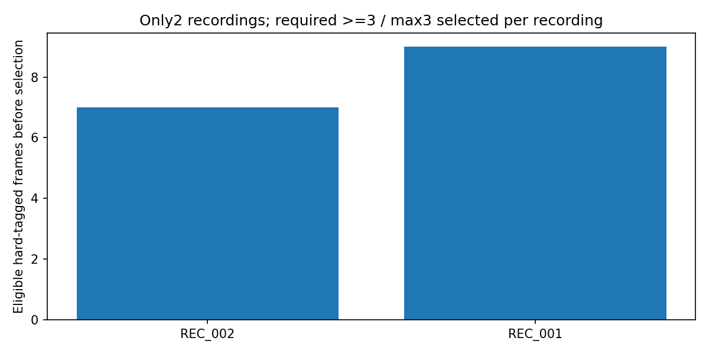
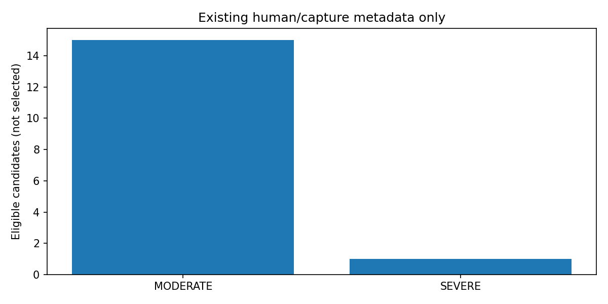
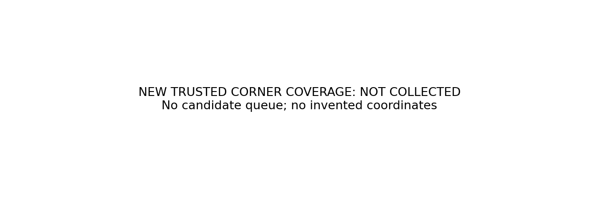
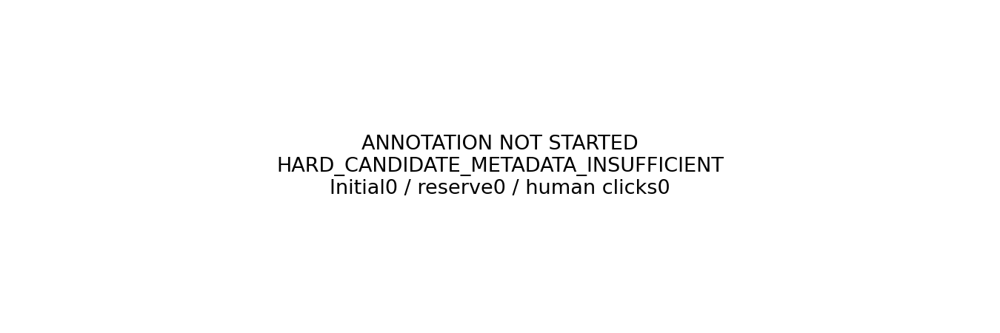
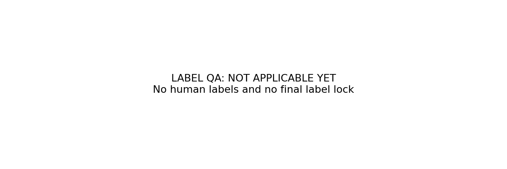

# 최소 hard 어노테이션 — 후보 메타데이터 감사

**HARD_CANDIDATE_METADATA_INSUFFICIENT**

supervision-gap gate는 통과했지만, 이것이 곧 적격 후보8장이 있다는 뜻은 아니다. 예측/오차/confidence를 읽지 않고 기존 human severity와 capture condition만 확인했다.

일반 플라스틱 unique inventory 1630장. 제외 내역 `{'NO_MODEL_INDEPENDENT_HARD_TAG': 1423, 'EVAL_ANCHOR_CLEAN10_H10_SHA': 148, 'UNKNOWN_RECORDING': 43}`. Hard metadata를 가진 후보 16장에서 MAD≤2/255 근접 중복 0장을 제외했다. 최종 16장 /2 recording.

recording별: `{'REC_002': 7, 'REC_001': 9}`. 난도별: `{'MODERATE_OCCLUSION': 15, 'SEVERE_OCCLUSION': 1}`. HELDOUT recording 추가 보존을 풀고 프레임 기준만 적용해도 recording 분포는 `{'REC_001': 9, 'REC_002': 7}`다.

기존 split에서 이미 train/DEV로 명시된 recording과 별개로, 유지된 final_test 세션 및 current split 밖의 FINAL 세션 recording을 제외했다. green/wood는 이번 일반 플라스틱 대상에 자동 편입하지 않았다. 학습/eval GT 변경은 없다.

필요한 8장·3 recording 조건을 충족하지 못하면 후보를 임의 채우지 않는다. 낮은 confidence나 모델 실패로 고르거나 낮/밤만으로 hard라고 만들지 않았다. 따라서 아직 annotation GUI/라벨 입력/학습을 요청하지 않는다. 다음은 최소한 새 후보 recording의 model-independent hard tag가 있어야 한다.

[원천·집계 감사](INVENTORY_AUDIT.json) · [보존 실험 보고서](../pallet_single_model_preserve_v1/REPORT_KO.md)

## 전체 adaptation pool 추가 확인

Balanced sample만 확인하지 않고 daytime+nighttime 전체 **8031장**도 확인했다. `{'NO_MODEL_INDEPENDENT_HARD_TAG': 8031}`. 기존 model-independent hard 태그로 새로 추가할 수 있는 후보는0장이다. 원본에 가림이 없다는 뜻이 아니라, 현재 메타데이터로 hard를 정할 근거가 없다는 뜻이다. 모델 실패나 confidence로 대체하지 않았다.

[전체 pool 감사](EXPANDED_POOL_AUDIT.json)

## 상태 그림

아래 16장은 선택된 annotation queue가 아니라 적격성 검사 후보 수다. 3개 recording 조건이 충족되지 않아 실제 선택0장/새 클릭0개다.

