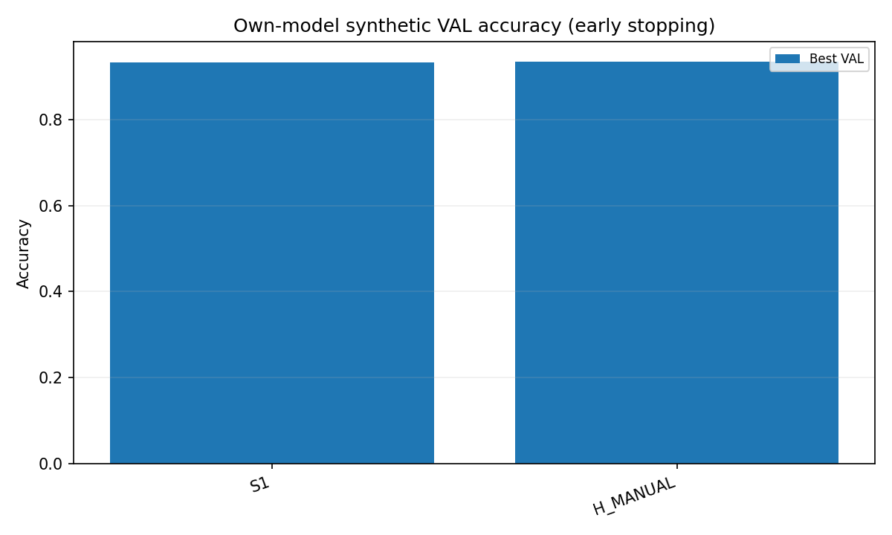
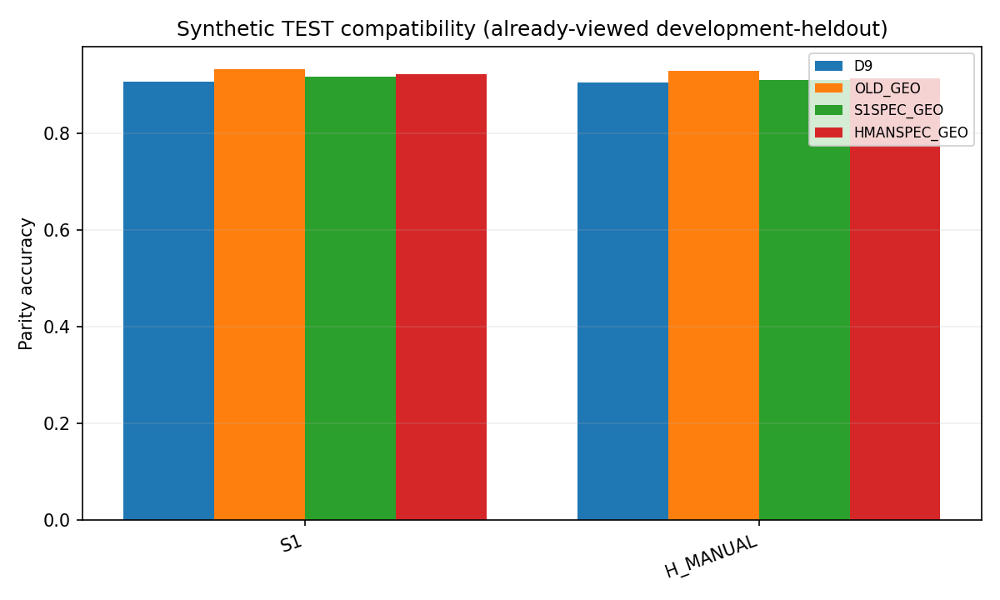
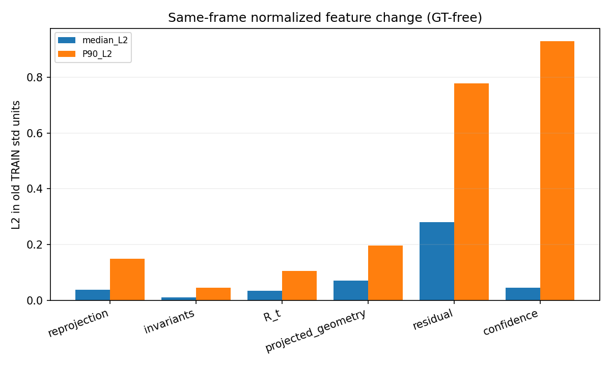
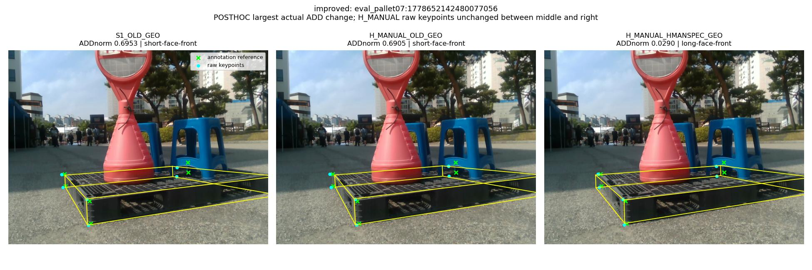
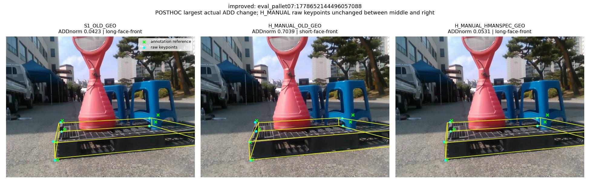
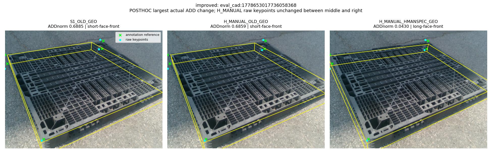
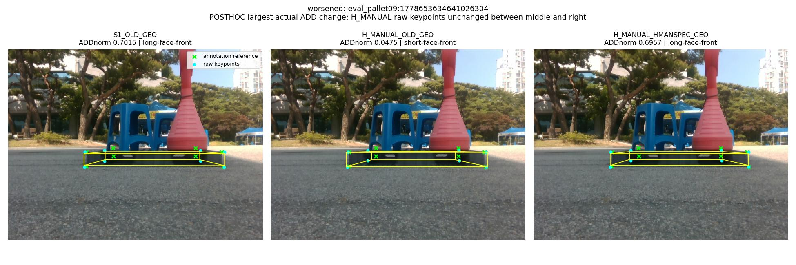
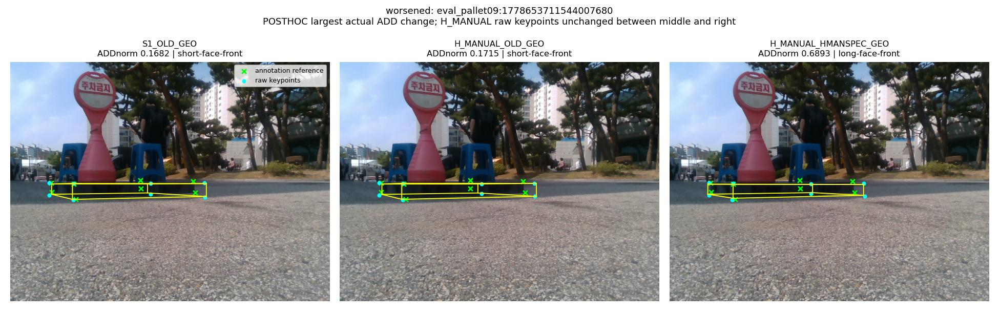
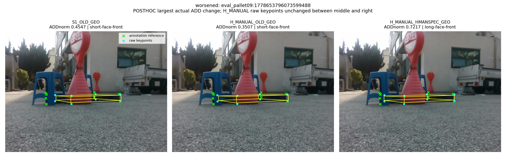

# Model-conditioned selector compatibility after minimal hard supervision

## 1. 한 줄 결론

`MODEL_CONDITIONED_SELECTOR_RECOVERY` / `HMAN_PIPELINE_RECOVERS_AND_BEATS_BASE`.

**사전 기준을 통과했다. H_MANUAL + HMAN_SPECIFIC_GEO_LINEAR를 재사용 DEV에서의 최종 후보로 동결한다.** 실제 배포 설정을 교체한 것은 아니며, 독립 확인은 아직 없다. 새 hard label·키포인트 학습은 0회, 동일 구조 selector 학습은 2회다.

| Population | n | S1 + old GEO | H_MANUAL + old GEO | H_MANUAL + own GEO | vs S1 (%p) |
|---|---|---|---|---|---|
| CLEAN | 29 | 0.698638 | 0.713983 | 0.713983 | 1.534483 |
| MODERATE | 21 | 0.475333 | 0.429381 | 0.490286 | 1.495238 |
| SEVERE | 78 | 0.211308 | 0.207365 | 0.215115 | 0.380769 |
| ALL | 128 | 0.365035 | 0.358570 | 0.373285 | 0.825000 |

지표는 기존과 동일한 ADDsym AUC(0~1)다. `%p`는 AUC 차이에 100을 곱한 값이며, 프레임 정답률이나 상대 개선율이 아니다. 심한 난도 개선은 작으며 통계적 유의성 주장을 하지 않는다.

## 2. 출발점

기존 최선은 S1 + frozen old GEO_LINEAR였다. 최소 hard8장/direct36점으로 학습 완료된 H_MANUAL은 2D와 candidate oracle에서 이득을 보였으나, 같은 old GEO를 붙인 최종 6D 결과는 낮았다. 두 키포인트 모델은 재학습하지 않았다.

| Moderate model | D9 | Old GEO | Posthoc oracle |
|---|---|---|---|
| S1 | 0.435690 | 0.475333 | 0.540595 |
| H_MANUAL | 0.490286 | 0.429381 | 0.554548 |

## 3. Stage1 frozen failure decomposition

기존 후보 pose의 reference metric을 새로 재계산하고 기존 발표값과 90개 비교를 통과했다. valid 두 후보의 ADDnorm 차이 1e-12 이하는 동률이다. 두 후보가 모두 나쁘다는 새 threshold는 만들지 않았으며 연속 best ADDnorm을 저장했다.

| Group | Model | Selector-recoverable | D9 right / GEO wrong | GEO right / D9 wrong |
|---|---|---|---|---|
| CLEAN | S1 | 0 | 0 | 0 |
| CLEAN | H_MANUAL | 0 | 0 | 0 |
| MODERATE | S1 | 3 | 1 | 2 |
| MODERATE | H_MANUAL | 5 | 2 | 0 |
| SEVERE | S1 | 27 | 1 | 6 |
| SEVERE | H_MANUAL | 30 | 2 | 7 |
| ALL | S1 | 30 | 2 | 8 |
| ALL | H_MANUAL | 35 | 4 | 7 |

| Group | Oracle gain frames | Oracle loss frames | Unrealized manual gain | Their oracle AUC contribution | Their current AUC contribution |
|---|---|---|---|---|---|
| CLEAN | 20 | 9 | 0 | 0.000000 | 0.000000 |
| MODERATE | 13 | 8 | 0 | 0.000000 | 0.000000 |
| SEVERE | 45 | 32 | 10 | 0.011154 | -0.021045 |
| ALL | 78 | 49 | 10 | 0.006797 | -0.012824 |

[상세 1단계 보고서 및 사례 이미지](stage1/STAGE1_REPORT_KO.md)

## 4. Synthetic controlled selector training

순서: upstream SHA 잠금 → 기존 baseline 재현/분해 → H_MANUAL 합성 frozen inference(6,144장), S1 exact cache 재사용 → predictions/features lock → 기존 exact renderer parity 연결 → 모델별 TRAIN 정규화 → 동일 GEO_LINEAR 학습/VAL early-stop → 두 checkpoint lock → synthetic TEST 1회 → 실사 8조합 decision lock → reference 결합 및 평가.

기존 renderer-group-disjoint TRAIN4096 / VAL1024 / TEST1024, seed20260925, RGB/K/치수/labels를 정확히 재사용했다. 두 모델 모두 TRAIN 유효 쌍 4095, VAL1024. 모델별 TRAIN 양 후보 공유 mean/std(floor1e-6), 94 features, 공유 Linear(94,1), lower-score selection, name tie-break. AdamW lr1e-3, weight_decay1e-4, batch256, seed42, max30epoch/patience5, earliest best VAL. S1 best epoch10/15, H_MANUAL best epoch15/20.

Old GEO는 S0+S1 pooled(동일 frame당 두 모델 출력)로 학습된 control이고, 이번 모델별 selector는 해당 모델만 본다. 따라서 모델별 학습은 pooled보다 학습 출력 수가 절반이며, “분포 호환성만 완벽히 고립한 효과”라고 과장하지 않는다. 실제 가설 검정은 이 고정된 model-specific fitting 설정에 한정된다.

## 5. Synthetic compatibility matrix

| Combination | Correct/1024 | Parity accuracy | Brier |
|---|---|---|---|
| S1_D9 | 929 | 0.907227 | None |
| S1_OLD_GEO | 955 | 0.932617 | 0.056838 |
| S1_S1SPEC_GEO | 940 | 0.917969 | 0.072695 |
| S1_HMANSPEC_GEO | 944 | 0.921875 | 0.067199 |
| H_MANUAL_D9 | 926 | 0.904297 | None |
| H_MANUAL_OLD_GEO | 952 | 0.929688 | 0.059083 |
| H_MANUAL_S1SPEC_GEO | 933 | 0.911133 | 0.074788 |
| H_MANUAL_HMANSPEC_GEO | 936 | 0.914062 | 0.069165 |

합성 TEST에서는 H_MANUAL 전용이 old보다 낮다(936/1024 vs 952/1024). 이 결과로 추가 학습·설정 변경을 하지 않았다. 합성에서 개선됐지만 실사에서 안 된 SYNTH_REAL_COMPATIBILITY_GAP 분기는 해당하지 않는다.

## 6. Real CLEAN

| Combination | AUC | Axis correct | Coverage | Selection loss | Selector correct |
|---|---|---|---|---|---|
| S1_D9 | 0.698638 | 29 | 1.000000 | 0.000000 | 29 |
| S1_OLD_GEO | 0.698638 | 29 | 1.000000 | 0.000000 | 29 |
| S1_S1SPEC_GEO | 0.698638 | 29 | 1.000000 | 0.000000 | 29 |
| S1_HMANSPEC_GEO | 0.698638 | 29 | 1.000000 | 0.000000 | 29 |
| H_MANUAL_D9 | 0.713983 | 29 | 1.000000 | 0.000000 | 29 |
| H_MANUAL_OLD_GEO | 0.713983 | 29 | 1.000000 | 0.000000 | 29 |
| H_MANUAL_S1SPEC_GEO | 0.713983 | 29 | 1.000000 | 0.000000 | 29 |
| H_MANUAL_HMANSPEC_GEO | 0.713983 | 29 | 1.000000 | 0.000000 | 29 |

| Model | Oracle AUC (GT-dependent) | Old→own wrong→correct | Old→own correct→wrong |
|---|---|---|---|
| S1 | 0.698638 | 0 | 0 |
| H_MANUAL | 0.713983 | 0 | 0 |

## 7. Real MODERATE

| Combination | AUC | Axis correct | Coverage | Selection loss | Selector correct |
|---|---|---|---|---|---|
| S1_D9 | 0.435690 | 16 | 1.000000 | 0.104905 | 17 |
| S1_OLD_GEO | 0.475333 | 17 | 1.000000 | 0.065262 | 18 |
| S1_S1SPEC_GEO | 0.435690 | 16 | 1.000000 | 0.104905 | 17 |
| S1_HMANSPEC_GEO | 0.503833 | 18 | 1.000000 | 0.036762 | 19 |
| H_MANUAL_D9 | 0.490286 | 16 | 1.000000 | 0.064262 | 18 |
| H_MANUAL_OLD_GEO | 0.429381 | 14 | 1.000000 | 0.125167 | 16 |
| H_MANUAL_S1SPEC_GEO | 0.490286 | 16 | 1.000000 | 0.064262 | 18 |
| H_MANUAL_HMANSPEC_GEO | 0.490286 | 16 | 1.000000 | 0.064262 | 18 |

| Model | Oracle AUC (GT-dependent) | Old→own wrong→correct | Old→own correct→wrong |
|---|---|---|---|
| S1 | 0.540595 | 1 | 2 |
| H_MANUAL | 0.554548 | 2 | 0 |

## 8. Real SEVERE

| Combination | AUC | Axis correct | Coverage | Selection loss | Selector correct |
|---|---|---|---|---|---|
| S1_D9 | 0.195397 | 47 | 1.000000 | 0.084532 | 46 |
| S1_OLD_GEO | 0.211308 | 52 | 1.000000 | 0.068622 | 51 |
| S1_S1SPEC_GEO | 0.195397 | 46 | 1.000000 | 0.084532 | 51 |
| S1_HMANSPEC_GEO | 0.195397 | 46 | 1.000000 | 0.084532 | 51 |
| H_MANUAL_D9 | 0.189327 | 43 | 0.987179 | 0.102500 | 42 |
| H_MANUAL_OLD_GEO | 0.207365 | 48 | 0.987179 | 0.084462 | 47 |
| H_MANUAL_S1SPEC_GEO | 0.206647 | 45 | 0.987179 | 0.085179 | 46 |
| H_MANUAL_HMANSPEC_GEO | 0.215115 | 46 | 0.987179 | 0.076712 | 47 |

| Model | Oracle AUC (GT-dependent) | Old→own wrong→correct | Old→own correct→wrong |
|---|---|---|---|
| S1 | 0.279929 | 3 | 3 |
| H_MANUAL | 0.291827 | 3 | 3 |

## 9. Selector vs candidate/localization decomposition

H_MANUAL 전용 selector는 old 대비 중간 AUC +0.060905, 심함 +0.007750으로 두 hard 난도 모두 회복했다. 중간에서는 D9 및 S1-specific과 같은 0.490286이다. 따라서 “새 selector가 중간에서 D9보다 뛰어나다”는 주장은 불가하다. 심함에서는 D9 0.189327보다 높다.

S1-specific control은 S1 old 대비 중간·심함 모두 낮다. H_MANUAL 전용의 회복은 관찰되지만, 전체 cross-table은 완전한 모델 특이성 증명을 뜻하지 않는다. 예를 들어 S1+HMAN-specific은 중간이 더 좋고 심함은 더 나빠서 별도의 새 winner로 선택하거나 난도별 routing을 만들지 않았다.

H_MANUAL의 심함 selector correct count는 old와 같아도 AUC는 증가한다. 맞춘/틀린 frame의 수뿐 아니라 바뀐 ADD 값과 AUC 범위 내의 기여가 다르기 때문이다. Oracle AUC와 selector accuracy는 별개이며, 낮은 ADD가 반드시 W/D axis label 정답과 같은 것은 아니다.

아래는 old→HMAN-specific의 실제 ADDnorm 변화가 큰 개선/악화 사례 각 최대3장이다. 사후 설명용으로 선택했으며, 학습 또는 checkpoint 선택에 사용하지 않았다. 초록 X=기존 annotation reference, 청록 점=raw keypoints, 노랑 선=PnP projection. 가운데·오른쪽의 raw keypoint는 동일하고 후보 선택만 다르다.

### improved: eval_pallet07:1778652142480077056 (ΔADDnorm -0.6614)

### improved: eval_pallet07:1778652144496057088 (ΔADDnorm -0.6508)

### improved: eval_cad:1778653017736058368 (ΔADDnorm -0.6429)

### worsened: eval_pallet09:1778653634641026304 (ΔADDnorm +0.6482)

### worsened: eval_pallet09:1778653711544007680 (ΔADDnorm +0.5177)

### worsened: eval_pallet09:1778653796073599488 (ΔADDnorm +0.3710)

## 10. Per-recording

| Recording | Model | D9 | Old GEO | S1-specific | HMAN-specific | Oracle | PCK10 |
|---|---|---|---|---|---|---|---|
| REC_007 | S1 | 0.118076 | 0.137788 | 0.118076 | 0.118076 | 0.261348 | 0.480916 |
| REC_007 | H_MANUAL | 0.155515 | 0.168833 | 0.152909 | 0.152909 | 0.290561 | 0.496183 |
| REC_021 | S1 | 0.716722 | 0.683472 | 0.716722 | 0.716722 | 0.716722 | 0.286765 |
| REC_021 | H_MANUAL | 0.731778 | 0.700139 | 0.731778 | 0.731778 | 0.731778 | 0.279412 |
| REC_022 | S1 | 0.232813 | 0.232813 | 0.232813 | 0.232813 | 0.299750 | 0.467213 |
| REC_022 | H_MANUAL | 0.144937 | 0.144937 | 0.144937 | 0.186219 | 0.203469 | 0.426230 |
| REC_025 | S1 | 0.415981 | 0.490852 | 0.415981 | 0.468981 | 0.527000 | 0.431472 |
| REC_025 | H_MANUAL | 0.431444 | 0.441000 | 0.484667 | 0.484667 | 0.577796 | 0.492386 |
| REC_027 | S1 | 0.077250 | 0.077250 | 0.077250 | 0.077250 | 0.077250 | 0.271739 |
| REC_027 | H_MANUAL | 0.114000 | 0.114000 | 0.114000 | 0.114000 | 0.114000 | 0.358696 |
| REC_041 | S1 | 0.396600 | 0.396600 | 0.396600 | 0.396600 | 0.396600 | 0.762500 |
| REC_041 | H_MANUAL | 0.384900 | 0.384900 | 0.384900 | 0.384900 | 0.384900 | 0.812500 |
| REC_044 | S1 | 0.667000 | 0.667000 | 0.667000 | 0.667000 | 0.667000 | 0.937500 |
| REC_044 | H_MANUAL | 0.690000 | 0.690000 | 0.690000 | 0.690000 | 0.690000 | 0.958333 |

REC_022의 candidate quality 손실과 REC_025의 oracle/current 차이도 같은 전체 표에 포함한다. 특정 recording을 제외하지 않았다. 자세한 selector correct count/margin은 [RECORDING_BREAKDOWN.json](stage3/RECORDING_BREAKDOWN.json)에 저장했다.

## 11. 2D tail limitation

| Group | Model | PCK5 | PCK10 | PCK20 | Median px | P90 px | Gross20 | Detected | Matched | Missing |
|---|---|---|---|---|---|---|---|---|---|---|
| CLEAN | S1 | 0.375546 | 0.589520 | 0.855895 | 7.699580 | 21.899077 | 0.144105 | 29 | 29 | 0 |
| CLEAN | H_MANUAL | 0.366812 | 0.593886 | 0.882096 | 7.450267 | 20.601250 | 0.117904 | 29 | 29 | 0 |
| MODERATE | S1 | 0.175325 | 0.558442 | 0.850649 | 9.348365 | 22.475564 | 0.149351 | 21 | 21 | 0 |
| MODERATE | H_MANUAL | 0.207792 | 0.577922 | 0.785714 | 8.656158 | 57.343611 | 0.214286 | 21 | 21 | 0 |
| SEVERE | S1 | 0.167774 | 0.435216 | 0.666113 | 11.253578 | 54.306000 | 0.333887 | 78 | 73 | 0 |
| SEVERE | H_MANUAL | 0.194352 | 0.468439 | 0.677741 | 10.813537 | 58.265412 | 0.322259 | 77 | 76 | 1 |
| ALL | S1 | 0.217259 | 0.490355 | 0.739086 | 9.829288 | 34.459277 | 0.260914 | 128 | 123 | 0 |
| ALL | H_MANUAL | 0.236548 | 0.514721 | 0.742132 | 9.519979 | 46.053267 | 0.257868 | 127 | 126 | 1 |

특히 MODERATE raw P90은 S1 22.48px → H_MANUAL 57.34px로 악화됐다. selector 교체는 좌표를 수정하지 않으므로 이 큰 오차를 해결한 것이 아니다. 고정 verified HARD36도 S1 19/36 → H_MANUAL 24/36 그대로이며 selector variant별로 중복 이득을 세지 않는다.

### 6D error tails (all eight combinations)

| Group | Combo | R med/P90 ° | Yaw med/P90 ° | t med/P90 cm | IoU3D med/P90 |
|---|---|---|---|---|---|
| CLEAN | S1_D9 | 1.573 / 3.172 | 0.408 / 1.337 | 4.707 / 7.038 | 0.619 / 0.755 |
| CLEAN | S1_OLD_GEO | 1.573 / 3.172 | 0.408 / 1.337 | 4.707 / 7.038 | 0.619 / 0.755 |
| CLEAN | S1_S1SPEC_GEO | 1.573 / 3.172 | 0.408 / 1.337 | 4.707 / 7.038 | 0.619 / 0.755 |
| CLEAN | S1_HMANSPEC_GEO | 1.573 / 3.172 | 0.408 / 1.337 | 4.707 / 7.038 | 0.619 / 0.755 |
| CLEAN | H_MANUAL_D9 | 1.780 / 3.153 | 0.464 / 1.285 | 3.972 / 7.143 | 0.637 / 0.817 |
| CLEAN | H_MANUAL_OLD_GEO | 1.780 / 3.153 | 0.464 / 1.285 | 3.972 / 7.143 | 0.637 / 0.817 |
| CLEAN | H_MANUAL_S1SPEC_GEO | 1.780 / 3.153 | 0.464 / 1.285 | 3.972 / 7.143 | 0.637 / 0.817 |
| CLEAN | H_MANUAL_HMANSPEC_GEO | 1.780 / 3.153 | 0.464 / 1.285 | 3.972 / 7.143 | 0.637 / 0.817 |
| MODERATE | S1_D9 | 1.817 / 83.038 | 1.238 / 82.961 | 6.904 / 19.134 | 0.615 / 0.847 |
| MODERATE | S1_OLD_GEO | 1.751 / 78.265 | 1.313 / 78.263 | 6.842 / 19.134 | 0.746 / 0.868 |
| MODERATE | S1_S1SPEC_GEO | 1.817 / 83.038 | 1.238 / 82.961 | 6.904 / 19.134 | 0.615 / 0.847 |
| MODERATE | S1_HMANSPEC_GEO | 1.751 / 5.198 | 1.238 / 4.885 | 6.603 / 19.134 | 0.746 / 0.868 |
| MODERATE | H_MANUAL_D9 | 1.989 / 76.902 | 1.363 / 76.900 | 6.894 / 18.994 | 0.681 / 0.841 |
| MODERATE | H_MANUAL_OLD_GEO | 1.989 / 86.570 | 1.436 / 86.351 | 8.578 / 18.994 | 0.664 / 0.841 |
| MODERATE | H_MANUAL_S1SPEC_GEO | 1.989 / 76.902 | 1.363 / 76.900 | 6.894 / 18.994 | 0.681 / 0.841 |
| MODERATE | H_MANUAL_HMANSPEC_GEO | 1.989 / 76.902 | 1.363 / 76.900 | 6.894 / 18.994 | 0.681 / 0.841 |
| SEVERE | S1_D9 | 5.630 / 88.398 | 4.721 / 88.394 | 13.407 / 111.264 | 0.504 / 0.783 |
| SEVERE | S1_OLD_GEO | 4.476 / 87.901 | 3.625 / 87.897 | 13.407 / 88.958 | 0.514 / 0.783 |
| SEVERE | S1_S1SPEC_GEO | 5.267 / 88.398 | 4.438 / 88.394 | 13.674 / 103.150 | 0.496 / 0.783 |
| SEVERE | S1_HMANSPEC_GEO | 5.267 / 88.398 | 4.438 / 88.394 | 13.674 / 103.150 | 0.496 / 0.783 |
| SEVERE | H_MANUAL_D9 | 6.012 / 89.119 | 5.360 / 89.107 | 14.859 / 59.038 | 0.503 / 0.792 |
| SEVERE | H_MANUAL_OLD_GEO | 5.135 / 88.644 | 4.745 / 88.640 | 16.100 / 57.037 | 0.531 / 0.792 |
| SEVERE | H_MANUAL_S1SPEC_GEO | 5.361 / 87.841 | 4.862 / 87.826 | 14.072 / 59.038 | 0.531 / 0.792 |
| SEVERE | H_MANUAL_HMANSPEC_GEO | 5.135 / 87.841 | 4.745 / 87.826 | 14.072 / 59.038 | 0.531 / 0.792 |
| ALL | S1_D9 | 3.046 / 86.860 | 2.149 / 86.850 | 8.473 / 55.039 | 0.577 / 0.805 |
| ALL | S1_OLD_GEO | 2.888 / 86.638 | 1.882 / 86.606 | 8.473 / 55.039 | 0.581 / 0.810 |
| ALL | S1_S1SPEC_GEO | 2.972 / 86.838 | 2.090 / 86.825 | 8.654 / 55.039 | 0.577 / 0.805 |
| ALL | S1_HMANSPEC_GEO | 2.888 / 86.838 | 1.882 / 86.825 | 8.654 / 55.039 | 0.577 / 0.810 |
| ALL | H_MANUAL_D9 | 3.138 / 87.379 | 2.112 / 87.365 | 8.578 / 41.035 | 0.597 / 0.819 |
| ALL | H_MANUAL_OLD_GEO | 3.095 / 86.948 | 2.056 / 86.788 | 8.611 / 41.035 | 0.600 / 0.818 |
| ALL | H_MANUAL_S1SPEC_GEO | 3.095 / 86.806 | 2.035 / 86.800 | 8.404 / 41.035 | 0.600 / 0.818 |
| ALL | H_MANUAL_HMANSPEC_GEO | 3.006 / 86.806 | 1.984 / 86.800 | 8.404 / 41.035 | 0.601 / 0.818 |

2D gained/lost10, 20→10 recovery, 5→10 damage 및 verified visible 전체 표는 [REAL_SELECTOR_RESULTS.json](stage3/REAL_SELECTOR_RESULTS.json)의 model-level 항목에 저장했다. Selector별 raw 2D는 동일하기 때문에 별도 증분으로 표시하지 않는다.

## 12. Objective decision

Compatibility: `MODEL_CONDITIONED_SELECTOR_RECOVERY`. Pipeline: `HMAN_PIPELINE_RECOVERS_AND_BEATS_BASE`.

사전 규칙: H_MANUAL own selector가 old 대비 hard 한 난도 strict 개선 + 다른 hard 비악화이면 compatibility recovery. 최종 pipeline은 S1 old 대비 Clean/Moderate/Severe 모두 비악화 + hard 적어도 하나 strict 개선. 이 조건을 모두 만족했다. 효과 크기 cutoff 또는 결과 기반 threshold sweep은 없다.

**FINAL_CANDIDATE_ON_REUSED_DEV = frozen H_MANUAL + frozen HMAN_SPECIFIC_GEO_LINEAR.** 추가 키포인트 학습·selector sweep·hard annotation을 실행하지 않는다. 기존 baseline과 모든 결과는 보존한다.

## 13. Next one step

Untouched/reserved recording이 실제로 남아 있는지 먼저 감사하고 독립 확인을 설계한다. 독립 데이터가 없을 때만 새 촬영을 논의한다. 이번 작업은 1~3단계까지이므로 추가 평가/촬영/학습은 자동 실행하지 않았다.

## 14. Limitations

- Real HELDOUT128은 recording-disjoint이지만 이미 반복 열람한 DEV이며 독립 final TEST가 아니다.
- Synthetic TEST도 이미 연구에서 쓰인 development-heldout이고 base R0는 더 넓은 합성 population을 학습했다.
- Single-seed keypoint models, hard8/direct36 pilot이며 일반화 성공을 확정할 근거는 부족하다.
- Human PnP-assisted labels 및 기존 6D reference는 독립 physical full6D GT가 아니다.
- 기존 94-feature GEO_LINEAR contract를 그대로 사용했고 selector는 synthetic only로 학습했다.
- Candidate ORACLE는 POSTHOC / GT-dependent / NONDEPLOYABLE이다.
- Camera-facing/180° symmetry role convention 경고가 남아 있다.
- Selector는 missing detection, raw keypoint tail, 잘못된 candidate 자체를 복구하지 않는다.
- Old pooled 대 model-specific 학습의 sample-output 수 차이를 통제한 추가 실험은 수행하지 않았다.
- S1-specific 대조군/cross 조합을 숨기지 않았고 난도별 oracle routing이나 real-GT selector fit은 없다.

따라서 결론은 “model-conditioned synthetic selector recovered the localization/candidate gains of the minimal-hard model on the reused recording-disjoint development set” 수준으로 제한한다. “hard supervision solved pallet pose” 또는 모든 코너 오차가 해결됐다는 주장은 하지 않는다.

## Reproduction / audit

[입력 bindings](INPUT_BINDINGS.json) · [고정 프로토콜](PROTOCOL_LOCK.json) · [Stage2 audit](STAGE2_AUDIT.json) · [최종 audit](FINAL_AUDIT.json) · [Stage3 상세](stage3/STAGE3_REPORT_KO.md).
