# Stage 1 — frozen failure decomposition

기존 수치 재현 통과. 후보와 선택 결과의 6D 지표는 frozen pose와 기존 reference로 재계산했고, 2D는 frozen per-corner error를 재집계했다. 새 모델 추론·학습 없음.

| Group | Model | D9 AUC | Old GEO AUC | Oracle AUC | Recoverable |
|---|---|---|---|---|---|
| CLEAN | S1 | 0.698638 | 0.698638 | 0.698638 | 0 |
| CLEAN | H_MANUAL | 0.713983 | 0.713983 | 0.713983 | 0 |
| MODERATE | S1 | 0.435690 | 0.475333 | 0.540595 | 3 |
| MODERATE | H_MANUAL | 0.490286 | 0.429381 | 0.554548 | 5 |
| SEVERE | S1 | 0.195397 | 0.211308 | 0.279929 | 27 |
| SEVERE | H_MANUAL | 0.189327 | 0.207365 | 0.291827 | 30 |
| ALL | S1 | 0.348836 | 0.365035 | 0.417559 | 30 |
| ALL | H_MANUAL | 0.357570 | 0.358570 | 0.430574 | 35 |

| Group | D9 right / GEO wrong | GEO right / D9 wrong | Unrealized manual gain | Tail worsened |
|---|---|---|---|---|
| CLEAN | 0 | 0 | 0 | 2 |
| MODERATE | 2 | 0 | 0 | 4 |
| SEVERE | 2 | 7 | 10 | 11 |
| ALL | 4 | 7 | 10 | 17 |

SELECTOR_RECOVERABLE은 두 유효 후보 중 낮은 ADDnorm을 선택하지 않은 경우이다. 두 후보가 모두 나쁘다는 임의 threshold는 만들지 않았으며 best_candidate_ADDnorm 연속값을 저장했다. NO_SELECTOR_HEADROOM은 현재 이미 oracle 후보를 고르거나 동률인 경우이며, candidate quality가 좋다는 뜻은 아니다. 동률은 별도 ORACLE_TIE로 분리했다.

ORACLE는 사후 GT 의존·비배포 가능 분석이다. HELDOUT128은 이미 열람한 recording-disjoint DEV이다. selector는 raw keypoint tail을 바꾸지 못한다.

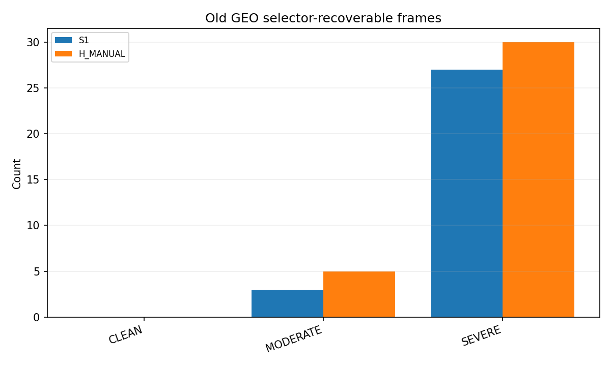

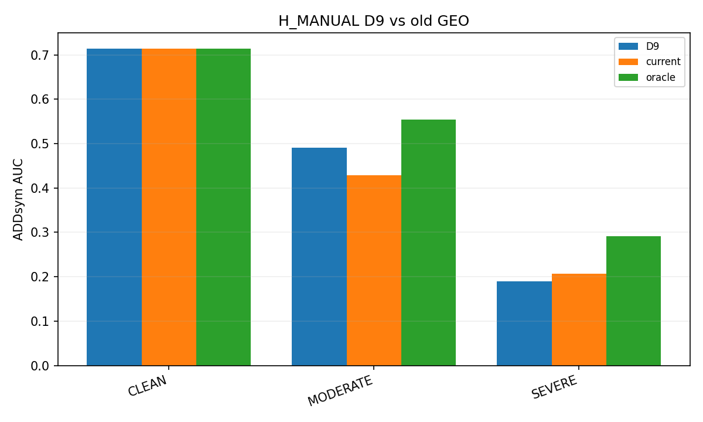

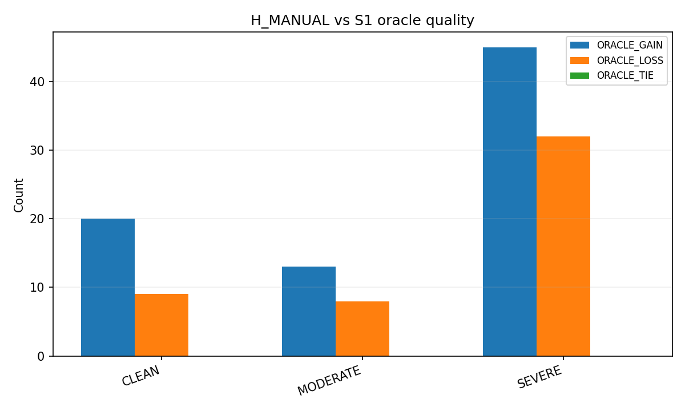

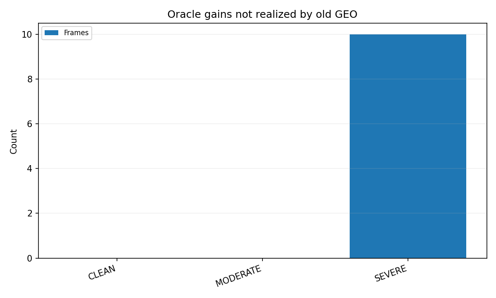

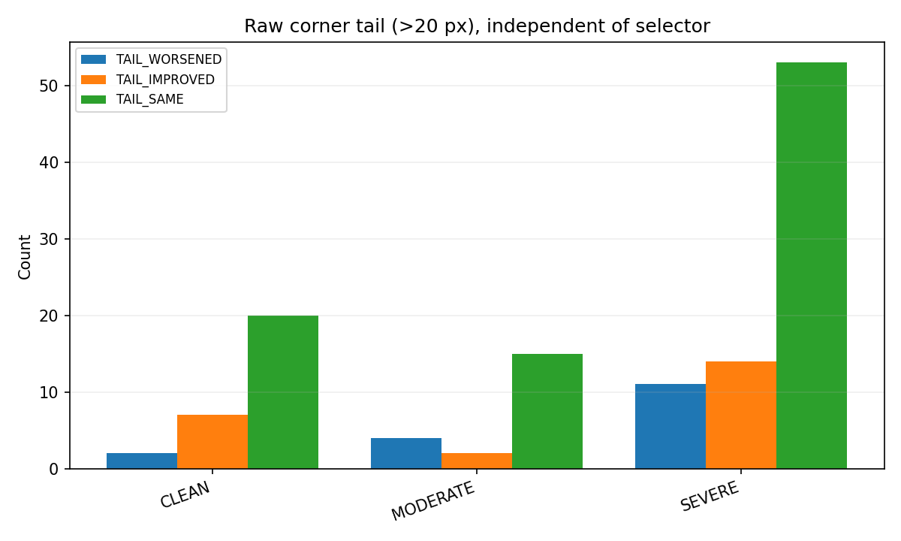

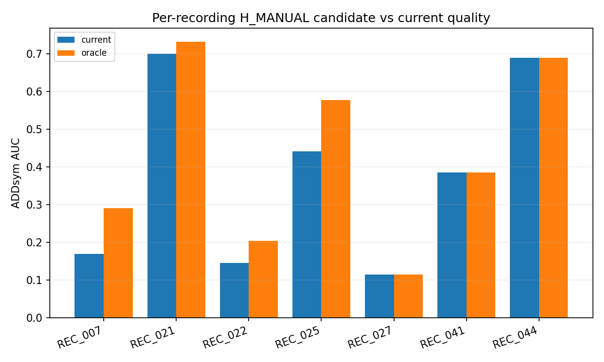

## Explanatory cases

초록 X=기존 annotation reference, 청록 점=raw keypoints, 노랑 선=선택된 PnP pose 재투영. 각 고정 범주에서 실제 ADD gap 큰 순으로 선택한 사후 설명 사례이며, 학습·모델 선택 근거가 아니다.

### selector_recoverable: eval_pallet07:1778652176547299328

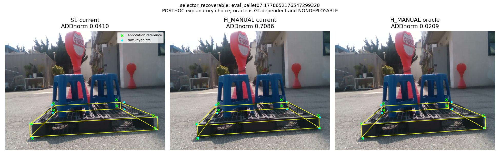

### selector_recoverable: eval_pallet09:1778653884903302656

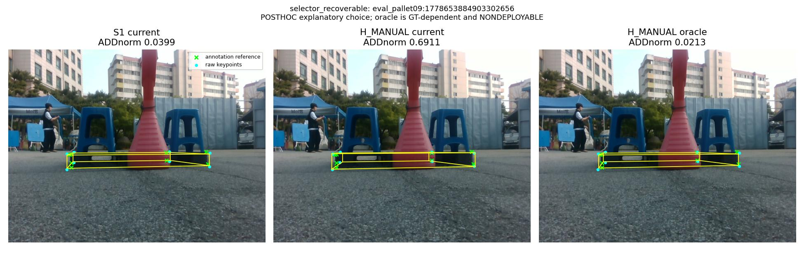

### unrealized_gain: eval_pallet07:1778652176547299328

### unrealized_gain: eval_pallet09:1778653884903302656

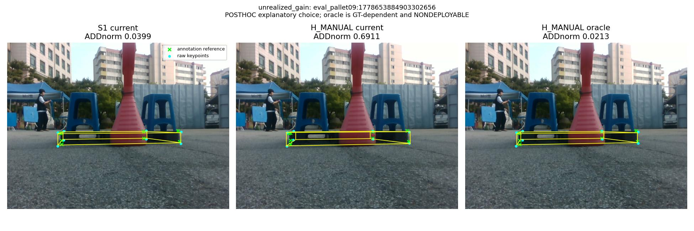

### tail_worsened: eval_pallet07:1778652140531310080

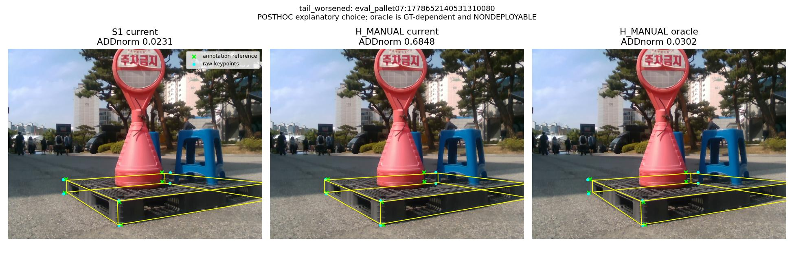

### tail_worsened: eval_pallet07:1778652168786111744

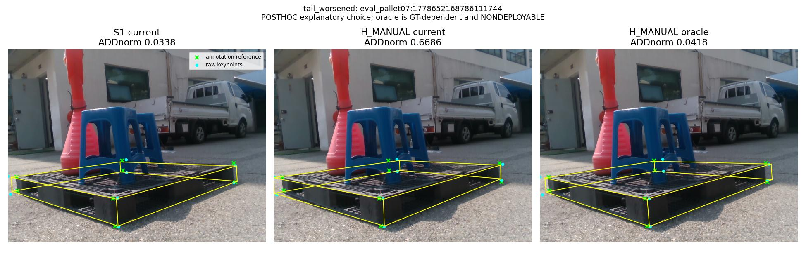
