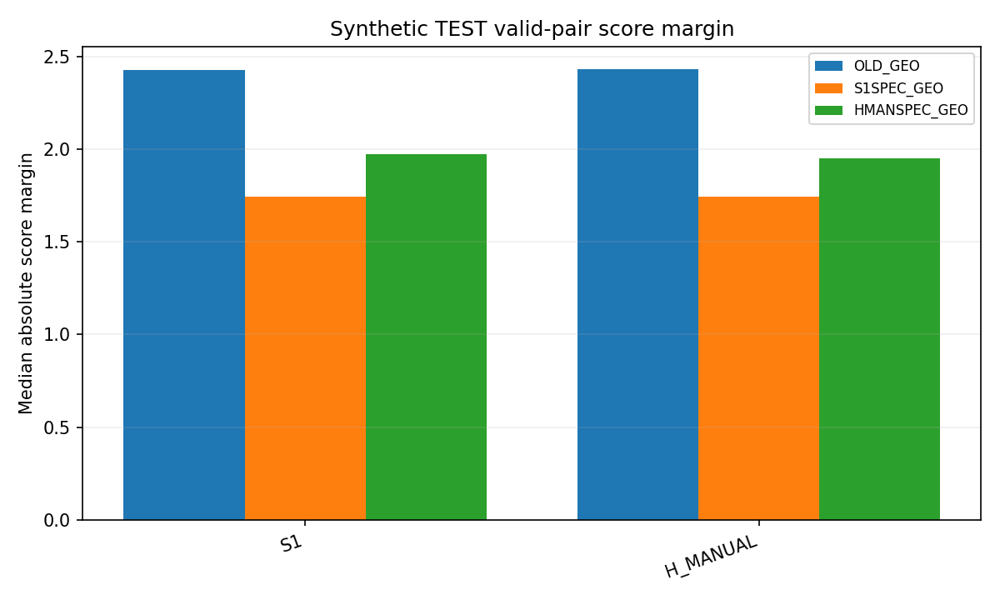

# Stage 2 — model-conditioned GEO_LINEAR

94개 특징, 공유 선형 scorer, 기존 optimizer/early-stop을 그대로 사용했다. 기존 old GEO는 S0/S1 pooled로 학습됐고 이번 두 selector는 각각 자기 모델의 합성 TRAIN만 사용했다.

TRAIN4096 / VAL1024 / TEST1024의 frame ID·renderer group·RGB·K·치수·정확한 parity labels 모두 기존 split 그대로다. GT parity는 두 모델 prediction/features lock 후 연결했다. 키포인트 optimizer step=0, 신규 selector fit=2.

| Model-selector | Correct / 1024 | Accuracy | Valid pairs | Brier(valid pairs) |
|---|---|---|---|---|
| S1_D9 | 929 | 0.907227 | 1024 | None |
| S1_OLD_GEO | 955 | 0.932617 | 1024 | 0.056838 |
| S1_S1SPEC_GEO | 940 | 0.917969 | 1024 | 0.072695 |
| S1_HMANSPEC_GEO | 944 | 0.921875 | 1024 | 0.067199 |
| H_MANUAL_D9 | 926 | 0.904297 | 1024 | None |
| H_MANUAL_OLD_GEO | 952 | 0.929688 | 1024 | 0.059083 |
| H_MANUAL_S1SPEC_GEO | 933 | 0.911133 | 1024 | 0.074788 |
| H_MANUAL_HMANSPEC_GEO | 936 | 0.914062 | 1024 | 0.069165 |

TEST는 이미 연구에 사용된 synthetic development-heldout이며 독립 증거가 아니다. TEST 후 재학습·조정하지 않는다. 점수 margin은 selector마다 척도가 달라 confidence의 직접 비교가 아니다. Feature shift는 고정 old TRAIN 표준편차로 정규화한 기술통계이며 특징 재선택에 쓰지 않았다.

