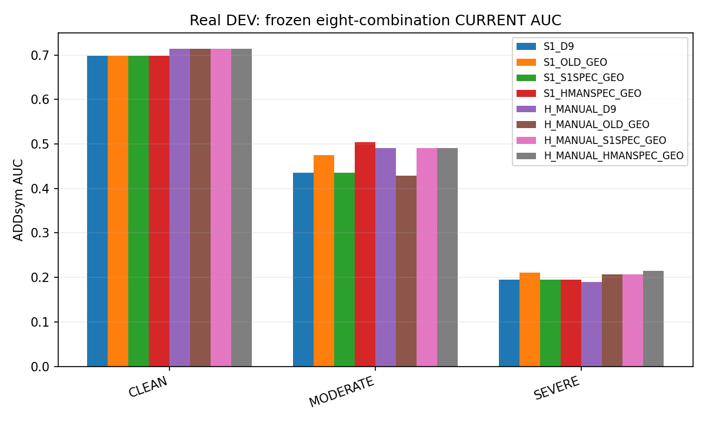
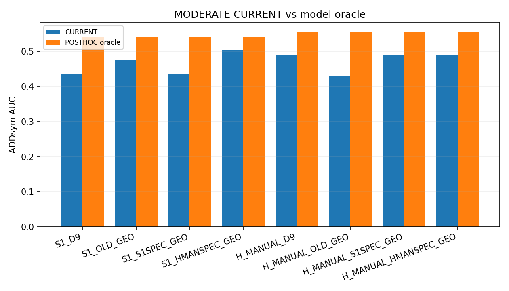
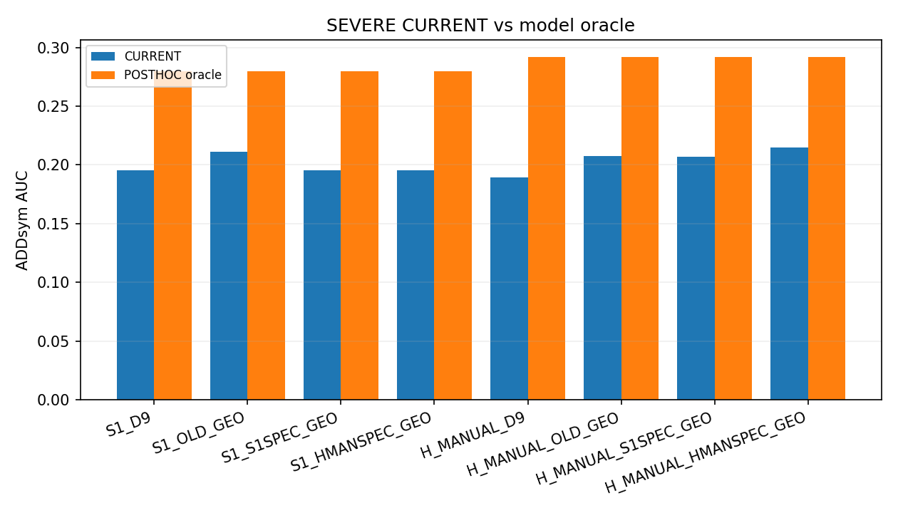
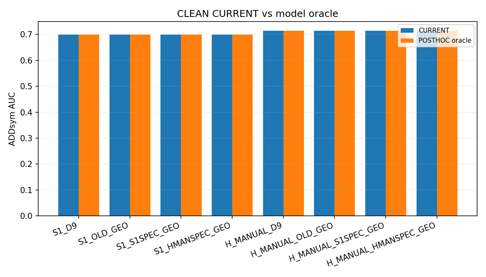
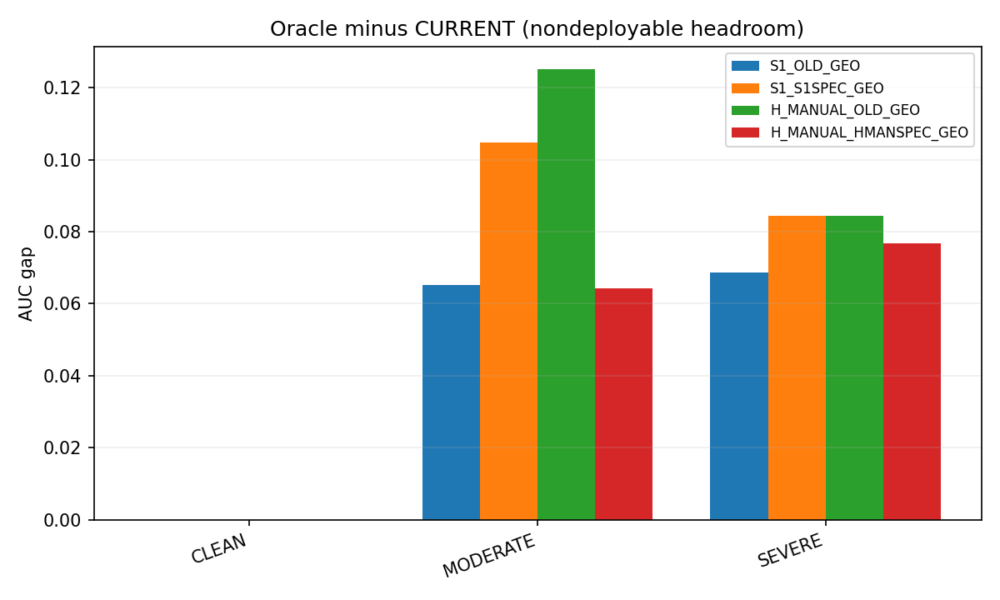
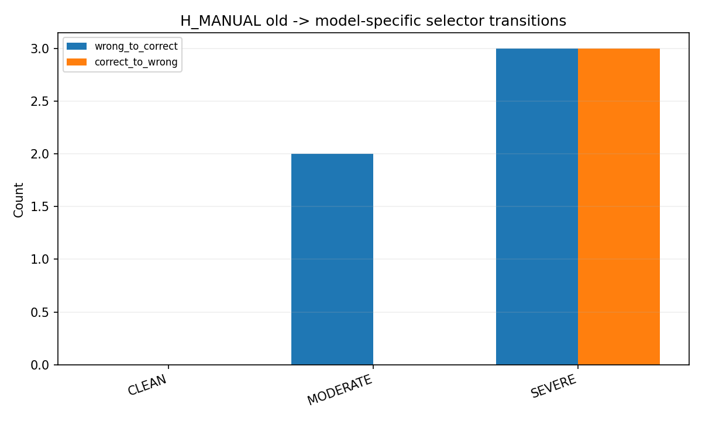
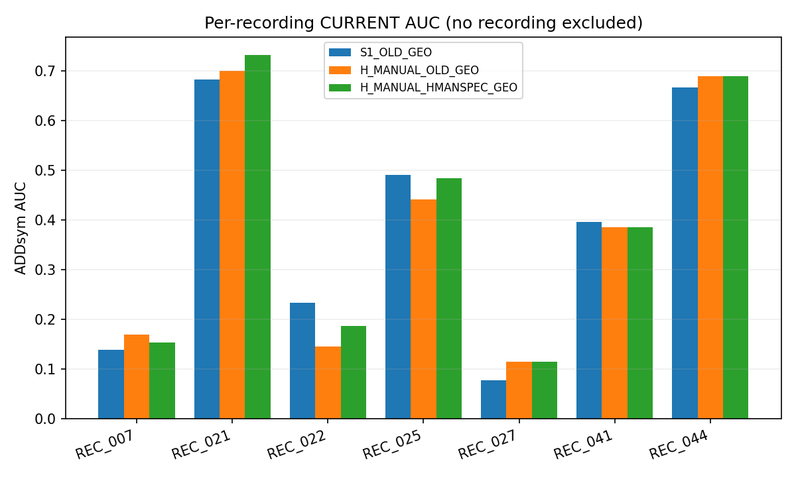
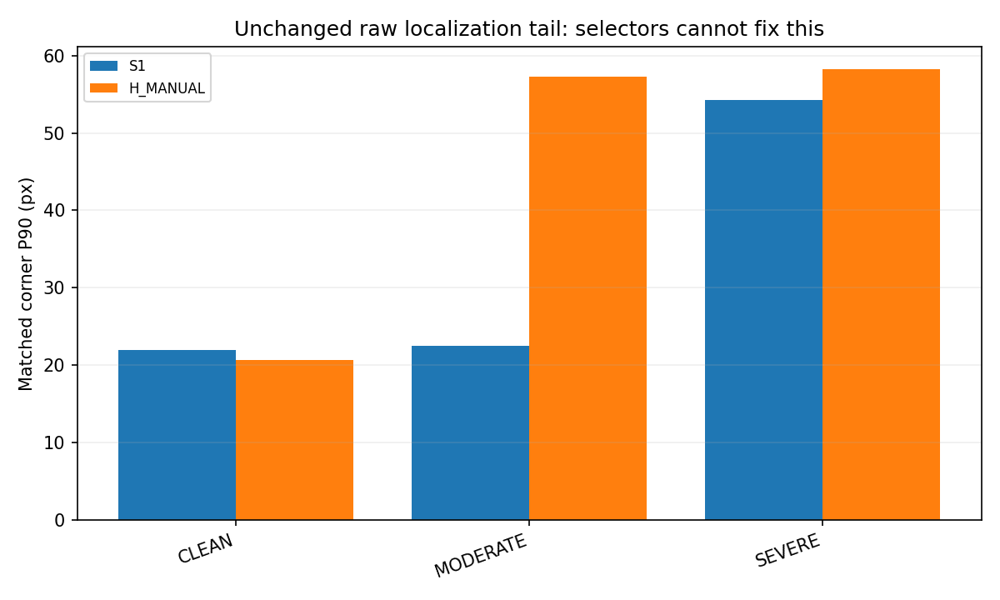
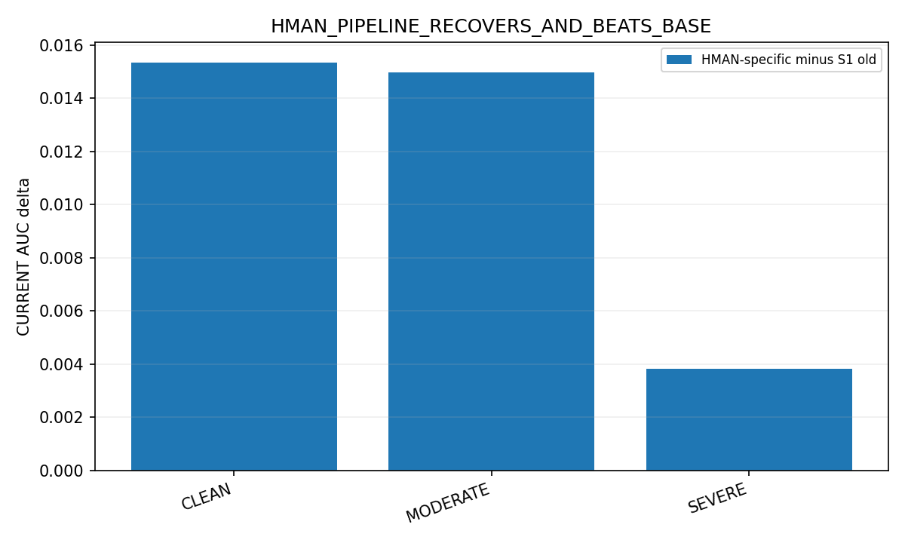

# Stage 3 — frozen real selector compatibility

MODEL_CONDITIONED_SELECTOR_RECOVERY

HMAN_PIPELINE_RECOVERS_AND_BEATS_BASE

모든 8개 조합 × 128장 = 1,024개 decision을 reference 읽기 전 고정했다. Stage1에서 이미 평가 reference를 열람했다는 사실은 숨기지 않으며, Stage3의 새 decision process는 GT 파일 접근을 차단했다.

## CLEAN

| Combination | CURRENT AUC | Axis correct | Coverage | Selection loss | Selector correct |
|---|---|---|---|---|---|
| S1_D9 | 0.698638 | 29 | 1.000000 | 0.000000 | 29 |
| S1_OLD_GEO | 0.698638 | 29 | 1.000000 | 0.000000 | 29 |
| S1_S1SPEC_GEO | 0.698638 | 29 | 1.000000 | 0.000000 | 29 |
| S1_HMANSPEC_GEO | 0.698638 | 29 | 1.000000 | 0.000000 | 29 |
| H_MANUAL_D9 | 0.713983 | 29 | 1.000000 | 0.000000 | 29 |
| H_MANUAL_OLD_GEO | 0.713983 | 29 | 1.000000 | 0.000000 | 29 |
| H_MANUAL_S1SPEC_GEO | 0.713983 | 29 | 1.000000 | 0.000000 | 29 |
| H_MANUAL_HMANSPEC_GEO | 0.713983 | 29 | 1.000000 | 0.000000 | 29 |

## MODERATE

| Combination | CURRENT AUC | Axis correct | Coverage | Selection loss | Selector correct |
|---|---|---|---|---|---|
| S1_D9 | 0.435690 | 16 | 1.000000 | 0.104905 | 17 |
| S1_OLD_GEO | 0.475333 | 17 | 1.000000 | 0.065262 | 18 |
| S1_S1SPEC_GEO | 0.435690 | 16 | 1.000000 | 0.104905 | 17 |
| S1_HMANSPEC_GEO | 0.503833 | 18 | 1.000000 | 0.036762 | 19 |
| H_MANUAL_D9 | 0.490286 | 16 | 1.000000 | 0.064262 | 18 |
| H_MANUAL_OLD_GEO | 0.429381 | 14 | 1.000000 | 0.125167 | 16 |
| H_MANUAL_S1SPEC_GEO | 0.490286 | 16 | 1.000000 | 0.064262 | 18 |
| H_MANUAL_HMANSPEC_GEO | 0.490286 | 16 | 1.000000 | 0.064262 | 18 |

## SEVERE

| Combination | CURRENT AUC | Axis correct | Coverage | Selection loss | Selector correct |
|---|---|---|---|---|---|
| S1_D9 | 0.195397 | 47 | 1.000000 | 0.084532 | 46 |
| S1_OLD_GEO | 0.211308 | 52 | 1.000000 | 0.068622 | 51 |
| S1_S1SPEC_GEO | 0.195397 | 46 | 1.000000 | 0.084532 | 51 |
| S1_HMANSPEC_GEO | 0.195397 | 46 | 1.000000 | 0.084532 | 51 |
| H_MANUAL_D9 | 0.189327 | 43 | 0.987179 | 0.102500 | 42 |
| H_MANUAL_OLD_GEO | 0.207365 | 48 | 0.987179 | 0.084462 | 47 |
| H_MANUAL_S1SPEC_GEO | 0.206647 | 45 | 0.987179 | 0.085179 | 46 |
| H_MANUAL_HMANSPEC_GEO | 0.215115 | 46 | 0.987179 | 0.076712 | 47 |

## ALL

| Combination | CURRENT AUC | Axis correct | Coverage | Selection loss | Selector correct |
|---|---|---|---|---|---|
| S1_D9 | 0.348836 | 92 | 1.000000 | 0.068723 | 92 |
| S1_OLD_GEO | 0.365035 | 98 | 1.000000 | 0.052523 | 98 |
| S1_S1SPEC_GEO | 0.348836 | 91 | 1.000000 | 0.068723 | 97 |
| S1_HMANSPEC_GEO | 0.360016 | 93 | 1.000000 | 0.057543 | 99 |
| H_MANUAL_D9 | 0.357570 | 88 | 0.992188 | 0.073004 | 89 |
| H_MANUAL_OLD_GEO | 0.358570 | 91 | 0.992188 | 0.072004 | 92 |
| H_MANUAL_S1SPEC_GEO | 0.368125 | 90 | 0.992188 | 0.062449 | 93 |
| H_MANUAL_HMANSPEC_GEO | 0.373285 | 91 | 0.992188 | 0.057289 | 94 |

## Localization tail (model-level, not changed by selector)

| Group | Model | PCK10 | PCK20 | Median px | P90 px | Gross20 | Missing |
|---|---|---|---|---|---|---|---|
| CLEAN | S1 | 0.589520 | 0.855895 | 7.699580 | 21.899077 | 0.144105 | 0 |
| CLEAN | H_MANUAL | 0.593886 | 0.882096 | 7.450267 | 20.601250 | 0.117904 | 0 |
| MODERATE | S1 | 0.558442 | 0.850649 | 9.348365 | 22.475564 | 0.149351 | 0 |
| MODERATE | H_MANUAL | 0.577922 | 0.785714 | 8.656158 | 57.343611 | 0.214286 | 0 |
| SEVERE | S1 | 0.435216 | 0.666113 | 11.253578 | 54.306000 | 0.333887 | 0 |
| SEVERE | H_MANUAL | 0.468439 | 0.677741 | 10.813537 | 58.265412 | 0.322259 | 1 |
| ALL | S1 | 0.490355 | 0.739086 | 9.829288 | 34.459277 | 0.260914 | 0 |
| ALL | H_MANUAL | 0.514721 | 0.742132 | 9.519979 | 46.053267 | 0.257868 | 1 |

아래 도표는 이미 열람한 recording-disjoint DEV이다. 6D reference는 독립 측정 GT가 아니라 기존 annotation/기하 기반이다. 후보 oracle은 GT-dependent/nondeployable. 난도·recording별 selector routing이나 TEST 후 재학습은 하지 않았다.

