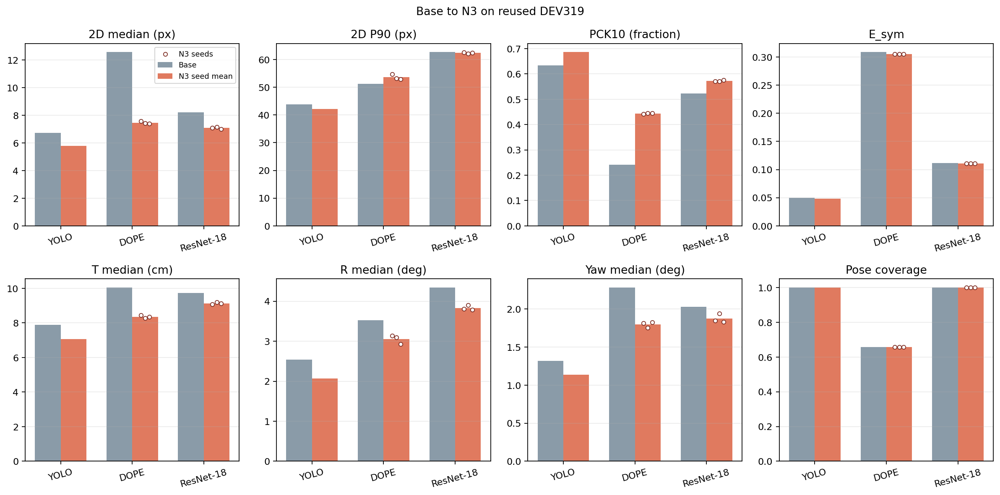
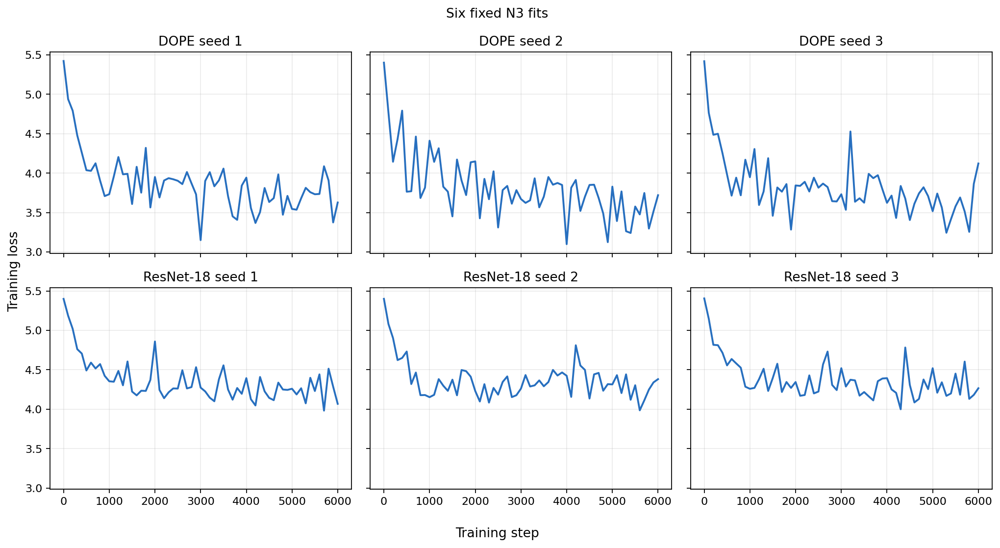
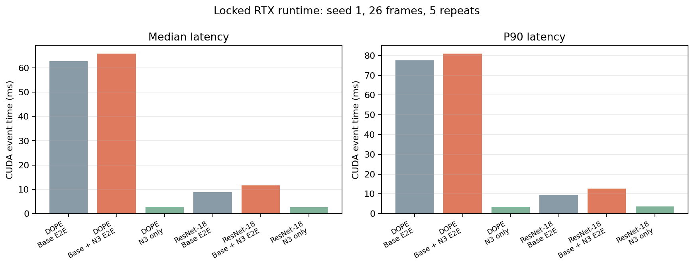
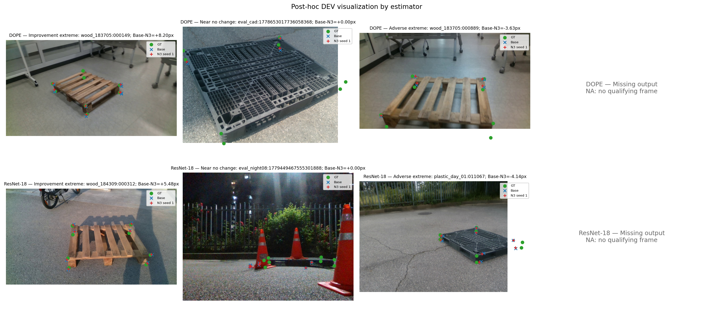
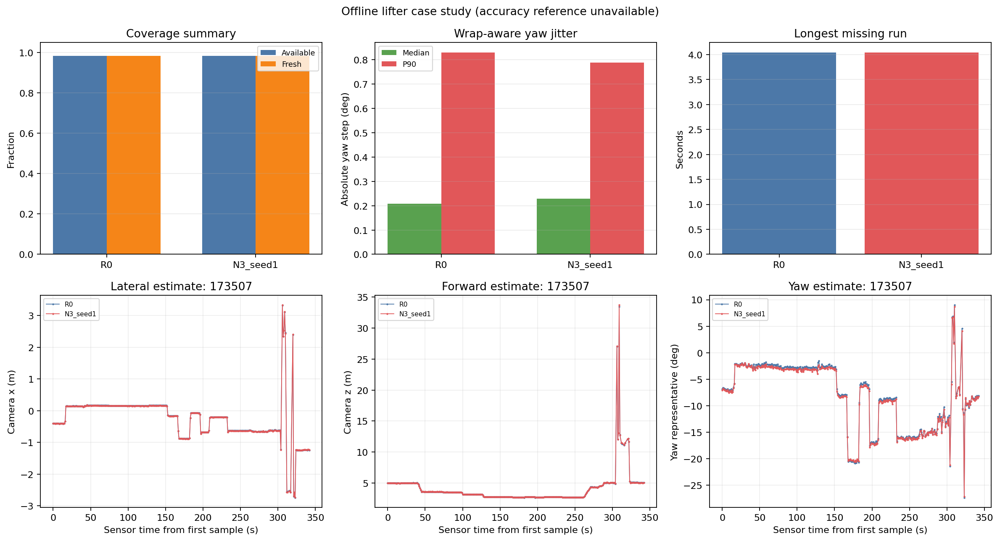
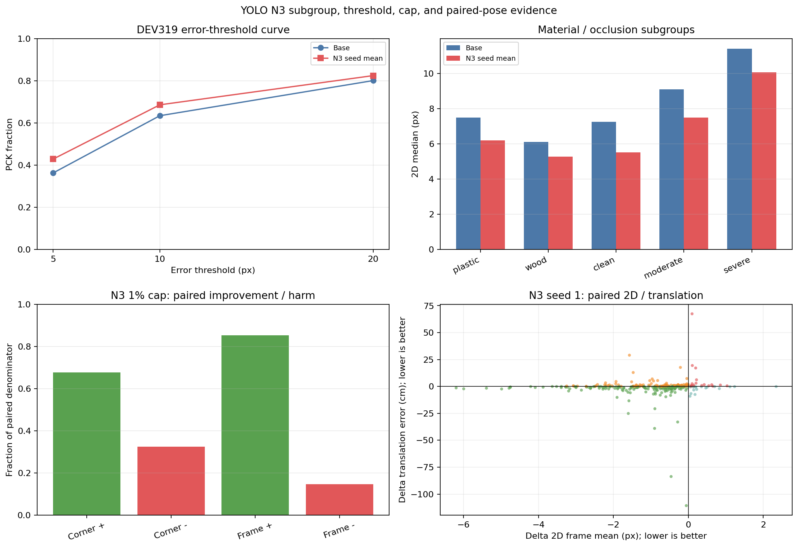

# Pallet N3 v3 실행 및 결과 보고서

## 판정

최종 과학적 판정은 **PARTIAL**이다. 계약상 실행 가능한 파이프라인의 상태는 **완료**이고, DOPE·ResNet-18 N3 학습 receipt는 6개 중 **6개**가 완료 상태다. 실행 완료와 주장 완결성은 다른 판정이다. DEV319의 일부 가림 라벨, estimator 사이의 공정한 공통 조건 집단, GREEN0918의 독립 6D 기준, 리프터의 독립 위치·yaw 기준, 독립 TEST가 없으므로 `OVERALL_COMPLETE`로 올리지 않는다. 없는 수치는 복사하거나 보간하지 않고 `x`, 정의되지 않는 값은 `NA`, 측정된 영은 숫자 `0`으로 보존했다.

이 보고서에서 허용되는 중심 주장은 **동일한 N3 설계와 학습 계약을 세 frozen estimator에 각각 적용했을 때 재사용 개발 집단에서 관측된 변화**다. 이는 estimator 사이에 같은 N3 가중치를 옮긴 실험도, 모든 backbone에 대한 보편적 robustness 증명도 아니다.

## 정확한 입력·감독 경계

- frozen base 입력: **RGB**
- backbone별 N3 입력: **frozen feature taps, frozen initial nine points, frozen selected box, registered physical dimensions [W,D,H]**
- N3 치수 특징: **log(W), log(D), log(H), log(W/D), log(H/sqrt(W*D))**
- 대칭 감독 출처: **approved whole-object permutations in bound sidecar**
- 대칭 branch 선택 기준: **raw frozen base predictions**
- N3 추론 금지 입력: **ground truth, visibility, symmetry branch label, camera pose, real-domain supervision**
- 보존 출력: **selected instance, box, score, point ordering, center8, missing-point mask**
- 학습 감독과 새 real 이미지 수: **synthetic only**, **0**

따라서 base는 RGB-only 함수로 고정되고, 물리 치수 `[W,D,H]`는 각 backbone 전용 N3 head의 학습과 추론에 들어간다. 대칭 감독은 raw frozen base 출력에 대해 승인된 whole-object permutation 하나를 고르는 학습 target이며, 추론에서는 GT·visibility·symmetry branch label을 입력하지 않는다. Base와 N3의 6D 평가는 같은 prediction-only PnP 계약으로 계산한다. 이 경계 때문에 결과를 “base 자체가 치수를 학습했다”거나 “추론에서 정답 대칭을 골랐다”고 설명하면 안 된다.

ResNet-18 기준 모델은 **10-epoch synthetic CONSTANT architecture-control arm; this is not the 60-epoch RGB baseline**이다. 구체적 제한은 “Uses the completed 10-epoch synthetic CONSTANT control, with its z=0 FiLM algebraically folded into an image-only RGB final convolution. It is explicitly not the collapsed 60-epoch RGB checkpoint and not a newly trained 60-epoch baseline.”이다. 즉 이 결과는 **10-epoch CONSTANT-fold RGB-only runtime base**에 대한 것이며, 60-epoch pure-RGB baseline 결과로 바꾸어 부를 수 없다.

Protocol 내부 adapter input에 남은 `checkpoint_selection="fixed final epoch60; no real-based threshold selection"` 문구는 이전 60-epoch 입력 명세의 잔재다. 이번 실행의 authoritative source는 `data/pallet/results/pallet_resnet18_dimension_20261002_v1/DSNT_FULL_CONSTANT_epoch10.pt`와 SHA `a94e55f028b704057c77fd045d96dd2dbb2ae6be2a49e945b23c821a30d8e1c4`로 고정된 **epoch10 CONSTANT checkpoint**다. 보고서와 표는 nested epoch60 문구를 실제 학습 근거로 사용하지 않는다.

### 실제 대칭 target 활성화

### Actual whole-object symmetry target activation

| Backbone | Usable source rows | Non-identity rows | Non-identity fraction | Seed1 exposures | Seed1 non-identity | Seed2 exposures | Seed2 non-identity | Seed3 exposures | Seed3 non-identity |
|---|---|---|---|---|---|---|---|---|---|
| DOPE | 44063 | 134 | 0.003041 | 96000 | 290 | 96000 | 290 | 96000 | 289 |
| ResNet-18 | 55806 | 0 | 0 | 96000 | 0 | 96000 | 0 | 96000 | 0 |

_Note: The objective is wired for both backbones, but target-branch activation is empirical. Zero means measured zero, not x._

동일한 symmetry-aware objective는 두 backbone에 연결되었지만 실제 target branch 활성은 달랐다. sidecar의 valid permutation 수는 1개인 row **20281개**, 2개인 row **39719개**, 4개인 row **0개**다. 따라서 ResNet-18에서 non-identity target이 활성화되었다거나, 네 방향 C4 target으로 학습해 GREEN 정사각형에 전이했다고 주장할 수 없다. 허용되는 표현은 “같은 whole-object 대칭 선택 목적함수를 적용했다”이며 실제 non-identity 사용 빈도는 위 표와 함께 보고한다.

### 실제 치수 경로 민감도

### Trained N3 dimension-path sensitivity with fixed visual evidence

| Backbone | Seed | Audit | Visual inputs identical | Base logits identical | Changed logits | Max absolute delta | Checkpoint SHA-256 |
|---|---|---|---|---|---|---|---|
| DOPE | 1 | PASS | true | true | 1776 | 6.182 | e856aa58ab6dd15d… |
| DOPE | 2 | PASS | true | true | 1776 | 9.929 | df4e4d98cc98fe80… |
| DOPE | 3 | PASS | true | true | 1776 | 12.85 | 8b407a0161167033… |
| ResNet-18 | 1 | PASS | true | true | 1776 | 8.358 | 114fc574943868a5… |
| ResNet-18 | 2 | PASS | true | true | 1776 | 7.872 | 23359f6550f1cc4a… |
| ResNet-18 | 3 | PASS | true | true | 1776 | 5.559 | e2ad85b9397c5beb… |

_Note: Only registered W,D,H changes. This proves the trained metadata path is active, not the causal accuracy gain of dimensions._

visual tensors·initial points·box·validity·base logits를 고정하고 `[W,D,H]`만 바꾼 감사에서 PASS한 head는 **6개**, 변한 logit은 총 **10656개**다. 이는 학습된 여섯 head의 치수 경로가 실제로 활성이라는 근거다. 정확도 향상 중 얼마가 치수만의 인과 효과인지는 증명하지 않으며, 그 분리는 YOLO N0/N1/N2/N3 통제 표에 한정한다.

## 재사용 DEV319 결과

YOLO: **conditional 2D median 6.721→5.778 px, conditional P90 43.890→42.134 px, PCK10 63.425→68.587%, E_sym 0.050→0.048, full-penalty P90 61.710→61.715 px, T 7.897→7.068 cm, R 2.539→2.070°, yaw 1.316→1.134°**  
DOPE: **conditional 2D median 12.570→7.469 px, conditional P90 51.282→53.570 px, PCK10 24.170→44.338%, E_sym 0.309→0.305, full-penalty P90 800.000→800.000 px, T 10.046→8.356 cm, R 3.530→3.051°, yaw 2.281→1.798°**  
ResNet-18: **conditional 2D median 8.223→7.085 px, conditional P90 62.638→62.371 px, PCK10 52.261→57.223%, E_sym 0.112→0.111, full-penalty P90 248.418→249.615 px, T 9.739→9.134 cm, R 4.342→3.832°, yaw 2.031→1.874°**

YOLO 관측 방향은 **개선 방향: 2D median, 2D P90, PCK10, T median, R median, yaw median; 악화 방향: penalty P90**다. DOPE는 **개선 방향: 2D median, PCK10, T median, R median, yaw median; 동일: penalty P90; 악화 방향: 2D P90**, ResNet-18은 **개선 방향: 2D median, 2D P90, PCK10, T median, R median, yaw median; 악화 방향: penalty P90**다. 이 문장은 지표별 방향을 그대로 열거하며, 일부 지표 개선을 T·R·yaw의 안정적 동시 개선으로 확대하지 않는다.

위 N3 값은 seed 1·2·3의 **통계 산술평균**이며 예측 앙상블이 아니다. DOPE와 YOLO는 decoding, score, box와 조건부 matched 집단이 동등하지 않으므로 절대 backbone 정확도 순위를 만들 수 없다. 세 estimator에서 각각 학습한 N3의 적용 결과를 비교할 수 있을 뿐이다. 모든 정확도 수치는 **REUSED_DEV** 근거이고 독립 TEST 일반화를 뜻하지 않는다.

DEV pose reference는 “DEV pose reconstructed from image annotation and registered geometry; not independent physical 6D measurement”다. 따라서 DEV의 T/R/yaw는 고정 evaluator 안의 비교 근거이지만 독립 물리 계측 6D 정확도로 부를 수 없다.

### Reused DEV319: base to N3

| Backbone | Method | Seeds | 2D median (px) | 2D P90 (px) | PCK10 (fraction) | E_sym | T median (cm) | R median (deg) | Yaw median (deg) | Pose coverage | PCK5 (fraction) | PCK20 (fraction) | Penalty P90 (px) | T P90 (cm) | R P90 (deg) | Yaw P90 (deg) | IoU3D median | ADDsym AUC | Frames | Matched frames | GT corners | Observed corners | Pose frames |
|---|---|---|---|---|---|---|---|---|---|---|---|---|---|---|---|---|---|---|---|---|---|---|---|
| YOLO | Base | 1 | 6.721 | 43.89 | 0.6343 | 0.04952 | 7.897 | 2.539 | 1.316 | 1 | 0.3629 | 0.8007 | 61.71 | 40.53 | 86.53 | 86.24 | 0.5943 | 0.3766 | 319 | 311 | 2499 | 2445 | 319 |
| YOLO | N3 seed mean | 3 | 5.778 | 42.13 | 0.6859 | 0.04842 | 7.068 | 2.07 | 1.134 | 1 | 0.4287 | 0.8243 | 61.72 | 37.81 | 85.92 | 85.67 | 0.6309 | 0.4122 | 319 | 311 | 2499 | 2445 | 319 |
| DOPE | Base | 1 | 12.57 | 51.28 | 0.2417 | 0.3087 | 10.05 | 3.53 | 2.281 | 0.6583 | 0.05202 | 0.537 | 800 | 68.34 | 80.58 | 80.37 | 0.433 | 0.1818 | 319 | 233 | 2499 | 1797 | 210 |
| DOPE | N3 seed mean | 3 | 7.469 | 53.57 | 0.4434 | 0.3055 | 8.356 | 3.051 | 1.798 | 0.6583 | 0.2264 | 0.5805 | 800 | 63.6 | 82.17 | 82.01 | 0.5728 | 0.2332 | 319 | 233 | 2499 | 1797 | 210 |
| ResNet-18 | Base | 1 | 8.223 | 62.64 | 0.5226 | 0.1119 | 9.739 | 4.342 | 2.031 | 1 | 0.2809 | 0.7035 | 248.4 | 97.54 | 87.41 | 87.08 | 0.5243 | 0.334 | 319 | 292 | 2499 | 2291 | 319 |
| ResNet-18 | N3 seed mean | 3 | 7.085 | 62.37 | 0.5722 | 0.111 | 9.134 | 3.832 | 1.874 | 1 | 0.3415 | 0.7159 | 249.6 | 100.3 | 87.47 | 87.22 | 0.5511 | 0.357 | 319 | 292 | 2499 | 2291 | 319 |

_Note: N3 is the arithmetic mean of seed-level statistics, not an ensemble. Absolute backbone ranking is not valid because conditional match sets differ._

### DOPE·ResNet-18 seed별 결과

### DOPE / ResNet-18 DEV319 per-seed results

| Backbone | Method | Seed | 2D median (px) | 2D P90 (px) | PCK10 (fraction) | E_sym | T median (cm) | R median (deg) | Yaw median (deg) | Pose coverage | PCK5 (fraction) | PCK20 (fraction) | Penalty P90 (px) | T P90 (cm) | R P90 (deg) | Yaw P90 (deg) | IoU3D median | ADDsym AUC | Frames | Matched frames | GT corners | Observed corners | Pose frames |
|---|---|---|---|---|---|---|---|---|---|---|---|---|---|---|---|---|---|---|---|---|---|---|---|
| DOPE | Base | base | 12.57 | 51.28 | 0.2417 | 0.3087 | 10.05 | 3.53 | 2.281 | 0.6583 | 0.05202 | 0.537 | 800 | 68.34 | 80.58 | 80.37 | 0.433 | 0.1818 | 319 | 233 | 2499 | 1797 | 210 |
| DOPE | N3 | 1 | 7.57 | 54.68 | 0.4414 | 0.3055 | 8.447 | 3.136 | 1.815 | 0.6583 | 0.2205 | 0.5794 | 800 | 64.52 | 82.66 | 82.57 | 0.5793 | 0.2327 | 319 | 233 | 2499 | 1797 | 210 |
| DOPE | N3 | 2 | 7.43 | 53.13 | 0.4442 | 0.3055 | 8.273 | 3.091 | 1.753 | 0.6583 | 0.2289 | 0.5798 | 800 | 62.51 | 82.7 | 82.6 | 0.5763 | 0.2335 | 319 | 233 | 2499 | 1797 | 210 |
| DOPE | N3 | 3 | 7.408 | 52.9 | 0.4446 | 0.3054 | 8.348 | 2.925 | 1.826 | 0.6583 | 0.2297 | 0.5822 | 800 | 63.77 | 81.16 | 80.86 | 0.5627 | 0.2335 | 319 | 233 | 2499 | 1797 | 210 |
| ResNet-18 | Base | base | 8.223 | 62.64 | 0.5226 | 0.1119 | 9.739 | 4.342 | 2.031 | 1 | 0.2809 | 0.7035 | 248.4 | 97.54 | 87.41 | 87.08 | 0.5243 | 0.334 | 319 | 292 | 2499 | 2291 | 319 |
| ResNet-18 | N3 | 1 | 7.091 | 62.57 | 0.5714 | 0.1111 | 9.069 | 3.807 | 1.847 | 1 | 0.3385 | 0.7143 | 248.5 | 99.64 | 87.52 | 87.2 | 0.5463 | 0.3545 | 319 | 292 | 2499 | 2291 | 319 |
| ResNet-18 | N3 | 2 | 7.15 | 62.14 | 0.5702 | 0.1111 | 9.21 | 3.905 | 1.943 | 1 | 0.3401 | 0.7147 | 250.4 | 101 | 87.5 | 87.25 | 0.546 | 0.3542 | 319 | 292 | 2499 | 2291 | 319 |
| ResNet-18 | N3 | 3 | 7.013 | 62.4 | 0.575 | 0.1109 | 9.124 | 3.784 | 1.833 | 1 | 0.3457 | 0.7187 | 250 | 100.3 | 87.39 | 87.21 | 0.561 | 0.3625 | 319 | 292 | 2499 | 2291 | 319 |

_Note: Base is listed once per backbone; N3 seeds are independent fits, never an ensemble._

### Paired session-bootstrap

### DOPE / ResNet-18 paired session-bootstrap deltas (N3 - Base)

| Backbone | Seed | Sessions | Resamples | Bootstrap seed | Median delta (px) | Median delta CI95 | P90 delta (px) | P90 delta CI95 | PCK10 delta (pp) | PCK10 delta CI95 | E_sym delta | E_sym delta CI95 |
|---|---|---|---|---|---|---|---|---|---|---|---|---|
| DOPE | 1 | 13 | 10000 | 20260917 | -5.001 | [-5.757671329468234, -4.182964723586372] | 3.396 | [-4.919370293025964, 3.8796703969038373] | 19.97 | [14.713382986773704, 24.92485275951693] | -0.003172 | [-0.003999700017957903, -0.0022883241894971255] |
| DOPE | 2 | 13 | 10000 | 20260917 | -5.141 | [-5.851155357795893, -4.323854280435686] | 1.853 | [-4.895927055560795, 3.5289968840256365] | 20.25 | [14.88514896940402, 25.176865951844697] | -0.003259 | [-0.004093931310762836, -0.0023872803366903495] |
| DOPE | 3 | 13 | 10000 | 20260917 | -5.162 | [-5.880822706213129, -4.379267022178284] | 1.617 | [-5.100279963685492, 3.176501274775134] | 20.29 | [14.944922547332187, 25.220478838533516] | -0.00327 | [-0.004079162665569764, -0.002424515297666165] |
| ResNet-18 | 1 | 13 | 10000 | 20260917 | -1.132 | [-1.9303893974149928, -0.8588222685627179] | -0.06386 | [-1.5274039726509472, 2.4060589827604844] | 4.882 | [2.9464872648886695, 7.27969889208895] | -0.000766 | [-0.0010950696562846188, -0.0005126815539911824] |
| ResNet-18 | 2 | 13 | 10000 | 20260917 | -1.073 | [-1.8352235134497914, -0.8310054589689057] | -0.4976 | [-1.6673465275657813, 2.142042623892928] | 4.762 | [3.207940413839374, 6.656945699180095] | -0.0007757 | [-0.0010690162354426093, -0.0005277469758786492] |
| ResNet-18 | 3 | 13 | 10000 | 20260917 | -1.209 | [-2.0872646173880507, -0.9848026681010191] | -0.2413 | [-2.0427715455314446, 2.0086973974254896] | 5.242 | [3.406744053935282, 7.396158055615054] | -0.0009307 | [-0.0012809502195610654, -0.0006541894909101072] |

_Note: 10,000 whole-session paired resamples, seed 20260917. Negative is favorable except PCK10, where positive is favorable; no multiplicity adjustment._

CI는 각 seed를 base와 같은 frame/session으로 묶어 session 단위 10,000회 재표집한 기술 통계다. CI가 0을 가로지르는 지표는 방향이 고정되었다고 주장하지 않는다. 다중비교 보정은 하지 않았고, 표의 분모와 conditional/full-population 정의를 함께 읽어야 한다.

## 학습 및 선택

학습 곡선은 `complete=true`, `smoke=false`, step6000 완료 receipt가 있는 fit만 그렸다. 각 fit은 별도 seed와 backbone 전용 head이고, base에는 치수를 넣지 않는다. 온도와 1% 이동 cap은 synthetic calibration에서 고정했으며 실제 DEV 성능, runtime, 그림 사례, lifter 결과를 선택에 쓰지 않았다.

### Six N3 fits

| Backbone | Seed | Status | Steps | Exposures | Elapsed (s) | Trainable params | Dimensions to N3 | Symmetry supervision | Dimensions to base | Checkpoint SHA-256 |
|---|---|---|---|---|---|---|---|---|---|---|
| DOPE | 1 | COMPLETE | 6000 | 96000 | 1115 | 23331 | true | true | false | e856aa58ab6dd15d… |
| DOPE | 2 | COMPLETE | 6000 | 96000 | 1117 | 23331 | true | true | false | df4e4d98cc98fe80… |
| DOPE | 3 | COMPLETE | 6000 | 96000 | 1110 | 23331 | true | true | false | 8b407a0161167033… |
| ResNet-18 | 1 | COMPLETE | 6000 | 96000 | 532.4 | 23331 | true | true | false | 114fc574943868a5… |
| ResNet-18 | 2 | COMPLETE | 6000 | 96000 | 533.9 | 23331 | true | true | false | 23359f6550f1cc4a… |
| ResNet-18 | 3 | COMPLETE | 6000 | 96000 | 532.8 | 23331 | true | true | false | e2ad85b9397c5beb… |

### Synthetic-only fixed selection

| Backbone | Seed | Temperature | Lambda | Image-diagonal cap | Real outcome used |
|---|---|---|---|---|---|
| DOPE | 1 | 1 | 1 | 0.01 | false |
| DOPE | 2 | 1 | 1 | 0.01 | false |
| DOPE | 3 | 1 | 1 | 0.01 | false |
| ResNet-18 | 1 | 1 | 1 | 0.01 | false |
| ResNet-18 | 2 | 1 | 1 | 0.01 | false |
| ResNet-18 | 3 | 1 | 1 | 0.01 | false |

_Note: Temperature is fixed on synthetic calibration; real outcome used must be false._

## B: YOLO N0/N1/N2/N3 통제 실험

### YOLO controlled N0/N1/N2/N3 ablation

| Method | Dimensions | Symmetry supervision | 2D median (px) | 2D P90 (px) | PCK10 (fraction) | E_sym | T median (cm) | R median (deg) | Yaw median (deg) | Pose coverage | PCK5 (fraction) | PCK20 (fraction) | Penalty P90 (px) | T P90 (cm) | R P90 (deg) | Yaw P90 (deg) | IoU3D median | ADDsym AUC | Frames | Matched frames | GT corners | Observed corners | Pose frames |
|---|---|---|---|---|---|---|---|---|---|---|---|---|---|---|---|---|---|---|---|---|---|---|---|
| N0: replay local refiner | false | false | 5.944 | 42.87 | 0.6753 | 0.04868 | x | x | x | x | 0.4162 | 0.8178 | 61.71 | x | x | x | x | x | 319 | 311 | 2499 | 2445 | x |
| N1: symmetry only | false | true | 5.921 | 42.51 | 0.6756 | 0.04867 | x | x | x | x | 0.4182 | 0.8157 | 61.6 | x | x | x | x | x | 319 | 311 | 2499 | 2445 | x |
| N2: dimensions only | true | false | 5.778 | 42.46 | 0.6859 | 0.04842 | 7.011 | 2.09 | 1.142 | 1 | 0.4299 | 0.8238 | 61.91 | 38.11 | 85.82 | 85.61 | 0.6335 | 0.4126 | 319 | 311 | 2499 | 2445 | 319 |
| N3: dimensions + symmetry | true | true | 5.778 | 42.13 | 0.6859 | 0.04842 | 7.068 | 2.07 | 1.134 | 1 | 0.4287 | 0.8243 | 61.72 | 37.81 | 85.92 | 85.67 | 0.6309 | 0.4122 | 319 | 311 | 2499 | 2445 | 319 |

_Note: N0/N1/N2/N3 use the locked eight-corner evaluator. Differences must be read metric by metric; tiny decimal changes are not a universal gain._

### YOLO controlled ablation contrasts

| Contrast | Role | Median delta (px) | P90 delta (px) | PCK10 delta (pp) | E_sym delta |
|---|---|---|---|---|---|
| N2 - N0 | dimension contribution under fixed supervision | -0.1662 | -0.4128 | 1.054 | -0.0002611 |
| N1 - N0 | symmetry-only contribution | -0.02285 | -0.3589 | 0.02668 | -9.408e-06 |
| N3 - N2 | increment from symmetry with dimensions | 0.0004884 | -0.3257 | 0 | -2.794e-06 |
| N3 - N1 | increment from dimensions with symmetry | -0.1429 | -0.3797 | 1.027 | -0.0002545 |

_Note: Each value is the first named method minus the second. Negative is favorable for error metrics and positive is favorable for PCK10._

N3−N2는 median +0.000488 px, P90 -0.325728 px, PCK10 +0.000000 pp, E_sym -0.000002794였다. 따라서 대칭 감독의 추가 효과는 지표별로 작고 혼합되어 있으며, 필수적이거나 보편적인 향상이라고 해석하지 않는다. 이 인과 분해는 YOLO의 고정 계약 안에서만 성립한다. DOPE와 ResNet-18에는 base 대 N3만 있으므로 그 두 estimator의 변화에서 치수 입력 효과와 대칭 감독 효과를 따로 식별할 수 없다.

## E: cap, 손상·회복, 2D–pose 대응

### YOLO cap, damage, and recovery audit (seed-statistic mean)

| Method | Output cap | 2D median (px) | 2D P90 (px) | PCK10 | Initial inside cap | Initial outside cap | Cap hits | Corners improved | Corners unchanged | Corners worsened | Frames improved | Frames unchanged | Frames worsened | <5 to >10 px | >20 to <10 px | Move median (px) | Move P90 (px) | Cap violations | Bound violations | Comparable frames | Comparable corners |
|---|---|---|---|---|---|---|---|---|---|---|---|---|---|---|---|---|---|---|---|---|---|
| N2 | 1% | 5.778 | 42.46 | 0.6859 | 1464 | 981 | 67.67 | 1660 | 0 | 785.3 | 268.3 | 0 | 42.67 | 0 | 0.3333 | 1.839 | 5.873 | 0 | 0 | 311 | 2445 |
| N2 | 2% | 5.76 | 42.71 | 0.6892 | 1957 | 488 | 1 | 1659 | 0 | 786.3 | 267.7 | 0 | 43.33 | 0 | 3.667 | 1.839 | 5.873 | 0 | 0 | 311 | 2445 |
| N2 | none | 5.76 | 42.71 | 0.6892 | NA | NA | NA | 1659 | 0 | 786.3 | 267.7 | 0 | 43.33 | 0 | 3.667 | 1.839 | 5.873 | 0 | 0 | 311 | 2445 |
| N3 | 1% | 5.778 | 42.13 | 0.6859 | 1464 | 981 | 64 | 1653 | 0 | 792 | 265.3 | 0 | 45.67 | 0.3333 | 0.6667 | 1.817 | 5.871 | 0 | 0 | 311 | 2445 |
| N3 | 2% | 5.762 | 42.62 | 0.6885 | 1957 | 488 | 2 | 1652 | 0 | 793 | 264.7 | 0 | 46.33 | 0.3333 | 3 | 1.817 | 5.871 | 0 | 0 | 311 | 2445 |
| N3 | none | 5.762 | 42.62 | 0.6885 | NA | NA | NA | 1652 | 0 | 793 | 264.7 | 0 | 46.33 | 0.3333 | 3 | 1.817 | 5.871 | 0 | 0 | 311 | 2445 |

_Note: Counts are arithmetic means of three seed-level counts and may therefore be fractional. The fixed base symmetry branch is retained for damage/recovery diagnosis._

`none` 행에서 cap inside/outside/hit은 정의되지 않아 `NA`이고, 손상·회복 count의 숫자 0과 구분한다. 1%와 2%는 frozen base가 고른 whole-object branch에 고정해 움직임으로 생긴 개선과 악화를 함께 센 결과다.

### YOLO paired 2D-to-pose direction audit at the locked 1% cap

| Method | Seed | Paired frames | 2D improved | 2D worsened | T median delta (cm) | T improved | T unchanged | T worsened | R median delta (deg) | R improved | R unchanged | R worsened | Yaw median delta (deg) | Yaw improved | Yaw unchanged | Yaw worsened | 2D+ / T+ | 2D+ / T- | 2D- / T+ | 2D- / T- | New pose failures | Pose recoveries |
|---|---|---|---|---|---|---|---|---|---|---|---|---|---|---|---|---|---|---|---|---|---|---|
| N2 | 1 | 311 | 274 | 37 | -0.2806 | 191 | 0 | 120 | -0.1409 | 202 | 0 | 109 | -0.02705 | 167 | 0 | 144 | 171 | 103 | 20 | 17 | 0 | 0 |
| N2 | 2 | 311 | 261 | 50 | -0.3756 | 203 | 0 | 108 | -0.1561 | 208 | 0 | 103 | -0.04935 | 172 | 0 | 139 | 182 | 79 | 21 | 29 | 0 | 0 |
| N2 | 3 | 311 | 270 | 41 | -0.2293 | 181 | 0 | 130 | -0.1854 | 212 | 0 | 99 | -0.05257 | 174 | 0 | 137 | 165 | 105 | 16 | 25 | 0 | 0 |
| N3 | 1 | 311 | 273 | 38 | -0.2751 | 195 | 0 | 116 | -0.157 | 205 | 0 | 106 | -0.03634 | 167 | 0 | 144 | 175 | 98 | 20 | 18 | 0 | 0 |
| N3 | 2 | 311 | 258 | 53 | -0.3694 | 200 | 0 | 111 | -0.1565 | 209 | 0 | 102 | -0.02512 | 171 | 0 | 140 | 180 | 78 | 20 | 33 | 0 | 0 |
| N3 | 3 | 311 | 265 | 46 | -0.2722 | 186 | 0 | 125 | -0.1656 | 209 | 0 | 102 | -0.05627 | 170 | 0 | 141 | 165 | 100 | 21 | 25 | 0 | 0 |

_Note: Deltas are candidate minus base; negative T/R/yaw deltas are favorable. These are paired descriptive counts, separate from session-bootstrap corner CIs._

2D frame 오차 감소는 T·R·yaw 동시 감소를 뜻하지 않는다. 위 표는 각 seed의 개선·무차이·악화, 새 pose 실패, pose 회복, 2D/T 방향 조합을 모두 남긴다. 따라서 이 자료로 허용되는 주장은 “작은 보정이 관측된 2D 오차를 줄인 사례와 속도·손상 trade-off가 있다”이며, 모든 frame의 6D가 함께 좋아졌다는 주장은 허용되지 않는다.

## H: 기존 보정기와의 비교

### YOLO whole-package comparator audit

| Method | Role | Seeds | 2D median (px) | 2D P90 (px) | PCK10 (fraction) | E_sym | T median (cm) | R median (deg) | Yaw median (deg) | Pose coverage | PCK5 (fraction) | PCK20 (fraction) | Penalty P90 (px) | T P90 (cm) | R P90 (deg) | Yaw P90 (deg) | IoU3D median | ADDsym AUC | Frames | Matched frames | GT corners | Observed corners | Pose frames |
|---|---|---|---|---|---|---|---|---|---|---|---|---|---|---|---|---|---|---|---|---|---|---|---|
| R0: no refiner | initial estimate | 1 | 6.721 | 43.89 | 0.6343 | 0.04952 | 7.897 | 2.539 | 1.316 | 1 | 0.3629 | 0.8007 | 61.71 | 40.53 | 86.53 | 86.24 | 0.5943 | 0.3766 | 319 | 311 | 2499 | 2445 | 319 |
| P: local distribution | dimension-free refiner | 3 | 5.938 | 42.63 | 0.6749 | 0.04868 | 7.153 | 2.154 | 1.151 | 1 | 0.4175 | 0.8181 | 61.64 | 38.66 | 85.99 | 85.82 | 0.6367 | 0.408 | 319 | 311 | 2499 | 2445 | 319 |
| D: direct regression | output/loss package | 3 | 6.504 | 42.99 | 0.6437 | 0.04921 | 7.597 | 2.274 | 1.206 | 1 | 0.3828 | 0.8111 | 61.62 | 41.36 | 86.05 | 85.78 | 0.6168 | 0.392 | 319 | 311 | 2499 | 2445 | 319 |
| L: line structure | structure package | 3 | 6.146 | 42.98 | 0.6687 | 0.04887 | 7.548 | 2.233 | 1.175 | 1 | 0.4071 | 0.8139 | 60.55 | 38.38 | 86.23 | 85.86 | 0.6282 | 0.402 | 319 | 311 | 2499 | 2445 | 319 |
| PoseFix-style | image-pose refiner package | 3 | 5.561 | 43.91 | 0.6871 | 0.0483 | 6.951 | 2.028 | 1.047 | 1 | 0.4452 | 0.8193 | 61.13 | 41.68 | 85.99 | 85.6 | 0.6232 | 0.4214 | 319 | 311 | 2499 | 2445 | 319 |
| N3: dimensions + symmetry | proposed package | 3 | 5.778 | 42.13 | 0.6859 | 0.04842 | 7.068 | 2.07 | 1.134 | 1 | 0.4287 | 0.8243 | 61.72 | 37.81 | 85.92 | 85.67 | 0.6309 | 0.4122 | 319 | 311 | 2499 | 2445 | 319 |

_Note: D/L/PoseFix and N3 differ in inputs, output parameterization, loss, or training budget. This is a whole-package comparison, not a single-factor causal ablation._

D, L, PoseFix-style, P, N3는 입력, 출력 parameterization, loss 또는 학습 budget이 다른 **whole-package 비교**다. 이 표는 상대 결과를 보여 주지만 어느 한 구성요소의 단일 요인 인과 효과를 증명하지 않는다.

## I: update 대안과 self-training 경계

### Update alternatives: safe HELDOUT128 and blocked DEV319 rows

| Population | Method | Evidence role | Student RGB overlap | Teacher session overlap | Independent TEST | Selection history | 2D median (px) | 2D P90 (px) | PCK10 (fraction) | E_sym | T median (cm) | R median (deg) | Yaw median (deg) | Pose coverage | PCK5 (fraction) | PCK20 (fraction) | Penalty P90 (px) | T P90 (cm) | R P90 (deg) | Yaw P90 (deg) | IoU3D median | ADDsym AUC | Frames | Matched frames | GT corners | Observed corners | Pose frames |
|---|---|---|---|---|---|---|---|---|---|---|---|---|---|---|---|---|---|---|---|---|---|---|---|---|---|---|---|
| predeclared HELDOUT128 plastic; 7 recording groups; reused DEV, not independent test | R0 | reused development safe cohort; not independent TEST | 0 | 0 | false | historically selected on reused plastic194 DEV | 9.565 | 40.9 | 0.4914 | 0.08598 | 9.353 | 3.53 | 2.756 | 1 | 0.2081 | 0.7269 | 70.63 | 79.12 | 88.73 | 88.53 | 0.5865 | 0.338 | 128 | 120 | 985 | 931 | 128 |
| predeclared HELDOUT128 plastic; 7 recording groups; reused DEV, not independent test | Synthetic-only update | reused development safe cohort; not independent TEST | 0 | 0 | false | historically selected on reused plastic194 DEV | 9.741 | 41.78 | 0.4863 | 0.08597 | 9.203 | 3.507 | 2.59 | 1 | 0.2061 | 0.7279 | 70.29 | 78.61 | 88.68 | 88.34 | 0.5948 | 0.3389 | 128 | 120 | 985 | 931 | 128 |
| predeclared HELDOUT128 plastic; 7 recording groups; reused DEV, not independent test | Raw pseudo-label student | reused development safe cohort; not independent TEST | 0 | 0 | false | historically selected on reused plastic194 DEV | 9.961 | 41.96 | 0.4751 | 0.08617 | 9.226 | 3.942 | 2.626 | 1 | 0.203 | 0.7259 | 70.14 | 77.88 | 89.05 | 88.6 | 0.5808 | 0.3347 | 128 | 120 | 985 | 931 | 128 |
| predeclared HELDOUT128 plastic; 7 recording groups; reused DEV, not independent test | Corrected pseudo-label student | reused development safe cohort; not independent TEST | 0 | 0 | false | historically selected on reused plastic194 DEV | 8.954 | 42.09 | 0.5147 | 0.0854 | 9.186 | 3.766 | 2.55 | 1 | 0.2467 | 0.7391 | 70.36 | 78.94 | 88.81 | 88.66 | 0.5928 | 0.359 | 128 | 120 | 985 | 931 | 128 |
| predeclared HELDOUT128 plastic; 7 recording groups; reused DEV, not independent test | R0 + N3 seed mean | reused development safe cohort; not independent TEST | 0 | 0 | false | historically selected on reused plastic194 DEV | 8.29 | 40.09 | 0.5624 | 0.08444 | 8.117 | 2.9 | 2.266 | 1 | 0.2653 | 0.7641 | 69.95 | 73.29 | 88.08 | 87.95 | 0.6111 | 0.367 | 128 | 120 | 985 | 931 | 128 |
| DEV319 | Synthetic-only update | x | x | x | x | x | x | x | x | x | x | x | x | x | x | x | x | x | x | x | x | x | x | x | x | x | x |
| DEV319 | Raw pseudo-label student | x | x | x | x | x | x | x | x | x | x | x | x | x | x | x | x | x | x | x | x | x | x | x | x | x | x |
| DEV319 | Corrected pseudo-label student | x | x | x | x | x | x | x | x | x | x | x | x | x | x | x | x | x | x | x | x | x | x | x | x | x | x |

_Note: HELDOUT128 is a predeclared exposure-safe reused-development cohort. DEV319 update cells stay x because a common exposure contract is unavailable._

HELDOUT128 행은 노출 계약이 명시된 **재사용 개발 안전 cohort**다. 독립 TEST가 아니다. 공통 노출 계약이 없는 DEV319 update 비교는 `x`로 유지했다. 이번 실행에서는 새 self-training을 수행하지 않았고, 이 표는 이미 완료되어 동결된 동일 계약 결과만 재사용한다.

## GREEN0918_119 정사각형 감사

정사각형 119장의 선언 치수는 **[1.1, 1.1, 0.15] m**다. 수동 선언 corner는 **602개**, 그중 image 안 corner는 **600개**다. 표의 `GT corners`는 full-population 평가 분모인 선언 corner 수를 뜻하며 in-frame subset과 혼동하지 않는다. 이 자료는 **1개 capture session**뿐이므로 bootstrap CI는 `x: one correlated capture session; not estimated`로 유지한다. 한 치수 벡터만 있는 재사용 개발 2D 감사이므로 full trained package의 전이는 볼 수 있지만 프레임별 치수 변화의 인과 효과는 식별할 수 없다. 독립 canonical 6D 기준이 없어 T/R/yaw·IoU3D·ADDsym은 `x`다. YOLO는 R0/OLD_P/N2/N3를, DOPE와 ResNet-18은 Base/N3를 같은 표에 남긴다.

### GREEN0918_119 square audit (manual declared)

| Backbone | Method | Seeds | 2D median (px) | 2D P90 (px) | PCK10 (fraction) | E_sym | T median (cm) | R median (deg) | Yaw median (deg) | Pose coverage | PCK5 (fraction) | PCK20 (fraction) | Penalty P90 (px) | T P90 (cm) | R P90 (deg) | Yaw P90 (deg) | IoU3D median | ADDsym AUC | Frames | Matched frames | GT corners | Observed corners | Pose frames |
|---|---|---|---|---|---|---|---|---|---|---|---|---|---|---|---|---|---|---|---|---|---|---|---|
| YOLO | Base | 1 | 5.526 | 11.44 | 0.8522 | 0.01654 | x | x | x | x | 0.4219 | 0.9668 | 11.63 | x | x | x | x | x | 119 | 118 | 602 | 597 | x |
| YOLO | OLD_P seed mean | 3 | 4.991 | 10.09 | 0.8904 | 0.01565 | x | x | x | x | 0.4956 | 0.9729 | 10.33 | x | x | x | x | x | 119 | 118 | 602 | 597 | x |
| YOLO | N2 seed mean | 3 | 4.949 | 9.882 | 0.8959 | 0.01559 | x | x | x | x | 0.5011 | 0.9729 | 10.14 | x | x | x | x | x | 119 | 118 | 602 | 597 | x |
| YOLO | N3 seed mean | 3 | 5.004 | 9.932 | 0.8926 | 0.01562 | x | x | x | x | 0.4928 | 0.974 | 10.33 | x | x | x | x | x | 119 | 118 | 602 | 597 | x |
| DOPE | Base | 1 | 11.75 | 30.23 | 0.3671 | 0.1097 | x | x | x | x | 0.0897 | 0.7508 | 85.52 | x | x | x | x | x | 119 | 109 | 602 | 549 | x |
| DOPE | N3 seed mean | 3 | 7.037 | 28.24 | 0.6462 | 0.1052 | x | x | x | x | 0.2763 | 0.7913 | 84.34 | x | x | x | x | x | 119 | 109 | 602 | 549 | x |
| ResNet-18 | Base | 1 | 6.584 | 17.07 | 0.7243 | 0.02876 | x | x | x | x | 0.3189 | 0.9103 | 18.73 | x | x | x | x | x | 119 | 117 | 602 | 592 | x |
| ResNet-18 | N3 seed mean | 3 | 5.891 | 15.87 | 0.7835 | 0.02789 | x | x | x | x | 0.3887 | 0.9097 | 18.4 | x | x | x | x | x | 119 | 117 | 602 | 592 | x |

_Note: One fixed dimension vector; independent 3D pose is x and dimension effect is not identifiable._

## 실행시간

runtime은 고정 DEV319 26프레임, seed 1, warmup 20, repeat 5, batch 1의 동일 RTX 측정이다. CUDA event의 median/P90, parameter 수, peak memory를 receipt에 남긴다. runtime은 모델이나 결과 선택에 사용하지 않는다.

소프트웨어 환경은 하나가 아니었다. DOPE·ResNet-18 학습/평가/runtime은 `/home/minjae/anaconda3/envs/pallet-pose/bin/python3.10`의 PyTorch `2.1.1+cu118`·CUDA `11.8`·Ultralytics `8.0.120`를 사용했다. YOLO26 정사각형·리프터 단계는 `/home/minjae/anaconda3/envs/pallet-yolo26/bin/python3.10`의 Ultralytics `8.4.60`를 사용했다. 전자는 C3k2가 `False`, 후자는 `True`이며, 경계 이유는 “YOLO26 checkpoint requires C3k2/Pose26 support”다. `run.py --yolo-python`이 interpreter 경계를 stage receipt config에 묶고, `ENVIRONMENT_AUDIT.json`이 executable과 Ultralytics module SHA를 보존한다. 두 결과가 동일 software environment에서 나왔다고 해석하지 않는다. 새 측정 GPU 기록은 `NVIDIA GeForce RTX 3080`지만 YOLO runtime은 이번 fixed26 benchmark에서 비교하지 않았다.

### Locked RTX runtime

| Backbone | Path | Median (ms) | P90 (ms) | FPS | Params | Peak allocated (B) |
|---|---|---|---|---|---|---|
| DOPE | Base E2E | 62.74 | 77.59 | 15.94 | 50267350 | 359025152 |
| DOPE | Base + N3 E2E | 65.81 | 80.93 | 15.2 | 50290681 | 359025152 |
| DOPE | N3 only | 2.838 | 3.465 | 352.4 | 23331 | 263436288 |
| ResNet-18 | Base E2E | 8.89 | 9.573 | 112.5 | 15374665 | 103647744 |
| ResNet-18 | Base + N3 E2E | 11.59 | 12.75 | 86.27 | 15397996 | 103647744 |
| ResNet-18 | N3 only | 2.632 | 3.63 | 380 | 23331 | 92359168 |

## DEV 사례 그림

추론에는 GT를 입력하지 않았다(`inference_GT_input=false`). 그림은 DOPE·ResNet-18의 improvement/near-no-change/adverse/missing **8개 panel**을 고정했고, 실제 overlay는 **6개**, 조건에 맞는 missing 사례가 없어 `NA`인 panel은 **2개**다. 사례는 추론을 모두 끝낸 뒤 GT 8-corner 오차로 고른 극단 예시이며 대표 표본이 아니다. 정확한 frame ID, 좌표, 오차, 원본 이미지 SHA와 선정 규칙은 `figures/SELECTION_MANIFEST.json`에 있다. GT는 inference, 학습, checkpoint, temperature, cap 선택에 사용되지 않았다.

## 리프터 offline case study

고정 세션의 sensor-time 표본에서 coverage, fresh output, missing run, wrap-aware yaw jitter와 출력 위치 x/z·yaw 시계열을 기술한다. 시계열은 예측 출력의 거동이며 정확도 곡선이 아니다. visible state가 `UNKNOWN_NOT_ANNOTATED`이고 독립 위치·yaw 기준이 없으므로 정확도, 위치 오차, yaw 오차는 `x`다. 실제 리프터 제어는 호출하지 않았다.

### Offline lifter case study

| Method | Frames | Available | Fresh | Longest missing (s) | Yaw step median (deg) | Yaw step P90 (deg) | Independent accuracy |
|---|---|---|---|---|---|---|---|
| R0 | 846 | 0.9835 | 0.9835 | 4.036 | 0.2082 | 0.8286 | x |
| N3_seed1 | 846 | 0.9835 | 0.9835 | 4.036 | 0.2295 | 0.788 | x |

_Note: Visible state is unknown; position/yaw accuracy is x._

## 재료·가림 및 threshold

clean(n=29): 2D 7.258→5.527 px, T 2.930→2.731 cm, R 1.611→1.498°; moderate(n=20): 2D 9.117→7.512 px, T 5.862→5.474 cm, R 1.903→1.671°; severe(n=79): 2D 11.424→10.073 px, T 13.870→15.974 cm, R 64.960→17.644°. 나머지 미분류는 191개로 유지했다. 이 비교는 synthetic-only N3를 라벨된 real subgroup에서 평가한 것이며, clean 영상으로 self-training한 모델의 moderate 전이 실험이 아니다. clean/moderate/severe로 검토된 일부 frame만으로 전체 DEV319의 가림 성능을 대표하지 않는다. corner별 visibility 감독과 나머지 frame의 가림 분류는 `x`다.

### YOLO material and occlusion subgroups

| Group type | Group | Method | Seeds | 2D median (px) | 2D P90 (px) | PCK10 (fraction) | E_sym | T median (cm) | R median (deg) | Yaw median (deg) | Pose coverage | Frames | Matched frames | GT corners | Observed corners | Pose frames |
|---|---|---|---|---|---|---|---|---|---|---|---|---|---|---|---|---|
| material | plastic | Base | 1 | 7.509 | 43.64 | 0.6008 | 0.06484 | 10.47 | 2.45 | 1.349 | 1 | 194 | 186 | 1513 | 1459 | 194 |
| material | plastic | OLD_P seed mean | 3 | 6.397 | 42.25 | 0.646 | 0.06384 | 9.703 | 2.099 | 1.227 | 1 | 194 | 186 | 1513 | 1459 | 194 |
| material | plastic | N2 seed mean | 3 | 6.216 | 42 | 0.6572 | 0.06355 | 9.259 | 2.045 | 1.257 | 1 | 194 | 186 | 1513 | 1459 | 194 |
| material | plastic | N3 seed mean | 3 | 6.203 | 41.7 | 0.6568 | 0.06354 | 9.363 | 2.017 | 1.244 | 1 | 194 | 186 | 1513 | 1459 | 194 |
| material | wood | Base | 1 | 6.124 | 45.54 | 0.6856 | 0.02575 | 4.204 | 2.65 | 1.236 | 1 | 125 | 125 | 986 | 986 | 125 |
| material | wood | OLD_P seed mean | 3 | 5.371 | 45.85 | 0.7194 | 0.02516 | 3.85 | 2.331 | 1.066 | 1 | 125 | 125 | 986 | 986 | 125 |
| material | wood | N2 seed mean | 3 | 5.243 | 44.47 | 0.7299 | 0.02494 | 3.805 | 2.194 | 1.064 | 1 | 125 | 125 | 986 | 986 | 125 |
| material | wood | N3 seed mean | 3 | 5.274 | 44.87 | 0.7306 | 0.02496 | 3.739 | 2.202 | 0.9984 | 1 | 125 | 125 | 986 | 986 | 125 |
| occlusion | clean | Base | 1 | 7.258 | 17.49 | 0.6594 | 0.01025 | 2.93 | 1.611 | 0.6333 | 1 | 29 | 29 | 229 | 229 | 29 |
| occlusion | clean | OLD_P seed mean | 3 | 5.523 | 13.57 | 0.7817 | 0.008473 | 2.982 | 1.548 | 0.6109 | 1 | 29 | 29 | 229 | 229 | 29 |
| occlusion | clean | N2 seed mean | 3 | 5.572 | 12.45 | 0.7904 | 0.008109 | 2.806 | 1.499 | 0.5721 | 1 | 29 | 29 | 229 | 229 | 29 |
| occlusion | clean | N3 seed mean | 3 | 5.527 | 12.31 | 0.7977 | 0.008041 | 2.731 | 1.498 | 0.5578 | 1 | 29 | 29 | 229 | 229 | 29 |
| occlusion | moderate | Base | 1 | 9.117 | 24.79 | 0.589 | 0.02942 | 5.862 | 1.903 | 1.36 | 1 | 20 | 20 | 146 | 146 | 20 |
| occlusion | moderate | OLD_P seed mean | 3 | 8.026 | 22.59 | 0.6416 | 0.02797 | 5.51 | 1.687 | 1.191 | 1 | 20 | 20 | 146 | 146 | 20 |
| occlusion | moderate | N2 seed mean | 3 | 7.571 | 22.03 | 0.6575 | 0.02744 | 5.419 | 1.69 | 1.18 | 1 | 20 | 20 | 146 | 146 | 20 |
| occlusion | moderate | N3 seed mean | 3 | 7.512 | 22.21 | 0.6438 | 0.02745 | 5.474 | 1.671 | 1.131 | 1 | 20 | 20 | 146 | 146 | 20 |
| occlusion | severe | Base | 1 | 11.42 | 53.42 | 0.4049 | 0.1281 | 13.87 | 64.96 | 30.52 | 1 | 79 | 71 | 610 | 556 | 79 |
| occlusion | severe | OLD_P seed mean | 3 | 10.38 | 53.07 | 0.4377 | 0.1272 | 15.41 | 21.34 | 12.68 | 1 | 79 | 71 | 610 | 556 | 79 |
| occlusion | severe | N2 seed mean | 3 | 10.09 | 52.55 | 0.4557 | 0.1269 | 15.95 | 17.73 | 11.08 | 1 | 79 | 71 | 610 | 556 | 79 |
| occlusion | severe | N3 seed mean | 3 | 10.07 | 52.28 | 0.4546 | 0.1269 | 15.97 | 17.64 | 11.1 | 1 | 79 | 71 | 610 | 556 | 79 |
| occlusion | unclassified | Base | 1 | 5.342 | 52.79 | 0.7272 | 0.0251 | 7.634 | 1.881 | 1.026 | 1 | 191 | 191 | 1514 | 1514 | 191 |
| occlusion | unclassified | OLD_P seed mean | 3 | 4.815 | 53.89 | 0.7576 | 0.0245 | 6.423 | 1.792 | 0.865 | 1 | 191 | 191 | 1514 | 1514 | 191 |
| occlusion | unclassified | N2 seed mean | 3 | 4.612 | 53.01 | 0.7655 | 0.02427 | 6.161 | 1.709 | 0.8797 | 1 | 191 | 191 | 1514 | 1514 | 191 |
| occlusion | unclassified | N3 seed mean | 3 | 4.652 | 53.11 | 0.7662 | 0.02428 | 6.072 | 1.729 | 0.8748 | 1 | 191 | 191 | 1514 | 1514 | 191 |

_Note: Occlusion labels cover only the declared subset; unclassified is retained._

threshold 그림은 PCK@5/10/20, material/occlusion 2D median, N3 1% cap 손상·회복 비율, seed1의 paired 2D–translation 산점을 함께 표시한다. 산점의 서로 다른 사분면은 2D와 T 방향이 항상 일치하지 않음을 보여 주는 기술 자료다.

## 논문에서 쓸 수 있는 표현과 한계

- 쓸 수 있음: “RGB-only frozen estimator의 출력·feature와 물리 치수를 받는 작은 N3 head를 estimator별로 학습했고, 승인된 whole-object 대칭 감독을 사용했다.”
- 쓸 수 있음: “재사용 DEV에서 YOLO·DOPE·ResNet-18의 결과를 seed별/분모별로 보고했고, 개선·무차이·악화와 paired CI를 모두 보존했다.”
- 쓸 수 있음: “YOLO 통제 ablation에서 치수와 대칭의 증분 효과는 지표별로 달랐으며 N3−N2는 혼합 결과였다.”
- 제한 필요: “여러 estimator에 같은 절차를 적용했다.” 동일 weight transfer나 backbone 불변 robustness로 확대하지 않는다.
- 제한 필요: “2D 오차가 감소했다.” 이를 T·R·yaw가 안정적으로 동시에 개선되었다는 문장으로 바꾸지 않는다.
- 쓸 수 없음: 독립 TEST 일반화, GREEN0918 독립 6D 정확도, 리프터 실물 정확도, 모든 가림 단계 개선, 치수 변화의 단독 인과 효과.

## 파일 안내

- `TABLES.json`: 표의 값·상태·이유·분모·CI를 보존하는 기계 판독 source of truth
- `TABLES.md`: 모든 표를 한 번에 읽는 문서 (`x`, `NA`, 숫자 0 구분)
- `table_fragments/*.tex`: backbone DEV, square 2D, runtime LaTeX 조각; 각 파일 주석에 `TABLES.json` SHA 기록
- `/home/minjae/Documents/github/pallet-pose/data/pallet/results/pallet_n3_completion_v3/report/FRAME_METRICS.csv`: 실제 frame-level 정규화 수치와 SHA `0e643bd9f6196c196361f60eed92eaf47f2324cca793fe7feb325af8839456f0`
- `/home/minjae/Documents/github/pallet-pose/data/pallet/results/pallet_n3_completion_v3/report/CORNER_METRICS.csv`: 실제 corner-level 정규화 수치와 SHA `929ecb3bb96616d3032e8949ffa49236a3ed81869ed5a5a578bcb0e52e8d4575`
- `figures/SELECTION_MANIFEST.json`: 여섯 그림의 source, SHA, panel 상태와 post-hoc 선정 규칙
- `REMAINING_X.md`: 실행 누락과 계약상 남는 근거를 분리한 목록
- `VERIFY_RESULTS.json`: 보고서 생성 뒤 수행한 독립 무결성 감사. 순환 해시를 피하기 위해 보고서 입력 inventory에는 이 파일을 넣지 않는다.

보고서 상태: `PARTIAL`. 생성된 그림 6개. 계약에 따라 PDF 생성, 새 self-training, 실제 리프터 제어는 수행하지 않았다.
